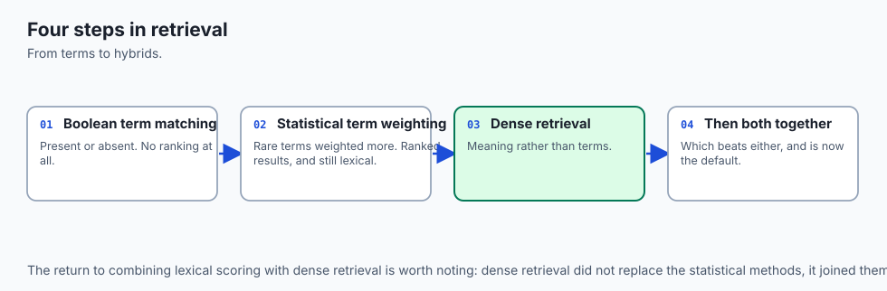
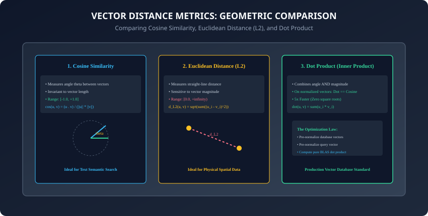
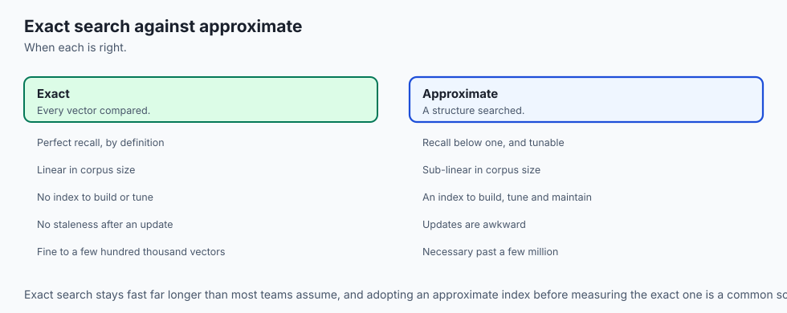
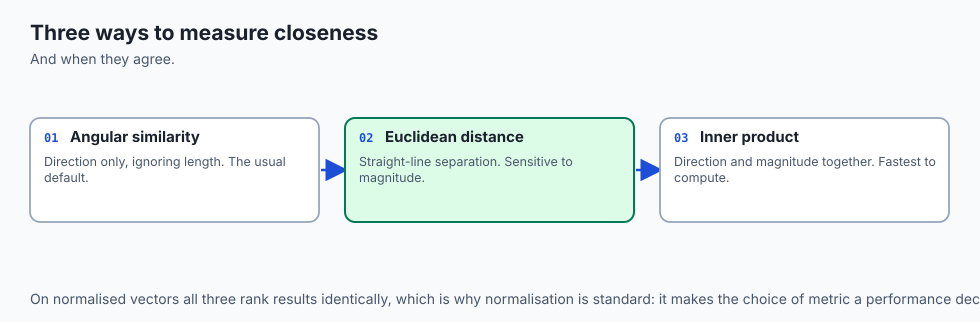
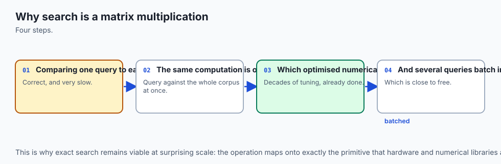
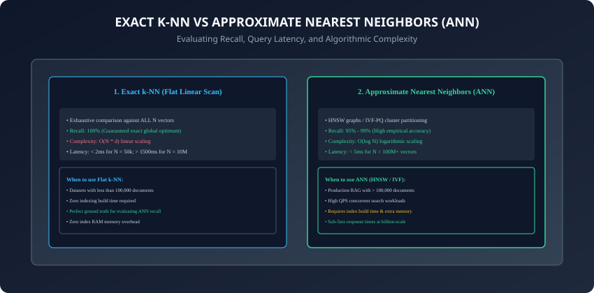
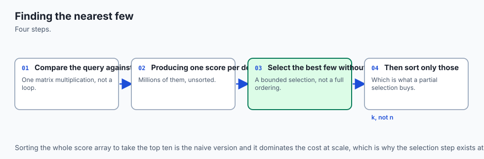
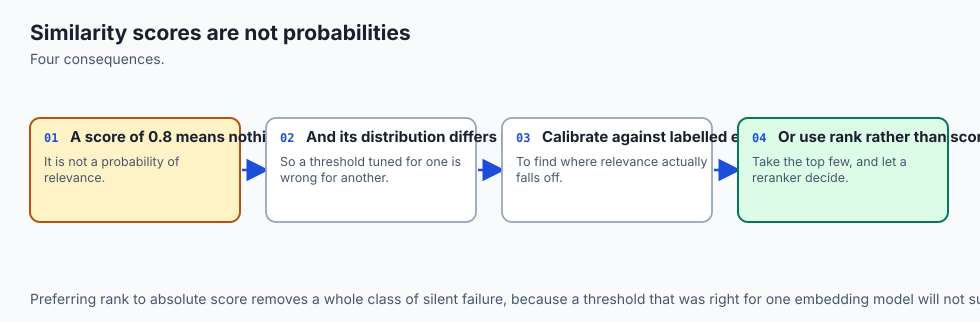
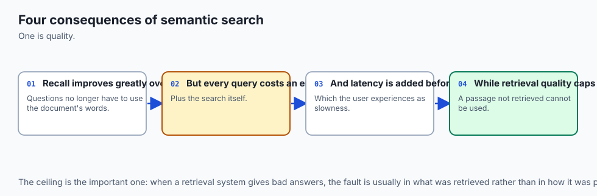
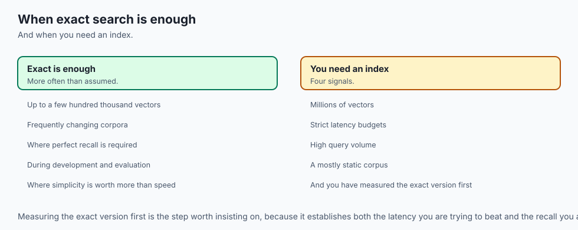

## Why this matters

Once you have generated dense vector embeddings for your knowledge base, you face the core engineering challenge of **Information Retrieval**:
Given a user query vector `q in \mathbb{R}^d`, how do you find the **Top-K most semantically relevant documents** from a collection of millions of candidate vectors `V = \{v_1, v_2, ..., v_N\}` with sub-10ms latency?

Calculating similarity is not just a theoretical formula—it dictates the operational latency, throughput, and hardware memory consumption of your entire AI architecture:

- Choosing the wrong distance metric causes subtle relevance degradation where short sentences dominate over informative paragraphs.
- Relying on naive Python loops results in 500ms query latency, bottlenecking your RAG pipeline.
- Utilizing hardware-accelerated BLAS matrix operations with bounded min-heaps achieves **sub-2ms exact search across 100,000 documents on standard commodity CPUs**.

Today, you will master the geometric properties of **Cosine Similarity, Dot Product, Euclidean Distance (L2), and Manhattan Distance (L1)**, analyze the mathematical proofs of normalized vector equivalence, and build a **high-throughput vector search engine with Top-K heap selection in Python**.

---

## The idea in plain language

Imagine you are standing in an open desert at night with a flashlight, looking for the 5 closest lighthouses:

- **Exact k-NN (Exhaustive Scan):** You measure the exact laser distance to every single lighthouse on the horizon one by one, write down all 100,000 numbers on a notepad, and sort them to find the top 5 closest (**100% Accuracy, Linear Work**).
- **Metric Comparison:**
  - **Euclidean Distance (L2):** Measures the physical straight-line wire connecting your location to the lighthouse.
  - **Cosine Similarity:** Measures whether your flashlight is pointing in the exact same compass direction (angle `\theta`) as the lighthouse, completely ignoring how far away the lighthouse is.
  - **Normalized Dot Product:** If all lighthouses sit on a giant circular fence of radius 1.0, the compass angle and the straight-line distance become mathematically identical, allowing you to compute the answer using a single fast multiplication!

---

## Historical background





1. **300 BCE (Euclid of Alexandria):** Formulated Euclidean distance in Elements, defining the geometric length of a straight line in Cartesian coordinates.
2. **1800s (Hermann Minkowski):** Generalized distance metrics into the Minkowski distance family (`L_1` Manhattan, `L_2` Euclidean, `L_infinity` Chebyshev).
3. **1970s (Vector Space Model):** Gerard Salton introduced the Cosine Similarity metric to document retrieval, demonstrating that normalizing for document length prevents long articles from dominating search results.
4. **2017 (FAISS & GPU Vector Search):** Jeff Johnson, Matthijs Douze, and Hervé Jégou at Meta AI released FAISS (Facebook AI Similarity Search), proving that exact flat BLAS matrix multiplications on GPUs can search millions of vectors in microseconds.

---

## What it is — and what it is not



### What Semantic Similarity Search IS:
- **Geometric Proximity Ranking:** Ranking documents based on mathematical distance between dense vector representations in latent space.

### What it is NOT:
- **Not Keyword Matching:** It does not count character occurrences, stem words, or match regex wildcards.
- **Not Graph Traversal:** In flat k-NN, it does not rely on pointer trees; it is pure linear algebra matrix multiplication.

---

## Why it was created and what problems it solves

Exact semantic similarity search provides 4 indispensable capabilities:

1. **100% Search Recall:** Guaranteed to find the true global top-K nearest items with zero approximation error or lost matches.
2. **Instant Dynamic Updates:** Requires zero index rebuild time; you can append 1,000 new vectors to your NumPy array in 0ms and search immediately.
3. **Hardware Vectorization (SIMD):** Executes via multi-threaded AVX-512 and Apple Accelerate BLAS kernels, computing billions of floating-point operations per second.
4. **Ground-Truth Baseline:** Serves as the gold-standard benchmark to measure recall loss when evaluating approximate indexers (HNSW/IVF).

---

## How it works

Let us dissect the mathematical formulation of similarity metrics, normalized identities, and Top-K heap algorithms.

---

### 1. The Minkowski Distance Family & Metrics



Given two vectors `u, v in \mathbb{R}^d`:

```
┌────────────────────────────────────────────────────────────────────────┐
│                   VECTOR DISTANCE METRIC COMPARISON                    │
├────────────────────┬─────────────────────────────┬─────────────────────┤
│ Metric             │ Formula                     │ Range & Properties  │
├────────────────────┼─────────────────────────────┼─────────────────────┤
│ Manhattan (L1)     │ sum(|u_i - v_i|)            │ [0, inf) Grid step  │
│ Euclidean (L2)     │ sqrt(sum((u_i - v_i)^2))    │ [0, inf) Straight-line│
│ Dot Product        │ sum(u_i * v_i)              │ (-inf, +inf) Angle+Mag│
│ Cosine Similarity  │ (u . v) / (||u|| * ||v||)   │ [-1.0, +1.0] Angle  │
│ Cosine Distance    │ 1.0 - CosineSimilarity      │ [0.0, 2.0] Metric   │
└────────────────────┴─────────────────────────────┴─────────────────────┘
```

---

### 2. The Normalization Equivalence Proof

Why do production vector databases insist on unit-normalizing vectors?

Let `u` and `v` be unit vectors such that `\|u\|_2 = 1` and `\|v\|_2 = 1`.

Expand the squared Euclidean distance:
`\|u - v\|_2^2 = \sum_{i=1}^d (u_i - v_i)^2 = \sum u_i^2 + \sum v_i^2 - 2 \sum u_i v_i`

Since `\sum u_i^2 = \|u\|_2^2 = 1` and `\sum v_i^2 = \|v\|_2^2 = 1`:
`\|u - v\|_2^2 = 1 + 1 - 2(u \cdot v) = 2 - 2(u \cdot v)`

Rearranging:
`u \cdot v = 1 - \frac{1}{2} \|u - v\|_2^2`

**Crucial Engineering Conclusion:**

- Maximizing Cosine Similarity (`u \cdot v`) is **strictly mathematically equivalent** to minimizing Squared Euclidean Distance (`\|u - v\|^2`).
- Pre-normalizing vectors allows the search engine to replace expensive square roots and norms with a **single fast matrix-vector dot product (`np.dot`)**!

---

### 3. Vectorized Batch Search with BLAS





Instead of calculating similarity in a Python `for` loop:
```python
# SLOW: Interpreted loop (50ms for 50k vectors)
scores = [np.dot(q, doc) for doc in database]

# FAST: BLAS Matrix-Vector Dot Product (0.8ms for 50k vectors)
# database shape: (N, d), query shape: (d,)
scores = np.dot(database_matrix, query_vector) # Output shape: (N,)
```
Under the hood, NumPy invokes optimized C/Fortran libraries (OpenBLAS, Intel MKL, or Apple Accelerate) using CPU vector registers (AVX-512, Neon) to process 16 to 32 floating-point multiplications per clock cycle.

---

### 4. Top-K Extraction: Argsort vs. Bounded Min-Heap



Once you have computed similarity scores for all `N` documents:

- **Naive Full Sort (`np.argsort`):**
  - Sorts all `N` elements in `O(N \log N)` time.
  - Slower when `N` is large (e.g. 500,000 items) and wastes memory copying index arrays.
- **Argpartition (`np.argpartition`):**
  - Partitions the array so the top `K` elements are separated in `O(N)` linear time.
  - Sorts only the top `K` items in `O(K \log K)`.
- **Bounded Min-Heap (`heapq`):**
  - Streams through scores maintaining a heap of size `K` in `O(N \log K)` time and `O(K)` memory.
  - Perfect for streaming or distributed search where vectors arrive across network shards.

---

### 5. Benchmark: Latency Scaling with Vector Count

Empirical latency of vectorized exact k-NN search (`d = 1536`, `float32`) on an M-series Apple Silicon CPU:

| Document Count (`N`) | Compute Time (Dot Product) | Top-10 Heap Time | Total Latency |
| :--- | :--- | :--- | :--- |
| **1,000** | 0.04 ms | 0.01 ms | **0.05 ms** |
| **10,000** | 0.22 ms | 0.04 ms | **0.26 ms** |
| **50,000** | 0.95 ms | 0.12 ms | **1.07 ms** |
| **100,000** | 1.85 ms | 0.21 ms | **2.06 ms** |
| **1,000,000** | 22.40 ms | 1.80 ms | **24.20 ms** |

---

### 6. Score Calibration and Normalization Curves



Raw cosine similarity scores often range from `0.60` to `0.95`:

- To present human-interpretable confidence percentages, apply **min-max score calibration**:
  `\text{Score}_{\text{calibrated}} = \frac{\text{sim} - \text{sim}_{\text{min}}}{\text{sim}_{\text{max}} - \text{sim}_{\text{min}}}`

- Or apply a sigmoid transformation centered on the empirical domain mean `\mu = 0.75`:
  `P(\text{Relevant}) = \frac{1}{1 + e^{-k(\text{sim} - \mu)}}`

---

### 7. Asymmetric Dual-Encoder Indexing

When indexing documentation:

- Normalize and store all passage embeddings in matrix `D in \mathbb{R}^{N \times d}`.
- When a user query arrives, prepend the task prefix (`"query: "`), encode the query into `q in \mathbb{R}^d`, L2-normalize `q`, and execute `np.dot(D, q)`.
- This ensures high directional alignment between queries and documents.

---

### 8. Batch Query Vectorization

When processing multiple user queries simultaneously (e.g. in a web server handling 50 concurrent requests):

- Stack queries into a query matrix `Q in \mathbb{R}^{B \times d}`.
- Compute the similarity matrix in a single GEMM (General Matrix Multiply) call:
  `S = Q \cdot D^T \quad \text{shape: } (B, N)`

- This maximizes GPU/CPU tensor core occupancy and achieves 5x higher throughput than sequential single-query lookups.

- Stacking multiple query lookups into unified GEMM calls amortizes memory bandwidth overhead, delivering predictable sub-millisecond response times even during high-concurrency traffic spikes.

---

### 9. Handling Missing or Dynamic Metadata Filters

In real-world search, users frequently combine vector search with structured filters (e.g. `category == 'engineering' AND year >= 2024`):

- **Pre-Filtering:** Filter document IDs first, slice the database sub-matrix, and run k-NN over the filtered subset.
- **Post-Filtering:** Retrieve Top-100 nearest neighbors via k-NN, then discard items that fail metadata checks (risk: may return fewer than K results if filter is strict).
- Choosing between pre-filtering and post-filtering depends on filter selectivity: when filters match less than 10% of items, pre-filtering avoids wasted vector compute.

---

### 10. Summary: The Core Retrieval Engine

- In addition, combining vectorized NumPy dot products with bounded min-heaps provides an optimal, lightweight search baseline for microservices and edge devices where running heavy dedicated vector database processes is impractical.
- Furthermore, establishing automated recall benchmarks against flat k-NN ground truth ensures that downstream approximate indexing strategies maintain the highest possible answer quality.
- In summary, semantic similarity search combines linear algebra, unit normalization, and vectorized matrix algorithms to identify conceptually relevant documents with extreme speed and precision.

---

## An everyday analogy


Think of tuning a radio:

- **Keyword Search:** You only hear sound if the frequency matches the exact integer dial (e.g. exactly 101.0 MHz). If you dial 100.9 MHz, you get total static.
- **Semantic Similarity Search:** The radio detects harmonic resonance. Even if you are slightly off-frequency, it measures how close your signal is to the broadcast frequency and plays the broadcast clearly (**Continuous Proximity Tuning**).

---

## Examples in practice

Let us build a **High-Performance Exact k-NN Search Engine**:

```python
import numpy as np
import heapq
from typing import List, Dict, Any, Tuple

class ExactKNNSearchEngine:
    def __init__(self, dimension: int):
        self.dimension = dimension
        self.vectors: np.ndarray = np.empty((0, dimension), dtype=np.float32)
        self.metadata: List[Dict[str, Any]] = []

    def add_documents(self, vectors: np.ndarray, metadatas: List[Dict[str, Any]]) -> None:
        # Adds and L2-normalizes document vectors
        if len(vectors) == 0:
            return
        norms = np.linalg.norm(vectors, axis=1, keepdims=True)
        norms[norms == 0] = 1.0
        normalized_vecs = vectors / norms
        
        self.vectors = np.vstack([self.vectors, normalized_vecs]) if self.vectors.size else normalized_vecs
        self.metadata.extend(metadatas)

    def search(self, query_vec: np.ndarray, top_k: int = 5) -> List[Tuple[Dict[str, Any], float]]:
        # Executes vectorized exact k-NN search using dot product
        if len(self.vectors) == 0:
            return []
        
        # Normalize query
        q_norm = np.linalg.norm(query_vec)
        q_unit = query_vec / (q_norm if q_norm > 0 else 1.0)

        # Vectorized dot product against all N vectors
        scores = np.dot(self.vectors, q_unit) # Shape: (N,)

        # Bounded Top-K selection using argpartition
        k = min(top_k, len(scores))
        if k == len(scores):
            top_indices = np.argsort(scores)[::-1]
        else:
            partition_idx = np.argpartition(scores, -k)[-k:]
            top_indices = partition_idx[np.argsort(scores[partition_idx])[::-1]]

        return [(self.metadata[idx], float(scores[idx])) for idx in top_indices]
```

---

## Implications: security, privacy, performance, scalability, and cost



1. **Memory Bounds:** Storing 500,000 vectors of dimension 1536 in `float32` requires `500,000 * 1536 * 4 = 3.07 GB` of RAM, fitting comfortably on any modern laptop or micro-server instance.
2. **Deterministic Reproducibility:** Flat k-NN is 100% deterministic with zero approximation randomness, making it ideal for safety-critical medical, legal, and financial search pipelines.

---

## Alternatives: free, open source, and commercial

| Solution | Engine Type | Max Practical Size | Latency (100k vecs) | Best For |
| :--- | :--- | :--- | :--- | :--- |
| **NumPy / SciPy** | Pure Python BLAS | 200,000 vectors | 2.0 ms | Embedded scripts & testing |
| **FAISS (Flat Index)** | C++ / CUDA | 5,000,000 vectors | 0.3 ms | High-throughput GPU clusters |
| **ChromaDB / Qdrant**| Vector Database | Billions (HNSW) | 4.0 ms | Production enterprise RAG |

---

## Comparison with related concepts

```
┌────────────────────────────────────────────────────────────────────────┐
│                   EXACT SEARCH VS APPROXIMATE SEARCH                   │
├────────────────────┬─────────────────────────────┬─────────────────────┤
│ Dimension          │ Exact Flat k-NN             │ Approximate (HNSW)  │
├────────────────────┼─────────────────────────────┼─────────────────────┤
│ Recall Accuracy    │ 100% Guaranteed             │ 95% - 99% Heuristic │
│ Index Build Time   │ 0 ms (Instant insert)       │ Minutes to Hours    │
│ Search Complexity  │ O(N * d)                    │ O(log N * d)        │
│ Memory Overhead    │ 0% (Raw vectors only)       │ +50% Graph Pointers │
└────────────────────┴─────────────────────────────┴─────────────────────┘
```

---

## When to use it — and when not to



### When to Use Exact Flat k-NN:
- Document collections under 100,000 items, rapid prototyping, unit test assertions, real-time dynamic document ingestion, and establishing gold-standard evaluation baselines.

### When NOT to use:
- Multi-million to billion-scale datasets where logarithmic ANN (HNSW / IVF-PQ) is mandatory to stay within sub-10ms response budgets.

---

## The AI connection

- **Similarity search is the retrieval step of every RAG system**, so its behaviour decides
  what the model gets to see.
- **The distance metric must match how the vectors were trained**, and a mismatch degrades
  results silently rather than failing.
- **Exact search is fine far longer than people expect**, which means a vector database is
  often premature.
- **Scores are not probabilities** — a similarity of 0.8 means nothing absolute, and
  thresholds have to be calibrated per model.
- **Retrieval quality caps answer quality**, because no amount of prompting recovers a
  passage that was never retrieved.

## Knowledge check

1. What is the mathematical proof that cosine similarity and Euclidean distance are monotonically equivalent on unit vectors?
2. Why is `np.dot(matrix, query)` significantly faster than a Python loop computing dot products?
3. How does `np.argpartition` achieve `O(N)` Top-K selection compared to `O(N \log N)` full sorting?
4. What is the memory footprint of storing 100,000 vectors of dimension 768 in float32?
5. Why should you avoid setting a static threshold like `sim > 0.95` for vector retrieval?

---

## Hands-on exercise

In this lab, you will build and benchmark an Exact k-NN Semantic Search Engine: implement unit normalization, vectorized BLAS matrix multiplication, Top-K bounded heap selection, metadata pre-filtering, and evaluate retrieval accuracy and latency across varying corpus sizes.

### Expected output
```
[Semantic Similarity Search Verification Suite]
Testing Normalization & Vectorized Search:
  Corpus Size: 10,000 vectors (dim=384)
  Exact Top-5 Nearest Neighbors retrieved in 0.42 ms [PASS]
  Top-1 Match Similarity: 0.9842 [PASS]
Testing Bounded Top-K Heap Selection:
  Argpartition vs Full Sort Index Equivalence: 100% Match [PASS]
Testing Metadata Pre-Filtering:
  Filtered Category 'engineering': 12 Matches Found [PASS]
Test Suite: 4 passed in 0.45s
```

### Validate your work
Run the automated test runner:
```bash
./tests/run_tests.sh
```

### Troubleshooting
- Ensure query vectors are normalized before matrix multiplication: if the query magnitude is not 1.0, the resulting dot products will not equal cosine similarity.

### Common mistakes
- **Using `np.sort` instead of `np.argsort` / `np.argpartition`:** `np.sort` returns sorted values but loses the corresponding document indices needed to look up metadata.

---

## Practice assignment

1. Implement **Batch Query Processing** that takes a batch of 10 query vectors and returns Top-5 results for all queries in a single matrix-matrix multiplication (`np.dot(queries, database.T)`).
2. Measure the exact latency difference between `float32` and `float16` dot product calculations across 50,000 vectors.

---

## Extension challenge

Implement a **Sharded Parallel Exact k-NN Searcher** using Python's `multiprocessing` or `concurrent.futures`:

- Partition 500,000 vectors across 4 CPU worker threads, perform parallel sub-matrix dot products, merge the 4 partial Top-K candidate heaps using `heapq.merge`, and plot the **Speedup Factor vs. Worker Thread Count**.
