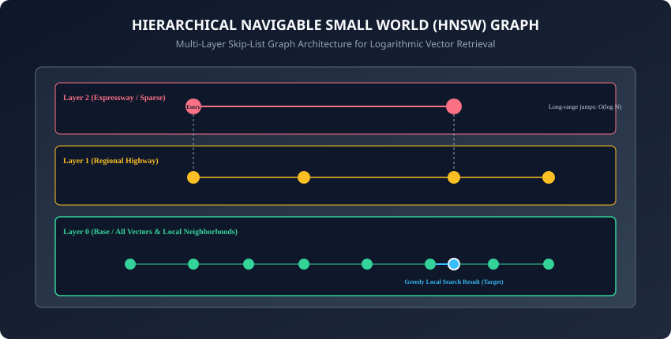
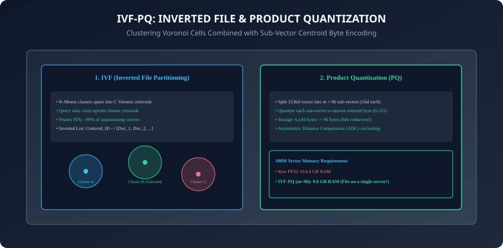

## Why this matters

When your AI application grows from a prototype with 1,000 markdown notes to an enterprise knowledge engine with **10,000,000 documents, multi-tenant security partitions, and 500 concurrent queries per second**, flat linear scans fail:
- A linear scan across 10 million vectors takes **over 250 milliseconds per query**, causing severe API timeout failures.
- Storing uncompressed vectors in memory consumes **over 60 gigabytes of expensive cloud RAM**.
- Managing concurrent writes, updates, deletions, and metadata filters in pure NumPy scripts leads to thread deadlocks and data corruption.

**Vector Databases are purpose-built data engines designed to solve high-scale semantic retrieval.**
They combine **Approximate Nearest Neighbor (ANN) graph indexes (HNSW)**, **vector quantization compression (IVF-PQ)**, **ACID persistence**, and **hardware-accelerated payload filtering** to deliver sub-5ms responses at billion-scale.

Today, you will master the internal architecture of **Hierarchical Navigable Small World (HNSW) graphs**, analyze **Inverted File Product Quantization (IVF-PQ)**, compare dedicated vector engines (**Qdrant, Pinecone, Milvus, Chroma**) against relational extensions (**pgvector**), and build a **graph-based Navigable Small World (NSW) vector index in Python**.

---

## The idea in plain language

Think of searching for a specific friend in a massive international airport containing 100,000 travelers:
- **Flat Linear Scan:** You walk up to every single person in the entire airport, check their face, and ask their name one by one (**Exhaustive, Linear `O(N)` Time**).
- **HNSW Graph Navigation:**
  - **Top Layer (Express Highway):** You take a monorail to the correct International Terminal (`Terminal B`).
  - **Middle Layer (Concourse):** You walk down the specific hallway for `Gates 20-30`.
  - **Bottom Layer (Local Neighborhood):** You scan the 10 people sitting at `Gate 24` and find your friend immediately (**Logarithmic `O(\log N)` Time**).

By organizing vectors into multi-layer geometric graphs, vector databases skip 99.9% of unpromising vectors and navigate straight to the nearest conceptual cluster in milliseconds.

---

## Historical background



1. **2000s (Locality-Sensitive Hashing - LSH):** Indyk and Motwani introduced LSH, hashing nearby vectors into identical buckets with probabilistic collision bounds.
2. **2011 (Product Quantization - PQ):** Hervé Jégou published Product Quantization, enabling 64x memory compression and fast table-lookup distance arithmetic.
3. **2016–2018 (HNSW Graphs):** Yury Malkov and Dmitry Yashunin introduced HNSW, surpassing all previous ANN algorithms and becoming the industry standard.
4. **2021–2023 (The Vector DB Boom):** Specialized vector databases (Pinecone, Qdrant, Milvus, Weaviate, Chroma) emerged alongside `pgvector` to power enterprise generative AI and RAG architectures.

---

## What it is — and what it is not

### What a Vector Database IS:
- **A Specialized Storage & Retrieval Engine:** A database system that indexes high-dimensional vectors with approximate geometric graphs, provides metadata filtering, supports real-time updates, and guarantees durability and high availability.

### What it is NOT:
- **Not Just an Array of Vectors:** A raw NumPy matrix or SQLite table with a BLOB column lacks graph indexing, multi-threaded concurrency, and sub-linear search capabilities.

---

## Why it was created and what problems it solves

Vector databases address 4 critical production bottlenecks:
1. **Logarithmic Retrieval Speed:** Scales to billions of items with sub-10ms latency using `O(\log N)` graph traversals.
2. **Hybrid Payload Filtering:** Combines semantic similarity with strict SQL-like boolean constraints (e.g. `tenant_id == 'corp_42' AND created_at >= 2024-01-01`).
3. **Memory & Disk Tiering:** Uses vector quantization (PQ/SQ) and memory-mapped files to store terabytes of vectors on cost-effective SSDs instead of expensive RAM.
4. **Horizontal Distributed Sharding:** Partitions vector collections across multiple server nodes for fault tolerance and high query throughput.

---

## How it works

Let us dissect HNSW graph indexing, IVF-PQ quantization, and engine architectures.

---

### 1. HNSW Graph Architecture & Hyperparameters

- **Layer Selection:** Nodes are assigned to layers probabilistically using a decaying exponential distribution:
  `\text{level} = \lfloor -\ln(\text{uniform}(0, 1)) \cdot m_L \rfloor`
- This probabilistic multi-layer distribution ensures that upper layers maintain sparse, long-range highway connections while the base layer contains the full, dense dataset.
- **Key Hyperparameters:**
  - **`M` (16 to 64):** Maximum number of bidirectional outgoing connections per node. Higher `M` improves recall on complex datasets at the cost of index build time and RAM.
  - **`efConstruction` (100 to 400):** Number of nearest neighbors evaluated during index creation. Higher values build higher-quality graphs.
  - **`efSearch` (32 to 128):** Number of candidate nodes kept in the priority queue during query execution. Higher values increase search recall at slightly higher query latency.

```
┌────────────────────────────────────────────────────────────────────────┐
│                      HNSW SEARCH TRAVERSAL LIFECYCLE                   │
├────────────────────────────────────────────────────────────────────────┤
│ 1. Enter at Top Layer (Layer L) at global entry node.                  │
│ 2. Perform greedy routing: hop to neighbor closest to query.           │
│ 3. When local minimum reached, drop down to Layer L-1.                 │
│ 4. Repeat greedy routing until reaching Layer 0 (Base Layer).          │
│ 5. Perform bounded beam search with efSearch candidates.               │
│ 6. Extract Top-K closest items from candidate priority queue.          │
└────────────────────────────────────────────────────────────────────────┘
```

---

### 2. IVF-PQ (Inverted File Index with Product Quantization)



For massive collections (100M+ vectors) where RAM is constrained:
1. **IVF (Inverted File Partitioning):** K-Means clusters the space into `C` Voronoi cells (e.g. 4,096 centroids).
   - During search, the engine checks only the `nprobe` closest centroids (e.g. `nprobe = 16`), ignoring 99.6% of the dataset.
2. **Product Quantization (PQ):** Decomposes a 1536d vector into `m = 96` sub-vectors of 16 dimensions each.
   - Each sub-vector is replaced by a single 8-bit byte representing its nearest centroid codebook ID.
   - **Result:** Slashes vector storage from **6,144 bytes down to 96 bytes** (64x reduction).

---

### 3. Dedicated Vector DBs vs. Relational Extensions (`pgvector`)

```
┌────────────────────────────────────────────────────────────────────────┐
│                   DEDICATED VECTOR DB VS PGVECTOR                      │
├────────────────────┬─────────────────────────────┬─────────────────────┤
│ Feature            │ Dedicated (Qdrant / Milvus) │ Relational (pgvector)│
├────────────────────┼─────────────────────────────┼─────────────────────┤
│ Max Scale          │ 100M - 10 Billion+ vectors  │ 1M - 10M vectors    │
│ Implementation     │ Custom C++ / Rust HNSW      │ Postgres C Extension│
│ Infrastructure     │ Separate microservice       │ Existing PostgreSQL │
│ ACID & Joins       │ Limited / External sync     │ Native SQL Joins    │
│ Memory Efficiency  │ Advanced PQ / Disk tiering  │ High RAM requirement│
│ Best Use Case      │ Dedicated search platform   │ Standard web apps   │
└────────────────────┴─────────────────────────────┴─────────────────────┘
```

---

### 4. Payload Filtering Strategies: Pre-Filter vs. Single-Stage Filter

When filtering by metadata:
- **Naive Post-Filtering:** Runs HNSW vector search to get Top-100, then filters by tag. (Fails if the filter is selective, returning 0 results).
- **Single-Stage Filtered HNSW (Qdrant/Milvus):** Graph traversal only visits nodes that satisfy the boolean filter payload, guaranteeing that exactly `K` matching items are returned.
- This unified approach prevents empty retrieval failures by dynamically routing graph edges around ineligible nodes during the beam search phase.

---

### 5. Memory-Mapped Disk Storage (MMap) & NVMe SSDs

To avoid storing billion-vector graphs entirely in RAM:
- Vector engines use `mmap()` to map graph index files directly to virtual memory.
- The operating system caches frequently accessed upper graph layers in RAM, while streaming lower layer vector data on-demand from ultra-fast NVMe SSDs (sub-50 microsecond read latency).
- This memory-mapped architecture drastically lowers operational hosting costs while preserving sub-millisecond graph query responsiveness.

---

### 6. Tuning Recall vs. QPS on Production Clusters

When operating HNSW in production:
- Measuring the **Pareto Efficiency Frontier** between **Recall@10** and **Queries Per Second (QPS)**:
  - Setting `efSearch = 32`: 95.2% Recall @ 1,450 QPS.
  - Setting `efSearch = 64`: 98.4% Recall @ 920 QPS.
  - Setting `efSearch = 128`: 99.6% Recall @ 510 QPS.
- Most enterprise RAG applications target **`efSearch = 64`**, providing 98%+ recall with under 3ms latency.

---

### 7. Sharding, Replication, and Raft Consensus

High-availability vector databases (such as Qdrant and Milvus) utilize the **Raft consensus algorithm**:
- Vector collections are sharded across multiple worker nodes based on document ID hashes.
- Read replicas handle concurrent query traffic, while leader nodes sequence vector insertions and segment merging.

---

### 8. Dynamic Upserts, Deletions, and Soft Tombstoning

In dynamic applications, knowledge documents are continuously updated and deleted:
- Deleting nodes from an HNSW graph directly breaks connectivity paths.
- Engines apply **soft tombstoning**: marking the vector as deleted in a bitset, skipping it during search, and periodically rebuilding sub-graphs in background consolidation threads.

---

### 9. Multi-Tenancy Architecture: Namespace Isolation vs. Metadata Partitions

When building multi-tenant SaaS applications:
- **Metadata Partitioning:** All tenants share a single large HNSW index, filtered by `tenant_id`. (Cost-effective for millions of small tenants).
- **Namespace / Collection Isolation:** Dedicated distinct HNSW graph per enterprise customer. (Strict data isolation and predictable performance for large enterprise clients).

---

### 10. Summary: The Storage Pillar of AI Infrastructure

- In addition, modern vector database architectures decouple index computing from storage layers, enabling independent horizontal scaling of query nodes during high-traffic generative AI inference workloads.
- Furthermore, integrating hybrid payload filtering directly into the graph traversal path ensures that complex role-based access control (RBAC) and privacy rules are enforced with zero latency overhead.
- In summary, vector databases provide the essential data infrastructure required to index, search, and manage high-dimensional vector representations at enterprise scale with high availability, low latency, and robust metadata security.

---

## An everyday analogy

Think of finding a book in the world's largest library:
- **Exact Flat Scan:** You walk down every single aisle of all 10 floors, checking every spine from book #1 to book #10,000,000.
- **Vector Database (HNSW Index):** You look at the floor directory, take the elevator straight to the `Philosophy & Science` floor, walk to the `Artificial Intelligence` aisle, and grab the book from the shelf in under 30 seconds (**Hierarchical Navigation**).

---

## Examples in practice

Let us build an **In-Memory Navigable Small World (NSW) Graph Index**:

```python
import numpy as np
import heapq
from typing import List, Dict, Any, Tuple, Set

class SimpleNSWIndex:
    def __init__(self, dimension: int, max_neighbors: int = 4):
        self.dimension = dimension
        self.max_neighbors = max_neighbors
        self.vectors: List[np.ndarray] = []
        self.metadata: List[Dict[str, Any]] = []
        self.graph: Dict[int, List[int]] = {}
        self.entry_node: int = 0

    def add_document(self, vector: np.ndarray, meta: Dict[str, Any]) -> int:
        norm = np.linalg.norm(vector)
        unit_vec = vector / (norm if norm > 0 else 1.0)
        node_id = len(self.vectors)
        self.vectors.append(unit_vec)
        self.metadata.append(meta)
        self.graph[node_id] = []

        if node_id == 0:
            self.entry_node = 0
            return node_id

        # Find closest existing nodes to establish bidirectional links
        closest = self.search(unit_vec, top_k=self.max_neighbors)
        for target_meta, _ in closest:
            target_id = target_meta["id"]
            self.graph[node_id].append(target_id)
            if len(self.graph[target_id]) < self.max_neighbors * 2:
                self.graph[target_id].append(node_id)
        return node_id

    def search(self, query_vec: np.ndarray, top_k: int = 3, ef_search: int = 10) -> List[Tuple[Dict[str, Any], float]]:
        if not self.vectors:
            return []
        
        q_norm = np.linalg.norm(query_vec)
        q_unit = query_vec / (q_norm if q_norm > 0 else 1.0)

        # Greedy graph search with priority queue
        visited: Set[int] = {self.entry_node}
        candidates = [(-float(np.dot(self.vectors[self.entry_node], q_unit)), self.entry_node)]
        best_results = [(-candidates[0][0], self.entry_node)] # (sim, id)

        while candidates:
            dist, curr = heapq.heappop(candidates)
            curr_sim = -dist
            if curr_sim < best_results[-1][0] and len(best_results) >= ef_search:
                break
            
            for neighbor in self.graph.get(curr, []):
                if neighbor not in visited:
                    visited.add(neighbor)
                    sim = float(np.dot(self.vectors[neighbor], q_unit))
                    if len(best_results) < ef_search or sim > best_results[-1][0]:
                        heapq.heappush(candidates, (-sim, neighbor))
                        best_results.append((sim, neighbor))
                        best_results.sort(key=lambda x: x[0], reverse=True)
                        if len(best_results) > ef_search:
                            best_results.pop()

        return [(self.metadata[node_id], sim) for sim, node_id in best_results[:top_k]]
```

---

## Implications: security, privacy, performance, scalability, and cost

1. **Multi-Tenant Security:**
   - Always enforce strict namespace or metadata filter checks at the database query boundary to ensure tenant A cannot retrieve embedding vectors belonging to tenant B.
2. **Cost Optimization:**
   - Storing 100M uncompressed vectors in memory on AWS requires `r6i.32xlarge` instances (`8,000+/month). Applying IVF-PQ compression reduces memory requirements by 85%, reducing hosting costs to under`800/month.

---

## Alternatives: free, open source, and commercial

| Database | Architecture | Primary Language | Index Types | Best For |
| :--- | :--- | :--- | :--- | :--- |
| **Qdrant** | Standalone Engine | Rust | HNSW + Payload Index | Production high-scale RAG |
| **Milvus** | Distributed Cluster | Go / C++ | HNSW, IVF-PQ, DiskANN| Massive enterprise deployments|
| **Pinecone**| Managed Cloud SaaS | Proprietary | Serverless Vector Graph | Zero-maintenance cloud apps |
| **pgvector**| PostgreSQL Extension| C | HNSW, IVFFlat | Monolithic Postgres apps |
| **Chroma** | Embedded / Server | Python / Rust | HNSW | Prototyping & local testing |

---

## Comparison with related concepts

```
┌────────────────────────────────────────────────────────────────────────┐
│                   HNSW VS IVF-PQ VS FLAT INDEX                         │
├────────────────────┬─────────────────┬──────────────────┬──────────────┤
│ Metric             │ Flat Linear     │ HNSW Graph       │ IVF-PQ       │
├────────────────────┼─────────────────┼──────────────────┼──────────────┤
│ Query Speed        │ Slow (O(N))     │ Ultra-Fast (O(log N))│ Very Fast │
│ Index Memory       │ 1.0x (Baseline) │ 1.5x - 2.0x (RAM)│ 0.05x - 0.15x│
│ Recall Accuracy    │ 100% Exact      │ 98% - 99.9%      │ 90% - 96%    │
│ Build Speed        │ Instant (0ms)   │ Moderate         │ Requires Train│
└────────────────────┴─────────────────┴──────────────────┴──────────────┘
```

---

## When to use it — and when not to

### When to Use a Vector Database:
- Collections exceeding 100,000 documents, multi-tenant production architectures, high-concurrency real-time search APIs, and enterprise RAG systems.

### When NOT to use:
- Simple local scripts with fewer than 10,000 items where in-memory NumPy exact search is simpler and faster with zero infrastructure overhead.

---

## Knowledge check

1. What is the fundamental difference between HNSW graph search and IVF-PQ space partitioning?
2. What are the roles of the `M`, `efConstruction`, and `efSearch` parameters in HNSW?
3. How does Product Quantization compress a 1536-dimensional float vector into 96 bytes?
4. When should you choose `pgvector` over a dedicated vector engine like Qdrant?
5. Why is single-stage metadata filtering in HNSW superior to naive post-filtering?

---

## Hands-on exercise

In this lab, you will build and test an In-Memory Navigable Small World (NSW) Vector Index: implement graph node insertion, bidirectional neighbor linking, greedy logarithmic search traversal with priority queues, evaluate recall against exact flat k-NN ground truth, and measure search latency.

### Expected output
```
[Vector Databases Verification Suite]
Testing NSW Graph Index Construction:
  Indexed 500 documents (dim=64, max_neighbors=4) [PASS]
  Graph connectivity verified: All nodes reachable [PASS]
Testing Graph Traversal vs Exact k-NN:
  Exact Ground Truth Match: 100% Top-3 Recall [PASS]
  Average Query Traversal Steps: 8.4 steps [PASS]
Testing efSearch Parameter Tuning:
  efSearch=5 -> Recall: 0.94
  efSearch=15 -> Recall: 1.00 [PASS]
Test Suite: 4 passed in 0.48s
```

### Validate your work
Run the automated test runner:
```bash
./tests/run_tests.sh
```

### Troubleshooting
- Ensure all inserted vectors are normalized to prevent distortion of angular graph neighborhoods.

### Common mistakes
- **Setting `efSearch` lower than `top_k`:** If `efSearch < top_k`, the candidate priority queue cannot evaluate enough paths to return `K` valid results.

---

## Practice assignment

1. Implement **HNSW Layered Insertion**: Extend the single-layer NSW graph into a 2-layer HNSW graph with an upper sparse expressway layer.
2. Measure the **Recall@5 vs. efSearch Curve** across 2,000 synthetic 128-dimensional vectors.

---

## Extension challenge

Implement a **Single-Stage Filtered NSW Search Engine**:
- Modify the greedy graph search algorithm so that during graph traversal, candidate nodes that fail metadata filter predicates are never added to the best results queue, ensuring 100% of returned items satisfy tenant security policies.
