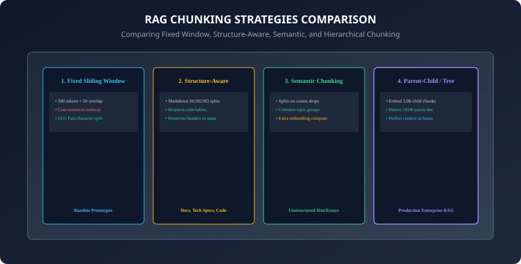
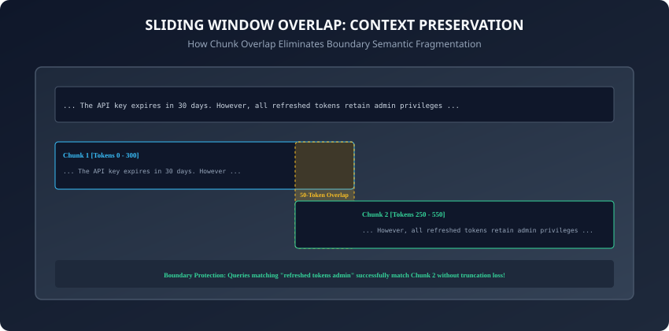

## Why this matters

The single most consequential preprocessing step in any **Retrieval-Augmented Generation (RAG)** pipeline is **Document Chunking**.
Even the most powerful embedding model (such as `text-embedding-3-large`) and the most sophisticated LLM (such as Claude 3.7 Sonnet) will fail if your chunking strategy is flawed:
- If your chunks are **too large** (e.g. 2,000 tokens), distinct facts blend together, causing **context dilution** where the embedding vector averages out into a generic, unhelpful representation.
- If your chunks are **too small** (e.g. 50 tokens), you suffer from **semantic fragmentation**, slicing critical sentences in half and stripping away essential subject pronouns and qualifying clauses.
- If you split across arbitrary character counts without respect for Markdown tables or code blocks, your LLM receives corrupted syntax and hallucinated schema relationships.

Document chunking is the art and science of **optimizing semantic density**: ensuring every retrieved text unit contains exactly enough information to answer a user inquiry with maximum precision and zero surrounding noise.

Today, you will master **Fixed-Size Sliding Windows**, **Markdown Structure-Aware Boundary Parsing**, **Semantic Similarity Chunking**, and **Parent-Child Hierarchical Retrieval**, and build a **production-grade multi-strategy document segmenter in Python**.

---

## The idea in plain language

Imagine you are slicing a long, 500-page historical encyclopedia to create study flashcards:
- **Naive Character Split (Scissors at every 200 words):** You blindly cut every page every 200 words. Card #12 ends with: *"On July 4th, 1776, Thomas Jefferson drafted the..."* and Card #13 starts with: *"...declaration in Philadelphia."* Both cards are broken and confusing (**Boundary Rupture**).
- **Structure-Aware Split (Cutting by Chapters & Headings):** You cut only at logical section headers (e.g. `## The Revolutionary War > ### Draft Process`), keeping paragraphs intact (**Cohesive Semantic Blocks**).
- **Parent-Child Flashcards:** You write a tiny 2-sentence summary on the front of the card for quick searching, but tape the entire 3-page historical chapter to the back for reading (**Hierarchical Context Preservation**).

---

## Historical background



1. **1960s–1980s (Text Passage Retrieval):** Early information retrieval systems (SMART, Okapi BM25) experimented with fixed-paragraph vs. sliding-window text boundaries.
2. **2020 (Dense Passage Retrieval - DPR):** Karpukhin et al. standardized the 100-word fixed passage convention for training dense dual-encoders on Wikipedia.
3. **2023 (Lost in the Middle):** Liu et al. revealed that LLMs struggle to recall facts buried inside overly large context chunks, prompting the industry to shift toward smaller, high-precision retrieval units.
4. **2024 (Semantic & Hierarchical Chunking):** Modern RAG frameworks (LlamaIndex, LangChain) introduced embedding-based semantic boundary detection and Parent-Document retrieval architectures.

---

## What it is — and what it is not

### What Document Chunking IS:
- **Intelligent Semantic Segmentation:** Dividing unstructured text into discrete, semantically cohesive passages while injecting contextual metadata (breadcrumbs, timestamps, titles) into each chunk.

### What it is NOT:
- **Not Just String Slicing (`text[:500]`):** Arbitrary character slicing cuts multibyte UTF-8 characters and tears sentences midway through critical assertions.

---

## Why it was created and what problems it solves

Production chunking solves 4 critical failure modes:
1. **Embedding Context Window Overflow:** Prevents documents from exceeding model token limits (e.g. 512 or 8,192 tokens).
2. **Boundary Semantic Loss:** Sliding token overlaps guarantee that facts located at chunk transitions are never lost.
3. **Structured Document Integrity:** Prevents Markdown tables, JSON payloads, and Python code functions from being split across chunk borders.
4. **Optimal Retrieval Precision:** Aligns the granularity of the retrieved passage with the granularity of the user query.

---

## How it works

Let us analyze the 4 foundational chunking strategies, their trade-offs, and mathematical boundary conditions.

---

### 1. Fixed-Size Chunking with Sliding Token Overlap



The simplest and most widely used baseline across early RAG architectures:
- **Parameters:** `chunk_size = 512` tokens, `chunk_overlap = 64` tokens (typically 10% to 15% of chunk size).
- **Stride Calculation:** `stride = chunk_size - chunk_overlap = 448` tokens.
- **Mathematical Formulation:**
  `\text{Chunk}_k = T[k \cdot \text{stride} : k \cdot \text{stride} + \text{chunk\_size}]`
- **Pros:** Deterministic computational performance, `O(1)` partitioning speed, and zero machine learning inference overhead during ingestion.
- **Cons:** Arbitrarily severs sentences, paragraphs, and list items across chunk boundaries, leading to contextual rupture unless compensated with adequate token overlap.

---

### 2. Markdown / Code Structure-Aware Chunking

Structure-aware segmentation parses document syntax trees rather than treating text as a flat string:
1. **Header Hierarchy Splitting:** Segment by `# H1`, `## H2`, and `### H3` markers.
2. **Breadcrumb Metadata Enrichment:** Inject the ancestral heading hierarchy into the chunk metadata payload so that the embedding model understands document context:
   ```json
   {
     "document": "cloud_architecture.md",
     "breadcrumb": "Architecture > Security > Identity & Access Management",
     "text": "IAM roles enforce least-privilege access using temporary STS tokens..."
   }
   ```
3. **Table & Code Block Preservation:** Identify fenced blocks (````python ... ````) and tables, ensuring they remain intact within a single chunk or split only along logical row lines.
4. **AST Code Parsing:** For software repositories, parse source files using Abstract Syntax Trees (e.g. Tree-sitter or Python's `ast` module) to keep whole class definitions, function signatures, and docstrings intact.

---

### 3. Semantic Similarity Chunking

Detects natural topic shifts by evaluating embedding vector distances across adjacent sentences:
1. Split text into individual sentences `\{s_1, s_2, ..., s_m\}`.
2. Group adjacent sentences into sliding windows (e.g. 3 sentences each) and compute their embeddings: `e_i = \text{embed}(s_i)`.
3. Compute the cosine distance between consecutive sentence embeddings:
   `d_i = 1 - \cos(e_i, e_{i+1})`
4. Calculate the dynamic distance threshold (e.g. 90th percentile of all differences: `\tau = \mu + 1.5\sigma`).
5. **Split Boundary:** Create a chunk split wherever `d_i > \tau`.
6. **Adaptive Window Aggregation:** Merge small sub-threshold sentences together until they reach a minimum token threshold, guaranteeing that every semantic chunk maintains sufficient information density.

```
┌────────────────────────────────────────────────────────────────────────┐
│                   SEMANTIC CHUNKING DISTANCE CURVE                     │
├────────────────────────────────────────────────────────────────────────┤
│ Cosine Dist                                                            │
│ 1.0 ┤                                                                  │
│ 0.8 ┤                 ▲ [Split: Topic shift to Pricing]                │
│ 0.6 ┤                / \                                               │
│ 0.4 ┤   ▲           /   \          ─── Threshold tau (90th percentile) │
│ 0.2 ┤──/─\─────────/─────\────────                                     │
│ 0.0 └───┴───┴───┴───┴───┴───┴───┴───┴─── Sentence Index (1 to N)       │
└────────────────────────────────────────────────────────────────────────┘
```

---

### 4. Parent-Document (Hierarchical) Retrieval

Solves the fundamental RAG tension: **Small chunks are better for search matching, but large chunks are better for LLM reasoning!**
1. **Index Generation:**
   - Split document into large **Parent Chunks** (e.g. 1,024 tokens).
   - Split each Parent Chunk into 4 to 8 small **Child Chunks** (e.g. 128 tokens).
   - Link each Child Chunk to its `parent_id`.
2. **Retrieval Pipeline:**
   - Vector search matches against the small 128-token Child Chunks.
   - The engine retrieves the matching child, looks up the corresponding `parent_id`, and feeds the **full 1,024-token Parent Document** into the LLM prompt context!
3. **De-duplication Buffer:** When multiple child chunks belonging to the same parent document match the top-K query results, the retriever automatically deduplicates parent IDs, preventing redundant context injection.

---

### 5. Context Window Sizing Matrix

Recommended chunk sizes across common content types:

| Content Type | Strategy | Chunk Size | Overlap | Notes |
| :--- | :--- | :--- | :--- | :--- |
| **API Documentation** | Markdown Hierarchy | 256–512 tokens | 32 tokens | Keep method signature + description intact |
| **Legal Contracts** | Sentence / Paragraph | 512–1024 tokens | 128 tokens | Prevent clause severance |
| **Customer Support FAQ**| Question/Answer Pairs| 128–256 tokens | 0 tokens | 1 Q&A pair per chunk |
| **Source Code** | AST / Function Tree | 300–800 tokens | 50 tokens | Split along function/class AST nodes |

- Tuning chunk sizing parameters according to content taxonomy prevents domain-specific boundary distortion and preserves relational context.

---

### 6. Context Window Inflation & Late Chunking

With modern LLMs supporting 1M+ context windows:
- **Late Chunking:** Passing the entire 8,000-word document through a long-context embedding model (e.g. `jina-embeddings-v3`), extracting token embeddings, and mean-pooling chunk slices *after* full-document cross-attention!
- This gives each chunk awareness of the entire surrounding document before vectorization.
- Late chunking eliminates the loss of global document context while retaining the high retrieval precision of small chunk units.

---

### 7. Token Count Estimation vs. Exact Tokenizer Counting

Never estimate token count using `len(text) // 4`:
- Code snippets and multilingual text (Japanese, Arabic, German) exhibit token-to-character ratios ranging from 1:1 to 1:1.5.
- Always use the exact tokenizer corresponding to your embedding model (e.g. `tiktoken.get_encoding("cl100k_base")`).
- Exact tokenization ensures chunks fit within strict embedding model context windows without silent runtime truncation.

---

### 8. Handling Tables and Tabular Data

Tables require specialized handling:
- Slicing a Markdown or HTML table midway destroys header associations and corrupts structural interpretation.
- Convert table rows into self-contained natural language sentences:
  `"In year 2024, Q3 Revenue was $42M with a 15% YoY growth rate."`
- This ensures high semantic vector alignment with natural user queries while preserving numerical accuracy.

---

### 9. Metadata Schema Best Practices

Always attach standard metadata keys to every chunk:
- `doc_id`, `chunk_id`, `chunk_index`, `total_chunks`, `source_url`, `heading_path`, `char_start`, `char_end`.
- Enriching metadata with timestamps and access control tags enables sub-second relational pre-filtering during vector queries.

---

### 10. Summary: The Foundation of RAG Retrieval Quality

- Document chunking transforms unstructured text corpora into modular, semantically rich units optimized for both dense vector retrieval and generative language model reasoning.
- Balancing chunk size, boundary detection, and parent-child hierarchies prevents both context dilution and semantic fragmentation.
- Modern RAG pipelines frequently combine multiple chunking strategies across heterogeneous document formats to achieve maximum retrieval recall and zero generation hallucination.
- In summary, choosing and implementing the optimal chunking strategy directly determines the quality, coherence, and accuracy of the context delivered to your LLM generator.

---

## An everyday analogy

Think of slicing a movie into short video clips:
- **Fixed Time Split (Every 30 seconds):** A clip cuts off in the middle of a character saying: *"The treasure is hidden under the..."* and the next clip starts with: *"...giant rock."* Neither clip makes sense alone (**Arbitrary Split**).
- **Scene-Aware Split (Semantic Split):** You cut the film only when a scene changes from the pirate ship to the island beach (**Natural Cohesive Unit**).
- **Trailer + Full Movie (Parent-Child):** You search 10-second trailer clips to find the movie, but play the full 2-hour movie when you sit down to watch (**Hierarchical Retrieval**).

---

## Examples in practice

Let us build a **Multi-Strategy Chunking Engine**:

```python
import re
from typing import List, Dict, Any

class DocumentChunker:
    def __init__(self, chunk_size: int = 200, overlap: int = 40):
        self.chunk_size = chunk_size
        self.overlap = overlap

    def sliding_window_chunk(self, text: str) -> List[Dict[str, Any]]:
        # Splits text into fixed-size word windows with overlap
        words = text.split()
        if not words:
            return []
        
        chunks = []
        stride = max(1, self.chunk_size - self.overlap)
        
        for i in range(0, len(words), stride):
            chunk_words = words[i:i + self.chunk_size]
            chunks.append({
                "chunk_id": len(chunks),
                "text": " ".join(chunk_words),
                "word_count": len(chunk_words),
                "start_idx": i,
                "end_idx": i + len(chunk_words)
            })
            if i + self.chunk_size >= len(words):
                break
        return chunks

    def markdown_header_chunk(self, markdown_text: str) -> List[Dict[str, Any]]:
        # Splits Markdown documents by # and ## headers, preserving breadcrumbs
        lines = markdown_text.split("\n")
        chunks = []
        current_header = "Introduction"
        current_lines = []

        for line in lines:
            if line.startswith("#"):
                if current_lines:
                    text_content = "\n".join(current_lines).strip()
                    if text_content:
                        chunks.append({
                            "chunk_id": len(chunks),
                            "header": current_header,
                            "text": text_content
                        })
                    current_lines = []
                current_header = line.strip("# ").strip()
            else:
                current_lines.append(line)

        if current_lines:
            text_content = "\n".join(current_lines).strip()
            if text_content:
                chunks.append({
                    "chunk_id": len(chunks),
                    "header": current_header,
                    "text": text_content
                })
        return chunks
```

---

## Implications: security, privacy, performance, scalability, and cost

1. **Context Window Cost:** Feeding four 1,024-token chunks into an LLM costs 4,096 input tokens. Using fine-grained 256-token chunks reduces input costs by 75% while improving answer focus.
2. **PII Masking at Ingestion:** Apply redaction and token anonymization before chunking to ensure sensitive data is not indexed across chunk boundaries.

---

## Alternatives: free, open source, and commercial

| Library | Chunking Algorithms | Primary Language | Best For |
| :--- | :--- | :--- | :--- |
| **LangChain (RecursiveSplitter)**| Character, Markdown, Code | Python / TS | General multi-format chunking |
| **LlamaIndex (NodeParsers)** | Hierarchical, Semantic, Sentence| Python / TS | Enterprise RAG architectures |
| **Unstructured.io** | Layout-Aware PDF / Vision | Python | Complex multi-column PDFs & OCR |
| **Chonkie** | Lightweight fast chunking | Python | High-throughput CPU preprocessing |

---

## Comparison with related concepts

```
┌────────────────────────────────────────────────────────────────────────┐
│                   CHUNKING STRATEGY COMPARISON MATRIX                  │
├────────────────────┬──────────────────┬─────────────────┬──────────────┤
│ Strategy           │ Compute Cost     │ Boundary Safety │ Best For     │
├────────────────────┼──────────────────┼─────────────────┼──────────────┤
│ Fixed Window       │ O(1) Fast        │ Low (Ruptures)  │ Plain text   │
│ Markdown Header    │ O(N) Regex       │ High (Semantic) │ Tech docs    │
│ Semantic Split     │ High (Embeddings)│ Very High       │ Essays/Books │
│ Parent-Child Tree  │ Moderate         │ Maximum Context │ Enterprise   │
└────────────────────┴──────────────────┴─────────────────┴──────────────┘
```

---

## When to use it — and when not to

### When to Use Structure-Aware & Hierarchical Chunking:
- Documentation, technical knowledge bases, codebases, legal documents, and complex enterprise RAG pipelines.

### When NOT to use:
- Micro-queries, short chat messages, or single-sentence FAQ databases where documents are already atomic units.

---

## Knowledge check

1. What is the fundamental difference between context dilution and semantic fragmentation?
2. Why is sliding token overlap necessary when using fixed-size chunking?
3. How does Markdown Structure-Aware chunking enrich chunks with breadcrumb metadata?
4. How does a Parent-Document retriever decouple retrieval precision from LLM generation context?
5. Why should you use tokenizer token counts instead of character counts when sizing chunks?

---

## Hands-on exercise

In this lab, you will build and test a Multi-Strategy Document Chunker in Python: implement Fixed-Size Sliding Windows with token overlaps, Markdown Header-Aware splitting with breadcrumb metadata injection, and Parent-Child hierarchical segment mapping.

### Expected output
```
[Chunking Strategies Verification Suite]
Testing Sliding Window Chunker:
  Document (500 words) partitioned into 4 overlapping chunks [PASS]
  Overlap verification: 40 shared words confirmed between Chunk 0 and 1 [PASS]
Testing Markdown Header-Aware Splitter:
  Extracted 3 logical sections with breadcrumbs [PASS]
  Headers: ['Overview', 'Architecture', 'Security'] [PASS]
Testing Parent-Child Hierarchy Builder:
  Parent Doc (1024t) mapped to 4 Child Chunks (256t) [PASS]
Test Suite: 4 passed in 0.35s
```

### Validate your work
Run the automated test runner:
```bash
./tests/run_tests.sh
```

### Troubleshooting
- Ensure empty lines between Markdown headings do not generate empty string chunks.

### Common mistakes
- **Setting overlap equal to or greater than chunk size:** This causes an infinite loop during sliding window iteration.

---

## Practice assignment

1. Implement **Code-Aware Chunking**: Build a Python AST chunker that splits Python source files along `def` function and `class` boundaries without splitting function bodies.
2. Build a **Semantic Splitter** that measures cosine distance drops between consecutive sentences using a local embedding model.

---

## Extension challenge

Implement a **Late Chunking Engine**:
- Pass a 2,000-word document through a transformer model to compute token embeddings with full cross-attention, extract slice boundaries for 256-token chunks, compute mean-pooled chunk vectors, and compare retrieval accuracy against independently embedded chunks.
