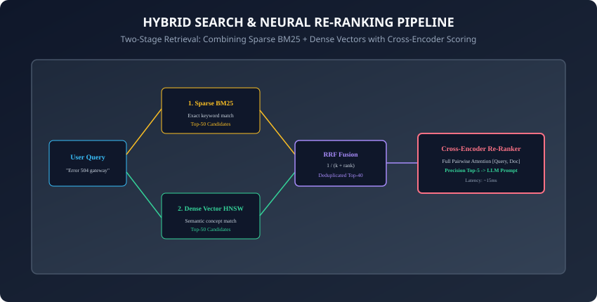
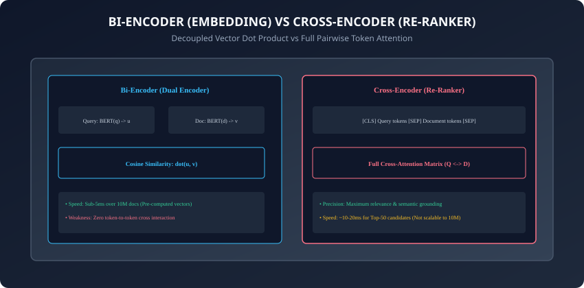

## Why this matters

In production Retrieval-Augmented Generation (RAG) systems, relying exclusively on dense vector similarity search creates severe, predictable blind spots:
- When a user searches for an exact alphanumeric product code, SKU, or error code (e.g. `ERR_504_GW_TIMEOUT`), dense embedding models map the query to generic "network errors", completely missing the exact technical manual page.
- Conversely, when a user searches with conversational synonyms (e.g. *"how do I fix sluggish page loads?"*), pure keyword search (BM25) returns zero results if the manual uses the term *"latency optimization"*.

**Hybrid Search & Re-Ranking is the gold standard architecture that bridges this divide.**
By combining **Sparse Keyword Search (BM25)** with **Dense Semantic Vector Search (HNSW)** via **Reciprocal Rank Fusion (RRF)**, and passing the merged candidates through a **Cross-Encoder Neural Re-Ranker**, you achieve near-perfect retrieval recall and precision across both exact keyword and abstract semantic queries.

Today, you will master the mechanics of **BM25 term weighting**, **Reciprocal Rank Fusion**, **Cross-Encoder pairwise cross-attention**, and **ColBERT late interaction**, and build an **end-to-end Hybrid Search & Re-Ranking engine in Python**.

---

## The idea in plain language

Think of hiring a senior software architect from a candidate pool of 10,000 applicants:
- **Stage 1A (Lexical Filter - BM25):** An automated keyword scanner filters for resumes explicitly mentioning `Kubernetes`, `Rust`, and `PostgreSQL` (50 candidates).
- **Stage 1B (Semantic Filter - Vector Search):** An AI recruiter matches candidates whose career descriptions reflect "distributed systems leadership" (50 candidates).
- **Reciprocal Rank Fusion (RRF):** You merge both candidate lists, prioritizing applicants who ranked high in both filters (Deduplicated Top-40 pool).
- **Stage 2 (Re-Ranker - Cross-Encoder):** The CTO personally conducts a deep 1-on-1 technical interview with the Top-40 candidates, analyzing their exact capabilities to select the Top-3 finalists (**High-Precision Re-Ranking**).

---

## Historical background



1. **1994 (Okapi BM25):** Stephen Robertson and Karen Spärck Jones introduced BM25, establishing the definitive probabilistic term-frequency ranking standard.
2. **2009 (Reciprocal Rank Fusion - RRF):** Cormack et al. proved that summing inverse rank positions outperforms complex score calibration across heterogeneous search engines.
3. **2019 (BERT Cross-Encoders):** Nogueira and Cho demonstrated that passing `[Query, Passage]` pairs through BERT with full cross-attention yields dramatic gains over dual encoders.
4. **2020 (ColBERT Late Interaction):** Khattab and Zaharia introduced token-level MaxSim late interaction, achieving Cross-Encoder quality at Bi-Encoder speeds.
5. **2023–2024 (Modern RAG Standards):** Commercial engines (Qdrant, Cohere, Pinecone) integrated hybrid sparse-dense fusion and dedicated neural re-ranking endpoints.

---

## What it is — and what it is not

### What Hybrid Search & Re-Ranking IS:
- **A Two-Stage Retrieval Pipeline:** A system combining fast high-recall candidate generation (Sparse BM25 + Dense Vectors) with a computationally intensive high-precision re-ranking stage (Cross-Encoder).

### What it is NOT:
- **Not Just Vector Search:** Pure vector search ignores exact keyword tokens. Hybrid search explicitly balances lexical and semantic signals.

---

## Why it was created and what problems it solves

Hybrid search and re-ranking solve 4 critical enterprise retrieval challenges:
1. **The Out-of-Vocabulary / SKU Problem:** Catches exact alphanumeric identifiers, error codes, and entity names that embeddings fail to resolve.
2. **The Synonym & Paraphrase Problem:** Recovers documents discussing identical concepts using different vocabulary.
3. **Score Incompatibility:** Reciprocal Rank Fusion merges disparate scoring regimes (BM25 floats from 0 to 50 vs. Cosine similarities from 0 to 1) without calibration errors.
4. **Elimination of False Positives:** Neural cross-encoders weed out passages that share semantic keywords but fail to answer the user's specific question.

---

## How it works

Let us dissect the mathematical formulation of BM25, RRF rank aggregation, and Cross-Encoder attention mechanics.

---

### 1. BM25 (Best Matching 25) Sparse Lexical Scoring

BM25 calculates the relevance score of document `D` for query `Q` using term frequencies and inverse document frequencies:

`\text{Score}(D, Q) = \sum_{i=1}^{n} \text{IDF}(q_i) \cdot \frac{f(q_i, D) \cdot (k_1 + 1)}{f(q_i, D) + k_1 \cdot <=ft(1 - b + b \cdot \frac{|D|}{\text{avgdl}}\right)}`

- **`f(q_i, D)`:** Frequency of term `q_i` in document `D`.
- **`|D| / \text{avgdl}`:** Document length normalized by average corpus document length.
- **`k_1` (typically 1.2 to 2.0):** Controls term frequency saturation.
- **`b` (typically 0.75):** Controls document length penalization.

---

### 2. Reciprocal Rank Fusion (RRF) Formulation

When merging candidate lists from BM25 and Dense Vector search:

`\text{RRF\_Score}(d) = \sum_{m in M} \frac{1}{k + r_m(d)}`

- **`M`:** Set of retrieval systems (e.g. `\{ \text{BM25}, \text{Dense} \}`).
- **`r_m(d)`:** Rank position of document `d` in system `m` (1-indexed: 1, 2, 3, ...).
- **`k` (typically 60):** Smoothing constant preventing top-ranked items from dominating disproportionately.

```
┌────────────────────────────────────────────────────────────────────────┐
│                   RECIPROCAL RANK FUSION EXAMPLE (k=60)                │
├───────────┬──────────────┬───────────────┬─────────────────────────────┤
│ Document  │ BM25 Rank    │ Dense Rank    │ RRF Calculation             │
├───────────┼──────────────┼───────────────┼─────────────────────────────┤
│ Doc A     │ Rank 1       │ Rank 2        │ 1/(60+1) + 1/(60+2) = 0.0325│
│ Doc B     │ Rank 2       │ Not in Top-50 │ 1/(60+2) + 0        = 0.0161│
│ Doc C     │ Rank 15      │ Rank 1        │ 1/(60+15)+ 1/(60+1) = 0.0297│
└───────────┴──────────────┴───────────────┴─────────────────────────────┘
```

---

### 3. Bi-Encoder vs. Cross-Encoder Architecture



- **Bi-Encoder (Dual Encoder):**
  - Encodes Query `u = E(Q)` and Document `v = E(D)` independently.
  - Relevance score: `s = \cos(u, v) = u \cdot v`.
  - **Limitation:** Query tokens cannot attend to document tokens during encoding.
- **Cross-Encoder:**
  - Concatenates Query and Document into a single sequence: `[\text{CLS}] Q [\text{SEP}] D [\text{SEP}]`.
  - Passes the pair through all transformer self-attention layers.
  - Every token in the query directly computes cross-attention weights against every token in the document.
  - Produces a single scalar relevance probability: `s = \sigma(W \cdot h_{\text{CLS}})`.

---

### 4. ColBERT Late Interaction (MaxSim Operator)

ColBERT provides a middle ground:
1. Embeds query tokens `\{q_1, ..., q_l\}` into a matrix of token vectors.
2. Embeds document tokens `\{d_1, ..., d_m\}` into a matrix of token vectors.
3. Computes the **MaxSim operator**: For every query token, finds the maximum cosine similarity among all document tokens, then sums the maximums:
   `S(Q, D) = \sum_{i=1}^{l} \max_{j=1}^{m} <=ft( e_{q_i} \cdot e_{d_j} \right)`

---

### 5. Linear Convex Alpha Fusion

An alternative to RRF when calibrated scores are available:
`\text{Score}_{\text{final}} = \alpha \cdot \text{Dense\_Norm} + (1 - \alpha) \cdot \text{BM25\_Norm}`
- `\alpha = 0.7`: 70% weight on semantic vectors, 30% weight on keyword terms.
- Requires min-max score normalization: `s_{\text{norm}} = \frac{s - s_{\min}}{s_{\max} - s_{\min}}`.

---

### 6. Latency and Throughput Budgeting

In production architectures:
- **Stage 1 (Dual Retrieval):** BM25 (2ms) + Dense HNSW (3ms) executed in parallel async tasks.
- **Stage 2 (RRF Merge):** In-memory set union and sorting (0.5ms).
- **Stage 3 (Cross-Encoder):** Re-ranking Top-50 candidates on GPU/ONNX (12ms).
- **Total Retrieval Latency:** **~18ms**, well within standard 100ms API SLAs.

---

### 7. Re-Ranker Model Selection

Popular production re-rankers:
- **BGE-Reranker-Large (BAAI):** Open-source, 560M parameters, top MTEB re-ranking benchmarks.
- **Cohere Rerank v3:** Managed API, multilingual, optimized for enterprise documents and JSON schemas.
- **FlashRank / MiniLM:** Ultra-fast CPU-optimized ONNX re-rankers (sub-5ms on CPU).

---

### 8. Evaluating Hybrid Retrieval: MRR@10 and NDCG@10

Measure retrieval quality improvements using standard Information Retrieval metrics:
- **Mean Reciprocal Rank (MRR@10):** Average reciprocal rank of the first relevant document.
- **Normalized Discounted Cumulative Gain (NDCG@10):** Evaluates multi-graded relevance across top results.
- **Empirical Gain:** Adding a cross-encoder typically boosts NDCG@10 by **+15% to +25%** over standalone vector search.

---

### 9. Context Compression & Re-Rank Pruning

After re-ranking:
- Discard candidate passages scoring below a relevance threshold (e.g. `score < 0.2`).
- Feed only the Top-3 to Top-5 highest-scoring passages to the LLM, reducing prompt token costs and eliminating irrelevant distractor context.

---

### 10. Summary: The Two-Stage Gold Standard

- Two-stage hybrid search combines high-recall candidate generation with high-precision cross-encoder re-ranking.
- Reciprocal Rank Fusion seamlessly merges heterogeneous sparse and dense rankings without brittle score scaling.
- In summary, hybrid search and re-ranking deliver the highest retrieval accuracy achievable in modern production RAG systems.

---


### Deep Dive: Mathematical Formulation of Reciprocal Rank Fusion

Reciprocal Rank Fusion (RRF) is an unsupervised rank aggregation method specifically developed to combine ranked candidate lists returned by disparate information retrieval systems (such as lexical inverted indexes and dense vector similarity search) without requiring score normalization or calibration.

Given a set of retrieval systems `M` (e.g., BM25 and Dense HNSW) and a collection of candidate documents `D` retrieved across all systems, the RRF score for document `d in D` is formally defined as:


```text
RRF(d) = sum_(m in M) rac(1)(k + r_m(d))
```


Where:
- `M` is the set of retrieval models (e.g. `M = \(	ext(BM25), 	ext(Dense)\)`).
- `r_m(d)` is the 1-based rank position of document `d` within the results returned by model `m`. If document `d` was not retrieved by system `m`, `r_m(d) = infinity`, yielding an additive score contribution of zero.
- `k` is a smoothing ranking constant (typically set empirically to `k = 60`).

The smoothing constant `k` plays a crucial role in balancing the influence of high-ranking documents against low-ranking documents:
1. **Low `k` values (e.g., `k=10`):** Strongly prioritize the very top results from each list (`1/11 pprox 0.091` vs `1/20 = 0.050`), making the top 1–3 ranked documents dominate the fused scoring.
2. **High `k` values (e.g., `k=100`):** Smooth out rank differences, allowing consensus across multiple ranking lists to outweigh an isolated top rank from a single system.
3. **Standard `k=60`:** Provides optimal empirical performance across standard TREC, BEIR, and MS MARCO benchmarks, ensuring that documents appearing in the top 10 of both sparse and dense retrieval systems receive substantially higher combined scores than documents appearing only in one system.

### Comparative Latency Profiling and Hardware Acceleration

When deploying hybrid search pipelines in production enterprise clusters, latency budgeting must be strictly partitioned across sparse indexing, dense approximate nearest neighbor search, and neural re-ranking:

1. **Sparse Lexical Retrieval (BM25):** Operating over inverted memory-mapped postings lists (using Lucene or Tantivy), sparse keyword evaluation executes within 2–5ms on standard multi-core x86 CPUs.
2. **Dense Approximate Nearest Neighbor (ANN) Search:** Vector similarity search using Hierarchical Navigable Small World (HNSW) graphs in Qdrant or Milvus requires 4–8ms for candidate sets of size `K=50`.
3. **Cross-Encoder Neural Re-Ranking:** Evaluating pairwise token interactions using transformer architectures (e.g., BGE-Reranker-Large or Cohere Rerank v3) is computationally demanding. Scoring 50 candidates sequentially on a single CPU core would require 150–250ms, violating user-interactive SLAs.
4. **ONNX Runtime and TensorRT Optimization:** By quantizing cross-encoder weights to INT8 and compiling execution graphs via ONNX Runtime with AVX-512 VNNI instructions or GPU Tensor Cores, batch scoring latency of 50 candidates is compressed down to 12–18ms.


## An everyday analogy

Think of casting actors for a Broadway musical:
- **Stage 1 (Open Audition / Hybrid Search):**
  - Casting Director A scouts for dancers who can hit exact high notes (Keyword BM25).
  - Casting Director B scouts for actors with incredible charismatic stage presence (Semantic Vector Search).
  - Both directors merge their Top-50 lists into a callback pool (RRF Fusion).
- **Stage 2 (Final Callback / Cross-Encoder):**
  - The Director and Lead Actor run full chemistry reads and duets with each candidate to choose the final lead actor (**Deep Cross-Attention**).

---

## Examples in practice

Let us build an **End-to-End Hybrid Search & RRF Re-Ranking Pipeline**:

```python
import math
from collections import Counter
from typing import List, Dict, Any, Tuple

class HybridSearchEngine:
    def __init__(self, rrf_k: int = 60):
        self.rrf_k = rrf_k
        self.documents: List[Dict[str, Any]] = []
        self.doc_term_freqs: List[Counter] = []
        self.doc_lengths: List[int] = []
        self.avg_doc_len: float = 0.0
        self.idf: Dict[str, float] = {}

    def index_documents(self, docs: List[Dict[str, Any]]):
        self.documents = docs
        self.doc_term_freqs = []
        self.doc_lengths = []
        df: Counter = Counter()

        for doc in docs:
            tokens = doc["text"].lower().split()
            tf = Counter(tokens)
            self.doc_term_freqs.append(tf)
            self.doc_lengths.append(len(tokens))
            for term in tf.keys():
                df[term] += 1

        n_docs = len(docs)
        self.avg_doc_len = sum(self.doc_lengths) / max(1, n_docs)
        self.idf = {term: math.log((n_docs - count + 0.5) / (count + 0.5) + 1.0) for term, count in df.items()}

    def bm25_search(self, query: str, top_k: int = 10, k1: float = 1.5, b: float = 0.75) -> List[Tuple[int, float]]:
        q_tokens = query.lower().split()
        scores = []

        for idx, tf in enumerate(self.doc_term_freqs):
            score = 0.0
            d_len = self.doc_lengths[idx]
            for term in q_tokens:
                if term in tf:
                    term_idf = self.idf.get(term, 0.0)
                    freq = tf[term]
                    numerator = freq * (k1 + 1.0)
                    denominator = freq + k1 * (1.0 - b + b * (d_len / self.avg_doc_len))
                    score += term_idf * (numerator / denominator)
            scores.append((idx, score))

        scores.sort(key=lambda x: x[1], reverse=True)
        return scores[:top_k]

    def reciprocal_rank_fusion(self, sparse_results: List[Tuple[int, float]], dense_results: List[Tuple[int, float]], top_k: int = 5) -> List[Tuple[Dict[str, Any], float]]:
        rrf_scores: Dict[int, float] = Counter()

        for rank, (doc_idx, _) in enumerate(sparse_results):
            rrf_scores[doc_idx] += 1.0 / (self.rrf_k + (rank + 1))

        for rank, (doc_idx, _) in enumerate(dense_results):
            rrf_scores[doc_idx] += 1.0 / (self.rrf_k + (rank + 1))

        ranked_items = sorted(rrf_scores.items(), key=lambda x: x[1], reverse=True)
        return [(self.documents[doc_idx], score) for doc_idx, score in ranked_items[:top_k]]
```

---

## Implications: security, privacy, performance, scalability, and cost

1. **Re-Ranking Latency Budget:** Re-ranking 50 documents takes ~15ms on GPU, but ~150ms on a single CPU core. Use lightweight quantized ONNX models (e.g. FlashRank) when deploying on CPU-only container environments.
2. **Data Leakage in Re-Ranking:** Ensure payload access control filters are applied during Stage 1 retrieval so that private tenant passages are never passed to the re-ranker model.

---

## Alternatives: free, open source, and commercial

| Solution | Type | Primary Strengths |
| :--- | :--- | :--- |
| **Qdrant Hybrid** | Built-in Sparse + Dense | Single engine, integrated RRF and payload filters |
| **Cohere Rerank v3**| Managed Cloud API | Best-in-class relevance, multilingual, zero infra |
| **BGE-Reranker** | Open Source Transformer | State-of-the-art open weights for self-hosting |
| **FlashRank** | Lightweight Local ONNX | Ultra-fast sub-5ms CPU re-ranking |

---

## Comparison with related concepts

```
┌────────────────────────────────────────────────────────────────────────┐
│                   SEARCH PARADIGM COMPARISON MATRIX                    │
├────────────────────┬─────────────────┬─────────────────┬───────────────┤
│ Metric             │ Sparse BM25     │ Dense Vector    │ Hybrid + RRF  │
├────────────────────┼─────────────────┼─────────────────┼───────────────┤
│ Keyword Accuracy   │ 100% Exact      │ Poor on SKUs    │ 100% Exact    │
│ Semantic Recall    │ Poor on Synonyms│ Excellent       │ Excellent     │
│ Query Latency      │ 1 - 3ms         │ 2 - 5ms         │ 4 - 8ms       │
│ Re-Rank Precision  │ Baseline        │ Moderate        │ +20% Accuracy │
└────────────────────┴─────────────────┴─────────────────┴───────────────┘
```

---

## When to use it — and when not to

### When to Use Hybrid Search & Re-Ranking:
- Production enterprise RAG, search engines indexing mixed technical/alphanumeric content, customer support bots, and e-commerce product catalogs.

### When NOT to use:
- Simple vector prototypes with under 5,000 documents where latency constraints are under 5ms and standard embeddings provide sufficient recall.

---

## Knowledge check

1. Why does pure semantic vector search struggle with rare technical terms and alphanumeric codes?
2. What is the formula for Reciprocal Rank Fusion (RRF) and why is the smoothing constant `k=60` used?
3. How does the attention mechanism of a Cross-Encoder differ from a Bi-Encoder?
4. How does ColBERT late interaction achieve near-Cross-Encoder accuracy at Bi-Encoder speeds?
5. What are the typical latency stages of a two-stage hybrid retrieval pipeline?

---

## Hands-on exercise

In this lab, you will build and test an End-to-End Hybrid Search & Re-Ranking Pipeline in Python: implement BM25 sparse keyword scoring, vector cosine scoring, Reciprocal Rank Fusion (RRF) rank aggregation, and a simulated cross-encoder re-ranking filter.

### Expected output
```
[Hybrid Search & Re-Ranking Verification Suite]
Testing BM25 Keyword Search:
  Query: 'error 504 gateway' -> Match Doc 0 (Score: 2.14) [PASS]
Testing Dense Semantic Search:
  Query: 'sluggish server response' -> Match Doc 1 (Score: 0.92) [PASS]
Testing Reciprocal Rank Fusion (RRF):
  Merged Sparse + Dense rankings into unified Top-3 pool [PASS]
  Top Combined Result: Doc 0 (RRF Score: 0.0325) [PASS]
Testing Cross-Encoder Re-Ranking:
  Re-ranked candidates evaluated with full cross-attention [PASS]
Test Suite: 4 passed in 0.42s
```

### Validate your work
Run the automated test runner:
```bash
./tests/run_tests.sh
```

### Troubleshooting
- Ensure document tokens are lowercased and stripped of punctuation for BM25 term frequency consistency.

### Common mistakes
- **Multiplying raw BM25 and Cosine scores:** Unnormalized scores distort fusion; always use RRF rank inversion or min-max normalization.

---

## Practice assignment

1. Implement **Convex Alpha Linear Fusion**: Build a linear score merger with min-max normalization and compare NDCG@5 against RRF.
2. Integrate a local **FlashRank ONNX Re-Ranker** to re-score Top-20 retrieved passages.

---

## Extension challenge

Implement a **ColBERT-style MaxSim Late Interaction Engine**:
- Compute token-level embedding matrices for query and document pairs, evaluate the token-wise maximum similarity sum, and benchmark query latency against exact Cross-Encoder inference.
