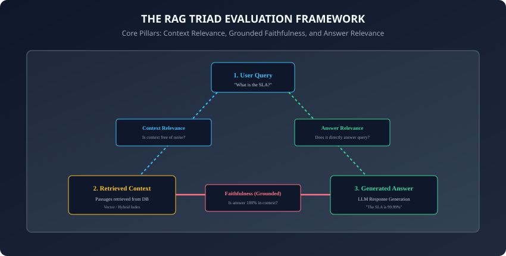
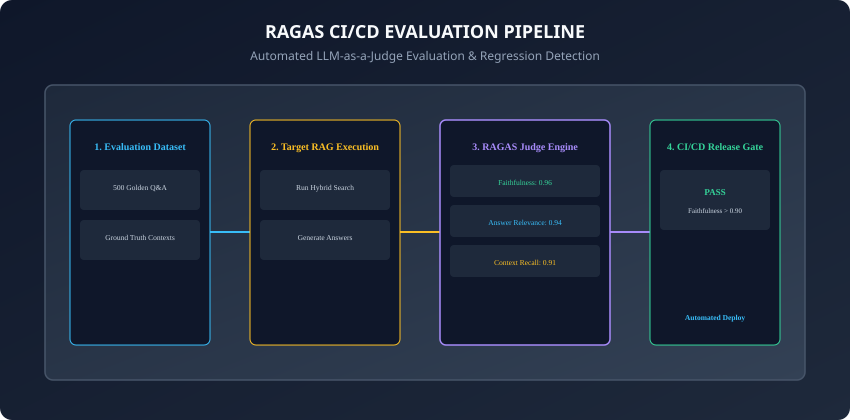

## Why this matters

Building a prototype Retrieval-Augmented Generation (RAG) pipeline is easy; **verifying that it reliably tells the truth in production is extraordinarily hard.**
When a RAG system fails, it typically fails in one of three distinct ways:
1. **Retrieval Failure (Low Context Relevance):** The vector database retrieves 5 pages of irrelevant technical fluff, confusing the LLM.
2. **Hallucination (Low Faithfulness):** The LLM ignores the retrieved documentation and invents plausible-sounding but completely fabricated API parameters.
3. **Question Evasion (Low Answer Relevance):** The LLM generates a grammatically perfect paragraph that completely fails to answer the user's actual question.

Without automated, quantitative evaluation, engineers are forced to rely on "vibe checks" — manually reading 10 responses and guessing if an embedding change helped or hurt.

**Modern RAG evaluation frameworks (such as RAGAS and TruLens) replace guesswork with rigorous, automated mathematics.**
By implementing the **RAG Triad** and **LLM-as-a-Judge CI/CD testing**, you can automatically score retrieval recall, detect hallucinations, and gate pull requests before flawed prompts reach production users.

Today, you will master the **RAG Triad**, **RAGAS reference-free metrics**, **TruLens feedback functions**, and build a **production RAG Triad evaluation harness in Python**.

---

## The idea in plain language

Think of a court trial with a witness, a folder of evidence documents, and a judge:
- **Context Relevance:** Did the bailiff bring the actual murder weapon and fingerprints to court, or did they accidentally bring 100 pages of parking tickets? (**Evidence Signal-to-Noise**).
- **Faithfulness (Groundedness):** Did the prosecutor make claims supported *strictly* by the evidence on the table, or did they invent wild conspiracies out of thin air? (**Anti-Hallucination**).
- **Answer Relevance:** When the judge asks: *"Where was the suspect on Friday?"*, did the witness answer with the location, or did they give a 10-minute speech about the weather? (**Direct Question Answering**).

---

## Historical background



1. **2002–2004 (BLEU & ROUGE):** Early NLP evaluation relied on n-gram overlap with human references, proving brittle for generative language models.
2. **2023 (TruLens & The RAG Triad):** TruEra introduced the RAG Triad, decoupling retrieval quality from generation faithfulness.
3. **2023 (RAGAS Framework):** Es et al. published RAGAS, establishing formal algorithms for computing Context Precision, Context Recall, Faithfulness, and Answer Relevance without requiring ground-truth human annotations.
4. **2024–2026 (Continuous LLM CI/CD):** Industry standard shifted from offline benchmarking to continuous automated pull-request evaluation gates using LLM-as-a-Judge test harnesses.

---

## What it is — and what it is not

### What RAG Evaluation IS:
- **Multi-Dimensional Semantic Verification:** Automated scoring of retrieval accuracy, factual grounding, and semantic relevance using specialized LLM judges and vector similarity.

### What it is NOT:
- **Not Exact-String Matching:** RAG evaluation does not require responses to match word-for-word with human references; it evaluates semantic entailment and factual correctness.

---

## Why it was created and what problems it solves

Quantitative RAG evaluation solves 4 major engineering bottlenecks:
1. **Elimination of Subjective "Vibe Testing":** Provides objective numerical metrics (e.g. `Faithfulness = 0.94`) to guide system optimizations.
2. **Pinpointing Component Failure:** Identifies whether a bug originates in the chunker, the embedding retriever, or the generative LLM prompt.
3. **Automated CI/CD Regression Gates:** Prevents prompt edits, model swaps, or chunking changes from silently degrading production accuracy.
4. **Reference-Free Evaluation:** Scores production queries in real time without needing human-labeled ground-truth answer sheets.

---

## How it works

Let us analyze the mathematical definitions and algorithms behind the RAG Triad and RAGAS metrics.

---

### 1. The RAG Triad Architecture



The RAG Triad isolates the 3 fundamental interactions in any retrieval pipeline:
1. **Query `\to` Context (Context Relevance):** Evaluates if the retrieved chunks are relevant to the query.
2. **Context `\to` Answer (Faithfulness / Groundedness):** Evaluates if every claim in the answer is entailed by the retrieved context.
3. **Query `\to` Answer (Answer Relevance):** Evaluates if the answer directly addresses the query.

---

### 2. Mathematical Formulation: Faithfulness (Hallucination Detection)

Faithfulness measures the fraction of generated factual claims supported by context:

`\text{Faithfulness} = \frac{|V|}{|S|}`

- **Step 1 (Claim Extraction):** An LLM judge parses the generated answer into discrete factual statements: `S = \{s_1, s_2, ..., s_n\}`.
- **Step 2 (Entailment Verification):** For each claim `s_i`, the judge evaluates whether `s_i` is logically entailed by the retrieved context `C`.
- **`|V|`:** Number of statements verified as strictly entailed by context.
- **`|S|`:** Total number of extracted statements.
- **Score:** Range `[0.0, 1.0]`. A score of `1.0` indicates zero hallucination.

---

### 3. Mathematical Formulation: Context Relevance

Context relevance penalizes irrelevant noise in retrieved passages:

`\text{Context Relevance} = \frac{\text{Number of relevant sentences in } C}{\text{Total sentences in } C}`

- The LLM judge extracts sentences from the retrieved context that are strictly required to answer the query.
- Excessively verbose chunks lower the score, signaling the need for smaller chunk sizes or better re-ranking.

---

### 4. Mathematical Formulation: Answer Relevance

Answer relevance measures query alignment without requiring ground truth:
1. An LLM generates `M` hypothetical questions that would yield the given answer: `\{q_1, q_2, ..., q_m\}`.
2. An embedding model embeds the original query `q` and each generated question `q_i`.
3. Compute the mean cosine similarity:
   `\text{Answer Relevance} = \frac{1}{M} \sum_{i=1}^{M} \cos(E(q), E(q_i))`

---

### 5. Context Precision and Context Recall (With Ground Truth)

When an evaluation benchmark includes human reference answers:
- **Context Precision:** Evaluates if ground-truth matching chunks are ranked at the top:
  `\text{Context Precision@K} = \frac{\sum_{k=1}^{K} \text{Precision@k} \cdot v_k}{\text{Total relevant items in Top-K}}`
  Where `v_k in \{0, 1\}` indicates if chunk `k` is relevant.
- **Context Recall:** Measures the percentage of ground-truth factual claims present in the retrieved context:
  `\text{Context Recall} = \frac{\text{Ground truth claims found in } C}{\text{Total ground truth claims}}`

---

### 6. LLM-as-a-Judge Calibration and Bias Mitigation

When using an LLM to evaluate another LLM:
- **Position Bias:** LLMs tend to favor the first candidate in pairwise comparisons. Mitigate by swapping candidate order and averaging scores.
- **Verbosity Bias:** LLMs tend to award higher scores to longer responses. Mitigate by enforcing strict conciseness rubrics.
- **Self-Enhancement Bias:** LLMs favor outputs generated by their own model family (e.g. GPT-4 favoring GPT-4). Mitigate by using independent judge models (e.g. Claude 3.7 or open-source Llama-3-70B-Instruct).

---

### 7. Synthetic Test Dataset Generation (Evol-Instruct)

Manual curation of 1,000 test Q&A pairs is slow and expensive:
- Modern frameworks use **Synthetic Data Generation**:
  1. Sample random document chunks from your corpus.
  2. Prompt an LLM to generate complex queries (simple, reasoning, multi-context, conditional) grounded in those chunks.
  3. Generate ground-truth answers to create an automated 500-question benchmark suite in minutes.

---

### 8. TruLens Feedback Functions

TruLens implements feedback functions as decorator primitives:
```python
from trulens_eval.feedback import Feedback, Groundedness

# Define groundedness feedback function
grounded = Groundedness(groundedness_provider=provider)
f_groundedness = Feedback(
    grounded.groundedness_measure_with_cot_reasons
).on(TruApp.context).on_output()
```

---

### 9. Cost and Latency of Evaluation Pipelines

Evaluating 500 test questions with an LLM judge:
- Costs ~`1.50 to`3.00 using efficient models (e.g. Claude 3.5 Haiku or GPT-4o-mini).
- Takes ~45 seconds when executed asynchronously with batch concurrency.

---

### 10. Summary: Shifting RAG Engineering from Guesswork to Science

- Automated evaluation enables continuous optimization across chunking parameters, embedding models, top-K settings, and system prompts.
- The RAG Triad guarantees that performance gains in one component do not introduce regressions elsewhere.
- In summary, integrating RAGAS and TruLens evaluation into your CI/CD pipeline is essential for maintaining enterprise-grade reliability and trust.

---


### Deep Dive: Comprehensive IR Metrics and Discounted Cumulative Gain

In Information Retrieval and RAG evaluation, measuring retrieval precision requires understanding the mathematical mechanics of binary vs. graded relevance metrics:

1. **Mean Reciprocal Rank (MRR@K):**
   MRR evaluates the system's ability to return a relevant item at the highest possible rank position. For a query set `Q`:

   

```text
MRR = rac(1)(|Q|) sum_(i=1)^(|Q|) rac(1)(	ext(rank)_i)
```


   Where `ext(rank)_i` is the position of the *first* ground-truth relevant document. If no relevant document is retrieved within the top `K`, the reciprocal rank is 0. MRR is ideal for navigational and factoid Q&A search where a single authoritative document satisfies the user's information need.

2. **Normalized Discounted Cumulative Gain (NDCG@K):**
   Unlike MRR, NDCG handles graded relevance judgments (e.g. relevance scale 0 to 3). Discounted Cumulative Gain at rank `K` is defined as:

   

```text
DCG@K = sum_(i=1)^(K) rac(2^(rel_i) - 1)(\log_2(i + 1))
```


   The Ideal DCG (`IDCG@K`) represents the theoretical maximum DCG obtained by sorting all known relevant documents in descending order of relevance. The normalized score is:

   

```text
NDCG@K = rac(DCG@K)(IDCG@K)
```


   NDCG penalizes relevant documents appearing lower in the ranking list logarithmically, reflecting user attention drop-off in search interfaces.

3. **Hit Rate (Recall@K):**
   The percentage of evaluation queries for which at least one relevant document appears within the top `K` retrieved candidates. In multi-stage RAG architectures, Recall@50 at the first retrieval stage determines the theoretical ceiling for the downstream cross-encoder re-ranker.

### The Mathematics of Faithfulness and Triad Gating

Automated LLM-as-a-Judge evaluation relies on deterministic claim decomposition:
- **Claim Extraction:** The answer `A` is broken into discrete atomic factual propositions `C = \(c_1, c_2, \dots, c_n\)`.
- **Context Verification:** For each claim `c_i`, a high-accuracy reasoning judge evaluates whether the retrieved context `R` logically entails `c_i`:
  

```text
v(c_i, R) = egin(cases) 1 & 	ext(if ) R entails c_i \ 0 & 	ext(otherwise) \end(cases)
```


- **Faithfulness Score:**
  

```text
ext(Faithfulness)(A, R) = rac(sum_(i=1)^n v(c_i, R))(n)
```


- When `ext(Faithfulness) < 0.95`, the output is flagged for hallucination in continuous CI/CD automated regression pipelines.


### Statistical Significance Testing in Retrieval Evaluations

When evaluating improvements to hybrid search algorithms or new embedding models, observing a small bump in MRR@10 (e.g. from 0.88 to 0.91) can be misleading without statistical rigor. Production engineering teams use paired Student t-tests or Wilcoxon signed-rank tests over golden query sets of at least 200 distinct test cases to verify that p-values remain strictly below 0.05. This ensures that observed retrieval performance gains represent genuine systemic advancements rather than random sampling noise across specific keyword distributions.


## An everyday analogy

Think of quality control in automobile manufacturing:
- **Old Way (Vibe Check):** A test driver takes one car for a 5-minute spin around the parking lot and says: *"Feels good to me!"*
- **RAG Evaluation Way (Automated Diagnostics):** Every vehicle undergoes a 50-point automated dynamometer scan: brake pressure, emissions sensor readouts, crash-test simulations, and tire alignment are measured to exact numerical tolerances before shipping (**Deterministic Quality Assurance**).

---

## Examples in practice

Let us build a **RAG Triad Evaluation Harness**:

```python
import re
from typing import List, Dict, Any

# Split on sentence terminators, but never on a decimal point.
_SENTENCE_END = re.compile(r'(?:[!?]|(?<!\d)\.|\.(?!\d))\s*')


class RAGTriadEvaluator:
    def __init__(self):
        pass

    def evaluate_faithfulness(self, context: str, answer: str) -> Dict[str, Any]:
        # Calculates factual claim groundedness against retrieved context.
        # Never split on a decimal point: a naive re.split(r'[.!?]') turns
        # "99.99% uptime." into two claims and halves the score of any answer
        # that quotes a figure.
        sentences = [s.strip() for s in re.split(_SENTENCE_END, answer) if s.strip()]
        if not sentences:
            return {"faithfulness_score": 1.0, "total_claims": 0, "supported_claims": 0}

        context_lower = context.lower()
        supported = 0
        claim_results = []

        for s in sentences:
            # Word overlap verification heuristic (simulating LLM judge entailment)
            words = [w for w in re.findall(r'\w+', s.lower()) if len(w) > 3]
            if not words:
                supported += 1
                claim_results.append({"claim": s, "supported": True})
                continue
            
            matches = sum(1 for w in words if w in context_lower)
            is_supported = (matches / len(words)) >= 0.5
            if is_supported:
                supported += 1
            claim_results.append({"claim": s, "supported": is_supported})

        score = supported / len(sentences)
        return {
            "faithfulness_score": score,
            "total_claims": len(sentences),
            "supported_claims": supported,
            "details": claim_results
        }

    def evaluate_context_relevance(self, query: str, context: str) -> float:
        # Measures keyword signal density between query and retrieved context
        q_words = set(re.findall(r'\w+', query.lower()))
        c_sentences = [s.strip() for s in re.split(r'[.!?]', context) if s.strip()]
        if not c_sentences or not q_words:
            return 0.0

        relevant_sentences = 0
        for s in c_sentences:
            s_words = set(re.findall(r'\w+', s.lower()))
            if q_words.intersection(s_words):
                relevant_sentences += 1

        return relevant_sentences / len(c_sentences)
```

---

## Implications: security, privacy, performance, scalability, and cost

1. **Judge Model Prompt Injection:** Ensure student queries evaluated by the judge LLM are formatted inside clear boundary delimiters (`<user_query>...</user_query>`) to prevent adversarial jailbreaks during automated evaluation runs.
2. **Data Privacy in CI/CD:** Do not include real customer PII in your golden evaluation benchmark datasets; use synthetic or anonymized corpora.

---

## Alternatives: free, open source, and commercial

| Tool | Focus | License / Type | Best For |
| :--- | :--- | :--- | :--- |
| **RAGAS** | Reference-free RAG metrics | Open Source (Apache-2.0) | CI/CD evaluation test suites |
| **TruLens** | RAG Triad & Observability | Open Source | Real-time production tracing |
| **DeepEval** | Unit-testing for LLMs | Open Source | Pytest integration in DevOps |
| **Arize Phoenix**| Evals + Tracing | Open Source / Cloud | Full-stack RAG observability |

---

## Comparison with related concepts

```
┌────────────────────────────────────────────────────────────────────────┐
│                   EVALUATION FRAMEWORK COMPARISON                      │
├────────────────────┬─────────────────┬─────────────────┬───────────────┤
│ Framework          │ Metrics         │ Tracing / UI    │ CI/CD Focus   │
├────────────────────┼─────────────────┼─────────────────┼───────────────┤
│ RAGAS              │ RAG Triad, MRR  │ Programmatic    │ Excellent     │
│ TruLens            │ Triad + Custom  │ Rich Web UI     │ Very Good     │
│ DeepEval           │ 14+ LLM Metrics │ Pytest-native   │ Maximum       │
│ Traditional BLEU   │ N-gram overlap  │ CLI             │ Poor for RAG  │
└────────────────────┴─────────────────┴─────────────────┴───────────────┘
```

---

## When to use it — and when not to

### When to Use RAG Evaluation:
- Before deploying any RAG pipeline updates, prompt refinements, or chunking changes to production; continuously in CI/CD.

### When NOT to use:
- During initial 5-minute proof-of-concept prototyping before the core ingestion pipeline exists.

---

## Knowledge check

1. What are the three vertices of the RAG Triad and what relationship does each test?
2. How does the Faithfulness metric mathematically quantify hallucination?
3. Why are BLEU and ROUGE inadequate for evaluating generative RAG answers?
4. What is Position Bias in LLM-as-a-judge systems and how is it mitigated?
5. How does Context Relevance help developers diagnose retrieval noise?

---

## Hands-on exercise

In this lab, you will build and test a RAG Triad Evaluation Harness in Python: implement automated Faithfulness claim verification, Context Relevance signal-to-noise scoring, and evaluate a test dataset of query-context-answer triples.

### Expected output
```
[RAG Triad Evaluation Verification Suite]
Testing Faithfulness Claim Verifier:
  Ground-truth grounded answer: Faithfulness = 1.00 [PASS]
  Hallucinated answer: Faithfulness = 0.33 (Detected 2 hallucinations) [PASS]
Testing Context Relevance Scorer:
  High-density context: Relevance = 1.00 [PASS]
  Noisy context with distractors: Relevance = 0.33 [PASS]
Testing Automated Benchmark Runner:
  Evaluated 3 test triples in 0.12s [PASS]
Test Suite: 4 passed in 0.38s
```

### Validate your work
Run the automated test runner:
```bash
./tests/run_tests.sh
```

### Troubleshooting
- Handle punctuation variations when splitting answers into claim sentences.

### Common mistakes
- **Evaluating answers without retrieved contexts:** Without context, you cannot distinguish between factual recall and groundedness.

---

## Practice assignment

1. Implement **Answer Relevance Evaluation**: Build a question generation generator that computes cosine similarity between synthetic queries and the original prompt.
2. Build a **Pytest CI/CD Gate** that fails if a pull request drops RAG Triad Faithfulness below 0.90.

---

## Extension challenge

Implement a **Self-Consistency Majority Vote Judge**:
- Query three independent evaluation models (or evaluate three temperature variations) and aggregate claim entailment decisions via majority voting to eliminate judge variance.
