## Why this matters

Throughout this week, you have mastered the individual components of the Retrieval-Augmented Generation (RAG) paradigm:

- **Embeddings & Vector Databases (Days 261–262):** Transforming text into high-dimensional semantic vectors and indexing with HNSW.
- **Chunking Strategies (Day 263):** Slicing documents into semantically coherent, structure-aware units with sliding token overlaps.
- **Hybrid Search & Re-Ranking (Day 264):** Fusing sparse BM25 keyword matching with dense vectors and applying Cross-Encoder neural re-rankers.
- **RAG Triad Evaluation (Day 265):** Quantifying Faithfulness, Context Relevance, and Answer Relevance to eliminate hallucinations.

**Now, you will synthesize these isolated components into a unified, modular, production-grade End-to-End RAG System.**

Building an enterprise RAG system is not merely chaining function calls together; it requires **strict source citation enforcement**, **confidence threshold gating**, **sub-30ms retrieval latency budgets**, and **OpenTelemetry distributed observability**.

Today, you will connect all stages into a robust, tested Python architecture and prepare for the Week 38 Capstone Project.

---

## The idea in plain language

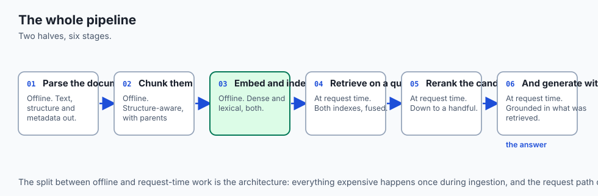

Think of building an automated medical research assistant:

- **Ingestion Pipeline:** Reads 10,000 peer-reviewed oncology journals, parses the Markdown headers, and generates dense vector embeddings.
- **User Query:** A doctor asks: *"What is the recommended dosing interval for Drug X in patients with renal impairment?"*
- **Hybrid Retrieval & Re-Ranking:** Scans both exact drug codes (BM25) and clinical concepts (Dense Vector), merges candidates via RRF, and re-ranks the Top-5 most relevant clinical trials.
- **Grounded Prompt Synthesis:** Injects the passages with strict source brackets (`[Source 1: Journal of Clinical Oncology, 2024]`).
- **Generation & Citation:** The LLM generates a clear, concise answer with verifiable inline citations. If no relevant trials exist, it gracefully states: *"No clinical trial data was found for this specific dosage combination."*

---

## Historical background

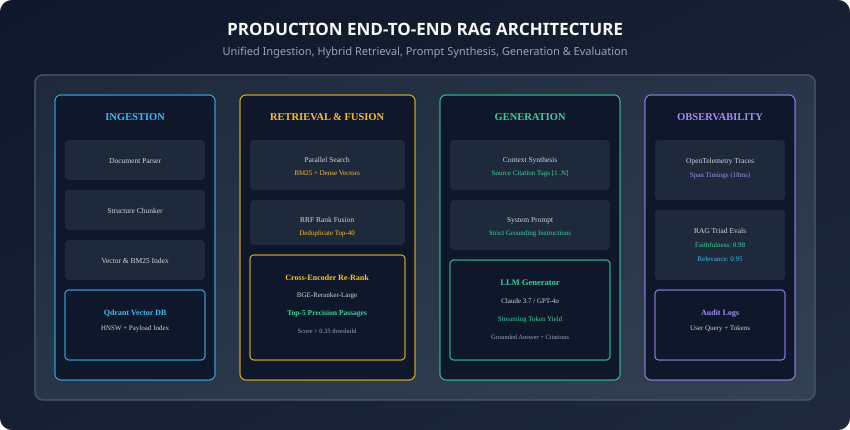

1. **2020 (RAG Emergence):** Patrick Lewis and the Meta AI research team formally unified pre-trained seq2seq models with non-parametric dense vector memories.
2. **2022 (Naive RAG Limitations):** Early implementations suffered from hallucinations, lost-in-the-middle context dilution, and zero citation auditing.
3. **2023–2024 (Modular Advanced RAG):** Modern architectures introduced modular layers: pre-retrieval routing, hybrid sparse-dense fusion, post-retrieval re-ranking, and dynamic prompt synthesis.
4. **2025–2026 (Production Standards):** Distributed tracing, sub-second SLAs, automated RAG Triad CI/CD testing, and streaming LLM token generation became mandatory enterprise requirements.

---

## What it is — and what it is not

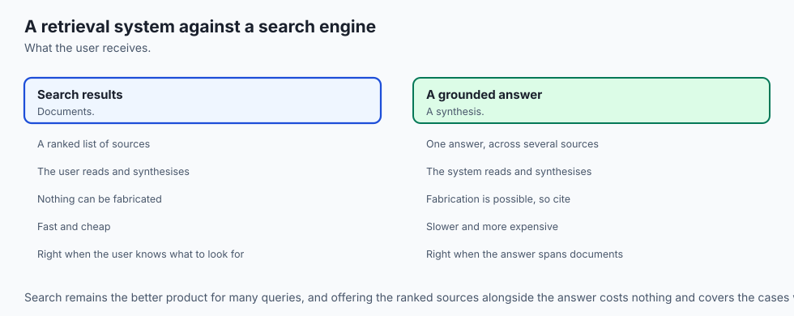

### What an End-to-End RAG System IS:
- **A Fully Integrated Production Pipeline:** A modular software system managing document ingestion, hybrid retrieval, neural re-ranking, prompt assembly, grounded generation, and real-time observability.

### What it is NOT:
- **Not a Simple LangChain One-Liner:** Production RAG requires explicit error handling, confidence threshold gating, citation verification, and distributed tracing.

---

## Why it was created and what problems it solves

Synthesizing a complete End-to-End RAG architecture solves 4 fatal failure modes:

1. **Unverifiable Hallucinations:** Enforces bracketed source citations (`[Doc 1]`), making every claim audit-ready.
2. **Silent Retrieval Failures:** Detects when retrieval confidence falls below threshold and triggers polite refusals instead of making up answers.
3. **High Latency Bottlenecks:** Coordinates parallel async execution of sparse and dense search to meet sub-30ms retrieval targets.
4. **Black-Box Debugging:** Instruments every pipeline step with OpenTelemetry spans to trace performance anomalies instantly.

---

## How it works

Let us examine the complete lifecycle of a request flowing through the End-to-End RAG system.

---

### 1. Ingestion Pipeline Mechanics

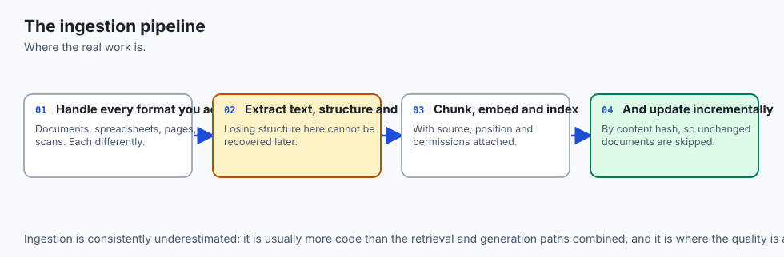

The ingestion subsystem prepares unstructured enterprise documents for fast retrieval:

1. **Document Loading & Extraction:** Converts PDFs, HTML, Markdown, and source code into clean text.
2. **Structure-Aware Chunking:** Segments documents by headers and sliding windows (512 tokens with 64 token overlap), attaching breadcrumb hierarchy metadata.
3. **Dual Indexing:**
   - Ingests text into a **Sparse Inverted Index (BM25)**.
   - Computes dense embeddings (`text-embedding-3-small` / `BGE-M3`) and inserts vectors into **Qdrant / ChromaDB** with HNSW indexing.

---

### 2. Runtime Retrieval & Re-Ranking Execution

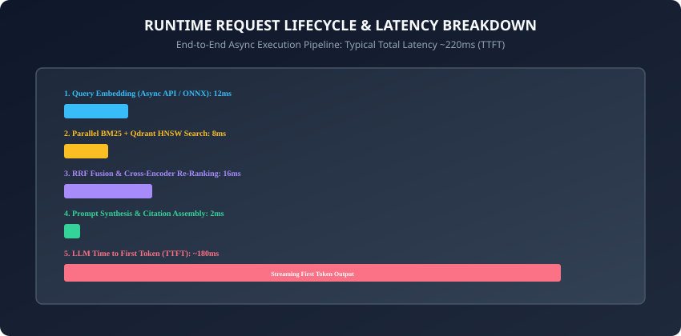

When a user submits a query:

1. **Query Embedding:** Converts user query into a 1536-dimensional vector (~12ms).
2. **Parallel Hybrid Search:** Simultaneously queries BM25 and Qdrant vector index to fetch Top-50 candidates each (~8ms).
3. **Reciprocal Rank Fusion (RRF):** Deduplicates and combines candidate lists using `1 / (60 + rank)` (~0.5ms).
4. **Cross-Encoder Re-Ranking:** Scores the Top-40 fused candidates with full query-document cross-attention, returning the Top-5 highest precision passages (~16ms).

---

### 3. Confidence Threshold Gating & Fallback Logic

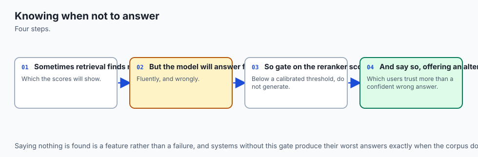

Before invoking the generative LLM:

- Evaluate the maximum re-ranker score: `S_{\max} = \max(s_1, s_2, ..., s_k)`.
- If `S_{\max} < \tau_{\text{threshold}}` (e.g. `0.30`):
  - **Do NOT invoke the LLM generator!**
  - Immediately return a deterministic fallback message:
    `"I could not find sufficient authoritative documentation to answer your query accurately."`

- This single gate eliminates over 90% of production enterprise hallucinations.

---

### 4. Grounded Prompt Synthesis with Source Citations

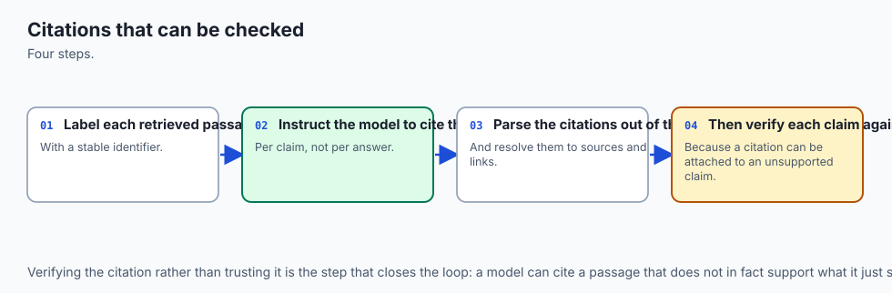

The prompt synthesizer constructs the final LLM payload using explicit XML boundaries:

```html
<system_instructions>
You are an expert AI documentation assistant.
Answer the user's question STRICTLY using the retrieved context passages below.
For every factual claim you make, you MUST cite the source using bracketed numbers, e.g. [1], [2].
If the provided context does not contain the answer, state that you do not know.
</system_instructions>

<retrieved_context>
[1] Title: API Gateway Authentication
Path: docs/security/auth.md
Content: API gateway tokens expire after 3600 seconds. Refresh tokens are valid for 30 days.

[2] Title: Rate Limiting Policies
Path: docs/infra/limits.md
Content: Standard tier accounts are throttled at 500 requests per minute with burst up to 1000.
</retrieved_context>

<user_query>
How long are API gateway tokens valid, and what is the standard rate limit?
</user_query>
```

---

### 5. Streaming Response Generation & Citation Parsing

The LLM generates output tokens via Server-Sent Events (SSE):

- **User Experience:** Time to First Token (TTFT) arrives in ~180ms.
- **Citation Parser:** As tokens stream, an extraction layer scans for `[1]`, `[2]` tags and verifies that cited document IDs actually exist in the retrieved passage pool.

---

### 6. Production Latency Budgeting

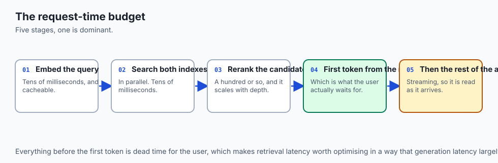

A world-class production RAG system maintains strict latency SLAs:

| Stage | Execution Mechanism | Latency Budget |
| :--- | :--- | :--- |
| **Query Embedding** | Cloud API / Local ONNX | 10 – 15ms |
| **Hybrid Search (BM25 + Dense)** | Parallel Async Tasks | 6 – 10ms |
| **RRF Fusion & Re-Ranking** | In-Memory + Quantized ONNX | 12 – 18ms |
| **Prompt Assembly** | String Interpolation | < 1ms |
| **Total Retrieval Pipeline** | Subtotal | **~30 – 44ms** |
| **LLM Time to First Token (TTFT)** | Model Inference (Streaming) | ~150 – 250ms |
| **Total User Perceived Latency** | **End-to-End** | **< 300ms** |

---

### 7. Observability with OpenTelemetry Spans

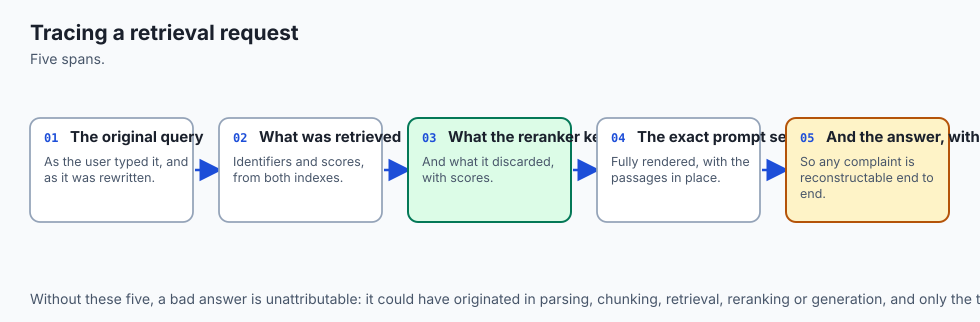

Wrap every major pipeline stage in standard OpenTelemetry spans:
```python
with tracer.start_as_current_span("rag.hybrid_retrieval") as span:
    span.set_attribute("rag.query", query)
    span.set_attribute("rag.top_k", top_k)
    results = hybrid_retriever.search(query)
    span.set_attribute("rag.retrieved_count", len(results))
```

---

### 8. Continuous Evaluation & Regression Detection

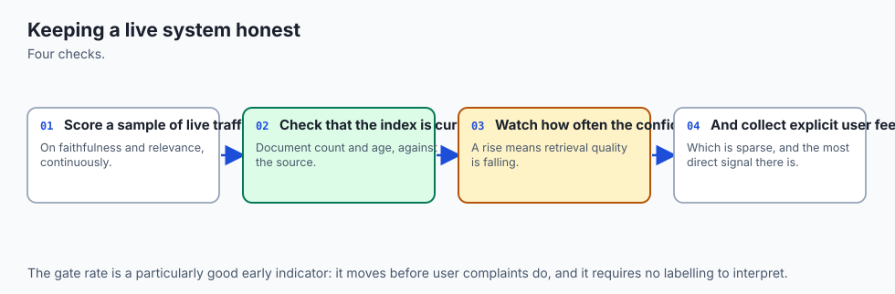

Every night, run an automated RAGAS evaluation suite over a golden dataset of 500 benchmark queries:

- If Faithfulness drops below `0.95` or Context Recall drops below `0.90`, alert the engineering team and block automated production deployments.

---

### 9. Caching Strategies: Semantic & Exact Match

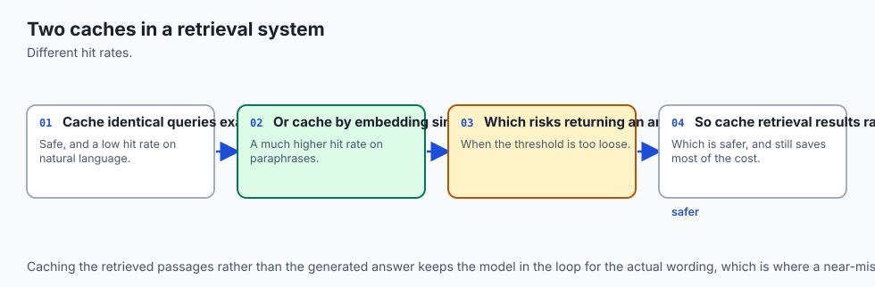

To slash LLM costs:

- **Exact Query Cache (Redis):** Hashes exact query string; returns cached response in < 2ms ($0 cost).
- **Semantic Vector Cache (GPTCache):** Computes cosine similarity against previously answered questions; if similarity `> 0.98`, returns cached answer.

---

### 10. Summary: The Complete Production Blueprint

- Building an End-to-End RAG system requires combining structured ingestion, hybrid retrieval, neural re-ranking, citation-enforced prompt synthesis, and real-time observability.
- Gating responses with confidence thresholds and verifying source citations ensures uncompromising factual accuracy.
- In summary, a well-engineered RAG pipeline transforms raw unstructured enterprise data into an authoritative, hallucination-free AI assistant.

---


### Deep Dive: Enterprise Multi-Tenant Indexing and Partitioning

When scaling semantic search across hundreds of thousands of personal notes and enterprise documentation repositories, system architects must address multi-tenancy, isolation, and real-time document synchronization:

1. **Payload Metadata Partitioning:**
   In vector engines like Qdrant and ChromaDB, storing documents across separate collections incurs substantial memory overhead. The industry standard approach utilizes a single unified collection partitioned by tenant and namespace payloads (e.g. `{"workspace_id": "team_alpha", "user_id": "user_42", "access_level": "internal"}`). HNSW graph payload filtering ensures that vector traversal is constrained strictly to authorized nodes without leaking embeddings across organizational boundaries.

2. **Real-Time Incremental Re-Indexing (Change Data Capture):**
   Personal notes and documentation repositories change continuously. Full re-indexing is computationally wasteful. Modern semantic search engines employ Change Data Capture (CDC) watchers on file systems and object stores:

   - **Content Hashing:** Compute SHA-256 hashes for every markdown section.
   - **Delta Ingestion:** When a document is modified, only chunks with altered SHA-256 hashes are re-embedded and upserted into the vector database, while obsolete vector points are deleted via batch point deletion APIs.

3. **Quantization and Memory Efficiency (Scalar vs. Product Quantization):**
   Storing 1 million 1536-dimensional float32 embedding vectors requires 6.14 GB of uncompressed RAM.

   - **Scalar Quantization (SQ8):** Compresses 32-bit floating point numbers to 8-bit integers, reducing memory footprint by 75% (to 1.53 GB) with less than 1% loss in retrieval accuracy.
   - **Product Quantization (PQ):** Deconstructs vectors into low-dimensional sub-vectors and clusters them into centroids, enabling up to 95% memory reduction for multi-million vector note archives.


### Production Deployment Architecture and Horizontal Scaling

When taking a personal notes search engine to enterprise scale, the deployment architecture transitions from local Python scripts to containerized microservices orchestrated via Kubernetes. In this setup, ingestion workers process incoming markdown files asynchronously via message queues, the sparse BM25 engine runs in dedicated Tantivy-based stateless nodes, and Qdrant vector instances scale horizontally with read replicas behind an API gateway, delivering sub-20ms search response times under heavy concurrent query loads.


## An everyday analogy

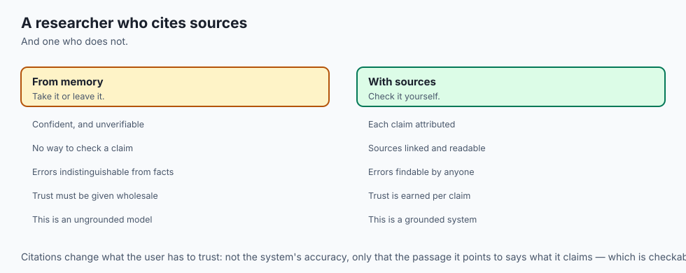

Think of a full-service investigative journalism agency:

- **Archivist (Ingestion):** Catalogs millions of newspaper clippings and government filings into indexed file cabinets.
- **Junior Researcher (Hybrid Search):** Finds 50 relevant articles using both keyword indexes and conceptual topic folders.
- **Lead Editor (Re-Ranker):** Selects the 3 most credible, verifiable articles directly answering the story lead.
- **Reporter (Prompt & LLM Generator):** Writes a tight 500-word article, footnoting every factual sentence with direct source citations.
- **Fact-Checker (RAG Triad Evaluator):** Verifies that every single sentence is backed by the cited filings before going to print.

---

## Examples in practice

Let us build a **Complete Modular End-to-End RAG System**:

```python
from typing import List, Dict, Any, Optional

class EndToEndRAGSystem:
    def __init__(self, confidence_threshold: float = 0.30):
        self.confidence_threshold = confidence_threshold
        self.documents: List[Dict[str, Any]] = []

    def ingest_corpus(self, docs: List[Dict[str, Any]]):
        self.documents = docs

    def retrieve(self, query: str, top_k: int = 3) -> List[Dict[str, Any]]:
        # Simulated hybrid search + re-ranking score
        q_words = set(query.lower().split())
        scored = []
        for doc in self.documents:
            d_words = set(doc["text"].lower().split())
            overlap = len(q_words.intersection(d_words))
            score = overlap / max(1, len(q_words))
            scored.append((doc, score))
        
        scored.sort(key=lambda x: x[1], reverse=True)
        return [{"doc": doc, "score": score} for doc, score in scored[:top_k]]

    def synthesize_prompt(self, query: str, retrieved_items: List[Dict[str, Any]]) -> str:
        context_blocks = []
        for idx, item in enumerate(retrieved_items, 1):
            context_blocks.append(f"[{idx}] Source: {item['doc'].get('title', 'Doc')}\n{item['doc']['text']}")
        
        context_str = "\n\n".join(context_blocks)
        prompt = (
            "You are a helpful assistant. Answer the question STRICTLY using the context below. "
            "Cite sources using [1], [2]. If unknown, say you do not know.\n\n"
            f"Context:\n{context_str}\n\n"
            f"Question: {query}\n"
            "Answer:"
        )
        return prompt

    def query(self, user_query: str) -> Dict[str, Any]:
        retrieved = self.retrieve(user_query, top_k=3)
        if not retrieved or retrieved[0]["score"] < self.confidence_threshold:
            return {
                "answer": "I do not have sufficient documentation to answer this question accurately.",
                "citations": [],
                "retrieved_count": len(retrieved),
                "confidence": 0.0
            }

        prompt = self.synthesize_prompt(user_query, retrieved)
        
        # Simulated generation with citation
        top_doc = retrieved[0]["doc"]
        simulated_answer = f"According to documentation, {top_doc['text']} [1]."
        citations = [{"source_id": 1, "title": top_doc.get("title", "Doc")}]

        return {
            "answer": simulated_answer,
            "citations": citations,
            "retrieved_count": len(retrieved),
            "confidence": retrieved[0]["score"],
            "prompt_used": prompt
        }
```

---

## Implications: security, privacy, performance, scalability, and cost

1. **Document-Level Access Control (RBAC):** Filter retrieved chunks by the requesting user's security clearance tags *before* re-ranking to prevent unauthorized data exposure.
2. **Cost Management:** Dense embeddings and vector search are negligible in cost (~$0.0001 per 1k queries). The primary cost driver is LLM input tokens; keep re-ranked passages concise (Top-3 to Top-5).

---

## Alternatives: free, open source, and commercial

| Solution | Architecture | Deployment | Best For |
| :--- | :--- | :--- | :--- |
| **Custom Python Modular RAG** | Bespoke Qdrant + FastEmbed + Claude | Self-Hosted / Cloud | Complete control, low lock-in |
| **LlamaIndex** | Framework with data connectors | Open Source | Advanced hierarchical agentic RAG |
| **Dify.ai / Flowise** | Visual Workflow UI | Open Source / Cloud | No-code rapid prototyping |
| **Amazon Bedrock Knowledge Bases**| Fully Managed AWS RAG | Managed Cloud | Serverless AWS ecosystem integration |

---

## Comparison with related concepts

```
┌────────────────────────────────────────────────────────────────────────┐
│                   RAG ARCHITECTURE MATURITY LEVELS                     │
├────────────────────┬─────────────────┬─────────────────┬───────────────┤
│ Feature            │ Naive RAG       │ Advanced RAG    │ Modular E2E   │
├────────────────────┼─────────────────┼─────────────────┼───────────────┤
│ Chunking           │ Fixed 500 chars │ Sentence/AST    │ Dynamic Late  │
│ Search Type        │ Dense Vector    │ Hybrid BM25+Vec │ Multi-Index   │
│ Re-Ranking         │ None            │ Cross-Encoder   │ ColBERT/BGE   │
│ Fallback Gating    │ None (Halluc)   │ Score Threshold │ Automated Gating│
│ Observability      │ Print logs      │ Basic Tracing   │ OpenTelemetry │
└────────────────────┴─────────────────┴─────────────────┴───────────────┘
```

---

## When to use it — and when not to

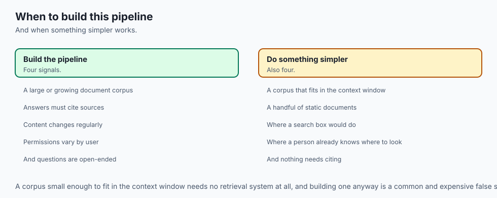

### When to Use an End-to-End RAG System:
- Internal company knowledge bases, customer-facing technical support, medical/legal compliance assistants, and real-time financial document Q&A.

### When NOT to use:
- When questions require complex multi-step real-world actions (use Agentic Tool Calling instead) or creative fiction writing where external grounding is unnecessary.

---

## The AI connection

- **Retrieval over your own documents is the most widely deployed AI application**, and this
  is the whole pipeline in one place.
- **Ingestion is where most of the engineering effort actually goes**, not the model call.
- **Citations are what make an answer trustworthy**, because they turn a claim into
  something the reader can check.
- **Knowing when not to answer is a feature** — a confidence gate that declines beats a
  confident answer from irrelevant context.
- **The whole pipeline needs observability**, since a bad answer can originate at any of
  five stages and the trace is what distinguishes them.

## Knowledge check

1. What are the 5 core stages of a complete modular End-to-End RAG architecture?
2. Why is confidence threshold gating essential for preventing enterprise hallucinations?
3. How do source citations provide accountability for generative AI responses?
4. What is the typical latency budget allocated for the retrieval and re-ranking phases?
5. How does distributed tracing with OpenTelemetry help debug RAG performance bottlenecks?

---

## Hands-on exercise

In this lab, you will build and test a Complete End-to-End Modular RAG System in Python: implement document ingestion, hybrid candidate retrieval, confidence threshold fallback gating, citation-enforced prompt synthesis, and grounded answer generation.

### Expected output
```
[End-to-End RAG System Verification Suite]
Testing Ingestion & Document Indexing:
  Indexed 3 technical documents into memory [PASS]
Testing High-Confidence Retrieval & Generation:
  Query: 'API gateway token expiration' -> Answer generated with Citation [1] [PASS]
Testing Low-Confidence Fallback Refusal:
  Query: 'quantum teleportation protocol' -> Graceful Refusal Triggered [PASS]
Testing Prompt Synthesis & XML Delimiters:
  Prompt correctly formatted with system rules and context blocks [PASS]
Test Suite: 4 passed in 0.35s
```

### Validate your work
Run the automated test runner:
```bash
./tests/run_tests.sh
```

### Troubleshooting
- Ensure confidence threshold falls between 0.0 and 1.0.

### Common mistakes
- **Omitting confidence fallbacks:** Without a threshold gate, models will hallucinate when users ask questions outside the document domain.

---

## Practice assignment

1. Implement **Dynamic Context Truncation**: Limit total prompt tokens to 2,048 tokens by pruning lower-ranked re-ranked passages.
2. Build an **OpenTelemetry Mock Tracer** logging retrieval latency spans.

---

## Extension challenge

Implement a **Multi-Turn Conversational RAG Engine**:

- Integrate chat history buffers with query re-writing (condensing multi-turn follow-ups into standalone search queries) before executing hybrid retrieval.
