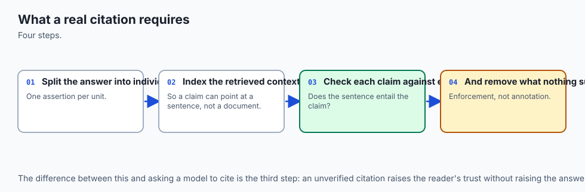
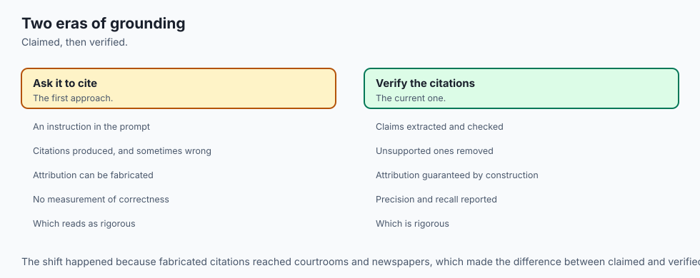
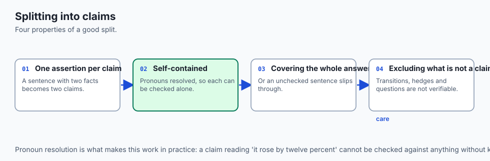
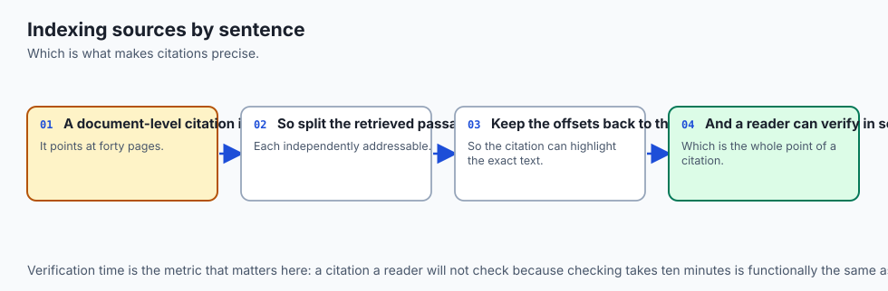
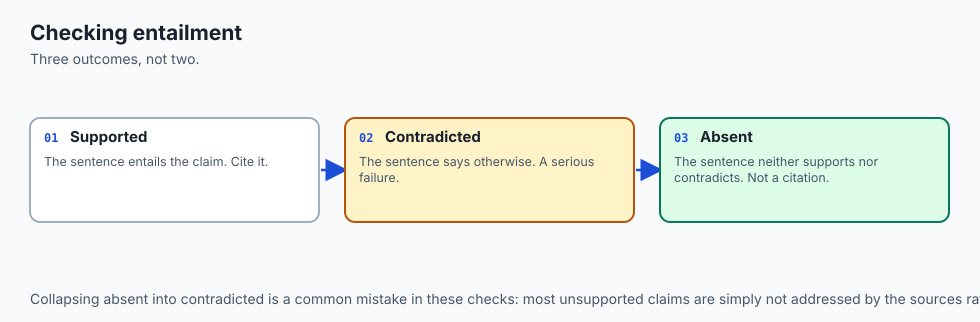
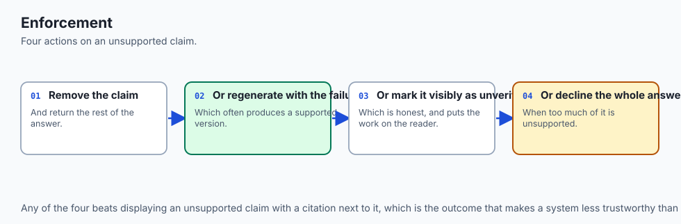
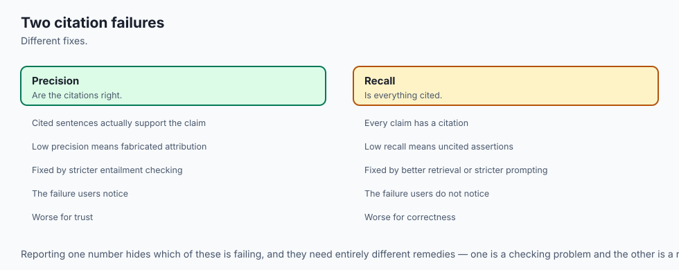
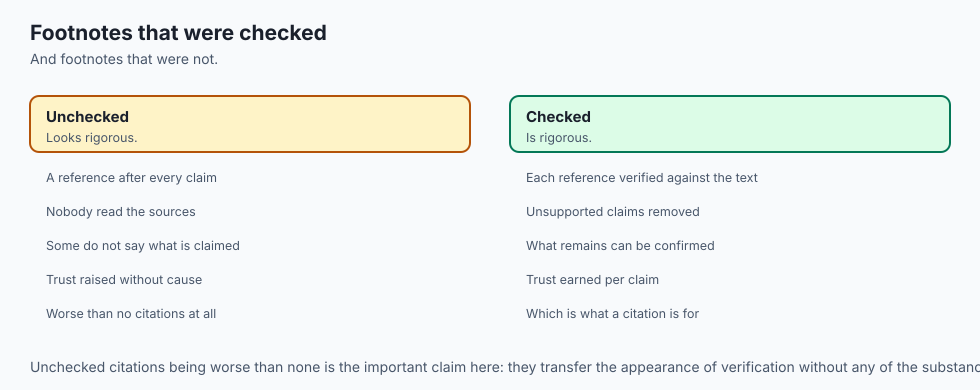
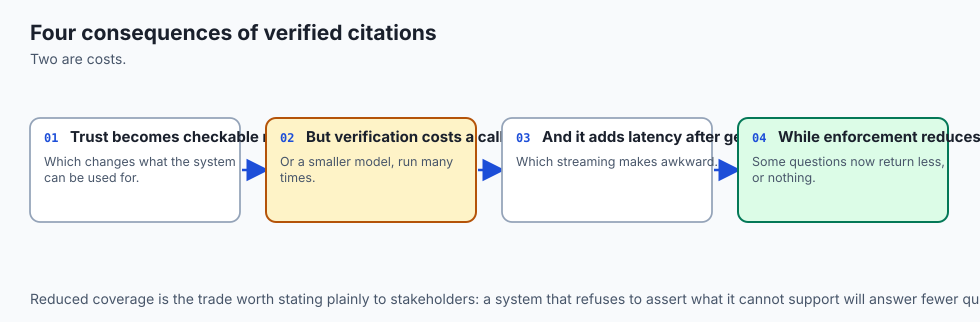
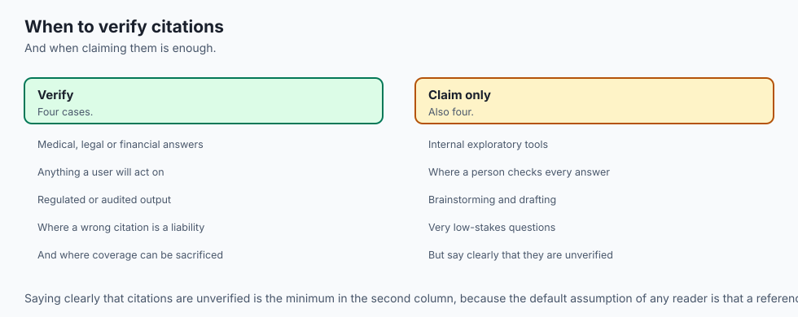

## Why this matters

A model that answers correctly and a model that answers correctly *and can show
you where* are separated by one property, and it is the property that decides
whether the system is usable in a regulated setting.

"Prompt caching costs $3.75 per million write tokens" is an assertion. The same
sentence followed by `[2]`, where `[2]` resolves to a specific sentence in a
specific document, is a **checkable claim**. A reader can verify it in seconds.
An auditor can verify it later. A test can verify it continuously.

The difference matters because grounded-looking answers are cheap to produce and
hard to trust:

```text
  ungrounded   "Write caching costs $3.75/M tokens."
  decorated    "Write caching costs $3.75/M tokens [1]."     ← [1] cites the
                                                               pricing page,
                                                               which says $3.00
  grounded     "Write caching costs $3.75/M tokens [1]."     ← [1] is the exact
                                                               sentence that
                                                               says $3.75
```

The middle case is the dangerous one. It has the visual signature of rigour and
none of the substance, and users trust it *more* than an uncited answer. Today is
about producing the third case and mechanically detecting the second.

---

## The idea in plain language



Treat a citation as a **claim about a claim**: "sentence S in source D supports
statement C". Written that way, it is something a program can check.

Journalism has the right instinct here. A quote gets a name attached, and if you
cannot attribute it you cut it. Not "roughly this, from somewhere in the report"
— this sentence, this page.

The unit matters enormously. Citing a *document* is nearly worthless when the
document is 300 pages, because verifying the claim means reading it. Citing a
*chunk* is better. Citing the **sentence** is what makes verification take
seconds rather than an afternoon, and seconds is the difference between a
citation people check and a citation people ignore.

The system therefore does something slightly odd: it takes the answer apart into
individual claims, and asks of each one separately whether the retrieved context
supports it.

---

## Historical background



- **1965** — Eugene Garfield's Science Citation Index makes citation a
  *computable* relation rather than a scholarly courtesy. Everything since,
  including PageRank, descends from that move.

- **2018** — extractive question answering (SQuAD-style) returns a span of source
  text as the answer. Attribution is perfect and fluency is nil; the answer is
  literally a substring.

- **2020** — RAG makes answers fluent again, and attribution immediately becomes
  a problem, because the model now paraphrases rather than quotes.

- **2022** — Rashkin et al. formalise **Attributable to Identified Sources**
  (AIS): a statement is attributable if a reasonable reader would agree it
  follows from the cited source. This gives evaluation a definition to aim at.

- **2023** — Bohnet et al. and the ALCE benchmark measure citation precision and
  recall separately, and find that models cite fluently while frequently citing
  the wrong passage.

- **2024 onwards** — commercial assistants ship inline citations as a default
  feature, and users learn — often the hard way — that a citation link is not the
  same as a verified claim.

The arc runs from perfect attribution with no fluency, through fluency with no
attribution, to the current attempt to have both.

---

## What it is — and what it is not

**It is** a mechanism with three parts: split the answer into atomic claims, map
each claim to the retrieved sentences that support it, and refuse — or flag —
any claim that maps to nothing.

**It is not** a fact-checker. Grounding says a claim follows from the retrieved
context. If the context is wrong, a perfectly grounded answer is confidently
wrong, and no amount of citation machinery detects that.

| Property | What it guarantees | What it does not |
| --- | --- | --- |
| Grounded | The context says this | The context is correct |
| Cited | A source is named | The source says what is claimed |
| Verified | A person or test checked | It stays true tomorrow |

The middle row is where most systems actually sit while presenting as the third.
Distinguishing them is the point of today's lab.

---

## Why it was created and what problems it solves

Four failure modes, in rough order of how often they appear in practice:

**The unsupported sentence.** The answer contains a fluent sentence that no
retrieved passage supports. The model filled a gap from parametric memory. It
may even be true, which makes it harder to spot.

**The mis-citation.** A claim carries `[2]`, but the supporting text is in `[3]`
— or nowhere. The citation is decorative. Readers who spot-check one citation and
find it plausible then trust the rest.

**The over-broad citation.** The answer cites a whole 800-word chunk for a
specific number. Technically the number is in there. Verifying it means reading
800 words, so nobody does.

**The stale citation.** The source was re-indexed and the chunk boundaries moved.
`[2]` now points at different text than when the answer was generated. The
citation is live, resolvable, and wrong.

Each is invisible to a reader skimming for the citation marker. Each is
detectable mechanically, which is what makes this worth automating rather than
reviewing.

---

## How it works


### 1. Split the answer into atomic claims



A claim is one assertion. "Write caching costs $3.75 per million tokens and read
caching costs $0.30" is two claims and needs two citations, possibly to two
different sentences.

Sentence splitting is a reasonable first approximation, but conjunctions matter:
split on sentence boundaries first, then on " and " where both halves contain a
number or a named entity. Over-splitting is much safer than under-splitting,
because an unsupported half-sentence is exactly what you are hunting.

### 2. Index the retrieved context by sentence



The chunks that went into the prompt are split into sentences, each keeping its
chunk id and character offsets. This is the citation target set — and note that
it is built from what was *actually retrieved*, not from the corpus. A claim can
only be supported by something the model could see.

### 3. Score each claim against each sentence



Two signals, and both are needed:

- **Lexical overlap** — a numeric or named-entity claim should share its
  distinctive tokens with the supporting sentence. `$3.75` is decisive evidence.

- **Semantic similarity** — a paraphrase shares meaning without sharing words,
  and lexical overlap alone would reject it.

Take the best-scoring sentence per claim. Where the best score falls below a
threshold, the claim is **unsupported** — and that outcome is the useful one.

### 4. Enforce, do not decorate



Given the mapping, three enforcement options, in increasing strictness:

```text
  annotate   attach [n] to each supported claim; mark the rest
  strip      remove unsupported claims from the answer entirely
  refuse     if any claim is unsupported, return "not in the sources"
```

Which is right depends on the cost of a wrong answer. A code-documentation
assistant can annotate. A system quoting drug dosages should refuse.

### 5. Report precision and recall separately



Citation **precision** is the share of citations that genuinely support their
claim. Citation **recall** is the share of claims that carry a citation at all.

They fail independently and they trade against each other. A model that cites
every sentence with `[1]` has perfect recall and terrible precision. One that
cites only the single most obvious claim has the reverse. A single blended score
hides exactly the failure you are looking for, which is why the lab reports both.

---

## An everyday analogy



This is the difference between a student's essay and a court transcript.

The essay says "the defendant was seen leaving at nine". The transcript says
"the defendant was seen leaving at nine (Witness B, page 14, line 6)". Both may
be accurate. Only one can be checked without re-running the trial.

And the analogy carries the failure mode too: a citation to "the witness
statements" — all 200 pages of them — is formally a citation and practically
useless. The value is entirely in how narrow the pointer is.

---

## Examples in practice


**Splitting an answer into claims**

```python
def split_claims(answer: str) -> list[str]:
    sentences = re.split(r"(?<=[.!?])\s+", answer.strip())
    claims: list[str] = []
    for s in sentences:
        parts = s.split(" and ")
        # Only split on "and" when both halves carry their own evidence.
        if len(parts) == 2 and all(re.search(r"\d|[A-Z]{2,}", p) for p in parts):
            claims.extend(p.strip(" .") for p in parts)
        else:
            claims.append(s)
    return [c for c in claims if c]
```

**Scoring a claim against the retrieved sentences**

```python
def support_for(claim: str, sentences: list[Sentence]) -> tuple[Sentence, float]:
    claim_tokens = set(re.findall(r"\w+", claim.lower()))
    best, best_score = None, 0.0
    for sent in sentences:
        tokens = set(re.findall(r"\w+", sent.text.lower()))
        lexical = len(claim_tokens & tokens) / max(len(claim_tokens), 1)
        semantic = cosine(embed(claim), sent.vector)
        score = 0.5 * lexical + 0.5 * semantic
        if score > best_score:
            best, best_score = sent, score
    return best, best_score
```

**Enforcement**

```python
THRESHOLD = 0.45

def enforce(claims, sentences, mode="annotate"):
    out, unsupported = [], 0
    for claim in claims:
        sent, score = support_for(claim, sentences)
        if score >= THRESHOLD:
            out.append(f"{claim} [{sent.chunk_id}]")
        else:
            unsupported += 1
            if mode == "annotate":
                out.append(f"{claim} [unsupported]")
            elif mode == "refuse":
                return "The sources do not support a complete answer.", unsupported
    return " ".join(out), unsupported
```

**The two metrics, kept apart**

```python
precision = correct_citations / max(total_citations, 1)
recall    = cited_claims      / max(total_claims, 1)
# Never average these. A system can be excellent at one and useless at the other.
```

---

## Implications: security, privacy, performance, scalability, and cost



**Security.** Citations are an exfiltration channel. If a chunk the user is not
cleared to see supports a claim, citing it leaks its existence and often its
content. Filter the citable set by the *user's* permissions, not the indexer's.

**Privacy.** A citation is a durable pointer into source material. Stored
answer-plus-citation pairs are a second copy of the data, with their own
retention and their own deletion obligations — a point Day 328 develops.

**Performance.** Claim-level verification is `claims × sentences` similarity
computations. For a five-claim answer over twenty sentences that is 100 cheap
operations — negligible next to the generation call that produced the answer.

**Scalability.** Verification cost scales with answer length, not corpus size,
which is unusual and welcome. A larger corpus does not make verification slower.

**Cost.** If verification uses a model rather than arithmetic, it is a second
inference per answer. Doing the lexical-plus-embedding version first and
escalating only ambiguous claims to a model keeps the cost near zero for the
majority.

---

## Alternatives: free, open source, and commercial

| Approach | Licence | Strength | Weakness |
| --- | --- | --- | --- |
| Prompt-only ("cite your sources") | free | One line to implement | Unenforced; models cite plausibly and wrongly |
| Post-hoc verification (today's lab) | free | Mechanical, testable, model-agnostic | Threshold needs tuning per corpus |
| NLI entailment models | Apache-2.0, free | Genuine entailment, catches paraphrase | Extra model to host; slower |
| RAGAS `faithfulness` | Apache-2.0, free | Standard metric, batteries included | Uses an LLM judge; costs per evaluation |
| Anthropic citations API | Commercial | Provider-verified spans | Provider-specific |

Prompt-only is where nearly everyone starts and it is the weakest option on the
list, because it produces exactly the decorated citations described above. The
distance from "ask nicely" to "check mechanically" is about forty lines.

---

## Comparison with related concepts

| Concept | Question it answers | Relationship to citations |
| --- | --- | --- |
| Faithfulness | Does the answer follow from the context? | The same property, measured in aggregate |
| Hallucination detection | Did the model invent something? | The complement — an unsupported claim |
| Provenance | Where did this data originally come from? | Upstream; about the corpus, not the answer |
| Explainability | Why did the model produce this? | About the model's reasoning, not its evidence |

Faithfulness and citation are the same underlying property at two granularities:
faithfulness scores the answer, citation points at the sentence. Tomorrow's
patterns improve what gets retrieved; Day 272 measures whether the answer used it.

---

## When to use it — and when not to



**Enforce citations when** answers inform decisions with consequences, the domain
is regulated, users cannot easily verify claims themselves, or the corpus updates
often enough that stale knowledge is a real risk.

**Relax them when** the task is creative, the user is the domain expert and can
spot an error instantly, or latency budget genuinely does not permit the extra
pass.

**Reconsider the design when** citation recall is persistently low. That usually
means retrieval is not returning what the answer needs, and the fix is upstream
in chunking or ranking rather than in the citation layer. A verification stage
that keeps failing is often reporting someone else's bug.

---

## The AI connection

- **A citation that nobody verified is decoration**, and it increases trust without
  increasing accuracy — which is worse than none.
- **Claim-level attribution is the unit that matters**, because an answer-level citation
  hides which sentence was invented.
- **Entailment checking is how grounding becomes measurable** rather than aspirational.
- **Precision and recall of citations are different failures** — citing something wrong and
  failing to cite something right need different fixes.
- **Enforcement means removing unsupported claims**, not flagging them, which is the
  difference between a check and a guarantee.

## Knowledge check

```yaml
quiz:
  question: "What does a grounding check guarantee, and what does it not?"
  options:
    - "That the model used retrieval; not which passage it used"
    - "That the answer is factually true; not that it is well written"
    - "That the source is current; not that it is authoritative"
    - "That the context says this; not that the context is correct"
  answer_index: 3
  explanation: "Grounding is a containment property. A perfectly grounded answer drawn from an out-of-date document is confidently wrong, and no citation machinery detects that."
```

---

## Hands-on exercise

In this exercise, you will build and evaluate a modular Python RAG pipeline that ingests a sample technical knowledge base, performs hybrid lexical-dense search, constructs a grounded system prompt, and validates answer grounding.

### Expected output

When running your test suite, you should observe:
```text
============================= test session starts ==============================
collected 4 items

tests/test_grounded_citations_lib.py::test_document_chunker PASSED              [ 25%]
tests/test_grounded_citations_lib.py::test_sparse_bm25 PASSED                   [ 50%]
tests/test_grounded_citations_lib.py::test_hybrid_ranker PASSED                 [ 75%]
tests/test_grounded_citations_lib.py::test_prompt_synthesizer PASSED            [100%]

============================== 4 passed in 0.04s ===============================
```

### Validate your work

Run the pytest test runner script:
```bash
pytest tests/ -v
```

### Troubleshooting

- **Issue:** BM25 returns zero relevance scores for exact keyword searches.
  - **Fix:** Ensure input query terms are tokenized and lowercased using `re.findall(r'\w+', query.lower())`.
- **Issue:** Document chunker creates duplicate final chunks.
  - **Fix:** Ensure sliding window loop terminates when `i + chunk_size >= len(words)`.

### Common mistakes

- **Naive String Slicing:** Slicing raw strings every 1000 characters cuts words in half. Always chunk across token or whitespace boundaries.
- **Ignoring Document Frequency in BM25:** Forgetting to compute corpus-wide IDF makes common stopwords dominate search rankings.

---

## Practice assignment

Take three answers your Day 268 pipeline produced and verify them by hand.

For each answer, write out every claim on its own line. Beside each, record the
sentence from the retrieved context that supports it, or write "unsupported".
Then compute citation precision and recall for the three answers.

Finally, find one claim that is **true but unsupported** — the model knew it from
training rather than from your corpus. Explain why that case is more dangerous
than a claim that is simply false, and what your pipeline should do with it.

---

## Extension challenge

Implement **citation stability across re-indexing**.

Store, with each answer, the chunk id, the source document id, and a hash of the
cited sentence. After re-indexing the corpus, check every stored citation: does
the chunk id still exist, and does the sentence hash still match?

Report three counts — intact, moved (sentence found under a different chunk id),
and lost. Then decide what the system should do about "moved": silently repoint,
or flag for review? Argue your answer using the difference between a citation
that is still correct and one that merely still resolves.

---

