## Why this matters

Days 268 to 270 assumed something that is usually false: that **the user's
question resembles the passage that answers it**.

It frequently does not. A question and its answer are different kinds of text.

```text
  question   "why is my build slow"
  answer     "Layer cache invalidation occurs when any instruction above a
              COPY directive is modified, forcing rebuild of all subsequent
              layers."
```

Almost no shared vocabulary. BM25 finds nothing. A dense retriever does better
but is still comparing a six-word fragment against a technical paragraph — short
queries have unstable embeddings, because there is very little signal to average
over.

Every technique today attacks that gap from a different side. Generate several
phrasings of the question. Generate a fake *answer* and search with that instead.
Search small and return large. None is exotic; each is a few lines, and each
targets a specific, measurable failure of the naive approach.

---

## The idea in plain language

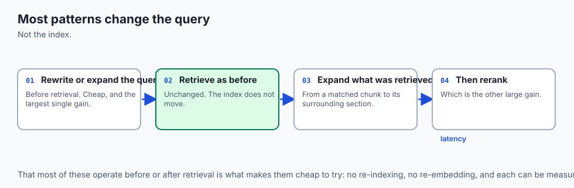

The trick is to stop searching with the question.

A researcher handed "why is my build slow" does not type those words into a
library catalogue. They think for a moment about what a document answering it
would look like — it would mention caching, layers, invalidation, dependencies —
and they search for *that*. They are searching with an imagined answer.

That is **HyDE**: have the model write a hypothetical answer, embed the
hypothetical answer, and search with it. The hypothetical may be factually wrong.
It does not matter, because it is never shown to anyone. It is being used purely
as a **better-shaped query** — a paragraph of the right kind of language, sitting
in roughly the right neighbourhood of the vector space.

The second idea is just as simple. Ask the question three different ways and take
the union. Where a single phrasing might miss, three rarely all miss.

---

## Historical background

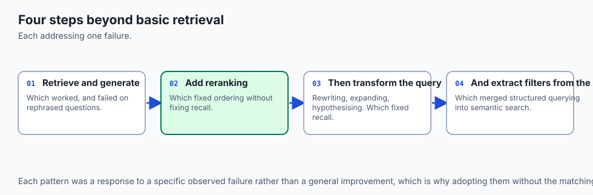

- **1971** — Rocchio's relevance feedback: use the documents a user liked to
  reformulate their query. Query expansion is fifty years old.

- **1996** — Xu and Croft formalise pseudo-relevance feedback, expanding a query
  with terms drawn from its own top results, with no user involvement at all.

- **2016** — RM3 and related models make expansion a standard component of
  strong lexical baselines.

- **2022** — Gao et al. publish **HyDE**, *Precise Zero-Shot Dense Retrieval
  without Relevance Labels*. Generate a hypothetical document, embed that, search
  with it. It beats strong dense baselines with no labelled data whatsoever.

- **2023** — multi-query retrieval and RAG-Fusion appear in tooling; small-to-big
  and parent-document retrieval separate the unit you *search* from the unit you
  *read*.

- **2023** — self-querying retrievers translate natural language into structured
  metadata filters, so "papers after 2020 about attention" becomes a filter plus
  a search rather than one blurry vector.

The consistent thread across fifty years is that the query as typed is rarely the
best query available.

---

## What it is — and what it is not

**It is** a set of independent, composable techniques applied at query time. Each
addresses a distinct failure of naive retrieval, and each can be measured on its
own.

**It is not** a package deal, and applying all of them is usually wrong. Each
costs latency, and several cost an extra model call per query.

| Technique | The failure it fixes | Cost |
| --- | --- | --- |
| Multi-query | One phrasing misses | 1 model call, N searches |
| HyDE | Question and answer look different | 1 model call |
| Small-to-big | Precise match, insufficient context | None — an index-time choice |
| Self-query | Filterable constraints buried in prose | 1 model call |
| Reranking | Good recall, poor ordering | 1 cross-encoder pass |

The discipline that matters is measuring before adopting. "Advanced" is not a
synonym for "better" — on a corpus where the naive approach already retrieves the
right chunk, every one of these adds latency and changes nothing.

---

## Why it was created and what problems it solves

Four specific, recognisable failures:

**The vocabulary mismatch.** The user says "slow build"; the document says "layer
cache invalidation". No lexical overlap, weak semantic overlap. Multi-query and
HyDE both attack this.

**The unstable short query.** A three-word query produces an embedding dominated
by whichever word happens to carry the most weight. Averaging several phrasings,
or embedding a full paragraph instead, stabilises it.

**The granularity conflict.** Small chunks match precisely and lack the
surrounding context needed to answer. Large chunks carry context and match
diffusely. Small-to-big resolves this by refusing to choose: search small, return
the parent.

**The buried constraint.** "What did we ship in Q3 2024?" contains a date filter
disguised as prose. Semantic search over a date range is hopeless; a metadata
filter is trivial. Self-querying extracts the filter and applies it properly.

Recognising which of the four you actually have is most of the work. Applying the
matching technique is the easy part.

---

## How it works


### 1. Multi-query expansion

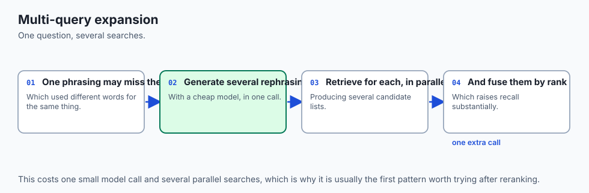

Ask the model for three alternative phrasings, run all of them, and fuse the
result lists with Reciprocal Rank Fusion — the same function from Day 268, now
merging four rankings instead of two.

```text
  "why is my build slow"
       ├── "Docker build cache invalidation causes"
       ├── "reasons a container image rebuild takes a long time"
       └── "how layer ordering affects build duration"
```

A chunk retrieved by two phrasings outranks one retrieved by a single phrasing.
That is exactly the consensus signal RRF was designed to capture.

### 2. HyDE

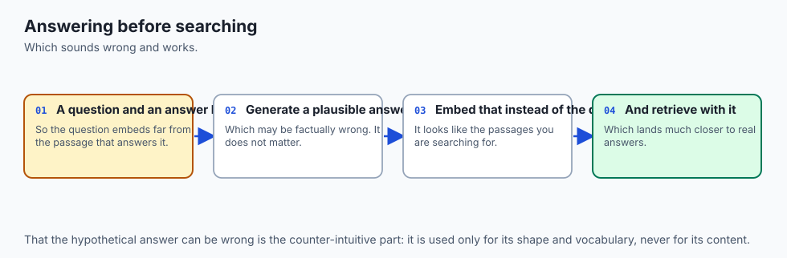

Ask the model to *answer* the question from its own knowledge, embed that
answer, and search with its vector. Discard the hypothetical text afterwards.

The hypothetical may contain errors. It is never returned to the user and never
enters the final context — its only job is to be a paragraph-shaped query in the
right region of the embedding space. The retrieved passages are real; only the
probe was invented.

### 3. Small-to-big retrieval

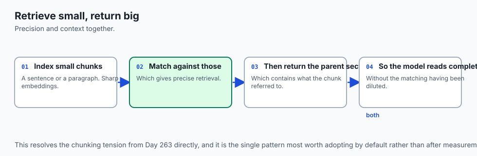

Index small chunks — a sentence or two — for precision. Store each one's parent:
the surrounding section or the whole document. Search over the small units, then
return the parents.

This is the cheapest technique here because it costs nothing at query time. It is
an indexing decision made once, and it dissolves the precision-versus-context
trade rather than balancing it.

### 4. Self-querying

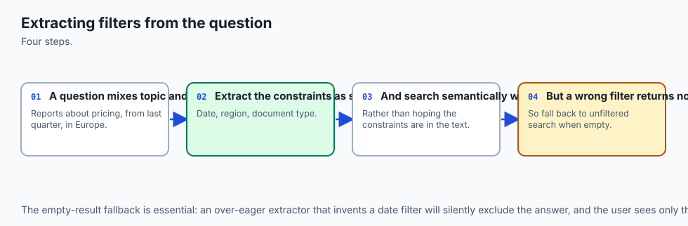

Have the model extract structured filters from the question before searching:

```json
{ "semantic": "attention mechanisms", "filters": { "year": { "$gte": 2020 } } }
```

Apply the filter as a filter, and search semantically over what survives. A date
range is a database operation; asking an embedding to represent "after 2020" is
asking it to do arithmetic it cannot do.

### 5. Reranking

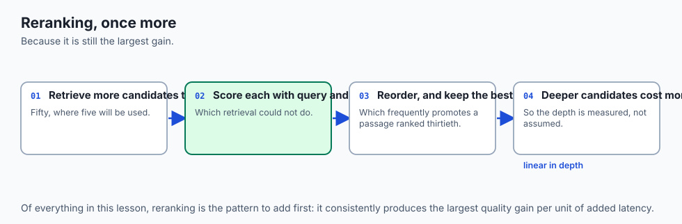

Retrieval optimises recall; reranking optimises order. A cross-encoder reads
query and passage *together* — full attention across both — and scores relevance
far more accurately than a dot product between two independently computed
vectors.

It is too slow to run over the corpus and ideal over 50 candidates. Retrieve 50
cheaply, rerank to 5 accurately. Note the ordering constraint from Day 326: a
reranker can only reorder what retrieval already returned. If the right document
was never a candidate, no amount of reranking will surface it.

---

## An everyday analogy

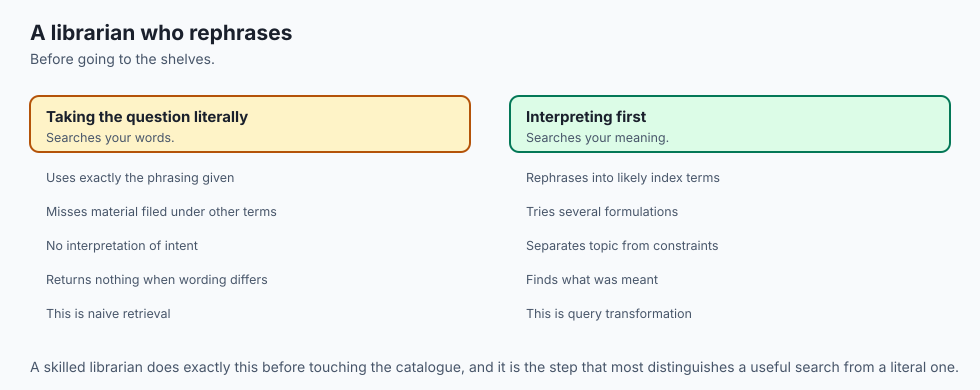

A junior researcher types your exact words into the catalogue and reports back
that there is nothing.

A senior one does something different before searching at all. They rephrase the
question three ways because they know the catalogue's vocabulary differs from
yours. They think about what a paper answering this would be *titled* and search
for that instead. They search chapter titles but hand you the whole chapter,
because a sentence out of context is no use. And when you say "recent work", they
convert that to `year >= 2020` rather than hoping the catalogue understands the
word "recent".

Same catalogue, same query, very different results — because the senior
researcher does not treat your question as the query.

---

## Examples in practice


**Multi-query with RRF**

```python
def multi_query(question: str, k: int = 5) -> list[Chunk]:
    variants = [question] + generate_paraphrases(question, n=3)
    rankings = [dense_search(v, k=20) for v in variants]
    return rrf(*rankings)[:k]          # rrf() is Day 268's, unchanged
```

**HyDE**

```python
HYDE_PROMPT = (
    "Write a short factual paragraph that would answer this question. "
    "Do not hedge, do not say you are unsure — accuracy is not required.\n\n"
    "Question: {q}"
)

def hyde_search(question: str, k: int = 5) -> list[Chunk]:
    hypothetical = llm(HYDE_PROMPT.format(q=question))
    # The text is thrown away; only its vector is used.
    return dense_search_by_vector(embed(hypothetical), k=k)
```

**Small-to-big**

```python
def small_to_big(question: str, k: int = 3) -> list[str]:
    hits = dense_search(question, k=k * 4)        # precise, narrow units
    parents, seen = [], set()
    for h in hits:
        if h.parent_id not in seen:               # dedupe: siblings share a parent
            seen.add(h.parent_id)
            parents.append(PARENTS[h.parent_id])
        if len(parents) == k:
            break
    return parents
```

**Measuring whether any of it helped**

```python
for name, retrieve in [("naive", naive), ("multi", multi_query), ("hyde", hyde_search)]:
    hits = sum(gold_id in {c.id for c in retrieve(q)} for q, gold_id in eval_set)
    print(f"{name:6} recall@5 = {hits / len(eval_set):.2f}")
```

That last block is the important one. Every technique above is a hypothesis until
this table says otherwise.

---

## Implications: security, privacy, performance, scalability, and cost

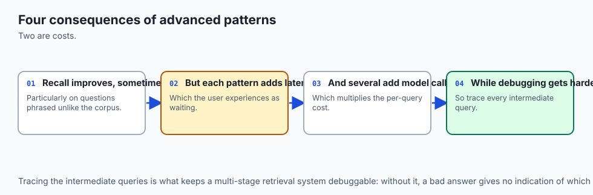

**Performance.** Multi-query multiplies searches by the number of variants and
adds a model call before any search begins. HyDE adds a model call on the
critical path — typically 200–800 ms, which for an interactive assistant is
often the single largest latency item.

**Cost.** Each query-time model call is a real per-query cost. At a million
queries a month, a small model at $0.15 per million tokens generating 100 tokens
per call is roughly $15 — trivial. The same pattern with a frontier model is not.

**Scalability.** Small-to-big increases index size modestly (small chunks plus
parent references) and costs nothing at query time. It is usually the best
value in the list and it is the one people reach for last.

**Security.** Self-querying lets model output construct a database filter. Treat
the extracted filter as untrusted input: validate field names against an
allow-list and types against a schema. A model that can write arbitrary filters
can write `{"user_id": {"$ne": null}}`.

**Privacy.** HyDE sends the user's question to a generation model before any
retrieval happens. In a deployment where retrieval is local but generation is
hosted, that is a data-egress decision made implicitly by a retrieval technique.

---

## Alternatives: free, open source, and commercial

| Technique | Availability | Adds latency | Typical recall gain |
| --- | --- | --- | --- |
| Multi-query | Any model | 1 call + N searches | Moderate, consistent |
| HyDE | Any model | 1 call | Large where vocabulary differs |
| Small-to-big | Index-time only | None | Large where context matters |
| Self-query | Any model | 1 call | Large where filters exist, none otherwise |
| Cross-encoder rerank | `bge-reranker`, Cohere Rerank | 50–200 ms | Large on ordering |

Ranked by value per unit of complexity, the order is usually: small-to-big first
because it is free at query time, then reranking because the gain is reliable,
then HyDE, then multi-query, and self-query only when the corpus actually has
metadata worth filtering on.

---

## Comparison with related concepts

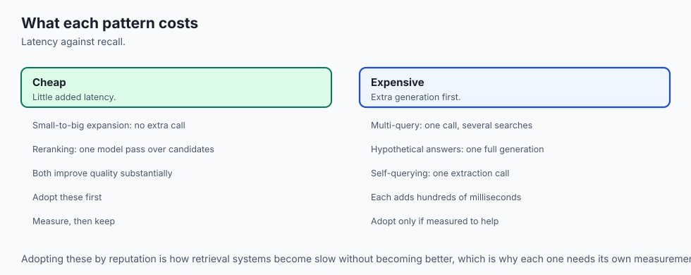

| Approach | When it acts | What it changes |
| --- | --- | --- |
| Better chunking | Index time | What can be retrieved at all |
| Query expansion | Query time | What is retrieved for this question |
| Reranking | After retrieval | The order of what was retrieved |
| Larger context window | Generation | How much of it the model can read |

These stack rather than compete, and they have a strict precedence. No amount of
query expansion recovers a fact that chunking destroyed, and no reranker promotes
a document retrieval never returned. Fix them in that order — index, then query,
then ranking — or you will tune the wrong stage.

---

## When to use it — and when not to

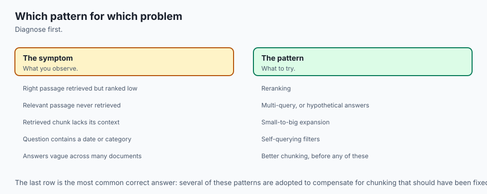

**Reach for these when** measured recall is the bottleneck, users phrase
questions very differently from the source material, the corpus mixes short
identifiers with long prose, or answers need more context than the matching
chunk contains.

**Do not reach for them when** you have not measured a baseline. Every technique
here is justified by a number, and adopting them by reputation is how a pipeline
acquires 800 ms of latency and no improvement.

**Prefer the cheap ones first.** Small-to-big and reranking cost no extra model
call. Exhaust the free options before adding a generation call to the critical
path of every query.

---

## The AI connection

- **Most advanced retrieval patterns work by changing the query**, not the index, which
  makes them cheap to try.
- **The naive question is often a poor search query**, and rewriting it is the highest-return
  intervention after reranking.
- **Every pattern trades latency and cost for recall**, so each one needs measuring on your
  own corpus rather than adopting on reputation.
- **Metadata filters extracted from the question** turn a semantic search into a hybrid of
  search and structured query.
- **Adding patterns without measuring them is how retrieval systems get slow** without
  getting better.

## Knowledge check

```yaml
quiz:
  question: "In HyDE, why does it not matter if the hypothetical answer contains factual errors?"
  options:
    - "It is never shown to anyone; only its vector is used as the query"
    - "The errors are corrected by the reranking stage before generation"
    - "The model verifies the hypothetical against the corpus before searching"
    - "Errors are removed by lowercasing and stripping punctuation"
  answer_index: 0
  explanation: "The hypothetical exists to be a paragraph-shaped probe in roughly the right region of embedding space. It is discarded after embedding and never enters the final context."
```

---

## Hands-on exercise

In this exercise, you will build and evaluate a modular Python RAG pipeline that ingests a sample technical knowledge base, performs hybrid lexical-dense search, constructs a grounded system prompt, and validates answer grounding.

### Expected output

When running your test suite, you should observe:
```text
============================= test session starts ==============================
collected 4 items

tests/test_advanced_rag_lib.py::test_document_chunker PASSED              [ 25%]
tests/test_advanced_rag_lib.py::test_sparse_bm25 PASSED                   [ 50%]
tests/test_advanced_rag_lib.py::test_hybrid_ranker PASSED                 [ 75%]
tests/test_advanced_rag_lib.py::test_prompt_synthesizer PASSED            [100%]

============================== 4 passed in 0.04s ===============================
```

### Validate your work

Run the pytest test runner script:
```bash
pytest tests/ -v
```

### Troubleshooting

- **Issue:** BM25 returns zero relevance scores for exact keyword searches.
  - **Fix:** Ensure input query terms are tokenized and lowercased using `re.findall(r'\w+', query.lower())`.
- **Issue:** Document chunker creates duplicate final chunks.
  - **Fix:** Ensure sliding window loop terminates when `i + chunk_size >= len(words)`.

### Common mistakes

- **Naive String Slicing:** Slicing raw strings every 1000 characters cuts words in half. Always chunk across token or whitespace boundaries.
- **Ignoring Document Frequency in BM25:** Forgetting to compute corpus-wide IDF makes common stopwords dominate search rankings.

---

## Practice assignment

Build a twenty-question evaluation set against your Day 268 corpus, recording for
each question the chunk id that genuinely answers it.

Measure `recall@5` for four configurations: naive dense search, multi-query,
HyDE, and small-to-big. Report four numbers and the latency of each.

Then find one question where an advanced technique performs *worse* than naive
retrieval, and explain why. There will be one — HyDE hurts when the model's
hypothetical wanders into a different topic, and multi-query hurts when a
paraphrase drifts. Knowing when a technique backfires is worth more than knowing
its average gain.

---

## Extension challenge

Implement **adaptive retrieval**: choose the technique per query rather than
applying one to all.

Route on cheap signals — query length, presence of a date or identifier,
whether the naive search's top score clears a confidence threshold. Short vague
queries go to HyDE; queries containing an exact identifier go straight to BM25;
queries with a date go to self-query.

Measure recall and mean latency against always-HyDE and always-naive. Report
whether the routing paid for its own complexity. If it did not, say so — a
negative result honestly measured is the point of the exercise.

---

