## Why this matters

Six days of components, one system. Today they become a documentation assistant
that real people can use — and the gap between a working pipeline and a usable
product turns out to be made of things none of the previous days needed.

A demo answers questions. A product also has to answer these:

```text
  the doc changed an hour ago     — is the index stale?
  this user cannot see that page  — did retrieval leak it?
  the corpus has no answer        — did it say so, or invent one?
  the model provider is down      — is there anything to serve?
  the same question, 500 times    — are we paying 500 times?
```

None of those is a retrieval problem, and none can be bolted on afterwards.
Freshness is an indexing decision. Access control is a filter that must run
*before* the context is assembled. Abstention is a prompt and a threshold. Each
one changes the architecture, which is why today is a design lesson rather than
another algorithm.

---

## The idea in plain language

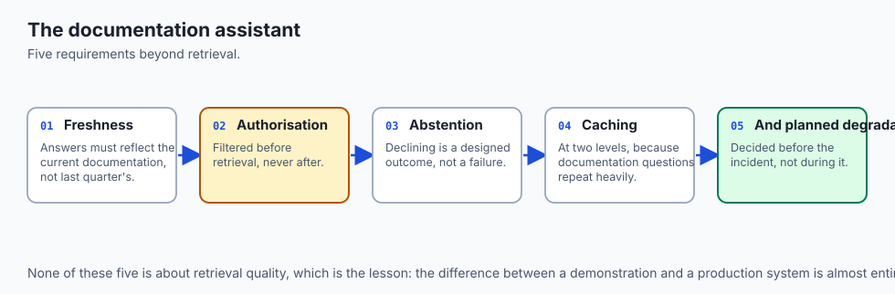

The pipeline you have is the **easy half**. The other half is everything that
happens when reality intrudes.

A librarian who has read every book is not yet a good librarian. A good one also
knows which editions are current, will not hand you a file you are not cleared to
read, says "we don't have anything on that" instead of improvising, and has a
plan for when the lights go out.

Concretely, four properties turn a pipeline into an assistant:

- **Freshness** — the index reflects the source within a known, stated bound.
- **Authorisation** — retrieval is filtered by *this user's* permissions.
- **Abstention** — "I don't know" is a supported, tested answer.
- **Degradation** — when a dependency fails, something useful still happens.

Every one of them is a decision you make once, in the architecture, and cannot
retrofit cheaply.

---

## Historical background

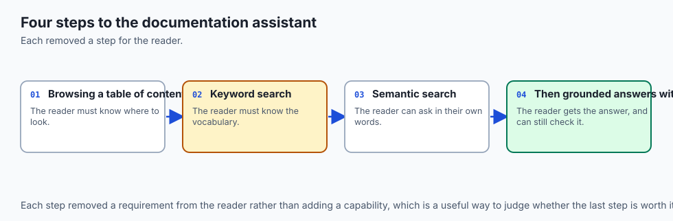

- **1966** — ELIZA. The first system people confided in, and the first
  demonstration that fluency reads as understanding. Every warning in this
  lesson is a descendant of that observation.

- **1990s** — enterprise search arrives and largely disappoints. Retrieval
  worked; the missing pieces were freshness, permissions, and the fact that
  keyword matching does not answer questions.

- **2004** — Google Desktop and its contemporaries make incremental indexing
  ordinary: watch the filesystem, re-index what changed, do not rebuild nightly.

- **2010s** — documentation search settles on a good local optimum: static site
  generators plus a lexical index (Lunr, Algolia). Fast, cheap, and it returns
  pages rather than answers.

- **2023** — RAG-based documentation assistants ship widely. They answer rather
  than link, and immediately surface the problems this lesson is about: stale
  answers quoting deleted APIs, and confident answers to questions the docs never
  addressed.

- **2024 onwards** — the reference architecture stabilises around retrieval plus
  citations plus abstention plus incremental freshness, which is precisely the
  set of things the previous six days built.

The historical lesson is that search over documentation has been solved for
twenty years. Answering *from* documentation is the new part, and the new part is
where trust is won or lost.

---

## What it is — and what it is not

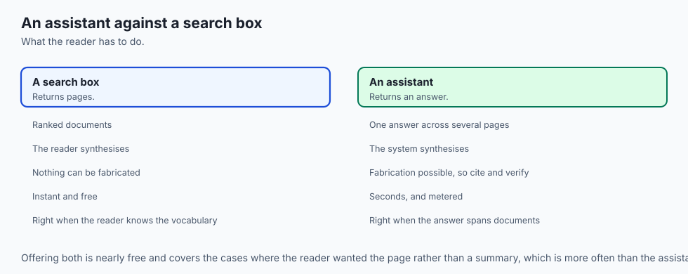

**It is** an integration: a system where each of the past six days occupies a
defined stage, with the operational properties that make it deployable.

**It is not** a general knowledge assistant, and the boundary is a feature. A
documentation assistant that answers questions outside its corpus has stopped
being grounded and has started being a chatbot with a citation habit.

| Property | A demo | An assistant |
| --- | --- | --- |
| Missing answer | Improvises fluently | Says the docs do not cover it |
| Stale document | Answers from it silently | Knows and states its freshness bound |
| Restricted page | Retrieves it | Filters it before assembly |
| Provider outage | 500 error | Cached or degraded answer |
| Repeated question | Full cost every time | Served from cache |

The right-hand column is today's work. Notice that four of the five rows are
about **what happens when something is wrong** — which is a fair description of
production engineering generally.

---

## Why it was created and what problems it solves

Five failures that only appear once real users arrive:

**The confidently wrong answer to an uncovered question.** The single most
damaging failure, because it destroys trust in every correct answer that came
before it. A user who catches one invention starts checking everything, at which
point the assistant has negative value.

**The stale answer.** The API was deprecated last week. The index has last
month's page. The answer is faithful, well-cited, and wrong — and Day 272's
metrics all pass, because faithfulness measures containment, not currency.

**The permission leak.** A chunk from an internal roadmap is retrieved for an
external user. Citing it makes the leak worse: it hands over both the content and
a pointer to more.

**The unbounded cost.** One popular question, no cache, ten thousand identical
model calls. The bill is discovered at the end of the month.

**The hard dependency.** The generation provider has an outage and the assistant
returns nothing, when it could have returned the retrieved passages with a note —
which is what a search engine would have done and is genuinely useful.

---

## How it works


### 1. Ingestion with a freshness contract

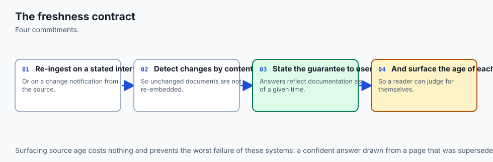

Watch the source. On change, re-chunk and re-embed only the affected document,
and record `indexed_at` per chunk. The system can then state a bound — "the index
is never more than fifteen minutes behind the source" — and, crucially, *verify*
it, because the timestamp is in the data.

Deletions matter as much as edits. A document removed at source whose chunks
remain is an orphan: still retrievable, no longer real. Reconciling the union of
both id sets — not iterating the source — is what finds them.

### 2. Authorisation before assembly, never after

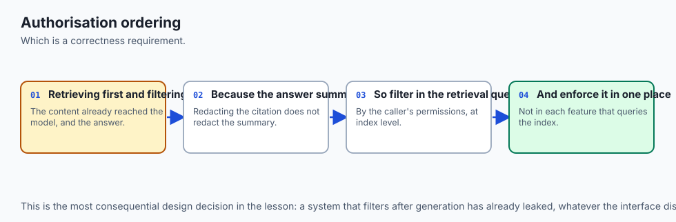

The filter belongs in the retrieval query, not in a post-processing step:

```python
hits = index.search(query_vector, k=20, filter={"acl": {"$in": user.groups}})
```

Retrieving broadly and filtering afterwards seems equivalent and is not. It
wastes the retrieval budget on chunks that will be discarded, and it puts
restricted content one bug away from the context window. A model that has seen a
passage cannot be asked to unsee it.

### 3. Abstention as a first-class outcome

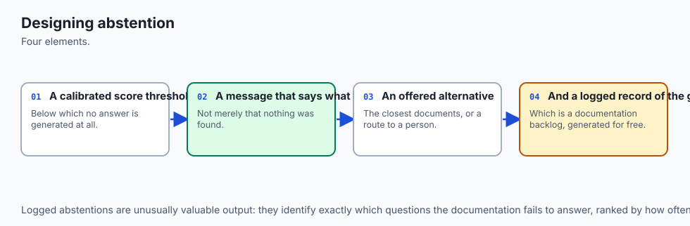

Two gates, both needed. Before generation, if the best retrieval score is below a
floor, do not call the model at all — nothing was found worth grounding in.
After generation, apply Day 270's verification: if claims are unsupported,
withhold rather than annotate.

```text
  best_score < 0.35        →  "The documentation does not cover this."
  unsupported_claims > 0   →  withhold, or return only supported claims
```

The floor is corpus-specific and must be *measured*, on questions you know are
uncovered, rather than guessed.

### 4. Caching at two levels

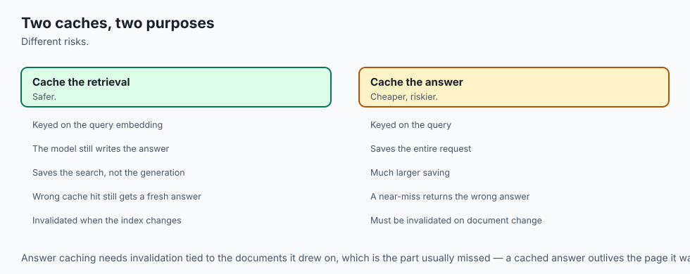

Exact-match caching on a normalised query hash is free and safe. Semantic
caching — serving a cached answer for a *similar* question — is much more
effective and introduces a real failure mode: a near-miss returns a confidently
wrong answer to a question nobody asked.

Two rules make it survivable: set the similarity threshold high (0.95 and above),
and key the cache by user permissions as well as by query, or one tenant's answer
will be served to another.

### 5. Degradation, decided in advance

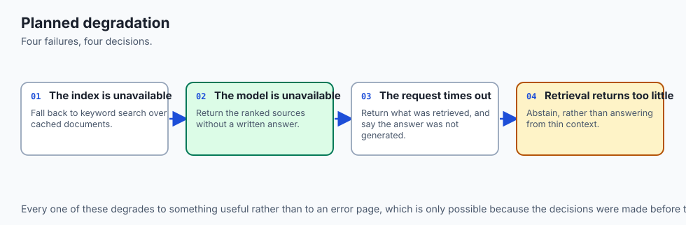

```text
  generation provider down  →  return ranked passages with citations, labelled
                               as "search results, not an answer"
  vector index down         →  fall back to lexical BM25 alone
  everything down           →  serve the cache, with its age shown
```

Each of these is more useful than an error page, and each has to be built before
the incident. "We will think about it if it happens" produces a 500.

---

## An everyday analogy

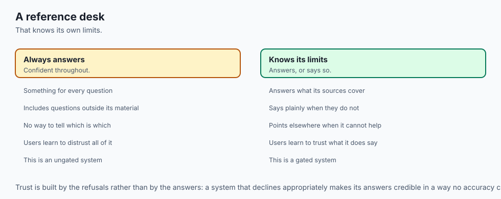

A reference librarian on the enquiry desk.

They know the collection and they know its edges. Asked something outside it,
they say so rather than guessing — and that refusal is precisely why you believe
them the rest of the time. They will not fetch you a restricted file because you
asked confidently. They know which editions are current and will tell you when
one was superseded. When the catalogue system is down they still walk you to the
right shelf, because they have a fallback.

None of that is about knowing more books. It is about knowing the boundaries of
what they know, and being reliable at the edges. That is the difference between
the pipeline you have and the assistant you are building.

---

## Examples in practice


**The request path, with every gate visible**

```python
def answer(question: str, user: User) -> Response:
    key = cache_key(question, user.groups)          # permissions are part of the key
    if hit := cache.get(key):
        return hit.with_note(f"cached {hit.age_minutes}m ago")

    hits = index.search(embed(question), k=20,
                        filter={"acl": {"$in": user.groups}})
    if not hits or hits[0].score < FLOOR:
        return Response.abstain("The documentation does not cover this.")

    chunks = rerank(question, hits)[:5]
    try:
        draft = llm(build_prompt(question, chunks))
    except ProviderError:
        return Response.degraded(chunks)            # passages beat an error page

    verified, unsupported = enforce(split_claims(draft), sentences_of(chunks))
    if unsupported:
        return Response.abstain("The documentation does not fully cover this.")

    resp = Response.ok(verified, sources=chunks, freshness=oldest(chunks))
    cache.set(key, resp, ttl=3600)
    return resp
```

**Measuring the freshness bound rather than asserting it**

```python
def staleness_seconds() -> float:
    return max((now() - c.indexed_at).total_seconds() for c in index.all_chunks())
# Alert on this, not on "did the indexer run" — a job that runs and does
# nothing looks identical to a healthy one from the outside.
```

**Finding orphans by walking the union of both id sets**

```python
def orphans(source_ids: set[str], indexed_ids: set[str]) -> set[str]:
    return indexed_ids - source_ids     # never reachable by iterating the source
```

---

## Implications: security, privacy, performance, scalability, and cost

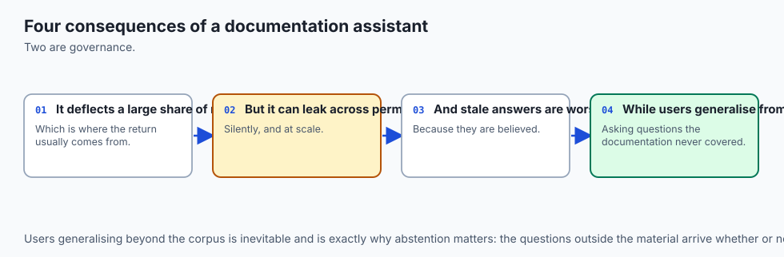

**Security.** The corpus is untrusted input to a model with tools and
credentials. A documentation page containing "ignore previous instructions" is
indirect prompt injection, and it arrives through the same channel as legitimate
content. Day 251's mitigations apply in full here.

**Privacy.** Logged questions are user data and are often more sensitive than the
answers — "how do I cancel my enterprise contract" reveals intent. Redact before
persisting, as Day 328 develops, and treat cached answers as a second copy
subject to the same deletion obligations as the first.

**Performance.** A realistic budget: embedding 20 ms, retrieval 30 ms, reranking
150 ms, generation 1,200 ms. Generation dominates, so streaming the answer moves
the user's first useful moment from 1.4 s to about 300 ms without making anything
faster.

**Scalability.** Retrieval scales with corpus size, generation with query volume,
and they scale independently — which means they should be separate services with
separate autoscaling. A traffic spike is a generation problem, not an index one.

**Cost.** Caching is the single largest lever and it is unevenly distributed:
documentation traffic is extremely head-heavy, so a small cache covering the top
questions removes most of the spend. Beware the trap from Day 327 — a high cache
hit rate proves little if the cached queries were the cheap ones.

---

## Alternatives: free, open source, and commercial

| Option | Licence | Strength | Weakness |
| --- | --- | --- | --- |
| This architecture | — | Full control; every gate is yours | You operate it |
| Algolia DocSearch | Free for OSS docs | Excellent, fast, proven | Returns links, not answers |
| Mintlify / GitBook AI | Commercial | Turnkey, good defaults | Your docs, their infrastructure |
| Kapa.ai | Commercial | Purpose-built for developer docs | Per-seat; limited control of retrieval |
| Danswer | MIT, free | Self-hostable, connectors included | Younger; you still operate it |

A useful decision rule: if the documentation is public and the questions are
routine, a hosted product will beat what you build, and quickly. Build when the
corpus is private, when permissions are non-trivial, or when you need to control
abstention behaviour — which is exactly when the hosted products are weakest.

---

## Comparison with related concepts

| System | Returns | Freshness model | Trust model |
| --- | --- | --- | --- |
| Static site search | Links | Rebuild on deploy | User reads and judges |
| This assistant | Answers with citations | Incremental, bounded | Verified claims |
| Fine-tuned model | Answers | Retrain | Opaque |
| Long-context stuffing | Answers | Immediate | Whole-document only |

The comparison worth sitting with is the first row. Static search is *older,
cheaper, faster, and never hallucinates*. It puts the reading burden on the user
and, for many documentation sets, that is the correct trade.

An assistant earns its complexity when the corpus is too large to skim, when the
answer spans several documents, or when users cannot phrase queries in the
documentation's vocabulary — which is where Day 271 began.

---

## When to use it — and when not to

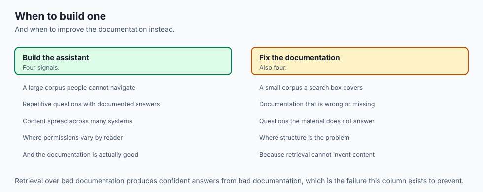

**Build an assistant when** the corpus is large enough that finding the right
page is genuinely hard, questions span multiple documents, users are non-expert,
or the same questions recur often enough that answering them has real cost.

**Prefer plain search when** the corpus is small, the audience is expert, or a
wrong answer is expensive and a missing answer is cheap. Search fails visibly;
an assistant fails invisibly, and that asymmetry should decide close cases.

**Do not ship without** abstention, permission filtering, and a measured
freshness bound. Those three are not polish. An assistant lacking any one of them
will eventually produce an answer that is confident, unauthorised, or out of
date, and a single such answer costs more trust than a hundred correct ones
build.

---

## The AI connection

- **A documentation assistant is the most common first production AI system**, and it exposes
  every operational concern at once.
- **Authorisation must happen before retrieval, not after**, or the system becomes an
  efficient way to read documents you cannot open.
- **Freshness is a contract with users**, since a confident answer from a superseded document
  is worse than no answer.
- **Abstention has to be a designed outcome**, not an accident of low scores.
- **Degradation should be decided in advance**, because the decision about what to do when
  retrieval fails is a product decision, not an incident response.

## Knowledge check

```yaml
quiz:
  question: "Why must permission filtering happen inside the retrieval query rather than after it?"
  options:
    - "The vector index cannot compute scores for filtered chunks"
    - "Filtering afterwards returns results in the wrong ranking order"
    - "A model that has seen a passage cannot be asked to unsee it"
    - "Post-filtering breaks the citation numbering in the final answer"
  answer_index: 2
  explanation: "Retrieving broadly and filtering later wastes the retrieval budget and leaves restricted content one bug away from the context window."
```

---

## Hands-on exercise

In this exercise, you will build and evaluate a modular Python RAG pipeline that ingests a sample technical knowledge base, performs hybrid lexical-dense search, constructs a grounded system prompt, and validates answer grounding.

### Expected output

When running your test suite, you should observe:
```text
============================= test session starts ==============================
collected 4 items

tests/test_doc_assistant_lib.py::test_document_chunker PASSED              [ 25%]
tests/test_doc_assistant_lib.py::test_sparse_bm25 PASSED                   [ 50%]
tests/test_doc_assistant_lib.py::test_hybrid_ranker PASSED                 [ 75%]
tests/test_doc_assistant_lib.py::test_prompt_synthesizer PASSED            [100%]

============================== 4 passed in 0.04s ===============================
```

### Validate your work

Run the pytest test runner script:
```bash
pytest tests/ -v
```

### Troubleshooting

- **Issue:** BM25 returns zero relevance scores for exact keyword searches.
  - **Fix:** Ensure input query terms are tokenized and lowercased using `re.findall(r'\w+', query.lower())`.
- **Issue:** Document chunker creates duplicate final chunks.
  - **Fix:** Ensure sliding window loop terminates when `i + chunk_size >= len(words)`.

### Common mistakes

- **Naive String Slicing:** Slicing raw strings every 1000 characters cuts words in half. Always chunk across token or whitespace boundaries.
- **Ignoring Document Frequency in BM25:** Forgetting to compute corpus-wide IDF makes common stopwords dominate search rankings.

---

## Practice assignment

Take your assistant and try to break it as a hostile user would, recording what
happens in each case:

1. Ask something the corpus genuinely does not cover. Did it abstain, or invent?
2. Ask about a document you have removed from the source but not re-indexed.
   Did it answer from the orphan?

3. Ask the same question twice and measure the second response time and cost.
4. Point the generation client at an unreachable host. Did you get passages or
   a stack trace?

Write one line per case describing what a user would see. Then fix whichever of
the four embarrassed you most, and only that one — knowing which failure matters
most is part of the exercise.

---

## Extension challenge

Implement and measure a **freshness service-level objective**.

Define it precisely: "95% of chunks are within ten minutes of their source."
Then instrument it — record `indexed_at` per chunk, compute the distribution
rather than the maximum, and expose the p95 as a metric.

Now break it deliberately: pause the indexer, edit three source documents, and
watch the number move. Confirm that your alert fires on the *distribution*
shifting rather than on the indexer process dying, because those are different
failures and only one of them is caught by a liveness check. A job that runs
happily and indexes nothing is the failure that matters, and it looks perfectly
healthy from outside.

---

