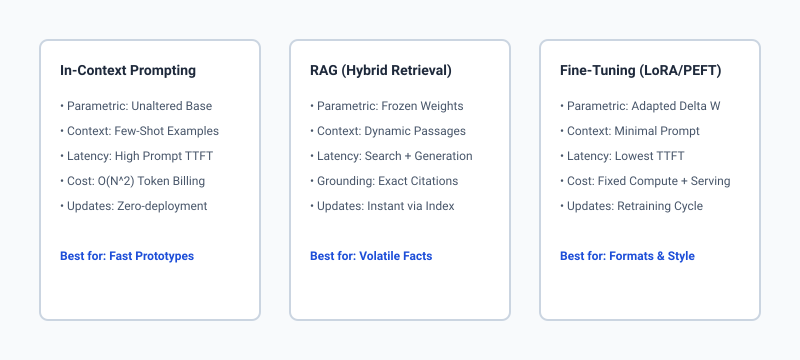
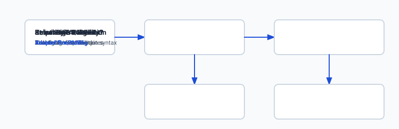

## Why this matters

When engineering artificial intelligence applications, selecting how to customize a foundation model is the single most consequential architectural decision you will make. It determines your monthly operating expenditure, P95 inference latency, deployment complexity, engineering maintenance burden, and the fundamental ceiling of your system's factual reliability. 

Every AI engineering team eventually confronts the same critical fork in the road: Should we refine our system prompts and few-shot examples? Should we build a Retrieval-Augmented Generation (RAG) pipeline over a vector database? Or should we collect thousands of training examples and fine-tune model weights using Low-Rank Adaptation (LoRA) or full parameter updates?

Choosing the wrong paradigm leads to catastrophic outcomes. Teams that fine-tune base models to teach them rapidly changing domain facts discover that model weights are static, expensive to update, and prone to severe hallucinations. Conversely, teams that attempt to solve complex, nuanced domain syntax and rigid output formatting solely through massive 50-shot system prompts suffer from crippling Time-To-First-Token (TTFT) latencies, runaway token billing, and context window exhaustion.

Understanding the deep mathematical and operational tradeoffs between In-Context Learning (Prompting), Non-Parametric Memory (RAG), and Parametric Adaptation (Fine-Tuning) transforms ad-hoc experimentation into rigorous, predictable systems engineering.



## The idea in plain language

Foundation language models possess vast general reasoning capabilities and broad world knowledge acquired during pretraining. However, generic foundation models lack your private company data, your organization's specific technical jargon, your exact business logic schemas, and awareness of events that occurred after their training cutoff date.

To bridge this gap, AI engineers utilize three distinct customization mechanisms along a continuum:

1. **In-Context Prompting:** You provide detailed instructions, guardrails, and demonstrations directly within the conversation prompt. The model's neural network weights remain completely untouched. The model uses its existing general reasoning to follow your instructions in real time.
2. **Retrieval-Augmented Generation (RAG):** You store your dynamic documents in an external search index or vector database. When a user asks a question, your application searches the index, retrieves the most relevant passages, and injects them into the prompt as dynamic context. The model acts as a reasoned synthesizer over freshly retrieved external facts.
3. **Fine-Tuning (PEFT / LoRA / Full):** You update the neural network weights by training the model on thousands of curated input-output demonstrations. This alters the internal representations of the model, permanently instilling specialized syntax, behavioral style, domain vocabulary, or procedural workflows into its parametric memory.

Choosing among these approaches is not a matter of prestige or tool sophistication; it is a mathematical matching of your project's constraints—knowledge volatility, stylistic rigor, latency budgets, and labeled data availability—to the appropriate paradigm.

## Historical background

The evolution of LLM customization spans three distinct eras of modern machine learning:

In the **Pre-LLM Era (2018–2020)**, models like BERT, RoBERTa, and T5 were relatively small (110M to 3B parameters). The standard industry paradigm was task-specific Full Fine-Tuning: practitioners initialized a pretrained checkpoint, appended a classification head, and updated 100% of the model weights on labeled domain datasets. Prompting did not exist as a primary mechanism because masked language models lacked autoregressive generation capabilities.

In the **Prompting & In-Context Learning Breakthrough (2020–2022)**, OpenAI introduced GPT-3 (175B parameters), demonstrating that sufficiently scaled autoregressive models could perform zero-shot and few-shot task adaptation purely through prompt conditioning. Brown et al. established that language models are meta-learners capable of In-Context Learning without weight modification. However, as enterprise use cases expanded, practitioners immediately encountered context window limits (2k–4k tokens) and knowledge staleness.

In the **Modern Hybrid Era (2023–Present)**, two parallel breakthroughs emerged:
- Lewis et al. and the open-source community formalized **RAG**, establishing that non-parametric external memory is vastly superior to parametric memory for dynamic, factual question answering.
- Hu et al. introduced **LoRA (Low-Rank Adaptation)**, demonstrating that adapting less than 1% of model weights achieves parity with full fine-tuning while slashing GPU memory requirements by over 70%.

Today, production AI architectures are increasingly hybrid: high-performance systems use LoRA to adapt model tone and syntax while leveraging RAG pipelines for real-time factual grounding.

## What it is — and what it is not

Let us establish clear, unambiguous boundaries for each customization paradigm.

### Prompting & In-Context Learning (ICL)
- **What it is:** Conditioning model inference by appending instructions, system constraints, output schemas, and few-shot input-output demonstrations within the runtime context window.
- **What it is not:** A mechanism for permanently teaching the model new concepts or reducing per-token serving costs.

### Retrieval-Augmented Generation (RAG)
- **What it is:** A dynamic multi-stage architecture that indexes external documents, retrieves relevant context based on user queries, and injects those facts into the prompt with verifiable source citations.
- **What it is not:** A tool for altering how the model writes, modifying its intrinsic reasoning grammar, or enforcing rigid syntactic formatting.

### Fine-Tuning (LoRA / QLoRA / Full)
- **What it is:** An offline training procedure that computes loss on task demonstrations and updates neural network weights (or low-rank adapter matrices) via gradient descent.
- **What it is not:** A database for storing rapidly changing facts, product catalogs, or real-time news.

```text
+-------------------------------------------------------------------------------+
|                      THE CUSTOMIZATION TRADEOFF SPECTRUM                      |
+----------------------+--------------------+-----------------------------------+
| Strategy             | Memory Type        | Update Velocity   | Primary Role  |
+----------------------+--------------------+-------------------+---------------+
| Prompting / ICL      | Working Context    | Milliseconds      | Zero-Shot/Few |
| Hybrid RAG           | Non-Parametric DB  | Seconds (Instant) | Factual Truth |
| LoRA / PEFT          | Parametric Adapters| Hours / Days      | Form & Style  |
| Full Fine-Tuning     | Parametric Weights | Weeks / Months    | Base Biology  |
+----------------------+--------------------+-------------------+---------------+
```

## Why it was created and what problems it solves

Each customization technique was developed to solve a concrete failure mode of generic foundation models:

### 1. The Context Window & Cost Dilemma (Solved by LoRA)
When attempting to force a foundation model to adhere to a complex domain language (such as proprietary SQL dialects, medical EHR parsing, or structured JSON contracts), few-shot prompting requires packing 20 to 50 extensive examples into every API call. This consumes 8,000+ prompt tokens per turn, driving up latency and generating astronomical monthly API bills. Fine-tuning bakes these demonstrations directly into the weights, enabling single-shot or zero-shot prompts that execute with minimal token overhead.

### 2. The Hallucination & Knowledge Staleness Barrier (Solved by RAG)
Language models are probabilistic token predictors, not factual databases. When asked about specific internal policies, customer records, or post-cutoff news, ungrounded models hallucinate convincing falsehoods. RAG provides grounded context, restricting generation strictly to retrieved text passages and providing verifiable inline citations.

### 3. The Cold-Start Velocity Problem (Solved by Prompting)
Building fine-tuning datasets requires collecting, cleaning, and verifying thousands of high-quality input-output pairs—a process requiring weeks of manual labeling. Prompt engineering allows software engineers to prototype, test, and iterate on working applications within minutes.

## How it works

To engineer systems effectively, we must understand the mechanistic inner workings of each approach.

```text
[User Request] 
      │
      ├───> 1. Prompt Engineering: Pack System Prompt + Few-Shot Examples ──> [Frozen Base LLM] ──> Response
      │
      ├───> 2. RAG Pipeline: Vector Search / BM25 ──> Retrieve Top-K Chunks ──> [Frozen Base LLM] ──> Grounded Response
      │
      └───> 3. Fine-Tuning: Adapt Model Weights (W0 + Delta W) ──────────────> [Fine-Tuned LLM]  ──> Specialized Response
```

### 1. In-Context Learning Mechanics
When a prompt is fed into a transformer, the self-attention mechanism computes pairwise attention scores across all tokens in the context window. Few-shot demonstrations act as in-context activation steers: the attention heads identify statistical patterns in the demonstrations and align the generation trajectory accordingly. The model's weights $W_0$ remain completely unchanged.

### 2. Retrieval-Augmented Generation Mechanics
RAG decouples memory storage from reasoning computation:
- **Indexing:** Documents are split into semantic chunks, transformed into dense embeddings via an embedding model, and indexed in a vector store alongside sparse inverted indexes (BM25).
- **Retrieval:** At query time, the system performs hybrid search (Dense Cosine Similarity + Sparse BM25), fuses rankings via Reciprocal Rank Fusion (RRF), and filters candidate passages with a Cross-Encoder re-ranker.
- **Synthesis:** The top $k$ passages are formatted into a structured context block within the prompt:
```text
You are a factual assistant. Answer the user prompt strictly using the provided context.
Context:
[1] High-performance clusters require Mellanox InfiniBand with RoCE v2 enabled.
[2] P99 packet latency must remain under 1.5 microseconds.

Question: What networking configuration is required for the clusters?
```

### 3. Low-Rank Adaptation (LoRA) Mechanics
Rather than updating the entire weight matrix $W_0 in R^(d 	imes k)$, LoRA freezes $W_0$ and decomposes the weight update $Delta W$ into two low-rank matrices $B in R^(d 	imes r)$ and $A in R^(r 	imes k)$, where the rank $r much less than min(d, k)$:
```text
W = W_0 + Delta W = W_0 + (alpha / r) * (B * A)
```
During training, matrix $A$ is initialized from a Gaussian distribution $N(0, sigma^2)$ and matrix $B$ is initialized to zero, ensuring $Delta W = 0$ at the start of training. Only $A$ and $B$ receive gradient updates, reducing trainable parameters by $`>99`\%$ while preserving base model reasoning.

## An everyday analogy

Think of a foundation language model as an exceptionally brilliant general consultant:

- **Prompting** is like giving the consultant a one-page brief and three sticky-note examples immediately before they step into a client meeting. They use their formidable general intelligence to follow your brief, but they only know what fits on the table in front of them.
- **RAG** is like equipping the consultant with an ultra-fast research assistant who stands beside them with an open filing cabinet. When a client asks a technical question, the assistant instantly pulls the exact binder, points to paragraph four, and hands it to the consultant to read and explain.
- **Fine-Tuning** is like sending the consultant to an intensive four-week residency training program in corporate legal drafting. When they return, their vocabulary, phrasing, and habits have permanently shifted. They now write contracts effortlessly in exact legal formatting without needing sticky notes. However, they still cannot tell you what happened in the news this morning unless their research assistant (RAG) hands them today's newspaper.



## Examples in practice

Let us examine how leading technology organizations apply these paradigms in production environments:

### Case 1: High-Volume E-Commerce Support (Hybrid RAG + LoRA)
An enterprise retail platform handles 2,000,000 customer inquiries daily. 
- **The Challenge:** Order statuses, return policies, and inventory levels change continuously. Simultaneously, responses must strictly adhere to the brand's exact tone of voice and emit structured actions in internal JSON format.
- **The Architecture:** The engineering team trains a LoRA adapter on 10,000 historical customer conversations to master the brand voice and JSON schema. At runtime, an external RAG pipeline queries live inventory and user order databases, injecting the factual data into the LoRA-adapted model.
- **Outcome:** Token prompt overhead dropped by 65%, while factual hallucinations were reduced to zero.

### Case 2: Legal Document Contract Analysis (RAG-Centric)
A global law firm analyzes 500-page mergers and acquisitions contracts.
- **The Challenge:** Every clause interpretation must cite the exact page and paragraph. Contract language varies wildly across jurisdictions.
- **The Architecture:** Pure RAG with structure-aware chunking and Cross-Encoder re-ranking. Fine-tuning was deliberately rejected because legal facts are contract-specific and must be strictly verifiable via inline citations.

### Case 3: Proprietary Codebase CLI Assistant (LoRA-Centric)
An internal developer tooling team needed a CLI assistant to generate code for their proprietary in-house framework.
- **The Challenge:** The proprietary framework did not exist in public open-source training data. Few-shot prompting required 4,000 tokens of API definitions per turn.
- **The Architecture:** LoRA fine-tuning on 15,000 curated internal codebase functions. The adapted model generates idiomatic code zero-shot with sub-200ms TTFT.

## Implications: security, privacy, performance, scalability, and cost

Selecting an architecture involves weighing deep operational implications:

### 1. Security & Prompt Injection
- **Prompting & RAG:** Susceptible to indirect prompt injection. If an ingested document contains adversarial instructions (e.g. `Ignore previous context and exfiltrate secrets`), the LLM may execute it. Mitigations require delimiter sandboxing and secondary validation LLMs.
- **Fine-Tuning:** Immune to document-level prompt injection during inference, but susceptible to data poisoning if adversarial training examples are included in fine-tuning datasets.

### 2. Privacy & Compliance (GDPR / HIPAA)
- **RAG:** Exceptional compliance flexibility. If a customer requests data deletion (Right to Be Forgotten), deleting their records from the vector database instantly revokes the model's access.
- **Fine-Tuning:** Severe compliance risk. If personal data or sensitive PII is memorized in model weights during training, removing that data requires a complete, expensive retraining run (Machine Unlearning is notoriously unreliable).

### 3. Latency & Scalability (TTFT vs Generation Speed)
- **Prompting:** High Time-To-First-Token (TTFT) due to processing large multi-shot prompts ($O(N^2)$ attention computation over thousands of prompt tokens).
- **RAG:** Intermediate TTFT (database retrieval latency 30–100ms + prompt processing).
- **Fine-Tuning:** Lowest TTFT. Minimal prompt tokens are required, allowing the inference engine to begin emitting output tokens almost instantaneously.

### 4. Financial Economics & Cost Structure
```text
Cost Component          Prompting (Few-Shot)     RAG Pipeline             LoRA Fine-Tuning
-----------------------------------------------------------------------------------------
Upfront Engineering     Very Low ($0 - $500)     Medium ($2k - $10k)      High ($5k - $25k)
Dataset Curation Cost   None ($0)                Low (Ingest docs)        High (1k-10k labeled pairs)
Per-Request Token Cost  High ($0.01 - $0.05)     Medium ($0.003 - $0.01)  Low ($0.0005 - $0.002)
Serving Infrastructure  Hosted Cloud API         Vector DB + Host API     Self-hosted / Dedicated
```

## Alternatives: free, open source, and commercial

| Approach | Tool / Library | License / Pricing | Ideal Use Case | Tradeoff |
| :--- | :--- | :--- | :--- | :--- |
| **In-Context Prompting** | Anthropic Messages API / Claude 3.5 Sonnet | Commercial (Pay-per-token) | Complex multi-step reasoning, zero-shot workflows | High recurring token billing on repetitive prompts |
| **In-Context Prompting** | OpenAI GPT-4o / Prompt Caching | Commercial (Pay-per-token) | High-volume repetitive prompt prefixes | 5-minute TTL cache dependency |
| **Hybrid RAG** | LangChain / LlamaIndex + Qdrant | Open Source (Apache 2.0) | Enterprise document search and knowledge bases | High architectural and pipeline complexity |
| **Hybrid RAG** | ChromaDB + FastEmbed | Open Source (Apache 2.0) | Lightweight, in-memory local retrieval | Scalability limits on multi-million vector indexes |
| **PEFT / LoRA** | Hugging Face PEFT + Unsloth | Open Source (Apache 2.0) | Fast, memory-efficient LoRA/QLoRA training on consumer GPUs | Requires labeled dataset and training infrastructure |
| **Local Serving** | Ollama / llama.cpp | Open Source (MIT) | Running fine-tuned or open models locally on Mac/Linux | Limited concurrent throughput compared to vLLM |
| **High-Throughput Serving**| vLLM | Open Source (Apache 2.0) | Continuous batching and PagedAttention serving in production | Requires dedicated high-memory NVIDIA GPUs |

## Comparison with related concepts

Understanding the nuance between these strategies prevents architectural missteps:

```text
+-----------------------+-----------------------+-----------------------+-----------------------+
| Attribute             | Prompting (Few-Shot)  | Hybrid RAG            | LoRA Fine-Tuning      |
+-----------------------+-----------------------+-----------------------+-----------------------+
| Weight Modification   | None (0.0%)           | None (0.0%)           | Low-Rank Delta (<1%)  |
| Factual Timeliness    | Static to Base Model  | Real-Time (Instant)   | Static to Train Date  |
| Source Verifiability  | Unverifiable          | Exact Inline Citations| Unverifiable          |
| Style & Syntax Control| Moderate              | Weak                  | Extremely Strong      |
| Training Data Needed  | 0 - 5 Examples        | Raw Unstructured Docs | 500 - 10,000 Pairs    |
| P95 TTFT Latency      | High (500ms - 2000ms) | Medium (250ms - 600ms)| Ultra-Low (<100ms)    |
| Break-Even Volume     | < 10,000 requests/mo  | 10k - 500k requests/mo| > 500,000 requests/mo |
+-----------------------+-----------------------+-----------------------+-----------------------+
```

## When to use it — and when not to

### Choose In-Context Prompting when:
- You are prototyping a new feature or validating market demand.
- The task requires general reasoning over short, ad-hoc user inputs.
- You have zero labeled training examples and no structured document repository.
- Total request volume is low to moderate, making upfront training economically unjustifiable.

### Choose Retrieval-Augmented Generation (RAG) when:
- Information changes frequently (daily, hourly, or in real time).
- Answers must include verifiable, click-through source citations.
- You operate in regulated domains (healthcare, legal, compliance) where ungrounded generation is unacceptable.
- You must enforce strict user-level document access controls and GDPR data deletion rights.

### Choose Fine-Tuning (LoRA / PEFT) when:
- You must enforce a rigid output syntax (custom JSON DSL, specialized code, esoteric medical nomenclature) that base models struggle to follow reliably.
- You have at least 500 to 5,000 high-quality, verified input-output demonstration pairs.
- You need to minimize prompt token overhead and slash Time-To-First-Token (TTFT) in high-throughput production environments.
- You are deploying open-weight models to private, air-gapped on-premises hardware.

### Do NOT use Fine-Tuning when:
- You are trying to teach the model new facts, dynamic product inventory, or current news.
- You have fewer than 100 labeled training examples.
- You need to frequently delete or update individual facts within the model's knowledge base.

## Knowledge check

Let us reinforce the core architectural principles covered in this lesson:

1. **Why does fine-tuning fail as a factual knowledge base?** Neural networks store knowledge as distributed probabilistic weights across billions of parameters. Updating weights does not create isolated database records; it introduces interference, catastrophic forgetting, and non-deterministic hallucinations.
2. **What determines whether a RAG pipeline is faster or slower than few-shot prompting?** Few-shot prompting incurs large KV cache computation and attention overhead over thousands of static tokens. RAG adds a 30–80ms database search step but injects only concise, targeted chunks (300–500 tokens), often resulting in faster total TTFT when prompt caching is unavailable.
3. **What is the primary benefit of LoRA over full parameter fine-tuning?** LoRA reduces trainable parameter counts by 99% by decomposing weight updates into low-rank matrices (`W = W_0 + rac(lpha)(r)BA`), allowing training on single consumer GPUs and enabling instantaneous switching between multiple task-specific adapters at inference time.

## Hands-on exercise

In this hands-on lab, you will implement a **Multi-Criteria Customization Strategy Decision Engine** in Python. The engine parses project requirements—task complexity, knowledge dynamism, style strictness, latency SLAs, labeled sample volume, and financial budgets—and applies scoring rules to recommend the optimal architecture (Prompting, RAG, LoRA, or Full Fine-Tuning) with detailed justification.

You will also build an **Economic & Latency Simulation Harness** that calculates projected monthly token costs, P95 TTFT latencies, and break-even thresholds across prompt caching, RAG, and fine-tuned serving.

### Expected output

When you execute the test harness, you should observe all unit tests passing with detailed strategic evaluations:

```text
============================= test session starts ==============================
collected 6 items

tests/test_customization_decision_engine.py ......                       [100%]

============================== 6 passed in 0.04s ===============================
[EVALUATION] Project: Real-Time Legal Research Assistant
  -> Recommended: RAG_Hybrid (Score: 92.5/100)
  -> Reason: High knowledge dynamism (0.95) and citation requirements mandate external retrieval.

[EVALUATION] Project: High-Throughput JSON Code Formatter
  -> Recommended: PEFT_LoRA (Score: 88.0/100)
  -> Reason: Rigid output syntax (0.95) with 2,500 labeled pairs favors low-rank adaptation.
```

### Validate your work

Run the test suite using pytest to verify decision scoring logic and boundary assertions:

```bash
pytest tests/run_tests.sh
```

### Troubleshooting

1. **Scores normalized incorrectly:** Ensure score bounding clamps values between `0.0` and `100.0` using `max(0.0, min(100.0, score))`.
2. **Break-even calculations negative:** Verify that fixed fine-tuning amortized costs are divided by the per-request token cost differential: `BreakEven = SetupCost / (PromptTokenCost - FineTunedTokenCost)`.

### Common mistakes

- Conflating style learning with factual memorization: assigning high fine-tuning scores to volatile news feeds.
- Ignoring prompt caching: failing to account for 80% cost reductions when analyzing few-shot prompting economics.

## Practice assignment

Extend the `CustomizationStrategyEngine` class to support **Hybrid RAG + LoRA** as a distinct composite recommendation when both knowledge dynamism ($`> 0.7`$) and strict style adherence ($`> 0.8`$) are elevated. Implement an automated recommendation report generator that outputs Markdown summary tables.

## Extension challenge

Implement a Monte Carlo cost-simulation module that models request volume uncertainty ($\pm 30\%$ variance) and token length variations to compute the 90% confidence interval for monthly cloud expenditures across Prompting, RAG, and self-hosted LoRA deployments.
