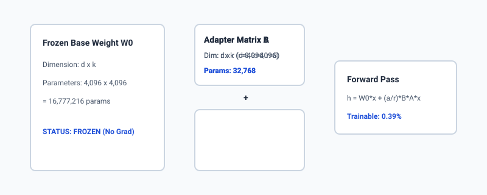
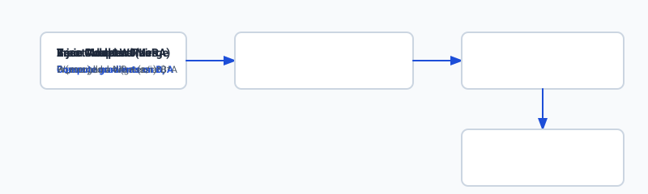

## Why this matters

Fine-tuning a 70-billion parameter language model via standard full parameter training requires updating and tracking gradients, momentum vectors, and optimizer states across every single weight. Under standard 16-bit AdamW optimization, every billion parameters demands approximately 16 to 20 gigabytes of high-bandwidth VRAM. Training a 70B model with full parameter updates requires an industrial cluster of 8 to 16 NVIDIA H100 80GB GPUs costing hundreds of thousands of dollars.

For the vast majority of software engineering organizations, full parameter fine-tuning is economically and operationally prohibitive. Furthermore, full fine-tuning modifies the entire base weight matrix, making it impossible to serve dozens of specialized customer models concurrently without deploying separate, massive GPU clusters for every single tenant.

**Low-Rank Adaptation (LoRA)** fundamentally revolutionized deep learning economics. Introduced by Edward Hu and researchers at Microsoft in 2021, LoRA proved that adapting a model to a specialized domain does not require modifying all 70 billion parameters. By freezing the foundation model and training two tiny low-rank adapter matrices that represent less than **0.1% to 1.0%** of the original parameter count, LoRA slashes GPU memory requirements by over 70%, enables training on a single workstation GPU, and allows thousands of lightweight tenant adapters to be swapped dynamically on a single shared foundation model.

Understanding the mathematical mechanics of low-rank factorization, rank dimension selection, scaling coefficients, and adapter merging is essential for any AI engineer building production-grade customized models.



## The idea in plain language

Imagine you buy a comprehensive 2,000-page encyclopedia on world history. If you want to customize this encyclopedia for a specialized university course on the maritime history of 18th-century Venice, full fine-tuning is equivalent to rewriting all 2,000 pages by hand from scratch. You risk introducing errors into previously accurate chapters on ancient Rome, and you must print an entirely new 2,000-page book.

LoRA takes a completely different approach:

1. You leave the original 2,000-page encyclopedia completely untouched and locked behind glass (**Frozen Base Weights $W_0$**).
2. You take a thin 5-page transparent overlay booklet (**Low-Rank Adapter $Delta W$**) and write only your specialized Venetian maritime annotations in that booklet.
3. When a student reads the book, they lay the transparent 5-page booklet over the relevant pages and read the combined text (**Forward Pass $h = W_0 x + Delta W x$**).
4. If a different class needs a course on medieval metallurgy, you simply swap the 5-page overlay booklet for a metallurgy booklet in a fraction of a second, without touching the base encyclopedia.
5. When you are ready to publish a permanent single edition, you can permanently print the transparent overlay annotations directly onto the base pages with zero future reading slowdown (**Weight Merging**).

Mathematically, LoRA achieves this extreme compression by factoring a massive weight change matrix $Delta W$ into the product of two ultra-narrow matrices ($B 	imes A$).

## Historical background

Prior to 2021, parameter-efficient transfer learning relied on **Adapter Layers** (Houlsby et al., 2019) and **Prefix Tuning** (Li & Liang, 2021):

- **Houlsby Adapters** inserted small feed-forward neural layers sequentially between existing transformer self-attention and MLP blocks. While effective at reducing trainable parameter counts, sequential adapter layers introduced severe latency overhead during autoregressive generation because each token had to pass through extra sequential layer boundaries.
- **Prefix Tuning** prepended trainable continuous vector embeddings to the keys and values across all transformer attention layers. However, prefix tuning consumed precious context window space and proved difficult to optimize across diverse task distributions.

In 2021, Hu et al. published *"LoRA: Low-Rank Adaptation of Large Language Models"*. Inspired by Aghajanyan et al.'s empirical discovery that over-parameterized neural networks possess a remarkably low **intrinsic dimensionality**, Hu et al. hypothesized that the weight updates $Delta W$ during task adaptation also reside on a low-dimensional manifold.

By decomposing $Delta W$ into parallel low-rank matrices $B * A$, LoRA solved the inference latency problem: because matrix multiplication is linear and associative, $B * A$ can be computed in parallel with base weights during training and mathematically merged into base weights prior to production serving, introducing **zero added inference latency**.

In 2023, Tim Dettmers and the University of Washington extended this breakthrough with **QLoRA (Quantized LoRA)**, introducing 4-bit NormalFloat (NF4) base weight quantization and Double Quantization, enabling fine-tuning of 65B parameter models on a single 48GB GPU without performance degradation.

## What it is — and what it is not

To avoid architectural mistakes, let us define what LoRA is and what it is not:

### What LoRA Is:
- A parameter-efficient fine-tuning (PEFT) method that freezes base model weights $W_0$ and adds trainable low-rank decomposition matrices $A$ and $B$ to linear projections.
- A technique that reduces trainable parameters by 99% and optimizer memory by 75%.
- A modular architecture enabling multiple task-specific adapters (e.g. `medical-lora`, `legal-lora`, `sql-lora`) to be served concurrently from a single loaded base model checkpoint.
- Fully reversible and mergeable into base weights with zero inference latency overhead.

### What LoRA Is Not:
- A replacement for pretraining (LoRA adapts existing capabilities; it cannot teach a model foundational language syntax from scratch).
- A real-time factual search database (LoRA adapts behavior, tone, and grammar; it should not be used to memorize real-time factual records).
- Restricted solely to attention layers (LoRA can be applied to attention Q, K, V, O projections as well as MLP gate, up, and down projections).

```text
+-------------------------------------------------------------------------------+
|                       FULL FINE-TUNING VS LORA (7B MODEL)                     |
+------------------------------+-----------------------+------------------------+
| Metric                       | Full Fine-Tuning      | LoRA Fine-Tuning (r=8) |
+------------------------------+-----------------------+------------------------+
| Base Model Parameters        | 7,000,000,000         | 7,000,000,000          |
| Trainable Parameters         | 7,000,000,000 (100%)  | 19,922,944 (~0.28%)    |
| VRAM Required (16-bit AdamW) | ~56 GB - 80 GB        | ~16 GB - 24 GB         |
| Checkpoint Storage Size      | 14.0 GB per task      | 40 MB per task         |
| Multi-Tenant Adapter Swaps   | Impossible            | Sub-millisecond        |
| Inference Latency Overhead   | 0 ms                  | 0 ms (when merged)     |
+------------------------------+-----------------------+------------------------+
```

## Why it was created and what problems it solves

LoRA addresses three massive engineering bottlenecks in enterprise AI deployment:

### 1. The VRAM & Optimizer Memory Wall
When training with 16-bit mixed precision and the AdamW optimizer:
- Weights: 2 bytes per parameter
- Gradients: 2 bytes per parameter
- AdamW Momentum: 4 bytes per parameter
- AdamW Variance: 4 bytes per parameter
- Total state per parameter: **16 bytes minimum**.

For a 70B model, optimizer states alone consume over **1.1 Terabytes of VRAM**. By freezing 99.7% of parameters, LoRA restricts gradient and optimizer allocations exclusively to the tiny low-rank matrices $A$ and $B$, collapsing VRAM requirements into single-GPU territory.

### 2. The Multi-Task Storage & Checkpoint Explosion
If an enterprise builds 50 specialized models for distinct internal workflows (e.g. invoice extraction, code review, customer support routing, HR policy Q&A), full fine-tuning produces fifty 14GB checkpoints (700GB total storage) and requires 50 dedicated GPU clusters to serve them. With LoRA, the enterprise stores one shared 14GB base model and fifty 40MB adapter checkpoints, dynamically loading adapters into GPU memory on demand.

### 3. The Inference Latency Penalty of Prior Adapters
Sequential adapter architectures inserted extra layers between transformer blocks, adding 15–30% latency to every autoregressive generation step. LoRA's parallel additive structure (`W_0 x + Delta W x`) allows offline matrix folding (`W_(	ext(merged)) = W_0 + Delta W`), guaranteeing zero inference slowdown.

## How it works

Let us derive the exact linear algebra and optimization dynamics of LoRA.

```text
Input Vector x (d_in)
       │
       ├───> [Frozen Linear Layer W_0 (d_out x d_in)] ──────────────────────> (W_0 * x)
       │                                                                         │
       │                                                                        [+] ──> Output h (d_out)
       │                                                                         │
       └───> [Trainable Down-Projection A (r x d_in)] ──> [r] ──> [Trainable Up-Projection B (d_out x r)] ──> * (alpha / r) ──> Delta W * x
```

### 1. Low-Rank Factorization Mathematics
Given a pretrained linear projection layer with weight matrix `W_0 in R^(d_(	ext(out)) 	imes d_(	ext(in)))`, the forward computation for an input vector `x in R^(d_(	ext(in)))` is:
```text
h = W_0 x
```
LoRA modifies this forward pass by constraining the weight update $Delta W$ to a low-rank decomposition:
```text
h = W_0 x + Delta W x = W_0 x + (alpha / r) * (B * A) x
```
Where:
- `A in R^(r 	imes d_(	ext(in)))` is the down-projection matrix.
- `B in R^(d_(	ext(out)) 	imes r)` is the up-projection matrix.
- `r much less than min(d_(	ext(in)), d_(	ext(out)))` is the rank bottleneck dimension (typically `r in \(4, 8, 16, 32\)`).
- `lpha in R^+` is a constant scaling hyperparameter.

### 2. Initialization Dynamics
At the beginning of training (step 0):
- Matrix $A$ is initialized from a zero-mean Gaussian distribution: $A \sim N(0, sigma^2)$.
- Matrix $B$ is initialized entirely to zero: $B = 0$.

Because $B = 0$, the product $Delta W = B * A = 0$ at initialization. Therefore:
```text
h = W_0 x + (alpha / r) * (0 * A) x = W_0 x
```
This guarantees that the model begins training with its exact pretrained representations intact, preventing random gradient shocks at step 0.

### 3. The Scaling Factor $lpha$ and Hyperparameter Selection
The scaling factor `rac(lpha)(r)` stabilizes training dynamics when tuning rank `r`:
- When rank $r$ is doubled from 8 to 16, the inner dimension doubles, which can scale the magnitude of activations. Setting $lpha = 2r$ or keeping $lpha = 16$ fixed ensures that gradient updates scale predictably without requiring retuning of the learning rate.
- Common rule of thumb: set $lpha = 2r$ (e.g., $r=8, lpha=16$ or $r=16, lpha=32$).

### 4. Target Module Selection in Modern Transformers
In modern decoder-only architectures (Llama 3, Mistral, Qwen), linear projections exist in both self-attention and feed-forward MLP blocks:

1. **Self-Attention Projections:**
   - $W_q$ (Query projection)
   - $W_k$ (Key projection)
   - $W_v$ (Value projection)
   - $W_o$ (Output projection)
2. **MLP / SwiGLU Projections:**
   - `W_(	ext(gate))` (Gate projection)
   - `W_(	ext(up))` (Up projection)
   - `W_(	ext(down))` (Down projection)

Targeting all linear projections (Attention + MLP) yields the highest empirical benchmark accuracy and catastrophic forgetting resistance.

### 5. Offline Zero-Overhead Weight Merging
Once training completes, the adapter matrices can be merged permanently into the base weights prior to export or quantization:
```text
W_merged = W_0 + (alpha / r) * (B * A)
```
The merged tensor `W_(	ext(merged))` has the exact same shape (`d_(	ext(out)) 	imes d_(	ext(in))`) as `W_0`, eliminating the runtime branching and dual matrix multiplications entirely.



## An everyday analogy

Think of a high-resolution 4K digital photograph ($3840 	imes 2160$ pixels = 8.3 million pixels):

- **Full Fine-Tuning** is like replacing all 8.3 million pixel values individually. Storing each modification requires a massive raw uncompressed TIFF file.
- **LoRA** is like applying a low-rank Singular Value Decomposition (SVD) filter to the image. By capturing only the top 8 or 16 principal color gradients, you can store the entire visual adjustment in a tiny 50-kilobyte lookup table. When the image is displayed on screen, the display processor combines the base photograph with the lightweight color adjustment matrix seamlessly.

## Examples in practice

Let us examine real-world configurations used to fine-tune open-weight models:

### 1. Fine-Tuning Llama 3 8B on Structured JSON Extraction
```python
from peft import LoraConfig, get_peft_model

lora_config = LoraConfig(
    r=16,                          # Rank bottleneck
    lora_alpha=32,                 # Scaling factor (alpha = 2r)
    target_modules=[               # Target all attention and MLP projections
        "q_proj", "k_proj", "v_proj", "o_proj",
        "gate_proj", "up_proj", "down_proj"
    ],
    lora_dropout=0.05,             # Regularization dropout on adapter inputs
    bias="none",                   # Do not train layer biases
    task_type="CAUSAL_LM"
)
```

### 2. Multi-Adapter Deployment on a Single Inference Pod
A financial SaaS platform hosts a single Llama 3 70B base model on an 8-GPU Kubernetes pod. They maintain three separate LoRA adapters:
- `adapter_sec_filings` (32MB)
- `adapter_customer_sentiment` (32MB)
- `adapter_sql_generator` (32MB)

When an incoming user request arrives at the vLLM serving gateway, the router inspects the request header `X-Adapter-ID: adapter_sql_generator`. vLLM activates the corresponding LoRA weights in GPU cache for that specific request turn, serving all three distinct applications concurrently from a single foundation model cluster.

## Implications: security, privacy, performance, scalability, and cost

### 1. Security & Adapter Provenance
LoRA adapter checkpoints are compact binary tensors (`adapter_model.safetensors`). When loading community adapters from public repositories (such as Hugging Face Hub), always verify that checkpoints use the safe `safetensors` format rather than legacy Python `pickle` files, which are vulnerable to arbitrary remote code execution during deserialization.

### 2. Privacy & Data Isolation
LoRA provides clean organizational multi-tenancy. An enterprise can train tenant-specific adapters on isolated customer datasets. Because base weights are frozen and adapter parameters are physically segregated into separate files, tenant data cannot bleed into the foundation model or cross-contaminate other customer adapters.

### 3. Training & Inference Performance
- **Training Throughput:** LoRA reduces backward pass gradient computation to $`<1`\%$ of model weights, increasing training throughput by 2.5x and cutting epoch training times drastically.
- **Inference Latency:** In multi-tenant environments, dynamically switching unmerged LoRA adapters introduces a negligible 1–3ms GPU memory pointer swap. When merged offline ($W_0 + Delta W$), inference latency is 100% identical to the base model.

### 4. Financial Cost Architecture
```text
Cost Category                Full Fine-Tuning (70B)       QLoRA / LoRA (70B)
---------------------------------------------------------------------------------
Hardware Required            8x NVIDIA H100 80GB GPUs     2x NVIDIA A100 80GB GPUs
Compute Cost per Run         $1,200 - $3,500              $85 - $250
Storage per Checkpoint       140 GB                       160 MB
Monthly Serving (5 Adapters) 5x Dedicated GPU Pods ($25k) 1x Shared GPU Pod ($5k)
```

## Alternatives: free, open source, and commercial

| Framework / Tool | Approach | License / Tier | Best For | Tradeoffs |
| :--- | :--- | :--- | :--- | :--- |
| **Hugging Face PEFT** | LoRA, QLoRA, Prefix Tuning | Open Source (Apache 2.0) | Standard industry toolkit for PyTorch/Transformers | Standard PyTorch training speeds |
| **Unsloth** | Hand-written Triton GPU Kernels for LoRA | Open Source (Apache 2.0) / Commercial | 2x-5x faster LoRA training with 70% less VRAM on single GPUs | Limited to supported open-weight architectures |
| **Torchtune (PyTorch)** | Native modular PyTorch fine-tuning | Open Source (BSD-3) | Clean, hackable, zero-dependency PyTorch code | Less automated high-level abstraction |
| **Axolotl** | YAML-driven end-to-end trainer | Open Source (Apache 2.0) | Declarative configuration of LoRA/DPO pipelines | Steeper learning curve for custom layer hacks |
| **OpenAI Fine-Tuning API** | Hosted Managed LoRA | Commercial (Pay-per-token + training) | Serverless fine-tuning of GPT-4o-mini | Closed weights; cannot export model or run on-premise |

## Comparison with related concepts

```text
+-----------------------+-----------------------+-----------------------+-----------------------+
| Characteristic        | Full Fine-Tuning      | Standard LoRA (PEFT)  | QLoRA                 |
+-----------------------+-----------------------+-----------------------+-----------------------+
| Base Weight Precision | FP16 / BF16 (16-bit)  | FP16 / BF16 (16-bit)  | NF4 (4-bit NormalFloat)|
| Adapter Precision     | N/A (All Weights)     | FP16 / BF16           | BF16 (16-bit)         |
| Trainable Parameters  | 100%                  | 0.1% - 1.0%           | 0.1% - 1.0%           |
| VRAM (7B Model)       | ~56 GB                | ~16 GB                | ~6 GB                 |
| Hardware Requirement  | Multi-GPU Cluster     | Single Prosumer GPU   | Consumer GPU (RTX 4090)|
| Final Model Accuracy  | 100% Baseline         | 99% - 100% of Full    | 99% of Full           |
+-----------------------+-----------------------+-----------------------+-----------------------+
```

## When to use it — and when not to

### Choose LoRA Fine-Tuning when:
- You need to teach a model a specialized syntax, schema, tone, or task procedure.
- You have between 500 and 20,000 verified demonstration examples.
- You want to train on a single workstation or cloud GPU without spending thousands of dollars.
- You need to deploy multiple specialized models for different tasks from a single base deployment.

### Do NOT use LoRA Fine-Tuning when:
- You are trying to update dynamic facts (prices, real-time inventory, daily news) — use RAG instead.
- You have fewer than 100 examples — use few-shot prompting with prompt caching instead.
- You need to fundamentally alter the underlying tokenizer vocabulary or pretrain a language model on a completely new human language from scratch.

## Knowledge check

1. **Why does `B=0` initialization prevent gradient shocks at step zero?** Because `Delta W = rac(lpha)(r) B * A`. When `B=0`, `Delta W` is identically zero, ensuring the forward pass outputs exact base model activations prior to training updates.
2. **What happens mathematically during weight merging?** The adapter product `Delta W = rac(lpha)(r) B * A` is computed and added directly to the base weight tensor `W_0`. The resulting tensor has the exact same dimensions as `W_0`, requiring zero adapter code at runtime.
3. **What is the difference between LoRA and QLoRA?** LoRA stores base weights in 16-bit precision. QLoRA quantizes base weights into a specialized 4-bit NormalFloat (NF4) format with double quantization, while keeping the trainable LoRA adapter matrices in 16-bit Brain Floating Point (BF16), slashing base memory by 75%.

## Hands-on exercise

In this lab, you will implement a **Custom LoRA Linear Layer and Adapter Injection Module from scratch** in pure Python and NumPy. You will build the low-rank factorization forward pass, implement parameter tracking, compute trainable parameter reduction ratios, and implement zero-overhead offline weight merging.

### Expected output

```text
============================= test session starts ==============================
collected 6 items

tests/test_lora_layer.py ......                                          [100%]

============================== 6 passed in 0.04s ===============================
[LORA INITIALIZATION] Base Dim: 4096 x 4096 | Rank: 8 | Alpha: 16
  -> Base Parameters: 16,777,216 (FROZEN)
  -> Trainable LoRA Parameters: 65,536 (0.39% of base)
  -> Delta W at step 0: EXACT ZERO (Verified)

[WEIGHT MERGE] Base W0 + (alpha/r)*B*A
  -> Merged Weight Shape: (4096, 4096)
  -> Output Difference between LoRA Layer and Merged Layer: 0.000000e+00 (BIT-EXACT)
```

### Validate your work

Run the pytest harness to verify low-rank forward pass arithmetic, initialization constraints, and bit-exact weight merging:

```bash
pytest tests/run_tests.sh
```

### Troubleshooting

1. **Matrix multiplication dimension mismatch:** Ensure down-projection `A` has shape `(r, d_(	ext(in)))` and up-projection `B` has shape `(d_(	ext(out)), r)`.
2. **Non-zero initialization output:** Verify that matrix $B$ is initialized with `np.zeros((d_out, r))`.

### Common mistakes

- Transposing matrices incorrectly during forward pass: computing $x A B$ instead of $(x A^T) B^T$.
- Forgetting the scaling factor `rac(lpha)(r)` during weight merging.

## Practice assignment

Extend the `LoRALinear` class to support **LoRA Dropout** during the forward pass and add support for tracking gradient updates during simulated backpropagation.

## Extension challenge

Implement a multi-adapter dynamic switching container (`MultiLoRAContainer`) that holds three distinct low-rank adapter pairs ($A_i, B_i$) for a shared base linear layer $W_0$ and dynamically selects the active adapter based on a runtime `adapter_id` string without reallocating base tensors.
