## Why this matters

In machine learning folklore, model architecture and optimizer hyperparameter tuning often receive the most attention. In production fine-tuning, however, **data engineering accounts for 90% of final model performance**. A state-of-the-art foundation model fine-tuned on 10,000 noisy, poorly formatted, or contradictory training examples will rapidly degrade into an erratic, hallucinating failure. Conversely, a small open-weight model fine-tuned on just 1,000 pristine, rigorously curated, and perfectly formatted demonstrations can consistently outperform models ten times its size.

Fine-tuning datasets are the blueprints that teach language models how to behave: what tone to adopt, how to format structured JSON, when to refuse harmful instructions, and how to execute multi-step tool calls. 

Engineering a high-performance fine-tuning dataset requires mastering multiple non-trivial disciplines: converting disparate data sources into standardized conversation schemas (Alpaca, ShareGPT, ChatML), stripping out benchmark data contamination, analyzing token length histograms to prevent memory exhaustion, and correctly constructing **loss masks** so the neural network trains exclusively on target responses while ignoring input instructions.

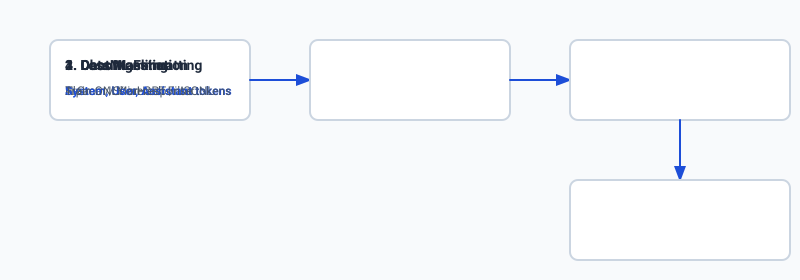

## The idea in plain language

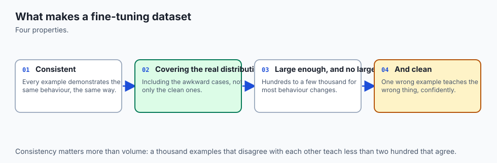

Imagine you are training a new customer service representative for an airline. 

If you give the representative 50,000 messy, unreviewed customer chat logs containing typos, angry outbursts, incorrect refund promises, and broken formatting, the representative will learn to replicate all of those bad habits. 

If, instead, you give the representative a binder containing **500 perfect gold-standard interactions**—each demonstrating polite phrasing, exact policy compliance, clear error recovery, and proper ticket formatting—the representative will master the job in two days.

Furthermore, when evaluating how well the representative learned, you must test whether they can generate the *answers*, not whether they can memorize the *customer's questions*. In LLM training, this is called **Loss Masking**: we tell the loss function to completely ignore the user's prompt tokens and only grade the model on the words it emits in its assistant response.

## Historical background

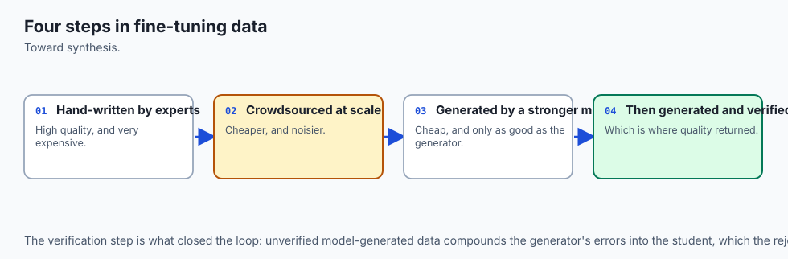

The discipline of dataset curation for language models progressed through three key breakthroughs:

In 2022, OpenAI published the **InstructGPT** paper (Ouyang et al.), demonstrating that training on 13,000 human-written prompt-demonstration pairs dramatically improved user preference over the raw 175B GPT-3 base model. This proved that instruction following is an alignment problem, not a raw scale problem.

In early 2023, Stanford researchers released **Alpaca**, which introduced synthetic dataset generation: using a powerful teacher model (text-davinci-003) to generate 52,000 instruction-following examples from 175 human seed tasks for under $500. While Alpaca proved that synthetic data generation was viable, the dataset suffered from repetitive phrasing, factual errors, and hallucinated syntax.

In May 2023, Meta and Carnegie Mellon published the seminal **LIMA (Less Is More for Alignment)** paper (Zhou et al.). The researchers trained a 65B LLaMA model on just **1,000 meticulously curated instruction-response pairs** with zero reinforcement learning. LIMA achieved performance competitive with GPT-4 in human preference evaluations. The paper formulated the *Superficial Alignment Hypothesis*: almost all factual knowledge is absorbed during pretraining; instruction fine-tuning simply teaches the model which subset of its knowledge to surface and what style or format to adopt.

Today, enterprise AI engineering focuses on high-precision data curation pipelines combining synthetic generation, automated rule-based validation, and strict loss masking.

## What it is — and what it is not

Let us establish clear distinctions across dataset concepts:

### What a Fine-Tuning Dataset Is:
- A structured collection of paired prompt-response demonstrations serialized in standard JSONL or Parquet format.
- A vehicle for teaching behavioral style, structured syntax (JSON/SQL/Tool-calls), and domain conventions.
- Explicitly split into training (90%), validation (10%), and held-out test splits with zero data contamination.

### What a Fine-Tuning Dataset Is Not:
- A raw text corpus dump (raw documents are used for pretraining, not instruction fine-tuning).
- A substitute for factual search (do not train 50,000 pairs of trivia facts into static model weights).
- A one-time static export (production datasets require versioning, drift monitoring, and active curation loops).

```text
+-------------------------------------------------------------------------------+
|                       DATASET FORMAT TAXONOMY COMPARISON                      |
+------------------+---------------------+-------------------+------------------+
| Format           | Schema Structure    | Best Use Case     | Multi-Turn?      |
+------------------+---------------------+-------------------+------------------+
| Alpaca           | instruction, input, | Single-turn task  | No (Single-turn) |
|                  | output              | execution         |                  |
| ShareGPT         | conversations:      | Multi-turn chat   | Yes (Full chat   |
|                  | [from, value]       | dialogues         | history)         |
| OpenAI / ChatML  | messages:           | Production APIs   | Yes (Role-based  |
|                  | [role, content]     | & modern trainers | system/user/asst)|
+------------------+---------------------+-------------------+------------------+
```

## Why it was created and what problems it solves

Rigorous dataset engineering solves critical failure modes in fine-tuned models:

### 1. The Prompt Memorization Failure (Solved by Loss Masking)
When fine-tuning on prompt-response pairs, standard language modeling calculates cross-entropy loss over every token in the sequence. If prompt tokens are included in the loss calculation, the model expends capacity learning to predict the user's prompt rather than learning to generate the answer. Loss masking sets target labels for prompt tokens to `-100`, instructing PyTorch to compute gradients exclusively on assistant response tokens.

### 2. The Benchmark Leakage Trap (Solved by Decontamination)
If an enterprise fine-tunes a model on raw web scrapes or public customer service logs that accidentally contain questions from benchmark datasets (e.g. MMLU, GSM8k, HumanEval), evaluation metrics become meaningless because the model simply memorized the test questions. Automated n-gram decontamination filters out overlapping samples.

### 3. Out-Of-Memory Crashes from Unbounded Sequences (Solved by Token Length Budgeting)
Transformer attention memory scales quadratically $O(N^2)$ with sequence length. A dataset containing 99% of samples under 1,024 tokens but with 10 stray 16,000-token samples will crash training runs with GPU Out-Of-Memory (OOM) errors. Preprocessing pipelines filter or truncate outliers to a strict sequence budget.

## How it works

Let us examine the complete lifecycle of dataset preparation for instruction fine-tuning:

```text
[Raw Data Sources] ──> [Format Normalizer (ChatML)] ──> [Quality Filter & Deduplication] 
                                                                    │
                                                                    ▼
[Loss Masking (-100)] <── [Tokenizer & Token Budgeting] <── [Decontamination Filter]
         │
         ▼
[PyTorch DataLoader] ──> [Forward / Backward Training Pass]
```

### 1. Schema Standardization (ChatML Format)
Modern instruction models use role-based delimiter tokens. The OpenAI ChatML standard represents conversations as an array of message objects:
```json
{
  "messages": [
    {"role": "system", "content": "You are an expert SQL dialect translator."},
    {"role": "user", "content": "Convert this PostgreSQL query to Snowflake: SELECT NOW();"},
    {"role": "assistant", "content": "SELECT CURRENT_TIMESTAMP();"}
  ]
}
```

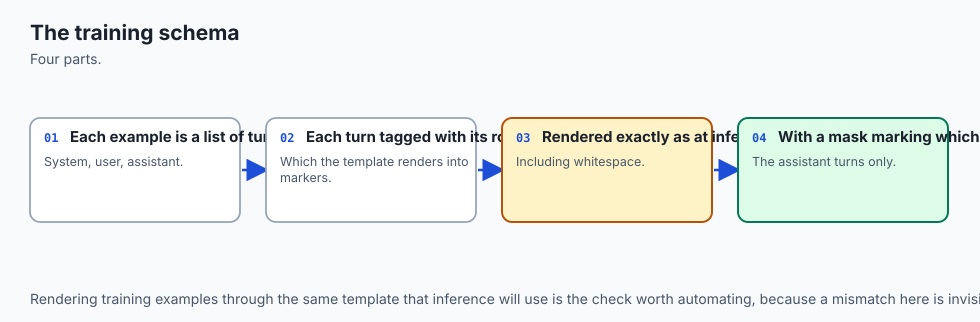

When rendered into a single raw token stream by the tokenizer, ChatML adds special delimiter tokens:
```text
<|im_start|>system
You are an expert SQL dialect translator.<|im_end|>
<|im_start|>user
Convert this PostgreSQL query to Snowflake: SELECT NOW();<|im_end|>
<|im_start|>assistant
SELECT CURRENT_TIMESTAMP();<|im_end|>
```

### 2. Token Length Distribution Analysis
Before training, the dataset pipeline tokenizes every sample and computes length statistics:

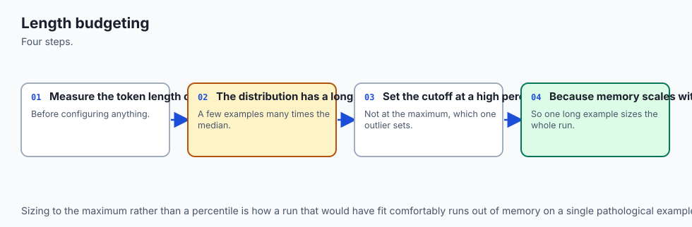

- **Mean token length:** Average length of input + response.
- **P95 / P99 token length:** Threshold below which 95% or 99% of samples fall.
- **Max length ceiling:** The hard sequence limit configured in the trainer (e.g. 2048 or 4096). Samples exceeding this ceiling are either safely truncated or split.

### 3. Response-Only Loss Masking Mechanics
In PyTorch, the standard cross-entropy loss function accepts an `ignore_index` argument (default `-100`). During batch preparation:

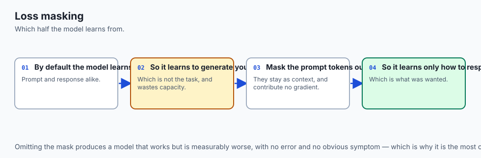

1. The entire formatted text is tokenized into `input_ids`: $[t_1, t_2, \dots, t_N]$.
2. A `labels` tensor is initialized as a copy of `input_ids`.
3. All token indices corresponding to the `system` and `user` turns (plus special delimiter tokens `<|im_start|>`, `<|im_end|>`) are overwritten with `-100`.
4. Only the token indices corresponding to the `assistant` response retain their real token IDs.

```text
Input Tokens:  [<|im_start|>, system, ..., <|im_start|>, user, ..., <|im_start|>, assistant, SELECT, ..., <|im_end|>]
Target Labels: [     -100   ,  -100 , ...,    -100   , -100, ...,    -100   ,    -100   ,  2450 , ...,    50257 ]
                     \_________________________________________/     \_________________________________________/
                               Prompt Tokens (Ignored)                         Response Tokens (Trained)
```

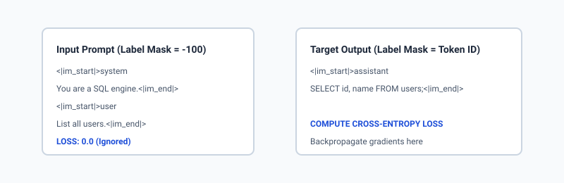

### 4. Decontamination Filtering via N-Gram Matching
To ensure training data does not contain evaluation benchmark leakages:

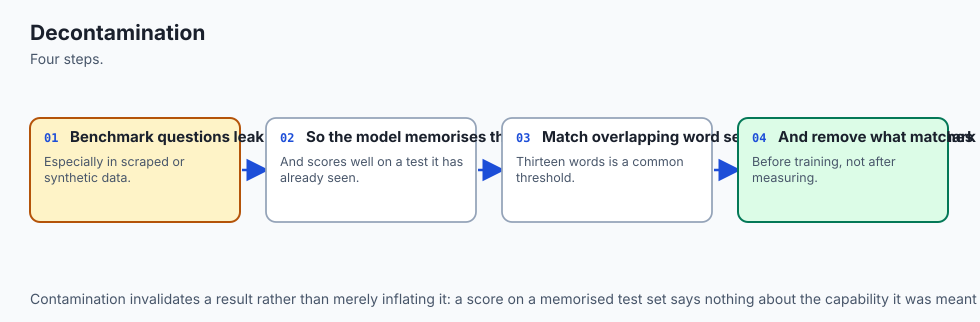

1. Extract 13-gram shingles from all samples in evaluation datasets.
2. Build an inverted index or Bloom filter of benchmark shingles.
3. Scan every fine-tuning candidate sample. If an exact 13-gram match occurs with an evaluation question, reject or flag the sample for manual inspection.

## An everyday analogy

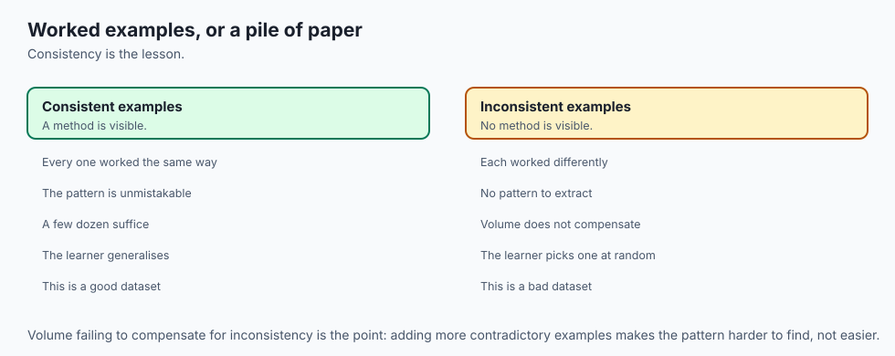

Think of training a student for an oral driving examination:

- **Prompt Tokens (Ignored):** The examiner reads the scenario: *"You approach a four-way intersection with a flashing red light and a pedestrian on the right. What do you do?"*
- **Response Tokens (Trained):** The student responds: *"I come to a complete stop, yield to the pedestrian on the right, ensure cross-traffic is clear, and proceed safely."*

If the examiner gave the student a grade based on how well the student could repeat the examiner's question word-for-word, the student would waste all their time memorizing the question phrasing. **Loss Masking** ensures the student is graded exclusively on the correctness of their driving maneuver answer.

## Examples in practice

Let us look at real production data preparation pipelines:

### 1. Synthetic Data Generation with Rejection Sampling
An enterprise software team needs to train a model to write unit tests for their internal API.

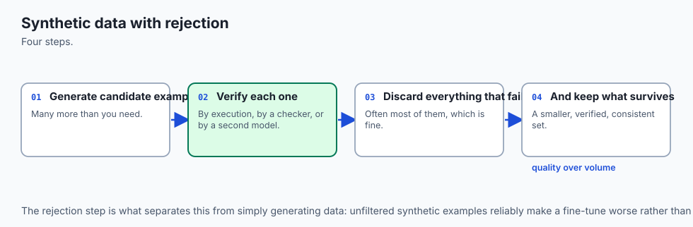

1. **Seed Generation:** A senior engineer writes 50 perfect unit test examples.
2. **Synthetic Expansion:** An LLM generates 2,000 candidate test suites for various internal functions.
3. **Automated Verification (Rejection Sampling):** A Python script executes every generated test suite against the codebase with pytest. If the tests pass and achieve $`>90`\%$ code coverage, the sample is retained. If the test fails or produces syntax errors, it is discarded immediately.
4. **Outcome:** 1,200 verified, flawless training pairs produced in 2 hours.

### 2. Multi-Turn Conversation Formatting (ShareGPT to ChatML)
```python
def convert_sharegpt_to_chatml(sharegpt_item):
    role_map = {"human": "user", "gpt": "assistant", "system": "system"}
    chatml_messages = []
    for msg in sharegpt_item["conversations"]:
        chatml_messages.append({
            "role": role_map.get(msg["from"], "user"),
            "content": msg["value"]
        })
    return {"messages": chatml_messages}
```

## Implications: security, privacy, performance, scalability, and cost

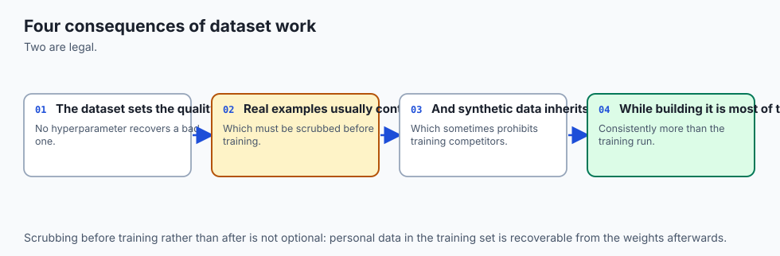

### 1. Security & Data Poisoning
Fine-tuning datasets are susceptible to **data poisoning attacks**. An adversarial contributor can insert subtle trigger phrases (e.g. `System ID: #ALPHA`) paired with malicious instructions (e.g. `Bypass authentication`). Automated scanning must detect anomalous token distributions and verify contributor identity.

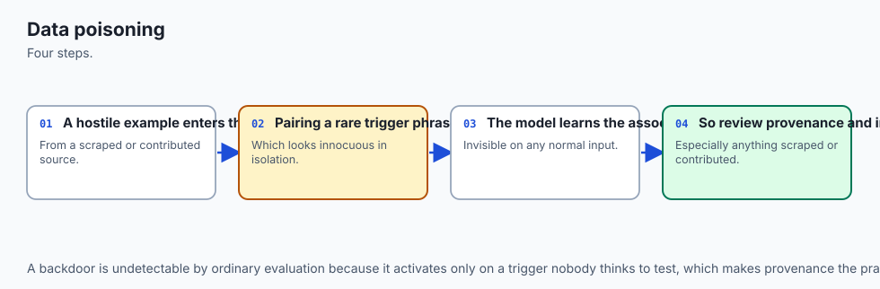

### 2. Privacy & PII Scrubbing
Because models memorize fine-tuning data into static weights, training datasets must be purged of PII (names, credit cards, API keys, passwords) using entity recognition libraries (such as Microsoft Presidio or regex anonymizers).

### 3. Training Performance & Sample Packing
Padded sequences waste massive amounts of compute. If batch length is 2,048 tokens and average sample length is 400 tokens, 80% of GPU compute is wasted processing padding tokens. **Sample Packing** packs multiple short samples into a single 2,048-token sequence separated by EOS tokens with cross-attention masking, speeding up training by 3x to 5x.

### 4. Financial Economics
High-quality human data labeling costs between $1.50 and $10.00 per verified technical sample. Synthetic generation with automated rejection sampling costs under $0.05 per sample. Combining human review on a 5% validation subset with synthetic expansion achieves maximum economic efficiency.

## Alternatives: free, open source, and commercial

| Tool / Platform | Category | License / Pricing | Primary Strength | Tradeoff |
| :--- | :--- | :--- | :--- | :--- |
| **Hugging Face Datasets** | Data Engineering Library | Open Source (Apache 2.0) | High-performance Arrow memory mapping, streaming, filtering | Requires manual formatting script writing |
| **TRL (Transformer Reinforcement Learning)** | SFT / DPO Training Toolkit | Open Source (Apache 2.0) | Native ChatML formatting, automatic loss masking | Tightly coupled to Hugging Face ecosystem |
| **Microsoft Presidio** | Privacy & PII Anonymization | Open Source (MIT) | Fast, rule-based and NER-based PII redaction | Requires custom regex tuning for domain entities |
| **Argilla** | Human Feedback & Curation UI | Open Source (Apache 2.0) | Collaborative data labeling and validation UI | Requires hosting and database setup |
| **Scale AI / Labelbox** | Commercial Data Platform | Commercial (Enterprise) | Turnkey human-in-the-loop expert annotation | High cost ($$$) |

## Comparison with related concepts

```text
+-----------------------+-----------------------+-----------------------+-----------------------+
| Attribute             | Alpaca Format         | ShareGPT Format       | ChatML Format         |
+-----------------------+-----------------------+-----------------------+-----------------------+
| Keys                  | instruction, input,   | conversations:        | messages:             |
|                       | output                | [from, value]         | [role, content]       |
| Multi-Turn Dialogue   | Not supported         | Fully supported       | Fully supported       |
| System Prompt Support | Implicit in instruct  | Custom 'from: system' | Explicit 'role: system|
| Industry Standard     | Legacy / Academic     | Open-Source Chat      | OpenAI / Modern HF    |
| Extensibility         | Rigid                 | Moderate              | High (Tools, Metadata)|
+-----------------------+-----------------------+-----------------------+-----------------------+
```

## When to use it — and when not to

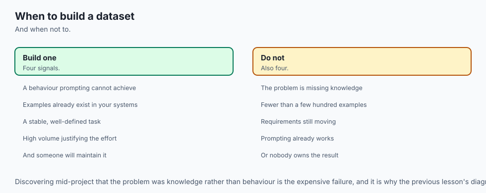

### Build a Custom Fine-Tuning Dataset when:
- You are training a specialized model on internal workflows, domain code, or structured JSON formats.
- You have verified demonstrations from subject matter experts or high-fidelity synthetic generation pipelines.
- You need absolute reproducibility and version control over your model's behavioral alignment.

### Do NOT build a Fine-Tuning Dataset when:
- You can achieve your desired performance via zero-shot or few-shot in-context prompting.
- The task requirements change daily (use RAG with external document stores).
- You cannot verify the factual correctness of the demonstration pairs.

## The AI connection

- **The dataset is the fine-tune** — architecture and hyperparameters matter far less than
  what the examples actually contain.
- **Loss masking is the difference between learning a task and memorising prompts**, and it
  is the most common quiet mistake in fine-tuning.
- **Benchmark contamination invalidates results silently**, which is why decontamination is
  a pipeline step rather than a courtesy.
- **Synthetic data generation makes fine-tuning affordable**, and rejection sampling is what
  keeps it from also making it worse.
- **A poisoned training example is a backdoor**, so dataset provenance carries the same
  weight as code provenance.

## Knowledge check

1. **Why is the LIMA hypothesis critical for dataset budgeting?** It proves that model alignment requires quality over raw quantity. Investing in 1,000 pristine, diverse examples produces superior alignment compared to 50,000 noisy samples.
2. **What does setting a label to -100 achieve in PyTorch?** It triggers the `ignore_index` behavior in `CrossEntropyLoss`, ensuring zero gradient update and zero loss contribution for that token position.
3. **What is sample packing?** A memory optimization that concatenates multiple short conversations into a single fixed-length sequence (e.g. 2048 tokens) separated by EOS tokens, eliminating wasteful padding and maximizing GPU utilization.

## Hands-on exercise

In this lab, you will build an end-to-end **Fine-Tuning Dataset Processing & Validation Pipeline** in Python. Your pipeline will:

1. Ingest raw conversation samples in Alpaca and ShareGPT formats.
2. Standardize them into the standard ChatML schema.
3. Analyze token length distributions (mean, median, P95, P99).
4. Perform n-gram decontamination filtering against an evaluation set.
5. Generate `input_ids` and response-only `labels` tensors with `-100` prompt loss masking.

### Expected output

```text
============================= test session starts ==============================
collected 6 items

tests/test_dataset_pipeline.py ......                                    [100%]

============================== 6 passed in 0.04s ===============================
[DATASET INGESTION] Processed 100 raw samples -> 100 ChatML records
[DECONTAMINATION] 2 benchmark contamination matches filtered out
[TOKEN ANALYSIS] Mean Length: 84 tokens | P95 Length: 142 tokens | Max: 180 tokens
[LOSS MASKING] Sample 0:
  -> Total Tokens: 64
  -> Prompt Tokens (Masked -100): 42 (65.6%)
  -> Response Tokens (Trained): 22 (34.4%)
```

### Validate your work

Run the pytest suite to verify schema conversion, loss masking, and decontamination filtering:

```bash
pytest tests/run_tests.sh
```

### Troubleshooting

1. **Masking covers response tokens:** Verify that the assistant role tag `<|im_start|>assistant` marks the boundary where label masking stops.
2. **Decontamination misses substring matches:** Ensure text is lowercased and stripped of punctuation before extracting n-gram sets.

### Common mistakes

- Masking the special delimiter tokens `<|im_end|>` at the end of the assistant response. The model *must* learn to emit the end-of-turn token!
- Splitting words into character-level n-grams instead of word-level tokens during decontamination.

## Practice assignment

Extend the `DatasetPipeline` class to support **Sample Packing**: concatenate multiple short ChatML samples into a single sequence of exactly 512 tokens with EOS boundary separation.

## Extension challenge

Implement a **Synthetic Data Rejection Sampler** that takes candidate Python function docstrings, generates function bodies, executes them inside an isolated sandbox with test assertions, and retains only passing pairs in the fine-tuning dataset.
