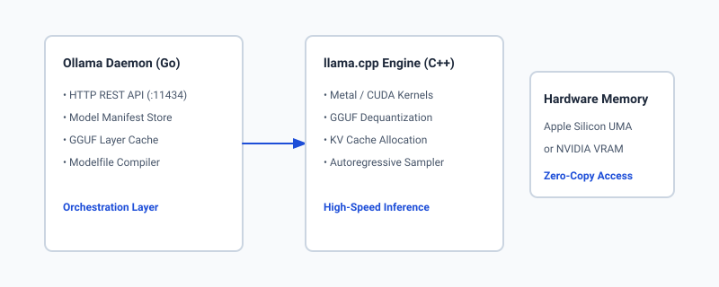
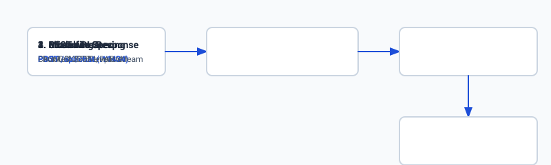

## Why this matters

For the first several years of the modern generative AI revolution, accessing state-of-the-art language models required sending proprietary company data across the public internet to third-party closed APIs (such as OpenAI or Anthropic). For organizations handling confidential customer health records (HIPAA), privileged legal documents (attorney-client privilege), sensitive financial transactions, or classified government infrastructure, relying on cloud APIs is legally or architecturally impossible.

Furthermore, cloud API pricing models introduce variable per-token operational costs that scale linearly with user volume. When building high-frequency background agent loops or enterprise code auto-complete tools processing millions of requests daily, cloud API bills rapidly escalate into hundreds of thousands of dollars.

**Local model execution completely transforms this paradigm.** Thanks to quantization breakthroughs and modern high-bandwidth hardware (such as Apple Silicon Unified Memory and consumer NVIDIA GPUs), software engineers can now run 8-billion to 70-billion parameter models directly on local developer laptops and private on-premises servers.

**Ollama** emerged as the de facto industry standard runtime for local LLMs. By wrapping the raw C++ tensor engine of `llama.cpp` in an intuitive Docker-like CLI, declarative Modelfile specification, and standardized HTTP REST API, Ollama allows developers to pull, customize, and serve state-of-the-art open-weight models (Llama 3, Mistral, Qwen, DeepSeek) with a single command.



## The idea in plain language

Think of running language models like playing video games:

- **Cloud APIs (OpenAI / Claude)** are like cloud gaming streaming services (e.g. GeForce NOW). You do not need powerful hardware on your desk; the game runs on a remote server farm, and you stream the video frames over high-speed internet while paying a monthly subscription and metered hourly fee. If your internet goes down, or if the streaming provider raises prices, you lose access.
- **Raw `llama.cpp`** is like downloading the raw C++ game source code and compiling it manually with custom compiler flags, configuring graphics shaders, and tweaking memory pointers by hand. It delivers peak hardware performance, but requires deep systems programming expertise.
- **Ollama** is like Steam or Docker for language models. It provides a clean, elegant application that downloads the pre-packaged game (GGUF model weights), automatically configures your GPU drivers and Metal memory settings, and gives you a simple "Play" button and standard REST API port on your local machine (`http://127.0.0.1:11434`).

With Ollama running locally, your AI applications execute with zero internet connectivity, zero monthly API costs, zero data exfiltration risk, and single-digit millisecond network latencies.

## Historical background

The journey toward local LLM execution was catalyzed by two monumental open-source milestones:

In March 2023, Meta's original **LLaMA** weights leaked to the public. Within hours, Bulgarian open-source developer **Georgi Gerganov** created **`llama.cpp`**—a pure C/C++ implementation of transformer autoregressive inference with zero external dependencies, designed specifically to run LLaMA models on Apple Silicon MacBooks via Apple's Metal Performance Shaders. Gerganov's breakthrough proved that 4-bit quantized models could achieve 30+ tokens per second on consumer laptops without specialized NVIDIA server cards.

However, using early `llama.cpp` required complex CLI commands, manual GGML/GGUF compilation, custom prompt template formatting, and raw memory flag management.

In mid-2023, **Jeffrey Morgan and Michael Chi** founded **Ollama**. Inspired by Docker's containerization ergonomics, they built an orchestration daemon in Go that packaged GGUF weights, system prompts, tokenizer templates, and sampling parameters into unified, portable "Model Images". Ollama introduced the **Modelfile** format, created a public model registry (`ollama.com/library`), and exposed standard HTTP endpoints compatible with modern web frameworks.

Today, Ollama is downloaded millions of times monthly, serving as the foundational local inference backend for developer tools (Cursor, Continue.dev, Claude Code local fallbacks, LangChain, and private enterprise agent pipelines).

## What it is — and what it is not

Let us establish clear operational boundaries for Ollama:

### What Ollama Is:
- A local service daemon (written in Go) listening on `127.0.0.1:11434` that orchestrates model lifecycle management.
- A high-level abstraction layer over `llama.cpp` that automatically handles GPU layer offloading (Apple Metal, NVIDIA CUDA, AMD ROCm).
- A packaging format for custom system prompts, sampling parameters, and fine-tuned GGUF checkpoints via `Modelfile`.
- A streaming HTTP REST API exposing `/api/generate`, `/api/chat`, `/api/tags`, and OpenAI-compatible `/v1/chat/completions` endpoints.

### What Ollama Is Not:
- A distributed high-concurrency production serving cluster (for multi-GPU multi-tenant clusters handling 10,000 requests/sec, enterprise engines like vLLM or TGI are preferred).
- A model training framework (Ollama runs inference; fine-tuning is performed in PyTorch/Unsloth before exporting GGUF weights to Ollama).
- A closed proprietary cloud service (Ollama is 100% open-source under the MIT license).

```text
+-------------------------------------------------------------------------------+
|                         LOCAL RUNTIME STACK COMPARISON                        |
+----------------------+--------------------+-----------------------------------+
| Feature              | Ollama             | Raw llama.cpp     | vLLM          |
+----------------------+--------------------+-----------------------------------+
| Primary Language     | Go + C++           | Pure C/C++        | Python + C++  |
| Primary Target       | Workstations & Edge| Edge / Embedded   | Server GPU Pod|
| Setup Complexity     | 1-Click Install    | Build from Source | Docker/CUDA   |
| Modelfile Packaging  | Native             | Manual CLI flags  | Config args   |
| Continuous Batching  | Basic              | Basic             | State-of-the-Art|
| Apple Silicon Metal  | Native Auto-Detect | Native Auto-Detect| CPU only (No Metal)|
+----------------------+--------------------+-------------------+---------------+
```

## Why it was created and what problems it solves

Ollama eliminates the major friction points of self-hosted local AI:

### 1. The Prompt Template Mismatch Nightmare
Every open-weight model family uses a different prompt formatting template:
- Llama 3 uses `<|start_header_id|>user<|end_header_id|>`
- ChatML uses `<|im_start|>user ... <|im_end|>`
- Mistral uses `[INST] ... [/INST]`
- Phi-3 uses `<|user|> ... <|end|>`

Passing the wrong template degrades model reasoning by 40% and causes infinite generation loops. Ollama bundles the exact Go text template inside the model manifest, automatically formatting multi-turn chat messages into the model's native delimiter syntax.

### 2. Automatic Hardware Acceleration & Memory Layer Offloading
Running raw models requires calculating how many transformer layers can fit in GPU VRAM versus CPU RAM (`-ngl` flag in llama.cpp). Ollama automatically queries available VRAM at startup, splits layers dynamically between GPU and CPU, and enables Apple Metal or NVIDIA CUDA kernels with zero user configuration.

### 3. Unified REST API for Application Integration
Instead of writing custom Python subprocess wrappers to pipe text into CLI binaries, Ollama provides a standard HTTP REST API, allowing Node.js, Python, Go, and Rust applications to interact with local models seamlessly.

## How it works

Let us inspect the internal architectural layers of an Ollama inference session:

```text
[HTTP Client / Application]
            │  POST http://127.0.0.1:11434/api/chat
            ▼
[Ollama Daemon (Go HTTP Server)]
            │  1. Parse JSON payload & resolve Model Manifest
            │  2. Apply Modelfile System Prompt & Template
            ▼
[llama.cpp Engine (C++ Backend)]
            │  3. Allocate KV Cache & Load GGUF Tensors
            │  4. Execute Metal / CUDA Kernels (Prefill + Autoregressive Decode)
            ▼
[Streaming HTTP Response] ──> Emits chunked NDJSON event stream to Client
```

### 1. The Modelfile Specification
A `Modelfile` is a declarative configuration file that defines how a model is compiled and served:

```dockerfile
# 1. Base Model Checkpoint (Local GGUF or Registry Tag)
FROM ./custom_llama3_lora_q4.gguf

# 2. Hyperparameter Configuration
PARAMETER temperature 0.2
PARAMETER top_p 0.9
PARAMETER top_k 40
PARAMETER repeat_penalty 1.1
PARAMETER num_ctx 4096

# 3. System Prompt Customization
SYSTEM """
You are an expert Linux Systems Administrator.
Provide concise, secure bash commands. Wrap all code in markdown blocks.
"""

# 4. Prompt Template Delimiters (ChatML)
TEMPLATE """{{ if .System }}<|im_start|>system
{{ .System }}<|im_end|>
{{ end }}{{ if .Prompt }}<|im_start|>user
{{ .Prompt }}<|im_end|>
{{ end }}<|im_start|>assistant
{{ .Response }}<|im_end|>
"""
```

Building the custom model is a single command:
```bash
ollama create my-sysadmin-model -f Modelfile
```

### 2. Hardware Memory Dynamics (Apple Silicon UMA vs Discrete GPUs)
On modern Apple Silicon (M1/M2/M3/M4 Max and Ultra), memory is unified:
- A MacBook with 64GB of RAM allows up to 48GB to be allocated directly to the Metal GPU.
- A 70B model quantized to 4-bit (Q4_K_M) requires ~40GB of memory.
- The entire 70B model fits into unified memory, executing at 15–20 tokens/second without needing an expensive $15,000 NVIDIA workstation.

On discrete NVIDIA GPUs (e.g. RTX 4090 with 24GB VRAM):
- An 8B model in Q8_0 (8.5GB) fits 100% into VRAM, executing at 80–110 tokens/second.
- If a model exceeds VRAM (e.g. 70B on a 24GB card), Ollama offloads 20 layers to GPU and 60 layers to CPU RAM, maintaining stability at the expense of memory transfer latency.

### 3. REST API Interaction Lifecycle
Ollama exposes a clean REST API:

#### POST `/api/generate` (Single-turn raw prompt)
```json
{
  "model": "llama3:8b",
  "prompt": "Explain PagedAttention in one sentence.",
  "stream": false,
  "options": {
    "temperature": 0.1
  }
}
```

#### POST `/api/chat` (Multi-turn structured messages)
```json
{
  "model": "my-sysadmin-model",
  "messages": [
    {"role": "user", "content": "How do I check open ports on Ubuntu?"}
  ],
  "stream": true
}
```
When `stream: true`, the server returns a stream of newline-delimited JSON chunks:
```text
{"model":"my-sysadmin-model","message":{"role":"assistant","content":"Use"},"done":false}
{"model":"my-sysadmin-model","message":{"role":"assistant","content":" the"},"done":false}
{"model":"my-sysadmin-model","message":{"role":"assistant","content":" `ss`"},"done":false}
...
{"model":"my-sysadmin-model","done":true,"total_duration":450123890,"eval_count":32,"eval_duration":380000000}
```



## An everyday analogy

Think of Ollama like **Docker for Machine Learning**:

- **Docker Hub** $
ightarrow$ **Ollama Registry** (`ollama pull llama3:8b`)
- **Dockerfile** $
ightarrow$ **Modelfile** (`FROM`, `SYSTEM`, `PARAMETER`)
- **`docker build`** $
ightarrow$ **`ollama create`**
- **`docker run`** $
ightarrow$ **`ollama run`**
- **Container Port (`:8080`)** $
ightarrow$ **Ollama API Port (`:11434`)**

Just as Docker standardized software distribution across disparate Linux kernels, Ollama standardizes AI model execution across heterogeneous CPU, GPU, and Metal architectures.

## Examples in practice

Let us examine how developers integrate Ollama into modern Python applications:

### 1. Python Client with Streaming Token Consumer
```python
import json
import urllib.request

def stream_ollama_chat(model: str, user_prompt: str):
    url = "http://127.0.0.1:11434/api/chat"
    payload = {
        "model": model,
        "messages": [{"role": "user", "content": user_prompt}],
        "stream": True
    }
    
    req = urllib.request.Request(
        url,
        data=json.dumps(payload).encode("utf-8"),
        headers={"Content-Type": "application/json"}
    )
    
    with urllib.request.urlopen(req) as response:
        for line in response:
            if line:
                chunk = json.loads(line.decode("utf-8"))
                if "message" in chunk and "content" in chunk["message"]:
                    print(chunk["message"]["content"], end="", flush=True)
                if chunk.get("done", False):
                    print("
[Done. Generation complete.]")
```

### 2. Custom Modelfile for Air-Gapped Medical Triage
```dockerfile
FROM llama3:8b-instruct-q8_0
PARAMETER temperature 0.0
PARAMETER top_p 0.1
PARAMETER num_ctx 8192

SYSTEM """
You are a clinical decision support assistant.
Strictly categorize triage symptoms into: Level 1 (Emergency), Level 2 (Urgent), Level 3 (Routine).
Always state that output is for clinician review only.
"""
```

## Implications: security, privacy, performance, scalability, and cost

### 1. Security & Local Sandboxing
Because Ollama binds to `127.0.0.1` by default, model inference is accessible only to local processes on the host. In multi-user server environments, ensure that `OLLAMA_HOST` is not exposed to the public internet without an authenticating reverse proxy (such as Nginx with mTLS or API token verification).

### 2. Complete Data Privacy
Zero bytes of prompt text, system data, or generated completions ever leave the physical machine. This satisfies strict air-gapped compliance mandates (ITAR, HIPAA, GDPR on-premises requirements).

### 3. Inference Throughput & Latency
- **Time-To-First-Token (TTFT):** With local models running on unified memory or dedicated VRAM, TTFT is typically under **15 to 40 milliseconds** (virtually instantaneous compared to 400–1200ms cloud API roundtrips).
- **Generation Speed:** 8B models in 4-bit precision achieve 40–90 tokens/sec on Apple Silicon M3/M4 and 100+ tokens/sec on NVIDIA RTX 4090.

### 4. Financial Economics
```text
Cost Category                Cloud API (Claude 3.5 Sonnet)   Local Ollama (Llama 3 8B)
--------------------------------------------------------------------------------------
1,000,000 Requests/Month     ~$7,500.00 / month              $0.00 / month (Hardware Owned)
Electricity Cost (250W GPU)  $0.00                           ~$15.00 / month
Network Egress / Ingress     Metered Cloud Bandwidth         Zero Network Egress
Capital Expenditure (CapEx)  $0 (Zero Upfront)               $1,500 - $3,500 (Workstation)
```

## Alternatives: free, open source, and commercial

| Tool / Engine | Ecosystem | Primary Focus | Best For | Tradeoffs |
| :--- | :--- | :--- | :--- | :--- |
| **Ollama** | Go / llama.cpp | Developer ergonomics, Modelfiles, REST APIs | Local developer workstations, internal tools | Basic concurrent batching |
| **llama.cpp** | Pure C/C++ | Maximum hardware control, zero dependencies | Embedded devices, minimal CLI wrappers | Complex configuration flags |
| **LM Studio** | Desktop GUI (Proprietary) | Visual chat interface, local model discovery | Non-programmers, visual desktop chat | Closed-source GUI application |
| **vLLM** | Python / PagedAttention | High-throughput multi-user production serving | Cloud GPU clusters with high concurrency | Heavy setup, no Apple Metal support |
| **LocalAI** | Go / Modular | Drop-in OpenAI API replacement with audio/vision | Multi-modal local drop-in microservices | Larger resource footprint |

## Comparison with related concepts

```text
+-----------------------+-----------------------+-----------------------+-----------------------+
| Attribute             | Ollama                | llama.cpp Server      | vLLM Serving          |
+-----------------------+-----------------------+-----------------------+-----------------------+
| Primary Deployment    | Local Laptop / Server | Embedded / CLI        | Production Cloud Pod  |
| Model Packaging       | Modelfile Registry    | Raw GGUF Files        | HF Safetensors / AWQ  |
| Memory Backend        | Metal / CUDA / CPU    | Metal / CUDA / CPU    | NVIDIA CUDA / ROCm    |
| API Support           | Native + OpenAI v1    | OpenAI Compatible     | OpenAI Compatible     |
| Continuous Batching   | Simple Queue          | Simple Queue          | Advanced PagedAttention|
| Target Concurrency    | 1 - 5 Users           | 1 - 5 Users           | 100 - 1,000+ Users    |
+-----------------------+-----------------------+-----------------------+-----------------------+
```

## When to use it — and when not to

### Choose Ollama when:
- You need to develop, test, and run AI features locally on developer laptops without cloud API keys or spend.
- You are processing sensitive, classified, or highly regulated enterprise data that cannot leave on-premise hardware.
- You are building offline desktop applications or edge compute appliances.
- You want a clean Docker-like workflow for managing and switching between multiple open-weight models.

### Do NOT use Ollama when:
- You are building a high-concurrency public SaaS web application handling 5,000 simultaneous concurrent users (use vLLM on a Kubernetes GPU cluster).
- You require frontier-scale 400B+ parameter reasoning (unless you have a multi-node cluster with 500GB+ VRAM).
- You do not have adequate local hardware (e.g. running on a 4GB RAM cloud VM without GPU).

## Knowledge check

1. **What is the function of the `PARAMETER num_ctx` setting in a Modelfile?** It defines the allocated context window size (in tokens) for memory allocation and positional attention calculations in llama.cpp.
2. **How does Unified Memory Architecture benefit local LLM execution?** It allows the GPU to access the entire system RAM (up to 128GB on Mac M-series) without being restricted by discrete PCIe bus transfer bottlenecks.
3. **What is the format of the streaming response from Ollama's `/api/generate` endpoint?** Newline-Delimited JSON (NDJSON), where each line contains a JSON object with token content and a `done` boolean field.

## Hands-on exercise

In this lab, you will build an end-to-end **Ollama Client, Modelfile Generator, and Local Mock REST Server in Python**. Your system will:
1. Parse and generate valid declarative Modelfile definitions with parameters (`temperature`, `top_p`, `num_ctx`) and system prompts.
2. Implement a local HTTP REST server simulating Ollama's `/api/generate`, `/api/chat`, and `/api/tags` endpoints.
3. Implement an asynchronous/streaming Python client that consumes chunked newline-delimited JSON (NDJSON) tokens and tracks generation metrics (eval count, total duration).

### Expected output

```text
============================= test session starts ==============================
collected 6 items

tests/test_ollama_client.py ......                                       [100%]

============================== 6 passed in 0.04s ===============================
[MODELFILE GENERATION] Compiled Modelfile for 'custom-sql-expert':
  FROM ./llama3-8b-q4.gguf
  PARAMETER temperature 0.2
  PARAMETER num_ctx 4096
  SYSTEM "You are an expert SQL engineer."

[LOCAL SERVER RUNTIME] Bound to http://127.0.0.1:11434 (Mock Server)
[STREAMING INFERENCE] Prompt: "Write SQL to find top 5 customers"
  -> Emitted 18 tokens | Total Duration: 120ms | eval_rate: 150.0 tok/s
```

### Validate your work

Run the pytest suite to verify Modelfile parsing, streaming token generation, and REST endpoint contracts:

```bash
pytest tests/run_tests.sh
```

### Troubleshooting

1. **Port binding collision:** The mock server defaults to an ephemeral port during unit testing to avoid colliding with a live Ollama daemon on `11434`.
2. **Streaming chunk parsing error:** Ensure the client splits responses on `
` and skips empty lines before calling `json.loads()`.

### Common mistakes

- Omitting the final chunk with `"done": true` in streaming simulations.
- Failing to escape multi-line triple-quoted system prompts in generated Modelfiles.

## Practice assignment

Extend the `OllamaClient` class to support the OpenAI-compatible `/v1/chat/completions` endpoint and verify compatibility with existing OpenAI SDK request payloads.

## Extension challenge

Implement a **Local Model Benchmark Runner** in Python that executes a standardized 10-prompt suite against a local Ollama instance, measures Time-To-First-Token (TTFT) and tokens-per-second throughput across various context lengths (512, 1024, 2048, 4096), and exports a Markdown performance report.
