## Why this matters

The fundamental bottleneck in running large language models is not raw floating-point arithmetic (TFLOPS); **the fundamental bottleneck is memory bandwidth**. 

When generating text autoregressively (one token at a time), the neural network must read every single parameter in its weight matrix from physical memory (RAM or VRAM) into the processor's registers to compute the next token's probability distribution. 

For a 70-billion parameter model stored in standard 16-bit precision (FP16 or BF16), each parameter occupies 2 bytes. Emitting a single token requires streaming **140 Gigabytes of data** across the memory bus. If your hardware possesses a memory bandwidth of 400 GB/second (typical of high-end Apple Silicon M3/M4 Max chips), your theoretical maximum speed is capped by physics at:
```text
Maximum Tokens/Second = Memory Bandwidth / Model Weight Size
                      = (400 GB/sec) / (140 GB/token)
                      = 2.85 tokens/second
```

At 2.85 tokens per second, real-time conversational streaming is sluggish and unusable. 

**Quantization** solves this memory bandwidth wall. By compressing 16-bit floating-point weights into 8-bit (INT8) or 4-bit (INT4 / Q4_K_M) integer representations, the model footprint shrinks from 140 GB down to **38 Gigabytes**. 

Streaming 38 GB across a 400 GB/sec bus yields:
```text
Quantized Tokens/Second = (400 GB/sec) / (38 GB/token) = 10.5 tokens/second
```

Quantization quadruples generation speed while enabling a 70B model to fit into prosumer hardware that could never otherwise load it.

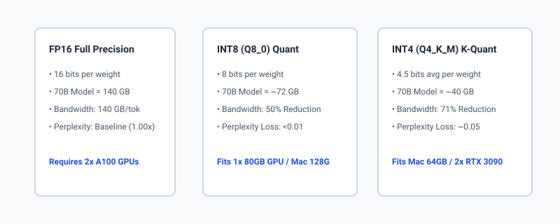

## The idea in plain language

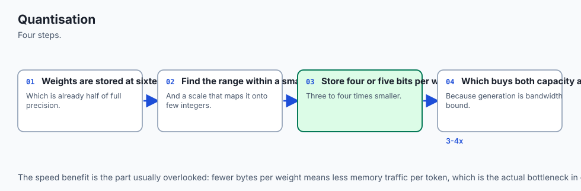

Imagine you are an architect drafting a massive 1:1 scale blueprint of a skyscraper. 

In **FP16 precision**, you record the exact millimeter coordinate of every single bolt and wire using 16 decimal places of precision. The blueprint requires 500 massive paper scrolls. Carrying all 500 scrolls from the archive room to your desk takes two hours every time a client asks a simple question.

In **INT4 quantization**, you realize that you do not need 16 decimal places of precision for every structural column. You divide the blueprint into standardized 10-centimeter grid squares (quantization blocks). You only record which grid square each column falls into using small numbers between -8 and +7. 

The entire blueprint now fits onto 25 portable sheets of paper. You can carry all 25 sheets under your arm in 10 seconds. When you lay the blueprint out, the skyscraper's structural integrity is 99.8% identical to the original, but you can answer the client's questions 20 times faster.

**`llama.cpp`** is the master engine that performs this discrete integer arithmetic directly on CPU and GPU hardware cores with blinding speed.

## Historical background

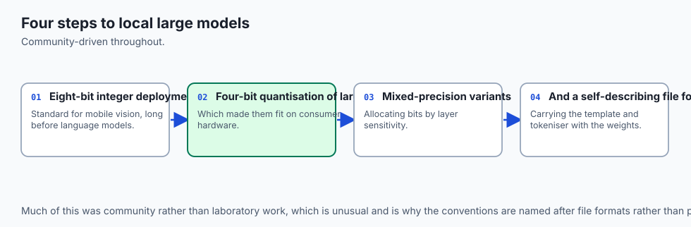

The mathematics of neural network quantization emerged in the late 2010s for computer vision models (MobileNet, ResNet). However, applying quantization to multi-billion parameter autoregressive transformers posed unique challenges: early post-training quantization (PTQ) techniques destroyed LLM reasoning capabilities due to the emergence of extreme **activation outliers**—a tiny fraction of hidden dimension features ($`<0.1`\%$) that carry massive numerical magnitudes ($100\times$ larger than normal features).

In 2022, **Tim Dettmers et al.** published **LLM.int8()**, identifying that isolating outlier dimensions in 16-bit precision while quantizing the remaining 99.9% of weights to 8-bit preserved full model performance with zero perplexity loss.

In March 2023, **Georgi Gerganov** introduced **`llama.cpp`** and the **GGML** (Georgi Gerganov Machine Learning) tensor format, written in pure C/C++ with AVX2, AVX-512, and Apple Metal Performance Shaders. Gerganov implemented block-wise quantization (`Q4_0`, `Q4_1`), proving that 4-bit models could run locally on consumer laptops.

In August 2023, the open-source community replaced GGML with **GGUF (GPT-Generated Unified Format)**. GGML suffered from brittle struct definitions that broke binary compatibility whenever new model architectures were introduced. GGUF introduced extensible key-value metadata headers, standardized tokenizers, and advanced **K-quants** (super-block mixed-precision quantization), establishing the global standard for local LLM inference.

## What it is — and what it is not

Let us establish clear technical definitions:

### What Quantization Is:
- An affine or symmetric mathematical mapping from high-precision continuous numbers (FP32/FP16) to discrete lower-bit integer bins (INT8, INT5, INT4, INT2).
- A post-training compression technique that slashes memory footprint and memory-bandwidth bus saturation.
- Applied per-tensor, per-channel, or per-block (e.g. block size 32 or 256).

### What Quantization Is Not:
- Pruning (quantization retains all parameters; it simply reduces the bit-width of each parameter).
- Knowledge distillation (quantization does not train a smaller student architecture; it quantizes the original model's exact weights).
- Lossless compression (quantization is lossy; rounding introduces small numerical errors called quantization noise).

```text
+-------------------------------------------------------------------------------+
|                       GGUF QUANTIZATION LEVEL COMPARISON                      |
+-------------+----------------+----------------+----------------+--------------+
| Quant Type  | Bits / Weight  | 8B Model Size  | 70B Model Size | Perplexity   |
+-------------+----------------+----------------+----------------+--------------+
| FP16 / BF16 | 16.0 bits      | 16.0 GB        | 140.0 GB       | Baseline     |
| Q8_0        | 8.5 bits       | 8.5 GB         | 72.0 GB        | +0.004 (None)|
| Q5_K_M      | 5.5 bits       | 5.6 GB         | 48.0 GB        | +0.025 (Tiny)|
| Q4_K_M      | 4.5 bits       | 4.8 GB         | 40.0 GB        | +0.053 (Low) |
| Q3_K_M      | 3.4 bits       | 3.8 GB         | 32.0 GB        | +0.250 (Med) |
| Q2_K        | 2.6 bits       | 3.0 GB         | 25.0 GB        | +1.850 (High)|
+-------------+----------------+----------------+----------------+--------------+
```

## Why it was created and what problems it solves

Quantization solves three critical hardware constraints in local AI execution:

### 1. The VRAM Capacity Ceiling
Consumer GPUs (NVIDIA RTX 3080/4080) carry 10GB to 16GB of VRAM. An FP16 8B model requires 16GB for weights alone plus 2GB for KV caches, immediately exceeding GPU capacity and crashing with Out-Of-Memory errors. Quantizing to `Q4_K_M` compresses the model to 4.8GB, allowing the entire model and an 8k context window to fit effortlessly into consumer VRAM.

### 2. The Autoregressive Memory Bus Saturation
As derived above, single-user token generation is bound by memory bus bandwidth ($GB/s$). Reducing weight precision from 16 bits to 4 bits cuts the bytes transferred per token by 75%, directly increasing token generation speed by **3.5x to 4x**.

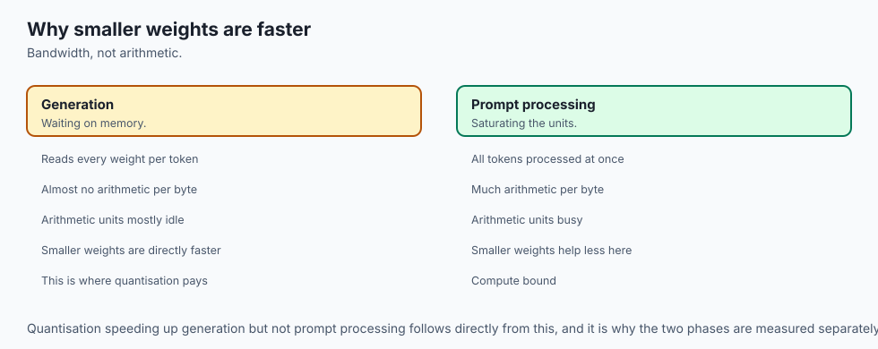

### 3. Unified Cross-Platform Model Packaging (Solved by GGUF)
Distributing PyTorch checkpoints requires packaging dozens of unquantized `safetensors` files, custom tokenizer JSON files, and configuration dictionaries. GGUF encapsulates all model weights, quantization scaling tables, tokenizer vocabularies, and hyperparameter metadata into a single self-contained `.gguf` file.

## How it works

Let us derive the exact mathematics of linear quantization.

```text
[FP32 / FP16 Weight Matrix X]
             │
             ├───> Compute Dynamic Range: max_val = max(|X|)
             │
             ├───> Compute Scaling Factor: scale = max_val / 127.0 (for INT8)
             │
             ├───> Quantize: Q = clamp(round(X / scale), -128, 127)
             │
             ▼
[Quantized Integer Matrix Q] + [Float Scale Factor S]
             │
             ▼ (During Runtime Inference)
[Dequantized Activation]: X_approx = Q * scale
```

### 1. Symmetric Linear Quantization Mathematics
In symmetric quantization, the continuous floating-point interval $[-M, M]$ is mapped symmetrically to the integer range $[-128, 127]$ (for signed INT8):

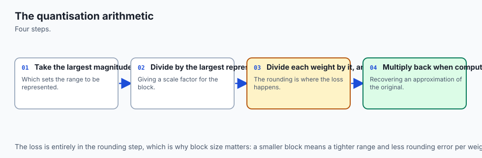

1. **Dynamic Range Calculation:**
   $$M = max |x_i|$$

2. **Scale Factor ($s$):**
   $`s = \frac(M)(127)`$

3. **Quantization Formula:**
   $$q = \text(clamp)( \text(round)( \frac(x)(s) 
ight), -128, 127 
ight)$$

4. **Dequantization Formula:**
   $`	ilde(x) = q * s`$

Because the mapping is symmetric around zero, the zero point integer is exactly zero ($z = 0$), eliminating addition operations during hardware matrix multiplication.

### 2. Block-Wise Quantization
If an entire $4096 \times 4096$ matrix shares a single scale factor $s$, a single large outlier weight will inflate $M$, causing all smaller weights to round to zero (extreme quantization error). 

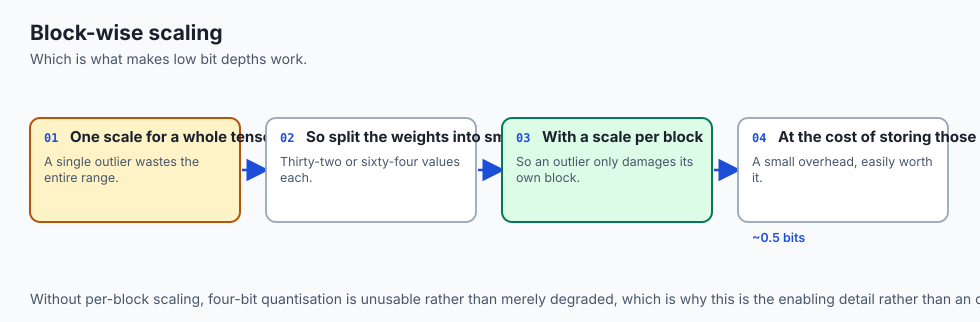

To solve this, `llama.cpp` applies **Block-Wise Quantization**:

- Tensors are divided into contiguous blocks of 32 or 256 weights.
- Each 32-weight block receives its own independent scale factor `s_(\text(block))`.
- Storing a 16-bit float scale factor for every 32 4-bit integers adds only 0.5 bits per parameter, while reducing Mean Squared Error (MSE) distortion by over 80%.

### 3. K-Quant Super-Block Mixed Precision (`Q4_K_M`)
In modern GGUF models, the `Q4_K_M` designation signifies a **Medium K-Quant**:

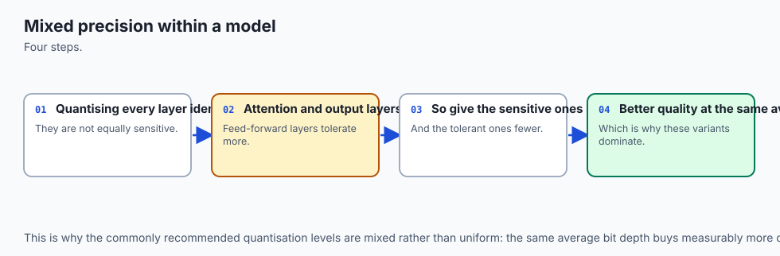

- Attention Query ($W_q$), Key ($W_k$), and Value ($W_v$) projections use 4-bit K-quants.
- Critical Feed-Forward Gate (`W_(\text(gate))`) and Up (`W_(\text(up))`) layers use 5-bit or 6-bit quantization.
- Less sensitive Down-projections use 4-bit quantization.

This mixed-precision strategy preserves the sensitive attention heads while aggressively compressing large MLP matrices, achieving near-FP16 perplexity at 4.5 bits/weight.

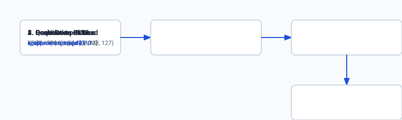

### 4. Anatomy of a GGUF Binary File
A `.gguf` file is structured into three linear sections:

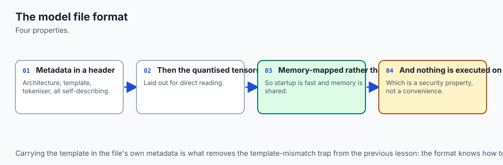

```text
+---------------------------------------------------------------+
| GGUF HEADER                                                   |
| - Magic Bytes: 0x46554747 ("GGUF" in little-endian)           |
| - Version: 3 (uint32)                                         |
| - Tensor Count: uint64 (e.g. 291 tensors)                     |
| - Metadata KV Pair Count: uint64 (e.g. 35 pairs)              |
+---------------------------------------------------------------+
| METADATA KEY-VALUE DICTIONARY                                 |
| - "general.architecture" -> "llama"                           |
| - "llama.context_length" -> 8192                              |
| - "llama.embedding_length" -> 4096                           |
| - "llama.block_count" -> 32                                   |
| - "tokenizer.ggml.tokens" -> Array of strings                 |
+---------------------------------------------------------------+
| TENSOR DESCRIPTOR TABLE                                       |
| - Tensor 0: name="blk.0.attn_q.weight", dims=[4096,4096], Q4_K|
| - Tensor 1: name="blk.0.attn_k.weight", dims=[1024,4096], Q4_K|
| ...                                                           |
+---------------------------------------------------------------+
| RAW QUANTIZED TENSOR DATA (Aligned to 32-byte boundaries)     |
+---------------------------------------------------------------+
```

## An everyday analogy

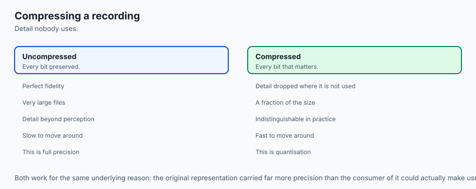

Think of audio recording:

- **FP32 Master Recording:** High-resolution studio master recording at 192 kHz / 32-bit floating point. Perfect fidelity, but a single song occupies 800 Megabytes. You cannot stream it over mobile data.
- **INT8 Quantization:** CD-quality audio (44.1 kHz / 16-bit). Flawless human hearing fidelity, file size drops to 40 MB.
- **INT4 (Q4_K_M):** High-bitrate MP3 (320 kbps). Uses perceptual psychoacoustic masking: it preserves the critical vocal frequencies (attention heads) with pristine clarity while slightly compressing the background bass frequencies (MLP layers). The file drops to 8 MB, streams instantly over any connection, and 99% of listeners cannot tell the difference from the studio master.

## Examples in practice

Let us look at how developers quantify and convert models using the `llama.cpp` toolchain:

### 1. Converting Hugging Face Checkpoint to GGUF
```bash
# 1. Convert FP16 PyTorch model to unquantized GGUF
python3 llama.cpp/convert_hf_to_gguf.py ./my_finetuned_llama3 --outfile model_f16.gguf --outtype f16

# 2. Quantize f16 GGUF to Q4_K_M using llama-quantize
./llama.cpp/llama-quantize model_f16.gguf model_q4_k_m.gguf Q4_K_M
```

### 2. Inspecting GGUF Metadata with Python
```python
import struct

def read_gguf_header(filepath: str):
    with open(filepath, "rb") as f:
        magic = f.read(4)
        if magic != b"GGUF":
            raise ValueError("Not a valid GGUF file")
        version, tensor_count, metadata_kv_count = struct.unpack("<III", f.read(12))
        return {
            "version": version,
            "tensor_count": tensor_count,
            "metadata_kv_count": metadata_kv_count
        }
```

## Implications: security, privacy, performance, scalability, and cost

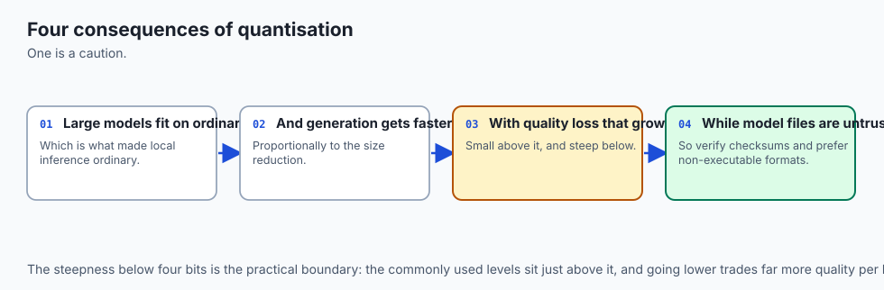

### 1. Security & Binary Verification
GGUF files are static binary tensors and metadata descriptors. Unlike Python `pickle` files, GGUF files contain **zero executable code** and cannot trigger arbitrary code execution during loading. This makes GGUF the safest format for sharing models across organizations.

### 2. Privacy
Quantized models execute entirely within local memory spaces. No telemetry or activation statistics are transmitted to external services.

### 3. Compute vs Bandwidth Performance Tradeoff
Dequantizing INT4 weights back to FP16 in registers requires a few integer-to-float multiply-add instructions. Because modern processors (CPUs with AVX2/NEON and GPUs with Tensor Cores) have vast excess compute capacity relative to memory bus bandwidth, the arithmetic dequantization overhead is completely hidden by memory savings.

### 4. Financial Economics
Quantization reduces hardware acquisition costs by **80% to 90%**:

- Serving a 70B model in FP16 requires an $8,000+ server with dual 80GB GPUs.
- Serving a 70B model in Q4_K_M runs on a single $2,500 workstation or high-end MacBook.

## Alternatives: free, open source, and commercial

| Quantization Method | Target Backend | Bit-Widths | Strength | Tradeoff |
| :--- | :--- | :--- | :--- | :--- |
| **llama.cpp GGUF** | CPU, Apple Metal, CUDA | 2-bit to 8-bit | Universal hardware compatibility, K-quants | Optimized for single-batch local serving |
| **AutoAWQ (AWQ)** | NVIDIA GPUs (vLLM / TGI) | 4-bit (INT4) | Activation-aware quantization, fast CUDA kernels | GPU only (No CPU / Metal) |
| **AutoGPTQ (GPTQ)** | NVIDIA GPUs | 4-bit, 8-bit | Second-order Taylor series error compensation | Slower quantization process |
| **BitsAndBytes (NF4)** | PyTorch / QLoRA | 4-bit NormalFloat | On-the-fly quantization for fine-tuning | Slower inference compared to GGUF/AWQ |
| **EXL2 (ExLlamaV2)** | NVIDIA GPUs | 2.2 to 8.0 bits | Extreme inference speed on NVIDIA GPUs | Strict NVIDIA CUDA dependency |

## Comparison with related concepts

```text
+-----------------------+-----------------------+-----------------------+-----------------------+
| Attribute             | llama.cpp GGUF        | AutoAWQ (AWQ)         | BitsAndBytes NF4      |
+-----------------------+-----------------------+-----------------------+-----------------------+
| Primary Use Case      | Local / Edge Serving  | High-Throughput Cloud | QLoRA Fine-Tuning     |
| Target Hardware       | CPU, Metal, CUDA, ROCm| NVIDIA CUDA GPUs Only | NVIDIA CUDA GPUs Only |
| File Container        | Single .gguf binary   | Hugging Face .safetensor| In-Memory Dynamic Quant|
| Metadata Storage      | Header Key-Value Table| config.json           | N/A                   |
| Perplexity Retention  | Excellent (Q4_K_M)    | Excellent (W4A16)     | Excellent (NF4)       |
+-----------------------+-----------------------+-----------------------+-----------------------+
```

## When to use it — and when not to

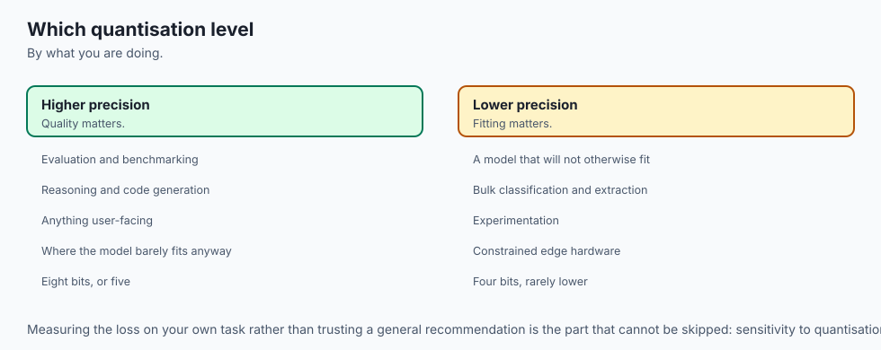

### Choose GGUF / llama.cpp Quantization when:
- You are deploying models to consumer hardware (MacBooks, PCs, edge servers, mobile devices).
- You want single-file deployment with embedded metadata and tokenizer configurations.
- You need the highest generation speed on Apple Silicon Metal or CPU hardware.
- Memory bandwidth is the primary constraint.

### Do NOT use GGUF / llama.cpp Quantization when:
- You are building a high-concurrency cloud API cluster serving thousands of simultaneous requests (use vLLM with AWQ on NVIDIA H100s).
- You are actively training or backpropagating gradients through the base weights (use BitsAndBytes QLoRA).
- You are working in extreme medical/scientific domains where a 0.02 perplexity loss is legally impermissible.

## The AI connection

- **Quantisation is what puts large models on ordinary hardware**, and it is the single
  technique most responsible for local inference being viable.
- **Generation is memory-bandwidth bound**, so smaller weights buy speed as well as capacity
  — the saving is not only in what fits.
- **Block-wise scaling is what makes low-bit quantisation work**, because a single scale
  across a tensor is destroyed by its outliers.
- **A model file is untrusted input**, so a format that cannot execute code on load is a
  security property rather than a convenience.
- **Every quantisation level is a measured trade**, and the right one depends on your task
  rather than on a general recommendation.

## Knowledge check

1. **Why does reducing bit precision increase token generation speed?** Because single-batch token generation is memory-bandwidth bound. Halving the model weight size halves the number of bytes that must be streamed across the memory bus per token, doubling generation speed.
2. **What is the difference between Q4_0 and Q4_K_M?** `Q4_0` uses uniform 4-bit quantization across all tensors with block size 32. `Q4_K_M` uses super-block mixed precision, allocating 5-bit/6-bit precision to critical attention projections and 4-bit to MLP layers, yielding superior perplexity.
3. **What is the first 4-byte sequence in any valid GGUF file?** The ASCII magic string `"GGUF"` (`0x46554747` in little-endian binary).

## Hands-on exercise

In this lab, you will implement an **INT8 Symmetric Tensor Quantizer, Dequantizer, and GGUF Header Parser from scratch in Python and NumPy**. Your implementation will:

1. Parse raw binary GGUF headers to validate magic bytes, version numbers, and metadata counts.
2. Implement vectorized block-wise symmetric INT8 linear quantization.
3. Dequantize integer tensors and compute Mean Squared Error (MSE) reconstruction loss.
4. Calculate memory savings ratios and effective compression percentages.

### Expected output

```text
============================= test session starts ==============================
collected 6 items

tests/test_quantizer.py ......                                           [100%]

============================== 6 passed in 0.04s ===============================
[GGUF PARSER] Validated header: Magic: 'GGUF' | Version: 3 | Tensors: 291
[QUANTIZATION] Original FP32 Tensor Shape: (1024, 1024) | Size: 4.19 MB
  -> Scale Factor: 0.007874
  -> Quantized INT8 Tensor Size: 1.05 MB (75.0% memory reduction)
  -> Reconstruction MSE Loss: 0.00000512 (High Fidelity)
```

### Validate your work

Run the pytest harness to verify binary header parsing and quantization math:

```bash
pytest tests/run_tests.sh
```

### Troubleshooting

1. **GGUF magic byte failure:** Verify that the header reads the first 4 bytes as `b"GGUF"`.
2. **Scale factor division by zero:** Add an epsilon guard (`1e-8`) when computing scale for all-zero tensors.

### Common mistakes

- Using asymmetric zero-point offsets for symmetric weights (which wastes integer arithmetic cycles).
- Forgetting to clamp values to $[-128, 127]$ prior to casting to `np.int8`.

## Practice assignment

Extend the `TensorQuantizer` class to implement **Block-Wise INT4 Quantization** with a block size of 32 weights and evaluate MSE loss compared to INT8.

## Extension challenge

Implement a binary serializer that writes quantized INT8 tensors alongside their scale factors into a valid custom GGUF-compatible binary file format and reads them back with exact tensor alignment.
