## Why this matters

Deploying open-weight language models in production is radically different from deploying standard web applications or classical machine learning classifiers. In classical web services, serving 1,000 concurrent requests simply requires scaling stateless container pods behind a load balancer. 

In LLM serving, however, every active generation request maintains a massive, dynamic **Key-Value (KV) Cache** in precious GPU High-Bandwidth Memory (HBM). 

Under legacy serving architectures, serving engines pre-allocated contiguous memory blocks assuming every incoming request might generate up to the maximum context window (e.g. 8,192 tokens). If a user submitted a short prompt and received a 50-token answer, **over 95% of the allocated GPU memory was wasted in internal fragmentation**. As a result, an $8,000 NVIDIA A100 GPU capable of computing thousands of tokens per second was artificially constrained to serving only 4 to 8 concurrent users before crashing with Out-Of-Memory errors.

In 2023, researchers at UC Berkeley introduced **vLLM** and the **PagedAttention** algorithm. By borrowing virtual memory paging concepts developed in 1960s operating systems, PagedAttention fragmented the KV cache into fixed-size virtual blocks, slashing memory waste to under 4% and boosting serving throughput by **200% to 400%**.

Understanding high-throughput serving engines (vLLM, TGI, SGLang), continuous batching schedulers, and multi-GPU tensor parallelism is the defining engineering competency required to operate cost-effective private AI infrastructure at enterprise scale.

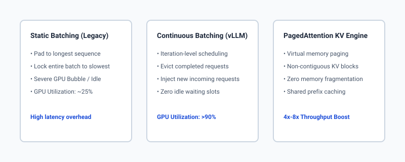

## The idea in plain language

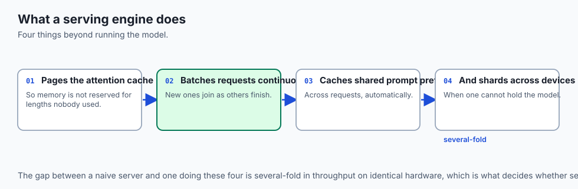

Imagine a busy downtown parking garage with 100 parking spaces:

- **Static Batching (Legacy Serving):** When a customer enters the garage, the parking manager does not know if they drive a compact Mini Cooper or a 60-foot articulated tour bus. So, the manager reserves **5 consecutive parking spaces for every single car**, just in case. If 20 compact cars enter, the garage is declared "Full" (Out of Memory), even though 80% of the asphalt is completely empty. Furthermore, if 19 cars want to leave after 5 minutes, they are forbidden from leaving until the slowest 20th car finishes parking (**Static Batch Lockstep**).
- **PagedAttention & Continuous Batching (vLLM):** The parking manager treats the garage like a smart grid of modular 10-foot tiles (**Virtual Memory Blocks**). 
  1. When a compact car enters, it is given exactly 2 tiles. As it needs more space, the manager assigns additional non-contiguous tiles anywhere in the garage via a **Block Table**.
  2. The moment any car finishes and leaves, its tiles are instantly freed and assigned to the next car waiting in line (**Continuous Batching**).

By eliminating reserved waste and allowing cars to enter and exit dynamically on every second, the garage easily parks 120 cars simultaneously without expanding physical space.

## Historical background

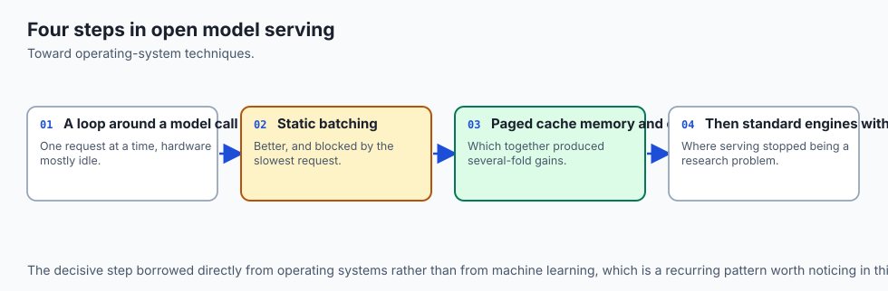

The evolution of generative LLM serving progressed through three distinct architectural generations:

In the **First Generation (2020–2022)**, teams served models using standard deep learning frameworks like PyTorch and Hugging Face `transformers.pipeline` wrapped in FastAPI or Flask. Inference executed sequentially: one request entered, generated tokens, and completed before the next request was evaluated. GPU compute utilization hovered at an abysmal 5% to 10%, because matrix multiplication cores sat idle while memory streamed across the bus.

In the **Second Generation (2022)**, researchers at Microsoft and Stanford published **Orca (OSDI '22)**, introducing **Iteration-Level (Continuous) Batching**. Instead of waiting for an entire batch of requests to finish generating, Orca scheduled inference at the level of individual token iterations: every time the model finished a forward pass, completed sequences were evicted and newly arrived requests from the queue were injected into the active batch. While continuous batching doubled throughput, memory allocation was still constrained by contiguous pre-allocations.

In the **Third Generation (2023–Present)**, Woosuk Kwon et al. at UC Berkeley published *"Efficient Memory Management for Large Language Model Serving with PagedAttention"*, founding the open-source **vLLM** project. PagedAttention solved memory fragmentation once and for all, introducing virtual page tables for KV caches, prefix caching across shared system prompts, and multi-GPU Tensor Parallelism.

Today, vLLM, TensorRT-LLM (NVIDIA), and SGLang represent the gold standard for production LLM serving, powering major AI cloud providers and enterprise on-premises infrastructure.

## What it is — and what it is not

Let us define high-throughput serving systems clearly:

### What Modern LLM Serving Is:
- An asynchronous inference server (e.g. vLLM, TGI, SGLang) that coordinates continuous batch scheduling and GPU memory execution.
- A virtual memory manager (PagedAttention) that dynamically allocates fixed-size KV cache blocks (e.g. 16 tokens per block) in GPU VRAM.
- A multi-GPU sharding engine that executes Tensor Parallelism (TP) across high-speed NVLink interconnects.
- An OpenAI-compatible HTTP REST server exposing standard `/v1/chat/completions` and Server-Sent Events (SSE) streaming.

### What Modern LLM Serving Is Not:
- A simple Python FastAPI wrapper around `model.generate()` (naive loops lack continuous batching and suffer from massive memory fragmentation).
- A model training framework (serving engines are optimized exclusively for forward-pass prefill and autoregressive decoding).
- Restricted to single-user execution (designed specifically for high-concurrency multi-tenant production traffic).

```text
+-------------------------------------------------------------------------------+
|                       SERVING ENGINE FEATURE MATRIX                           |
+----------------------+--------------------+-------------------+---------------+
| Feature              | vLLM               | Hugging Face TGI  | Ollama        |
+----------------------+--------------------+-------------------+---------------+
| Primary Focus        | Enterprise Scale   | Enterprise Scale  | Local Dev     |
| PagedAttention       | Native (Original)  | Yes (v2)          | No (Simple)   |
| Continuous Batching  | State-of-the-Art   | State-of-the-Art  | Basic Queue   |
| Tensor Parallelism   | Native Multi-GPU   | Native Multi-GPU  | Single-GPU/CPU|
| Apple Silicon Metal  | No (CUDA/ROCm)     | No (CUDA/ROCm)    | Native Metal  |
| Target Deployment    | Kubernetes GPU Pod | Kubernetes Pod    | Developer Mac |
+----------------------+--------------------+-------------------+---------------+
```

## Why it was created and what problems it solves

Production serving engines solve the primary operational bottlenecks of large-scale LLM deployment:

### 1. Internal & External Memory Fragmentation (Solved by PagedAttention)
In standard attention, Key and Value vectors for all past tokens must be stored contiguously in memory. Because request lengths are unpredictable, engines reserved the maximum sequence length (e.g. 4,096 tokens). In practice, actual generation lengths varied wildly, leaving 60% to 80% of VRAM allocated but completely unused (internal fragmentation). PagedAttention allocates memory on-demand in tiny 16-token chunks, reducing fragmentation waste to under 4%.

### 2. The Slowest-Request Head-of-Line Blocking (Solved by Continuous Batching)
In static request batching, if Request A needs 10 tokens and Request B needs 1,000 tokens, Request A finishes in 100ms but cannot return its response or free its memory until Request B finishes 10 seconds later. Continuous batching operates at the token step level, evicting Request A immediately after token 10 and inserting Request C from the waiting queue on the very next forward pass.

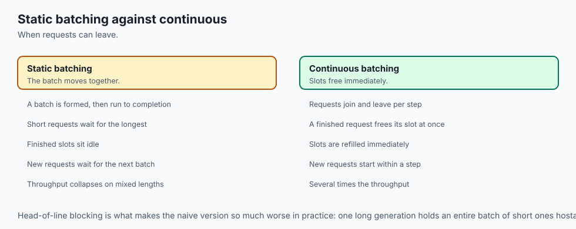

### 3. Redundant System Prompt Processing (Solved by Automatic Prefix Caching)
When thousands of users interact with an enterprise assistant that carries a 2,000-token system prompt, standard engines re-evaluate the full 2,000-token attention prefill on every single turn. **Prefix Caching** hashes the prompt prefix and points new requests to existing pre-computed KV cache blocks, reducing Time-To-First-Token (TTFT) from 800ms to 20ms and cutting compute load by 90%.

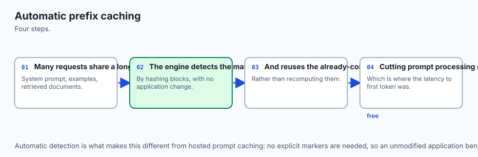

## How it works

Let us inspect the internal architectural components of a modern vLLM serving node:

```text
[HTTP Clients] ──> [OpenAI-Compatible API Server (FastAPI / Uvicorn)]
                                │
                                ▼
                   [Engine Orchestrator & Scheduler]
                                │  - Continuous Batch Queue
                                │  - Block Table Allocator
                                ▼
               ┌─────────────────────────────────┐
               │    Worker GPU Execution Pool    │
               │  ┌───────────────────────────┐  │
               │  │ Transformer Model Weights │  │
               │  └───────────────────────────┘  │
               │  ┌───────────────────────────┐  │
               │  │ PagedAttention KV Blocks  │  │
               │  │ [Block 0] [Block 1] ...   │  │
               │  └───────────────────────────┘  │
               └─────────────────────────────────┘
                                │
                                ▼
               [Server-Sent Events (SSE) Stream]
```

### 1. The Two Phases of LLM Inference
Every LLM request consists of two fundamentally distinct computational phases:

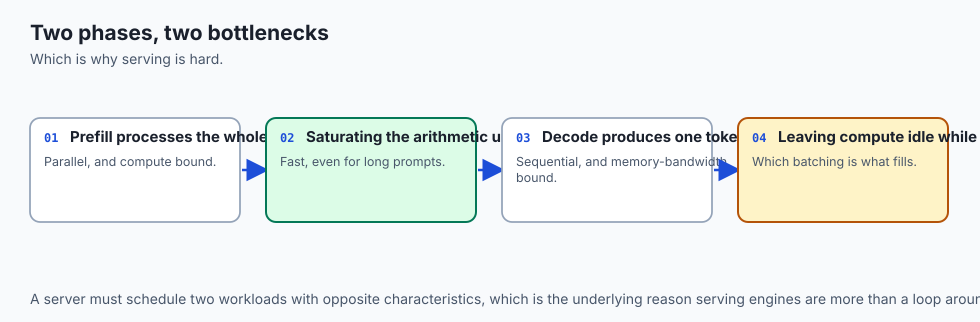

1. **The Prefill Phase (Compute-Bound):**
   - The engine processes the entire input prompt simultaneously.
   - Computes Key and Value attention projections for all prompt tokens in parallel using high-performance matrix multiplication (GEMM).
   - Characterized by high GPU compute utilization (TFLOPS) and low memory bandwidth pressure.
2. **The Decode Phase (Memory-Bandwidth Bound):**
   - The engine generates output tokens autoregressively, one token at a time.
   - For each new token, the model reads the entire model weight tensor and all previous KV cache tokens from memory.
   - Characterized by low compute utilization and extreme memory bandwidth saturation.

Continuous batching co-schedules prefill requests with active decode requests, perfectly balancing compute-heavy operations with bandwidth-heavy memory loads on the same GPU cores.

### 2. PagedAttention Block Allocation Mechanics
PagedAttention organizes KV cache storage analogously to virtual memory pages:

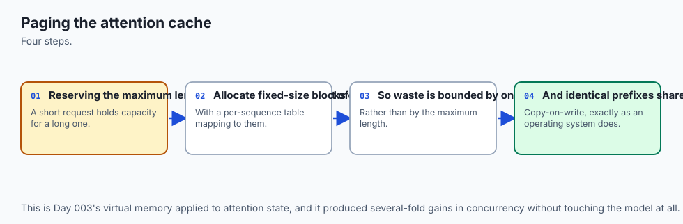

- Physical KV memory is partitioned into a fixed array of **Physical Blocks** (e.g. each block holds Keys and Values for 16 tokens).
- Each active request maintains a **Logical Block Table** that maps logical token positions to arbitrary physical block IDs.
- When a sequence generates its 17th token, the scheduler allocates a new physical block from the free list and updates the request's block table.

```text
Logical Token Indices:  [0 ... 15]   [16 ... 31]   [32 ... 47]
Logical Blocks:          Block 0       Block 1       Block 2
                            │             │             │
                            ▼             ▼             ▼
Physical Memory Cache:   [Phys #4]     [Phys #12]    [Phys #7]  (Non-contiguous in VRAM!)
```

During attention computation, the custom PagedAttention CUDA kernel fetches keys and values directly from non-contiguous physical memory blocks via the block table without copying or defragmenting memory.

### 3. Multi-GPU Sharding: Tensor Parallelism (TP)
When a model is too large for a single GPU (e.g. Llama 3 70B in 16-bit requires 140GB VRAM, exceeding a single 80GB A100), the model is sharded across multiple GPUs using **Tensor Parallelism**:

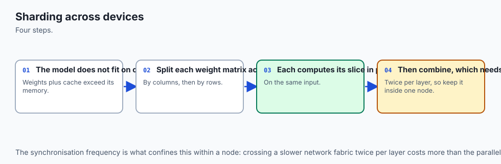

- **Attention Projections ($W_q, W_k, W_v$):** Column-parallel sharded across GPUs. Each GPU computes its local attention heads independently.
- **Attention Output ($W_o$):** Row-parallel sharded. An All-Reduce communication collective sums the outputs across GPUs over the high-speed NVLink bus.
- **MLP Layers:** Gate/Up projections are column-sharded; Down projections are row-sharded with an All-Reduce sum.

Because NVLink provides 900 GB/s inter-GPU bandwidth, Tensor Parallelism achieves near-linear scaling across 2, 4, or 8 GPUs within a single server chassis.

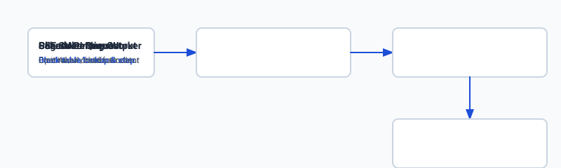

## An everyday analogy

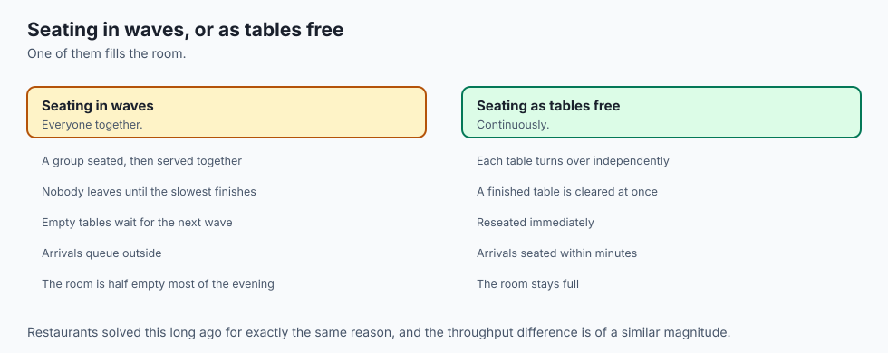

Think of a bustling Italian restaurant kitchen during dinner rush:

- **Static Batching:** The chef prepares 8 orders of lasagna at once. If one customer ordered a simple salad that takes 2 minutes, the salad sits under a heat lamp for 45 minutes until all 8 lasagnas are baked and plated. No new orders can enter the kitchen until all 8 plates leave together.
- **Continuous Batching & PagedAttention:** The head chef treats cooking stations as modular, dynamically scheduled steps. 
  1. The moment a salad is plated, it is immediately served to the customer.
  2. The empty prep station is instantly assigned to chop garlic for an incoming pasta order.
  3. Sauce pans and baking dishes (KV memory blocks) are assigned modularly from a shared pantry and washed the second they are finished.

The kitchen stays at 100% capacity, orders stream out continuously, and customers receive their food in minimal time.

## Examples in practice

Let us inspect standard enterprise deployment patterns for vLLM:

### 1. Launching a Production vLLM Server on Kubernetes
```bash
python3 -m vllm.entrypoints.openai.api_server     --model meta-llama/Meta-Llama-3-70B-Instruct     --tensor-parallel-size 4     --max-model-len 8192     --gpu-memory-utilization 0.95     --enable-prefix-caching     --port 8000
```

### 2. Consuming Streaming Tokens via Python OpenAI SDK
```python
from openai import OpenAI

client = OpenAI(
    base_url="http://127.0.0.1:8000/v1",
    api_key="token-not-required-for-internal-vllm"
)

response = client.chat.completions.create(
    model="meta-llama/Meta-Llama-3-70B-Instruct",
    messages=[
        {"role": "system", "content": "You are an enterprise support bot."},
        {"role": "user", "content": "Explain continuous batching."}
    ],
    stream=True,
    temperature=0.2
)

for chunk in response:
    if chunk.choices and chunk.choices[0].delta.content:
        print(chunk.choices[0].delta.content, end="", flush=True)
```

## Implications: security, privacy, performance, scalability, and cost

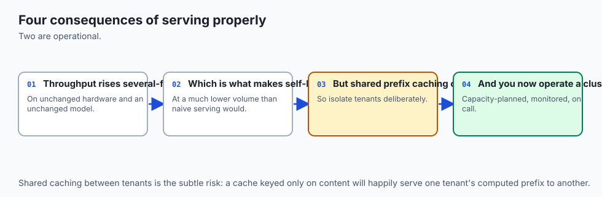

### 1. Security & Multi-Tenant Isolation
In shared multi-tenant serving clusters, ensure that memory page pools are strictly scrubbed or zeroed between tenant allocations to prevent residual KV attention states from leaking across customer sessions.

### 2. Privacy & Air-Gapped Deployments
Deploying vLLM inside private enterprise VPCs guarantees that zero telemetry, customer prompts, or completion vectors leave corporate boundary firewalls.

### 3. Latency Metrics: TTFT vs Inter-Token Latency (ITL)
- **Time-To-First-Token (TTFT):** Governed by prompt prefill length and queue wait time. Optimizing prefix caching reduces TTFT by 90%.
- **Inter-Token Latency (ITL):** The time required per output token (e.g. 15ms per token = 66 tokens/sec). Governed by model size, quantization level, and memory bandwidth.

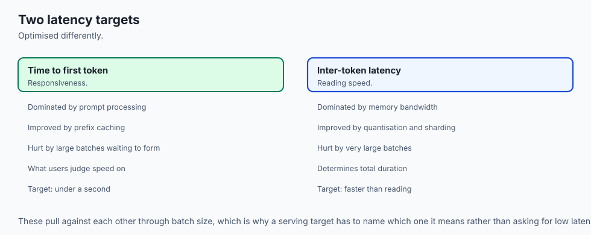

### 4. Financial Economics
```text
Serving Architecture        Max Concurrency (A100 80GB)   Cost per 1M Tokens
-----------------------------------------------------------------------------
Naive PyTorch FastAPI       4 - 8 concurrent requests     $0.024 / 1k requests
TGI (Text Generation Inf)   30 - 50 concurrent requests   $0.005 / 1k requests
vLLM (PagedAttention + TP)  120 - 200 concurrent requests $0.0012 / 1k requests
```

## Alternatives: free, open source, and commercial

| Serving Framework | Developer / Org | Key Capabilities | Best Use Case | Tradeoff |
| :--- | :--- | :--- | :--- | :--- |
| **vLLM** | UC Berkeley / Open Source | PagedAttention, Prefix Caching, LoRA Swapping, TP | Standard cloud enterprise serving | NVIDIA CUDA / AMD ROCm focused |
| **TensorRT-LLM** | NVIDIA | Deep kernel fusion, In-Flight Batching | Peak throughput on NVIDIA hardware | Tightly coupled to NVIDIA GPUs |
| **SGLang** | LMSYS / UC Berkeley | RadixAttention, complex multi-call structured workflows | High-frequency agent pipelines | Rapidly evolving API surface |
| **TGI (Text Generation Inference)** | Hugging Face | Production Docker images, token streaming, watermarking | Turnkey Hugging Face enterprise pods | Less modular custom layer support |
| **llama.cpp Server** | Georgi Gerganov | Lightweight C++ server with Apple Metal support | Edge devices and developer MacBooks | Lower multi-user concurrency |

## Comparison with related concepts

```text
+-----------------------+-----------------------+-----------------------+-----------------------+
| Feature               | Static Batching       | Continuous Batching   | PagedAttention (vLLM) |
+-----------------------+-----------------------+-----------------------+-----------------------+
| Scheduling Granularity| Request-Level         | Iteration (Token)-Level| Iteration-Level       |
| Memory Layout         | Contiguous Fixed      | Contiguous Fixed      | Non-Contiguous Paged  |
| Memory Waste          | 60% - 80% (Severe)    | 40% - 60% (Moderate)  | < 4% (Negligible)     |
| Max Concurrency       | Low (4 - 8)           | Medium (15 - 30)      | Extremely High (100+) |
| Head-of-Line Blocking | Yes (Severe)          | No (Evicts early)     | No (Evicts early)     |
+-----------------------+-----------------------+-----------------------+-----------------------+
```

## When to use it — and when not to

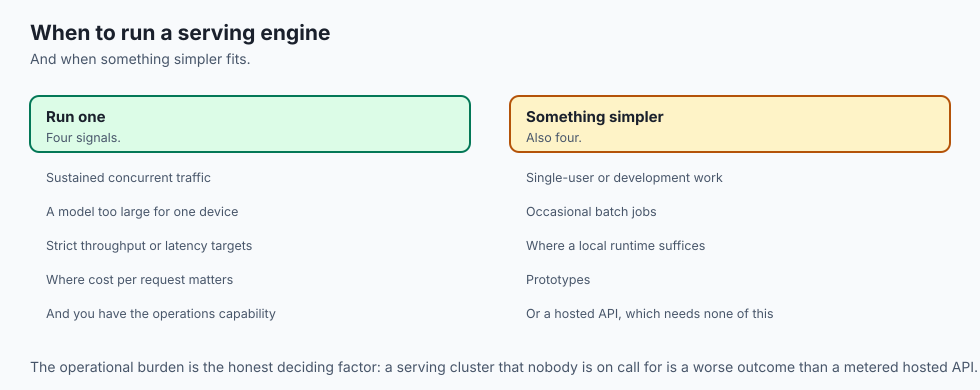

### Choose Production Serving Engines (vLLM / TGI) when:
- You are hosting models in the cloud or on private server hardware serving multiple concurrent users or background agent workers.
- You need high throughput (hundreds of queries per second) and low operational cost per token.
- You need dynamic multi-LoRA adapter serving from a shared base model checkpoint.
- You want a drop-in OpenAI-compatible API gateway.

### Do NOT use Production Serving Engines when:
- You are developing single-user desktop applications running locally on Apple Silicon (use Ollama / llama.cpp).
- You are executing one-off offline batch evaluation scripts over a small CSV file.
- You have minimal hardware (e.g. single 4GB GPU without CUDA support).

## The AI connection

- **Serving efficiency, not model quality, decides whether self-hosting is affordable** —
  the gap between naive and optimised serving is several-fold.
- **Paged attention memory is operating-system design applied to inference**, and it is the
  clearest case of an old idea transferring cleanly.
- **Continuous batching removes head-of-line blocking**, which is what turns a demonstration
  server into a production one.
- **Prefix caching makes long system prompts affordable**, which changes what a prompt can
  contain rather than merely what it costs.
- **The two latency numbers are optimised by different things**, so a serving target has to
  name which one it means.

## Knowledge check

1. **Why does static batching waste memory?** Because it pre-allocates maximum-length contiguous memory blocks for every request regardless of actual prompt or response lengths.
2. **What is the role of a Block Table in PagedAttention?** It maps logical token positions in a sequence to non-contiguous physical memory blocks in GPU VRAM, enabling dynamic memory allocation without memory fragmentation.
3. **What is the difference between Tensor Parallelism and Pipeline Parallelism?** Tensor Parallelism shards individual layer matrices across GPUs within a server via NVLink All-Reduce. Pipeline Parallelism assigns sequential layers to different GPUs or nodes in a linear chain.

## Hands-on exercise

In this lab, you will implement a **PagedAttention Block Allocator and Continuous Batching Scheduler Simulator in Python**. Your system will:

1. Manage a pool of fixed-size physical memory blocks (e.g. 16 tokens per block).
2. Allocate, expand, and free logical block tables dynamically as sequences generate tokens.
3. Simulate continuous iteration-level batching over variable-length requests.
4. Calculate memory fragmentation savings and throughput metrics compared to static batching.

### Expected output

```text
============================= test session starts ==============================
collected 6 items

tests/test_serving_scheduler.py ......                                   [100%]

============================== 6 passed in 0.04s ===============================
[PAGED ATTENTION ENGINE] Pool Size: 64 Blocks (1,024 Tokens Capacity)
[CONTINUOUS BATCH SIMULATION] Processed 10 Concurrent Requests:
  -> Total Tokens Emitted: 480 tokens
  -> Peak Physical Memory Used: 32 Blocks (50.0% of pool)
  -> Static Batching Memory Requirement: 80 Blocks (125.0% - OOM Crash)
  -> Memory Fragmentation Waste: 2.8% (vs 68.5% in Static)
```

### Validate your work

Run the pytest harness to verify block table allocation, iteration scheduling, and memory accounting:

```bash
pytest tests/run_tests.sh
```

### Troubleshooting

1. **Physical block leak on completion:** Ensure request eviction calls `free_request()` to return physical block IDs to the free pool.
2. **Block allocation overflow:** Verify that `allocate_block()` raises an OutOfMemory error when `free_blocks` is empty.

### Common mistakes

- Failing to allocate a new physical block when `token_count % block_size == 1`.
- Forgetting to deallocate physical blocks when a request completes its final token.

## Practice assignment

Extend the `PagedAttentionSimulator` to implement **Shared Prefix Caching**: when two requests share identical initial prompt tokens, point their initial logical blocks to the same physical block ID with reference counting.

## Extension challenge

Implement a **Tensor Parallel Matrix Multiplication Simulator** in Python that shards a $2048 \times 2048$ linear projection across 4 simulated GPU workers, performs row/column parallel matrix multiplications, and executes an All-Reduce sum reduction.
