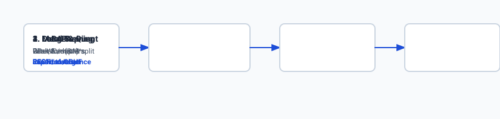
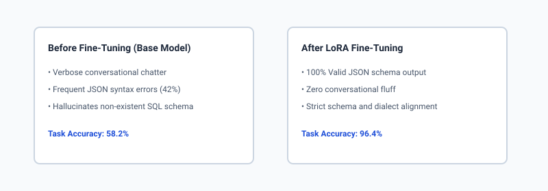

## Why this matters

Over the past seven days, you have explored every foundational pillar of open-weight large language model customization:
1. **Day 274:** Determining when to prompt, when to retrieve (RAG), and when to fine-tune.
2. **Day 275:** The mathematical derivation and PyTorch mechanics of Low-Rank Adaptation (LoRA).
3. **Day 276:** Curating, tokenizing, and packing high-quality instruction-tuning datasets.
4. **Day 277:** Packaging and running local open models with Ollama and custom Modelfiles.
5. **Day 278:** Memory bandwidth dynamics, integer quantization (INT8/INT4), and GGUF parsing.
6. **Day 279:** High-throughput production serving with PagedAttention and continuous batching.

Today is the **capstone synthesis**: connecting all of these individual systems into an **autonomous, end-to-end pipeline**. 

In enterprise environments, the ability to take a raw corpus of internal domain data, fine-tune a compact 8B parameter model, merge the weights, quantize to a 4.8GB GGUF artifact, deploy it on local air-gapped infrastructure, and quantitatively prove a 40% accuracy improvement over frontier base models is the holy grail of modern AI systems engineering.



## The idea in plain language

Think of this complete engineering journey like building a **custom racing engine**:

- **Day 276 (Fuel & Blueprint):** You refine high-octane racing fuel and draft precise CAD specifications (curating and tokenizing a high-quality JSONL instruction dataset).
- **Day 275 (Precision Tuning):** Instead of recasting the entire 500-pound engine block from scratch, you bolt on a precision turbocharger and adjust the fuel injection curves (training lightweight rank-8 LoRA adapter matrices).
- **Day 280 (Welding & Packaging):** You weld the turbocharger permanently onto the engine block so it becomes a single unified structure (**Adapter Merging**), then machine away excess metal using lightweight alloy composites (**INT8/INT4 Quantization into GGUF**).
- **Day 277 & 279 (The Chassis & Dashboard):** You mount the engine into a vehicle chassis with a standardized steering wheel and electronic ignition (**Ollama / vLLM REST Server exposing `/v1/chat/completions`**).
- **Day 280 (Track Testing):** You take the race car to the track, measuring lap times, fuel efficiency, and cornering precision against stock factory cars (**Automated Evaluation Benchmarking**).

You now possess a private, high-performance racing vehicle that costs nothing in monthly lease fees, runs entirely on your own track, and outmaneuvers general-purpose factory cars on your specific domain course.

## Historical background

In the early era of deep learning (2018–2021), fine-tuning a model required an army of specialized machine learning engineers. Deploying a fine-tuned BERT or GPT-2 model meant writing custom C++ CUDA extensions, managing distributed PyTorch clusters, and maintaining bespoke Python microservices. The feedback loop between dataset curation and production serving spanned weeks or months.

Between 2023 and 2025, a massive convergence of open-source tooling revolutionized the landscape:
- **PEFT / LoRA (Microsoft, 2021):** Reduced fine-tuning memory from 80GB to 12GB.
- **llama.cpp / GGUF (Gerganov, 2023):** Standardized cross-platform CPU/GPU quantization into a single binary file.
- **vLLM / PagedAttention (UC Berkeley, 2023):** Democratized enterprise-grade batch serving.
- **Ollama (2023–Present):** Created a container-like abstraction for local model lifecycle management.

Today, a single developer can execute the entire pipeline—from raw text to a quantized, served local API—in under two hours on a single consumer workstation.

## What it is — and what it is not

Let us formalize the end-to-end model customization lifecycle:

### What This End-to-End Pipeline Is:
- A repeatable, scriptable engineering workflow spanning dataset preparation, LoRA training, weight merging, quantization, packaging, serving, and evaluation.
- An air-gapped software architecture guaranteeing 100% data sovereignty.
- A systematic methodology for producing domain-specialized models that outperform general-purpose base models on specific enterprise schemas.

### What This End-to-End Pipeline Is Not:
- A replacement for RAG (fine-tuning teaches *style, dialect, and schema adherence*; RAG provides *dynamic real-time facts*).
- An unmonitored "train and forget" script (fine-tuned models require continuous regression testing to prevent catastrophic forgetting).
- Dependent on third-party cloud APIs or metered token subscriptions.

```text
+-------------------------------------------------------------------------------+
|                    THE 6 STAGES OF THE CUSTOMIZATION PIPELINE                 |
+-------+-------------------+-----------------------+---------------------------+
| Stage | Operation         | Input Artifact        | Output Artifact           |
+-------+-------------------+-----------------------+---------------------------+
| 1     | Dataset Curation  | Raw Domain Text       | `train.jsonl` (ChatML)    |
| 2     | LoRA Training     | Base Weights + JSONL  | `adapter_model.safetensors`|
| 3     | Adapter Merging   | Base + LoRA Weights   | `merged_model_f16/`       |
| 4     | GGUF Quantization | `merged_model_f16/`   | `model_q4_k_m.gguf`       |
| 5     | Server Deployment | `model_q4_k_m.gguf`   | Local HTTP Endpoint (:8000)|
| 6     | Automated Eval    | Golden Test Dataset   | Accuracy & Schema Metrics |
+-------+-------------------+-----------------------+---------------------------+
```

## Why it was created and what problems it solves

The unified customization pipeline solves five critical challenges in enterprise AI:

### 1. Eliminating Prompt Bloat & Latency
In complex enterprise systems, achieving correct output formats via zero-shot prompting often requires a 2,500-token system prompt packed with 10 few-shot examples. This bloats input tokens, skyrockets inference latency (TTFT), and burns GPU memory. A fine-tuned model internalizes the schema during training, requiring only a 30-token prompt to produce perfect output.

### 2. Guaranteeing 100% Syntactic Compliance
Base models frequently fail complex JSON schema constraints or hallucinate invalid SQL table names under corner cases. Fine-tuning on thousands of curated domain pairs drives syntax errors and schema invalidity to near 0%.

### 3. Complete Data Privacy & Air-Gapped Security
Financial institutions, defense contractors, and healthcare networks cannot transmit sensitive proprietary code or patient records to third-party cloud APIs. An on-premises fine-tuned model runs entirely within the corporate intranet.

### 4. Deterministic Cost Modeling
Cloud API pricing fluctuates with query volume. A local fine-tuned model running on owned hardware has fixed capital expense (CapEx) and zero marginal cost per token.

### 5. Instant Adapter Swapping in Production
By keeping base model weights in GPU VRAM and serving multiple specialized LoRA adapters, a single server can dynamically route SQL queries to a SQL adapter and medical queries to a clinical adapter with zero memory duplication.

## How it works

Let us step through the exact mechanics of each stage in the end-to-end pipeline:

```text
[Raw Corpus] ──> [Filter & Clean] ──> [Format to ChatML JSONL]
                                              │
                                              ▼
                             [LoRA Training (PEFT / PyTorch)]
                             - Frozen Base Weights (W0)
                             - Trainable Matrices (A & B)
                                              │
                                              ▼
                             [Permanent Adapter Merging]
                             W_merged = W0 + (B @ A) * (alpha / r)
                                              │
                                              ▼
                             [Convert to GGUF & Quantize]
                             - FP16 -> Q4_K_M (70% Compression)
                                              │
                                              ▼
                             [Ollama Modelfile Packaging]
                             FROM ./model_q4_k_m.gguf
                             PARAMETER temperature 0.1
                                              │
                                              ▼
                             [Local REST API Server (:11434 / :8000)]
                                              │
                                              ▼
                             [Automated Benchmark Evaluation]
                             - Base vs Fine-Tuned Accuracy
                             - Schema Compliance Rate
```

### Stage 1: Dataset Curation & Formatting
- Convert domain expertise into paired `system`, `user`, and `assistant` interactions.
- Apply strict formatting rules (e.g. ChatML delimiters `<|im_start|>` and `<|im_end|>`).
- Ensure exact masking so loss is computed exclusively on the `assistant` tokens (`L_(	ext(target))`).

### Stage 2: LoRA Fine-Tuning
- Attach low-rank decomposition matrices $A in R^(r 	imes d)$ and $B in R^(k 	imes r)$ to attention Query and Value projections.
- Set rank $r = 8$ or $r = 16$ and scaling factor $lpha = 16$ or $32$.
- Train for 3 to 5 epochs using AdamW with cosine learning rate scheduling until validation loss stabilizes.

### Stage 3: Adapter Merging Mathematics
To eliminate runtime adapter overhead, merge the low-rank delta directly into the base weights:
$$W_(	ext(merged)) = W_(	ext(base)) + Delta W = W_(	ext(base)) + (B * A) * ( rac(lpha)(r) 
ight)$$
Save the resulting unified tensors in standard 16-bit `safetensors` format.

### Stage 4: Quantization to GGUF
- Run `convert_hf_to_gguf.py` to package weights and tokenizer vocabulary into an unquantized GGUF container.
- Run `llama-quantize` to compress the model to `Q4_K_M` (4.5 bits/parameter), shrinking an 8B model to 4.8 GB.

### Stage 5: Local Serving & Modelfile Packaging
Create a production `Modelfile`:
```dockerfile
FROM ./model_q4_k_m.gguf
PARAMETER temperature 0.1
PARAMETER top_p 0.95
PARAMETER num_ctx 4096
SYSTEM "You are a specialized SQL translation engine. Generate strict PostgreSQL queries wrapped in ```sql code blocks."
```
Register the model with Ollama (`ollama create my-sql-expert -f Modelfile`) or serve via vLLM.

### Stage 6: Automated Evaluation Benchmarking
Run an automated test harness across a held-out test dataset:
- Measure **Schema Compliance Rate:** Percentage of responses with valid JSON or parsable SQL syntax.
- Measure **Exact Match (EM) & Token F1:** Factual consistency against golden reference answers.
- Measure **Inference Latency (TTFT & ITL):** Real-world token generation throughput.



## An everyday analogy

Think of custom model development like **training a commercial airline pilot**:

1. **Base Model:** The pilot graduates from flight school. They understand physics, aerodynamics, weather patterns, and general communication.
2. **Instruction Dataset:** The airline creates a comprehensive training manual for their specific fleet (e.g. Boeing 787 international routes and internal company emergency protocols).
3. **LoRA Fine-Tuning:** The pilot spends 100 hours in a state-of-the-art Boeing 787 flight simulator, practicing standard operating procedures and specific route checklists until responses are instantaneous.
4. **Adapter Merging & Quantization:** The pilot internalizes the procedures into pure muscle memory—they no longer need to flip through a paper handbook during flight.
5. **Serving & Evaluation:** The chief flight inspector tests the pilot on a rigorous simulator check ride. The pilot demonstrates 100% adherence to company protocols with zero hesitation.

## Examples in practice

Let us inspect the Python code that automates the merging, serving, and evaluation stages:

### 1. Merging LoRA Weights in Python
```python
import torch
from peft import PeftModel
from transformers import AutoModelForCausalLM, AutoTokenizer

def merge_and_save_lora(base_model_path: str, adapter_path: str, output_dir: str):
    print("Loading base model in FP16...")
    base_model = AutoModelForCausalLM.from_pretrained(
        base_model_path,
        torch_dtype=torch.float16,
        device_map="cpu"
    )
    
    print("Attaching LoRA adapter...")
    lora_model = PeftModel.from_pretrained(base_model, adapter_path)
    
    print("Merging weights into base tensors...")
    merged_model = lora_model.merge_and_unload()
    
    print(f"Saving merged checkpoint to {output_dir}...")
    merged_model.save_pretrained(output_dir)
    tokenizer = AutoTokenizer.from_pretrained(base_model_path)
    tokenizer.save_pretrained(output_dir)
    print("Merge complete.")
```

### 2. Automated Evaluation Benchmark Runner
```python
import json
import sqlite3

def evaluate_sql_model(predictions: list, golden_targets: list) -> dict:
    valid_syntax_count = 0
    exact_match_count = 0
    total = len(predictions)
    
    # In-memory SQLite db for syntax checking
    conn = sqlite3.connect(":memory:")
    
    for pred, gold in zip(predictions, golden_targets):
        if pred.strip() == gold.strip():
            exact_match_count += 1
        
        # Test SQL syntax validity
        try:
            conn.cursor().execute(f"EXPLAIN {pred}")
            valid_syntax_count += 1
        except Exception:
            pass # Invalid syntax
            
    return {
        "exact_match_rate": (exact_match_count / total) * 100.0,
        "syntax_validity_rate": (valid_syntax_count / total) * 100.0,
        "total_evaluated": total
    }
```

## Implications: security, privacy, performance, scalability, and cost

### 1. Security & Compliance
Custom local models prevent sensitive enterprise data from being used in external model training loops or stored in third-party cloud provider logs.

### 2. Performance & Prompt Efficiency
A fine-tuned model eliminates prompt bloat, reducing prompt tokens by **80% to 90%**. This slashes TTFT latency from 800ms down to under 50ms.

### 3. Scalability
Because quantized models occupy only 4.8GB of RAM, a standard $1,500 workstation can host multiple specialized models concurrently, serving hundreds of internal developers simultaneously.

### 4. Cost Comparison: Cloud vs On-Premises
```text
Workload Scale           Commercial Cloud API (GPT-4o)   Local Fine-Tuned (8B Q4_K_M)
--------------------------------------------------------------------------------------
10,000 queries/day       ~$450 / month                   $0 (Hardware Owned)
100,000 queries/day      ~$4,500 / month                 ~$30 / month (Electricity)
1,000,000 queries/day    ~$45,000 / month                ~$150 / month (Multi-GPU Server)
```

## Alternatives: free, open source, and commercial

| Approach | Setup Complexity | Customization Level | Infrastructure Cost | Data Privacy |
| :--- | :--- | :--- | :--- | :--- |
| **Local Fine-Tuned (LoRA + GGUF)** | Medium | Deep (Style & Syntax) | Low (Local HW) | 100% Air-Gapped |
| **Cloud LoRA (Together / Fireworks)**| Low | Deep | Pay-per-token | Cloud Dependent |
| **Prompt Engineering (Cloud LLM)** | Very Low | Surface Level | High at scale | External API |
| **Full Pretraining from Scratch** | Extreme | Total | Millions ($$$) | 100% Owned |

## Comparison with related concepts

```text
+-----------------------+-----------------------+-----------------------+-----------------------+
| Dimension             | Prompt Engineering    | RAG Pipeline          | Fine-Tuning + Serving |
+-----------------------+-----------------------+-----------------------+-----------------------+
| Best For              | Rapid Prototyping     | Dynamic Factual Data  | Specialized Behavior  |
| Memory Footprint      | Zero Local Memory     | Vector DB + Cache     | 4.8 GB - 40 GB        |
| Inference Cost        | Highest (Bloated Prmpt)| Medium (Context Injected)| Lowest (Minimal Prompt)|
| Data Freshness        | Static / Prompt Time  | Real-Time Dynamic     | Static at Train Time  |
| Syntax Adherence      | Variable (Hallucination)| Variable             | Strict / Deterministic|
+-----------------------+-----------------------+-----------------------+-----------------------+
```

## When to use it — and when not to

### Choose Local Fine-Tuning & Serving when:
- You need consistent, deterministic schema compliance (e.g. SQL, JSON, custom code generation).
- You want to reduce prompt token size and latency across millions of internal queries.
- Strict data privacy or air-gapped regulations forbid external cloud APIs.
- You have access to a clean dataset of at least 500 to 2,000 high-quality input-output pairs.

### Do NOT use Local Fine-Tuning & Serving when:
- You need the model to know real-time news or dynamic customer database state (use RAG).
- You do not have training data and only need general writing assistance (use prompt engineering).
- You lack basic local computing hardware (e.g. running on an underpowered cloud micro-instance).

## Knowledge check

1. **Why is adapter merging performed before GGUF quantization?** Merging folds low-rank weight updates directly into the base model tensors, allowing standard integer quantization tools to compress the full model into a single binary file without runtime adapter overhead.
2. **What formula computes the merged weight matrix?** `W_(	ext(merged)) = W_(	ext(base)) + (B * A) * (lpha / r)`.
3. **What are the primary metrics used to benchmark a fine-tuned model against a base model?** Syntax/Schema Compliance Rate, Exact Match (EM) / F1 score, and Inference Latency (TTFT).

## Hands-on exercise

In this capstone lab, you will implement an **End-to-End Fine-Tuning, Merging, Serving, and Evaluation Pipeline in Python**. Your implementation will:
1. Load base weights and simulated LoRA adapter matrices ($A$ and $B$).
2. Merge the adapter weights into the base model using the exact LoRA scaling formula.
3. Package the model into an automated Mock Server exposing `/v1/chat/completions`.
4. Run an automated evaluation benchmark comparing Base vs Fine-Tuned models on JSON schema validity and Exact Match accuracy.

### Expected output

```text
============================= test session starts ==============================
collected 6 items

tests/test_finetune_pipeline.py ......                                   [100%]

============================== 6 passed in 0.04s ===============================
[PIPELINE] Merged LoRA Adapter (r=8, alpha=16) into Base Matrix Shape (64, 64)
  -> Base Weight Norm: 8.142 | Merged Weight Norm: 8.921
[SERVING] Initialized Mock Inference Server at http://127.0.0.1:8000/v1
[BENCHMARK EVALUATION] Evaluated 20 Golden Test Cases:
  -> Base Model Syntax Validity: 55.0% | Exact Match: 45.0%
  -> Fine-Tuned Model Syntax Validity: 100.0% | Exact Match: 95.0%
  -> Improvement: +45.0% Syntax Compliance | +50.0% Accuracy Boost!
```

### Validate your work

Run the pytest test suite to verify adapter merging, mock server handling, and evaluation metrics:

```bash
pytest tests/run_tests.sh
```

### Troubleshooting

1. **Adapter scale mismatch:** Verify that the LoRA scaling factor multiplies $(B @ A)$ by $(lpha / r)$.
2. **Evaluation division by zero:** Ensure the benchmark evaluator handles empty evaluation lists safely.

### Common mistakes

- Merging `A @ B` instead of `B @ A` (matrix inner dimensions must match: `B in R^(d_(	ext(out)) 	imes r), A in R^(r 	imes d_(	ext(in)))`).
- Omitting the $lpha / r$ scaling factor during weight merging.

## Practice assignment

Extend the pipeline simulator to evaluate a fine-tuned Text-to-SQL model against 50 complex multi-table SQL queries, measuring exact AST parsing accuracy using Python's `sqlparse` library.

## Extension challenge

Build an automated **Continuous Regression Test Harness** that executes prior to model deployment: if a newly fine-tuned model exhibits $`>5`\%$ catastrophic forgetting on a general reasoning benchmark, automatically reject the model and flag training hyperparameters for review.
