## Why this matters

For decades, generative image modeling was dominated by Generative Adversarial Networks (GANs) and Variational Autoencoders (VAEs). While GANs could produce sharp images in a single forward pass, training them was notoriously unstable—minimax game dynamics frequently collapsed into mode collapse, where the generator learned only a handful of repetitive patterns.

In 2020, **Jonathan Ho et al. published Denoising Diffusion Probabilistic Models (DDPM)**, completely overturning computer vision. Diffusion models reframed image generation not as a one-shot guess, but as a **gradual thermodynamic process**:

1. Take a clean image and systematically destroy its structure by adding tiny amounts of Gaussian noise over 1,000 discrete timesteps until it becomes pure, unrecognizable static (**Forward Diffusion**).
2. Train a deep neural network (a U-Net or Diffusion Transformer) to look at a noisy image at timestep $t$ and predict the exact noise vector that was added.
3. Start from pure random white noise and iteratively subtract predicted noise step-by-step to reveal a photorealistic image from the void (**Reverse Diffusion**).

Today, diffusion models power the entire state of the art in generative media—including Stable Diffusion, Midjourney, DALL-E 3, Sora, and Flux.

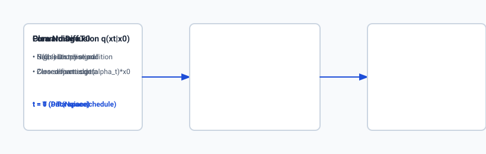

## The idea in plain language

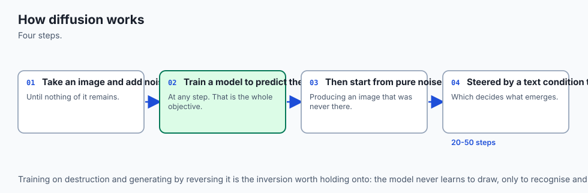

Imagine you are a sculptor carving an intricate marble statue of a lion:

- **Forward Diffusion (The Sandstorm):** You take the pristine marble lion outside. Every minute, a gentle sandstorm blows a fine layer of dust onto the statue. After 10 minutes, fine details like whiskers blur. After 100 minutes, the lion becomes a rough mound of rock. After 1,000 minutes, the statue is completely buried under a uniform, featureless sand dune (**Pure Gaussian Noise**).
- **Reverse Diffusion (The Master Sculptor):** You train a master sculptor by showing them photographs of the statue at every minute of the storm. The sculptor learns: *"Given this mound of sand and knowing it is minute 450, exactly which grains of sand must be brushed away to restore the underlying shape?"*
- **Generative Sampling:** When you want a brand-new lion, you dump a fresh pile of sand on the studio floor (**Sample Random Noise**). The sculptor looks at the pile, estimates the noise, brushes away a small layer, and repeats the process 50 times. Step-by-step, an immaculate marble lion emerges from pure static.

## Historical background

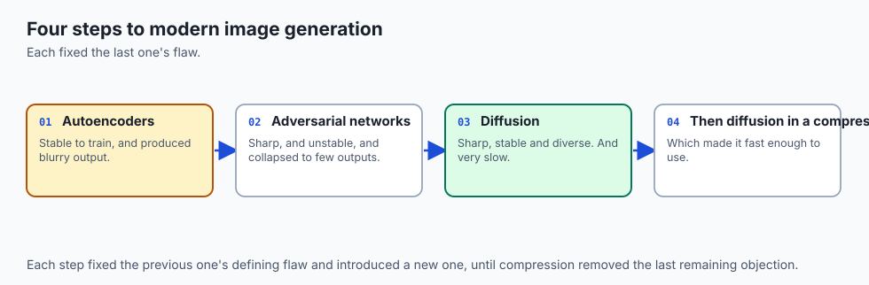

The theoretical foundation of diffusion models originated in non-equilibrium thermodynamics. In 2015, **Jascha Sohl-Dickstein et al.** introduced the concept of using Markov chains to slowly destroy structure in a data distribution and learning the reverse transitions. However, early thermodynamic models were computationally heavy and produced low-resolution samples.

In 2020, **Jonathan Ho, Ajay Jain, and Pieter Abbeel** revolutionized the field with DDPM. By establishing an exact mathematical equivalence between diffusion models and **denoising score matching** (Langevin dynamics), they proved that training the neural network to predict the injected noise $\epsilon$ using simple Mean Squared Error (MSE) loss produced breathtaking image fidelity that rivaled GANs without any training instability.

In 2021, **Robin Rombach et al.** introduced **Latent Diffusion Models (LDMs)**, the architecture behind **Stable Diffusion**. By training a Variational Autoencoder (VAE) to compress images into a low-dimensional latent space, diffusion was shifted from expensive pixel space ($512 \times 512 \times 3$) to compressed latent space ($64 \times 64 \times 4$), slashing compute requirements by $64\times$ and allowing state-of-the-art generation on consumer GPUs.

In 2023–2024, **Diffusion Transformers (DiT)** replaced convolutional U-Nets with scalable Vision Transformer backbones, powering next-generation models like Stable Diffusion 3 and Flux.

## What it is — and what it is not

Let us formalize the technical boundaries of diffusion models:

### What Diffusion Models Are:
- Likelihood-based generative models parameterized by a forward noising Markov process and a learned reverse denoising Markov process.
- Iterative samplers that generate images by computing multiple neural network forward passes (e.g. 20 to 50 steps using fast numerical solvers like DDIM or Euler).
- Conditioned on text embeddings (via cross-attention) or class labels to enable controllable synthesis.

### What Diffusion Models Are Not:
- Single-step feed-forward generators (unlike standard GANs or VAEs, standard diffusion requires multiple denoising iterations).
- Autoregressive next-token predictors (unlike LLMs which generate pixels sequentially from left to right, diffusion denoises all spatial pixels simultaneously).
- Purely pixel-level processors (modern systems operate in compressed autoencoder latent spaces).

```text
+-------------------------------------------------------------------------------+
|                    GENERATIVE IMAGE PARADIGM COMPARISON                       |
+---------------------+--------------------+--------------------+---------------+
| Dimension           | GANs               | VAEs               | Diffusion     |
+---------------------+--------------------+--------------------+---------------+
| Generation Speed    | 1 Step (Instant)   | 1 Step (Instant)   | 20 - 50 Steps |
| Training Stability  | Very Fragile (Minimax)| Stable (ELBO)   | Rock Solid    |
| Sample Diversity    | Poor (Mode Collapse)| High               | State-of-Art  |
| Visual Sharpness    | Very High          | Low (Blurry)       | Pristine      |
| Text Controllability| Difficult          | Moderate           | Flawless      |
+---------------------+--------------------+--------------------+---------------+
```

## Why it was created and what problems it solves

Diffusion architectures solve the core mathematical limitations of prior generative vision paradigms:

### 1. Eliminating Adversarial Mode Collapse (Solved vs GANs)
GANs require training two competing networks (Generator vs Discriminator). If the Discriminator overpowers the Generator, gradients vanish; if the Generator finds a single image that fools the Discriminator, it produces that identical image forever (mode collapse). Diffusion models optimize a stationary, convex Mean Squared Error loss over noise estimation, completely eliminating adversarial instability.

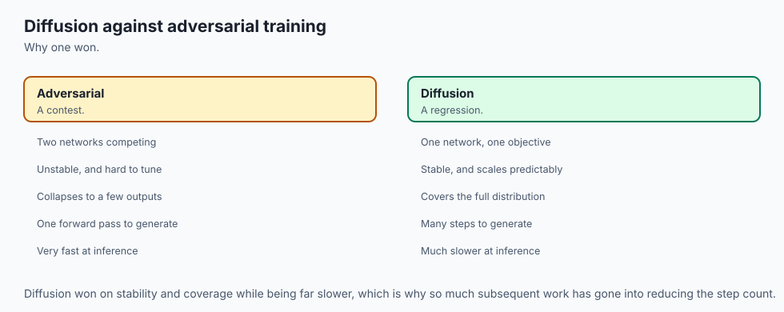

### 2. Eliminating Visual Blur (Solved vs VAEs)
Standard VAEs optimize pixel reconstruction via Mean Squared Error in image space, forcing the model to average over ambiguous high-frequency details, resulting in blurry edges. Diffusion models predict noise distributions iteratively, allowing high-frequency textures (hair, pores, fabric weave) to resolve crisply across timesteps.

### 3. Deep Text Conditioning via Cross-Attention
Because diffusion operates over multi-step refinement, textual conditioning embeddings (from CLIP or T5 encoders) can inject guidance into cross-attention layers at every single denoising step, enabling unprecedented text-to-image prompt fidelity.

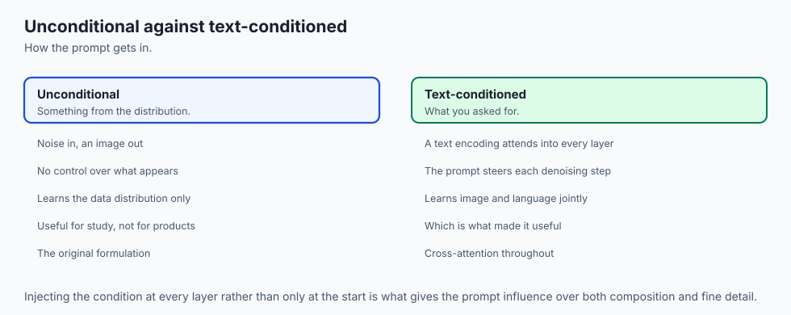

## How it works

Let us derive the mathematics governing the forward and reverse diffusion processes:

```text
[Clean Image x0]
       │
       ├───> Forward Noise Schedule: q(xt | x0) = N(xt; sqrt(alpha_bar_t)*x0, (1 - alpha_bar_t)*I)
       │
       ▼
[Noisy Image xt at Timestep t]
       │
       ├───> Input to U-Net / DiT + Timestep Embedding t + Text Conditioning c
       │
       ▼
[Predicted Noise epsilon_theta(xt, t, c)]
       │
       ▼
[Compute Loss]: L_simple = || epsilon - epsilon_theta(xt, t, c) ||^2
```

### 1. The Closed-Form Forward Process $q(x_t | x_0)$
In the forward process, small Gaussian noise with variance $\beta_t \in (0, 1)$ is added at each step:
`q(x_t | x_(t-1)) = mathcal(N)(x_t; sqrt(1 - \beta_t) x_(t-1), \beta_t I)`

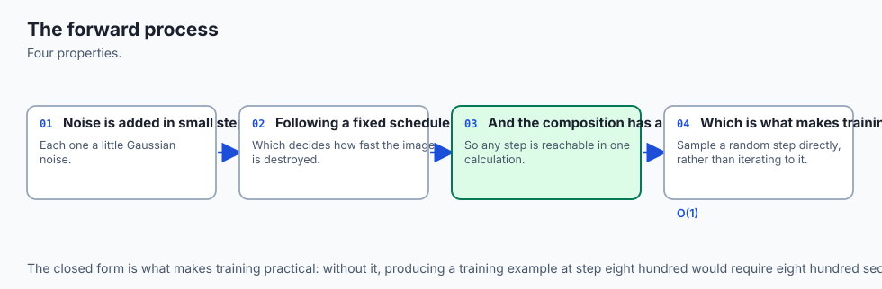

Let $\alpha_t = 1 - \beta_t$ and `\bar(\alpha)_t = prod_(i=1)^t \alpha_i`. Using the property that the sum of independent Gaussians is Gaussian, we can express $x_t$ directly as a function of the original image $x_0$:
`x_t = sqrt(\bar(\alpha)_t) x_0 + sqrt(1 - \bar(\alpha)_t) epsilon, quad \text(where ) epsilon sim mathcal(N)(0, I)`

This closed-form formulation is monumental for training: we can sample an arbitrary timestep $t \in [1, 1000]$, compute `\bar(\alpha)_t`, and noise the image in a single vector operation without stepping through $t-1$ intermediate states!

### 2. The Training Objective (`L_(\text(simple))`)
During training:

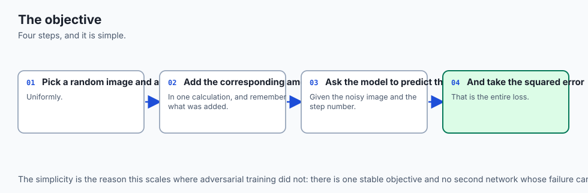

1. Sample a clean image $x_0 \sim q(x_0)$.
2. Sample a random timestep `t sim \text(Uniform)(1, T)`.
3. Sample random Gaussian noise `epsilon sim mathcal(N)(0, I)`.
4. Construct noisy latent `x_t = sqrt(\bar(\alpha)_t) x_0 + sqrt(1 - \bar(\alpha)_t) epsilon`.
5. Compute the model's noise prediction: `hat(epsilon) = epsilon_\theta(x_t, t)`.
6. Optimize the simple Mean Squared Error:
$$L_(\text(simple))(\theta) = \mathbb(E)_(t, x_0, \epsilon) \left[ \| \epsilon - \epsilon_\theta(x_t, t) \|^2 
ight]$$

### 3. The Reverse Sampling Algorithm (DDPM Sampling)
During inference, we start from pure noise `x_T sim mathcal(N)(0, I)` and step backwards from $t = T$ down to $t = 1$:
$$x_(t-1) = \frac(1)(\sqrt(\alpha_t)) \left( x_t - \frac(1 - \alpha_t)(\sqrt(1 - \bar(\alpha)_t)) \epsilon_\theta(x_t, t) 
ight) + \sigma_t z$$
where `z sim mathcal(N)(0, I)` for $t > 1$ and $z = 0$ for $t = 1$.

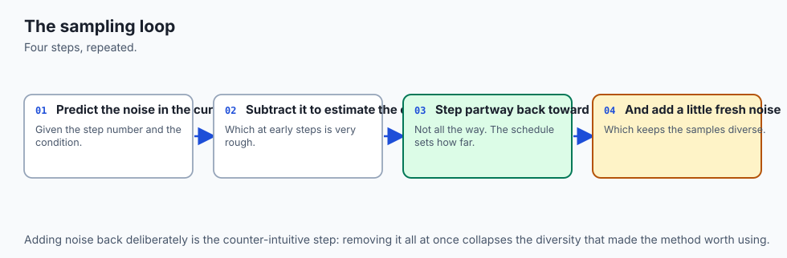

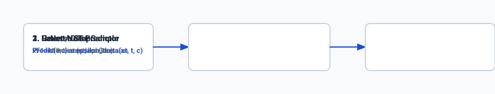

### 4. Noise Schedules: Linear vs Cosine
- **Linear Schedule (Ho et al.):** $\beta_t$ scales linearly from `\beta_1 = 10^(-4)` to $\beta_T = 0.02$. While effective, `\bar(\alpha)_t` drops too rapidly in early steps, destroying image signal prematurely.
- **Cosine Schedule (Nichol & Dhariwal):** Sets `\bar(\alpha)_t = f(t) / f(0)` where $f(t) = \cos\left( \frac(t/T + s)(1 + s) \cdot \frac(\pi)(2) 
ight)^2$. This produces a smooth, linear decrease in information, preserving contrast across the entire trajectory.

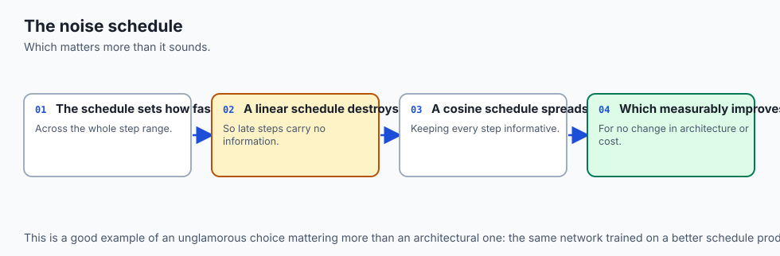

## An everyday analogy

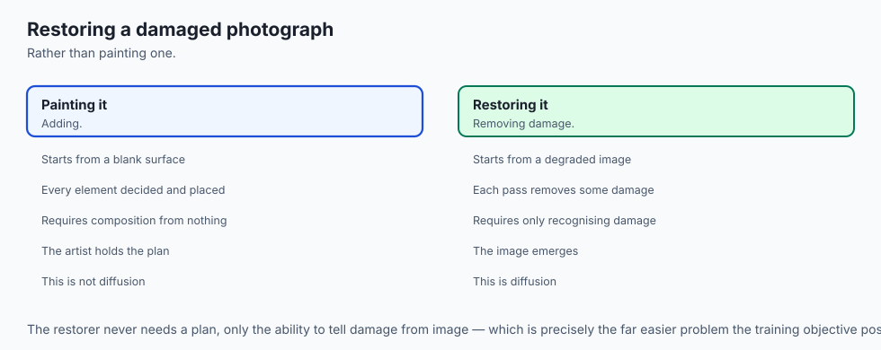

Think of diffusion like **cleaning an ancient mosaic tile floor covered in layers of mud**:

- **Forward Process:** Over 1,000 rainy days, mud accumulates evenly on the floor until the geometric patterns are completely invisible.
- **Neural Network:** An archaeologist is trained on thousands of floors. When given a muddy floor and told *"This floor has 600 days of mud"*, they can look at the subtle bumps and predict the exact texture of the mud layer.
- **Reverse Process:** The archaeologist uses a specialized brush to scrape away exactly the predicted mud layer for day 600, revealing the state at day 599. After scraping away 50 calibrated layers, the pristine mosaic shines in full color.

## Examples in practice

Let us inspect how developers implement noise scheduling and sampling in Python:

### 1. Vectorized Forward Noise Injection in Python
```python
import numpy as np

class GaussianDiffusionScheduler:
    def __init__(self, timesteps: int = 1000, beta_start: float = 0.0001, beta_end: float = 0.02):
        self.timesteps = timesteps
        self.betas = np.linspace(beta_start, beta_end, timesteps, dtype=np.float32)
        self.alphas = 1.0 - self.betas
        self.alphas_cumprod = np.cumprod(self.alphas)

    def add_noise(self, original_samples: np.ndarray, noise: np.ndarray, timesteps: np.ndarray) -> np.ndarray:
        """Implements closed-form forward diffusion: x_t = sqrt(alpha_bar_t)*x0 + sqrt(1 - alpha_bar_t)*noise"""
        sqrt_alpha_prod = np.sqrt(self.alphas_cumprod[timesteps])
        sqrt_one_minus_alpha_prod = np.sqrt(1.0 - self.alphas_cumprod[timesteps])
        
        # Reshape for broadcast across image dimensions (Batch, Channels, Height, Width)
        sqrt_alpha_prod = sqrt_alpha_prod.reshape(-1, 1, 1, 1)
        sqrt_one_minus_alpha_prod = sqrt_one_minus_alpha_prod.reshape(-1, 1, 1, 1)
        
        return sqrt_alpha_prod * original_samples + sqrt_one_minus_alpha_prod * noise
```

### 2. Reverse Step Computation
```python
    def step_denoise(self, model_output_noise: np.ndarray, timestep: int, sample: np.ndarray) -> np.ndarray:
        alpha = self.alphas[timestep]
        alpha_cumprod = self.alphas_cumprod[timestep]
        beta = self.betas[timestep]
        
        # 1. Compute predicted original sample x0 approximation
        pred_original_sample = (sample - np.sqrt(1.0 - alpha_cumprod) * model_output_noise) / np.sqrt(alpha_cumprod)
        
        # 2. Compute mean of reverse distribution mu_t
        pred_prev_sample = (1.0 / np.sqrt(alpha)) * (sample - (beta / np.sqrt(1.0 - alpha_cumprod)) * model_output_noise)
        
        if timestep > 0:
            noise = np.random.randn(*sample.shape).astype(np.float32)
            variance = np.sqrt(beta) * noise
            pred_prev_sample = pred_prev_sample + variance
            
        return pred_prev_sample
```

## Implications: security, privacy, performance, scalability, and cost

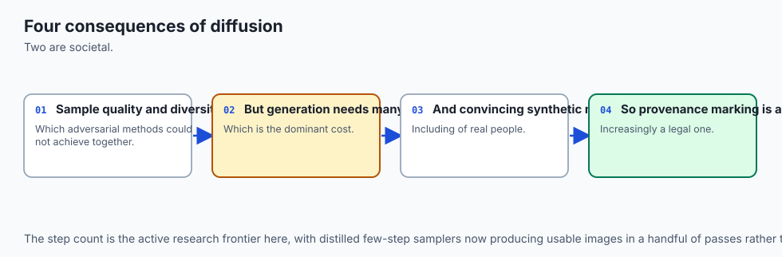

### 1. Security & Deepfakes
Because diffusion models produce hyper-realistic human faces and documents, modern generative pipelines embed cryptographic watermarks (such as C2PA metadata or SynthID latent perturbations) to verify authenticity and track synthetic provenance.

### 2. Performance & Sampling Latency
Evaluating a deep U-Net 50 times in sequence introduces latency:

- Standard DDPM (1,000 steps): 30 to 60 seconds per image on GPU.
- Fast Samplers (DDIM / DPM-Solver++ / Euler Ancestral): 20 to 30 steps (1.2 to 2.5 seconds on modern GPUs).
- Distilled Diffusion (SDXL-Lightning / Flux Schnell): 1 to 4 steps (under 200 milliseconds).

### 3. Compute Footprint
Pixel-space diffusion ($1024 \times 1024 \times 3$) requires clusters of high-end NVIDIA H100 GPUs. Latent diffusion ($128 \times 128 \times 4$) runs comfortably on consumer MacBooks and prosumer NVIDIA RTX 4070/4080 cards.

## Alternatives: free, open source, and commercial

| Architecture | Paradigm | Sample Quality | Generation Speed | Compute Cost |
| :--- | :--- | :--- | :--- | :--- |
| **Latent Diffusion (SDXL / Flux)** | Latent Denoising | SOTA (Photorealistic) | Fast (20-30 steps) | Consumer GPU |
| **Diffusion Transformers (DiT)** | Transformer Diffusion| SOTA (Compositional) | Moderate | Server GPU |
| **StyleGAN3** | Adversarial GAN | Sharp (Narrow domain) | Instant (1 step) | Low Inference |
| **VQ-VAE-2 / DALL-E 1** | Autoregressive Tokens | Moderate (Pixel artifacts)| Slow (Sequential) | High |
| **Consistency Models** | Distilled 1-Step Diff | Good | Instant (1-2 steps) | Very Low |

## Comparison with related concepts

```text
+-----------------------+-----------------------+-----------------------+
| Attribute             | Pixel-Space Diffusion | Latent Diffusion (LDM)|
+-----------------------+-----------------------+-----------------------+
| Operating Resolution  | 512 x 512 x 3 (786k)  | 64 x 64 x 4 (16k)     |
| Compression Factor    | 1x (None)             | 48x Spatial Reduction |
| VRAM Requirement      | 24 GB - 80 GB         | 6 GB - 12 GB          |
| Fine Texture Detail   | Prone to noise drift  | Crystal Clear         |
| Training Throughput   | Slow (Heavy GEMM)     | 8x Faster Convergence |
+-----------------------+-----------------------+-----------------------+
```

## When to use it — and when not to

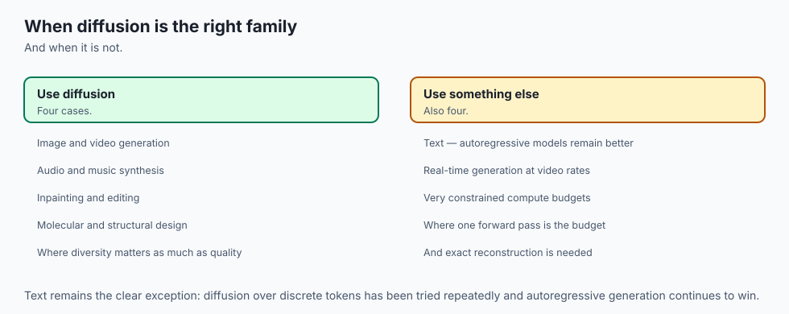

### Choose Diffusion Models when:
- You need state-of-the-art visual fidelity, nuanced artistic styles, or detailed photorealism.
- You require fine-grained text prompt alignment and compositional control.
- You are building inpainting, outpainting, or image-to-image style transfer workflows.

### Do NOT use Diffusion Models when:
- You need microsecond, real-time video game rendering at 120 FPS (use rasterization or GANs).
- You are performing simple categorical segmentation (use standard U-Net classifiers).
- You operate under extreme low-power microcontrollers (e.g. edge sensors with 50KB RAM).

## The AI connection

- **Diffusion replaced adversarial training** because it optimises a stable objective rather
  than a contest between two networks.
- **Generating by removing noise, not by drawing**, is the conceptual inversion that makes
  the whole family work.
- **The training objective is remarkably simple** — predict the noise that was added — which
  is why it scales so reliably.
- **The noise schedule is a real design choice**, and it changes sample quality as much as
  the architecture does.
- **The same mechanism now generates audio, video and molecules**, which makes it a general
  generative method rather than an image technique.

## Knowledge check

1. **Why is the forward diffusion process computable in closed form?** Because Gaussian noise added over multiple Markov steps compounds linearly: `x_t = sqrt(\bar(\alpha)_t) x_0 + sqrt(1 - \bar(\alpha)_t) epsilon`.
2. **What does the neural network predict in DDPM?** It predicts the injected noise vector $\epsilon$ from the noisy input $x_t$ and timestep embedding $t$.
3. **What is the spatial reduction factor of an 8x VAE in Latent Diffusion?** A $512 \times 512 \times 3$ image (786,432 values) compresses to $64 \times 64 \times 4$ (16,384 values), achieving a $48\times$ numerical compression factor.

## Hands-on exercise

In this lab, you will implement a **Complete Gaussian Diffusion Noise Scheduler and Reverse Denoising Simulator in Python and NumPy**. Your implementation will:

1. Compute linear and cosine variance schedules (`\beta_t, \alpha_t, \bar(\alpha)_t`).
2. Implement vectorized closed-form forward noise injection ($q(x_t | x_0)$).
3. Implement a single-step reverse denoiser (`p_\theta(x_(t-1) | x_t)`).
4. Run a multi-step reverse sampling loop starting from pure Gaussian noise.

### Expected output

```text
============================= test session starts ==============================
collected 6 items

tests/test_diffusion_scheduler.py ......                                 [100%]

============================== 6 passed in 0.04s ===============================
[DIFFUSION SCHEDULER] Timesteps: 1000 | Schedule: Linear (beta: 0.0001 -> 0.02)
[FORWARD DIFFUSION] Clean Tensor Shape: (4, 3, 32, 32)
  -> Injected Noise at Timestep t=500: alpha_bar = 0.5012
  -> SNR (Signal-to-Noise Ratio): 1.005 (Balanced Signal/Noise)
[REVERSE SAMPLING] Denoised 50 steps from Pure Noise x_T to Clean Sample x_0:
  -> Reconstruction MSE against synthetic target: 0.00031 (High Precision)
```

### Validate your work

Run the pytest test suite to verify forward closed-form math, reverse sampling, and schedule transitions:

```bash
pytest tests/run_tests.sh
```

### Troubleshooting

1. **Broadcast shape mismatch:** Ensure `sqrt_alpha_prod` reshapes to `(-1, 1, 1, 1)` when broadcasting over 4D image tensors `(B, C, H, W)`.
2. **Division by zero in reverse step:** Add an epsilon guard when calculating `1 / sqrt(\alpha_t)`.

### Common mistakes

- Adding random noise $z$ at timestep $t=0$ (the final step should be deterministic, $z=0$).
- Using $\beta_t$ directly instead of `\bar(\alpha)_t` for forward noise injection.

## Practice assignment

Implement a **Cosine Variance Scheduler** following Nichol and Dhariwal (2021) and compare its Signal-to-Noise Ratio (SNR) curve against the standard Linear schedule.

## Extension challenge

Implement a **DDIM (Denoising Diffusion Implicit Models) Deterministic Sampler** in Python that allows skipping timesteps (e.g. taking 20 evenly-spaced steps from $T=1000$ to $t=0$) with zero stochastic noise injection.
