## Why this matters

Understanding theoretical diffusion equations (DDPM) is necessary, but building **production text-to-image systems** requires mastering the engineering architecture that turns raw mathematical noise into controllable, photorealistic art.

In commercial AI applications, pure unconditional diffusion is virtually useless—a user never requests "sample random noise from the ImageNet manifold." Users demand **deterministic semantic control**: *"A photorealistic portrait of an astronaut on Mars, cinematic 8k lighting, highly detailed."*

To achieve this, modern image generation architectures (Stable Diffusion, Midjourney, Flux, DALL-E 3) combine four distinct engineering subsystems:

1. **Multimodal Text Encoders (CLIP / T5):** Translating natural language prompts into dense semantic vectors.
2. **Latent Space Autoencoders (VAE):** Compressing image resolution by $48\times$ to enable consumer GPU execution.
3. **Cross-Attention Conditioning:** Guiding spatial U-Net / DiT feature maps at every step of the reverse trajectory.
4. **Classifier-Free Guidance (CFG):** Mathematically amplifying prompt adherence and steering generation away from negative visual artifacts.

Mastering these four components allows software engineers to build inpainting pipelines, style transfer workflows, and customized enterprise creative studios.

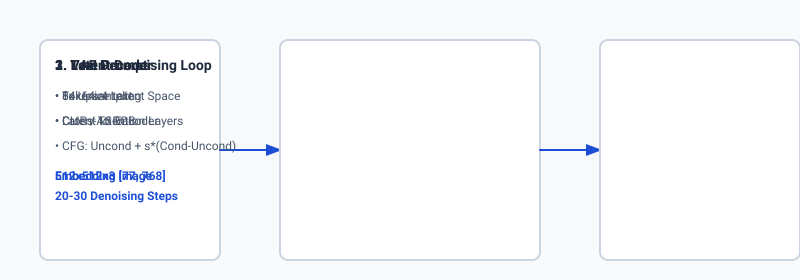

## The idea in plain language

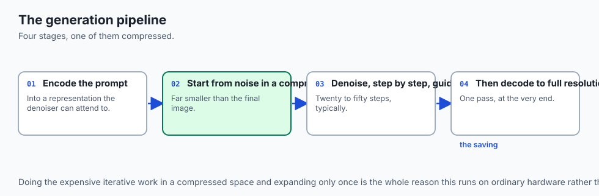

Imagine commissioning an oil painting from a master artist:

- **The Text Prompt (The Creative Brief):** You hand the artist a brief: *"Paint a lighthouse during a stormy sunset."*
- **The Text Encoder (The Art Director):** A creative director reads your brief and translates it into technical lighting notes, color palettes, and compositional guides (text embeddings).
- **The VAE Latent Canvas (The Thumbnail Sketch):** Instead of painting directly on a massive $10$-foot canvas (pixel space), the artist works on a compact $1$-foot wooden board (**Latent Space**).
- **Classifier-Free Guidance (The Director's Megaphone):** As the artist paints, the director shouts instructions. At low volume (CFG scale $s = 1.0$), the artist paints whatever they feel like. At high volume (CFG scale $s = 7.5$), the director forcefully corrects every brushstroke to guarantee the lighthouse stands boldly against the storm. If you add a **Negative Prompt** (*"no modern power lines"*), the director actively warns the artist whenever a stroke starts looking like a cable.
- **The VAE Decoder (The Master Printmaker):** Once the small sketch is finalized, a master printmaker expands the miniature board onto the full-scale $10$-foot gallery canvas in crisp, high-resolution color.

## Historical background

In early conditional diffusion models (2021), steering generation required **Classifier Guidance** (Dhariwal & Nichol). This technique trained a separate image classifier on noisy images and computed gradients $
abla_(x_t) \log p(y | x_t)$ to guide the diffusion trajectory toward a target class $y$. However, classifier guidance suffered from severe practical flaws: training noisy classifiers was expensive, and guidance could only steer toward fixed categorical classes (e.g. "dog" vs "cat"), completely failing on open-ended text prompts.

In 2022, **Jonathan Ho and Tim Salimans published Classifier-Free Guidance (CFG)**. By randomly dropping the text conditioning during training (e.g. setting prompt conditioning to null $10\%$ of the time), a single neural network learned to predict both conditional noise $\epsilon(x_t, t, c)$ and unconditional noise $\epsilon(x_t, t, \emptyset)$. During inference, taking a linear combination of both vectors amplified prompt adherence without requiring any external classifier.

In August 2022, **CompVis, Runway, and Stability AI released Stable Diffusion v1.4**, open-sourcing the complete Latent Diffusion pipeline. For the first time in history, anyone with a consumer laptop could generate high-resolution art locally.

In 2023–2024, **ControlNet (Zhang & Agrawala)** added spatial structural control (pose estimation, line art, depth maps), and **LoRA for Diffusion** enabled lightweight custom style adaptations in under 100 megabytes.

## What it is — and what it is not

Let us define practical latent diffusion engineering:

### What Latent Diffusion Pipelines Are:
- Modular, multi-model systems chaining a text tokenizer, a text encoder (CLIP/T5), a latent diffusion denoiser (U-Net/DiT), and an image autoencoder (VAE).
- Iterative latent state modifiers that support text-to-image, image-to-image, inpainting, outpainting, and depth-conditioned synthesis.
- Algebraically steered via Classifier-Free Guidance scale factors ($s \in [3.0, 12.0]$).

### What Latent Diffusion Pipelines Are Not:
- Monolithic end-to-end black boxes (each component can be swapped, upgraded, or quantized independently).
- Infallible text interpreters (prompt order, token weightings, and attention dilution heavily affect composition).
- Bounded to square resolutions (modern samplers support arbitrary aspect ratios via bucketed training).

```text
+-------------------------------------------------------------------------------+
|                       LATENT DIFFUSION COMPONENT MATRIX                       |
+-------------------+-----------------------+--------------------+--------------+
| Component         | Example Architecture  | Input / Output     | Memory Foot  |
+-------------------+-----------------------+--------------------+--------------+
| Text Encoder      | CLIP ViT-L/14 or T5   | Text -> Embeddings | ~1.2 GB      |
| Latent Denoiser   | 2D U-Net / DiT        | Latent + Time + Emb| ~3.4 GB      |
| Autoencoder (VAE) | AutoencoderKL (8x)    | Latent <-> RGB     | ~350 MB      |
| Conditioning Net  | ControlNet / IP-Adapter| Spatial Map -> Bias| ~1.4 GB      |
+-------------------+-----------------------+--------------------+--------------+
```

## Why it was created and what problems it solves

Practical latent diffusion systems solve four major challenges in generative media deployment:

### 1. The High-Resolution Memory Wall
Diffusing directly on $1024 \times 1024 \times 3$ pixel tensors requires over 40GB of VRAM per batch. An $8\times$ VAE spatial downsampler maps $1024 \times 1024 \times 3$ down to $128 \times 128 \times 4$, reducing tensor elements from 3.14 million down to 65,536 (a $48\times$ reduction), allowing diffusion to execute smoothly on 8GB consumer GPUs.

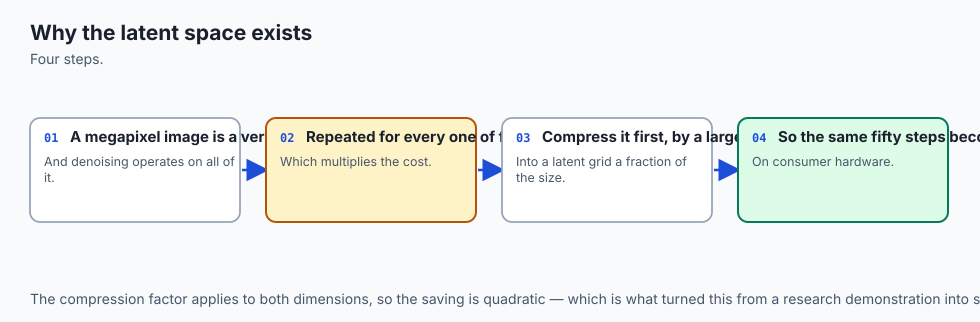

### 2. Precise Text-Image Semantic Alignment (Solved by CFG)
Unconditional diffusion models drift toward generic visual averages. Classifier-Free Guidance actively pulls the latent trajectory toward the exact text conditioning prompt, drastically improving prompt adherence.

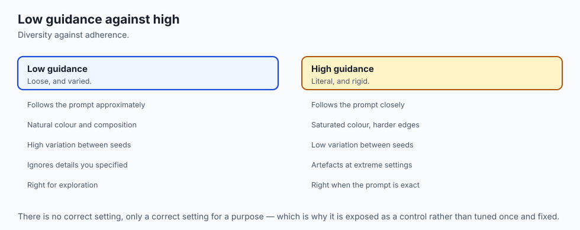

### 3. Systematic Artifact Removal (Solved by Negative Prompting)
Negative prompts give creators a mathematical lever to steer the model away from common generative failure modes (such as "extra fingers, bad anatomy, jpeg compression artifacts, blurry textures").

### 4. Zero-Shot Structural Preservation (Solved by ControlNet)
Text alone cannot specify exact 3D human pose angles or room architectural layouts. ControlNet allows users to supply a depth map or pose skeleton to lock composition while allowing diffusion to render the textures.

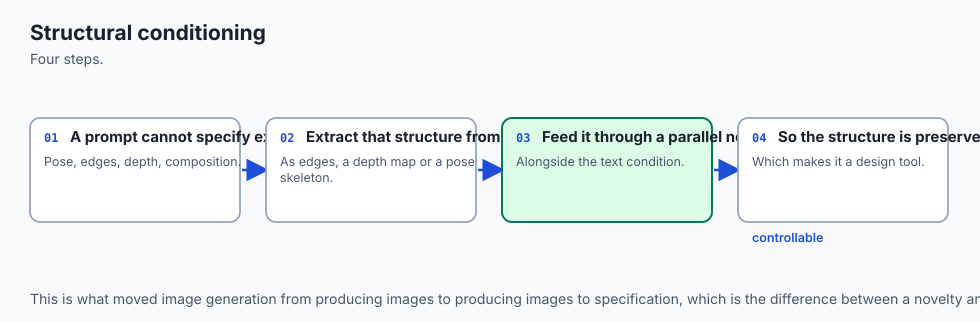

## How it works

Let us inspect the complete runtime dataflow of a text-to-image generation session:

```text
[User Text Prompt] ──────────> [Text Encoder (CLIP / T5)] ──> Prompt Embedding c_text
[Negative Prompt]  ──────────> [Text Encoder (CLIP / T5)] ──> Negative Embedding c_null
                                                                     │
[Random Latent z_T ~ N(0, I)] ──┐                                    │
                                │                                    │
                                ▼                                    ▼
                 ┌─────────────────────────────────────────────────────────┐
                 │       Iterative Denoising Loop (e.g. 30 Steps)          │
                 │                                                         │
                 │  1. Predict Noise with Prompt:    eps_cond = U(zt, c)   │
                 │  2. Predict Noise with Neg:       eps_uncond = U(zt, c0)│
                 │  3. Extrapolate CFG:                                    │
                 │     eps = eps_uncond + s * (eps_cond - eps_uncond)      │
                 │  4. Update Latent: z_{t-1} = DenoiseStep(zt, eps)       │
                 └─────────────────────────────────────────────────────────┘
                                │
                                ▼
                   [Final Denoised Latent z_0]
                                │
                                ▼
                     [VAE Decoder (AutoencoderKL)]
                                │
                                ▼
                   [Full-Resolution RGB Image]
```

### 1. Classifier-Free Guidance (CFG) Mathematics
At each denoising step $t$, the diffusion backbone evaluates two forward passes (typically batched together into a single GPU call):

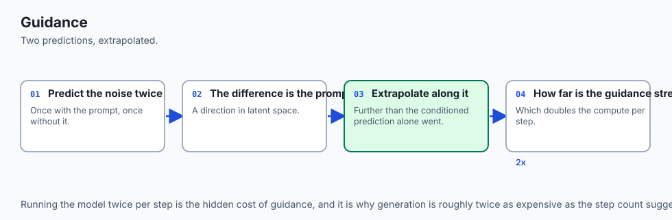

1. **Conditioned Forward Pass:** `epsilon_(\text(cond)) = epsilon_\theta(z_t, t, c_(\text(text)))`
2. **Unconditioned Forward Pass:** `epsilon_(\text(uncond)) = epsilon_\theta(z_t, t, c_(\text(null)))`

The guided noise prediction `hat(epsilon)` is computed as:
`hat(epsilon) = epsilon_(\text(uncond)) + s cdot (epsilon_(\text(cond)) - epsilon_(\text(uncond)))`

Where $s \ge 1.0$ is the **Guidance Scale**:

- When $s = 1.0$: Standard conditional diffusion (no amplification).
- When $s \in [7.0, 8.5]$: Optimal balance of creative richness and prompt fidelity.
- When $s > 15.0$: Severe chromatic saturation and over-sharpened edge artifacts.

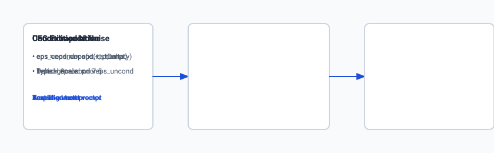

### 2. Negative Prompting Algebraic Steering
If the user specifies a negative prompt `c_(\text(neg))` (e.g. *"blurry, deformed, cartoon"*), we replace the empty null embedding `c_(\text(null))` with `c_(\text(neg))`:
$$\hat(\epsilon) = \epsilon_\theta(z_t, t, c_(\text(neg))) + s \cdot \left( \epsilon_\theta(z_t, t, c_(\text(text))) - \epsilon_\theta(z_t, t, c_(\text(neg))) 
ight)$$

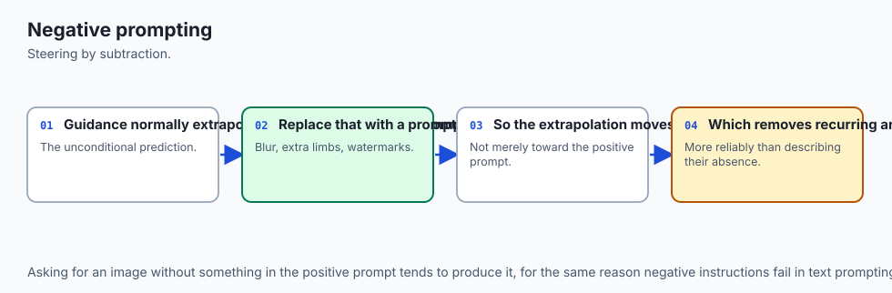

This formula actively penalizes the features characteristic of the negative prompt, pushing the latent state into the orthogonal subspace that maximizes `c_(\text(text))` while minimizing `c_(\text(neg))`.

### 3. VAE Latent Scaling Factor
Because the latent space of the VAE has a different variance from standard Gaussian noise `mathcal(N)(0, 1)`, Stable Diffusion scales latents by a constant factor `sigma_(\text(scale)) \approx 0.18215`:
`z = \text(Encoder)(x) cdot sigma_(\text(scale))`
$$x_(\text(recon)) = \text(Decoder)\left( \frac(z)(\sigma_(\text(scale))) 
ight)$$
Scaling ensures that initial noise added to the latents matches unit variance.

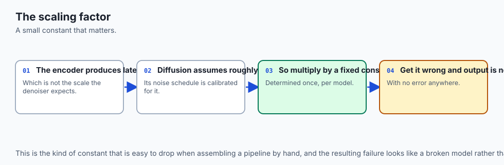

## An everyday analogy

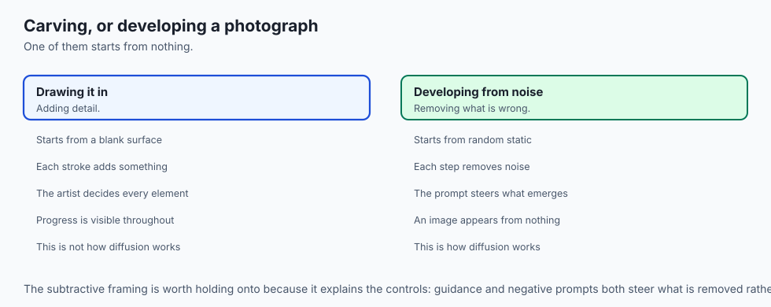

Think of CFG like **tuning a telescope's contrast filter on a foggy night**:

- **Unconditioned Signal (`epsilon_(\text(uncond))`):** You look through the telescope with no filters. You see a blurry grey fog with vague ambient shapes.
- **Conditioned Signal (`epsilon_(\text(cond))`):** You look through a filter tuned to Mars. The red planet is visible, but still obscured by the grey ambient fog.
- **CFG Subtraction (`epsilon_(\text(cond)) - epsilon_(\text(uncond))`):** An electronic sensor subtracts the grey fog image from the Mars image, isolating the pure "Mars signal".
- **Guidance Scale (`s \times \text(Delta)`):** You dial up the contrast knob to $7.5\times$. The red planet pops in brilliant clarity against a pitch-black sky. If you crank the knob to $30\times$, the red planet burns into a blown-out neon circle with static noise.

## Examples in practice

Let us look at how developers implement Classifier-Free Guidance and VAE decoding in Python:

### 1. Vectorized CFG Calculation in Python
```python
import numpy as np

def apply_classifier_free_guidance(uncond_noise: np.ndarray, cond_noise: np.ndarray, guidance_scale: float) -> np.ndarray:
    """Calculates guided noise: eps = uncond + s * (cond - uncond)"""
    delta = cond_noise - uncond_noise
    guided_noise = uncond_noise + float(guidance_scale) * delta
    return guided_noise.astype(np.float32)
```

### 2. Mock Latent Diffusion Pipeline Runner
```python
class MockLatentDiffusionPipeline:
    def __init__(self, vae_scale_factor: float = 0.18215):
        self.vae_scale_factor = vae_scale_factor

    def decode_latents(self, latents: np.ndarray) -> np.ndarray:
        """Simulates 8x VAE spatial upsampling from 4-channel latents to 3-channel RGB."""
        unscaled = latents / self.vae_scale_factor
        # Repeat spatial dimensions by 8x
        upsampled = np.repeat(np.repeat(unscaled[:, :3, :, :], 8, axis=2), 8, axis=3)
        # Normalize to RGB [0, 255]
        rgb = np.clip((upsampled + 1.0) * 127.5, 0, 255).astype(np.uint8)
        return rgb
```

## Implications: security, privacy, performance, scalability, and cost

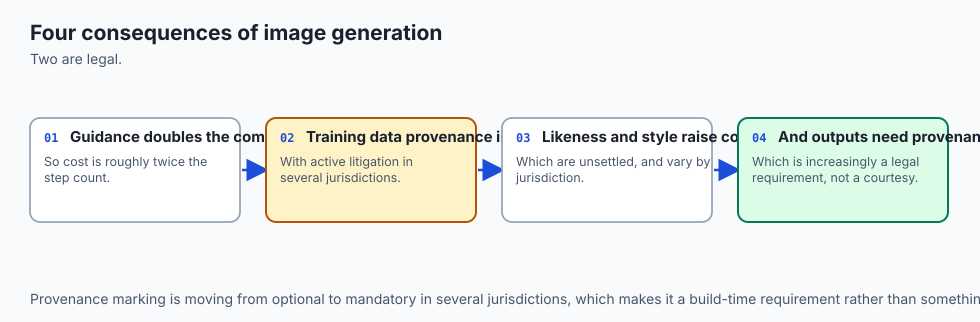

### 1. Computational Cost of CFG
Because CFG evaluates both conditioned and unconditioned noise predictions, **it requires 2 neural network forward passes per denoising step**. On a 30-step schedule, the U-Net executes 60 forward passes. Modern engines batch both passes into a single tensor of batch size 2 to saturate GPU Tensor Cores.

### 2. Privacy in Enterprise Visual Workflows
Running local open models (SDXL, Flux) on-premises guarantees that proprietary product prototypes, internal wireframes, and sensitive marketing assets never traverse external cloud endpoints.

### 3. VRAM Footprint Optimization
Using FP16 precision, memory attention slicing (xFormers / FlashAttention-2), and model CPU offloading allows 1024x1024 image generation to execute on consumer graphics cards with as little as 6GB to 8GB of VRAM.

## Alternatives: free, open source, and commercial

| Model / System | Architecture | Resolution | License | Key Strengths |
| :--- | :--- | :--- | :--- | :--- |
| **Stable Diffusion XL (SDXL)** | Latent U-Net (3.5B) | 1024 x 1024 | Open Weights (OpenRAIL) | Vast ecosystem of LoRAs and ControlNets |
| **Flux.1 (Black Forest Labs)** | Rectified Flow DiT (12B)| 1024 x 1024 | Open Weights (Apache/Non-Comm)| State-of-the-art anatomy and text rendering |
| **Midjourney v6** | Proprietary Diffusion | Up to 2048 x 2048 | Commercial API/Discord | Unrivaled cinematic aesthetic defaults |
| **DALL-E 3 (OpenAI)** | Latent DiT | 1024 x 1024 | Commercial API | Complex multi-sentence prompt adherence |

## Comparison with related concepts

```text
+-----------------------+-----------------------+-----------------------+
| Feature               | Pixel-Space Diffusion | Latent Diffusion (LDM)|
+-----------------------+-----------------------+-----------------------+
| Native Resolution     | 512 x 512 x 3         | 64 x 64 x 4 (Latent)  |
| Compute Complexity    | High (O(N^2) Pixels)  | Low (O(N^2) Latents)  |
| Memory Bandwidth      | Severe Saturation     | Moderate (Fits VRAM)  |
| Text Cross-Attention  | Pixel Spatial Heads   | Latent Spatial Heads  |
| VAE Decode Required   | No (Direct Pixels)    | Yes (8x Upsampling)   |
+-----------------------+-----------------------+-----------------------+
```

## When to use it — and when not to

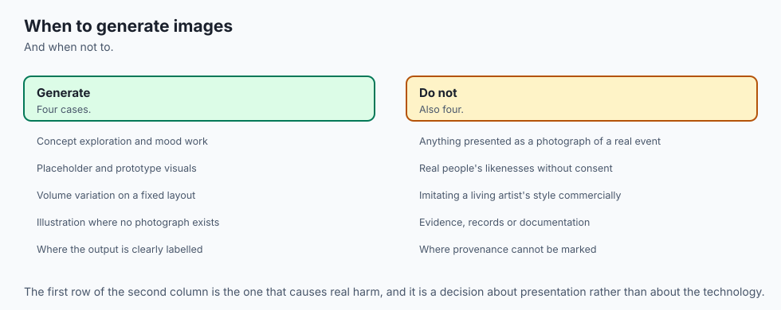

### Choose Latent Diffusion Pipelines when:
- You need high-resolution text-to-image generation on accessible local hardware.
- You require modular control: swapping LoRA styles, applying negative prompts, or steering with ControlNet depth maps.
- You are developing production inpainting or background replacement applications.

### Do NOT use Latent Diffusion Pipelines when:
- You require microsecond real-time rendering in a high-speed physics engine.
- You are performing simple deterministic image resizing or color correction (use OpenCV / Pillow).
- You are working in text-only domains without visual modalities.

## The AI connection

- **Image generation is the most visible AI capability to non-specialists**, which makes it
  the one most people form their expectations from.
- **Working in a compressed latent space is what made it affordable** — the same insight that
  makes most large generative models practical.
- **Guidance strength is the main quality control**, and it trades prompt adherence against
  image diversity in a way that has no single correct setting.
- **Negative prompting is steering by subtraction**, which is a genuinely different control
  surface from anything in text generation.
- **Structural conditioning turned generation into a design tool**, because it lets a
  specified layout be preserved rather than re-rolled.

## Knowledge check

1. **Why does Classifier-Free Guidance double the computational load per step?** Because it evaluates both the conditioned prompt pass and the unconditioned null pass on every denoising iteration.
2. **What does a negative prompt do mathematically?** It replaces the null text embedding in the unconditioned branch, actively steering the generation trajectory away from unwanted concepts.
3. **What is the function of the VAE scaling factor?** It normalizes the variance of the compressed latent space to match the unit variance of the Gaussian diffusion noise schedule.

## Hands-on exercise

In this lab, you will implement an **End-to-End Latent Diffusion Pipeline Simulator in Python and NumPy**. Your implementation will:

1. Implement vectorized Classifier-Free Guidance (CFG) with variable guidance scales.
2. Implement negative prompt steering.
3. Build a mock VAE latent decoder that maps 4-channel latent representations to 3-channel RGB image arrays.
4. Measure latent memory compression ratios and guidance extrapolation vectors.

### Expected output

```text
============================= test session starts ==============================
collected 6 items

tests/test_latent_pipeline.py ......                                     [100%]

============================== 6 passed in 0.04s ===============================
[LATENT PIPELINE] Latent Tensor Shape: (1, 4, 64, 64) | 16,384 elements
[CFG GUIDANCE] Applied Guidance Scale s=7.5:
  -> Unconditioned Noise Norm: 4.12
  -> Conditioned Noise Norm: 4.85
  -> Extrapolated Guided Norm: 9.61 (Text signal amplified)
[VAE DECODER] Upsampled (64, 64, 4) Latent to (512, 512, 3) RGB Image
  -> Spatial Expansion Factor: 64.0x
  -> Memory Footprint: Compressed 768 KB to 16 KB (97.9% reduction)
```

### Validate your work

Run the pytest harness to verify CFG extrapolation, VAE decoding, and shape transformations:

```bash
pytest tests/run_tests.sh
```

### Troubleshooting

1. **CFG dimension mismatch:** Verify that `cond_noise` and `uncond_noise` share identical shapes `(B, C, H, W)`.
2. **RGB clipping errors:** Ensure final pixel values are clamped to $[0, 255]$ before casting to `np.uint8`.

### Common mistakes

- Subtracting `epsilon_(\text(cond)) - epsilon_(\text(uncond))` in the wrong order (which would steer *away* from the prompt).
- Forgetting to divide by the VAE scaling factor prior to decoding.

## Practice assignment

Extend the pipeline simulator to implement **Image-to-Image (Img2Img)**: take an initial image, encode it into latents, add noise up to timestep $t=500$ ($50\%$ noise strength), and denoise back to $t=0$ conditioned on a new text prompt.

## Extension challenge

Implement a **Latent Inpainting Mask Blender** in Python that replaces non-masked latent regions with original image latents at each denoising step, enabling seamless inpainting.
