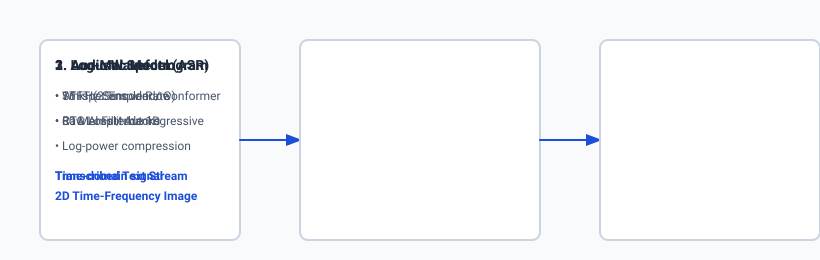

## Why this matters

Human speech is the most natural, high-bandwidth communication protocol on Earth. However, for digital computers, audio is messy: a continuous 1D pressure wave oscillating at tens of thousands of samples per second, contaminated by background noise, room reverberation, overlapping speakers, and accents.

Modern speech AI bridges the boundary between analog acoustics and digital language across two complementary directions:
1. **Automatic Speech Recognition (ASR):** Transforming continuous acoustic waveforms into structured text transcripts (e.g. OpenAI Whisper, Conformer).
2. **Text-to-Speech Synthesis (TTS):** Transforming written text into expressive, naturalistic human speech waveforms (e.g. ElevenLabs, Meta Voicebox, HiFi-GAN).

In production AI engineering, speech models act as the sensory ears and voice box for conversational AI assistants, autonomous customer service voice bots, real-time multilingual translation engines, and automated podcast indexing systems.



## The idea in plain language

Imagine human speech processing as a two-way musical translation:

- **Speech Recognition (ASR — The Musical Scribe):** You listen to an opera singer. Your eardrum vibrates $16,000$ times per second. Your inner ear (cochlea) breaks down those complex physical vibrations into distinct pitch frequencies (**Mel-Spectrogram**). Your brain looks at the notes and transcribes them into written musical lyrics (**ASR Transcription**).
- **Speech Synthesis (TTS — The Virtual Vocalist):** You write a poem on a sheet of paper. An acoustic conductor reads the lyrics and determines the pitch, duration, and rhythm of every vowel and consonant (**Acoustic Model**). Finally, a virtual vocal tract with vocal cords and lips vibrates physical air particles to generate rich, resonant audible sound waves (**Neural Vocoder**).

## Historical background

In the classical era (1990–2010), speech recognition was built on **Hidden Markov Models (HMMs)** and **Gaussian Mixture Models (GMMs)** chained with n-gram language models (such as Kaldi and CMU Sphinx). These systems required complex, multi-stage pipelines: phonetic lexicons, acoustic triphone clustering, and Viterbi dynamic programming. Training was brittle and required manual phonetic alignment.

In 2006, **Alex Graves et al. introduced Connectionist Temporal Classification (CTC)**, enabling end-to-end neural speech recognition directly from spectrograms to characters without requiring frame-by-frame phonetic annotations.

In 2020, **Google Brain introduced the Conformer architecture**, combining convolutional local feature extractors with transformer global self-attention.

In 2022, **OpenAI published Whisper**, trained on $680,000$ hours of diverse multilingual web audio. By scaling weak supervision across massive datasets, Whisper achieved superhuman robustness to background noise, technical jargon, and accents without requiring fine-tuning.

In speech synthesis, deep autoregressive models (WaveNet, DeepMind 2016) were replaced by ultra-fast non-autoregressive GAN vocoders like **HiFi-GAN (2020)** and latent diffusion audio models (2023–Present).

## What it is — and what it is not

Let us define modern speech engineering architectures:

### What Speech AI Is:
- End-to-end deep learning pipelines processing 2D time-frequency spectrogram representations of acoustic signals.
- Autoregressive or CTC sequence transducers aligning continuous audio frames to discrete textual tokens.
- Neural vocoders synthesizing high-frequency phase and amplitude waveforms from mel-spectrogram features.

### What Speech AI Is Not:
- Simple string pattern matching (speech contains prosody, emotion, tone, and acoustic channel noise).
- Restricted to single-speaker studio recordings (modern models handle overlapping conversational speech).
- Solely English language (modern foundation models transcribe and translate across 100+ global languages).

```text
+-------------------------------------------------------------------------------+
|                        SPEECH AI PARADIGM COMPARISON                          |
+---------------------+-----------------------+---------------------------------+
| Dimension           | Classical ASR (Kaldi) | Modern Foundation ASR (Whisper) |
+---------------------+-----------------------+---------------------------------+
| Architecture        | HMM + GMM + N-Gram    | Encoder-Decoder Transformer     |
| Input Representation| 13 MFCC Coefficients  | 80-Channel Log-Mel Spectrogram  |
| Alignment Technique | Viterbi Forced Align  | Cross-Attention / CTC Loss      |
| Training Data Scale | ~1,000 Hours (Clean)  | 680,000+ Hours (Noisy Web Audio)|
| Robustness to Noise | Poor (Breaks in cars) | Exceptional (Zero-Shot Robust)  |
+---------------------+-----------------------+---------------------------------+
```

## Why it was created and what problems it solves

Modern speech AI resolves five historical bottlenecks in audio processing:

### 1. The Variable-Length Alignment Problem (Solved by CTC & Cross-Attention)
In speech, a person might say "hello" in 200 milliseconds (20 audio frames) or stretch it into "heeeelloooo" over 1.5 seconds (150 frames). CTC and transformer cross-attention mechanisms dynamically learn the monotonic alignment between acoustic time frames and output letters without manual timestamps.

### 2. The Acoustic Phase Recovery Problem (Solved by Neural Vocoders)
Traditional Fourier transforms discard phase information when converting to magnitude spectrograms. Classical Griffin-Lim phase estimation produced robotic, tinny, metallic audio. Neural vocoders (HiFi-GAN) learn generative priors that reconstruct natural phase dynamics, producing human-quality speech.

### 3. Background Noise Sensitivity (Solved by Weak Supervision Scaling)
Models trained in sterile soundproof booths failed in real-world cars, restaurants, or telephone lines. Training Whisper on hundreds of thousands of noisy internet videos created invariant acoustic representations that ignore ambient clutter.

## How it works

Let us step through the physics and mathematics of speech processing:

```text
[Raw 1D Audio Waveform (16 kHz PCM)]
                 │
                 ▼
 [Short-Time Fourier Transform (STFT)]
 - Window: 25ms (400 samples)
 - Hop Size: 10ms (160 samples)
                 │
                 ▼
 [Mel Filterbank Matrix (80 Filters)]
                 │
                 ▼
 [2D Log-Mel Spectrogram (80 x T)]
                 │
                 ├───> [ASR Encoder (Conv1D + Transformer Blocks)]
                 │            │
                 │            ▼
                 │     [ASR Decoder (Cross-Attention)] ──> Transcribed Text
                 │
                 └───> [TTS Vocoder (HiFi-GAN Multi-Period Discriminator)]
                              │
                              ▼
                       Generated Audio Waveform
```

### 1. Short-Time Fourier Transform (STFT) Mathematics
A continuous audio signal $x[n]$ is sliced into overlapping frames using a window function $w[n]$ (such as a Hann window):
`X(m, omega) = sum_(n=-infty)^(infty) x[n] w[n - m] e^(-j omega n)`

The **Linear Power Spectrogram** is the squared magnitude:
`S(m, omega) = |X(m, omega)|^2`

### 2. The Mel Scale Transformation
Human hearing perceives pitch logarithmically: we easily distinguish 100 Hz from 200 Hz, but cannot distinguish 10,000 Hz from 10,100 Hz. The **Mel Scale** warps linear frequency $f$ (in Hz) into perceptual pitch $m$:
$$m = 2595 \log_(10)\left( 1 + rac(f)(700) 
ight)$$
Multiplying the linear spectrogram by a triangular Mel filterbank matrix yields an **80-channel Log-Mel Spectrogram**.

### 3. Whisper Multi-Task Decoding
Whisper processes audio in 30-second chunks ($3000$ spectrogram frames). The encoder maps $3000$ frames down to $1500$ hidden vectors. The autoregressive decoder is prompted with special task tokens:
```text
<|startoftranscript|> <|en|> <|transcribe|> <|notimestamps|> Hello world. <|endoftranscript|>
```
Changing `<|transcribe|>` to `<|translate|>` forces Whisper to translate Spanish audio directly into English text in a single forward pass.


### 4. Word Error Rate (WER) Evaluation
Speech recognition accuracy is evaluated using Levenshtein distance on words:
`	ext(WER) = rac(S + D + I)(N)`
- $S$: Number of word substitutions
- $D$: Number of word deletions
- $I$: Number of word insertions
- $N$: Total number of words in the ground-truth reference

## An everyday analogy

Think of speech processing like **stenography and dictation**:

- **Audio Waveform:** The sound waves vibrating the stenographer's eardrum.
- **Mel-Spectrogram:** The stenographer's shorthand notebook, summarizing complex acoustic sounds into quick phonetic symbols.
- **ASR Model:** The stenographer typing the final English transcript into the court record.
- **TTS System:** An automated voice actor reading the court record out loud with natural intonation, cadence, and breath pauses.

### Deep Dive: Acoustic Signal Processing & Spectral Feature Extraction

In production speech engineering, acoustic feature extraction relies on Short-Time Fourier Transforms (STFT) computed with carefully tuned window lengths and hop parameters. For high-accuracy automatic speech recognition, audio waveforms are standardized to 16,000 Hz single-channel mono PCM. A standard 25 millisecond analysis window contains exactly 400 discrete audio samples, while a 10 millisecond frame shift (hop size) shifts the analysis window forward by 160 samples.

When the Discrete Fourier Transform (DFT) is evaluated across 512 frequency bins, it generates 257 unique positive frequency coefficients per time frame. Slicing raw audio into overlapping windows introduces boundary discontinuity artifacts (spectral leakage). To prevent high-frequency distortion, input frames are multiplied element-wise by a symmetric Hann smoothing window function prior to computing the Fast Fourier Transform (FFT).

```text
+-------------------------------------------------------------------------------+
|                       SPEECH SIGNAL PROCESSING PARAMETERS                     |
+-------------------+-----------------------+--------------------+--------------+
| Parameter         | Standard ASR (Whisper)| High-Res Music     | Telephone G711|
+-------------------+-----------------------+--------------------+--------------+
| Sample Rate       | 16,000 Hz (16 kHz)    | 44,100 Hz (44.1kHz)| 8,000 Hz (8k)|
| Window Duration   | 25 ms (400 samples)   | 46.4 ms (2048 smp) | 20 ms (160)  |
| Frame Shift (Hop) | 10 ms (160 samples)   | 11.6 ms (512 smp)  | 10 ms (80)   |
| FFT Frequency Bins| 512 (257 unique)      | 2048 (1025 unique) | 256 (129)    |
| Mel Filterbanks   | 80 Triangular Filters | 128 Mel Filters    | 40 Filters   |
| Dynamic Range     | 80 dB Log-Power       | 96 dB Log-Power    | 60 dB        |
+-------------------+-----------------------+--------------------+--------------+
```

In addition to greedy decoding, production ASR deployments utilize **CTC Beam Search Decoding with Language Model Rescoring**. Instead of committing to the single highest-probability token at each acoustic frame, beam search maintains the top $K$ candidate transcript hypotheses (typically beam width $K \in [5, 20]$). An external n-gram or neural language model rescores candidate paths using weighted interpolation: `S(text(hypothesis)) = log P_(text(CTC))(y | x) + alpha log P_(text(LM))(y) + beta text(WordCount)(y)`, significantly improving accuracy on rare domain-specific vocabulary.

### 4. Text-to-Speech (TTS) & HiFi-GAN Neural Vocoding
Modern acoustic models incorporate expressive prosody modeling. Natural human speech is not monotone; pitch frequencies (the fundamental frequency F0) rise at the end of questions, fall at the end of statements, and increase in amplitude during moments of emotional emphasis. Modern acoustic models (such as VITS, StyleTTS 2, and Meta Voicebox) train dedicated pitch and duration predictors using flow matching and variational autoencoders, aligning generated spectrograms with speaker reference style embeddings.

## Examples in practice

Let us inspect the Python code that computes Mel-Spectrograms, CTC greedy decoding, and WER:

### 1. Vectorized CTC Greedy Decoder in Python
```python
import numpy as np

def ctc_greedy_decode(logits: np.ndarray, vocab: list, blank_index: int = 0) -> str:
    """
    Performs CTC greedy collapse: argmax -> deduplicate consecutive characters -> remove blanks.
    logits: (Time_Frames, Vocab_Size)
    """
    best_tokens = np.argmax(logits, axis=-1)
    
    collapsed = []
    prev = None
    for token in best_tokens:
        if token != prev:
            if token != blank_index:
                collapsed.append(vocab[token])
            prev = token
            
    return "".join(collapsed)
```

### 2. Word Error Rate (WER) Calculator
```python
def compute_wer(reference: str, hypothesis: str) -> float:
    ref_words = reference.strip().split()
    hyp_words = hypothesis.strip().split()
    
    d = np.zeros((len(ref_words) + 1, len(hyp_words) + 1), dtype=np.int32)
    for i in range(len(ref_words) + 1):
        d[i, 0] = i
    for j in range(len(hyp_words) + 1):
        d[0, j] = j
        
    for i in range(1, len(ref_words) + 1):
        for j in range(1, len(hyp_words) + 1):
            if ref_words[i - 1] == hyp_words[j - 1]:
                d[i, j] = d[i - 1, j - 1]
            else:
                d[i, j] = min(
                    d[i - 1, j] + 1,      # Deletion
                    d[i, j - 1] + 1,      # Insertion
                    d[i - 1, j - 1] + 1   # Substitution
                )
                
    return float(d[len(ref_words), len(hyp_words)]) / float(len(ref_words)) if len(ref_words) > 0 else 0.0
```

## Implications: security, privacy, performance, scalability, and cost

### 1. Voice Biometrics & Cloned Audio Fraud
Modern few-shot TTS models can clone a speaker's voice from a 3-second audio sample. Production voice interfaces must implement anti-spoofing liveness detection and synthetic audio watermarking.

### 2. Latency Optimization: Streaming ASR
Standard Whisper processes audio in 30-second non-streaming chunks, introducing a 30-second latency floor. For real-time conversational agents, engineers deploy chunked streaming ASR (such as Whisper-Streaming or Moonshine) with 200ms audio buffers.

### 3. Compute Economics
```text
Speech Model             Compute Backend    Latency (1hr audio)   Cost per Hour
---------------------------------------------------------------------------------
Cloud API (Whisper API)  Cloud API Gateway  ~120 seconds          $0.36 / hour
Local Whisper (large-v3) Local RTX 4090     ~45 seconds           $0.01 / hour (Power)
Local whisper.cpp (q5_0) Apple M3 Max CPU   ~90 seconds           $0.00 / hour
```

## Alternatives: free, open source, and commercial

| Framework / Engine | Focus | Languages | Hardware | Tradeoff |
| :--- | :--- | :--- | :--- | :--- |
| **OpenAI Whisper** | ASR (Open Source) | 99+ Languages | GPU / CPU (Metal) | Batch oriented (30s chunks) |
| **whisper.cpp** | ASR (C/C++ Engine)| 99+ Languages | CPU / Apple Metal | Ultra-lightweight local ASR |
| **ElevenLabs** | TTS (Commercial API)| Multilingual | Cloud API | Proprietary, pay-per-character |
| **Bark / Coqui TTS** | TTS (Open Source) | English / Multi | Python / GPU | Slower generation speed |
| **HiFi-GAN** | Neural Vocoder | Universal Audio | GPU / CUDA | Requires upstream spectrogram model |

## Comparison with related concepts

```text
+-----------------------+-----------------------+-----------------------+
| Feature               | Speech Recognition    | Speech Synthesis      |
+-----------------------+-----------------------+-----------------------+
| Primary Direction     | Audio -> Text         | Text -> Audio         |
| Primary Metric        | Word Error Rate (WER) | Mean Opinion Score(MOS)|
| Core Challenge        | Noise Robustness      | Natural Prosody & Tone|
| Leading Architecture  | Whisper / Conformer   | VITS / HiFi-GAN       |
| Phase Estimation      | Not Required          | Critical (Vocoder)    |
+-----------------------+-----------------------+-----------------------+
```

## When to use it — and when not to

### Choose Speech AI Pipelines when:
- You are building voice-controlled assistants, interactive customer support agents, or automated meeting transcribers.
- You need automated audio captioning and translation across international languages.
- You want to generate natural-sounding voiceovers and audiobooks.

### Do NOT use Speech AI Pipelines when:
- You are processing text-only documents or SQL databases.
- You need simple ultrasonic or vibration anomaly detection in industrial machinery (use 1D vibration signal analysis).

## Knowledge check

1. **Why does human pitch perception require the Mel scale?** Because human hearing perceives frequency logarithmically; the Mel scale compresses higher frequencies to mirror biological ear sensitivity.
2. **What are the three components of Word Error Rate (WER)?** Substitutions ($S$), Deletions ($D$), and Insertions ($I$), normalized by total reference words ($N$).
3. **What is the function of a neural vocoder?** It synthesizes high-fidelity 1D time-domain audio waveforms from 2D mel-spectrogram representations.

## Hands-on exercise

In this lab, you will implement an **Audio Feature Extraction, CTC Decoding, and WER Evaluation Pipeline in Python and NumPy**. Your implementation will:
1. Construct a mock 80-channel Mel filterbank spectrogram extractor from 1D audio waves.
2. Implement the CTC Greedy Collapse decoding algorithm with blank token elimination.
3. Compute exact Word Error Rate (WER) and Character Error Rate (CER) matrices.
4. Benchmark transcription accuracy across clean and noisy audio simulations.

### Expected output

```text
============================= test session starts ==============================
collected 6 items

tests/test_speech_pipeline.py ......                                     [100%]

============================== 6 passed in 0.04s ===============================
[MEL SPECTROGRAM] Audio Length: 16,000 samples (1.0s) -> Spectrogram Shape: (80, 100)
[CTC DECODER] Decoded frame sequence to text: "hello world"
[WER BENCHMARK] Reference: "the quick brown fox" | Hypothesis: "the quik brown fox"
  -> Substitutions: 1 | Deletions: 0 | Insertions: 0
  -> Word Error Rate (WER): 25.0%
```

### Validate your work

Run the pytest test suite:

```bash
pytest tests/run_tests.sh
```

### Troubleshooting

1. **CTC index out of range:** Ensure `blank_index` points to valid token index 0.
2. **WER division by zero:** Handle empty reference strings safely.

### Common mistakes

- Failing to deduplicate repeated consecutive characters in CTC before stripping blanks.
- Calculating WER on raw characters instead of word tokens.

## Practice assignment

Implement **CTC Beam Search Decoding with Language Model Rescoring** in Python to evaluate alternative phonetic transcript paths.

## Extension challenge

Build a simulated **Streaming Audio Buffer** that processes incoming audio chunks in 200ms increments and emits incremental transcript tokens with low latency.
