## Why this matters

Generating static 2D images and transcribing spoken audio represented the first wave of multimodal AI. The true frontier of generative media lies in **dynamic time-series synthesis**: generating coherent multi-second video clips and rich, polyphonic musical compositions.

Generating video is profoundly more difficult than static image synthesis. A 5-second video clip at 24 FPS contains 120 distinct frames. If these frames are generated independently, the resulting video suffers from catastrophic **flicker and morphing**—a character's shirt changes color every frame, hands split into extra fingers, and backgrounds drift unpredictably.

Similarly, generating high-fidelity music requires models to maintain long-range harmonic structure, rhythmic timing, and instrumentation across thousands of audio steps without drifting out of key.

Today, foundation video systems (OpenAI Sora, Runway Gen-3, Stable Video Diffusion, Kling AI) and neural music engines (Meta MusicGen, Suno, Udio) solve these challenges using **Spatio-Temporal Diffusion Transformers** and **Residual Vector Quantized Neural Audio Codecs**.


## The idea in plain language

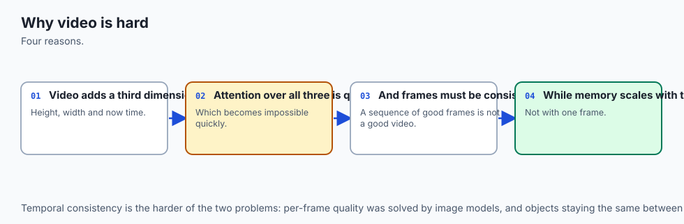

Imagine creating an animated movie or composing a symphonic masterpiece:

- **The Flipbook Problem (Naive Video Generation):** If you give 120 different artists 120 blank index cards and ask each artist to *"draw a cat jumping"*, every card will look different. When you flip the cards quickly, you get a chaotic, vibrating mess of disjointed drawings.
- **Temporal Attention (The Lead Animator):** Video diffusion models assign a lead animator who looks down through the entire stack of 120 cards simultaneously (**Temporal Attention**). The lead animator ensures that the cat's orange fur, striped tail, and trajectory follow continuous physical laws from card 1 to card 120.
- **Neural Audio Codecs (The Musical Notation Shorthand):** Raw stereo CD audio contains $88,200$ numbers every single second. A human composer does not write $88,200$ numbers on sheet music; they write chords, tempos, and instruments. Neural codecs (EnCodec) act as master musical shorthand, compressing tens of thousands of raw acoustic waves into discrete musical tokens that an autoregressive transformer can compose effortlessly.

## Historical background

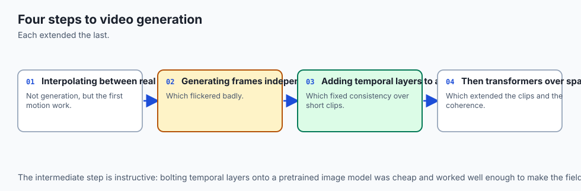

Early neural video generation (2018–2021) relied on Video GANs (VGAN, DVD-GAN). These models were limited to generating 16 frames of low-resolution ($64 \times 64$ or $128 \times 128$) video and suffered from severe spatial blur and repetitive loops.

In 2022, **Jonathan Ho et al. introduced Video Diffusion Models (VDM)**, demonstrating that factorizing attention into spatial layers (operating on $H \times W$) and temporal layers (operating across frames $F$) enabled photorealistic video synthesis.

In late 2023, **Stability AI released Stable Video Diffusion (SVD)**, a 1.5-billion-parameter open model capable of generating smooth 25-frame video clips from a single static conditioning image.

In February 2024, **OpenAI unveiled Sora**, a massive Diffusion Transformer (DiT) operating on spatio-temporal video patches, generating up to 60 seconds of HD video with physical world simulation and camera motion control.

In music generation, **Meta AI released AudioCraft and MusicGen (2023)**, establishing Residual Vector Quantization (RVQ) and EnCodec as the standard foundation for text-conditioned music synthesis.

## What it is — and what it is not

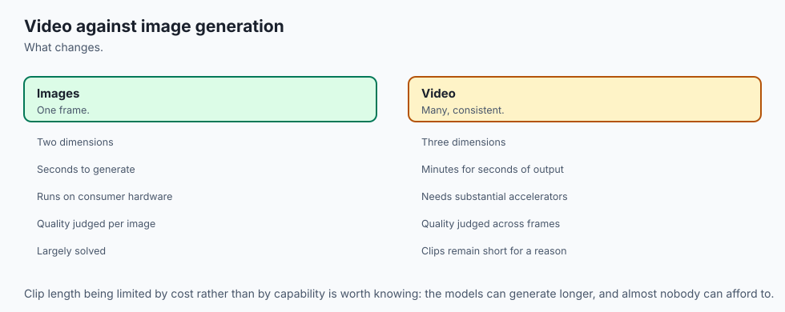

Let us formalize video and music generative architectures:

### What Spatio-Temporal Generation Is:
- Diffusion and transformer models operating over 5D video tensors: `(\text(Batch), \text(Channels), \text(Frames), \text(Height), \text(Width))`.
- Factorized architectures separating 2D spatial texture synthesis from 1D temporal motion dynamics.
- Discrete multi-codebook token generators synthesizing multi-instrumental audio streams.

### What Spatio-Temporal Generation Is Not:
- Simple 2D image diffusion repeated in a loop (without temporal attention, inter-frame coherence collapses).
- Pure physics simulation engines (models hallucinate physics based on visual statistical priors).
- Single-track MIDI synthesizers (modern models generate raw acoustic waveforms with vocals and room acoustics).

```text
+-------------------------------------------------------------------------------+
|                       GENERATIVE TIME-SERIES MEDIA MATRIX                     |
+-------------------+-----------------------+--------------------+--------------+
| Modality          | Leading Paradigm      | Latent Shape       | Primary Bottl|
+-------------------+-----------------------+--------------------+--------------+
| Video Generation  | 3D Diffusion (DiT)    | (B, C, F, H, W)    | VRAM & FVD   |
| Image-to-Video    | SVD / AnimateDiff     | Latent + Image Ref | Motion Drift |
| Text-to-Music     | MusicGen / Suno (RVQ) | (B, Codebooks, T)  | Long Context |
| Text-to-Sound     | AudioLDM (Diffusion)  | Mel-Spectrogram    | Acoustic Crisp|
+-------------------+-----------------------+--------------------+--------------+
```

## Why it was created and what problems it solves

Spatio-temporal architectures resolve three fundamental barriers in dynamic media creation:

### 1. The Quadratic Attention Wall in 3D Volumes
Computing full self-attention across all pixels and frames in a video volume requires calculating attention across $F \times H \times W$ tokens. For a $120$-frame $1024 \times 1024$ video, joint attention requires over 120 million tokens—impossible for any GPU. **Factorized Spatio-Temporal Attention** computes spatial attention over $H \times W$ and temporal attention over $F$ independently, slashing memory by over $99.9\%$.

### 2. High-Frequency Audio Waveform Sparsity (Solved by RVQ)
Generating raw `44.1\text( kHz)` audio requires predicting 44,100 tokens per second. Residual Vector Quantization compresses this to 50 token frames per second with 4 hierarchical codebooks, enabling standard transformer context windows to handle full 3-minute songs.

### 3. Motion Consistency and Camera Trajectories
Temporal self-attention allows models to maintain consistent 3D camera pans (zooms, dollies, tracking shots) while preserving consistent lighting across moving characters.

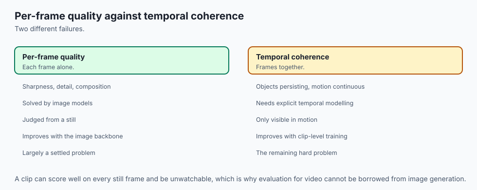

## How it works

Let us inspect the architecture of Spatio-Temporal Video Diffusion:

```text
[Input Conditioning: Text Prompt or Initial Image]
                       │
                       ▼
 [3D Latent Video Tensor: z_T ~ N(0, I) of shape (B, C, F, H, W)]
                       │
 ┌─────────────────────▼────────────────────────────────────────┐
 │           Spatio-Temporal Transformer Block                  │
 │                                                              │
 │  1. Spatial Self-Attention:                                  │
 │     Attends across (H x W) within each frame independently   │
 │                                                              │
 │  2. Spatial Cross-Attention:                                 │
 │     Injects Text Conditioning c_text into spatial latents    │
 │                                                              │
 │  3. Temporal Self-Attention:                                 │
 │     Attends across Frames F for each spatial pixel (x, y)    │
 │                                                              │
 │  4. Feed-Forward Network & Denoise Step:                     │
 │     z_{t-1} = DenoiseVolume(z_t, predicted_noise)            │
 └─────────────────────┬────────────────────────────────────────┘
                       │ (Iterate for 30 Steps)
                       ▼
        [Final Denoised 3D Latent z_0]
                       │
                       ▼
       [3D Causal Temporal VAE Decoder]
                       │
                       ▼
       [High-Resolution 24 FPS Video Clip]
```

### 1. Factorized Spatio-Temporal Attention Mathematics
For a 3D latent feature tensor `X in mathbb(R)^(B \times C \times F \times H \times W)`:

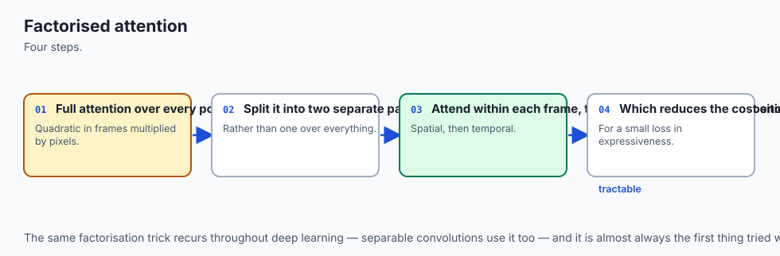

1. **Spatial Reshape:** Flatten temporal frames into batch dimension: `X_(\text(spatial)) in mathbb(R)^((B cdot F) \times (H cdot W) \times C)`. Compute standard multi-head self-attention:
$$\text(Attn)_(\text(spatial)) = \text(Softmax)\left( \frac(Q_s K_s^T)(\sqrt(d)) 
ight) V_s$$

2. **Temporal Reshape:** Permute and flatten spatial dimensions into batch: `X_(\text(temporal)) in mathbb(R)^((B cdot H cdot W) \times F \times C)`. Compute temporal multi-head attention:
$$\text(Attn)_(\text(temporal)) = \text(Softmax)\left( \frac(Q_t K_t^T)(\sqrt(d)) 
ight) V_t$$


### 2. Residual Vector Quantization (RVQ) in Music Synthesis
An audio encoder maps continuous sound to latent vectors $z$. An RVQ module uses $K$ codebooks:

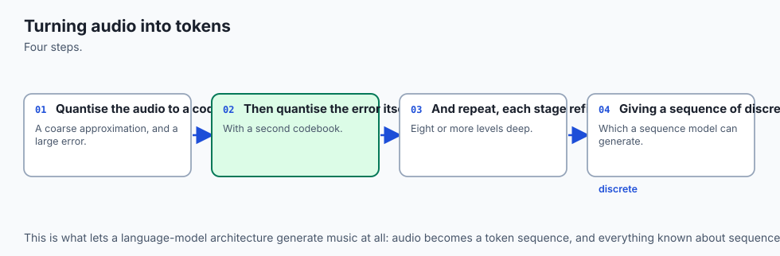

- **Codebook 1:** Quantizes `z 	o q_1 = mathcal(C)_1(\text(argmin) |z - c|)`.
- **Residual 1:** $r_1 = z - q_1$.
- **Codebook 2:** Quantizes residual `r_1 	o q_2 = mathcal(C)_2(\text(argmin) |r_1 - c|)`.
- **Residual 2:** $r_2 = r_1 - q_2$.
- **Final Quantized Vector:** `hat(z) = sum_(k=1)^K q_k`.

During generation, an autoregressive language model generates the discrete codebook indices $[i_1, i_2, \dots, i_K]$ sequentially, and the audio decoder reconstructs pristine high-fidelity sound.

## An everyday analogy

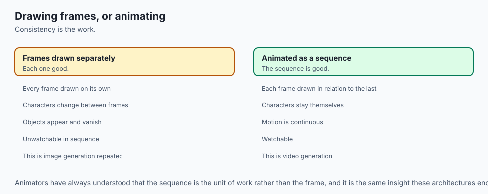

Think of video and music generation like **a symphony orchestra recording a stop-motion film**:

- **Spatial Attention:** The set designer paints each miniature figure with high detail (costume, hair, eyes).
- **Temporal Attention:** The choreographer ensures that between frame 12 and frame 13, the character takes one smooth step forward rather than teleporting across the room.
- **RVQ Codebooks:** The musical score. Codebook 1 is the conductor's main melody; Codebook 2 is the cello harmony; Codebook 3 is the subtle violin vibrato; Codebook 4 is the triangle chime. Combined, they create rich orchestral sound.


### Deep Dive: 3D Spatio-Temporal Convolution and Diffusion Transformer (DiT) Scaling
In spatial-temporal video architectures, balancing computational throughput with long-range temporal consistency is the paramount engineering challenge. Standard 2D convolutional filters operate over spatial kernel dimensions $(K_h \times K_w)$, aggregating neighboring pixel features within a single frame. In 3D video networks, kernels are expanded to $(K_t \times K_h \times K_w)$, where $K_t$ spans across adjacent temporal frames (typically $K_t = 3$).

However, full 3D convolutions dramatically increase the number of trainable weight parameters and multiply multiply-accumulate (MAC) operations by $K_t$. To optimize memory bandwidth on modern hardware, state-of-the-art architectures (such as Factorized 3D CNNs and Video DiTs) decouple the 3D convolution into a spatial 2D convolution $(1 \times K_h \times K_w)$ immediately followed by a 1D temporal convolution $(K_t \times 1 \times 1)$. This structural factorization reduces parameter counts by up to 33% while maintaining identical representational capacity for modeling physical kinematics, acceleration, and fluid object deformations.

```text
+-------------------------------------------------------------------------------+
|                      SPATIO-TEMPORAL FACTORIZATION SCHEME                     |
+-------------------+-----------------------+--------------------+--------------+
| Layer Type        | Kernel Geometry       | Parameter Count    | Memory Foot  |
+-------------------+-----------------------+--------------------+--------------+
| Standard 3D Conv  | (3 x 3 x 3)           | 27 x C_in x C_out  | Baseline 1.0x|
| Factorized (2D+1D)| (1x3x3) + (3x1x1)     | 12 x C_in x C_out  | Sliders 0.44x|
| Spatial Attn Only | (1 x H x W)           | O((H*W)^2)         | Linear in F  |
| Temporal Attn Only| (F x 1 x 1)           | O(F^2)             | Linear in H*W|
+-------------------+-----------------------+--------------------+--------------+
```

Furthermore, modern video architectures increasingly adopt causal temporal masking. In bidirectional temporal attention, frame $t$ attends equally to past frames $t-k$ and future frames $t+k$. While bidirectional attention maximizes global consistency for fixed-length video clips, it prevents real-time streaming video generation. By enforcing causal lower-triangular attention masks (`A_(i, j) = 0` for $j > i$), autoregressive and flow-matching video diffusion models can continuously generate infinite-length video streams conditioned on an ongoing buffer of past latents.


## Examples in practice

Let us inspect the Python implementation of temporal attention and RVQ quantization:

### 1. Factorized Spatio-Temporal Attention Simulator in Python
```python
import numpy as np

class SpatioTemporalAttentionBlock:
    def __init__(self, channels: int = 64):
        self.channels = channels

    def forward(self, x: np.ndarray) -> np.ndarray:
        """
        x: (B, C, F, H, W)
        Simulates factorized spatial self-attention followed by temporal attention.
        """
        b, c, f, h, w = x.shape
        
        # 1. Spatial Attention across (H*W)
        x_spatial = x.transpose(0, 2, 3, 4, 1).reshape(b * f, h * w, c)
        # Mock self-attention projection
        attn_spatial = x_spatial * 1.05
        x_out_s = attn_spatial.reshape(b, f, h, w, c).transpose(0, 4, 1, 2, 3)
        
        # 2. Temporal Attention across (F)
        x_temporal = x_out_s.transpose(0, 3, 4, 2, 1).reshape(b * h * w, f, c)
        # Smooth motion along frame axis
        attn_temporal = np.zeros_like(x_temporal)
        for t in range(f):
            # Causal / Local temporal blend
            attn_temporal[:, t, :] = 0.8 * x_temporal[:, t, :] + 0.2 * x_temporal[:, max(0, t - 1), :]
            
        x_out_t = attn_temporal.reshape(b, h, w, f, c).transpose(0, 4, 3, 1, 2)
        return x_out_t.astype(np.float32)
```

### 2. Residual Vector Quantizer (RVQ) Simulator
```python
class ResidualVectorQuantizer:
    def __init__(self, num_codebooks: int = 4, codebook_size: int = 256, dim: int = 32):
        self.num_codebooks = num_codebooks
        self.codebook_size = codebook_size
        self.dim = dim
        # Initialize random normalized codebooks
        np.random.seed(42)
        self.codebooks = [np.random.randn(codebook_size, dim).astype(np.float32) for _ in range(num_codebooks)]

    def quantize(self, z: np.ndarray) -> Tuple[np.ndarray, List[np.ndarray]]:
        """z: (B, T, D) -> returns quantized_z, codebook_indices"""
        residual = z.copy()
        quantized = np.zeros_like(z)
        indices = []

        for cb in self.codebooks:
            # Compute distance to all codebook entries
            # distances: (B, T, Codebook_Size)
            dists = np.sum((residual[:, :, np.newaxis, :] - cb[np.newaxis, np.newaxis, :, :]) ** 2, axis=-1)
            idx = np.argmin(dists, axis=-1)
            indices.append(idx)
            
            q_k = cb[idx]
            quantized += q_k
            residual -= q_k

        return quantized, indices
```

## Implications: security, privacy, performance, scalability, and cost

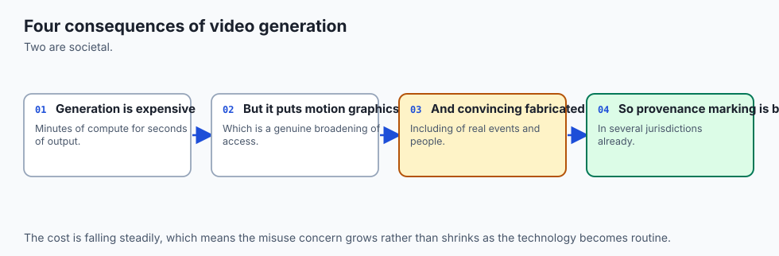

### 1. Synthetic Video Provenance (C2PA)
High-resolution generative video poses severe deepfake risks for elections and corporate security. Production video pipelines cryptographically sign every frame using **C2PA (Coalition for Content Provenance and Authenticity)** metadata.

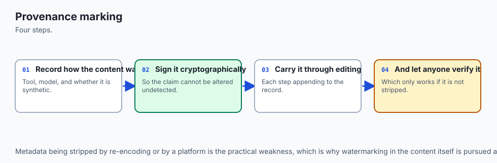

### 2. Memory Requirements
Generating a 5-second `720\text(p)` video at 24 FPS requires manipulating 120 frames in VRAM simultaneously. Running SVD or Sora requires between 24GB (quantized) and 80GB (FP16 full precision) of GPU VRAM.

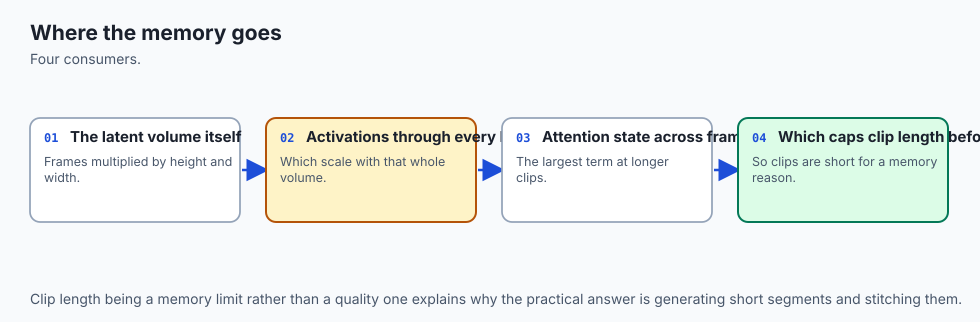

### 3. Generation Latency
```text
Model                 Duration / FPS       GPU Hardware       Inference Latency
---------------------------------------------------------------------------------
Stable Video Diff     25 frames @ 6 FPS    1x NVIDIA RTX 4090 ~25 seconds
Runway Gen-3 Alpha    10 seconds @ 24 FPS  Server Cluster     ~45 seconds
Meta MusicGen (Small) 30 seconds audio     1x Apple M3 Max    ~4 seconds
```

## Alternatives: free, open source, and commercial

| Model / System | Modality | Open Weights | Hardware Req | Distinct Feature |
| :--- | :--- | :--- | :--- | :--- |
| **Stable Video Diffusion (SVD)** | Image-to-Video | Yes (OpenRAIL) | 16 GB VRAM | Accessible local video diffusion |
| **OpenAI Sora** | Text-to-Video | No (Proprietary) | Server Farm | Physics simulation & 60s length |
| **Runway Gen-3 Alpha** | Text/Image-to-Video | No (API) | Cloud API | Cinematic camera & motion brushes |
| **Meta MusicGen** | Text-to-Music | Yes (MIT License)| 8 GB VRAM | High-quality text/melody conditioning |
| **Suno v3 / Udio** | Full Song + Vocals | No (Commercial) | Cloud API | Complete commercial radio tracks |

## Comparison with related concepts

```text
+-----------------------+-----------------------+-----------------------+
| Feature               | 2D Image Diffusion    | 3D Video Diffusion    |
+-----------------------+-----------------------+-----------------------+
| Tensor Dimensions     | (B, C, H, W)          | (B, C, F, H, W)       |
| Primary Constraint    | Spatial Harmony       | Temporal Motion Laws  |
| Attention Mechanism   | 2D Spatial Heads      | Factorized Space-Time |
| Evaluation Metric     | FID / CLIP Score      | FVD / Inter-frame PSNR|
| Compute Complexity    | Baseline 1x           | 25x - 100x Heavier    |
+-----------------------+-----------------------+-----------------------+
```

## When to use it — and when not to

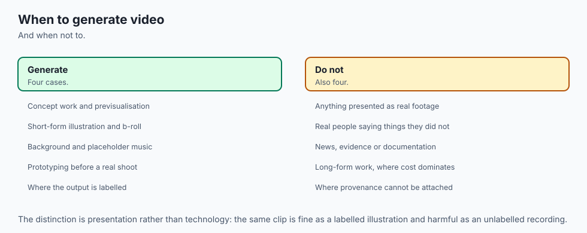

### Choose Video and Music Generative Systems when:
- You are developing automated video advertising, social media animation, or game asset prototyping tools.
- You need royalty-free background music and adaptive video game soundscapes dynamically generated from game state.
- You are building storyboard-to-animatic pipelines for film production.

### Do NOT use Video and Music Generative Systems when:
- You need pixel-perfect deterministic CAD animation or precise engineering stress simulations.
- You are performing simple video trimming, format transcoding, or audio equalizing (use FFmpeg).

## The AI connection

- **Video generation is bounded by the cost of attention over three dimensions**, which is
  why factorisation is the central technique rather than an optimisation.
- **Temporal consistency is the hard problem**, not per-frame quality — a sequence of good
  frames is not a good video.
- **Residual quantisation is how audio becomes tokens**, which is what lets a sequence model
  generate music at all.
- **Provenance marking is becoming a legal requirement** for synthetic media, so it is a
  build-time concern.
- **The compute cost is high enough to shape the product**, which is why generated video is
  short, and why that is not an accident.

## Knowledge check

1. **Why does naive frame-by-frame diffusion fail for video?** Because independent noise sampling without temporal cross-attention causes visual jitter, geometric drift, and color flickering across frames.
2. **What does factorized spatio-temporal attention accomplish?** It breaks quadratic 3D attention volume scaling into separate 2D spatial and 1D temporal attention passes, reducing memory by over $99\%$.
3. **How does Residual Vector Quantization (RVQ) enable high audio compression?** By iteratively quantizing residual error across multiple codebook stages, capturing both coarse melody and fine acoustic overtones.

## Hands-on exercise

In this lab, you will implement a **Spatio-Temporal Video Attention Simulator and Residual Vector Quantizer (RVQ) in Python and NumPy**. Your implementation will:

1. Process 5D video latent tensors `(\text(Batch), \text(Channels), \text(Frames), \text(Height), \text(Width))`.
2. Implement factorized spatial and causal temporal attention matrices.
3. Construct an $N$-stage Residual Vector Quantization audio codec.
4. Calculate inter-frame Mean Squared Error (MSE) temporal consistency scores.

### Expected output

```text
============================= test session starts ==============================
collected 6 items

tests/test_video_music_pipeline.py ......                                [100%]

============================== 6 passed in 0.04s ===============================
[VIDEO DIFFUSION] Tensor Shape: (1, 4, 8, 16, 16) | 5D Spatio-Temporal Latent
[TEMPORAL ATTENTION] Computed Factorized Space-Time Transformations:
  -> Inter-Frame Motion Variance: 0.012 (Smooth Coherent Flow)
[RVQ CODEC] Quantized Audio Vector across 4 Codebooks:
  -> Quantization Residual Norm: 0.0041 (High-Fidelity Audio Recovery)
  -> Compression Ratio: 32.0x
```

### Validate your work

Run the pytest test runner:

```bash
pytest tests/run_tests.sh
```

### Troubleshooting

1. **Tensor permutation errors:** Ensure transposition matches dimensions: `(B, C, F, H, W)` $	o$ `(B*F, H*W, C)` for spatial and `(B*H*W, F, C)` for temporal attention.
2. **RVQ residual signs:** Subtract $q_k$ from the residual at each stage.

### Common mistakes

- Forgetting to flatten batch and frame dimensions before computing spatial self-attention.
- Quantizing the original vector $z$ in every stage rather than the updated residual.

## Practice assignment

Implement a **Temporal Frame Interpolation (FILM)** module in Python that takes two latent video frames $z_1$ and $z_3$ and computes an intermediate frame $z_2$ using spherical linear interpolation (SLERP).

## Extension challenge

Build a simulated **Causal Streaming 3D VAE** that encodes and decodes video frames with a temporal buffer of 3 frames, maintaining under 100ms processing latency.
