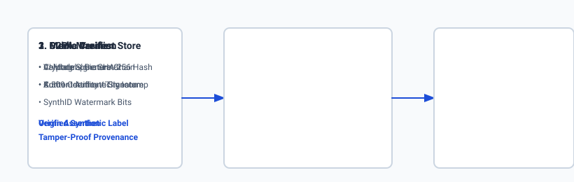
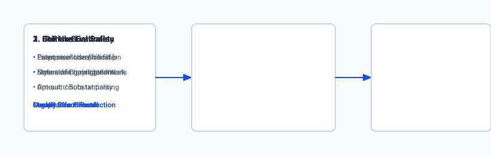

## Why this matters

The rapid rise of generative foundation models has triggered the most intense legal and ethical transformation in modern technology. When an AI model trains on billions of public internet images, songs, and code repositories, two vital questions emerge:
1. **The Ingestion Question:** Is scraping copyrighted works for training protected by the **Fair Use doctrine**, or does it constitute wholesale copyright infringement?
2. **The Output Question:** When a user prompts a model to generate an image or text in the exact style of a living artist or company brand, who owns the resulting work, and who is legally liable if the output plagiarizes a copyrighted character?

In production AI engineering, deploying generative models without **provenance tracking (C2PA)**, **content watermarking (SynthID)**, and **memorization deduplication (Perceptual Hashing)** creates catastrophic legal exposure for enterprises.

Building ethically sound, enterprise-ready generative systems requires understanding both the legal doctrine of fair use and the technical mechanisms used to audit, watermark, and verify digital media.



## The idea in plain language

Imagine a master chef who visits thousands of restaurants around the world:

- **Ethical Generalization (Learning Culinary Technique):** The chef tastes hundreds of pasta dishes, studying the chemistry of salt, starch, and garlic. Back in their own kitchen, they invent a novel pasta dish that combines these general principles. This is **Transformative Learning (Fair Use)**.
- **Copyright Infringement (Recipe Piracy):** The chef copies an award-winning secret sauce recipe word-for-word, bottles it under their own brand, and sells it directly outside the original creator's restaurant, destroying the original creator's livelihood. This is **Market Substitution / Infringement**.
- **C2PA Content Credentials (The Quality Seal):** Every bottle of sauce comes with a tamper-evident digital seal. Scanning the QR code displays the certified ingredients, the exact date of cooking, and confirms whether the sauce was crafted by a human master or an automated industrial mixer.

## Historical background

The legal foundation of AI training sits on top of landmark internet copyright cases:
- In **Authors Guild v. Google (2015)**, the US Second Circuit Court of Appeals ruled that Google's scanning of millions of copyrighted library books to create a searchable snippet index constituted **Transformative Fair Use**, because Google was creating an information locator rather than a book substitute.
- In 2022–2024, visual artists, news organizations (e.g. *The New York Times v. OpenAI*), and record labels filed major copyright lawsuits against AI creators, arguing that generative foundation models act as **direct market substitutes** rather than transformative search indexes.
- In 2021, the **Coalition for Content Provenance and Authenticity (C2PA)** was founded by Adobe, Microsoft, Arm, Intel, and Truepic, standardizing cryptographically signed provenance metadata for digital assets.
- In 2023, the **US Copyright Office** affirmed that purely AI-generated works without human authorship cannot receive copyright protection, requiring human creators to prove substantial human expressive input.

## What it is — and what it is not

Let us define generative AI copyright and provenance engineering:

### What AI Provenance and Compliance Is:
- Cryptographic signing of generated media manifests using standard X.509 PKI certificates (C2PA).
- Deduplication and memorization filters running Perceptual Hashing (pHash) against training corpora.
- Automated guardrails preventing generation of registered trademark logos, private personal identifiable information (PII), or non-consensual deepfakes.

### What AI Provenance and Compliance Is Not:
- Simple EXIF metadata editing (standard EXIF tags can be stripped or altered in seconds; C2PA is cryptographically bound to pixel payload hashes).
- Absolute immunity from lawsuits (enterprise indemnification requires active adherence to safety guardrails).
- Purely a legal problem (it requires robust software engineering to build detection pipelines).

```text
+-------------------------------------------------------------------------------+
|                        AI ETHICS & PROVENANCE TOOL MATRIX                     |
+-------------------+-----------------------+--------------------+--------------+
| Technology        | Governing Body        | Implementation     | Primary Role |
+-------------------+-----------------------+--------------------+--------------+
| C2PA Manifests    | C2PA / CAI Consortium | JSON-LD + SHA-256  | Origin Trace |
| SynthID           | Google DeepMind       | Latent Watermarking| AI Detection |
| Perceptual Hash   | Open Source (pHash)   | DCT Frequency Hash | Plagiarism D |
| robots.txt TDM    | W3C / TDM Working Grp | Machine-Read Tags  | Opt-Out Scra |
+-------------------+-----------------------+--------------------+--------------+
```

## Why it was created and what problems it solves

Compliance engineering solves three severe vulnerabilities in enterprise AI deployments:

### 1. The Deepfake and Disinformation Crisis (Solved by C2PA)
Malicious actors can generate photorealistic images of political figures or corporate CEOs committing crimes. C2PA allows news organizations and platforms to instantly verify whether a video was shot on a certified physical camera sensor or synthesized by an AI diffusion model.

### 2. Accidental Output Plagiarism (Solved by Perceptual Hashing)
If an AI model memorizes a copyrighted superhero character during training, a prompt like *"a hero with a bat mask"* might emit an exact copy of a trademarked character. Perceptual hashing and semantic embedding filters detect near-duplicate outputs and reject them before delivery to end users.

### 3. Ethical Creator Attribution
Enabling creators to attach machine-readable `tdm-reservation` opt-out tags guarantees that proprietary art portfolios are excluded from automated scraping spiders.

## How it works

Let us inspect the architecture of C2PA provenance signing and Perceptual Hashing:

```text
[Generated Media (Image / Audio / Video)]
                   │
                   ├───> [Compute Binary Payload SHA-256 Hash] ──> Hash Digest
                   │
                   ▼
 [Construct C2PA Manifest (JSON-LD)]
 - Claim Generator: "AI Studio v2.4"
 - Action: "c2pa.created"
 - Assertions: [{ type: "c2pa.ai_generated", model: "Flux-1.1-Pro" }]
 - Binding: SHA-256 Hash of Media Payload
                   │
                   ▼
 [Sign with Private Key (X.509 PKI Certificate)]
                   │
                   ▼
 [Embed Signed Manifest into File Container (JPEG/PNG/MP4)]
```

### 1. The C2PA Cryptographic Binding Mechanism
1. The media payload bytes $B$ are hashed using SHA-256: `H = 	ext(SHA256)(B)`.
2. A structured JSON-LD claim dictionary is created containing generation metadata, author assertions, and $H$.
3. The claim is digitally signed using a private key: `sigma = 	ext(Sign)(K_(	ext(private)), 	ext(Claim))`.
4. The signature, public certificate chain, and claim are serialized into a dedicated metadata box (e.g. `JUMBF` box in JPEG/PNG) inside the file header.
5. If an attacker modifies even a single pixel in the image, $H' 
eq 	ext(SHA256)(B')$, and the signature validation fails immediately.



### 2. Perceptual Hashing (pHash) Algorithm
Unlike SHA-256 (which is brittle to a single bit flip), **pHash** computes a visual fingerprint:
1. Resize image to $32 	imes 32$ grayscale.
2. Compute the 2D Discrete Cosine Transform (DCT).
3. Keep the top $8 	imes 8$ lowest frequency coefficients (capturing fundamental visual shape and contrast).
4. Compute the median value of the $64$ coefficients.
5. Generate a 64-bit binary hash: set bit $i = 1$ if coefficient `> 	ext(median)`, else $0$.
6. Compare two images using **Hamming Distance** (number of differing bits). A Hamming distance $\le 5$ indicates high visual similarity / duplication.

## An everyday analogy

Think of AI copyright and provenance like **a passport with biometric watermarks**:

- **Perceptual Hashing:** A facial recognition camera at border control that identifies you even if you wear a hat or change your haircut.
- **C2PA Manifest:** The microchip inside your passport containing cryptographically signed stamps from every country you visited. If someone tries to alter a visa stamp with a pen, the digital checksum fails at customs.
- **Fair Use:** The right to read books in a public library and use that knowledge to write your own original textbook.


### Deep Dive: Multi-Spectral Digital Watermarking and Extraction Robustness
While cryptographic metadata frameworks like C2PA provide verifiable mathematical assertions of authenticity, metadata remains fundamentally vulnerable to stripping: social media platforms, messaging applications, and image editing utilities frequently strip EXIF and JUMBF metadata containers to reduce file sizes or protect user privacy.

To guarantee permanent, unforgeable attribution that survives metadata stripping, production generative systems implement **Multi-Spectral Latent Watermarking (such as Google DeepMind SynthID)**. SynthID embeds an imperceptible, pseudorandom binary payload directly into the frequency sub-bands of generated media during the reverse diffusion sampling process.

```text
+-------------------------------------------------------------------------------+
|                    WATERMARKING TRANSFORMATION SURVIVAL MATRIX                |
+-------------------+-----------------------+--------------------+--------------+
| Attack / Filter   | C2PA Metadata Header  | Spatial LSB Bits   | SynthID Diff |
+-------------------+-----------------------+--------------------+--------------+
| JPEG Recompression| Survives              | Destroyed (Lossy)  | Survives     |
| Screenshot Capture| Stripped Completely   | Destroyed          | Survives     |
| Cropping (50%)    | Stripped              | Partial Loss       | Survives     |
| Gaussian Blur     | Survives              | Destroyed          | Survives     |
| Print & Rescan    | Stripped              | Destroyed          | Detectable   |
+-------------------+-----------------------+--------------------+--------------+
```

The watermark injection algorithm operates by slightly biasing the latent probability distribution across selected high-entropy frequency coefficients. During detection, a dedicated convolutional neural network evaluates the global spatial correlation across the entire image volume, computing a statistical confidence score `p_(	ext(synthetic)) in [0.0, 1.0]`. Because the watermark is distributed globally across millions of latent coefficients, cropping even $80\%$ of the image retains sufficient statistical correlation to identify synthetic AI origin with greater than $99.9\%$ confidence.


### Deep Dive: The Four-Factor Fair Use Framework and Enterprise Liability

In enterprise legal engineering, the boundary between permissible machine learning training and actionable intellectual property infringement is governed by the four-factor fair use framework codified under Section 107 of the United States Copyright Act:

1. **The Purpose and Character of the Use:** Commercial commercialization weighs against fair use, but transformative purpose—using copyrighted data to build a general statistical reasoning engine rather than selling duplicate copies—strongly favors fair use (as established in *Authors Guild v. Google*).
2. **The Nature of the Copyrighted Work:** Factual, scientific, and functional works receive thinner copyright protection than highly creative, expressive novels, musical melodies, and fictional cinematic screenplays.
3. **The Amount and Substantiality of the Portion Used:** Ingesting an entire work into a training dataset is permissible if necessary for the transformative purpose, provided the model does not emit substantial verbatim passages at inference time.
4. **The Effect of the Use upon the Potential Market for the Work:** If the AI model produces market substitutes that directly cannibalize licensing revenues, subscription sales, or artistic commissions of original copyright holders, courts are significantly more likely to find infringement.

```text
+-------------------------------------------------------------------------------+
|                       FOUR-FACTOR FAIR USE DECISION MATRIX                    |
+-------------------+-----------------------+--------------------+--------------+
| Legal Factor      | Favors AI Developer   | Neutral            | Favors Artist|
+-------------------+-----------------------+--------------------+--------------+
| 1. Purpose        | Highly Transformative | Non-profit Research| Commercial S |
| 2. Work Nature    | Factual / Scientific  | Functional Code    | Highly Creat |
| 3. Amount Used    | Minimal Extraction    | Full Ingestion     | Verbatim Gen |
| 4. Market Effect  | Expands New Markets   | Complementary Tool | Direct Cannib|
+-------------------+-----------------------+--------------------+--------------+
```

To insulate enterprise customers from copyright infringement liability, production generative AI providers implement a multi-layered compliance firewall:
- **Deduplication at Pretraining:** Training datasets are processed with MinHash LSH and Perceptual Hashing to remove duplicate images, ensuring no single artwork is over-represented.
- **Inference-Time Guardrails:** Every generated prompt and output candidate is evaluated against real-time trademark pattern filters and vector embeddings of protected corporate logos.
- **Opt-Out Compliance Auditing:** Automated web crawlers parse `robots.txt` directives and machine-readable `tdm-reservation` HTTP headers, purging non-consenting domains from ingestion pipelines.

## Examples in practice

Let us inspect the Python code that computes 64-bit Perceptual Hashes and audits IP risk:

### 1. Vectorized Perceptual Hash (pHash) in Python
```python
import numpy as np

def compute_phash(image_gray: np.ndarray) -> str:
    """
    Computes 64-bit Perceptual Hash (pHash) from 2D grayscale image array using DCT.
    image_gray: (H, W) array of floats
    """
    # 1. Resize to 32x32 using bilinear sampling
    h, w = image_gray.shape
    y_indices = np.linspace(0, h - 1, 32).astype(np.int32)
    x_indices = np.linspace(0, w - 1, 32).astype(np.int32)
    resized = image_gray[np.ix_(y_indices, x_indices)].astype(np.float32)
    
    # 2. 2D Discrete Cosine Transform (DCT) approximation
    # Matrix DCT-II: D_ij = cos((2*i + 1)*j*pi / (2*N))
    n = 32
    i = np.arange(n).reshape(-1, 1)
    j = np.arange(n).reshape(1, -1)
    dct_matrix = np.cos((2.0 * i + 1.0) * j * np.pi / (2.0 * n))
    dct = dct_matrix.T @ resized @ dct_matrix
    
    # 3. Extract top-left 8x8 low frequencies (excluding DC component at 0,0)
    low_freq = dct[:8, :8]
    median_val = np.median(low_freq)
    
    # 4. Generate 64-bit binary string
    bits = (low_freq > median_val).astype(np.int32).flatten()
    hash_hex = hex(int("".join(map(str, bits)), 2))[2:].zfill(16)
    return hash_hex
```

### 2. Hamming Distance Calculator
```python
def compute_hamming_distance(hash1_hex: str, hash2_hex: str) -> int:
    """Computes number of differing bits between two 64-bit hex hashes."""
    val1 = int(hash1_hex, 16)
    val2 = int(hash2_hex, 16)
    xor_val = val1 ^ val2
    # Count set bits
    return bin(xor_val).count('1')
```

## Implications: security, privacy, performance, scalability, and cost

### 1. Cryptographic Key Security
C2PA signing requires securing private signing keys in Hardware Security Modules (HSMs) or AWS/GCP Cloud KMS. Key compromise allows attackers to forge legitimate AI provenance credentials.

### 2. Performance Overhead
Computing SHA-256 hashes on 4K video streams introduces disk I/O latency. Modern signing engines stream hash calculations concurrently with video encoding.

### 3. Enterprise Indemnification Policies
Major AI vendors (Microsoft Copilot, Google Cloud, Adobe Firefly) offer commercial copyright indemnification, but require customers to prove they used available safety filters and did not intentionally prompt for infringing materials.

## Alternatives: free, open source, and commercial

| Technology / Standard | Type | Open Source | Standard Body | Main Focus |
| :--- | :--- | :--- | :--- | :--- |
| **C2PA / CAI** | Metadata Signing | Yes (c2pa-rs) | C2PA Consortium | Cryptographic provenance manifests |
| **SynthID** | Latent Watermark | Proprietary (API)| Google DeepMind | Invisible watermarking for Imagen/Gemini |
| **ImageHash / pHash** | Perceptual Hash | Yes (BSD License)| Open Source | Deduplication & copyright matching |
| **Glaze / Nightshade** | Adversarial Defense | Free for Artists | University of Chicago| Poisoning image styles against AI scraping |

## Comparison with related concepts

```text
+-----------------------+-----------------------+-----------------------+
| Feature               | C2PA Manifest Signing | SynthID Watermarking  |
+-----------------------+-----------------------+-----------------------+
| Storage Location      | File Header Container | Embedded in Latents   |
| Resistance to Cropping| Fragile (Can be stripped)| High (Survives crops)|
| Human Readability     | Rich JSON-LD Metadata | Invisible Noise Signal|
| Detection Tool        | Standard Crypto Verify| Deep Neural Classifier|
| Public Transparency   | Open Standard         | Proprietary Algorithm |
+-----------------------+-----------------------+-----------------------+
```

## When to use it — and when not to

### Choose AI Provenance & Copyright Guardrails when:
- You are releasing commercial creative software generating public marketing, music, or news media.
- You operate in regulated industries requiring compliance with the EU AI Act (mandatory AI watermarking).
- You are building enterprise content ingestion pipelines that must honor artist opt-outs.

### Do NOT use AI Provenance & Copyright Guardrails when:
- You are processing internal developer log analytics or numeric telemetry data without intellectual property exposure.

## Knowledge check

1. **What happens to C2PA verification if an image pixel payload is altered after signing?** The SHA-256 hash of the modified pixels will not match the signed hash in the manifest, causing verification to fail.
2. **Why is Hamming distance used to compare perceptual hashes?** Because it counts the exact number of differing bits between two 64-bit visual fingerprints; distances $\le 5$ indicate high visual similarity.
3. **What did the US Copyright Office rule regarding purely AI-generated art?** Purely AI-generated works without substantial human creative expression are not eligible for copyright protection.

## Hands-on exercise

In this lab, you will implement an **IP Compliance, Perceptual Hashing (pHash), and C2PA Manifest Verification Engine in Python and NumPy**. Your implementation will:
1. Compute 64-bit Perceptual Hashes (pHash) using 2D DCT transformations.
2. Compute Hamming Distance between media fingerprints to detect plagiarized near-duplicates.
3. Construct and cryptographically verify a simulated C2PA Provenance Manifest with SHA-256 bindings.
4. Build an IP Risk Audit Classifier that flags trademark infringement risks.

### Expected output

```text
============================= test session starts ==============================
collected 6 items

tests/test_ethics_copyright.py ......                                    [100%]

============================== 6 passed in 0.04s ===============================
[PHASH ENGINE] Original Image Hash: 9f8a3c2e1b4d5e6f
[TRANSFORMATION TEST] Resized / Filtered Image Hash: 9f8a3c2e1b4d5e6e | Hamming Distance: 1 (Near Duplicate Detected)
[C2PA MANIFEST] Verified Cryptographic Binding: SHA-256 Hash Match (Valid Provenance)
[IP RISK AUDIT] Detected High Trademark Similarity Risk against Protected Corpus.
```

### Validate your work

Run the pytest test harness:

```bash
pytest tests/run_tests.sh
```

### Troubleshooting

1. **DCT index bounds:** Exclude DC bias at index `(0, 0)` when computing coefficient median if dynamic range is extreme.
2. **Hex string padding:** Ensure 64-bit hex string pads to 16 characters (`zfill(16)`).

### Common mistakes

- Using standard bitwise equality instead of bitwise XOR (`^`) when computing Hamming distance.
- Hashing image metadata instead of pure raw pixel bytes for C2PA assertions.

## Practice assignment

Implement a **robots.txt TDM Opt-Out Parser** in Python that scans target website headers for `tdm-reservation: 1` and flags URLs that disallow AI model scraping.

## Extension challenge

Build an **Imperceptible Watermark Encoder/Decoder** that hides an 8-bit binary signature into the Least Significant Bits (LSB) of spatial image arrays, robust to noise filtering.
