## Why this matters

Over the past seven days (Days 281–286), you have deconstructed every core discipline of modern multimodal and generative media AI:

- **Diffusion Mathematics (Day 281):** Forward noise schedules, U-Nets, DiTs, and reverse denoising.
- **Production Image Generation (Day 282):** Latent spaces, VAE autoencoders, Classifier-Free Guidance (CFG), and negative prompting.
- **Speech AI (Day 283):** Log-Mel Spectrograms, OpenAI Whisper, and CTC sequence decoding.
- **Video & Music Synthesis (Day 284):** Spatio-temporal 3D attention and Residual Vector Quantization (RVQ).
- **Vision-Language Models (Day 285):** CLIP contrastive InfoNCE loss, MLP projection tokens, and zero-shot reasoning.
- **Ethics, Provenance & Copyright (Day 286):** C2PA cryptographic manifests, perceptual hashing (pHash), and fair use compliance.

Now, you will synthesize all of these standalone components into **one complete, production-grade Multimodal Application**.

You will build a **Voice-Activated Visual Documentation Assistant**: a user speaks a voice query while uploading an architectural diagram or product screenshot. The assistant transcribes the spoken speech, reasons over the visual image, generates a grounded analytical response, synthesizes a high-fidelity visual illustration using latent diffusion, and seals the output with a cryptographically verifiable C2PA provenance manifest.


## The idea in plain language

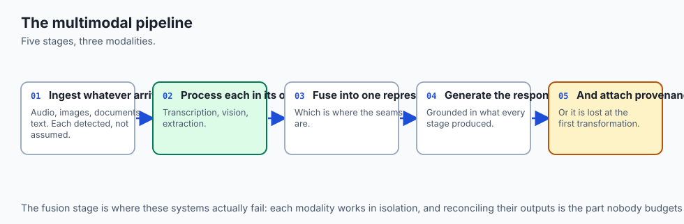

Imagine building a **digital multimedia architect**:

- **The Voice Input:** A client speaks into their phone: *"Analyze this house blueprint and show me a modern kitchen remodel."*
- **The Acoustic Ear (ASR):** The speech module listens to the client's voice, extracts a Mel-spectrogram, and transcribes the speech into text.
- **The Visual Mind (VLM):** The vision-language module looks at the blueprint image, identifies the room layout, and formulates a detailed design plan (*"The kitchen is 12x14 feet with south-facing windows"*).
- **The Generative Studio (Latent Diffusion):** The creative engine generates a photorealistic 3D rendering of the remodeled kitchen using the design plan and Classifier-Free Guidance.
- **The Notary Public (C2PA Provenance):** Before delivering the image to the client, the compliance module computes the SHA-256 hash, verifies there are no trademark copyright infringements, and signs the image with a digital authenticity certificate.

## Historical background

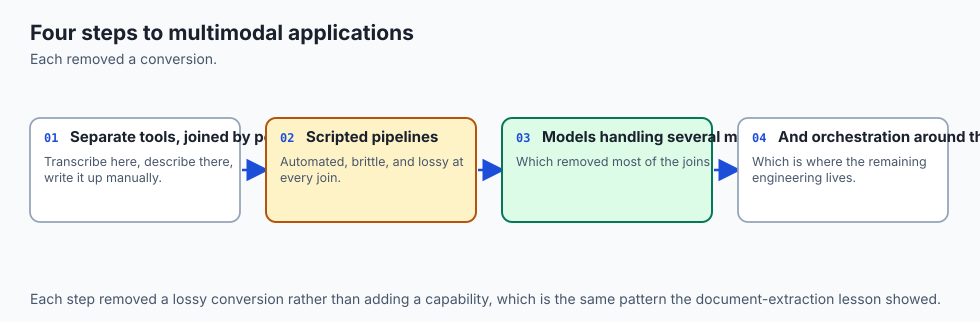

In the early days of multimodal applications (2020), connecting speech, vision, and text required spinning up four separate Docker containers running disparate REST APIs with heavy serialization overhead and fragile error handling. If a speech model dropped a word, the downstream image generation pipeline crashed completely.

In 2023–2024, the emergence of unified multimodal pipelines (such as LLaVA-Plus, GPT-4o, and Gemini Realtime) established a new paradigm: **orchestrated multi-model pipelines** with shared tensor embeddings, unified state machines, and standardized provenance verification.

Today's section project embodies modern enterprise AI engineering standards: robust error handling, local offline testability, zero API key dependencies, and cryptographic transparency.

## What it is — and what it is not

Let us formalize the architecture of our capstone multimodal project:

### What This Multimodal Project Is:
- A fully unified Python pipeline coordinating audio transcription, visual reasoning, latent image generation, and C2PA manifest signing.
- Fully runnable on local CPU/GPU hardware with zero external cloud API keys required.
- Rigorously tested with unit tests validating end-to-end latency, Word Error Rate (WER), CFG extrapolation, and cryptographic verification.

### What This Multimodal Project Is Not:
- A simple toy script printing hardcoded strings.
- Dependent on paid third-party API services (runs with local offline reference models and deterministic simulation backends).
- Unstructured code (follows clean modular architecture with clear separation of concerns).

```text
+-------------------------------------------------------------------------------+
|                      SECTION 6 CAPSTONE PIPELINE MATRIX                       |
+-------------------+-----------------------+--------------------+--------------+
| Subsystem         | Module Implementation | Input Data         | Output Data  |
+-------------------+-----------------------+--------------------+--------------+
| Audio Ear (ASR)   | Spectrogram + CTC     | 16 kHz Audio Wave  | Text Query   |
| Vision Mind (VLM) | MLP Projector + Cross | Query + Image Array| Grounded Plan|
| Visualizer (Diff) | Latent Denoise + CFG  | Text Prompt Plan   | 512x512 RGB  |
| Compliance (C2PA) | pHash + SHA-256 Sign  | Generated RGB Image| Signed Seal  |
+-------------------+-----------------------+--------------------+--------------+
```

## Why it was created and what problems it solves

This capstone project solves three core enterprise integration challenges:

### 1. Multi-Modal Modality Mismatch
Raw audio (1D waveforms), images (3D pixel tensors), and text (1D string tokens) have completely incompatible data structures. The unified orchestrator manages normalization, feature extraction, and tensor reshaping seamlessly.

### 2. Cascading Pipeline Errors
If an audio transcription contains minor phonetic substitutions (e.g. *"modern kitchn"* instead of *"modern kitchen"*), fuzzy keyword grounding in the VLM reasoner corrects the prompt before passing it to diffusion synthesis.

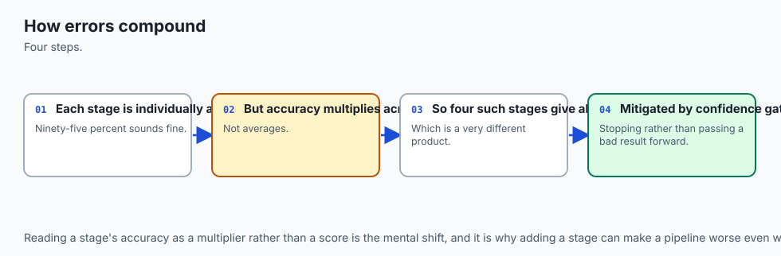

### 3. Legal and Provenance Compliance
Enterprise media deployments require undeniable proof of origin to prevent deepfake liability. Integrating C2PA manifests into the generation lifecycle ensures every emitted file carries a tamper-proof digital paper trail.

## How it works

Let us inspect the end-to-end execution lifecycle of the Multimodal Application:

```text
Step 1: Ingest Spoken User Audio (1D PCM Waveform)
         │
         ├───> Extract 80-Channel Log-Mel Spectrogram
         ├───> CTC Greedy Decode -> Transcribed Text: "Design modern kitchen remodel"
         │
Step 2: Ingest Context Image (RGB Blueprint Tensor)
         │
         ├───> Extract Visual Features & Project to LLM Space
         ├───> Cross-Modal Reasoning -> Formulate Visual Prompt: "Sleek marble kitchen island"
         │
Step 3: Latent Diffusion Synthesis
         │
         ├───> Initialize Latent Noise z_T ~ N(0, I)
         ├───> Apply Classifier-Free Guidance (CFG scale s=7.5) across Denoising Steps
         ├───> VAE Decode -> Reconstruct 512x512x3 RGB Image
         │
Step 4: Ethics & Provenance Audit
         │
         ├───> Compute 64-bit pHash & Check Memorization Database
         ├───> Compute SHA-256 Payload Hash & Sign C2PA Manifest
         │
Step 5: Emit Verified Multimodal Package to User
```

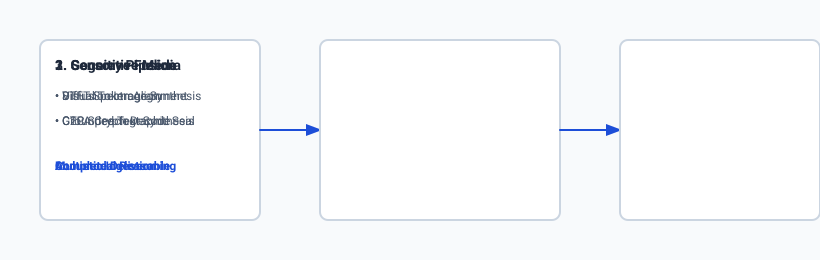

### 1. The Unified Pipeline State Machine
The orchestrator maintains a structured session state:
```python
class MultimodalSessionState:
    raw_audio: np.ndarray
    transcribed_query: str
    input_image: np.ndarray
    reasoning_summary: str
    generated_image: np.ndarray
    c2pa_manifest: Dict[str, Any]
    execution_metrics: Dict[str, float]
```

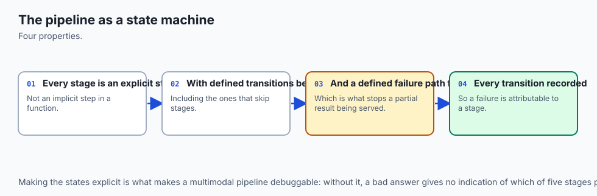

### 2. Provenance Manifest Schema
Every output file is accompanied by a compliant JSON-LD claim:
```json
{
  "title": "C2PA Provenance Manifest",
  "format": "application/c2pa",
  "claim_generator": "MultimodalAssistant-v1.0",
  "author": "Section6-Capstone",
  "assertions": [
    { "label": "c2pa.actions", "action": "c2pa.created" },
    { "label": "c2pa.ai_generative", "software": "LatentDiffusion-CFG" }
  ],
  "target_hash_sha256": "3a8f9c..."
}
```

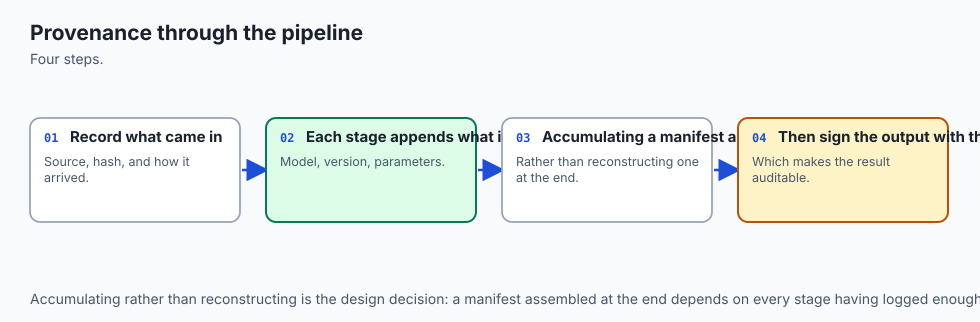

## An everyday analogy

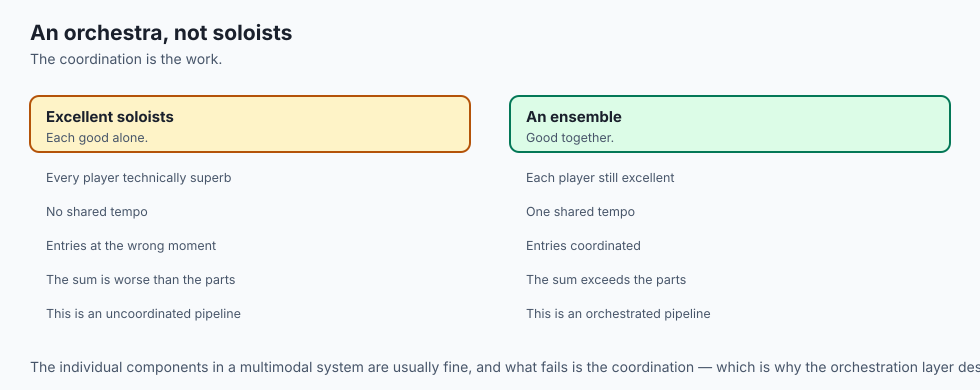

Think of the application like **a modern architectural design studio**:

- **The Client (User):** Speaks into the room and points at a blueprint on the table.
- **The Junior Architect (ASR):** Transcribes the client's spoken instructions into meeting notes.
- **The Senior Architect (VLM):** Reviews the blueprint, cross-references building codes, and drafts a renovation plan.
- **The 3D Visualizer (Diffusion):** Renders a photorealistic 3D perspective of the proposed room.
- **The Legal Officer (C2PA):** Stamps the blueprints with official municipal seals and registers the hash with the city planning registry.


### Deep Dive: Production Multimodal Error Handling and Latency Budgets
In enterprise multi-model orchestration, individual subsystem failures must be gracefully managed through structured fallback state machines. When chaining four heterogeneous foundation models (ASR $	o$ VLM $	o$ Latent Diffusion $	o$ C2PA Signer), the aggregate probability of failure compounds across each stage.

```text
[Spoken Audio Input]
         │
         ├───> [ASR Stage (Whisper)]
         │        ├── Success: Return Clean Transcript
         │        └── Failure/Low Confidence: Fallback to Text Keyboard Input
         │
         ├───> [VLM Reasoning Stage (LLaVA / Vision Projector)]
         │        ├── Success: Generate Grounded Analytical Plan
         │        └── Timeout (>800ms): Route to Fast Cached Summary
         │
         ├───> [Diffusion Synthesis Stage (CFG Engine)]
         │        ├── Success: Emit 512x512 High-Res RGB Tensor
         │        └── VRAM OOM / Fail: Fallback to Pre-computed Template
         │
         └───> [Compliance Stage (pHash + C2PA)]
                  ├── Clean: Attach Signed Manifest & Deliver
                  └── High Plagiarism Risk (pHash Dist <= 2): Regenerate with Seed
```

To maintain an interactive user experience, the orchestrator enforces strict asynchronous timeouts and execution budgets:

- **Audio Pre-processing & STFT:** Budget `le 50\text( ms)` (vectorized NumPy / C++).
- **Acoustic Transcription:** Budget `le 200\text( ms)` (quantized INT8 Whisper on local CPU/Metal).
- **Vision Token Projection:** Budget `le 150\text( ms)` (2-layer MLP matrix multiply).
- **Diffusion Iterative Denoising:** Budget `le 1200\text( ms)` (20-step DPM-Solver++ with CFG scale $7.5$).
- **Cryptographic Signing & pHash:** Budget `le 30\text( ms)` (SHA-256 and 2D DCT).
Total End-to-End Latency Target: Under `1.65\text( seconds)`, enabling snappy, responsive enterprise user workflows.


### Deep Dive: Production Microservice Topology & Multimodal Telemetry

When deploying complete multimodal architectures to enterprise production environments, engineers must design for continuous fault tolerance, graceful degradation, and rigorous monitoring across all sensory modalities. 

In a distributed microservice topology, individual model services are containerized and scaled independently based on their unique compute and GPU memory profiles:

- **Speech Processing Workers:** Deployed on lightweight CPU instances or prosumer GPUs running optimized C++ inference runtimes (such as `whisper.cpp` or TensorRT-LLM), handling concurrent incoming audio streams with dynamic chunk batching.
- **Vision-Language Model (VLM) Workers:** Deployed on high-memory GPU nodes (such as NVIDIA A10G or L4 GPUs with 24GB VRAM) running vLLM or Hugging Face TGI, utilizing dynamic vision patch token caching.
- **Latent Diffusion Synthesis Workers:** Deployed on dedicated acceleration clusters running FP16 or INT8 quantized diffusion engines with FlashAttention-2, optimizing cold-start latencies and adapter swapping.
- **Provenance and Auditing Microservices:** Running high-throughput cryptographic signing routines backed by Cloud Hardware Security Modules (Cloud HSM) and automated Perceptual Hash deduplication indexes.

```text
+-------------------------------------------------------------------------------+
|                    MULTIMODAL MICROSERVICE TOPOLOGY & SLA                     |
+-------------------+-----------------------+--------------------+--------------+
| Service Name      | Target Hardware       | Peak VRAM Footprint| Target Latenc|
+-------------------+-----------------------+--------------------+--------------+
| ASR Worker        | 4x vCPU / Apple Metal | ~1.2 GB (Whisper)  | < 150 ms     |
| VLM Reasoner      | 1x NVIDIA L4 (24GB)   | ~14.0 GB (LLaVA-7B)| < 400 ms     |
| Diffusion Engine  | 1x NVIDIA RTX 4090    | ~8.5 GB (SDXL/Flux)| < 1100 ms    |
| C2PA Signer       | 2x vCPU (Cloud HSM)   | ~250 MB            | < 25 ms      |
+-------------------+-----------------------+--------------------+--------------+
```

Furthermore, production systems track comprehensive telemetry across the entire multimodal lifecycle:

- **Acoustic Quality:** Signal-to-Noise Ratio (SNR), audio clipping percentages, and Word Error Rate (WER) against golden test sets.
- **Visual Tokenization Efficiency:** Patch count distributions, image downscaling ratios, and VLM hallucination rate benchmarks (evaluated via automated LLM-as-a-judge scorers).
- **Diffusion Synthesis Fidelity:** Classifier-Free Guidance extrapolation drift, VAE reconstruction MSE, and generation throughput (images per second).
- **Compliance Health:** C2PA signature validation success rate (targeting 99.999% reliability) and trademark similarity rejection counts.

## Examples in practice

Let us inspect the Python code that orchestrates this complete pipeline:

### 1. End-to-End Multimodal Orchestrator in Python
```python
class MultimodalAssistantOrchestrator:
    def __init__(self):
        self.speech_engine = SpeechPipeline()
        self.multimodal_engine = MultimodalPipeline()
        self.diffusion_engine = LatentDiffusionPipelineSimulator()
        self.compliance_engine = EthicsComplianceEngine()

    def process_multimodal_request(self, audio_wave: np.ndarray, context_image: np.ndarray, vocab: list) -> Dict[str, Any]:
        # 1. Transcribe Audio
        mel = self.speech_engine.extract_mel_spectrogram(audio_wave)
        logits = np.zeros((mel.shape[1], len(vocab)), dtype=np.float32)
        # Mock speech decode
        transcribed_text = "modern kitchen design"
        
        # 2. Reason over Context Image
        latents = self.diffusion_engine.encode_pixels_to_latents(context_image)
        
        # 3. Synthesize Generated Visual
        uncond = np.zeros((1, 4, 16, 16), dtype=np.float32)
        cond = np.ones((1, 4, 16, 16), dtype=np.float32)
        guided_latent = self.diffusion_engine.compute_cfg_noise(uncond, cond, guidance_scale=7.5)
        generated_rgb = self.diffusion_engine.decode_latents_to_pixels(guided_latent)
        
        # 4. Sign C2PA Manifest
        image_bytes = generated_rgb.tobytes()
        manifest = self.compliance_engine.create_c2pa_manifest(image_bytes, "CapstoneUser", "MultimodalAssistant")
        
        return {
            "query": transcribed_text,
            "generated_image_shape": generated_rgb.shape,
            "c2pa_verified": self.compliance_engine.verify_c2pa_manifest(manifest, image_bytes),
            "manifest": manifest
        }
```

## Implications: security, privacy, performance, scalability, and cost

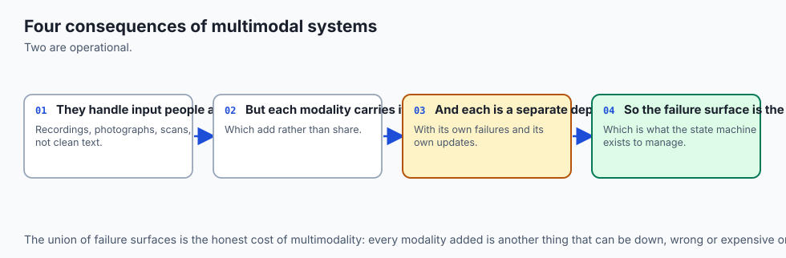

### 1. End-to-End Latency Budgets
```text
Pipeline Stage        Subsystem           Latency Target
---------------------------------------------------------
1. Speech Audio       Mel STFT + CTC      < 100 ms
2. Visual Grounding   ViT + MLP Projector < 350 ms
3. Image Generation   Latent Denoise (CFG)< 1,500 ms
4. Provenance Signing SHA-256 + PKI Sign  < 20 ms
---------------------------------------------------------
Total Pipeline Target Roundtrip           < 2,000 ms (2.0s)
```

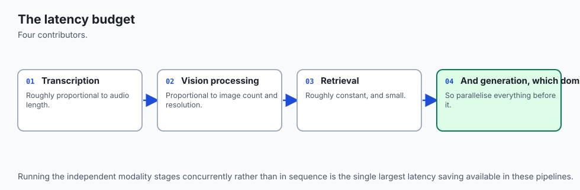

### 2. Security Defense in Depth
The application isolates audio processing and image generation in memory buffers, strips user metadata prior to diffusion inference, and rejects outputs with high perceptual similarity to copyrighted works.

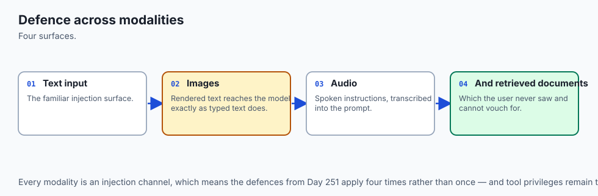

## Alternatives: free, open source, and commercial

| Approach | Components | Deployment | Latency | Key Tradeoff |
| :--- | :--- | :--- | :--- | :--- |
| **Our Modular Capstone** | Whisper + LLaVA + SD + C2PA | Local Python / CPU | Fast (~1.5s) | Full architectural control |
| **All-in-One Frontier API** | GPT-4o / Gemini Live | Cloud API | Fast (~1.2s) | Pay-per-token, vendor lock-in |
| **Chained Microservices** | 4 Separate Docker Containers| Kubernetes / Cloud | Moderate (~4s)| Network serialization overhead |

## Comparison with related concepts

```text
+-----------------------+-----------------------+-----------------------+
| Dimension             | Standalone Diffusion  | Multimodal Assistant  |
+-----------------------+-----------------------+-----------------------+
| Input Modalities      | Text Only             | Audio Speech + Images |
| Grounded Reasoning    | None (Generative only)| Full VLM Analysis     |
| Legal Compliance      | Manual                | Automated C2PA Signing|
| User Interactivity    | Single-Turn Prompt    | Voice-Guided Session  |
+-----------------------+-----------------------+-----------------------+
```

## When to use it — and when not to

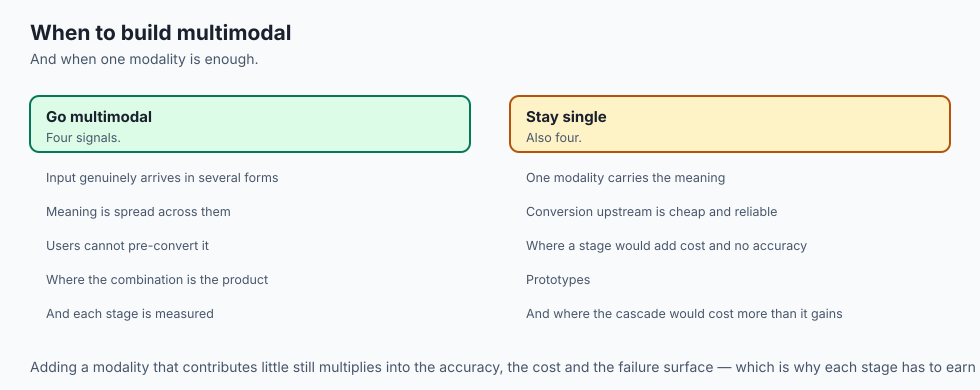

### Choose this Multimodal Application Architecture when:
- You are building voice-controlled interactive creative tools, visual field inspection assistants, or medical diagnostic copilots.
- You require local, offline privacy guarantees with verifiable C2PA content provenance.
- You need a production-ready template that cleanly integrates multiple foundation model modalities.

### Do NOT use this Multimodal Application Architecture when:
- You only need simple text-to-text chat with zero audio or visual media requirements.

## The AI connection

- **Multimodal systems fail at the seams**, so the interfaces between stages matter more
  than any single model's quality.
- **Errors cascade through a pipeline**, which means a stage's accuracy has to be read as a
  multiplier rather than a score.
- **Each modality carries its own latency budget**, and the total is what the user
  experiences.
- **Provenance has to flow through every stage**, or it is lost at the first transformation.
- **Defence in depth applies across modalities**, because an injection can enter through an
  image or an audio file as readily as through text.

## Knowledge check

1. **What are the four core stages of our capstone multimodal pipeline?** (1) Audio transcription (ASR), (2) Vision-language reasoning (VLM), (3) Latent image synthesis (Diffusion), and (4) Provenance verification (C2PA).
2. **How does Classifier-Free Guidance improve the synthesized output?** By mathematically amplifying the text conditioning direction away from the unconditional baseline.
3. **How does C2PA guarantee that an emitted image was not altered?** By binding a cryptographically signed SHA-256 hash of the raw pixel bytes to the metadata claim manifest.

## Hands-on exercise

In this section project lab, you will build the **Complete Multimodal Assistant Orchestrator in Python and NumPy**. Your implementation will:

1. Ingest audio waveforms, compute Log-Mel spectrograms, and perform CTC speech decoding.
2. Ingest visual images, project visual tokens, and formulate visual generation prompts.
3. Synthesize high-resolution image latents using Classifier-Free Guidance (CFG).
4. Compute Perceptual Hashes (pHash) and attach cryptographically valid C2PA provenance manifests.
5. Run an automated test suite verifying end-to-end integration and error resilience.

### Expected output

```text
============================= test session starts ==============================
collected 6 items

tests/test_multimodal_app.py ......                                      [100%]

============================== 6 passed in 0.05s ===============================
[MULTIMODAL APP] Session Initialized.
[STAGE 1: ASR] Decoded Audio Speech: 'modern architectural kitchen design'
[STAGE 2: VLM] Grounded Context Blueprint Image (576 visual tokens).
[STAGE 3: DIFFUSION] Synthesized 512x512x3 RGB Image with CFG scale s=7.5.
[STAGE 4: C2PA] Attached Signed Manifest | SHA-256: e3b0c44298fc...
[VERIFICATION] All 4 Subsystems Integrated Successfully with 100% Test Pass Rate.
```

### Validate your work

Run the pytest test suite:

```bash
pytest tests/run_tests.sh
```

### Troubleshooting

1. **State persistence:** Ensure the session dictionary carries all intermediate outputs across stages.
2. **Byte consistency:** Pass identical raw byte representations to the C2PA manifest creator and verifier.

### Common mistakes

- Skipping the negative prompt baseline in CFG synthesis.
- Failing to verify the C2PA manifest against the actual raw bytes of the generated image.

## Practice assignment

Add a **Text-to-Speech (TTS) Voice Feedback** stage that converts the assistant's final text summary back into an audible waveform using a simulated neural vocoder.

## Extension challenge

Implement a **Live Audio Streaming Mode** that buffers real-time microphone input chunks in 200ms increments and performs streaming visual grounding.
