## Why this matters

Here are two accuracy scores for the same clustering of the same dataset:

```text
accuracy taking cluster ids literally  : 0.2400
accuracy after the best relabelling    : 0.8933
difference, from numbering alone       : 0.6533
```

Nothing changed between those two lines. Not the data, not the algorithm, not
the seed, not a single point's group membership. The partition of the 150 iris
flowers is byte for byte identical in both. What changed is which integer
k-means happened to write on each group, and that integer is decided by where
the algorithm's centroids drifted during a numerical optimisation nobody
inspected.

Sixty-five accuracy points, from a labelling convention.

That gap exists because the question "how accurate is this clustering?" is not
a question. Clustering does not produce answers, so it cannot produce wrong
ones. The moment you compare cluster identifiers to class labels you have
smuggled in an answer key that the method was never given and does not know
about — and if you are going to smuggle in an answer key, you may as well have
used it properly in the first place.

This is the day the three-box diagram earns its keep or gets thrown away. You
have seen it: supervised, unsupervised, reinforcement, three boxes with
algorithms sorted into them. As a filing system for algorithms it is close to
useless, because the same algorithm keeps turning up in more than one box.
k-nearest-neighbours does classification and it does anomaly detection. A
neural network does all three. Gradient descent does not care which box you
are in.

The taxonomy that survives contact with real work is not about algorithms at
all. **It is about the shape of the feedback signal your learner is given** —
and once you see it that way, every practical consequence falls out of the
shape rather than having to be memorised alongside it.

Three shapes, and only three:

| Setting | What you are told | What you are never told |
| --- | --- | --- |
| Supervised | the correct output, for every input | nothing — you hold the answer key |
| Unsupervised | the inputs, and nothing else | whether anything you found is right |
| Reinforcement | how good the action you took was | what any other action would have paid |

The third row is the one that gets underestimated, and it is the one this
lesson spends the most time on. Evaluative feedback is not weakened
supervision. It is a categorically different kind of information, and the gap
between the two is measurable. In today's lab a reinforcement agent that never
explores takes the best of ten actions 31.3% of the time. The identical
algorithm, spending one pull in ten on a random action, takes it 70.8% of the
time. Thirty-nine points, for a single parameter, because the greedy agent was
never told what it was missing and never went to look.

## The idea in plain language

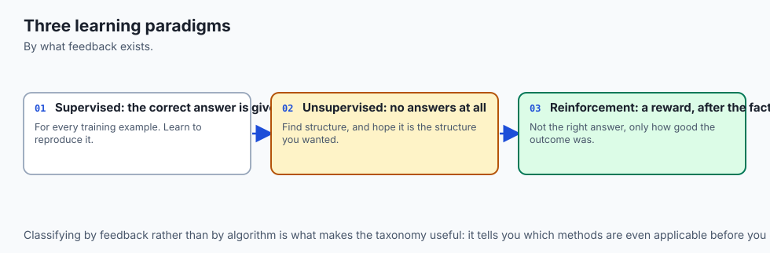

Imagine three ways of being taught to cook.

In the first, you have a teacher standing beside you with the finished dish.
Every time you produce something, the teacher shows you exactly what it should
have looked like and tasted like. You can compare, adjust, and compare again.
You will never be in doubt about whether you are improving, because the target
is right there. This is **supervised learning**, and the reason it dominates
practice is not that it is more powerful — it is that it is by far the easiest
situation to be in.

In the second, you are handed a crate of ingredients and told to organise
them. No recipes, no dishes, nobody to say whether you did it right. You could
sort by colour, by weight, by shelf life, by cuisine, by which drawer they
fit in. Every one of those is a real structure genuinely present in the
crate. None of them is *the* structure, because there is no such thing.
This is **unsupervised learning**, and its difficulty is not computational.
It is that "correct" is undefined, and any evaluation you invent is a
statement about your priorities rather than about the data.

In the third, you are cooking for a customer behind a hatch. You send out a
dish, and some time later a number comes back: seven out of ten. You are not
told what would have scored nine. You are not told which of your fifteen
decisions cost you the three points. If you send out the same dish again you
get another number, and if you never send out anything else you will never
find out that the thing you stopped making in week one was the best dish on
your menu. This is **reinforcement learning**, and its two distinctive
difficulties are both visible in that description: the feedback is
**evaluative** rather than instructive, and it is often **delayed** so far
past the decision that connecting the two is itself the hard problem.

![Diagram: three columns headed supervised, unsupervised and reinforcement. Each column shows a solid blue panel for what the learner is told and a dashed grey panel for what it is never told. Supervised is told the correct output for every single input and is told nothing back, scoring 0.92 with a 5-NN on iris. Unsupervised is told only the inputs and is never told whether what it found is right, scoring either 0.24 or 0.8933 on iris depending only on how its clusters are numbered. Reinforcement is told a score for the action it actually took and is never told the counterfactual, reaching the best arm 0.313 of the time when greedy and 0.708 when it explores. Below, a note states that the deciding question is not whether you have labels but whether the learner's own actions change the data it sees next](./assets/three-kinds-of-feedback-architecture.svg)

The single most useful thing on that diagram is the note at the bottom, and it
is worth stating on its own because it contradicts the way the taxonomy is
usually taught:

> The deciding question is not whether you have labels. It is whether the
> learner's own actions change the data it sees next.

If they do, you are in a reinforcement setting no matter how many labels you
have, because your data is a record of what you chose and contains nothing at
all about what you did not choose. Today's lab measures exactly what that
costs, and the number is worse than most people expect.

## Historical background

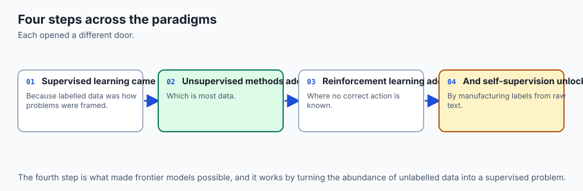

The three settings arrived from three different intellectual traditions and
were only retrofitted into one taxonomy afterwards, which is part of why the
taxonomy fits so badly.

**Supervised learning** grew out of statistics and pattern recognition.
Fisher's 1936 paper introducing linear discriminant analysis — the paper that
also introduced the iris measurements this lesson keeps using — is a
supervised method in everything but name: it is handed labelled examples of
three species and asked to find the combination of measurements that separates
them. Rosenblatt's perceptron in 1958 is the same setting with a learning rule
attached, and the phrase "supervised learning" comes from that era's habit of
describing the label-provider as a teacher or supervisor.

**Unsupervised learning** came from a different direction: taxonomy and
psychometrics, where the problem was never "predict this column" but "what
groups are in here at all?" The k-means algorithm has a genuinely tangled
lineage — Stuart Lloyd described the procedure at Bell Labs in 1957 in a paper
about pulse-code modulation that was not published until 1982, while
MacQueen's 1967 paper gave it the name. Hierarchical clustering methods are
older still and come out of biological classification. The field's founding
question was descriptive, not predictive, and that shows in its evaluation
problem to this day.

**Reinforcement learning** came from psychology by way of control theory.
Thorndike's law of effect in 1898 — responses followed by satisfaction become
more likely — is the whole idea in one sentence, sixty years before anyone
could compute with it. Bellman's dynamic programming in the 1950s supplied the
mathematics of sequential decisions and, with it, the recursive value equation
that everything since has been an approximation of. The modern field is
usually dated to Sutton and Barto's temporal-difference work in the 1980s and
Watkins' Q-learning in 1989 — the algorithm you will write out in full in
today's lab, in about thirty lines.

The names were tidied up later. Sutton and Barto's textbook, first published
in 1998, is largely responsible for the modern three-way framing, and it is
also the source of the ten-armed bandit testbed that today's lab reconstructs
from scratch: ten actions, rewards drawn from Gaussians with different means,
averaged over many independent problems because a single run is dominated by
luck.

What the history explains is why the boundaries are messy. These are not three
subdivisions of one field that were carved apart on principle. They are three
separate research programmes that turned out to be doing related things, and
the taxonomy is a retrofit.

## What it is — and what it is not

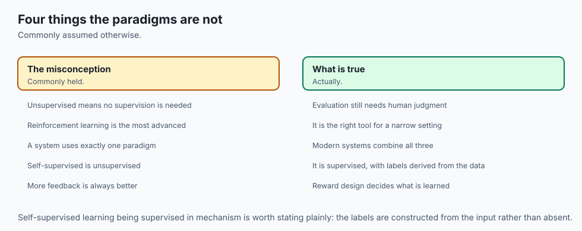

**Supervised learning is not "the one with a neural network"** and
**unsupervised learning is not "the one where you do not know what you are
doing"**. Both are settings, defined by what information reaches the learner,
and either can be attacked with almost any model family.

Here is what each is, stated precisely.

**Supervised learning** is function approximation from input-output pairs. You
are given examples `(x, y)` and asked to produce a function that maps new `x`
to a good `y`. The defining property is that the error on any training example
is *computable* — you have the target, so you can subtract. That single
property is what makes gradient descent, cross-validation, and every
evaluation habit from Day 141 possible.

**Unsupervised learning** is structure discovery from inputs alone. You are
given `x` and asked to say something useful about how it is arranged:
clusters, low-dimensional coordinates, density estimates, anomaly scores. The
defining property is that no target exists, so **no error is computable**, so
every evaluation is a proxy standing in for a judgement you have to make
yourself.

**Reinforcement learning** is learning a policy from evaluative feedback in a
setting where your actions influence what you observe next. You are given a
state, you choose an action, you receive a reward, and you land in a new
state. The two defining properties are that the reward tells you about the
action you took and nothing about the alternatives, and that your policy
determines your data.

Now the things they are not, each with something today's lab measures.

**Unsupervised learning is not weakly supervised learning.** It is not
supervised learning with the labels temporarily mislaid. There is no hidden
correct partition waiting to be recovered. When k-means splits iris into three
groups, it has found a genuine structure — and the structure it finds is not
the species. Here is what it actually did:

```text
rows = species, columns = cluster id
  species 0: [0, 50, 0]
  species 1: [48, 0, 2]
  species 2: [14, 0, 36]
```

Species 0 is isolated perfectly: all fifty of its rows in one cluster, no
other species in it. Species 1 and 2 are smeared across two clusters, with
fourteen rows of species 2 landing in the cluster that is mostly species 1.
That is a real and defensible partition of the measurements. It is simply not
the species, because the species is not a property of the measurements — it is
a property of the flowers, and two of these species overlap in petal and sepal
space no matter how good your algorithm is.

**Reinforcement learning is not supervised learning with a delay.** This is the
most consequential misconception in the lesson, and today's lab attacks it
directly. The intuition goes: surely, if I log everything my system does and
the reward it got, I now have a labelled dataset and can train a supervised
model on it. Let us test that. Eight independent ten-armed bandit problems,
each played for two thousand steps by a purely greedy agent, every pull and
every reward logged honestly. Then ask each log which arm was best:

```text
greedy    logs: 3/8 name the truly best arm; 4/8 contain one arm only
epsilon=0.1 logs: 7/8 name the truly best arm; 0/8 contain one arm only
```

Five of the eight greedy logs are wrong, and four of them contain a single arm
across all two thousand rows. There is no model, no amount of feature
engineering, and no quantity of additional data that recovers what those logs
do not contain. The rows about the other nine arms were never collected,
because the policy never chose them. The data is not noisy; it is *absent*,
and it is absent in a way that correlates exactly with what you want to know.

**And supervised learning is not the default just because you have labels.**
The third row of that table is the one to sit with: a well-explored log still
gets one of eight wrong, and the reason is instructive enough that the lab
gives it its own exercise.

## Why it was created and what problems it solves

Each setting exists because a class of problem genuinely does not fit the
others, and the honest way to understand the taxonomy is to ask what breaks if
you try to force a problem into the wrong box.

**Supervised learning solves the problem of scale in judgement.** A human can
decide whether one email is spam. A human cannot decide it for a hundred
million emails a day. If you can afford to have a human label a sample, a
supervised model turns that finite judgement into an unlimited one. That is
the entire commercial value proposition of the field, and it explains why
supervised learning is the overwhelming majority of deployed machine learning:
it is the setting where the business case is easiest to write down.

**Unsupervised learning solves the problem of not knowing the question.** Some
of the time you genuinely do not have a target column and could not invent
one. You have a million customer records and want to know whether there are
natural groups. You have server logs and want to know what "normal" looks like
so that you can flag what is not. You have three hundred features and want
twenty coordinates that keep most of the information. None of those has a
correct answer to supervise against, and inventing one would be dishonest.

It also solves a second, more practical problem: **labels are the expensive
part.** Today's lab measures this on iris with a 1-NN classifier and a label
budget, averaged over forty splits because one split is not worth reading:

```text
 3 random labels : 0.6455
 5 random labels : 0.7780
10 random labels : 0.8960
20 random labels : 0.9240
50 random labels : 0.9470
 3 chosen labels : 0.8760   (one per k-means cluster)
100 labels       : 0.9535   (every training row)
```

Three labels chosen by clustering the unlabelled data first and labelling one
representative per cluster score 0.876. Three labels chosen at random score
0.6455. Same budget, twenty-three accuracy points apart, and the chosen three
land between the five-random and ten-random figures — so, roughly, one
well-chosen label is worth three careless ones here. That is unsupervised
learning being used to make supervised learning affordable, which in practice
is the most common reason to reach for it at all.

**Reinforcement learning solves the problem of sequential decisions under
consequences.** Some problems are not "given this input, produce that output".
They are "given this situation, act — and live with where that puts you".
Game-playing is the obvious case. So is inventory management, so is
recommendation when your recommendations shape what the user ever sees, and so
is anything with a feedback loop between the model and its own future data.

The feedback loop is the whole story. In supervised learning your dataset is a
fixed object that exists independently of your model. In reinforcement
learning your dataset is generated by your policy, so a bad early policy
produces data that confirms it. That is not an implementation detail. It is
the reason exploration is a first-class concern rather than a tuning
parameter.

## How it works

### The three ingredients of any feedback signal

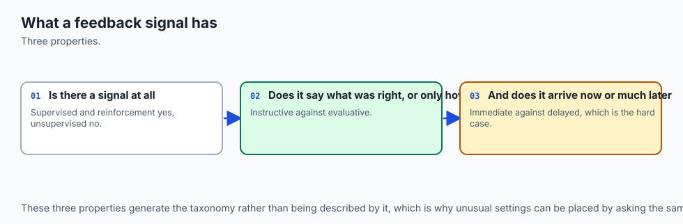

Strip each setting to what actually reaches the learner and you get three
questions with yes/no answers.

1. **Is there a target for this input?** If yes, error is computable per
   example and you are supervised.

2. **Do the learner's actions change what data arrives next?** If yes, you are
   in a reinforcement setting regardless of the answer to question 1.

3. **Does feedback arrive at the moment of the decision, or later?** If later,
   credit assignment becomes its own problem.

Today's lab encodes exactly that in a function that refuses to guess:

```python
def classify_problem(spec: dict) -> str:
    for key in ("has_labels", "actions_change_the_data", "feedback_is_immediate"):
        if key not in spec:
            raise KeyError(f"problem description is missing {key!r}")
    if spec["actions_change_the_data"]:
        if spec["feedback_is_immediate"]:
            return "reinforcement learning: contextual bandit"
        return "reinforcement learning: sequential, with delayed credit"
    if spec["has_labels"]:
        return "supervised learning"
    return "unsupervised learning"
```

The order matters, and it is the opposite of the order people usually reason
in. Most engineers ask "do I have labels?" first. This function asks it last,
because a problem where your actions change your data is a reinforcement
problem even when every row is labelled — and treating it as supervised
produces the failure the lab measures in exercise 8.

The `KeyError` is deliberate. A function that fills in a missing field with a
default is worse than one that refuses, because the guess is invisible in the
output and nobody reviewing the answer can see that it happened.

### Unsupervised learning has no answer key, and every evaluation is a proxy

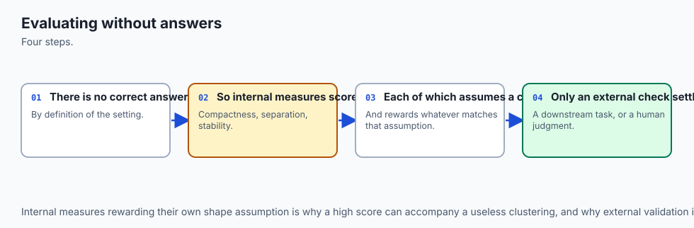

The clustering result from earlier is worth taking apart, because the way it
misleads is the way every unsupervised evaluation misleads.

You cannot compute accuracy for a clustering. What people compute instead is
one of these:

- **An internal criterion** — inertia, silhouette, Davies-Bouldin. These use
  only the data and the partition, so they are honest about not having labels,
  and they measure whatever geometric property they happen to encode rather
  than whatever you care about.

- **An external criterion** — adjusted Rand index, mutual information,
  best-permutation accuracy. These compare the partition to labels, which
  means they are not available in the setting they claim to evaluate.

Both are worth measuring, and the lab measures both. Start with the internal
ones, at k from 2 to 6 on iris:

```text
k=2: inertia  152.348   silhouette 0.6810
k=3: inertia   78.851   silhouette 0.5528
k=4: inertia   57.228   silhouette 0.4981
k=5: inertia   46.446   silhouette 0.4887
k=6: inertia   39.040   silhouette 0.3648
```

Two things there, and both matter more than the numbers.

**Inertia falls at every single step, and it always will.** This is a theorem
rather than a measurement: the best k-means objective at `k+1` clusters can
never be worse than at `k`, because you can always take the `k` solution and
split one cluster to get a valid `k+1` solution that is at least as good. So
"choose the k that minimises inertia" always answers `k = n`, one cluster per
point, on every dataset, forever. Any procedure built on inertia alone is
choosing k by where a human decided the curve had a bend.

**Silhouette does choose, and it chooses two.** Iris has three species. The
silhouette score is not broken — at k=2 the partition genuinely is more
cleanly separated, because species 0 sits well away from the other two while
species 1 and 2 overlap. Silhouette is measuring separation, and separation is
what it says it measures. It simply is not measuring "how many species are
there", because nothing in the data can measure that.

### Structure is not unique, and the standard advice can lose

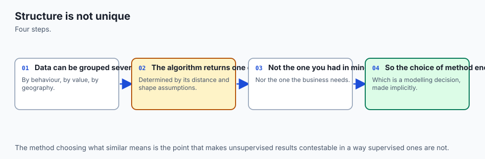

This one contradicts advice you will read in almost every clustering tutorial,
and it was found by measurement rather than by argument.

The advice is: standardise your features before clustering, because k-means
uses Euclidean distance and a feature measured in thousands will dominate one
measured in tenths. That reasoning is correct and the advice is a good
default. On iris it makes things worse:

```text
ARI, raw clustering vs scaled          : 0.8036
ARI, raw clustering vs true species    : 0.7302
ARI, scaled clustering vs true species : 0.6201
```

Standardising moved the clustering measurably away from the species —
adjusted Rand index 0.620 against 0.730 — while producing a partition that
disagrees with the unscaled one on a fifth of its structure. The cause is not
mysterious. Iris's four features are all lengths in centimetres on comparable
scales, so the problem standardisation exists to solve does not arise here. What
standardisation does instead is *equalise* the features, which promotes sepal
width — the noisiest and least discriminative of the four — to the same
influence as petal length, which carries most of the separation.

The right conclusion is not "never standardise". It is that preprocessing is
part of the definition of the structure you are looking for, not a neutral
preliminary. And notice the trap: you could only *tell* which was better by
using the species labels, which the method does not have. In a real
unsupervised problem you would be choosing between those two partitions with
no way to check.

### Evaluative feedback, and the measurable price of not exploring

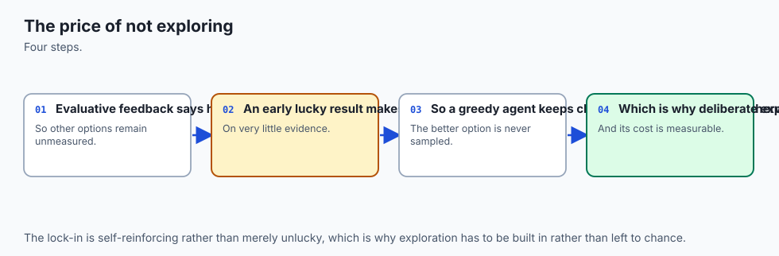

Now the third setting. A ten-armed bandit is the smallest honest reinforcement
problem: ten actions, each paying a reward drawn from a Gaussian with its own
unknown mean, and a fixed number of pulls to spend. There are no states, so
credit assignment does not arise yet. The only difficulty is the one that
matters — you learn about an arm only by pulling it, and every pull spent
learning is a pull not spent earning.

The whole agent is a dozen lines, and it is worth reading because everything
about the setting is visible in it:

```python
for t in range(steps):
    if chooser.random() < epsilon:
        arm = int(chooser.integers(k))        # explore
    else:
        arm = int(np.argmax(estimates))       # exploit
    reward = bandit.pull(arm)
    counts[arm] += 1
    estimates[arm] += (reward - estimates[arm]) / counts[arm]
```

That third-from-last line is the entire feedback signal: **one number, for the
one arm you chose**. There is no vector. There is no counterfactual. The other
nine arms had rewards on that pull too and you will never see them.

Averaged over two hundred independent problems of a thousand pulls each:

| epsilon | mean reward | fraction of pulls on the best arm |
| --- | --- | --- |
| 0.0 (never explore) | 0.9838 | 0.3130 |
| 0.01 | 1.1314 | 0.4336 |
| 0.1 | 1.2800 | 0.7080 |

The greedy agent takes the best arm 31.3% of the time. Not because it is
badly written — it is doing precisely what it was told, always taking the
action with the highest current estimate. The problem is that its first few
pulls fix those estimates, and an arm that got unlucky on its one and only
pull is never tried again. It locks on, and it locks on to the wrong thing
about seven times in ten.

Spending one pull in ten at random raises that to 70.8%, and raises mean
reward by 30%. Thirty-nine points of optimal-action rate, bought with 10% of
the budget, from a single parameter. **This is what evaluative feedback costs
you and why exploration is not optional.** A supervised learner faces no
version of this problem: it is handed every label whether it asked for the
example or not.

### Delayed feedback: credit assignment, made countable

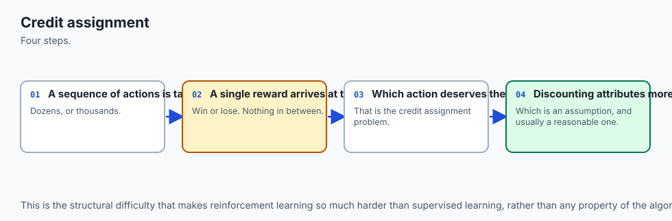

The bandit had one state. Add states and the second difficulty appears.

Today's gridworld is five by five. The agent starts top-left, the goal is
bottom-right, moving costs nothing and reaching the goal pays one. The
shortest path is eight steps. The interesting part is that the feedback for
the *first* move arrives only after the eighth — and there is nothing in the
world that tells the agent which of those eight moves earned the reward.

Q-learning solves this by bootstrapping: the value of where you land becomes
part of the target for where you were.

```python
target = reward + (0.0 if done else gamma * float(np.max(Q[s_next])))
Q[s, a] += alpha * (target - Q[s, a])
```

That is the whole algorithm. What it does is easier to see counted than
described. Here is how many of the twenty-five squares carry a non-zero value
after n episodes:

```text
after   1 episodes:  1/25 states valued, greedy policy cannot reach goal
after   2 episodes:  2/25 states valued, greedy policy cannot reach goal
after   3 episodes:  3/25 states valued, greedy policy cannot reach goal
after   5 episodes:  5/25 states valued, greedy policy cannot reach goal
after  10 episodes: 10/25 states valued, greedy policy cannot reach goal
after  25 episodes: 18/25 states valued, greedy policy 8 steps
after  50 episodes: 20/25 states valued, greedy policy 8 steps
after 100 episodes: 21/25 states valued, greedy policy 8 steps
after 300 episodes: 22/25 states valued, greedy policy 8 steps
```

Exactly one new square per episode for the first ten. The reward walks
backwards from the goal, one square per pass, because that is the only route
information has: the square next to the goal learns from the goal, and the
square before it learns from that square, and nothing can skip ahead.

![Diagram: a five by five grid whose bottom-right square is the goal paying plus one, filled with the state values a tabular Q-learning agent actually learned in three hundred episodes. Squares light up outward from the goal in the order the reward reached them, and three squares stay at zero including the goal itself, which the episode ends before updating. A left panel counts the states carrying value after 1, 2, 3, 5, 10, 25, 50, 100 and 300 episodes as 1, 2, 3, 5, 10, 18, 20, 21 and 22 out of 25. A right panel records that the greedy policy has no path at 10 episodes and walks the shortest 8 steps from 25 episodes onward, that mean episode length falls from 46.8 to 10.4, and that letting numpy argmax break ties makes the same agent reach the goal 0 times in 300 without any warning](./assets/reward-travels-backwards-flow.svg)

Three squares stay at zero even after three hundred episodes, and one of them
is the goal itself. That is correct rather than broken: the episode terminates
when the agent arrives, so the goal state's own action-values are never
updated. The other two are opposite corners the agent had no reason to route
through. A value function is a record of where the agent has been and what it
found there, not a map of the world.

The line worth carrying away is the middle column. Until episode 25, the
greedy policy *cannot reach the goal at all*, because the value signal has not
yet arrived where the agent starts. There is nothing to be greedy about. An
engineer watching a flat learning curve at episode 10 and concluding the
algorithm does not work would be wrong, and would be wrong in a way that no
error message reports.

### The bug that stops an agent learning without saying anything

While building this lab, the gridworld agent reached the goal in zero of three
hundred episodes. No exception, no warning, no NaN. Just a flat line.

The cause is one function call:

```python
a = int(np.argmax(Q[s]))
```

`np.argmax` returns the **lowest** index attaining the maximum. That is
documented and correct. But a Q-table initialised to zeros makes every row one
enormous tie, so the greedy branch of an epsilon-greedy policy always returns
index 0 — which in this action table is "up". With epsilon at 0.2, the agent
takes a random walk with a heavy upward bias, never leaves the top two rows of
the grid, times out at two hundred steps, and learns nothing because it never
finds the only reward in the world.

Fixing it is four lines:

```python
def argmax_random_tiebreak(values, rng) -> int:
    values = np.asarray(values)
    best = np.flatnonzero(values == values.max())
    return int(best[rng.integers(len(best))])
```

And the contrast is total:

| Tie-breaking | Goal reached | Episode length, first 10 | Episode length, last 10 | Greedy path |
| --- | --- | --- | --- | --- |
| `np.argmax` | 0 of 300 | 200.0 | 200.0 | never arrives |
| random among ties | 300 of 300 | 46.8 | 10.4 | 8 steps |

Both configurations are in the lab, behind a flag, and both are asserted. The
failure is more instructive than the fix, because it is representative:
reinforcement learning bugs mostly present as *nothing happening*, and
"nothing happening" is also what a correct agent looks like early on. The only
defence is to instrument the thing that would distinguish them — here, whether
the agent ever reached the goal at all.

### Why a log of a working policy is not a supervised dataset

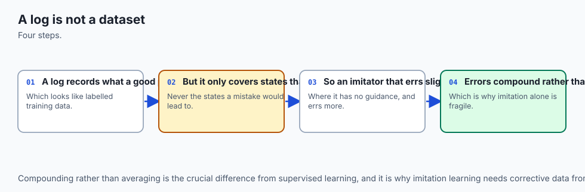

Return to the misconception, now with the mechanism visible.

An epsilon-greedy agent plays a ten-armed bandit for two thousand steps and
logs every pull honestly. Here is the log:

```text
seed 0, epsilon=0.1: best arm is 6, pulled 1813 of 2000 times
the other nine arms share 187 pulls
```

That imbalance is not a flaw in the logging. It is what a good policy produces
— it found arm 6 and exploited it, which is its job. But now consider what the
log is as a dataset: 90% of it is about one arm, and the nine alternatives
share fewer than two hundred rows between them, at most thirty each. Any model
trained on it inherits that. It will be confident about arm 6 and know almost
nothing about the rest, which is exactly the wrong shape of knowledge for
deciding whether something else would have been better.

With a greedy logging policy it gets worse: four of eight logs contain a
single arm, and five of eight name the wrong arm as best. There is no
statistical technique that fixes this, because the missing information was
never recorded.

And then the case that is most worth understanding — the one log with full
exploration that still gets it wrong:

| Arm | True mean | Logged mean | Pulls |
| --- | --- | --- | --- |
| 4 (truly best) | +0.9054 | +0.8634 | 1524 |
| 1 | +0.8216 | +0.9262 | 274 |

Arm 4 is genuinely better. It was pulled five and a half times as often. Its
estimate is far more reliable — and *that is exactly why it lost*. With 1524
samples, arm 4's estimate sits close to its true mean, slightly under. With
274 samples, arm 1's estimate is free to wander, and it wandered up. Taking an
argmax over noisy estimates does not pick the best arm; it picks whichever
estimate is most inflated, and the noisiest estimates have the most room to
inflate.

This is the **winner's curse**, and it is not a bandit curiosity. You will
meet it again on Day 144 under the name model-selection bias, where the thing
being argmaxed is a set of validation scores instead of a set of arm means,
and the consequence is that your chosen model's validation score is
systematically optimistic. Same mechanism, different clothes.

## An everyday analogy

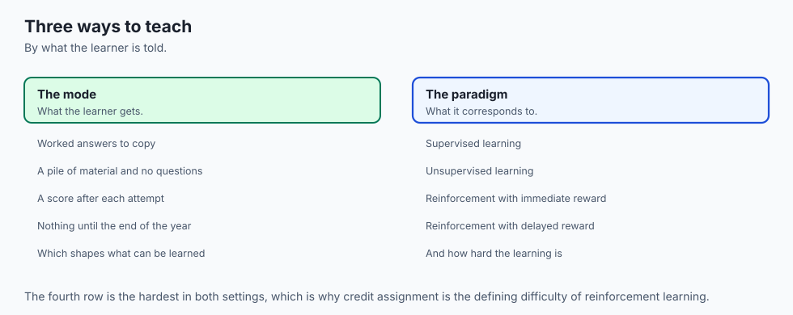

A restaurant reviewer, a shelf-stacker, and a gambler walk into the same
supermarket.

**The reviewer** has a clipboard with the correct verdict for every product
already written on it — supplied by a panel of experts who tasted everything
last month. Their job is to learn to predict the panel's verdict from the
label on the jar. Every time they guess, they can turn the page and see the
answer. If they get better at it, they will know immediately, and precisely by
how much. This is supervised learning, and note what makes it tractable: the
answer key exists, it is complete, and consulting it is free.

**The shelf-stacker** has no clipboard. Their job is to arrange four thousand
products into aisles. They could group by category, by supplier, by price
point, by how often things are bought together, by which shelf height fits the
packaging. Every one of those produces a coherent supermarket. There is no
panel to consult, and if the store manager says "aisle three feels wrong",
that is a preference, not a correction. This is unsupervised learning, and its
difficulty is not that the job is hard. It is that "right" is a decision
somebody has to make and then own.

**The gambler** is playing a row of slot machines. They pull a lever and money
comes out, or does not. Nobody tells them what the machine next door would
have paid on that pull. If they find one machine that pays and stay there all
evening, they will go home believing it was the best machine in the row, with
two thousand data points supporting them and no way to know they are wrong.
This is reinforcement learning, and the two hard parts are both in that
sentence: the feedback evaluates only what they did, and their own choices
determined what they got to see.

The analogy earns its keep at one specific point. Ask what happens if the
gambler writes everything down carefully and hands their notebook to the
reviewer. The reviewer now has a clipboard of sorts — two thousand rows,
honestly recorded, machine and payout. And the reviewer's conclusion will be
confidently wrong, because the notebook is a record of one gambler's evening,
and the machines they avoided are simply not in it. That is the whole content
of "a log is not a supervised dataset", and it is why the lab spends three
exercises on it.

## Examples in practice

### Supervised, and correctly so

Spam filtering, credit scoring, medical image triage, demand forecasting,
speech-to-text. What these share is not a domain — it is that a target exists,
somebody can produce it for a sample, and the act of predicting does not
change the thing being predicted.

That last clause is where the diagnosis actually happens. Demand forecasting
in a warehouse is supervised. Demand forecasting where your forecast sets the
price, which changes demand, is not — you have a feedback loop, and your next
training set is a consequence of your last prediction.

### Unsupervised, and honestly so

Customer segmentation, topic discovery in a document corpus, anomaly detection
in server telemetry, dimensionality reduction before a supervised step, and —
the one people underrate — **exploratory work whose output is a hypothesis
rather than a model**. Clustering a dataset and looking at what falls out is a
legitimate and useful thing to do, provided the result is treated as a
question to investigate rather than a finding to report.

The one to be careful about is customer segmentation, because it is where the
evaluation problem bites hardest commercially. There is no correct number of
segments. The choice of k, the choice of features, and the choice of scaling
each change the answer, and today's measurement of iris is a small version of
exactly that: standardising the features changed the partition on a fifth of
its structure, and there was no way to tell which was better without an answer
key that a real segmentation problem does not have.

### Reinforcement, and only where it is warranted

Game-playing is the famous case and the least representative one. The
warranted industrial cases share a specific shape: sequential decisions, a
measurable reward, and — crucially — either a **simulator** or a genuine
tolerance for exploring in production.

That second condition is the one that disqualifies most candidate projects.
Reinforcement learning needs to try things to find out whether they work.
In a game, trying a bad move costs a simulated game. In a hospital, in a
lending system, or in an aircraft, trying a bad action costs something that
cannot be undone. When people say a problem "is reinforcement learning but we
cannot use reinforcement learning", this is almost always what they mean, and
they are usually right.

The honest middle ground is the **contextual bandit**, which today's
`classify_problem` names explicitly: your actions change your data, but
feedback is immediate and there is no long-horizon credit assignment. Content
recommendation and ad selection sit here, and it is a much easier setting than
full sequential reinforcement learning — with the same exploration
requirement, and the same trap in the logs.

### What the ten measurements say together

Read as one set, the lab's numbers make a single argument. Supervised learning
scores 0.92 on iris because the answer was in the data. Unsupervised learning
produces a number between 0.24 and 0.8933 for the *same partition*, because
"score" was never defined. And reinforcement learning goes from 0.313 to 0.708
on one parameter, because the agent's problem was never the algorithm — it was
that nobody was going to tell it what it was missing.

## Implications: security, privacy, performance, scalability, and cost

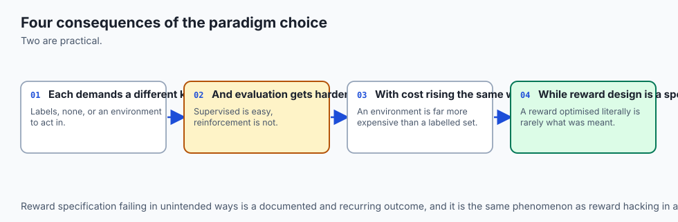

**Cost is the axis these three settings differ on most, and it is not compute.**
It is the acquisition of the feedback signal.

Supervised learning's cost is labels, and it is usually the dominant line item
in a real project. Today's measurement puts a shape on the trade: on iris, ten
random labels buy 0.896 against a 0.9535 ceiling, and the last fifty labels
buy 0.0065. Label budgets have sharply diminishing returns, and the practical
consequence is that *choosing which rows to label* is often worth more than
labelling more of them — three chosen labels beat three random ones by
twenty-three points.

Unsupervised learning's cost is a decision, and it is usually invisible in the
budget. Somebody has to decide what k is, what scaling to use, and what counts
as a good segmentation. Because no number can settle those, they get settled
by whoever is most senior in the room, and the result is presented with the
authority of a computation.

Reinforcement learning's cost is **regret** — the reward you forgo while
learning — and it is paid in the live system. The bandit numbers are exactly
this: epsilon at 0.1 gives up 10% of its pulls to exploration and earns 30%
more overall, which is a good trade. In a setting where an exploratory action
means showing a user something worse, or worse than worse, that trade needs an
explicit decision and often an ethics review.

**Privacy** differs sharply by setting. A supervised model's labels are often
the most sensitive data in the pipeline — a diagnosis, a credit decision, a
moderation verdict — and membership-inference attacks specifically target
whether a given record was in the training set. Unsupervised methods are not
safe by virtue of having no labels: a clustering *is* a disclosure, and
publishing "these four thousand customers form a segment" can identify
individuals in small clusters even when no record is released. And
reinforcement learning collects behavioural traces by construction, since the
state-action-reward log is the training data.

**Security** has a setting-specific failure mode in reinforcement learning
that is worth naming: because the policy generates its own data, an adversary
who can influence the environment can steer the learner. Poisoning a
supervised dataset requires access to the dataset. Poisoning a reinforcement
learner can be done by acting in its world.

**Performance and scalability** favour supervised learning by a wide margin,
and it is a fair reason to prefer it. Supervised training is embarrassingly
parallel over examples. Clustering is not, in general — k-means is iterative
and its cost grows with `k` times `n` times dimensions per iteration.
Reinforcement learning is the worst case: it is sequential by definition,
sample-inefficient, and the ten-armed bandit in this lab needed two hundred
independent runs before the comparison between epsilon values was even legible
above the noise.

That last point is a cost people do not budget for. **A single reinforcement
learning run tells you almost nothing.** The lab averages over two hundred
problems for exactly the reason Day 141 gave: one measurement of a noisy
quantity is an anecdote. The same caution applies to the label-budget curve,
where a single split reports that five labels beat twenty — and forty splits
report a clean monotone increase.

## Alternatives: free, open source, and commercial

### scikit-learn 1.9.0 — used here

**When to choose it:** for supervised and unsupervised work on data that fits
in memory, which is most work. It is free, BSD-3-Clause licensed, and has no
paid tier.

**How to use it:** every estimator has the same three methods, which is the
main reason the library won. Supervised and unsupervised differ by exactly one
argument:

```python
from sklearn.cluster import KMeans
from sklearn.neighbors import KNeighborsClassifier

KNeighborsClassifier(n_neighbors=5).fit(X, y)   # supervised: X and y
KMeans(n_clusters=3, n_init=10).fit(X)          # unsupervised: X alone
```

That missing `y` is the entire taxonomy expressed in an API. Everything in
this lab's clustering exercises runs through `KMeans`, `silhouette_score` and
`adjusted_rand_score`, all measured on this machine.

**Watch for:** `KMeans` defaults to `n_init=10` restarts and a random
initialisation, so results move between runs unless you pass `random_state`.
Every number in this lesson was produced with `random_state=0` and would
otherwise wobble.

### NumPy 2.5.2, writing the agents by hand — used here

**When to choose it:** when the algorithm is the thing you are trying to
understand. Both reinforcement agents in this lab are pure NumPy, about thirty
lines each, and that is deliberate — an epsilon-greedy bandit hidden behind a
framework API teaches nothing about evaluative feedback, whereas the line
`reward = bandit.pull(arm)` shows you the whole feedback signal.

**How to use it:** the incremental-mean update and the Q-learning update shown
earlier in this lesson are the complete algorithms. Nothing has been elided.

**Watch for:** the `np.argmax` tie-breaking failure documented above, which
cost this lab an afternoon. Also, NumPy's own documentation states plainly
that `Generator` carries no stream-compatibility guarantee across versions, so
seeded results are reproducible under pinned versions and not beyond them —
which is why the lab's `expected-output/FIELDS.md` separates results that hold
everywhere from results that hold under the pins.

### Gymnasium and Stable-Baselines3 — not installed here, described from documentation

**Gymnasium** is the maintained successor to OpenAI Gym and is the de facto
standard interface for reinforcement environments: a `reset()` that returns an
initial observation and a `step(action)` that returns observation, reward,
terminated, truncated and info. **Stable-Baselines3** supplies implementations
of the standard algorithms — PPO, DQN, SAC — against that interface. Both are
free and MIT licensed.

**When to choose them:** the moment your state space stops fitting in a table.
Tabular Q-learning as written in this lab stores one row per state; a
twenty-five-square grid needs twenty-five rows, and a camera image needs more
rows than there are atoms. That is the boundary where you need function
approximation and where writing it yourself stops being educational and starts
being a maintenance burden.

**Honest note:** neither package is installed on the authoring machine and no
output from either is reproduced anywhere in this lesson. Everything stated
about them comes from their published documentation.

### Managed AutoML services — not used here, described from documentation

The major cloud providers all sell services that take a labelled table and
return a deployed supervised model, handling model selection and tuning.

**When to choose one:** when the problem is genuinely a standard supervised
one, the value is in shipping rather than in understanding, and you have no
one to maintain a training pipeline.

**When not to:** for anything unsupervised or reinforcement-shaped. These
services are built around a target column, and a problem without one does not
fit the product. They also give you the least visibility exactly where this
lesson says visibility matters most — you will not see how the split was made
or how the winning model was chosen, and after Day 144 you will want to.

**Free versus paid:** all are paid, and usually metered on training time plus
prediction volume. **No price is quoted here**, because cloud pricing changes
by region and by month and an unchecked figure is worse than none.

## Comparison with related concepts

| Concept | Feedback signal | How it differs from the three |
| --- | --- | --- |
| Semi-supervised learning | a few labels plus much unlabelled data | Not a fourth setting: it is supervised learning with an unsupervised step that spends the label budget better, exactly as exercise 9 measures |
| Self-supervised learning | targets manufactured from the input itself | Mechanically supervised — the loss has a target — but the target costs nothing, which is why it underpins modern language models |
| Active learning | labels, but you choose which rows get them | Supervised in setting, reinforcement in spirit: your choices determine your data, so it inherits the exploration problem |
| Contextual bandits | evaluative, immediate, with state | Reinforcement learning without long-horizon credit assignment — much easier, and where most industrial cases actually live |
| Imitation learning | expert demonstrations of the right action | Supervised in mechanics, reinforcement in deployment: the model's own errors move it to states the expert never demonstrated |
| Online learning | supervised, arriving one row at a time | About *when* data arrives, not about the shape of feedback; orthogonal to this taxonomy |

Two rows there deserve emphasis.

**Self-supervised learning is the reason this taxonomy needs updating.** A
language model trained to predict the next token is doing supervised learning
by every mechanical definition — there is a target, error is computable per
example, gradients flow. What makes it feel like a different thing is that the
target was free. The bottleneck that defines supervised learning in practice
is the label cost, and self-supervision removes it, which changes the
economics so completely that the setting behaves differently even though the
mathematics does not.

**Imitation learning is the trap in this table.** Training a policy on expert
demonstrations looks like clean supervised learning, and it is — right up
until deployment, when the policy's own small errors carry it into states the
expert never visited and never demonstrated. The training distribution and the
deployment distribution differ *because the model is acting*, which is Day
141's distribution-shift problem arriving through a door nobody watched.

## When to use it — and when not to

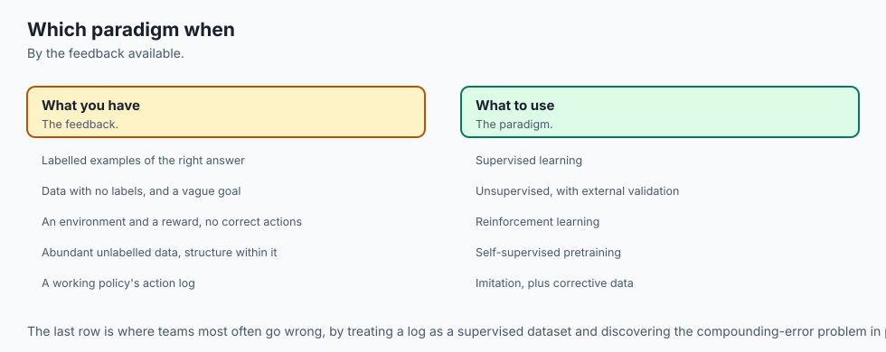

Work the three questions in this order. The order is the advice.

**1. Do my actions change the data I will see next?**

If yes, stop treating this as a supervised problem regardless of how many
labels you have. Ask instead whether feedback is immediate — if it is, you
have a contextual bandit, which is tractable. If it is delayed, you have full
sequential reinforcement learning, and you need either a simulator or a
genuine tolerance for exploring in production. Without one of those, the
honest answer is that this problem is not currently solvable by learning, and
the useful move is to change the problem: log with deliberate randomisation
now so that in six months you have data that can answer the question.

**2. Do I have a target, and can I get more of it?**

If yes, use supervised learning, and spend your effort on the split rather
than the model. Days 144 through 147 are entirely about that, and they matter
more than the choice of algorithm.

If you have a target for only a few rows, do not conclude that you are stuck.
Cluster the unlabelled data and label representatives — three chosen labels
beat three random ones by twenty-three points on iris.

**3. If neither, what would I do with the answer?**

This is the question that stops most unsupervised projects, and it should. If
you cannot say what decision changes based on the clustering, you will not be
able to evaluate it either, because every unsupervised evaluation is a proxy
for a decision. "Segment our customers" is not a goal. "Decide which of three
messages to send each customer" is, and it tells you what a good segmentation
would look like.

**When not to use any of this:** when an exact rule exists. Day 141 made this
case with measurements and it has not stopped being true — a three-line rule
scored 1.000 where the best of four trained models reached 0.9675. Nothing in
today's taxonomy changes that. Naming your setting correctly is valuable
precisely because it sometimes tells you that the setting you are in does not
need a model at all.

### The AI thread

Modern AI systems are stacked from all three settings, in a specific order,
and knowing which is which explains most of their behaviour.

A large language model is **self-supervised** in its pretraining: the target is
the next token, manufactured from the text itself at no labelling cost. That
is why the data can be enormous, and enormous data is essentially the whole
story of why these models work.

It is then **supervised** during instruction tuning, on a much smaller set of
human-written demonstrations. Small, because now somebody has to write them —
the label-cost curve from earlier arriving in a very expensive setting.

And it is finally **reinforcement** during preference tuning, where a reward
model scores the outputs and the policy is optimised against that score. Every
property this lesson measured shows up there. The feedback is evaluative:
the reward model says a response was worth 0.7, never what the 0.9 response
would have been. The policy generates its own data, so the distribution moves
as training proceeds. Exploration matters, and too little of it produces a
model that locks on to one style of answer — the greedy bandit at 0.313,
wearing a much larger coat.

And the winner's curse is there too, at scale. Optimising hard against a
learned reward model finds the inputs where that model's estimate is most
inflated, which is the same mechanism as arm 1 beating arm 4 on 274 samples.
The field's name for it is reward hacking, and the countermeasure — penalising
divergence from the starting policy — is a way of saying that you do not
trust your own argmax. Today's lab measured why you should not.

## The AI connection

- **The three learning paradigms map directly onto how modern AI is built** — pretraining is
  self-supervised, fine-tuning is supervised, and alignment is reinforcement.
- **Supervision is about what signal is available**, not about how sophisticated the method
  is.
- **Self-supervised learning made large models possible** by turning unlabelled text into a
  supervised problem at no labelling cost.
- **Reinforcement learning is what shapes behaviour** where there is no correct answer to
  imitate, only outcomes to prefer.
- **Most real systems combine all three**, in that order, which is exactly the recipe behind
  every current assistant model.

## Knowledge check

1. A colleague reports that their clustering "achieved 24% accuracy against the
   known labels" and concludes the method failed. What is wrong with the
   conclusion, and what number should they compute instead?

2. Inertia decreases every time you increase k. Why is that a theorem rather
   than an observation, and what does it imply about elbow plots?

3. On iris, standardising the features before clustering made the result worse
   by adjusted Rand index. Explain the mechanism, and say why you could not
   have detected this in a genuine unsupervised problem.

4. A greedy bandit agent takes the best arm 31.3% of the time. It is
   implemented correctly. Explain how correct implementation produces that
   result.

5. You have two thousand rows of logged production decisions with the reward
   for each. Give the specific reason this is not a supervised dataset, and
   describe a change to the logging that would improve it.

6. After ten episodes, the gridworld agent's greedy policy cannot reach the
   goal, yet ten of twenty-five states carry value. Reconcile those two facts.

7. The truly best bandit arm was pulled 1524 times and lost to an arm pulled
   274 times. Explain why more data made the better arm lose.

8. Your recommender's suggestions change what users click, which becomes your
   next training set. Which setting are you in, and which question in the
   ordering settled it?

## Hands-on exercise

Today's lab, `Three Kinds of Feedback`, builds a ten-armed bandit and a
tabular Q-learning agent from scratch in NumPy — no reinforcement-learning
framework anywhere — and measures all three feedback shapes on the same
footing.

Fifteen exercises. The clustering half establishes that unsupervised learning
has no answer key and that structure is not unique. The reinforcement half
establishes what evaluative feedback costs, how a delayed reward propagates,
and why a log of a working policy cannot be treated as a labelled dataset.

Build the environment, then work through `starter/test_feedback_claims.py`,
replacing one `pytest.skip` at a time. Each skip names the exact helper and
the exact value to assert.

### Expected output

The harness ends with:

```text
---------------------------------------------------------------
14 checks, 0 failure(s)
```

and exits 0. `pytest examples -q` reports `19 passed`, and `pytest starter -q`
reports `4 passed, 15 skipped` until you begin.

The measured table, printed by `examples/report_measurements.py`, includes:

```text
  accuracy taking cluster ids literally  : 0.2400
  accuracy after the best relabelling    : 0.8933  (mapping (1, 0, 2))
    epsilon=0.0  : mean reward 0.9838   optimal action 0.3130
    epsilon=0.1  : mean reward 1.2800   optimal action 0.7080
  np.argmax tie-breaking, goal reached in : 0/300 episodes
  random tie-breaking, goal reached in    : 300/300 episodes
```

### Validate your work

1. `bash tests/run_tests.sh; echo "exit=$?"` reports `14 checks, 0 failure(s)`
   and `exit=0`. Capture the harness's own exit status, never a pipeline's.

2. `.venv/bin/pytest examples -q` reports `19 passed`.
3. `.venv/bin/python3 examples/report_measurements.py | diff - expected-output/measured-values.txt`
   produces no output.

4. When you have finished every exercise, `pytest starter -q` also reports
   `19 passed`.

5. Break one assertion on purpose, confirm the harness reports the failure and
   exits non-zero, and restore it. A suite you have never seen fail is not
   evidence of anything.

### Troubleshooting

**The harness refuses to start.** It will not run against whatever Python is on
your `PATH`, because every number is pinned to exact package versions. Create
the lab-local environment first.

**`import file mismatch`.** You ran `pytest examples starter` in one
invocation. Both directories define modules with the same names. Run them
separately — check 5 asserts that the combined form fails, so this is
documented rather than surprising.

**Your gridworld agent never reaches the goal.** That is exercise 7, and it is
the point. `np.argmax` returns the lowest index attaining the maximum, and an
all-zero Q-table is one enormous tie. Pass `break_ties_randomly=True`.

**Your bandit numbers differ.** Read `expected-output/FIELDS.md` first. What
must hold on any version is the *ordering* — epsilon 0.1 beats epsilon 0.01
beats greedy on both measures. If only the fourth decimal moved, the version
pins are doing their job.

### Common mistakes

**Comparing cluster ids to labels and reporting the number.** Exercise 2 exists
so you make this mistake once, deliberately, and see it produce 0.24 for a
partition worth 0.8933.

**Reading a trend off one split.** Exercise 9's single-split curve says five
labels beat twenty. The forty-split average is cleanly monotone. Both are
asserted, so the difference is visible rather than smoothed away.

**Concluding the algorithm is broken because the curve is flat.** Until episode
25, the gridworld's greedy policy cannot reach the goal — correctly, because
the value signal has not arrived. A flat early curve is what both a working
agent and a broken one look like.

**Fixing the tie-breaking bug quietly.** Measure it first. A bug that produces
zero of three hundred with no error message is worth more as a measurement
than as a patch.

## Practice assignment

Take a decision your own system makes repeatedly — which of several emails to
send, which item to show first, which of three retry strategies to use — and
write a one-page classification of it.

1. **Run the three questions in order** and name the setting. Do not skip
   question 1 because you have labels.

2. **Describe your current logs as a dataset.** How many distinct actions
   appear? What fraction of rows carry the most common one? If one action
   accounts for more than 80% of the log, state plainly what your log cannot
   answer.

3. **Compute your own version of the bandit table.** If you have logged
   rewards per action, report the mean and the count per action, and mark
   every action with fewer than thirty observations. Then say which of your
   comparisons the winner's curse could plausibly have decided.

4. **Propose one logging change** that would make the data able to answer the
   question — usually a small fraction of deliberately randomised decisions —
   and estimate its cost in forgone reward using the epsilon comparison as a
   template.

5. **State what you would do differently** if the setting turned out to be
   unsupervised: what decision would the structure inform, and how would you
   choose between two partitions with no answer key?

The deliverable is the classification and the logging proposal, not a model.

## Extension challenge

Pick one and measure it. Report what you observed rather than what you
expected.

1. **Inverse-propensity weighting.** Exercise 8 shows a log naming the wrong
   arm at seed 1. Divide each logged reward by the probability the logging
   policy had of choosing that arm, recompute the estimates, and measure
   whether it recovers arm 4. Then measure the variance you paid for it.

2. **Optimistic initialisation.** Set the bandit's initial estimates to +5 and
   run with `epsilon=0`. Measure the optimal-action rate. Explain why a purely
   greedy agent now explores, and what the trick costs on a non-stationary
   problem where arm means drift.

3. **Find the exploration threshold.** Run exercise 7's failing configuration
   at increasing epsilon and report the smallest value at which the biased
   random walk starts reaching the goal within two hundred steps.

4. **Beat the representative.** Exercise 9 labels the row closest to each
   k-means centroid. Try labelling the two rows *furthest* from each centroid
   at the same total budget, and report whether representative or boundary
   examples buy more accuracy.

5. **Make the clustering agree.** Find a preprocessing step that raises the
   adjusted Rand index between k-means and the iris species above 0.7302.
   Then answer the harder question honestly: how would you have chosen that
   step without the labels?
