## Why this matters

Here are two runs of the same pipeline, on the same data, with the same
model, the same folds and the same seed.

```text
split then select (correct)            : 0.5000
select then split (wrong, unchecked)   : 0.7300
accuracy invented by the reordering    : 0.2300
```

The dataset is one hundred rows and five thousand columns of numbers drawn
from a normal distribution, and the labels are coin flips. There is nothing
to learn. Not a weak signal, not a subtle one — nothing, by construction,
because the labels were never produced by looking at the features.

The correct pipeline reports 0.50. That is chance, and chance is the only
honest answer available.

The other pipeline reports 0.73, and the difference between them is that
two stages changed places:

```text
correct order : load -> split -> select -> fit_and_score -> baseline
wrong order   : load -> select -> split -> fit_and_score -> baseline
```

That is the whole diff. `select` moved in front of `split`. No exception
was raised. No warning was printed. No value came back as `NaN`. A number
simply came out, and it looks exactly like a result — better than chance,
plausible for a hard problem, the sort of figure that goes on a slide.

You have met leakage before, on Day 137, as a concept: information about
the answer reaching the model. Today it arrives as something more
uncomfortable, which is that **leakage is usually not a mistake in
reasoning. It is a mistake in ordering** — and ordering is precisely the
thing that a notebook, a pile of scripts, or a diagram of boxes with
arrows does not enforce.

Today's lab makes the ordering enforceable. Every stage declares what it
requires and what it produces; the runner refuses to run a stage whose
inputs are absent. Run the same wrong pipeline with those contracts
switched on and you do not get 0.73:

```text
StageContractError: stage 'select' requires ['folds'] which no earlier
stage produced
```

That is the subject of the day. Not the list of stages — you could recite
those already — but what has to be true of the *connections between them*
for the number at the end to mean anything.

## The idea in plain language

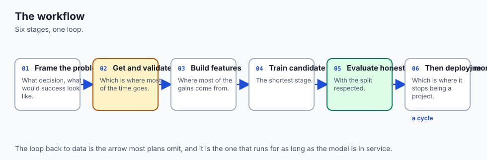

Think about a recipe with a step that says "fold in the egg whites".

That step depends on an earlier one, "beat the egg whites to soft peaks",
and the dependency is not a matter of taste. Perform them in the other
order and you do not get a slightly worse cake. You get something that is
not a cake, and — this is the part that matters — **you find out much
later, from the oven, in a form that does not tell you which step was
wrong.**

A recipe handles this by being a numbered list that a human reads in
order. That works because the steps are short, the cook is present, and
the failure is spectacular.

A machine learning pipeline has none of those advantages. The steps are
long. Nobody is watching most of the time. And the failure is not
spectacular at all: it is a number that is slightly too good, which is
the one kind of bad news that nobody investigates.

So the workflow needs something the recipe does not: each step has to
**declare its own dependencies**, so that running them out of order is
detected by the machinery rather than noticed by a person.

That is the difference between a workflow you have *drawn* and a workflow
you have *wired up*. Drawn workflows are documentation, and documentation
does not run. A wired-up workflow is code that fails when the ordering is
wrong.

![Diagram: seven stages drawn as cards, each listing what it requires and what it produces. Frame requires a decision to change and produces the target, the metric and a baseline to beat. Load produces X and y. Split requires X and y and produces folds, and is marked as coming first. Select and clean requires X, y and folds and produces a per-fold selection, never a global one. Fit requires folds and the selection and is annotated as 30 percent of this pipeline. Evaluate produces a score with the baseline beside it. Error analysis produces which cases fail and what to change next, and a dashed loop returns from it to framing. Below all seven, a wide panel marks the test set as a one-way gate that everything above loops around and that is crossed once at the end. A final panel records the measurement: run in the drawn order the pipeline scores 0.50 on pure noise, which is chance and correct, while selecting before splitting scores 0.73 with no warning of any kind](./assets/workflow-stages-architecture.svg)

## Historical background

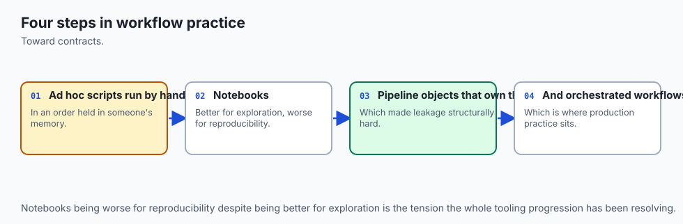

The workflow was written down as a process long before machine learning
had a workflow worth writing down, and the reason is that it was not
invented for machine learning.

**CRISP-DM** — the Cross-Industry Standard Process for Data Mining —
was published in 1999 by a consortium including Daimler-Chrysler, SPSS and
NCR. Its six phases are business understanding, data understanding, data
preparation, modelling, evaluation and deployment, drawn as a circle
because the process was understood from the start as a loop rather than a
line. It remains, more than twenty-five years later, the most widely
recognised description of the thing, and its longest-lasting contribution
is the ordering of the first two phases: understand the business problem
*before* the data, and the data before the model.

**SEMMA**, from the SAS Institute in the same era, took a narrower view —
sample, explore, modify, model, assess — and is more tightly bound to
tooling. The two are usually presented as rivals; the difference that
matters is that CRISP-DM begins outside the data and SEMMA begins inside
it, which is a disagreement about whether framing is part of the job.

What neither had was a way to *enforce* anything, because they were
methodologies rather than software. That gap took much longer to close.
scikit-learn's `Pipeline` object, which makes the correct ordering of
preprocessing and model fitting structural rather than advisory, arrived
in the library's early years and is the single most important practical
contribution to this problem. It exists precisely because the wrong
ordering was so common and so silent.

The measurement in this lesson also has a literature. Ambroise and
McLachlan published a paper in 2002 on selection bias in gene-expression
classification, showing that choosing features on the full dataset before
cross-validating produced dramatically optimistic error rates — on
microarray data where the number of features vastly exceeds the number of
samples, which is exactly the shape of today's noise dataset. *The
Elements of Statistical Learning* devotes a section to it under the
heading of the wrong and right ways to do cross-validation, and it is
still being rediscovered in published work every year.

The last decade added the operational half. The phrase "technical debt in
machine learning systems" comes from a 2015 paper by a team at Google
arguing that the model code is a small box in the middle of a much larger
system, and the MLOps tooling that followed — pipeline orchestrators,
feature stores, model registries — is mostly an attempt to make the
non-modelling parts of this workflow reproducible.

## What it is — and what it is not

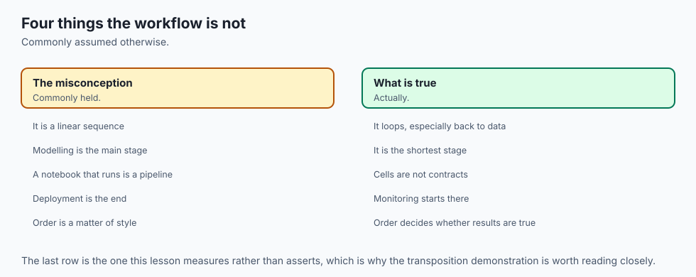

The workflow is **a loop around a one-way gate**.

The loop is stages one through seven: frame the problem, get the data,
split it, prepare features, fit, evaluate, analyse the errors, and go
round again with what you learned. You will traverse that loop many times.
It is supposed to be traversed many times.

The gate is the test set. It is crossed once, at the end, after the
looping has stopped. Everything inside the loop is fair game to iterate
on; the moment the test set enters the loop it stops being a test set and
becomes another validation set, and you no longer have an unbiased
estimate of anything. Day 144 measures what that costs.

Now the things it is not.

**It is not a linear sequence.** Every honest account of the process
describes going backwards. Error analysis sends you back to feature
preparation. Feature work reveals that the data you loaded does not
support the target you framed. Evaluation reveals that the metric you
chose is not the one anyone cares about. The arrows in the diagram point
both ways, and a workflow drawn as a straight line is a workflow that has
not been run.

**It is not mostly modelling.** This claim usually arrives as folklore
with a percentage attached, and the percentages disagree with each other,
so today's lab measures its own pipeline instead:

```text
    load             5 lines
    split            2 lines
    select          10 lines
    fit_and_score    9 lines
    baseline         4 lines
    total           30 lines
  the fitting stage is 30.00% of this pipeline
```

Thirty percent — and that is an **upper bound**, not an estimate, because
this pipeline is deliberately minimal. It has no data cleaning stage. It
has no monitoring, no deployment, no schema validation, no drift
detection, and no code at all for the part where somebody decides what the
target should be. Every one of those additions makes the modelling
fraction smaller. What the measurement establishes is a direction, and the
direction is enough.

**It is not a set of stages that can be run in any order that produces
output.** This is the failure the whole day is built around, and it is
worth being precise about why it is so easy to commit. The wrong ordering
does not produce an error, does not produce a warning, and does not
produce an implausible number. It produces a *better* number, which means
the ordinary feedback loop of software development — try it, see if it
looks right — is actively pointing the wrong way.

**And it is not finished when the model is good.** A model that is never
deployed has produced nothing. A model that is deployed and never
monitored will decay, because the world moves and the training
distribution does not.

## Why it was created and what problems it solves

Each stage exists because a specific, expensive failure happens when it is
missing. That is the useful way to hold the list in your head: not as
seven things to do, but as seven failures somebody already paid for.

**Framing exists because projects solve the wrong problem.** The stage
produces three things — the target, the metric, and the baseline to beat —
and all three have to be settled before any model exists, because all
three determine which model you would ship.

The metric especially. Here are five candidates on an imbalanced problem
where eight percent of rows are positive:

| Model | accuracy | precision | recall | F1 |
| --- | --- | --- | --- | --- |
| majority baseline | 0.9200 | 0.0000 | 0.0000 | 0.0000 |
| logistic (default threshold) | 0.9435 | 0.7196 | 0.4813 | 0.5768 |
| logistic (balanced) | 0.8685 | 0.3619 | 0.8438 | 0.5066 |
| 5-NN | 0.9360 | 0.6739 | 0.3875 | 0.4921 |
| depth-3 tree | 0.9275 | 0.6027 | 0.2750 | 0.3777 |

Read that table twice, once down the accuracy column and once down the
recall column, and you have selected two different models. Accuracy ships
the default-threshold logistic regression. Recall ships the balanced one —
which is, on accuracy, the *worst* model in the table and the only one
that loses to a constant.

The metric was not a reporting decision. It was the decision.

**Baselines exist because scores have no absolute meaning.** The first row
of that table is a model that always predicts the majority class. It has
learned nothing, cannot possibly be useful, and scores **0.92**. The three
real models that beat it do so by at most 2.35 points. Without that row,
0.9435 reads as an excellent result; with it, it reads as two and a bit
points of value that you now have to justify against the cost of
maintaining a model.

**Splitting exists because a model can memorise**, which Day 141 measured,
and Day 144 covers properly.

**Careful stage ordering exists because of the 0.73.** That is this
lesson's contribution and the rest of it is spent there.

**Error analysis exists because an aggregate hides everything.** The
0.9435 model, broken down:

```text
  rows = true class, columns = predicted class
    true 0: [1810, 30]
    true 1: [83, 77]
```

Ninety-four percent accurate, and it misses eighty-three positives while
catching seventy-seven. It finds *fewer than half* of the thing it exists
to find. One number told you it was good. Four numbers told you what it
does.

**Reproducibility exists because you will need to know whether something
changed.** A pipeline that cannot prove it produced the same output twice
cannot be debugged, because you can never distinguish a fix from a
coincidence.

## How it works

### A stage is a contract, not a cell in a notebook

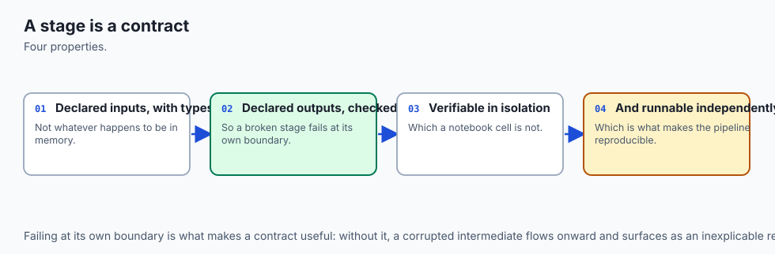

Here is the whole idea in one dataclass:

```python
@dataclass
class Stage:
    name: str
    run: Callable[[Artifact], dict]
    requires: tuple = ()
    produces: tuple = ()
```

And the runner:

```python
for stage in stages:
    if enforce_contracts:
        missing = [k for k in stage.requires if k not in artifact.data]
        if missing:
            raise StageContractError(
                f"stage {stage.name!r} requires {missing} which no earlier stage produced"
            )
    produced = stage.run(artifact)
    artifact = artifact.with_(**produced)
    artifact.log.append((stage.name, tuple(sorted(produced))))
```

Four things in that loop are doing real work, and each is a decision worth
defending.

**The check runs before the stage, not after.** A stage that has already
half-run and then fails leaves you reasoning about a partially-mutated
state. Checking first means a stage either runs completely or does not
start.

**`with_` returns a new artifact rather than mutating in place.** This is
not functional-programming decoration. A stage that mutates its input
makes the step log a work of fiction, because the log then describes
states that no longer exist. An audit trail that can be rewritten by the
thing it audits is not an audit trail.

**The log records what each stage produced, not what it was asked to
do.** Intent is cheap. The step log for the honest pipeline:

```text
    load           -> X, y
    split          -> folds
    select         -> selected
    fit_and_score  -> fold_scores, score
    baseline       -> baseline
```

**And the contract is checked in both directions.** A stage that fails to
produce what it declared raises; so does one that produces something
extra. The second is easy to dismiss and worth keeping, because undeclared
outputs are how a pipeline accumulates hidden coupling that nobody can see
in the code.

### The measurement: two stages, transposed

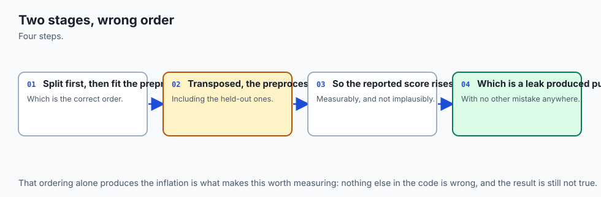

Now the central experiment. The dataset is deliberately hostile in a
specific way: one hundred rows, five thousand features, labels from a coin
flip. Five thousand columns of noise and one hundred rows means that by
pure chance, some columns will correlate with the labels quite well. Not
because they mean anything — because with five thousand attempts at a coin
flip, some sequences match.

The wrong pipeline:

```python
chosen = top_k_features(X, y, k)          # uses every row, including test rows
for train, test in folds(X, y):
    model = KNeighborsClassifier(1).fit(X[train][:, chosen], y[train])
```

The right one:

```python
for train, test in folds(X, y):
    chosen = top_k_features(X[train], y[train], k)   # training rows only
    model = KNeighborsClassifier(1).fit(X[train][:, chosen], y[train])
```

In the first, every fold's *test* rows helped choose the features. The
features were fitted to the answers before the answers were hidden. The
model then legitimately does well on those test rows, because they were
consulted when deciding what to look at.

Note what is *not* wrong with the first version. The model never sees a
test label during fitting. The folds are correct and disjoint. The
cross-validation loop is textbook. Every individual piece is right, and
the composition is wrong — which is why reviewing the model code line by
line will never find it.

![Diagram: two parallel tracks of five stages each, sharing the same data and the same model, with a token travelling each track in turn. The upper track, headed correct order, runs load, split, select, fit, baseline and arrives at a result panel reading 0.50 with the note chance, which is correct. The lower track, headed wrong order with contracts off, runs load, select, split, fit, baseline and arrives at 0.73 with the note invented, and silent. The split and select boxes are shaded on both tracks as the only difference between them. Below, a panel records that with contracts enforced the same wrong ordering raises StageContractError naming stage select and the missing key folds, and a final panel explains that the select stage declares it needs the folds because it genuinely does, that declaring it honestly is the whole mechanism, and that a team writing the requirement as X and y alone has not hit a subtle bug but written down a claim that is false](./assets/two-orderings-flow.svg)

### How big the lie gets

The twenty-three points are not a fixed penalty. They depend on how many
features you select, and the relationship is worth seeing:

| features chosen | wrong order | right order | invented |
| --- | --- | --- | --- |
| 5 | 0.6500 | 0.3900 | +0.2600 |
| 10 | 0.7200 | 0.5000 | +0.2200 |
| 20 | 0.7300 | 0.5000 | +0.2300 |
| 50 | 0.8500 | 0.3800 | +0.4700 |

At fifty features the wrong ordering reports eighty-five percent accuracy
on data that contains nothing. There is no shape of that curve that makes
the wrong order safe.

One honest note about that table, because it would be easy to skate past:
two of the right-order scores are **below** chance, at 0.39 and 0.38. That
is not anti-learning and it is not a bug. With one hundred rows split five
ways, each fold's score is measured on twenty rows, giving a standard
error near 0.11 around a true value of 0.5. An estimate that wanders will
wander below as readily as above — Day 117's arithmetic, arriving where it
matters. The lab therefore asserts that the honest score is *at or below*
chance rather than exactly 0.5, because that is the claim the evidence
actually supports.

### The contract is a declaration, and declarations can be false

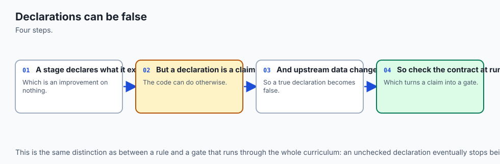

This is the part of the day most likely to be misread, so it is worth
being blunt about it.

The `select` stage in the leaky pipeline still declares `folds` among its
requirements:

```python
Stage(
    "select",
    _stage_leaky_select,
    requires=("X", "y", "folds", "k"),
    produces=("selected",),
)
```

That requirement is **true**. Choosing features is a per-fold operation.
Declaring it honestly is the entire mechanism by which the runner can
notice that the stage has been placed too early.

Which means the contract does not protect you from a team that writes
`requires=("X", "y")` on that stage. Nothing does. But that team has not
been caught out by a subtle bug — they have written down a claim that is
false, in a file, where somebody can read it and disagree. That is a
categorically better position than a notebook where the dependency was
never stated at all and exists only in the order the cells were run.

**The value of a contract is that it turns an implicit ordering into a
reviewable claim.** It does not make wrong claims impossible. It makes
them visible.

### Reproducibility: proving the pipeline did the same thing twice

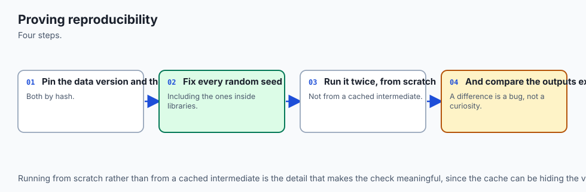

The last piece of machinery is a manifest of content hashes:

```python
def fingerprint(value) -> str:
    if isinstance(value, np.ndarray):
        payload = np.ascontiguousarray(value).tobytes() + str(value.dtype).encode()
    else:
        payload = repr(value).encode()
    return hashlib.sha256(payload).hexdigest()[:16]
```

Run the honest pipeline twice at seed 143 and once at seed 144:

```text
    X            51b0a421bd652dd2
    fold_scores  8f0ac332958b9bc4
    score        d2cbad71ff333de6
    y            9984503b5352c5a1
  two runs at seed 143 agree             : True
  a run at seed 144 differs              : True
```

The second line is the claim. **The third line is what makes the second
line mean anything**, and it is the check people leave out. A manifest that
always matches might be proving determinism, or it might be proving that
you are hashing a constant, and only a deliberate change can tell you
which.

One detail in `fingerprint` is deliberate and worth copying: the dtype is
part of the hash. The same numbers stored as `int64` and as `float64` hash
differently, on purpose, because treating them as the same artifact would
hide a real class of bug. Silently-equal hashes are worse than no hashes.

### Failing well

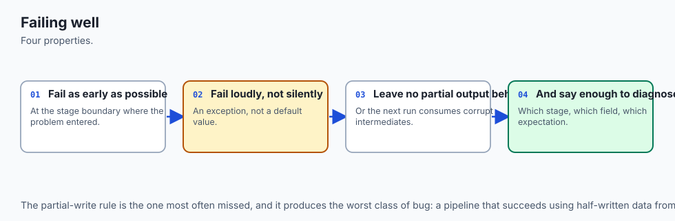

The last thing the contracts buy is the quality of the failure. Run the
honest pipeline against an empty artifact, with contracts on and off:

```text
with contracts on : StageContractError: stage 'load' requires
                    ['n_samples', 'n_features', 'seed'] ...
with contracts off: KeyError: 'n_samples'
```

Both fail. Only one tells you which stage broke and what it wanted. The
`KeyError` names a dictionary key from somewhere inside a function you now
have to go and find, and in a pipeline of thirty stages that difference is
most of your afternoon.

## An everyday analogy

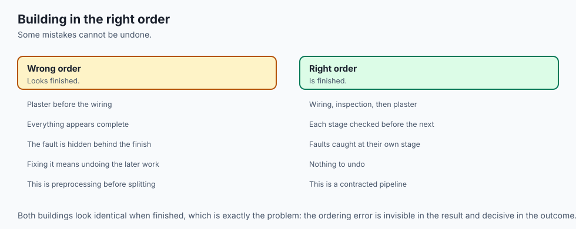

Consider a hospital laboratory processing a blood sample.

The sample arrives, is labelled, is split into aliquots, and each aliquot
goes to a different test. Results come back, get read against reference
ranges, and a report goes to a clinician. That is a workflow, and it looks
very like the one in this lesson.

Now consider what a laboratory does that a notebook does not.

**Every step has a chain of custody.** Not because anyone distrusts the
technicians, but because when a result is surprising, the first question
is what happened to the sample — and "I think I did them in the usual
order" is not an answer. That is the step log.

**Steps that must precede other steps are physically enforced** wherever
possible. The aliquots are split before any reagent is added, and they are
split by a machine whose sequence you cannot reorder by accident. That is
the stage contract.

**Controls are run alongside the sample.** A known-negative and a
known-positive go through the same process, every batch. If the
known-negative comes back positive, the batch is void — regardless of how
plausible the patient results look. That is the baseline, and it is also
the noise dataset in today's lab: a known-negative put through the
pipeline, so that a pipeline reporting 0.73 on it is *known* to be broken
without needing to argue about the real data.

The analogy earns its keep at that last point. Everybody accepts that a
laboratory runs controls. Almost nobody runs a control through their
machine learning pipeline — feeds it data with a known answer of "there is
nothing here" and checks that it says so. It costs about four lines. It
would have caught the 0.73.

## Examples in practice

### The framing stage, done properly

A team is asked to "reduce customer churn with machine learning". The
framing stage turns that into three artifacts before anybody writes code:

- **The target.** Churn defined how? Cancelled within thirty days of
  renewal? Ninety? Stopped using the product but still paying? Each is a
  different column and a different project.

- **The metric.** If the intervention is a discount email costing very
  little, recall matters and precision barely does. If it is a phone call
  from a named account manager, precision is the constraint. The table
  earlier in this lesson is what that choice looks like in numbers.

- **The baseline.** What does the current process achieve? If the sales
  team already calls everyone whose usage dropped, that is the baseline,
  and it may be hard to beat.

Skipping this stage does not feel like skipping anything, which is exactly
why it gets skipped. There is no error message for "you built a model for
the wrong target".

### Stage ordering, in the tools that get it right

scikit-learn's `Pipeline` exists to make today's failure structurally
impossible:

```python
from sklearn.pipeline import Pipeline
from sklearn.feature_selection import SelectKBest, f_classif

pipe = Pipeline([
    ("select", SelectKBest(f_classif, k=20)),
    ("model", KNeighborsClassifier(1)),
])
cross_val_score(pipe, X, y, cv=5)
```

The mechanism is worth understanding rather than memorising. `Pipeline`
delays every `fit` until it is inside the cross-validation fold. The
selection step is fitted on the training rows of each fold and only
`transform`-ed on the test rows, so there is no arrangement of this code
in which the test rows influence the selection.

This is the same idea as today's stage contract, implemented once, in a
library, by people who had seen the failure enough times to build against
it.

### Error analysis, and what it changes

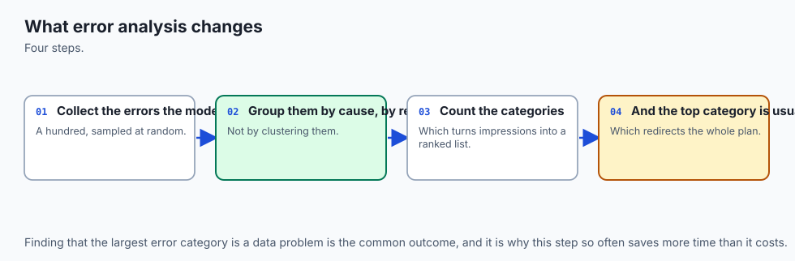

Return to the confusion matrix. Eighty-three false negatives against
seventy-seven true positives. What does an analyst do next?

Not "try a better model". They ask which eighty-three. Are they the
borderline cases near the decision boundary, in which case moving the
threshold is the whole fix and no new model is needed? Are they a
recognisable subgroup, in which case there is a missing feature? Are they
mislabelled, in which case the ceiling is lower than anyone thinks?

Three different answers, three different next stages, and the aggregate
score distinguishes none of them. Error analysis is the stage that decides
what the next loop is *for*.

### What the eight measurements say together

The lab's numbers make one argument. A workflow is not the list of its
stages, because the same stages in a different order gave 0.50 and 0.73.
It is not the modelling either, which was thirty percent of a pipeline
with no cleaning or deployment in it. It is the *connections*: what each
stage may assume, what it must produce, what crosses the gate and when.
Get those right and the number at the end means something. Get them wrong
and it means nothing, quietly.

## Implications: security, privacy, performance, scalability, and cost

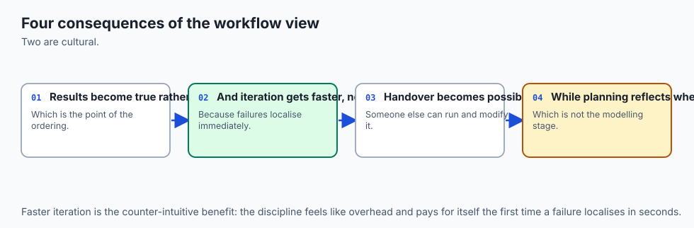

**The most expensive property of the ordering bug is when you find out.**
A model that reports 0.73 in development, ships, and delivers 0.50 in
production has cost the build, the review, the deployment, the incident,
and the credibility of the next project. The contract check costs
microseconds and runs on every execution.

**Reproducibility is a security control, not only a scientific one.** The
manifest in today's lab is the same primitive as a package lock file, a
container digest, or a signed release artifact, and it answers the same
question: is what I have now the thing I checked before? A pipeline that
cannot answer that cannot be audited, and "the notebook I ran in March" is
not an answer to a regulator, a reviewer, or a colleague in two years.

**Privacy attaches to the split, and it is the stage where it is easiest
to get wrong.** If your rows are people and the same person appears in
both halves, your test set is not held out and your model may be
memorising individuals — which is both an evaluation failure and a
disclosure risk. Day 144 measures the evaluation half.

**The step log is an access-control surface.** It records what data
entered which stage. That is exactly what a data protection review needs
and exactly what a notebook cannot provide.

**Performance and scalability favour the contract-checked design**, which
is not obvious and is worth stating. The check is a set difference over a
handful of strings, and it runs once per stage rather than once per row.
Against that, it makes stages independently cacheable — a stage whose
declared inputs have not changed does not need to run again, which is
exactly how a pipeline orchestrator avoids recomputing the expensive parts.
The contract that catches the bug is also the thing that makes the caching
sound.

**And the cost that is hardest to see is the cost of the loop.** Every
traversal is a chance to learn something and also a chance to overfit your
own judgement to the validation set — Day 136's forking paths. The gate
exists to bound that, and the discipline it demands is the unglamorous
one: decide what you are going to try before you try it, and count how
many times you have gone round.

## Alternatives: free, open source, and commercial

### A hand-written stage runner — used here

**When to choose it:** when you want the contract to be visible and
auditable, when your stages are heterogeneous enough that a library's
abstractions do not fit, or — as here — when the point is to understand
what the abstraction is doing for you.

**How to use it:** the entire runner is about forty lines and appears in
this lesson. It is genuinely enough for a small project.

**Watch for:** it enforces only what you declare. That is the honest
limitation and it is discussed above at length.

### scikit-learn's `Pipeline` — used here

**When to choose it:** for any preprocessing that must be fitted, which is
almost all of it — scaling, imputation, encoding, feature selection,
dimensionality reduction. It is free, BSD-3-Clause licensed, no paid tier.

**How to use it:** compose the steps and hand the whole thing to
`cross_val_score`, `GridSearchCV` or `fit`, as shown earlier. Use
`ColumnTransformer` when different columns need different treatment.

**Watch for:** `Pipeline` protects the steps *inside* it. Anything you did
to the data before constructing it — dropping rows, imputing a column,
selecting features by eye in a notebook cell — is outside the protection
and is exactly where the leak comes back.

### Kedro, Metaflow and Prefect — not installed here, described from documentation

These are free, open-source project-scale pipeline frameworks, and they
solve the same problem this lesson solves with forty lines, at the scale
where forty lines stops being enough.

**When to choose one:** when stages must run on different machines, when
you need caching of expensive stages across runs, when a schedule and a
retry policy are involved, or when more than one person is editing the
pipeline. Kedro is the most opinionated about project structure; Metaflow
came out of a data-science-workflow context and emphasises versioning of
runs; Prefect is a general orchestrator with strong scheduling and failure
handling.

**Honest note:** none of these is installed on the authoring machine and
no output from any of them is reproduced anywhere in this lesson.
Everything stated about them comes from their published documentation.

### Managed MLOps platforms — not used here, described from documentation

The major cloud providers all sell platforms combining pipeline
orchestration, experiment tracking, a model registry and monitoring.

**When to choose one:** when the operational half of the workflow —
deployment, monitoring, rollback, audit — is the hard part, and when you
would otherwise be building it yourself.

**When not to:** at the stage where you are still finding out whether the
problem is tractable. The workflow in this lesson runs on a laptop, and it
is the same workflow.

**Free versus paid:** all are paid, generally metered on compute plus
storage plus per-endpoint charges. **No price is quoted here**, because
cloud pricing changes by region and by month and an unchecked figure is
worse than none.

## Comparison with related concepts

| Concept | What it governs | How it relates to this workflow |
| --- | --- | --- |
| CRISP-DM | the phases of a data-mining project | The ancestor of this diagram; a methodology, with no way to enforce anything |
| ETL / ELT pipelines | moving and reshaping data | The same ordering discipline, one stage earlier; Day 126 built one |
| CI/CD | building and shipping software | Where the "prove it runs the same way twice" habit comes from; the manifest is a lock file |
| `sklearn.pipeline.Pipeline` | preprocessing plus a model, as one object | The stage contract, implemented in a library and made structural |
| MLOps | the operational half — deploy, monitor, retrain | The stages this lesson names but does not build, which is why its 30 percent is an upper bound |
| Experiment tracking | recording what you tried and what happened | The step log and manifest, scaled up and made searchable |
| Feature stores | computing features once, consistently | An answer to a specific ordering bug: features computed differently at training and serving time |

The last row deserves a note, because it is the same bug as today's in a
different costume. **Training-serving skew** happens when the feature
computed during training and the feature computed at prediction time are
not the same function — a rolling average over a window that includes the
present in training and excludes it in production, say. It is silent, it
inflates the offline number, and it is found only when live performance
disappoints. A feature store exists so that one definition serves both,
which is the structural fix, exactly as `Pipeline` is the structural fix
for the leak measured today.

## When to use it — and when not to

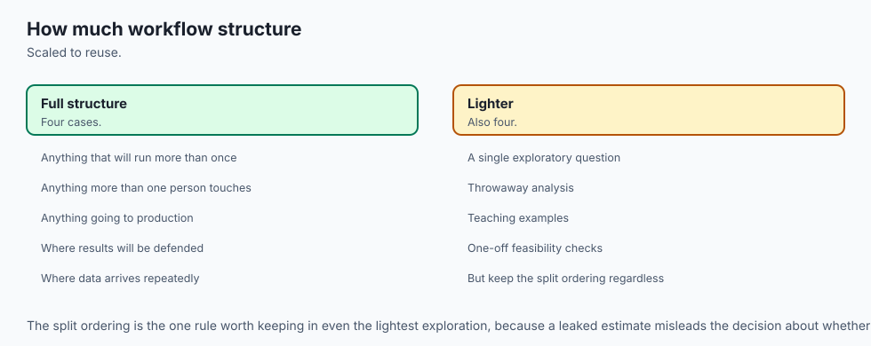

**Use the full workflow, with contracts, when the result will be acted
on.** If a number you produce will change a decision, somebody is entitled
to ask how it was produced, and you should be able to answer with a step
log rather than a memory.

**Use it especially when the data is wide.** Today's dataset — one hundred
rows, five thousand features — is the shape where selection bias is
enormous, and it is a real shape: genomics, sensor arrays, text with
n-gram features, anything with more columns than rows. The inflation
reached forty-seven points.

**You do not need the full apparatus for exploration.** A notebook where
you look at distributions and form hypotheses is a legitimate and valuable
thing, and wrapping it in stage contracts would slow it down for no
benefit. The rule is about the boundary: the moment a number leaves the
notebook and enters a conversation, it needs to have come through the
wired-up pipeline. A finding is not a result.

**Do not use a heavyweight orchestrator too early.** The workflow in
today's lab runs on a laptop in a few seconds, and it is the same workflow
a platform would run. Adopting a framework before you know your stages
means designing your project around somebody else's abstraction of a
problem you have not met yet.

**And do not skip the framing stage because it produces no code.** It is
the only stage whose omission has no error message. Every other failure in
this lesson eventually announces itself; a model built for the wrong
target can go to production and work perfectly.

### The AI thread

The workflow does not disappear when the model is a large language model.
It changes shape in one specific way, and understanding which way is most
of what distinguishes competent LLM engineering from prompt-tinkering.

The **framing** stage is unchanged and becomes more important, because the
model will produce fluent output for a badly-framed task and the output's
fluency conceals the framing error.

The **splitting** stage becomes harder in a way that is worth naming
plainly. Your evaluation set must be data the model has not seen — and the
model was trained on a large fraction of the public internet. A benchmark
published before the model's cutoff may well be in its training data, and
a score on it is then measuring memorisation. This is Day 141's leakage
and today's ordering problem combined, at a scale where you cannot inspect
the training set to check.

The **metric** stage is where most of the difficulty moves. There is no
`accuracy_score` for "was this summary good". So the metric becomes a
rubric applied by human raters, or by another model acting as judge — and
that judge is itself a model with its own biases, which need their own
evaluation. The table in this lesson, where the metric decided which model
shipped, applies with more force when the metric is itself a learned
thing.

**Error analysis** becomes the highest-leverage stage of the lot. Reading
a hundred actual failures of an LLM system tells you more than any
aggregate score, because the failure modes are categorical — refuses when
it should answer, hallucinates a citation, ignores half the instruction —
and each one has a different fix.

And the **contract** idea transfers directly. A retrieval-augmented system
is a pipeline: retrieve, rank, assemble a context, generate, post-process.
Every one of those stages has inputs it requires and outputs it promises,
and every one of them can be silently mis-ordered. The 0.73 has an exact
analogue: an evaluation where the retrieval step was tuned using the same
questions the system was later scored on. Same bug, same silence, same
fix.

## The AI connection

- **The workflow is the same for a linear model and a frontier system** — frame, data, train,
  evaluate, deploy, monitor.
- **Most of the effort is not in the modelling step**, which is the fact that reshapes how
  projects should be planned.
- **The loop back to data is the one that matters**, and it is the one most plans omit.
- **Every stage can invalidate the ones after it**, which is why the order is a discipline
  rather than a convention.
- **AI engineering follows this workflow with different nouns**, substituting prompts and
  evaluation sets for features and validation folds.

## Knowledge check

1. Two pipelines share their data, model, folds and seed, and differ only
   in that one runs `select` before `split`. One reports 0.50 and the
   other 0.73 on data whose labels are coin flips. Explain the mechanism
   in one sentence, and say why reviewing the model code would not find
   it.

2. The `select` stage in the leaky pipeline declares that it requires
   `folds`. Why is that declaration the thing that makes the mis-ordering
   detectable, and what does it fail to protect against?

3. A model scores 0.9435 accuracy. The majority-class baseline scores
   0.9200. What have you learned, and what would you need to know next?

4. Give a case where a model with lower accuracy than a constant is the
   right one to ship, using the table in this lesson.

5. A pipeline's manifest is identical on every run. Name the two different
   situations that could produce that, and the one check that
   distinguishes them.

6. Why does the runner check a stage's requirements *before* running it
   rather than catching the resulting exception?

7. This lesson measured the fitting stage at 30% of its pipeline and
   called that an upper bound rather than an estimate. Justify the word
   "upper".

8. Two of the honest cross-validation scores in the inflation table are
   below 0.5. Explain why that is expected, and why the lab asserts an
   inequality rather than a value.

## Hands-on exercise

Today's lab, `The Workflow, Wired Up`, builds the workflow as stages with
declared contracts, then measures what the ordering is worth.

Thirteen exercises. The first half establishes the machinery — the step
log, the immutable artifact, the contract in both directions — and then
transposes two stages and measures the twenty-three points. The second
half is the decisions the machinery exists to support: the metric, the
baseline, the confusion matrix, and a manifest that proves determinism.

Build the environment, then work through
`starter/test_workflow_claims.py`, replacing one `pytest.skip` at a time.
Each skip names the exact helper and the exact value to assert.

### Expected output

The harness ends with:

```text
---------------------------------------------------------------
14 checks, 0 failure(s)
```

and exits 0. `pytest examples -q` reports `17 passed`, and
`pytest starter -q` reports `4 passed, 13 skipped` until you begin.

The measured table, printed by `examples/report_measurements.py`,
includes:

```text
  split then select (correct)            : 0.5000
  select then split (wrong, unchecked)   : 0.7300
  accuracy invented by the reordering    : 0.2300
  with contracts enforced                : StageContractError
    stage 'select' requires ['folds'] which no earlier stage produced
  two runs at seed 143 agree             : True
  a run at seed 144 differs              : True
```

### Validate your work

1. `bash tests/run_tests.sh; echo "exit=$?"` reports `14 checks, 0
   failure(s)` and `exit=0`. Capture the harness's own exit status, never
   a pipeline's.

2. `.venv/bin/pytest examples -q` reports `17 passed`.
3. `.venv/bin/python3 examples/report_measurements.py | diff - expected-output/measured-values.txt`
   produces no output.

4. When you have finished every exercise, `pytest starter -q` also reports
   `17 passed`.

5. Break one assertion on purpose, confirm the harness reports the failure
   and exits non-zero, and restore it.

### Troubleshooting

**`StageContractError` when you did not expect one.** Read the message: it
names the stage and the missing key. If you are running `leaky_stages()`
with contracts on, that error *is* the expected result.

**A bare `KeyError` from inside a stage.** You ran with
`enforce_contracts=False`. Both paths fail; only one tells you which stage
broke. Exercise 8 asserts both, side by side.

**`import file mismatch`.** You ran `pytest examples starter` in one
invocation. Run them separately — check 5 asserts that the combined form
fails.

**An honest score below 0.5.** Expected. Twenty test rows per fold gives a
standard error near 0.11. The lab asserts `right <= 0.5` for that reason.

**Manifest hashes that do not match.** Read `expected-output/FIELDS.md`.
The hashes are over exact float bytes and move with the NumPy pin; the
property that must hold anywhere is that two runs agree and two seeds do
not.

### Common mistakes

**Reading the 0.73 as a modelling problem.** It is not. The model, the
folds and the data are identical in both runs. Only the order changed.

**Declaring a stage's requirements as whatever makes the pipeline run.**
That inverts the whole point. The requirement is a claim about what the
stage genuinely depends on, and getting it right is the work.

**Asserting the manifest matches without asserting a different seed
differs.** The second check is what makes the first mean anything.

**Skipping exercise 4 because the numbers look boring.** That table is the
day's most consequential result: two metrics, five models, two different
answers about what to ship.

## Practice assignment

Take a pipeline you already have — a notebook, a script, or a chain of
scripts — and convert its first five stages into declared contracts.

1. **Write down each stage's `requires` and `produces` before looking at
   the code.** Then check the code against them. Note every place they
   disagree; each disagreement is either a wrong declaration or a hidden
   dependency, and both are findings.

2. **Find the stage that is fitted.** Anything that learns from data —
   a scaler, an imputer, an encoder, a feature selector, a threshold — and
   confirm it is fitted on training rows only. If you cannot tell from the
   code, that is your answer.

3. **Run a control.** Replace your labels with a random permutation, run
   the whole pipeline, and record the score. Anything meaningfully above
   your baseline is a bug report. This is four lines and it is the single
   highest-value thing in this assignment.

4. **Add a manifest.** Hash your inputs and your final score. Run twice,
   confirm they match. Then change the seed and confirm they do not.

5. **Write down your metric and your baseline**, in that order, before
   looking at any model score. If you cannot state why that metric and not
   another, the framing stage is not finished.

The deliverable is the contract table, the control result, and the
manifest — not a better model.

## Extension challenge

Pick one and measure it. Report what you observed rather than what you
expected.

1. **Make the leak pass its contracts, dishonestly.** Change `select` to
   declare `requires=("X", "y", "k")` and watch the whole pipeline run
   green at 0.73. Then write two sentences on what that tells you about
   where the real control lives.

2. **Replace the runner with `sklearn.pipeline.Pipeline`.** Wrap selection
   and model together, pass it to `cross_val_score`, and confirm the
   honest number. Explain which property of `Pipeline` makes the leak
   impossible rather than merely unlikely.

3. **Sweep the threshold.** Instead of comparing default against balanced
   class weights, sweep the decision threshold with `predict_proba` from
   0.05 to 0.95 and report the threshold maximising F1. Compare it to both
   models in the lesson's table.

4. **Break determinism on purpose.** Remove `random_state` from the
   `StratifiedKFold`, confirm the manifest stops matching, and then say
   what you would have concluded had you found that in a real project with
   no manifest to tell you.

5. **Find the worst k.** Sweep the number of selected features from 5 to
   100 and find where the invented accuracy is largest. Explain the shape
   of the curve in terms of how many chances the selector gets.

6. **Add the missing stages.** Add a cleaning stage and a monitoring stage
   with honest contracts, re-measure `stage_source_lines`, and report how
   far the modelling fraction falls below 30 percent.
