## Why this matters

Build a classifier from scratch. Five methods: `fit`, `predict`,
`predict_proba`, `score`, `get_params`, `set_params` — six, if you count
honestly. Test it against the real library. It predicts exactly what
`DummyClassifier(strategy="most_frequent")` predicts, every row, every
seed. Not close. Identical.

Feed the same object to `cross_val_score`:

```text
AttributeError: 'MajorityClassifier' object has no attribute '__sklearn_tags__'.
...Make sure to inherit from `BaseEstimator`...
```

Nothing about `fit`, `predict` or `score` changed. Called directly, all
three still work, on the same object, with the same data. What broke is
something the object never knew it needed: a method named
`__sklearn_tags__`, which nobody wrote by hand and which turns out to be
the thing `Pipeline` and `cross_val_score` check before they will let an
estimator anywhere near a fold of data.

That gap is this lesson's subject, and it is worth taking seriously
because it is not a trick question. Days 141 through 145 called `.fit()`
and `.predict()` on scikit-learn objects dozens of times — a splitter, a
1-NN, a `LogisticRegression`, a `GatedTestSet` wrapping a real classifier —
and never once explained what those calls actually mean. That silence was
deliberate: the workflow, the splits and the overfitting arithmetic were
the point, and the object underneath them was scenery. Today the object
becomes the subject, and the scenery gets inspected.

The reason this matters beyond a single lab: the four-verb interface is
the reason a `Pipeline` can wrap *any* combination of a scaler, an
encoder, a feature selector and a classifier and treat the whole thing as
one estimator; the reason `GridSearchCV` can search hyper-parameters for
an algorithm it has never heard of; the reason a model you trained last
year can be swapped for a different algorithm entirely by changing one
line, with every downstream script — the cross-validation, the metrics,
the deployment code — untouched. That interoperability is not a
convenience feature. It is the entire reason scikit-learn code from one
project drops into another project without a rewrite, and it is built on
a contract narrow enough to hold in your head and precise enough that this
lab can verify every clause of it by running real code and reading what
comes back.

The failure above is the honest version of the story, not a simplified
one. The four-verb contract is real, it is sufficient for direct use, and
this lesson proves that with a hand-built estimator whose output is
byte-identical to the library's. It is also, in the version of
scikit-learn this lab measured, no longer quite sufficient for full
interoperability — and finding that out by testing, rather than assuming
it from documentation, is exactly the habit the rest of this course keeps
asking you to build.

## The idea in plain language

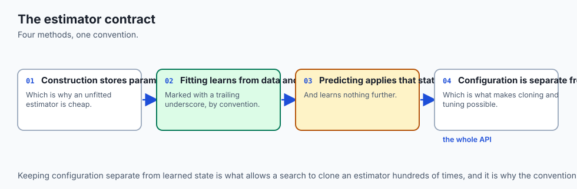

Think of an estimator as an appliance, and the rest of scikit-learn as the
wiring in a house.

A toaster, a lamp and a kettle are wildly different machines, doing
wildly different jobs, built by different companies, with different
internals nobody outside the factory has ever seen. None of that matters
to the wall socket. The socket has one shape. Anything built to that
shape's dimensions plugs in and draws power, and the house's wiring never
needed to know a single thing about toasting bread or boiling water.

`fit`, `predict`, `predict_proba`, `score`, `get_params` and `set_params`
are the shape of the plug. A `LogisticRegression`, a `KNeighborsClassifier`
and a hand-built classifier that always guesses the most common class are
three wildly different machines. None of that matters to `cross_val_score`
or `GridSearchCV` — the "wiring" of scikit-learn. Anything built to the
plug's shape gets fit, scored and compared, and the wiring never needed to
know a single thing about logistic curves or nearest neighbours.

Here is where the analogy earns its keep, because a modern house is not
just a socket and a plug. Some appliances are "smart" — they have a small
chip inside that reports a status light back to a home hub, so the hub
knows the appliance is actually plugged in and ready before it schedules
anything through it. A dumb toaster still works when you plug it in and
push the lever by hand. It just cannot join a scheduled routine, because
the hub has no way to check whether it is even there.

That is precisely the shape of what this lab measures. A classifier built
with only the five methods works when you call them by hand — the
equivalent of pushing the lever yourself. It fails the instant you ask a
piece of scikit-learn's own machinery — `Pipeline`, `cross_val_score` — to
check on it first, because that check reads a signal (`__sklearn_tags__`)
that only comes from wiring the appliance the recommended way (inheriting
`BaseEstimator`). The fix, like the smart-home fix, is not a redesign. It
is adding the one chip the hub already knows how to read.

Carry this analogy through the rest of the lesson: the socket's shape is
the API's four verbs; the smart-home chip is `BaseEstimator`'s
`__sklearn_tags__`; and `get_params`/`set_params` are the appliance's
settings dial, which the hub reads and writes without ever opening the
case — which is exactly how `GridSearchCV` searches an estimator it has
never seen before.

![Diagram: an estimator object shown with hyper-parameters entering through init on the left, fit of X and y in the centre turning those hyper-parameters plus training data into learned state on the right -- five attributes, every one ending in a trailing underscore: classes underscore, coef underscore, intercept underscore, n features in underscore, n iter underscore. Below that, predict, predict proba and score read that learned state back out, with a note that predict equals classes underscore indexed by the argmax of predict proba, measured directly. A separate card states that before fit runs, none of that state exists and predict raises NotFittedError with the message is not fitted yet, call fit, measured identically on a library estimator and a hand-built one. Along the bottom, a loop shows get params, set params and clone touching configuration only, never learned state, with clone defined as building a fresh instance from the type of the estimator called with get params of deep false -- measured to produce identical get params and no learned attributes on the clone, while the original estimator stays fitted](./assets/estimator-anatomy-architecture.svg)

## Historical background

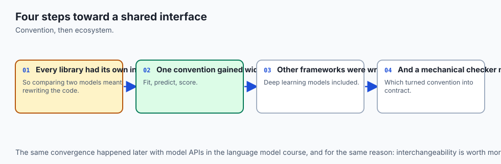

scikit-learn began as a Google Summer of Code project in 2007, started by
David Cournapeau, and was released publicly in 2010 under a BSD licence.
It absorbed and unified what had previously been a scattered collection of
separate machine-learning packages for Python, each with its own calling
convention — some used `.train()`/`.classify()`, some used
`.learn()`/`.apply()`, and comparing two algorithms meant learning two
different vocabularies before you could even run the comparison.

The design decision that made today's lesson possible was published, not
merely practised. Lars Buitinck and a long list of scikit-learn's core
developers wrote up the project's API design explicitly in a 2013 paper,
"API design for machine learning software: experiences from the
scikit-learn project," presented at a European conference on machine
learning and knowledge discovery in databases. The paper states the
principle this lesson is built around directly: consistency, meaning every
object exposes a limited set of methods (`fit`, `predict`, `transform` and
so on) with a shared, predictable meaning, so that a user who has learned
one estimator has learned the shape of all of them. That single decision
— pick a small vocabulary and hold every estimator to it without exception
— is why a course can teach `cross_val_score` once, on day 144, and reuse
it on every classifier since without re-explaining anything.

`BaseEstimator` and the mixins (`ClassifierMixin`, `RegressorMixin`,
`TransformerMixin`) followed from the same principle: rather than trust
every contributor to reimplement `get_params`, `set_params` and equality
checks correctly by hand, scikit-learn wrote that machinery once, as
inheritable base classes, driven by introspecting `__init__`'s own
signature. That is why the convention in this lesson — store constructor
arguments exactly as given, compute nothing in `__init__` — is not a style
preference. It is a precondition for the introspection working at all: if
`__init__` computed a derived value and stored it under a different name,
`get_params()` would report the wrong thing, silently.

`__sklearn_tags__`, the specific method behind today's failure, is newer
machinery, part of scikit-learn's ongoing internal work to formalise what
an estimator declares about itself — whether it is a classifier or a
regressor, what kind of input it accepts, whether it supports sparse
matrices, and so on. Historically, an estimator that implemented only
`fit`/`predict`/`get_params`/`set_params` by hand, without inheriting
anything, worked correctly inside `Pipeline` and `cross_val_score` in
older releases of the library — the requirement measured in this lab is a
property of the specific version pinned in `requirements/requirements.txt`,
not a law that has always held. `expected-output/FIELDS.md` in the lab
says so explicitly, and it is the right level of caution: pin the version,
report what you actually measured, and do not claim more permanence for a
finding than the finding earned.

`check_estimator`, the function this lesson runs at the end, is
scikit-learn's own answer to a related problem: once anyone can write a
class with five methods and call it an estimator, how does the project
verify that community-contributed estimators actually behave correctly
under the contract — handle edge cases, raise the right errors, survive
`clone()`? The estimator-checks suite exists so that "compatible with
scikit-learn" is something you can test for, not just something you
assert in a README.

## What it is — and what it is not

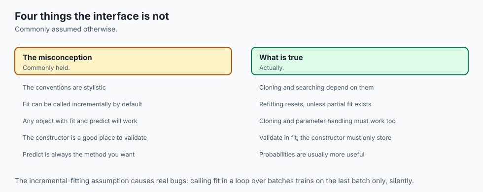

**The estimator API is a small, deliberately narrow contract.** An object
is an estimator if it implements `fit(X, y)` (or `fit(X)` for unsupervised
work) and stores everything it learns as attributes ending in a trailing
underscore. A classifier or regressor additionally implements `predict(X)`;
many classifiers additionally implement `predict_proba(X)` and
`decision_function(X)`. A transformer implements `transform(X)` instead of
`predict(X)`, sometimes both `fit` and `transform` combined as
`fit_transform`. Every estimator, of every kind, is expected to implement
`get_params()` and `set_params()`.

That is the whole list. There is no required base class in the strict
sense of the word "required" — a Python object needs no particular
ancestor to satisfy `fit`/`predict`/`score`/`get_params`/`set_params`, and
this lesson's centrepiece proves it by building exactly such an object and
watching its output match the library's, row for row.

**What it is not: a guarantee that every piece of scikit-learn's own
tooling will accept your object without complaint.** This is the clause
the introduction's failure exists to teach. `Pipeline.predict()` and
`cross_val_score` both call an internal fitted-check that, in this
version of the library, is implemented via `__sklearn_tags__` — a method
that exists on `BaseEstimator` and nowhere else unless you write it
yourself. An object satisfying the five-method contract by hand,
correctly, will still raise `AttributeError` the moment that internal
check runs, because the check is not part of the five-method contract at
all. It is part of scikit-learn's own implementation, and the correct
response is not "the protocol lied" — it is "the protocol is necessary
but, in this codebase, not sufficient for full interoperability, and the
library tells you exactly what closes the gap."

**It is not a promise that `fit()` validates its inputs for you.** Nothing
about the five-method contract requires an estimator to check that `y`
contains discrete class labels rather than a continuous target, or that
`X` has the right shape. `check_estimator()`'s two genuine failures on this
lab's own hand-built classifier come from exactly this gap: the classifier
never validates that its target looks like classification labels, so
handing it a continuous `y` does not raise the error a well-behaved
classifier should raise. That is a real limitation of a fifteen-line toy
estimator, not a flaw in the API's design.

**And it is not a performance guarantee, a correctness guarantee about the
model's predictions, or a promise of any particular hyper-parameter's
default value.** The API says how to ask an object to learn and how to ask
it what it learned. It says nothing about whether what it learned is any
good — which is Day 141's subject, not today's.

## Why it was created and what problems it solves

Before a shared API, comparing two machine-learning algorithms in Python
meant learning two different sets of method names, two different
conventions for what a constructor argument meant, and, in the worst
cases, two different assumptions about what shape the input data should
be in. Writing generic tooling — a cross-validation loop, a
hyper-parameter search, a preprocessing pipeline — that worked across
multiple algorithms meant either picking one library and hard-coding its
conventions, or writing adapter code for every algorithm you wanted to
support.

The four-verb contract solves this by inversion: instead of generic
tooling adapting to each algorithm, every algorithm adapts to one small,
fixed contract, and generic tooling is written once, against that
contract, forever. `cross_val_score` does not know what a
`LogisticRegression` is. It knows that whatever object it was handed has a
`fit` method and a `score` method, and that is the entire information it
needs to cross-validate anything — a linear model, a neural network
wrapped to look like an estimator, or the fifteen-line classifier this
lab's exercises build from nothing.

`get_params()`/`set_params()` solve a narrower but equally load-bearing
problem: how does a search procedure explore an algorithm's
hyper-parameters without knowing what those hyper-parameters are called in
advance? `GridSearchCV` reads an estimator's `get_params()`, and for every
combination in the search grid, calls `set_params()` with new values,
`fit()`s the result, and `score()`s it — four calls from the same fixed
vocabulary, repeated over every candidate estimator. The search code
never once needs to know the words "C" or "n_neighbors" or "max_depth"
exist. It reads whatever keys `get_params()` reports and writes back
whatever keys the search grid supplies.

`clone()` solves the problem of contamination between runs. A
cross-validation loop with five folds needs five *genuinely* fresh models
— an estimator fit on fold one must not carry any trace of fold one's
fitted state into fold two's fit. `clone()` is scikit-learn's mechanical
guarantee that this never happens: it builds a brand-new instance from
`get_params(deep=False)`, which by construction contains only
constructor arguments, never anything fitted. This lab measures that
guarantee directly — a preprocessing step wrapped inside a `Pipeline` is
fit exactly once per cross-validation fold, on that fold's training rows
only, which is the mechanism that makes Day 143's rule ("anything fitted
is fitted on training rows only") something the library enforces rather
than something a careful engineer merely remembers to do.

## How it works

### `__init__`: store, do not compute

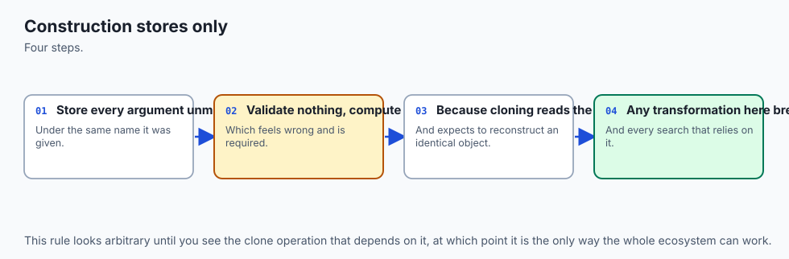

The rule is simple and its consequence is not obvious until you have hit
it: `__init__` should do nothing but assign its arguments to
identically-named attributes.

```python
class MajorityClassifier:
    def __init__(self, strategy="most_frequent"):
        self.strategy = strategy  # stored as-is; nothing computed
```

`BaseEstimator.get_params()` works by inspecting `__init__`'s signature
with Python's `inspect` module and reading back whatever attribute shares
each parameter's name. If `__init__` computed something derived —
normalising a string, wrapping a value in another object — and stored the
result under a different name or a transformed value,
`get_params()` would report something that does not round-trip through
`set_params()`, and `clone()` would silently misbehave. Validation,
derived values, and anything expensive belong in `fit()`, never in
`__init__`. This is not a style guideline; it is the precondition that
makes introspection-based `get_params()` correct at all.

### `fit(X, y)`: the only method allowed to add a trailing underscore

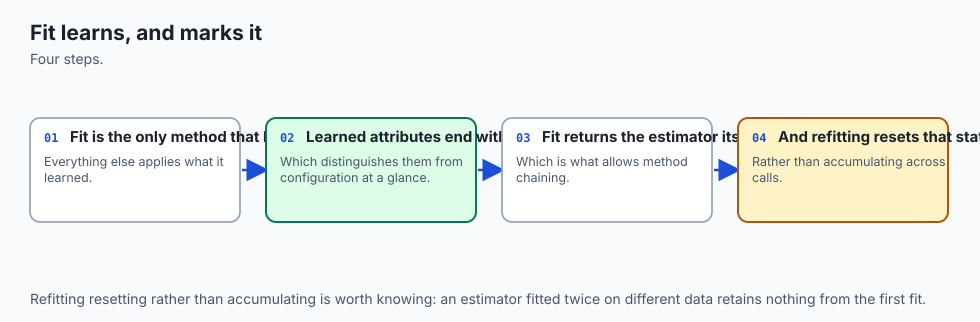

`fit()` reads the hyper-parameters set in `__init__` and the data it is
given, and stores everything it learns as attributes whose names end in
`_`. That trailing underscore is not decoration. It is a documented
convention meaning, precisely, "computed from data, not set by the
caller" — and it is what makes a fitted model's internals inspectable
without reading a single line of its source.

Measured directly in this lab: fitting a `LogisticRegression` on real data
and diffing `dir(model)` before and after `fit()` shows exactly five new
names, every one ending in `_`: `classes_`, `coef_`, `intercept_`,
`n_features_in_` and `n_iter_`. No more, no fewer. A reader who knows
nothing about logistic regression's internals can still write
`model.coef_.shape` after seeing that list and correctly predict what
comes back, because the convention told them where to look.

`fit()` conventionally returns `self` — not because the API requires a
particular return value in some enforced sense, but because doing so
enables the fluent style `model.fit(X, y).predict(X_test)`, which every
built-in estimator supports.

Before `fit()` has run, none of that state exists, and calling `predict()`
on an unfitted estimator raises `NotFittedError`. This lab measured the
exact message, on both a library estimator and a hand-built one:

```text
This LogisticRegression instance is not fitted yet. Call 'fit' with
appropriate arguments before using this estimator.
```

The hand-built `MajorityClassifier` in this lab raises the identical
wording, for the identical reason — neither object has anything with a
trailing underscore yet, and both check for that condition explicitly
before doing anything that would depend on it.

### `predict`, `predict_proba`, `decision_function`: one score, three views

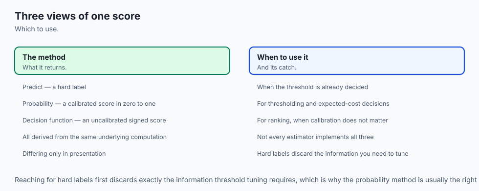

These are not three independent computations of "what does this model
think." They are three ways of reading the same underlying score.

For a fitted classifier that implements both, `predict(X)` is defined as
`classes_[argmax(predict_proba(X), axis=1)]` — the class with the highest
predicted probability, for every row. This lab measured it directly, on a
real multiclass `LogisticRegression`: for every single row of the test
data, the class `predict()` returned was exactly the class that maximised
`predict_proba()`'s row.

`decision_function(X)` gives the same relationship one level lower, before
probabilities are computed: for a binary classifier, `predict(X)` is
`(decision_function(X) > 0)`, mapped through `classes_`; for a multiclass
classifier, it is `classes_[argmax(decision_function(X), axis=1)]`. Both
relationships were measured directly in this lab and held on every row of
the test data.

The practical consequence: if you need a hard label, call `predict()`.
If you need a confidence to threshold differently than the model's
default 0.5, call `predict_proba()` and compare it against your own
threshold — never call `predict()` and then try to reverse-engineer a
confidence from it, because the confidence was already there, one level
down, the whole time.

### `get_params`, `set_params`, `clone`: configuration, never learned state

`get_params(deep=True)` returns a dictionary of every hyper-parameter,
including — for a composite estimator like a `Pipeline` — every nested
step's parameters, prefixed with the step's own name and two underscores.
This lab measured a two-step `Pipeline` (a `StandardScaler` feeding a
`LogisticRegression`) and found `get_params(deep=True)` reporting 23 keys
in total, including `clf__C` and `scaler__with_mean`.

`set_params(**overrides)` accepts exactly those same keys back, and for a
`Pipeline`, reaches through the dotted name to mutate the actual nested
object. Measured directly: calling `pipeline.set_params(clf__C=2.0)` and
then reading `pipeline.named_steps["clf"].C` returns `2.0` — not a copy,
the live attribute on the actual `LogisticRegression` instance living
inside the pipeline.

`clone(estimator)` is implemented, essentially, as
`type(estimator)(**estimator.get_params(deep=False))` — a brand-new
instance, built from the same constructor arguments, with none of the
fitted state carried over. Measured directly on a fitted
`LogisticRegression`: the clone's `get_params()` matches the original's
exactly, and the clone has no `coef_` attribute at all, while the original
— untouched by the cloning — stays fitted. This is what lets
`cross_val_score` give every fold a model that starts from an identical
configuration and zero prior exposure to any of the data.

### `Pipeline` is an estimator too

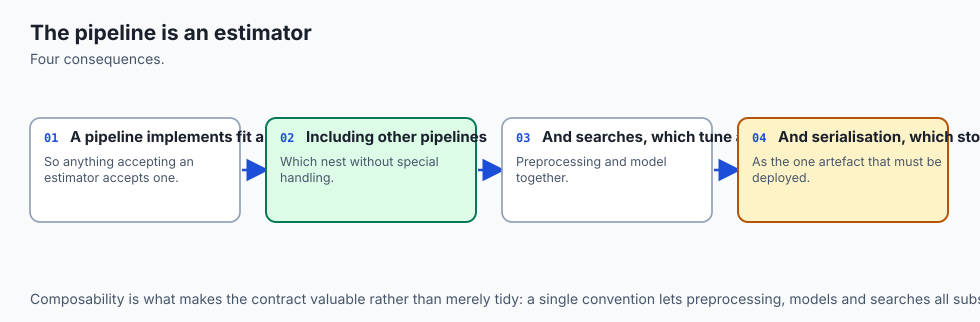

A `Pipeline` is not a container that merely holds estimators. It *is* one
— it implements `fit`, `predict`, `score`, `get_params` and `set_params`
itself, which is why the previous section's nested-parameter measurement
works at all: `Pipeline.get_params(deep=True)` recurses into every step's
own `get_params()` because the pipeline is playing exactly the same game
every other estimator plays, one level up.

The mechanism that follows from this composability is the one worth
measuring precisely, because it connects directly to Day 143's stage
ordering. When `cross_val_score` runs a `Pipeline` under 5-fold
cross-validation, this lab's harness wraps the pipeline's scaling step in
a subclass that counts how many times `fit()` is actually called, and
measures the count directly: **exactly 5**, under 5-fold, and **exactly
10** under 10-fold. Once per fold. Not once for the whole dataset, not
five times on the same rows — once per fold, and (because
`cross_val_score` clones the whole pipeline before each fold) on that
fold's training rows alone.

That count is not a restatement of Day 143's leakage-cost measurement. It
is the mechanism that makes Day 143's rule enforceable rather than merely
advisable: nothing fitted inside a `Pipeline` can see validation or test
rows during a fold's fit, because what gets fit on that fold is a fresh
clone that has never been handed anything except that fold's training
data. The rule was a promise on Day 143. Today it is a countable fact
about the object model.

### How many estimators actually implement `fit`?

`sklearn.utils.all_estimators()` is scikit-learn's own discovery
mechanism — it walks the installed package and returns every class it
recognises as an estimator. Ask it the obvious question, "how many
estimators does scikit-learn have," and the honest answer is that the
question is underspecified: run it in a bare interpreter and it finds
**208**. Import one specific module first —
`sklearn.experimental.enable_halving_search_cv` — and the same call finds
**210**, because `HalvingGridSearchCV` and `HalvingRandomSearchCV` are
gated behind that import and are invisible to discovery until it runs.
Nothing about the installed scikit-learn version changed between those two
counts. Only what had already been imported changed.

That gap is worth taking seriously rather than rounding away, because it is not a quirk specific to the Halving searches — it is `all_estimators()` working exactly as designed, discovering only what Python has actually loaded. This lab's own measurement code found the gap by accident: `estimator_census()` originally called `all_estimators()` directly, and its result quietly depended on whether an earlier call, elsewhere in the same process, had already imported a module that pulled the enabler in transitively — `sklearn.utils.estimator_checks`, used by exercise 10, happens to do exactly that.

The fix is to make the enabling import explicit inside the census function itself, so the enabled count is deterministic regardless of caller, and to measure the bare count in a fresh subprocess — because importing the enabler once registers the two estimators for the rest of that process's life, with no way to un-register them, so a second in-process "before" reading later in the same test session would silently already be the enabled number.

With that settled: this lab's pinned scikit-learn 1.9.0, with the
enabler explicitly imported, discovers **210** estimators, and every
single one of the 210 implements `fit`. That is the whole protocol's
floor: whatever else an object in this library does, if it is an
estimator at all, it fits — and now measured in a way immune to import
order, rather than in a way that happened to work the first time.

The more interesting split is `transform` against `predict`: 90
estimators implement `transform`, 119 implement `predict`. If the
estimator/transformer/predictor distinction were absolute, those two
groups would never overlap — a classifier predicts, a scaler transforms,
and never the twain shall meet. The measurement says otherwise: **20
estimators implement both.** Read the list before concluding the
distinction is broken, because it is not: the 20 are `KMeans`,
`MiniBatchKMeans`, `Birch`, `BisectingKMeans` and similar clustering
models, which legitimately have both a `predict` (which cluster does this
row belong to) and a `transform` (the distance from this row to every
cluster centre) — two genuinely different, genuinely useful outputs from
the same fit. The rest of the 20 are meta-estimators — `Pipeline`,
`GridSearchCV`, `RandomizedSearchCV`, the halving search variants,
`StackingClassifier`, `VotingClassifier` and their regressor equivalents —
which inherit both methods by wrapping whatever estimator they are given.

The rule this measurement actually supports, stated precisely: a **plain**
classifier or regressor must never grow a `transform` method, because
doing so blurs the distinction between "produces a prediction" and
"produces a representation" that makes `Pipeline` composable in the first
place. Clustering models and meta-estimators are the legitimate
exceptions, and knowing why they are exceptions is more useful than
memorising the rule as an absolute.

### `random_state`: what leaving it unset actually costs

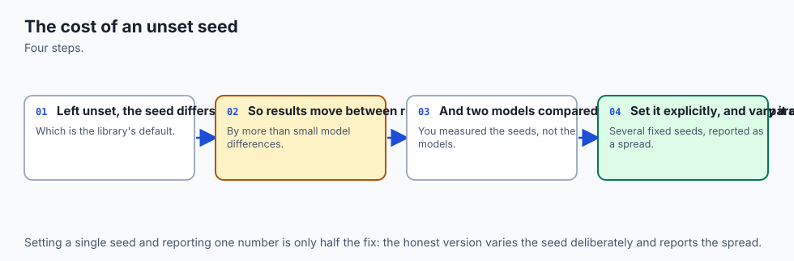

Many scikit-learn estimators — anything involving random initialisation,
bootstrap sampling, or feature subsampling — accept a `random_state`
parameter. Set it to an integer and every call is reproducible: this lab
fit the same `RandomForestClassifier(random_state=42)` five independent
times on identical data and got five byte-identical prediction vectors,
every time.

Leave it as the default `None` and the estimator draws fresh entropy from
the operating system on every single call, by design. This lab fit the
same forest five times with `random_state=None` and measured **5 of 5
distinct prediction vectors** — not similar, genuinely different models,
each time — with the resulting accuracy varying by several points across
repeated fits on the identical data and identical model configuration.

That variability is not a bug to eliminate. It is the honest cost of not
pinning a seed, and it is why `random_state=None` numbers cannot appear as
fixed values anywhere reproducible in this lab's own tests: the measured
counts and accuracy figures are printed once, in
`expected-output/FIELDS.md`, explicitly labelled as one example rather
than an expected result, and every assertion in the lab checks only the
structural claim — identical under a fixed seed, distinct without one —
never a specific sampled number.

### The centrepiece: building an estimator from nothing, and finding the edge of the protocol

Put the pieces together and the lab's exercise sequence tells one
continuous story.

**First**, `MajorityClassifier` is built with zero inheritance from
scikit-learn — `__init__` stores one hyper-parameter, `fit` learns three
things named with a trailing underscore, `predict`/`predict_proba`/`score`
read that state back, `get_params`/`set_params` are five- and six-line
methods written by hand. Its output is measured against
`DummyClassifier(strategy="most_frequent")` across five seeded datasets
and matches exactly, every prediction and every probability.

**Second**, that same object, unmodified, is handed to `cross_val_score`.
It raises `AttributeError`, naming `__sklearn_tags__` and recommending
inheritance from `BaseEstimator`. `fit`, `predict` and `score` still work
perfectly when called directly on the very same object — this is worth
confirming for yourself in the lab, because it is the detail that turns
this from "the protocol was wrong" into "the protocol is necessary but,
here, not sufficient on its own."

**Third**, the identical classifier is rebuilt as
`MajorityClassifierBase(ClassifierMixin, BaseEstimator)`, and the
hand-written `get_params`/`set_params` are deleted from the source
entirely — not simplified, deleted — because `BaseEstimator` now supplies
both by inspecting `__init__`'s signature, which is only correct because
`__init__` does nothing but store its argument, as the earlier section
insisted it must. Measured directly: `"get_params" not in
MajorityClassifierBase.__dict__` is `True`. The method genuinely is not
written anywhere in that class's own source.

**Fourth**, the same call — a real `Pipeline`, scored by a real
`cross_val_score` — now returns five real, non-`NaN` scores. One line of
inheritance closed the entire gap.

That sequence is the honest shape of "the estimator API is a protocol,
not magic." Both halves are true at once: the five methods are genuinely
sufficient for direct use, proven by exact agreement with library output,
and they are genuinely insufficient, in this version of the library, for
full interoperability with scikit-learn's own tooling — and the fix for
the second half is not more code, it is the one-line acknowledgement that
`BaseEstimator` exists and does real, specific, measurable work.

![Diagram: five stages left to right, connected by a wire with a token travelling along it. Stage one: MajorityClassifier is built from scratch, inheriting nothing from scikit-learn, implementing fit, predict, score, get params and set params by hand. Stage two: calling fit, predict and score directly all work, marked WORKS. Stage three: handing the same object to cross val score raises AttributeError, no attribute dunder sklearn tags, marked with the error text, because scikit-learn's own fitted check needs a method only BaseEstimator supplies. Stage four: the identical classifier is rebuilt inheriting ClassifierMixin and BaseEstimator, with its hand-written get params and set params deleted, since BaseEstimator now supplies both. Stage five: the same call to cross val score inside a real Pipeline now returns five real scores, marked WORKS. A caption states that fit, predict, score, get params and set params are necessary and sufficient for direct use, proven at stage two, but stopped being sufficient for Pipeline and cross val score compatibility in this version of scikit-learn, which both need dunder sklearn tags, supplied only by BaseEstimator -- and that the fix is one line of inheritance, shown at stage four](./assets/protocol-footnote-flow.svg)

### `check_estimator`: the contract, checked mechanically

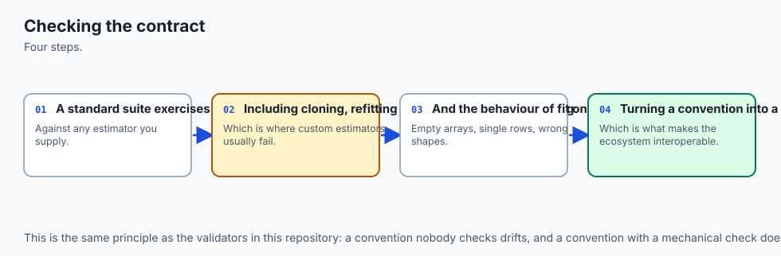

scikit-learn ships its own conformance suite, `check_estimator()`, which
runs dozens of checks against an object and reports which ones pass. Run
against `MajorityClassifierBase` in this lab: **52 checks total, 48
passed, 2 skipped, 2 failed** — and the two failures are worth reading
rather than suppressing.

`check_classifiers_train` asserts that the classifier scores above 0.83
accuracy on a real, learnable synthetic dataset. `MajorityClassifierBase`
is, by design, a majority-class dummy — it always predicts whatever class
was most common during training, regardless of the input features. It
satisfies every *structural* check in the contract; it is simply not
supposed to be a good classifier, and this particular check assumes the
estimator under test is trying to be one.

`check_classifiers_regression_target` asserts that passing a continuous
target raises a `ValueError` naming `"Unknown label type"`. This
classifier's `fit()` never validates that `y` looks like discrete class
labels rather than a continuous target — a genuine, easily fixed
omission, and a useful thing to discover mechanically rather than in
production.

Both failures are printed by name in this lab's measured report and
asserted by name in the test suite. Running `check_estimator()` against
your own custom estimators before shipping them into a pipeline other
people depend on is one of the highest-value five minutes you can spend —
it catches exactly this class of bug, mechanically, before a
hyper-parameter search silently misbehaves on data nobody thought to
check by hand.

## An everyday analogy

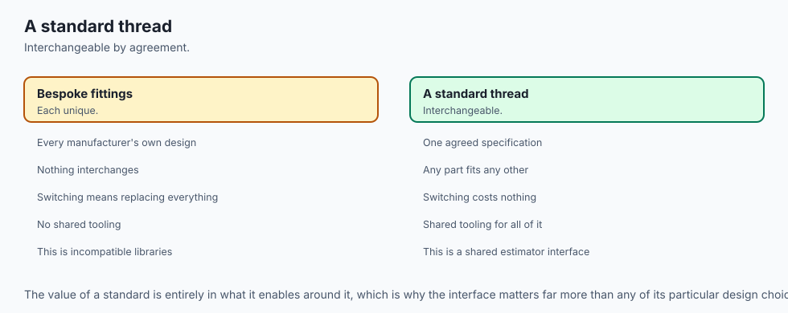

Return to the smart-home wiring from earlier, because the pieces map
cleanly onto it now that the details are in place.

The **wall socket's fixed shape** is `fit`/`predict`/`predict_proba`/
`score`. Any appliance built to that shape draws power and does its job —
a `LogisticRegression`, a `RandomForestClassifier`, or a fifteen-line
class you wrote this afternoon.

The **settings dial the installer can read and set without opening the
case** is `get_params`/`set_params`. A cleaning service that services
every appliance in the house — read the current settings, write new ones,
run the appliance, read the result — never needs a different procedure
for the toaster than for the kettle. That service is `GridSearchCV`.

The **manufacturer's spare-parts guarantee** — a fresh, identical unit,
still in the box, whenever one is needed — is `clone()`. A hotel that
needs five identical, unused kettles for five identical rooms does not
refurbish one kettle five times between guests. It orders five from the
factory, each built from the same specification sheet, none of them
carrying yesterday's tea stains forward. That is what `cross_val_score`
does for every fold.

And the **smart-home chip that reports a status light to the hub before
anything gets scheduled** is `__sklearn_tags__`. A dumb kettle still
boils water when you flip its switch by hand — direct use always works.
It just cannot join a scheduled routine, because the hub has no signal to
check before it tries. The fix, when you actually want that kettle in the
routine, is not a new kettle. It is wiring in the one chip the hub already
knows how to read — which, for an estimator, is inheriting
`BaseEstimator`.

## Examples in practice

### A classifier that agrees with the library, verified line by line

```python
import numpy as np
from sklearn.dummy import DummyClassifier


class MajorityClassifier:
    def __init__(self, strategy="most_frequent"):
        self.strategy = strategy

    def fit(self, X, y):
        X = np.asarray(X)
        y = np.asarray(y)
        self.classes_, counts = np.unique(y, return_counts=True)
        self.majority_class_ = self.classes_[np.argmax(counts)]
        self.n_features_in_ = X.shape[1]
        return self

    def predict(self, X):
        X = np.asarray(X)
        return np.full(X.shape[0], self.majority_class_)

    def score(self, X, y):
        return float(np.mean(self.predict(X) == np.asarray(y)))

    def get_params(self, deep=True):
        return {"strategy": self.strategy}

    def set_params(self, **params):
        for key, value in params.items():
            setattr(self, key, value)
        return self
```

Fit both this class and `DummyClassifier(strategy="most_frequent")` on
identical data, and their predictions and probabilities agree exactly —
which is the concrete evidence behind "protocol, not magic": two
completely independent implementations of the same rule produce the same
answer, because both are following the same rule, correctly, from the
same interface.

### Reading a `Pipeline`'s nested parameters

```python
from sklearn.linear_model import LogisticRegression
from sklearn.pipeline import Pipeline
from sklearn.preprocessing import StandardScaler

pipe = Pipeline([("scaler", StandardScaler()), ("clf", LogisticRegression())])
sorted(pipe.get_params(deep=True).keys())
# includes 'clf', 'clf__C', 'scaler', 'scaler__with_mean', and 19 more

pipe.set_params(clf__C=2.0)
pipe.named_steps["clf"].C  # 2.0 -- the live object, mutated through the pipeline
```

### The failure, reproduced

```python
from sklearn.model_selection import cross_val_score

cross_val_score(MajorityClassifier(), X, y, cv=5)
# AttributeError: 'MajorityClassifier' object has no attribute
# '__sklearn_tags__' ... Make sure to inherit from `BaseEstimator`
```

### The fix, in full

```python
from sklearn.base import BaseEstimator, ClassifierMixin


class MajorityClassifierBase(ClassifierMixin, BaseEstimator):
    def __init__(self, strategy="most_frequent"):
        self.strategy = strategy

    def fit(self, X, y):
        X = np.asarray(X)
        y = np.asarray(y)
        self.classes_, counts = np.unique(y, return_counts=True)
        self.majority_class_ = self.classes_[np.argmax(counts)]
        return self

    def predict(self, X):
        X = np.asarray(X)
        return np.full(X.shape[0], self.majority_class_)
```

`get_params` and `set_params` are gone from the source. `cross_val_score`
now works, and so does wrapping this class in a real `Pipeline`.

## Implications: security, privacy, performance, scalability, and cost

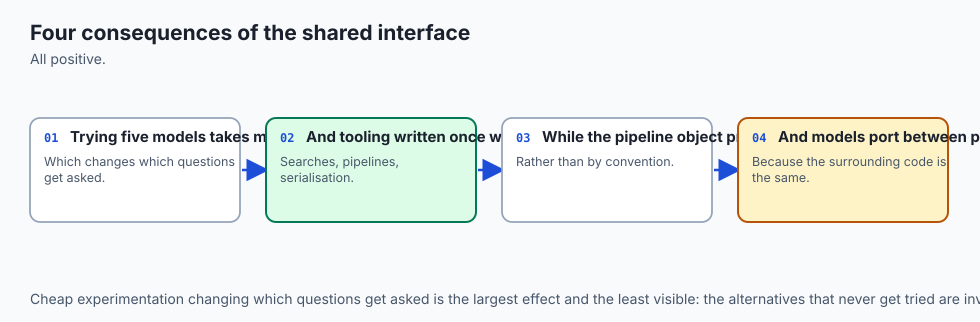

**`clone()`'s guarantee is a security property, not only a convenience
one.** An estimator whose `get_params()` does not report every
constructor argument, or whose cloning otherwise leaked fitted state
forward, would let information from one cross-validation fold leak into
the next — the same shape of bug Day 143 spent an entire day on, arriving
here from the object model instead of the workflow. Writing a custom
estimator correctly, with `get_params`/`set_params` that round-trip
exactly, is what keeps that guarantee intact for every piece of tooling
built on top of it.

**Performance and scalability follow directly from composability.**
Because `GridSearchCV` and `cross_val_score` are written once against the
four-verb contract, adding a new algorithm to a search costs nothing in
tooling — no adapter code, no special case. The cost that *does* exist is
real: cross-validating k folds means k full fits, and a `Pipeline` with an
expensive preprocessing step pays that cost once per fold, not once for
the whole run, because of the exact refitting mechanism this lesson
measured.

**Shipping a custom estimator into a shared pipeline without running
`check_estimator()` first is a real production risk, not a theoretical
one.** This lab's own toy classifier had two genuine, measurable gaps —
no validation of the target's type, and predictable failure on any
dataset that happens to be dominated by one class if you mistake "dummy
baseline" for "real model." A team that tests a custom estimator by
calling `.fit()` and `.predict()` manually, sees sensible output, and
ships it into a `GridSearchCV` has tested exactly the half of the contract
this lesson proved is easy to get right. The half that breaks silently —
compatibility with the library's own internal machinery — is precisely
what `check_estimator()` exists to catch before a search fails in a way
that is hard to trace back to its cause.

**Cost, honestly stated:** learning the full contract, including the
`BaseEstimator` clause this lesson's centrepiece measured, is a fixed cost
you pay once. The alternative — writing bespoke integration code for
every custom model you ever build, because it does not speak the standard
protocol — is a cost you pay on every project, forever. The four-verb
contract is the entire reason that cost, for scikit-learn-compatible
tooling, is paid once.

## Alternatives: free, open source, and commercial

### scikit-learn's own `BaseEstimator` and mixins — used here

**When to choose them:** for essentially any estimator meant to work
inside scikit-learn's own tooling — `Pipeline`, `GridSearchCV`,
`cross_val_score`, `VotingClassifier`. Free, BSD-3-Clause licensed, no
paid tier. Every measurement in this lesson uses them.

**How to use them:** inherit `BaseEstimator` for `get_params`/`set_params`
and equality/repr machinery; add `ClassifierMixin` for a `score()` method
that computes accuracy automatically, or `RegressorMixin` for R² and
`TransformerMixin` for a `fit_transform()` built from your `fit()` and
`transform()`. This lab's `MajorityClassifierBase` uses exactly this
combination.

**Watch for:** `__init__` must do nothing but store arguments under
matching names, or the introspection-based `get_params()` silently
misreports your configuration.

### skorch — PyTorch models wrapped in the sklearn API, described from documentation

**When to choose it:** when a PyTorch model needs to plug into
scikit-learn's `Pipeline`, `GridSearchCV` or `cross_val_score` without a
hand-written adapter. Free and open source, BSD licensed.

**How to use it:** wrap a PyTorch `nn.Module` in skorch's `NeuralNetClassifier`
or `NeuralNetRegressor`, which implements the full estimator API — `fit`,
`predict`, `get_params`, `set_params` — on top of the wrapped network, so
the rest of the four-verb contract this lesson taught applies unchanged.

**Honest note:** this lab does not install PyTorch or skorch, and no
output from either is reproduced anywhere in this lesson. Described from
public documentation only.

### scikeras — Keras/TensorFlow models wrapped in the sklearn API, described from documentation

**When to choose it:** the same problem as skorch, for Keras models
instead of PyTorch ones. Free and open source, MIT licensed.

**How to use it:** wrap a Keras model-building function in scikeras's
`KerasClassifier` or `KerasRegressor`, which exposes the standard
`fit`/`predict`/`get_params`/`set_params` surface.

**Honest note:** not installed here, and no output is reproduced from it.

### statsmodels — deliberately a different API, not the same contract

**When to choose it:** when the statistical output itself — coefficient
standard errors, confidence intervals, hypothesis tests, diagnostic plots
— matters more than plugging into scikit-learn's search and pipeline
tooling.

**Why it is listed here as a contrast rather than an alternative:**
statsmodels' `.fit()` does not return `self` for chaining; it returns a
separate `Results` object, and there is no `get_params()`/`set_params()`
round-trip in the sense this lesson measured. That is not a shortcoming —
it reflects a different design goal, aimed at statistical inference rather
than at composability inside a search-and-pipeline ecosystem. Knowing that
the two libraries made genuinely different design choices, for genuinely
different purposes, is more useful than assuming every Python
machine-learning library follows scikit-learn's convention.

**Free versus paid:** free and open source, BSD-3-Clause licensed.

### Managed AutoML and MLOps platforms that consume scikit-learn-compatible estimators — not used here

Several commercial platforms accept any estimator satisfying the
`fit`/`predict`/`get_params`/`set_params` contract and run search,
tracking and deployment around it — which is only possible because the
contract this lesson taught is small and stable enough for a third-party
platform to build against without scikit-learn's own source code. **No
price is quoted here**, because these change by month and an unchecked
figure is worse than none. Free tiers exist for individuals on most of
them; team and production tiers are typically paid.

## Comparison with related concepts

| Concept | What it does | How it relates |
| --- | --- | --- |
| Estimator | Implements `fit`; the base of everything else | Every object in this lesson is one |
| Predictor | An estimator with `predict` (and usually `predict_proba`/`decision_function`) | 119 of 210 discovered estimators, measured here |
| Transformer | An estimator with `transform` instead of, or beside, `predict` | 90 of 210; overlaps with predictors only for clustering and meta-estimators, measured at 20 |
| `Pipeline` | An estimator that wraps a sequence of other estimators | Composability from the inside: it has its own `get_params`, `fit`, `predict` |
| `BaseEstimator` | Supplies `get_params`/`set_params` by introspecting `__init__` | The dividing line this lesson's headline measurement crosses |
| `ClassifierMixin`/`RegressorMixin` | Supply a default `score()` (accuracy or R²) | Optional; a classifier can define its own `score()` instead, as this lab's from-scratch version does |
| `clone()` | Builds a fresh, unfitted copy from `get_params(deep=False)` | What makes every cross-validation fold genuinely independent |
| `check_estimator()` | Runs scikit-learn's own conformance suite against an object | Found two real, honest gaps in this lab's own toy estimator |

## When to use it — and when not to

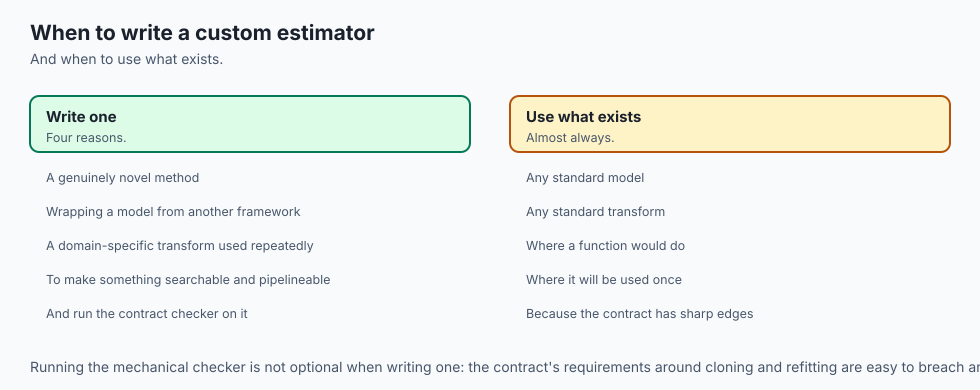

**Write a custom estimator, following the full contract including
`BaseEstimator`, whenever it needs to work inside `Pipeline`,
`GridSearchCV`, `cross_val_score`, or any other piece of scikit-learn's
own tooling.** This lesson measured exactly what that "full contract"
requires beyond the five methods in this version of the library, and the
fix costs one line.

**A quick, throwaway script that calls `.fit()` and `.predict()` directly,
never through a `Pipeline` or a cross-validation loop, does not need
`BaseEstimator` at all.** The from-scratch `MajorityClassifier` in this
lab proves that: called directly, it worked identically to the library
version, with zero inheritance. Do not add machinery you are not going to
use.

**Run `check_estimator()` before shipping any custom estimator that other
people, or automated tooling, will call through `Pipeline` or a search.**
It is free, it runs offline, and this lab's own two genuine failures show
exactly the class of bug it catches that manual testing tends to miss.

**Reach for `get_params`/`set_params` correctness whenever you are
building anything that will be cloned** — inside a cross-validation loop,
a bagging ensemble, or a hyper-parameter search. An estimator whose
`get_params()` does not round-trip through `set_params()` will fail
silently or behave unpredictably the first time something tries to clone
it, often far from wherever the estimator itself was written.

**Do not assume the five-method contract is a hard requirement enforced
by the language, and do not assume it is the whole story either.** Both
overclaims are wrong in a way this lesson measured directly: Python
enforces nothing about inheritance here, and scikit-learn's own internal
machinery genuinely does require more than the five methods for full
interoperability, in this version of the library. Test the specific claim
you are relying on, on the version you are actually running, rather than
trusting either the "it's just duck typing" story or the "you must always
inherit BaseEstimator" story as a universal law.

### The AI thread

The pattern this lesson measured — a small, explicit contract that lets
independently built components interoperate without either side knowing
the other's internals — is the same pattern that makes modern AI tooling
composable at all, and the same pattern whose edges are worth testing
rather than assuming.

A tool definition handed to a language model is a contract of exactly this
shape: a name, a set of typed parameters, a description of what the tool
returns. The model never sees the tool's implementation, the same way
`cross_val_score` never sees `LogisticRegression`'s internals — it only
needs the contract's shape to call the tool correctly. And exactly as this
lesson found with `__sklearn_tags__`, a tool or an agent framework can
satisfy the documented, minimal interface and still fail against a
specific runtime's internal expectations that the public documentation
does not fully spell out — a required metadata field, an implicit schema
constraint, a version-specific check that only shows up once you actually
run the integration rather than read about it.

The transferable habit is the one this lab practised directly: build the
minimal version from first principles, verify it against the real system
byte for byte where you can, and when it breaks against machinery you did
not write, read the actual error rather than assuming either "the
contract is broken" or "I must be missing something obvious." Both
scikit-learn's `AttributeError` and a failed tool call in an agent
framework tend to name, precisely, what closes the gap — the discipline
is reading that message instead of guessing at a fix.

## The AI connection

- **A consistent interface across every model is what makes experimentation cheap**, and it
  is why the ecosystem converged on one.
- **Fit, predict and score are the whole contract**, which means swapping models is a
  one-line change.
- **The pipeline object is what prevents leakage structurally**, rather than by remembering
  to do things in order.
- **The same interface convention reappears throughout AI tooling**, which is why model code
  looks so similar across libraries.
- **Being able to try five models in five minutes** changes which questions get asked at all.

## Knowledge check

1. `MajorityClassifier`, built without inheriting anything from
   scikit-learn, produces predictions identical to
   `DummyClassifier(strategy="most_frequent")`. What does that agreement
   prove, and what does it not yet prove about the object?

2. Name the exact five attributes gained by fitting a `LogisticRegression`
   on real data, and explain what the trailing underscore on each one
   means as a documented convention rather than a style choice.

3. `cross_val_score(MajorityClassifier(), X, y, cv=5)` raises
   `AttributeError: ... no attribute '__sklearn_tags__'`. Calling
   `MajorityClassifier().fit(X, y).predict(X)` directly still works. What
   does that combination tell you about where the failure actually lives?

4. State, precisely, what changes between `MajorityClassifier` and
   `MajorityClassifierBase`, and explain why deleting the hand-written
   `get_params`/`set_params` is correct rather than merely tidy.

5. `sklearn.utils.all_estimators()` finds 20 estimators that implement
   both `transform` and `predict`. Explain why this does not contradict
   the rule that a plain classifier must never grow a `transform` method.

6. `clone()` of a fitted `LogisticRegression` has the same `get_params()`
   as the original and no `coef_` attribute. Explain the one-sentence
   implementation of `clone()` that makes both facts true at once.

7. A preprocessing step inside a `Pipeline` is measured to be fit exactly
   5 times under 5-fold `cross_val_score`. What object-model mechanism
   produces that exact count, and how does it connect to Day 143's rule
   about what may be fitted where?

8. `check_estimator(MajorityClassifierBase())` reports 2 failures out of
   52 checks. Name both, and explain why neither one means the estimator
   is broken.

## Hands-on exercise

Today's lab, `The Estimator API, From Scratch`, builds a classifier with
zero inheritance from scikit-learn, verifies its output against the real
library exactly, and then measures precisely where "just a protocol"
needs a footnote in this version of scikit-learn.

Eighteen exercises. The first three build and verify the from-scratch
classifier. The next four cover what fitting adds and what `get_params`/
`set_params`/`clone` guarantee. Exercises 5 and 6 are the centrepiece:
where the hand-built estimator breaks inside real scikit-learn machinery,
and the one-line fix. The remainder measure the estimator census —
including the exercise that measures the census's own dependence on
import order — `predict`/`predict_proba` agreement, what
`random_state=None` costs, and `check_estimator()`'s honest verdict.

Build the environment, then work through `starter/test_estimator_claims.py`,
replacing one `pytest.skip` at a time.

### Expected output

The harness ends with:

```text
---------------------------------------------------------------
14 checks, 0 failure(s)
```

and exits 0. `pytest examples -q` reports `23 passed`, and
`pytest starter -q` reports `5 passed, 18 skipped` until you begin.

The measured table includes:

```text
matches DummyClassifier(strategy='most_frequent') exactly: True
attributes gained by fit(): ['classes_', 'coef_', 'intercept_', 'n_features_in_', 'n_iter_']
a preprocessing step is fit 5 times under 5-fold cross_val_score
cross_val_score on an estimator inheriting nothing from sklearn:
  AttributeError: ...no attribute '__sklearn_tags__'...
bare discovery (no experimental imports): 208
discovered with sklearn.experimental.enable_halving_search_cv: 210, implement fit: 210
implement both: 20 -- ['Birch', 'BisectingKMeans', ..., 'VotingRegressor']
check_estimator: 52 checks, 48 passed
```

### Validate your work

1. `bash tests/run_tests.sh; echo "exit=$?"` reports `14 checks, 0
   failure(s)` and `exit=0`. Capture the harness's own exit status.

2. `.venv/bin/pytest examples -q` reports `23 passed`.
3. `.venv/bin/python3 examples/report_measurements.py | diff - expected-output/measured-values.txt`
   produces no output.

4. When you have finished every exercise, `pytest starter -q` reports
   `23 passed`.

5. Break one assertion on purpose, confirm the harness fails, restore it.

### Troubleshooting

**`AttributeError: ... no attribute '__sklearn_tags__'` appears somewhere
you did not expect.** If it happens calling `.fit()` or `.predict()`
directly on `MajorityClassifier`, that is a genuine bug — standalone calls
never touch this path. If it happens inside `Pipeline` or
`cross_val_score`, that is exercise 6 working as intended.

**`check_estimator()` reports 2 failures.** Expected, and asserted by
name: `check_classifiers_train` (a majority-class dummy cannot reach 0.83
accuracy by design) and `check_classifiers_regression_target` (this
`fit()` never validates the target's type). Neither is a bug to silence.

**Your `random_state=None` numbers differ from `expected-output/FIELDS.md`.**
They are supposed to. That file's numbers are one real example, never an
expected value — `random_state=None` draws fresh entropy on every call.

**`import file mismatch`.** You ran `pytest examples starter` together.
Run them separately.

### Common mistakes

**Declaring victory after exercise 1.** Matching `DummyClassifier` exactly
proves the five methods are sufficient for direct use. It does not prove
interoperability with `Pipeline` or `cross_val_score`, which exercises 5
and 6 exist specifically to test.

**Treating `check_estimator()`'s 2 failures as bugs to suppress.** Both
are correct, informative failures given what this lab's toy estimator
actually is and does.

**Concluding "you must always inherit `BaseEstimator`, it's a Python
requirement."** Overcorrected. The requirement comes from scikit-learn's
own internal machinery in this version, not from the language.

**Hard-coding a single `random_state=None` sample as "the answer."**
Misses the entire point of exercise 9 — those numbers are fresh OS entropy
on every run, by design, on any machine, including this one.

## Practice assignment

Take an estimator you already use, or one you have thought about writing,
and audit it against today's contract.

1. **Name every method it implements**, and check each against the
   five-method list. If it is missing `get_params`/`set_params`, explain
   what would break the first time something tried to clone it.

2. **Diff `dir()` before and after `fit()`** on a real instance, on real
   data. List every attribute gained, and confirm every one ends in `_`.

3. **Try it inside a `Pipeline` and a `cross_val_score` call**, even if
   you never planned to use it that way. If it fails, read the actual
   error rather than guessing, and report what it named as the cause.

4. **Run `check_estimator()` against it**, if it is a classifier or
   regressor. Report the total, the pass count, and the name of every
   failure — do not summarise a failure as "some validation issue."

5. **State, in one sentence, whether it needs `BaseEstimator`** given how
   you actually use it — direct calls only, or inside scikit-learn's own
   tooling — and justify the answer from what you measured, not from a
   rule of thumb.

The deliverable is the audit, not a rewritten estimator.

## Extension challenge

Pick one and measure it.

1. **Fix `check_classifiers_regression_target`.** Add target-type
   validation to `MajorityClassifierBase.fit()` using
   `sklearn.utils.multiclass.type_of_target`, and confirm with
   `check_estimator()` that the failure count drops from 2 to 1. Report
   whether the fix changes any other check's outcome.

2. **Build a custom transformer from scratch**, with `fit`/`transform`/
   `fit_transform`, and place it ahead of `MajorityClassifierBase` in a
   `Pipeline`. Confirm `fit_transform(X)` gives the same result as calling
   `fit(X)` then `transform(X)` separately, and measure whether it is
   fit once per cross-validation fold, the same as the scaler in this
   lab's own measurement.

3. **Inspect `__sklearn_tags__` directly.** Call it on a real
   `BaseEstimator` subclass and print every field it returns. Which
   fields would differ if the class inherited `ClassifierMixin` alone,
   without `BaseEstimator`? Test your prediction.

4. **Put the from-scratch estimator inside `GridSearchCV`.** Since
   `MajorityClassifierBase` supports `get_params`/`set_params` through
   `BaseEstimator`, search over its one hyper-parameter and report what
   `best_params_` comes back as, and why that result was inevitable given
   what the estimator actually does.

5. **Audit a real third-party estimator.** Pick any scikit-learn-compatible
   package you have installed, run `check_estimator()` against one of its
   classifiers, and report the pass/fail split honestly — including if it
   passes cleanly, which is itself worth reporting.
