## Why this matters

Here is a fact that should make you uneasy about the last six days.

Every discipline you have learned — a baseline before a model, three sets
instead of two, a stage order that never fits on test rows, cross-validation
instead of a single lucky split — was taught on data built to make the
lesson unmistakable. Coin-flip candidates. Fifty people with twenty rows
each. A test-set-touched-twice error that raises on cue. That data was
honest, and it was also rigged: rigged to make the effect large enough
that nobody could miss it.

Real data is not rigged. Today you run the whole protocol once, on 569 rows of real measurements from real biopsies, and you find out which of last week's lessons still apply at full strength and which ones turn out to be smaller than the textbook formula says they should be. Both answers matter. If everything from Day 144 transferred perfectly to real data, you would not need to check it on your own projects — you could just trust the formula.

It does not transfer perfectly. Today's headline number is that Day 144's selection-optimism formula predicts an inflation of 0.0326 for the 36-model sweep this lesson runs, and the measured inflation, averaged over twenty seeds, is −0.0001. Thirty-fold smaller than the formula says. Not because the formula is wrong — because it assumes something about your candidates that stops being true the moment they are actually trying to be good at something.

That is not a caveat to file away. It is the reason you cannot just
memorize "selection inflates your score by roughly this much" and apply
it blindly to your own work. You have to run the check, on the project in
front of you, because the size of the effect depends on facts about your
specific candidates — how correlated they are, how much real skill
separates them — that no formula can see in advance.

Here is the concrete failure this lesson opens with, and it is one you
can feel: a learner builds a classifier, gets 98.25 percent test
accuracy, reports it, and stops. Ninety-eight point two five percent
sounds like a finished project. It is not one. That single number hides
that the model's only two mistakes are the clinically expensive kind —
missed malignancies — and it says nothing about whether 98.25 is
distinguishable from a model that got lucky on 114 rows.

A verdict is not
one number. It is a number, an interval, and a look at exactly which
mistakes the model makes. Today builds all three, once, properly, and
shows you where the formulas from the last six days hold up and where
they need checking.

## The idea in plain language

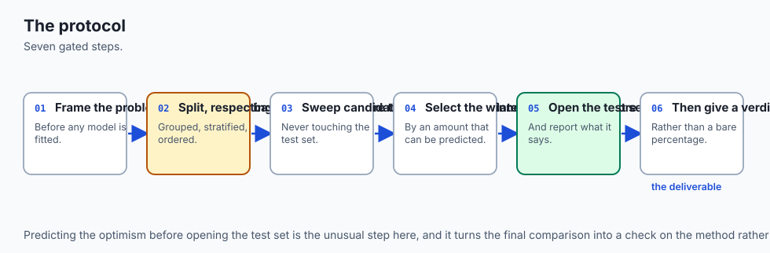

Think about a hospital resident presenting a diagnosis to the attending
physician.

A resident who says "the patient has condition X" and stops has not
finished the job, even if they turn out to be right. A complete
presentation states the baseline rate of the condition in this
population, walks through the evidence that was actually considered
(not everything that could have been considered — the specific tests
run), explains which tests were used to narrow the diagnosis and which
one confirmed it, states the confidence honestly — "I'm fairly sure, but
here's what would change my mind" — and, critically, names the specific
kind of error that would be worst if wrong. A resident who says "98
percent confident" and offers nothing else has produced a number, not a
diagnosis.

That is what today's protocol is. **Frame** is naming what condition you are testing for and in what population. **Baseline** is the rate of the condition if you guessed the most common answer every time — the number your diagnosis has to beat to be worth anything. **Split** is deciding, before you look at any evidence, which evidence will inform your reasoning and which evidence you will hold back to check yourself later. **Sweep and cross-validate** is trying several diagnostic approaches and scoring each one honestly, on cases you are allowed to reconsider.

**Select** is picking the one that did best, understanding that "did best" is itself a noisy measurement. **One test evaluation** is the single case you held back, examined exactly once, with no do-overs. **Error analysis** is not just "was I right" but "when I was wrong, what specific kind of wrong was it, and which kind is worse." **Verdict** is the interval, not the point estimate — "I'm 98 percent accurate" becomes "I'm 98.25 percent accurate, plus or minus 2.4 points, and my only errors are missed positives, not false alarms."

Nine days ago you learned pieces of this presentation in isolation. Today
you give the whole presentation, on a real case, and you find out that
one piece of received wisdom — how much your accuracy should have been
inflated by trying several diagnostic approaches — turns out to matter
far less here than the standard teaching would suggest, and you learn
exactly why.

![Diagram: eight boxes in reading order, left to right then wrapping to a second row: frame the problem; state a majority-class baseline of 0.6316; split 569 rows into 455 train and 114 test, stratified; sweep 36 candidate pipelines; cross-validate on train rows only and select LogisticRegression with C equal to 1 at a cross-validated accuracy of 0.9780; evaluate the test set exactly once through a gate, scoring 0.9825; read the confusion matrix, finding two false negatives and zero false positives; and state a verdict of a 95 percent interval from 0.9584 to 1.0066, distinguishable from the baseline. A highlighted panel beneath states that Day 144's formula predicted a selection optimism of 0.0326 for this sweep, while the measured drop averaged -0.0001 over twenty seeds, because the formula assumes independent zero-skill candidates and these 36 are neither](./assets/protocol-architecture.svg)

## Historical background

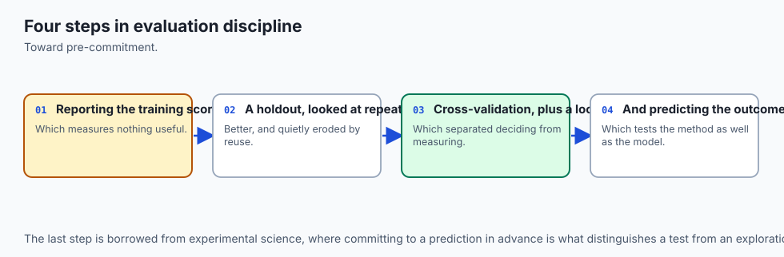

The individual pieces of today's protocol each have their own history,
which the last six days already told properly — cross-validation back to
Geisser and Stone in 1974, the winner's curse to Capen, Clapp and
Campbell's 1971 paper on sealed-bid oil leases, the estimator interface
to scikit-learn's own 2007 origins as a Google Summer of Code project.
Today's history is different in kind: it is the history of the dataset
itself, because an end-to-end exercise has to be honest about where its
data came from and what it actually measures.

The Wisconsin Diagnostic Breast Cancer dataset — `load_breast_cancer` in
scikit-learn — was assembled at the University of Wisconsin Hospitals in
the early 1990s, from digitised images of fine-needle aspirate biopsies. A fine-needle aspirate is a minimally invasive sample: a thin needle
draws a small number of cells from a suspicious mass, and those cells are
examined under a microscope rather than requiring surgical biopsy.

The
dataset's 30 features are not raw pixels; they are ten measurements —
radius, texture, perimeter, area, smoothness, compactness, concavity,
concave points, symmetry, fractal dimension — computed from the digitised
cell-nucleus boundaries, each summarised three ways (mean, standard
error, and worst-case value across the cells in the sample), giving
thirty numbers per patient. The two class labels are malignant and
benign, based on the follow-up diagnosis.

This detail matters for how you should read every number in this lesson. The dataset is decades old, extensively studied, bundled inside
scikit-learn precisely because it is well-behaved and pedagogically
useful — a fact that should make you cautious about generalising "this
model gets 98 percent" to any claim about real diagnostic performance.

It is a teaching dataset, chosen here because it gives room for an honest
interval and a real confusion matrix, not because this lesson is
proposing a diagnostic tool. The distinction is not pedantic: Day 144's
whole lesson was about test sets whose value depends entirely on what
they were never used for, and a dataset this well-studied has, in a
sense, been "used" by the entire machine-learning teaching community for
thirty years. Nothing here should be read as clinical guidance.

The methodological history is more directly this lesson's subject. The
practice of running a documented, reproducible modelling pipeline — frame,
split, cross-validate, one test evaluation, error analysis, a stated
verdict — rather than an unstructured search for the best-looking number,
became standard practice in applied statistics and machine learning
through exactly the pressures the last six days measured: papers and
products that reported inflated numbers because the protocol was informal,
and the slow professionalisation of "show your work" into "show your split,
your K, and your one test score." Today's lesson is a distillation of that
professionalisation into eight named, checkable stages.

## What it is — and what it is not

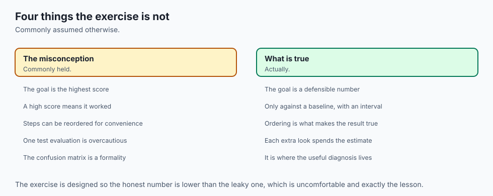

**An end-to-end exercise is the assembly of prior disciplines into one
protocol, applied to one real dataset, producing one written verdict.**
It is not a new technique, and if you came here looking for a new
algorithm, you will not find one — every estimator used today was already
available on Day 146.

Here is what today's protocol precisely is, stage by stage.

**Frame** states, in one sentence, what is being predicted, from what
features, and in what population. For this lesson: malignant versus
benign status, from 30 measurements taken from a fine-needle aspirate, in
the population represented by the 569 rows of `load_breast_cancer`.

**Baseline** is the score of the simplest possible non-model: predict the
majority class every time. Here, 0.6316 — 357 of 569 rows are benign, so
guessing benign every time gets you 63.16 percent right for free.

**Split** divides the 569 rows into 455 training rows and 114 test rows,
stratified so the malignant/benign ratio matches in both halves, with
the test rows held back from everything until stage six.

**Sweep and cross-validate** builds K = 36 candidate pipelines — 15
values of `k` for k-nearest-neighbours, 11 values of the regularisation
strength `C` for logistic regression, 10 values of `max_depth` for a
decision tree — and scores every one of them with 5-fold stratified
cross-validation on the 455 training rows. No candidate ever sees a test
row during this stage.

**Select** picks the highest-scoring candidate: `LogisticRegression(C=1)`,
at a cross-validated accuracy of 0.9780.

**One test evaluation** fits that winning configuration on the full 455
training rows and scores it, exactly once, against the 114 held-back
rows, wrapped in a gate that refuses a second look. The result: 0.9825.

**Error analysis** opens the confusion matrix rather than stopping at the
accuracy number, and finds two false negatives (malignant predicted
benign) and zero false positives.

**Verdict** states a 95 percent interval around the test score —
`[0.9584, 1.0066]` — and compares the 0.3509 improvement over baseline
against that interval's 0.0241 half-width, concluding the model is
clearly distinguishable from guessing.

Now the things this exercise is not.

**It is not a demonstration that the selection-optimism formula was
wrong.** Day 144 measured that formula on candidates engineered to be
literal coin flips, and it held there — the measured optimism tracked
the predicted expected maximum of K normals within 0.2 standard errors
at every K tried. Today's formula still describes exactly what it was
built to describe. What today shows is that the formula's assumptions —
independence between candidates, zero true skill difference — are not
free assumptions, and a sweep of real, correlated, genuinely skilled
candidates does not automatically satisfy them.

**It is not evidence that model selection is safe to skip checking.**
The measured optimism here happened to be small. Day 144 already
measured a case — literal coin flips — where it was large: 0.0728 at
K = 1000. The lesson of running both is not "optimism is usually small."
It is "you cannot know the size without measuring it on your own
project," which is precisely why exercise 7 in today's lab computes the
prediction and exercise 7b measures the reality, rather than either one
alone.

**And it is not a clinical tool.** A 98.25 percent accuracy on a
seventy-year-old teaching dataset, evaluated once on 114 rows, is a
pedagogical result about a modelling protocol. Reading it as evidence
about how well machine learning diagnoses cancer would be exactly the
kind of unjustified leap this whole course has tried to train you out of
making.

## Why it was created and what problems it solves

Each of today's eight stages exists because a specific, nameable failure
happens when it is skipped, and every one of those failures has already
been measured this week — today's contribution is showing that they
compound, in order, in one real pipeline, rather than showing any of them
for the first time.

**Skipping frame and baseline** produces a number with no reference
point. A model that reports "82 percent accuracy" sounds impressive until
you learn the majority class is 81 percent of the data — Day 141's whole
argument, that a score means nothing without knowing what it beats.

**Skipping the split, or splitting after fitting something,** is Day
143's stage-ordering failure: a scaler, a feature selector, or a
hyperparameter search that has seen test rows leaks information about
those rows into every downstream decision, silently and often
invisibly.

**Skipping cross-validation in favour of a single validation split**
reintroduces the holdout-variance problem Day 144 measured directly: a
single split's score can swing by 19 accuracy points across seeds on
identical data. Cross-validating the 36-candidate sweep here is what
makes the winner's cross-validated score, 0.9780, a stable enough number
to select on.

**Skipping the accounting on how many candidates you tried** is the
selection-optimism problem, and today's exercise 7 is built specifically
to make you compute the prediction — 0.0326 — *before* you find out what
actually happened. That ordering matters. Computing the prediction after
seeing the answer would let you rationalise any gap; computing it first
makes the −0.0001 measured result a genuine surprise rather than a
retrofit.

**Skipping error analysis** hides exactly what today's confusion matrix
reveals: an accuracy figure is a weighted average of two different kinds
of correctness, and a model can be excellent by that average while making
only the costlier kind of mistake. Two false negatives and zero false
positives is not visible in 0.9825 alone.

**Skipping the interval** turns a verdict into a guess dressed as a
fact. Day 144 built the machinery — `sqrt(p(1-p)/n)`, the half-width
table — and today applies it to an actual decision: is 0.9825 meaningfully
better than 0.6316, given only 114 test rows? The interval says yes,
decisively. It could easily have said no, on a smaller test set or a
smaller improvement, which is exactly why the arithmetic is run rather
than assumed.

**And skipping the discipline that keeps the test set honest** — using
it to select rather than to confirm — is the mistake exercise 10
reconstructs directly. It is, in the applied-ML literature and in real
teams, probably the single most common way a reported number ends up
inflated: not a dramatic leak, just quietly trying several models against
the number you eventually report and keeping whichever one looked best.

## How it works

### Choosing the dataset, by measuring

Three classification datasets ship inside scikit-learn and need no
download: `load_iris`, `load_wine`, and `load_breast_cancer`. This lesson
tried all three, measured them, and rejected two.

| dataset | rows | features | classes | majority baseline | test rows at 20% |
| --- | --- | --- | --- | --- | --- |
| iris | 150 | 4 | 3 | 0.3333 | 30 |
| wine | 178 | 13 | 3 | 0.3889 | 36 |
| breast_cancer | 569 | 30 | 2 | 0.6316 | 114 |

With this lesson's 36-candidate sweep, iris and wine both saturate
near-perfect cross-validated accuracy, and their test sets — 30 and 36
rows — are coarse: one wrong answer moves accuracy by more than two and
a half points.

That is too blunt an instrument to compute an honest
interval, and too blunt to see selection optimism behave the way Day
144's theory predicts, because the winning candidate's true accuracy and
its measured accuracy on 30 rows are nearly indistinguishable from noise
in either direction. `breast_cancer` gives 114 test rows — still not
huge, but enough for a half-width of ±0.0241 rather than ±0.09 — and a
baseline, 0.6316, that is not trivially beaten. That headroom is why this
lesson uses it.

### The frame, and the baseline

The frame is one sentence: predict malignant versus benign from 30
real-valued measurements. The baseline is one function call —
`DummyClassifier(strategy="most_frequent")` — fitted on the training
rows and scored on the held-back test rows: 0.6316. Every later number in
this lesson is read against that figure.

### The split

`train_test_split(X, y, test_size=0.2, random_state=0, stratify=y)` gives
455 training rows and 114 test rows, with the malignant/benign ratio
preserved in both halves to within 1 percentage point. From this line
onward, `x_test` and `y_test` are not touched again until stage six.

### The sweep

Thirty-six candidate pipelines, built with scikit-learn's `Pipeline` so
that any preprocessing (here, `StandardScaler` ahead of the distance- and
gradient-based estimators) is refit inside every cross-validation fold
rather than fitted once on everything — Day 143's ordering rule, now
enforced by the estimator's own contract rather than by discipline alone:

```python
from sklearn.pipeline import Pipeline
from sklearn.preprocessing import StandardScaler
from sklearn.neighbors import KNeighborsClassifier
from sklearn.linear_model import LogisticRegression
from sklearn.tree import DecisionTreeClassifier

configs = []
for k in range(1, 16):
    configs.append(("knn", k, Pipeline([
        ("scale", StandardScaler()), ("clf", KNeighborsClassifier(k)),
    ])))
for c in [0.001, 0.003, 0.01, 0.03, 0.1, 0.3, 1, 3, 10, 30, 100]:
    configs.append(("logreg", c, Pipeline([
        ("scale", StandardScaler()), ("clf", LogisticRegression(C=c, max_iter=5000)),
    ])))
for depth in range(1, 11):
    configs.append(("tree", depth, Pipeline([
        ("clf", DecisionTreeClassifier(max_depth=depth, random_state=0)),
    ])))
```

That is K = 36, counted, not estimated. Day 144's whole complaint about
selection optimism was that K is "the number nobody remembers" — this
lesson remembers it because the code that builds the sweep is also the
code that counts it.

### Cross-validate, then select

Every one of the 36 candidates is scored with 5-fold stratified
cross-validation on the 455 training rows, and the highest mean wins:

```python
from sklearn.model_selection import StratifiedKFold, cross_val_score

splitter = StratifiedKFold(n_splits=5, shuffle=True, random_state=0)
scored = [
    (family, param, cross_val_score(make(), x_train, y_train, cv=splitter).mean())
    for family, param, make in configs
]
scored.sort(key=lambda row: -row[2])
winner_family, winner_param, winner_cv = scored[0]
```

The winner: `LogisticRegression(C=1)`, cross-validated accuracy 0.9780.
Nothing in this stage has read `x_test` or `y_test`.

### The predicted optimism, computed before the answer is known

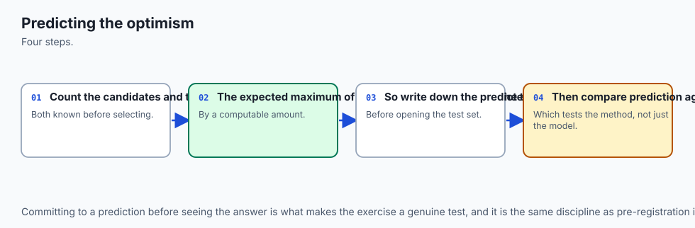

Day 144's formula, applied here, before stage six runs: the standard
error of an accuracy measured on one cross-validation fold's worth of
rows (91, since 455 divided by 5 folds is 91), times the expected maximum
of K = 36 standard normal draws.

```text
se = sqrt(0.978 * (1 - 0.978) / 91) = 0.0154
expected_max_of_normals(36) = 2.118
predicted optimism = 0.0154 * 2.118 = 0.0326
```

That is the number to write down before looking at the test set. It says:
"if these 36 candidates behave like Day 144's coin flips, expect the
cross-validated score to overstate the real accuracy by about three
points."

### One test evaluation, gated

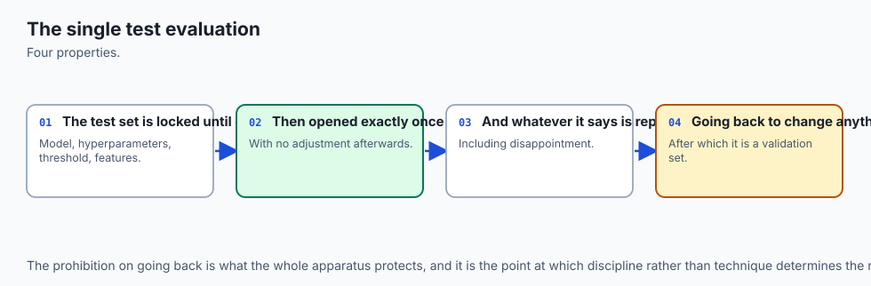

```python
class GatedTestSet:
    def __init__(self, X, y):
        self._X, self._y, self.evaluations = X, y, 0

    def evaluate(self, model):
        if self.evaluations >= 1:
            raise TestSetTouchedTwice(
                "the test set has already been used once; any further "
                "score is a validation score, not a test score"
            )
        self.evaluations += 1
        return float(model.score(self._X, self._y))
```

Fitting the winner on the full 455 training rows and calling
`gate.evaluate(fitted)` once gives 0.9825. A second call raises. The
measured drop — cross-validated minus test — is `0.9780 - 0.9825 =
-0.0045`. The test score came out slightly *better* than the
cross-validated one, not worse: the opposite sign from what the
predicted optimism implied.

### Predicted versus measured, over twenty seeds

One seed is an anecdote — Day 144's own reporting rule, applied here.
The same measurement, repeated at seeds 0 through 19:

| quantity | predicted (mean) | measured (mean) | measured (sd) |
| --- | --- | --- | --- |
| selection optimism | 0.0330 | −0.0001 | 0.0149 |

Read that pair carefully. The prediction is consistently around 0.033 at
every seed — it barely moves, because it depends mostly on K and the
fold size, both fixed. The measurement is centred almost exactly on
zero, and it is *noisy in both directions*: at some seeds the drop is
positive (the model looked worse on test than on cross-validation), at
others negative (it looked better), roughly half and half. The formula
predicted a one-sided inflation; reality gave a two-sided scatter around
zero.

![Diagram: two bar-chart panels revealed left to right. The top panel plots the measured drop between cross-validated and test accuracy at eight sampled seeds against a dashed line marking the 0.0326 optimism Day 144's formula predicted for this 36-candidate sweep; every measured drop sits far below the predicted line and scatters both above and below zero. The bottom panel plots the gap between a leaky test-set-peeking selection and the honest cross-validated one at the same eight seeds; every bar sits at or above zero, and never below it](./assets/optimism-comparison-flow.svg)

### Why the formula overestimates here

Two facts about this sweep break the formula's assumptions, and both are
worth internalising because they generalise to almost any real
hyperparameter sweep you will ever run.

**The candidates are correlated, not independent.** Day 144's formula
assumes K *independent* noisy estimates — the maximum of K genuinely
separate coin flips. But `KNeighborsClassifier(4)` and
`KNeighborsClassifier(5)` make nearly identical predictions on nearly
identical rows; so do `LogisticRegression(C=1)` and
`LogisticRegression(C=3)`. The *effective* number of independent choices
in this sweep is far smaller than 36, and a smaller effective K means a
smaller expected maximum — and therefore less optimism than the formula,
which used the nominal K = 36, predicts.

**The candidates have genuine, if small, skill differences.** Day 144's
coin-flip candidates were constructed to have exactly zero true skill, so
every difference between them was pure noise, and picking the "best" one
was picking the luckiest one. Here, some configurations genuinely
generalise better than others — `LogisticRegression(C=1)` is not luckier
than `DecisionTreeClassifier(max_depth=1)`, it is a better-suited model
for this problem. Selecting the best cross-validated score is picking up
some of that real signal along with some noise, and the noise component —
the only part the formula is describing — is a smaller share of the
total than it was for candidates with zero true skill.

Neither of these facts makes the check unnecessary. They make it a check
you have to run on your own sweep, because you cannot know in advance how
correlated your candidates are or how much real skill separates them.

### Error analysis: what the confusion matrix says

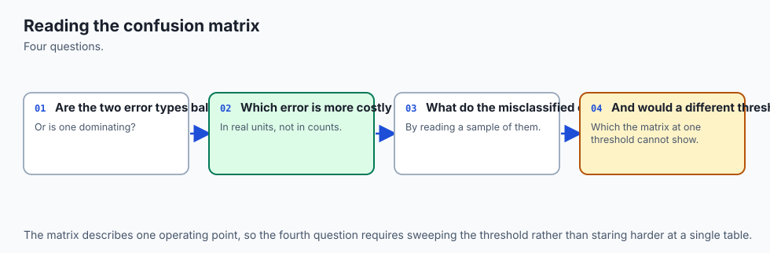

The one test evaluation's predictions, compared against the true labels:

```text
             predicted
             malignant  benign
true malignant    40       2
true benign        0      72
```

Two malignant cases predicted benign — false negatives, in the sense that
matters here: a real cancer the model said was not one. Zero benign cases
predicted malignant. An accuracy of 0.9825 does not distinguish "the
model makes two false negatives and zero false positives" from "the model
makes one of each" — those are the same accuracy, and a very different
error profile. In a screening context, a missed malignancy is generally
the costlier mistake — it delays treatment, where a false alarm merely
triggers a follow-up test. Reading the matrix, not just the accuracy, is
what tells you which kind of mistake you are actually making.

### The verdict, with an interval

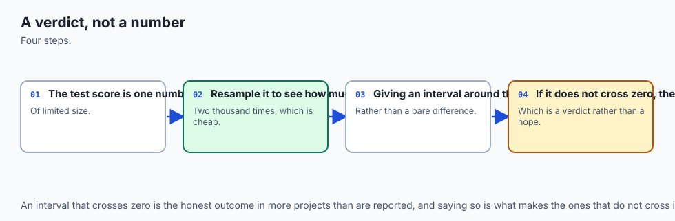

```text
n_test = 114
se = sqrt(0.9825 * (1 - 0.9825) / 114) = 0.0123
half-width (95%) = 1.96 * 0.0123 = 0.0241
interval = [0.9584, 1.0066]
improvement over baseline = 0.9825 - 0.6316 = 0.3509
```

0.3509 is roughly fourteen times the interval's half-width. This is not a
"cannot distinguish" case — Day 144's cautionary tale about small test
sets does not bind here, because the improvement is enormous relative to
the noise. It could easily have gone the other way: if the improvement
had been 0.015 rather than 0.35, the interval would have swallowed it
whole, and the honest verdict would have been "cannot distinguish this
model from guessing at this test-set size." Computing the interval, every
time, is how you find out which case you are in rather than assuming.

### The leaky version, run alongside the honest one

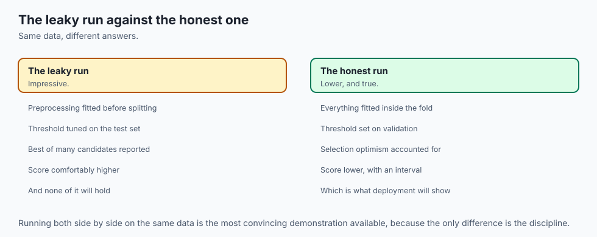

Exercise 10 reconstructs, deliberately, the mistake this whole course has
spent nine days building discipline against: selecting a model by fitting
every candidate and scoring each one *directly on the test set*, rather
than selecting on cross-validated training rows and looking at test once.

```python
def leaky_selection_test_score(x_train, y_train, x_test, y_test):
    best = -1.0
    for _family, _param, make in configs:
        pipe = make().fit(x_train, y_train)
        best = max(best, pipe.score(x_test, y_test))
    return best
```

At the headline seed, the leaky score and the honest score tie: both
0.9825, a gap of exactly zero. That is a ceiling effect — 114 test rows
mean accuracy can only move in steps of about 0.0088, so ties are common.

Over twenty seeds, the mean gap is +0.0096 (standard deviation 0.0103,
maximum 0.0351), and — this is the structural fact worth remembering —
**it is never negative, at any seed tried.** The leaky search considers
the honest winner among its 36 candidates and can only replace it with
something that scored at least as well on the very rows it was allowed to
peek at. It cannot lose. It can only tie or win, which is not luck — it
is the mechanism.

## An everyday analogy

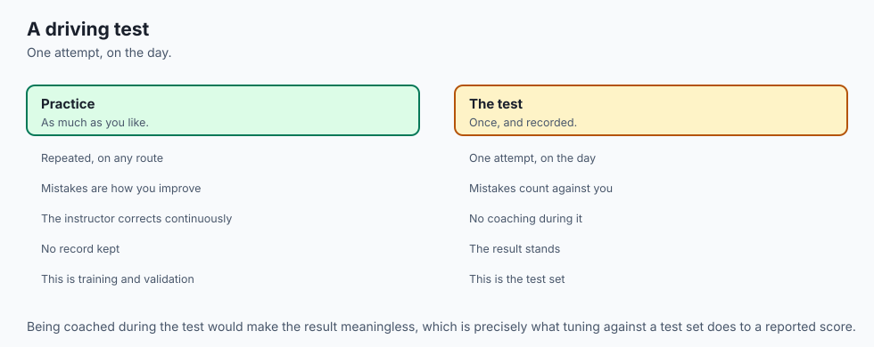

A university admissions committee reviewing one applicant's file.

**Baseline** is what you would predict about the applicant knowing
nothing but the overall acceptance rate — say, admit rates run around 60
percent at this school, so guessing "admit" for everyone gets you 60
percent right with zero effort.

**The frame** is deciding, precisely, what you are predicting: not "is
this a good person" but "will this student succeed in our specific
program, based on this specific application."

**The split** is deciding, before reading the file, which parts of the
record inform the committee's deliberation (transcripts, essays,
recommendations — read as many times as needed) and which part is held
back for a final check (say, a single reference call made once, after
the decision, purely to confirm nothing was missed — never to change the
decision).

**The sweep** is the committee trying several different weighting
schemes for the file — weight test scores heavily, weight essays
heavily, weight extracurriculars heavily — and scoring each scheme
against past applicants whose outcomes are already known.

**Cross-validation** is checking each weighting scheme against several
different subsets of those past applicants, not just one, so a scheme
that happened to work well on one arbitrary subset of history does not
get crowned the winner by luck.

**Selection** is the committee agreeing on one weighting scheme — the one
that did best across those checks.

**The one look** is applying that agreed-upon scheme to the actual
applicant's actual file, once, and reaching a decision. Not re-weighting
after seeing how the applicant "would have scored" under six different
schemes and picking whichever gives the answer the committee already
wanted.

**Error analysis** is not stopping at "we admit roughly the right
fraction of students" — it is checking whether the mistakes cluster: are
you disproportionately rejecting strong candidates from one background,
or disproportionately admitting weak candidates from another? That
question is invisible in an overall accept rate.

**The verdict** is not "we're pretty confident in this decision." It is
"here is our historical error rate on decisions like this one, and here
is the range that error rate plausibly falls in, given how many past
decisions we actually reviewed."

The analogy earns its keep on the leaky-selection failure. Imagine a
committee member who, instead of trusting the pre-agreed weighting
scheme, quietly tries all six schemes on *this specific applicant* and
recommends whichever one produces the admission decision they already
favoured — then reports "our scheme recommended admit" as though it were
the pre-agreed process speaking. That report can never look worse than
the honest process, and it will often look identically confident, because
from the outside "admit" is "admit" regardless of which of six schemes
produced it. The dishonesty is invisible in the recommendation itself; it
lives entirely in which of six numbers got reported after the fact.

## Examples in practice

### A learner who stops at 98.25 percent

The most common mistake this lesson is built to correct: a project that
reports "98.25 percent accuracy" and nothing else. Two follow-up
questions immediately matter. Ninety-eight point two five percent of
*what* — a baseline of 63 percent, or a baseline of 98 percent, where the
same score would mean the model learned nothing at all? And what *kind*
of two percent is wrong — evenly split errors, or all of one costly
type? Both questions have concrete answers here (0.6316 and "two false
negatives, zero false positives") and neither is visible in the headline
number alone.

### A team that tunes against its own test set without noticing

The most common real instance of exercise 10's leaky version rarely looks
like a single dramatic mistake. It looks like a team that has one
official test set, tries a model, checks the test score "just to see,"
tries a tweak, checks again, tries another tweak, checks again — and
after the fifth check, reports the best one as "our result." No single
check felt like cheating. The cumulative effect is exactly
`leaky_selection_test_score`: K looks at the test set disguised as one.
The fix is not vigilance — it is a `GatedTestSet` that makes the sixth
look impossible rather than merely inadvisable.

### A model comparison that never sizes its test set

An engineer is asked whether a new model beats the old one by two
points. Before touching any code: at an accuracy near 0.85, resolving a
two-point difference at 95 percent confidence needs 1225 test rows — Day
144's sizing table, arriving at an actual decision. If only 400 rows are
labelled, the interval is roughly ±0.035, wider than the difference being
chased, and the honest answer is "this comparison cannot be made with the
data we have," delivered before a single model is trained.

### Reading a published benchmark's confusion matrix, not just its headline

A paper reports "97 percent accuracy on cancer detection." The number
alone answers almost nothing useful. Which of the two classes does the 3
percent of errors fall into? On a dataset where malignant cases are the
minority, a model that is excellent at recognising benign cases and
mediocre at recognising malignant ones can post a high accuracy while
being clinically closer to useless — exactly the asymmetry this lesson's
confusion matrix makes visible and a bare accuracy figure hides.

## Implications: security, privacy, performance, scalability, and cost

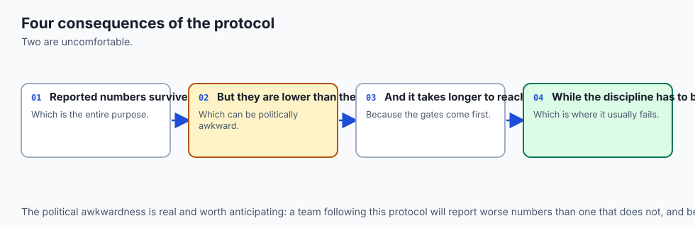

**The cost of skipping a baseline is a project that never gets
challenged.** A model reporting 82 percent on a dataset that is 81
percent one class will pass every casual review, because 82 percent
*sounds* good. The baseline is a one-line, zero-cost check that catches
this before anyone spends a week building on top of it.

**The cost of a leaky selection is a number that fails in production and
nowhere else.** Every metric a team reports internally can look
consistent and healthy right up until deployment, because the leak lives
entirely in how the number was produced, not in any property of the data
that a dashboard could flag. `GatedTestSet` is a cheap, mechanical defence
against exactly this — one object, refusing a second call, costs nothing
to add and closes the most common real-world version of this mistake.

**Error analysis is a security and safety control, not a nicety.** A
false negative in fraud detection is a fraudulent transaction that goes
through; a false positive is a legitimate customer inconvenienced. Those
have wildly different costs, and a system tuned to overall accuracy alone
can quietly optimise for the wrong one. Today's confusion matrix, applied
to a domain where the asymmetry is worse than a two-by-two table can
fully convey, is the minimum bar for catching this before deployment.

**Computing the predicted optimism costs nothing and catches a lot.**
`se * expected_max_of_normals(K)` is two function calls, run before the
test set is touched. On a sweep where the prediction turns out to matter —
unlike this lesson's, where it did not — that arithmetic is the
difference between reporting a real number and reporting an artefact of
how many things you tried.

**Cross-validating 36 candidates costs 36 times 5 model fits, which is
cheap here and would not be on a larger model.** The trade-off Day 144
named — compute against a nineteen-point swing on a single holdout — is
this lesson's trade-off too: on a laptop-scale sweep like this one, the
extra compute is not a close call. On a sweep of expensive models, the
right answer shifts to a single holdout reported with an interval, never
to skipping the check.

**And the largest, least visible cost is a project that never runs the
selection-optimism check because it "obviously doesn't matter here."**
This lesson's own result — the check mattered enough to overturn a
prediction that would otherwise have gone unquestioned into a report — is
the argument against skipping it, not evidence that it can safely be
skipped from now on.

## Alternatives: free, open source, and commercial

### scikit-learn's own protocol tools — used throughout this lesson

**When to choose them:** for essentially all in-memory classification
work. Every stage of today's protocol — `Pipeline`, `StratifiedKFold`,
`cross_val_score`, `DummyClassifier`, `confusion_matrix` — is free,
BSD-3-Clause or MIT licensed, with no paid tier, and every number in this
lesson comes from them.

**How to use them:** chained together exactly as shown in "How it
works" — a `Pipeline` per candidate, `cross_val_score` per sweep,
`confusion_matrix` for error analysis, and a hand-rolled
`sqrt(p*(1-p)/n)` for the interval, since scikit-learn does not ship an
interval helper for accuracy directly.

**Watch for:** `Pipeline` protects you from leaking a fitted transform
across the train/test boundary, but it does not protect you from leaking
the *test set itself* into selection — exercise 10's mistake happens
entirely outside any estimator's contract, in how you choose to call
`.score()`.

### GridSearchCV and RandomizedSearchCV — described, not used here

**When to choose them:** when the sweep is large enough that writing the
candidate loop by hand becomes unwieldy, or when you want randomised
sampling over a continuous hyperparameter space rather than a fixed grid.
Both are free, built into scikit-learn, and functionally equivalent to
today's hand-written sweep-and-select loop — `GridSearchCV` would have
produced the same winner from the same 36 candidates.

**What they add:** parallel fitting across candidates and folds via
`n_jobs`, and a `.best_estimator_` attribute that saves you the manual
bookkeeping this lesson's `select_best` does by hand.

**Honest note:** this lesson writes the sweep manually specifically so
every step — counting K, cross-validating, comparing predicted to
measured optimism — stays visible rather than living inside a library
call. `GridSearchCV` is the right tool once you trust the process; today
is about building that trust.

### Nested cross-validation — the theoretically correct fix, described

**When to choose it:** when you must both select a model and produce an
honest estimate of how well the selected model generalises, using the
same limited data, without a separate untouched test set at all. An
inner cross-validation loop selects; an outer loop scores the winner of
each inner selection, so the outer score is never contaminated by the
selection that produced it.

**What it costs:** the product of the two loops — five inner folds times
five outer folds is 25 times the fits of a single cross-validation pass.

**Honest note:** this lesson's lab does not implement nested
cross-validation; it is named here and left as an extension exercise,
because this lesson already has a genuine held-out test set and does not
need nested CV to get an honest estimate — nested CV earns its
complexity specifically when a separate test set is not affordable.

### Managed experiment-tracking platforms — not used here

**The relevant capability for this lesson:** the same one Day 144 named —
they can tell you K, the number of configurations actually tried against
a given metric, which is precisely the number this lesson's exercise 7
had to count by hand from the sweep's own source code.

**Free versus paid:** most offer a free tier for individual use and
charge for team features; no specific price is quoted here, because
pricing changes faster than this lesson does, and an unverified figure is
worse than none. Free, self-hosted, open-source options exist and log the
same information.

## Comparison with related concepts

| Concept | What it does | How it relates to today |
| --- | --- | --- |
| A single train/test split | one division, one score | What this lesson's split stage builds on, and what cross-validation replaces for selection |
| Cross-validation | every training row tests exactly once | Used here to select among 36 candidates without ever touching test rows |
| Selection-optimism formula | predicts inflation from K and the validation standard error | Applied here, and found to overestimate the real effect by roughly thirty-fold, for reasons this lesson explains |
| Nested cross-validation | an inner loop selects, an outer loop scores | The theoretically correct alternative to a held-out test set; not needed here because a real test set exists, described as an extension |
| Confusion matrix | predicted class against true class | This lesson's error-analysis stage; reveals the false-negative/false-positive split an accuracy figure hides |
| A 95 percent interval on accuracy | quantifies how much a test score could plausibly move | This lesson's verdict stage, applied to an actual pass/fail decision about the model |
| Leaky selection | choosing a model by scoring it on the test set | Deliberately reconstructed in exercise 10, to show the never-negative asymmetry directly rather than only in the abstract |
| GatedTestSet | mechanically enforces one test evaluation | Reused unchanged from Day 144, protecting the real test rows of a real project |

Two rows deserve a closing note.

**The selection-optimism formula row is the whole week's thesis in
miniature.** It is not "always trust the formula" and it is not "the
formula is wrong and can be ignored." It is: compute the prediction,
measure the reality, and report whichever one the data actually
supports — which is what exercises 7 and 7b, run in that order, force
you to do.

**And the leaky-selection row is the mistake most likely to happen to
you specifically**, more than group leakage or temporal leakage, because
it requires no unusual data structure — just checking the test score one
extra time. `GatedTestSet` exists because good intentions are not a
reliable enough defence against a mistake this easy to make by accident.

## When to use it — and when not to

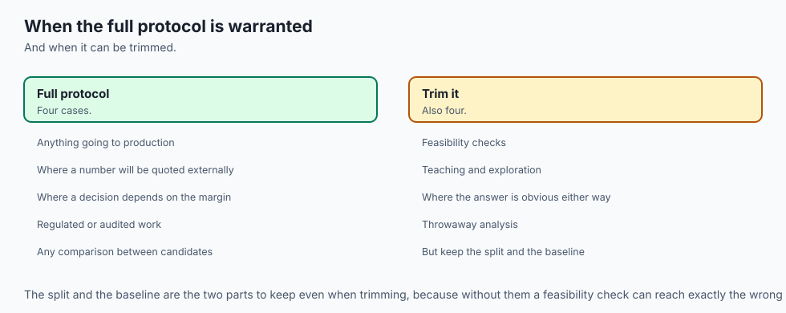

**Run the full eight-stage protocol whenever a model's result will
inform a real decision** — a deployment, a publication, a comparison
against a baseline someone will act on. The cost is one afternoon and a
handful of extra function calls; the alternative cost, when this protocol
is skipped, is a number that fails exactly when it matters most, in
production or in front of a reviewer.

**Compute the predicted selection optimism before every real sweep**, not
only when you suspect it will matter. This lesson's own headline result —
a case where the naive prediction badly overestimated reality — was only
discoverable because the check was run rather than assumed unnecessary.

**Open the confusion matrix whenever the classes carry different real
costs**, which is most classification problems worth building. An
overall accuracy figure treats a false positive and a false negative as
interchangeable; almost no real domain does.

**Compute the test-set interval before treating any comparison as
settled.** An improvement smaller than the interval's half-width is not
evidence of anything, however good the point estimate looks.

**And use `GatedTestSet`, or an equivalent, whenever more than one person
or more than one script can reach the test set** — the leaky-selection
mistake this lesson reconstructs almost never happens on purpose.

**When the full protocol is more than the situation needs:** a genuinely
exploratory first look at brand-new data, where nothing will be reported
or deployed and the goal is purely to build intuition, can reasonably
skip the formal split-and-gate machinery — provided nobody later reuses
that exploratory number as though it were a validated result. The moment
a number leaves the exploratory phase and starts informing a decision,
the full protocol applies.

### The AI thread

Every stage of today's protocol gets harder, not easier, at the scale
modern AI systems operate at, and the selection-optimism finding is the
sharpest version of why.

**The number of "candidates" in a large model's development is
uncountable, and the naive formula would be catastrophically wrong in the
other direction.** A frontier model's final configuration is typically
the survivor of an enormous, informally tracked search across
architectures, data mixtures, and training recipes — a K that is not 36
but plausibly in the thousands, spread across a team and a timeline
nobody fully reconstructs.

Unlike this lesson's sweep, where correlated,
skilled candidates made the real optimism *smaller* than a naive K=36
formula predicts, an uncounted, genuinely enormous K in an industrial
search makes the true optimism potentially far *larger* than anyone
reports — and there is no equivalent of exercise 7b to check it against,
because there is rarely a truly held-out test set that nobody on the team
has ever looked at.

**Public benchmark leaderboards are exactly the leaky-selection failure,
at planetary scale.** Every team that submits a model to a public
leaderboard and iterates based on the score is running exercise 10's
mistake — selecting using the "test" set — except the leaderboard is
shared across thousands of teams over years, so the effective K is
uncountable and the resulting inflation, unlike this lesson's small
measured gap, has in some documented cases been substantial when fresh
test data was collected.

**And the confusion-matrix discipline matters more, not less, as models
get deployed into higher-stakes decisions.** A large language model
graded on overall "helpfulness" or "accuracy" can hide the same asymmetry
this lesson's malignant/benign matrix makes visible — a model can be
excellent on average while being reliably wrong on a specific, costly
category of input, and an aggregate score will never show you that
category exists. The discipline this lesson teaches at the scale of one
confusion matrix and 114 rows is the same discipline that has to scale
to systems evaluated on millions of interactions: never trust the
average without asking what the errors are made of.

## The AI connection

- **An end-to-end exercise exposes the gaps that isolated steps hide**, particularly at the
  joins between stages.
- **Most failures happen between the steps**, not inside them — in the split, the
  preprocessing order, or the threshold.
- **The discipline transfers unchanged to AI systems**, where the stages have different names
  and the same failure modes.
- **Doing it once, completely, is worth more than reading about it repeatedly**, because the
  gaps only appear when you try.
- **The habit of comparing against a baseline** is what turns a result into a decision.

## Knowledge check

1. `candidate_summaries()` shows iris and wine saturating near-perfect
   cross-validated accuracy with a 36-candidate sweep, while
   breast_cancer does not. Explain, in terms of test-set size and
   accuracy ceiling, why that made iris and wine unsuitable for this
   lesson's exercises.

2. Day 144's formula predicts a selection optimism of 0.0326 for this
   lesson's sweep. The measured mean drop over twenty seeds is −0.0001.
   Name the two properties of this sweep's 36 candidates that explain the
   gap, and say why neither property held for Day 144's coin-flip
   candidates.

3. The confusion matrix is `[[40, 2], [0, 72]]` at an overall accuracy of
   0.9825. Explain what specific fact this matrix reveals that the
   accuracy number alone does not.

4. The 95 percent interval around the test accuracy is
   `[0.9584, 1.0066]`, and the improvement over baseline is +0.3509.
   State the rule connecting these two numbers to the verdict, and
   describe a hypothetical improvement size that would have forced a
   "cannot distinguish" verdict instead.

5. In exercise 10, the leaky-selection gap is sometimes exactly zero but
   never negative, across twenty seeds. Explain the mechanism that makes
   a negative gap impossible, and explain separately why a gap of exactly
   zero is unsurprising given the test set has only 114 rows.

6. A learner concludes: "Selection optimism turned out to be nearly zero
   in this lesson, so I don't need to check it on my own project."
   Explain what is wrong with that reasoning, using Day 144's own
   coin-flip measurement as a counter-example.

7. State, in order, the eight stages of this lesson's protocol, and name
   one specific measured failure from Days 141-144 that each stage
   defends against.

8. Why does this lesson compute the predicted selection optimism
   (exercise 7) before measuring the actual drop (exercise 7b), rather
   than the other way around?

## Hands-on exercise

Today's lab, `One Classification Project, Run Properly`, runs the entire
eight-stage protocol on the Wisconsin breast-cancer dataset and asks you
to verify every measured number along the way.

Fourteen exercises. The first four establish the dataset choice, the
baseline, the split and the sweep. The next three build the
cross-validated selection, the gated one-time test evaluation, and the
predicted-versus-measured selection optimism — the closing result of the
week. The last four cover error analysis, the interval-based verdict, and
the leaky-selection reconstruction.

Build the environment, then work through
`starter/test_classification_claims.py`, replacing one `pytest.skip` at a
time.

### Expected output

The harness ends with:

```text
---------------------------------------------------------------
15 checks, 0 failure(s)
```

and exits 0. `pytest examples -q` reports `18 passed`, and
`pytest starter -q` reports `4 passed, 14 skipped` until you begin.

The measured table includes:

```text
  K = 36 candidate pipelines: 15 KNN, 11 logistic regression, 10 decision trees
  winner: logreg (1)  5-fold CV accuracy = 0.9780
  test accuracy: 0.9825
  predicted optimism (SE of a CV fold x expected max of 36 normals): 0.0326
  mean measured drop: -0.0001  sd 0.0149
  confusion matrix: [40, 2] / [0, 72]
  false negatives (malignant predicted benign): 2
  95 percent interval: [0.9584, 1.0066]
  mean leaky gap: +0.0096  fraction of seeds where the leak was non-negative: 1.0000
```

### Validate your work

1. `bash tests/run_tests.sh; echo "exit=$?"` reports `15 checks, 0
   failure(s)` and `exit=0`. Capture the harness's own exit status.

2. `.venv/bin/pytest examples -q` reports `18 passed`.
3. `.venv/bin/python3 examples/report_measurements.py | diff - expected-output/measured-values.txt`
   produces no output.

4. When you have finished every exercise, `pytest starter -q` reports
   `18 passed`.

5. Break one assertion on purpose, confirm the harness fails, restore it.

### Troubleshooting

**The harness takes a while.** Exercises 7b and 10b each cross-validate
36 candidates across 20 seeds — 720 five-fold cross-validations apiece.
No timing is asserted, so a slow machine changes nothing about whether it
passes.

**My winning configuration differs from the lesson's.** Check
`expected-output/FIELDS.md`. Several configurations score within a point
or two of `LogisticRegression(C=1)`, and different NumPy or scikit-learn
versions can legitimately shuffle a tie differently — Day 145 already
established that near-tied configurations trade places under resampling.

**The predicted optimism doesn't match my by-hand calculation.**
`predicted_selection_optimism` uses the size of one cross-validation
*fold* (455 divided by 5, giving 91), not the full training set, because
that is the number of rows each fold's held-out score is actually
computed from.

**My leaky-gap numbers differ from the lesson's.** Almost certainly fine
if a single seed's gap is zero — a ceiling effect from only 114 test
rows. What must hold across the full 20-seed sweep is that the gap is
never negative.

**`import file mismatch`.** You ran `pytest examples starter` together.
Run them separately.

### Common mistakes

**Reporting the test accuracy without the interval.** A point estimate
with no half-width is not a verdict, and this lesson's own comparison —
0.3509 improvement against a 0.0241 half-width — would have looked very
different at a smaller improvement or a smaller test set.

**Treating the small measured selection optimism as proof the check is
unnecessary.** Day 144 already measured a case where it was not small.
The check tells you which case you are in; skipping it assumes the
answer.

**Reading 0.9825 accuracy without opening the confusion matrix.** The
two errors this model makes are not interchangeable, and the accuracy
figure alone cannot tell you that.

**Concluding the leaky-selection gap is "basically zero and therefore
harmless."** The gap is small at any one seed partly because of the
test set's coarse granularity, but it is never negative across twenty
seeds — the mechanism, not the size, is the point.

## Practice assignment

Take a classification result you already have — from a project, a
tutorial, or your own experiments — and run this lesson's protocol
against it, honestly.

1. **State your baseline.** What does the majority class get you for
   free? If you cannot answer this in one line, your project has not
   been framed yet.

2. **Count your K.** How many models, hyperparameters, or feature sets
   were tried against whatever number you are about to report? Estimate
   it honestly, in writing, even if the true count is embarrassing.

3. **Compute the predicted optimism**, using your validation set's
   standard error and your counted K, and compare it to whatever
   improvement you are claiming.

4. **Measure the real gap, if you can.** If you have a genuinely
   untouched holdout, compare your cross-validated score to a single
   evaluation on it. If you do not have one, say so plainly — that is a
   finding too.

5. **Open your confusion matrix**, and name which of your errors is
   costlier in your actual domain, not just which is more frequent.

6. **State your verdict as an interval**, and say explicitly whether your
   claimed improvement clears it.

The deliverable is the audit, in writing, not a better model.

## Extension challenge

Pick one and measure it.

1. **Nested cross-validation.** Implement an inner selection loop and an
   outer scoring loop, and measure whether the gap between cross-validated
   and outer-scored accuracy shrinks further than this lesson's single
   test evaluation showed. Report the cost in fits.

2. **A fourth candidate family.** Add support-vector classifiers to the
   sweep, re-run the full protocol, and report whether the winner or its
   cross-validated score changes at the headline seed.

3. **Cost-weighted error analysis.** Assign an explicit cost to a false
   negative versus a false positive — say, ten to one — and determine
   whether a different candidate from the 36-model sweep would have been
   preferred under that weighting.

4. **Scale the test set and re-measure the leaky gap.** Repeat the
   leaky-vs-honest comparison with a 60/40 train/test split instead of
   80/20, so the test set holds roughly 227 rows instead of 114, and
   report whether the mean gap and its granularity both change as
   predicted.

5. **Break independence on purpose.** Duplicate a fraction of the rows
   into both the train and test splits before running the sweep, and
   measure how much the reported test accuracy inflates — Day 144's
   group-leakage lesson, reconstructed on real data instead of a
   synthetic one.

6. **Find the break-even K for this dataset.** At what number of
   correlated, real candidates would the predicted optimism formula and
   the measured reality actually agree? Vary the sweep's composition —
   more independent model families, fewer near-duplicate hyperparameters —
   and report what changes the answer.
