## Why this matters

Take one column of real patient data — a serum measurement, `s1` — and copy it. Not transform it, not engineer a new feature from it: copy it, byte for byte, and hand the model two columns that say the exact same thing. Refit.

```text
  original s1 coefficient        : -1.0900
  duplicate model, coefficient a : -0.5450
  duplicate model, coefficient b : -0.5450
  sum of the two                 : -1.0900
  max abs prediction difference  : 3.98e-12
  R2 original / duplicate        : 0.5177 / 0.5177
```

Nothing about the model's accuracy changed. The predictions moved by four trillionths — noise smaller than a rounding error. R-squared held at 0.5177 to four decimal places on both sides. Whatever this model is worth as a predictor, duplicating a column changed none of it.

But look at the coefficients. `-1.09` became two numbers, `-0.545` and `-0.545`, and neither one is the original. Split the effect down the middle and call it a day — reasonable enough, until you notice *why* it split evenly: the two columns are identical, so nothing distinguishes them, and the normal equations simply picked the tidiest of infinitely many valid splits.

Now break that tie. Add one percent of random noise to the copy — an amount too small to see in a scatter plot — and refit at a few different noise draws:

```text
  seed 0: coefficient a = +0.7592   coefficient b = -1.8451   sum = -1.0859
  seed 1: coefficient a = +4.9238   coefficient b = -5.9881   sum = -1.0643
  seed 2: coefficient a = -1.6402   coefficient b = +0.5508   sum = -1.0893
  seed 3: coefficient a = +3.6831   coefficient b = -4.7727   sum = -1.0896
  seed 4: coefficient a = -5.6134   coefficient b = +4.4931   sum = -1.1203
```

Read that again. The *original* coefficient, before any duplication, was `-1.09` — negative. At seed 0, one of its two halves is `+0.76` — positive, and larger in magnitude than the coefficient it split from. At seed 1, the two halves are `+4.92` and `-5.99`: values five times the size of anything in the honest model, of opposite sign, describing what is essentially the same nine-tenths-correlated pair of columns. Across just five noise draws, one coefficient ranges from `-5.61` to `+4.92` — an eleven-unit swing on a value that started at `-1.09`.

And the sum, every single time, sits within `0.03` of `-1.09`. The predictions barely move at all — across ten noise seeds, the single largest prediction change anywhere in the dataset is `6.59`, on a target whose own values span from `25` to `346` with a standard deviation of `77`. R-squared holds between `0.5178` and `0.5186` throughout.

**Wild coefficients, stable predictions.** That is the whole subject of this lesson in one sentence. A model with more than one predictor can be excellent at what it predicts and worthless — actively misleading — as a description of what any individual coefficient means, and nothing about its accuracy, its R-squared, or its predictions will ever tell you so. You have to check the coefficients themselves, and this lesson shows you how.

This matters for AI work specifically because "explainable" model output almost always means "the coefficients, or something coefficient-shaped." A feature-importance chart, a SHAP value, a linear probe on an embedding, an ablation study reporting "removing this input cost 2 points of accuracy" — every one of these is vulnerable to the exact failure measured above the moment two inputs carry overlapping information, which in any real feature set is most of the time. Understanding multiple regression's mechanics is the prerequisite for knowing when to trust an explanation and when you are reading noise dressed up as insight.

## The idea in plain language

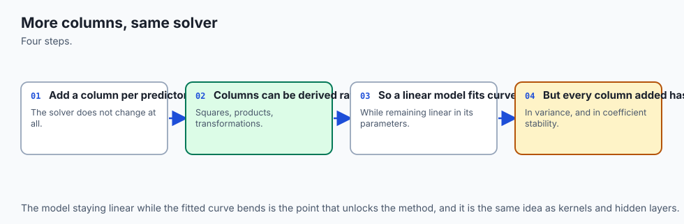

Day 148 gave you a line through one predictor: one input, one coefficient, a slope you can read straight off a scatter plot. Multiple regression is the same idea with more inputs — age, blood pressure, six blood-test results, whatever you have — each with its own coefficient, all fitted together in one equation:

```text
y = b0 + b1*age + b2*sex + b3*bmi + b4*bp + b5*s1 + b6*s2 + ... + b10*s6
```

The mechanics of *fitting* this barely change from the one-predictor case. It is still the same least-squares machinery from Day 149, minimizing the same squared error, solving what is still, formally, a system of linear equations. Adding predictors does not make the fitting procedure harder. It makes the *coefficients* harder to trust.

Here is the phrase that carries all the difficulty, and it is worth sitting with: a coefficient in a multiple regression tells you the effect of one predictor **holding every other predictor constant**. Not "on average across the dataset." Not "ignoring everything else." Specifically: if you could freeze every other column at its current value and nudge only this one, this is how much the prediction would move.

That phrase is doing enormous work, and here is the catch: you never actually get to freeze the other columns. They are what they are in your data. If two columns tend to move together — older patients tend to have higher blood pressure, one blood measurement tends to rise when another does — then "holding one fixed while the other moves" describes a situation that barely occurs in your dataset.

The model still produces an answer, because the arithmetic does not know or care whether the scenario it is describing is realistic. It just knows how to divide up credit for the outcome among whichever columns you gave it, and when two columns are hard to tell apart, that division becomes close to arbitrary — which is exactly what the exact-duplicate and noisy-duplicate experiments above demonstrated with numbers you can reproduce.

This phenomenon has a name: **multicollinearity**. Two or more predictors carrying overlapping information about each other, not just about the target. It is not a bug in the software and not a mistake in how you fit the model. It is a fact about your data that determines how much you can trust the coefficients that come out — completely independent of how good those coefficients are at predicting.

![Diagram: a design matrix of ten columns from the diabetes dataset -- age, sex, bmi, bp, and six serum measurements s1 through s6 -- with s1 and s2 bracketed together and labelled with their correlation of 0.8967. Beneath each column sits its variance inflation factor: 1.2173 for age, 1.2781 for sex, 1.5094 for bmi, 1.4594 for bp, 59.2025 for s1, 39.1934 for s2, 15.4022 for s3, 8.891 for s4, 10.076 for s5, and 1.4846 for s6, with the four highest values highlighted in red. A left panel explains that a coefficient measures the effect of one column holding every other column fixed, and that this condition is only approximate when columns move together. A right panel gives the duplicate-column result: the original s1 coefficient of minus 1.09 splits into two coefficients of minus 0.545 each in a duplicated model, whose sum matches the original to eight decimal places, whose maximum prediction change is 3.98 times ten to the minus twelve, and whose R2 is unchanged at 0.5177, with a closing note that neither half means anything alone](./assets/design-matrix-architecture.svg)

## Historical background

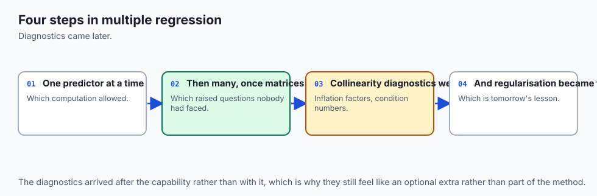

Multiple regression's mathematics predates computers by a wide margin. Adrien-Marie Legendre published the method of least squares in 1805, and Carl Friedrich Gauss claimed to have used it since 1795 while working on planetary orbits — a genuine multi-predictor problem, since an orbit's shape depends jointly on several unknowns that all have to be estimated at once from noisy observations. The normal equations that solve a multiple regression today are, structurally, the same equations Gauss and Legendre were solving for astronomy two centuries ago.

What changed over the twentieth century was not the arithmetic but the awareness of its failure modes. Ragnar Frisch, the Norwegian economist who later shared the first Nobel Memorial Prize in Economic Sciences in 1969, wrote extensively in the 1930s about what he called "confluent" relationships among economic variables — predictors so entangled that no amount of data could cleanly separate their individual effects. The specific term "multicollinearity" is generally attributed to Frisch's 1934 work on statistical confluence analysis, and the problem he was describing is precisely the one measured in this lesson's opening experiment: variables that move together so closely that a regression cannot tell which one is "really" responsible for an outcome.

The diagnostic tool this lesson leans on hardest — the variance inflation factor — has a more recent and more practical origin. It formalizes an intuitive idea (how much does a predictor overlap with the rest of the design matrix?) into a single number, `1 / (1 - R2)`, computed by regressing each predictor on every other predictor in the model. The technique and its name are standard in regression textbooks by the 1970s, closely tied to work by David Marquardt and others on diagnosing and remedying collinearity in applied regression — the same Marquardt whose damping parameter underlies the Levenberg-Marquardt algorithm used throughout nonlinear least squares to this day.

Polynomial regression's history runs on a separate, older track, entangled with curve-fitting itself: astronomers and surveyors were fitting parabolic and cubic curves to observational data well before "linear model" had a formal definition, precisely because natural relationships rarely follow straight lines. What took longer to become common knowledge — and what this lesson exists partly to correct — is the recognition that fitting a curve and fitting a straight line are, underneath, the identical linear-algebra operation. The confusion between "the model traces a curve" and "the model is nonlinear" persists in casual usage today, which is why one of this lesson's central exercises exists purely to demonstrate, by direct computation, that a polynomial fit is linear in its parameters.

## What it is — and what it is not

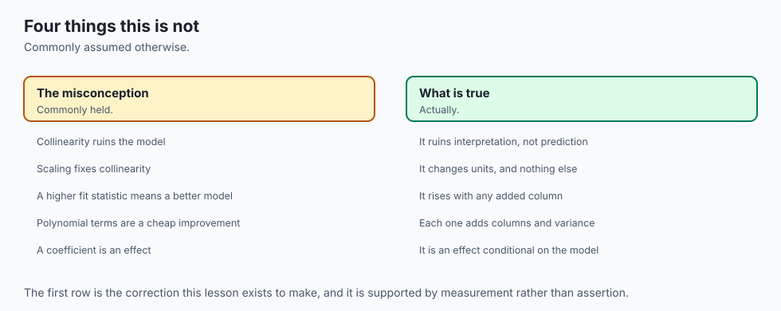

**Multiple regression is what you get when you extend Day 148's single line to more than one predictor, fitted jointly by the same squared-error machinery Day 149 introduced.** Nothing about the loss function changes. Nothing about the solution method changes — the normal equations still apply, just with a larger design matrix. What changes is entirely in how the resulting coefficients should be read.

Here is what a multiple-regression coefficient precisely is: the partial effect of one predictor on the target, conditional on every other predictor in the model. Here is what it is not, and these are the two mistakes worth naming explicitly.

**A multiple-regression coefficient is not the same quantity as that predictor's simple-regression coefficient.** Fit `s1` alone against the target and you get `+0.4723`. Fit `s1` alongside the other nine predictors and you get `-1.09`. Both are real, correctly computed numbers. They are not competing estimates of one true quantity — they are answers to two different questions.

The simple coefficient answers "how does `s1` alone relate to the outcome, ignoring everything else about the patient?" The multiple coefficient answers "how does `s1` relate to the outcome, once we've accounted for everything the other nine predictors — including `s1`'s close correlate `s2` — already explain?" A predictor that appears strongly positive on its own can appear negative once its correlated partners are in the room, because those partners were absorbing credit that the simple regression had, incorrectly, assigned to `s1` alone.

**And a design matrix with polynomial or interaction terms is not a nonlinear model, even though the curve it draws bends.** `PolynomialFeatures` does not change how the fitting works; it changes what counts as a "predictor" before fitting starts. Feed the design matrix `[bmi, bp, bmi^2, bmi*bp, bp^2]` into ordinary `LinearRegression` and you get an ordinary linear fit — on those five columns.

The resulting *prediction* is a curved, twisting surface in terms of the original `bmi` and `bp`. The *fitting problem* is exactly as linear as Day 148's single straight line. This lesson proves it by brute force later on: solving the identical expanded design matrix two completely different ways — once through scikit-learn's transformer-plus-estimator pipeline, once by hand with a direct linear-algebra solve — and getting answers that agree to thirteen decimal places.

## Why it was created and what problems it solves

You almost never have exactly one useful predictor. A patient's disease progression depends on age and blood pressure and blood chemistry all at once; a house's price depends on square footage and location and age of the roof all at once. Restricting yourself to one predictor at a time — fit against `bmi` alone, then separately against `bp` alone, then separately against each serum measurement — throws away the ability to ask the only question that usually matters in practice: "accounting for everything else I know about this patient, what does this one variable add?"

Multiple regression exists to answer that question in a single, coherent model rather than a pile of disconnected single-predictor fits. And it does answer it — the mechanics genuinely deliver a coefficient per predictor, conditional on the rest, exactly as advertised. The problem it does *not* solve, and was never designed to solve, is what happens when the predictors you hand it are not independent sources of information. Two correlated predictors do not confuse the *model*; the model fits exactly as well as the data allows. They confuse the *coefficients*, because "holding one fixed while moving the other" describes a hypothetical scenario your data barely contains examples of.

Polynomial and interaction terms exist to solve a different, adjacent problem: what happens when the true relationship between a predictor and the target is not a straight line, or when one predictor's effect genuinely depends on the level of another. `bmi^2` lets `bmi`'s own relationship with the outcome curve rather than stay a straight line. An interaction term, `bmi * bp`, is different again — it is the only kind of column that can express "the effect of `bmi` is different when `bp` is high than when `bp` is low." Neither trick requires a new fitting algorithm.

Both are answered by adding new columns to the design matrix and handing the same ordinary least squares the larger problem — which is precisely why both interact with the multicollinearity story: adding `bmi^2` next to `bmi` frequently creates a new correlated pair, because a value and its own square tend to move together across most of the range a dataset actually covers.

## How it works

### The mechanics: more columns, same solver

Nothing here departs from what Day 149 already established. Stack every predictor as a column of the design matrix `X`, add a column of ones for the intercept, and solve for the coefficient vector `b` that minimizes the sum of squared residuals `(y - X*b)`. The closed-form solution is still the normal equations:

```text
b = (X^T X)^-1 X^T y
```

The only thing that changed from the single-predictor case is the shape of `X`: instead of one column plus an intercept, it is ten columns plus an intercept, or fifteen if you have added a few polynomial terms. `LinearRegression().fit(X, y)` in scikit-learn does not know or care how many columns `X` has. It solves the identical linear system either way.

### Why the design matrix, not the predictor list, is the right mental model

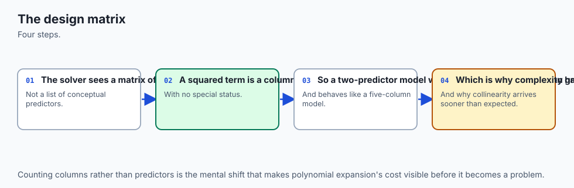

The moment you start adding polynomial and interaction terms, "predictor" stops being a useful word for what goes into the fit. The **design matrix** is the more honest concept: it is simply whatever set of numeric columns you hand the solver, whether those columns are raw measurements, squares of measurements, products of pairs of measurements, or anything else you construct. `PolynomialFeatures(degree=2)` applied to `[bmi, bp]` produces the design matrix `[bmi, bp, bmi^2, bmi*bp, bp^2]` — five columns from two original predictors — and from that point forward, `LinearRegression` treats all five identically. It has no concept of "original" versus "derived" columns. It just fits a coefficient to each.

This lesson verified that identity directly. Build the design matrix by hand, fit `LinearRegression` on it, and separately solve the normal equations on the identical matrix using `numpy.linalg.lstsq`:

```text
  design matrix columns   : ['bmi', 'bp', 'bmi^2', 'bmi bp', 'bp^2']
  sklearn coefficients    : [-1.891873, -2.116267, 0.024891, 0.095079, 0.004919]
  normal-eq coefficients  : [-1.891873, -2.116267, 0.024891, 0.095079, 0.004919]
  sklearn intercept       : 99.877329
  normal-eq intercept     : 99.877329
  max abs coefficient gap : 1.49e-13
  max abs intercept gap   : 9.81e-13
```

Two entirely different code paths — scikit-learn's estimator machinery and a raw linear-algebra call — land on the same five coefficients to thirteen decimal places, because they are solving the exact same linear system. That gap of `1.49e-13` is not agreement; it is floating-point noise. This is the proof, not an analogy: a polynomial fit is a linear model in every sense that matters to the solver.

### What each new column type actually buys you

`bmi^2` lets the relationship between `bmi` and the outcome curve — the effect of an extra unit of `bmi` can be different at low `bmi` than at high `bmi`. Comparing the fit with and against the interaction term makes the distinction concrete:

```text
  R2 with 'bmi bp' term   : 0.404170
  R2 without it           : 0.399896
  interaction coefficient : 0.095079
```

Dropping the interaction term, while leaving both squared terms in place, costs `0.0043` of R-squared — small, but real and measurable. That gap is specifically what `bmi^2` and `bp^2` cannot express between them: whether `bmi`'s effect on the outcome depends on the patient's `bp`, and vice versa. Two predictors each curving independently is a different claim from two predictors whose combined effect is not simply the sum of their separate curves, and the interaction term is the only column in the design matrix that can say the second thing.

### Variance inflation, computed from its own definition

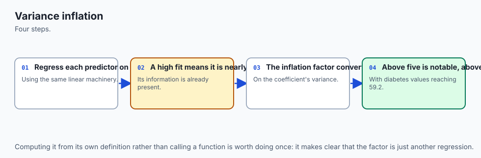

The diagnostic this lesson leans on to quantify multicollinearity is the **variance inflation factor**, and its definition is worth internalizing rather than treating as a black box. For each predictor, regress it on every *other* predictor in the design matrix — a completely separate little regression problem, ignoring the target entirely — and take the R-squared of that auxiliary fit. The VIF is:

```text
VIF = 1 / (1 - R2)
```

If a predictor is unrelated to the rest, the auxiliary R-squared is near zero and the VIF sits near 1. If a predictor is almost perfectly predictable from the others, the auxiliary R-squared approaches 1 and the VIF explodes toward infinity — exactly what happens if you literally duplicate a column, since regressing the duplicate on the original (which is one of the "other" predictors) gives a perfect fit.

Computed on all ten raw-unit diabetes predictors:

| predictor | VIF | predictor | VIF |
| --- | --- | --- | --- |
| age | 1.2173 | s1 | 59.2025 |
| sex | 1.2781 | s2 | 39.1934 |
| bmi | 1.5094 | s3 | 15.4022 |
| bp | 1.4594 | s4 | 8.8910 |
| s6 | 1.4846 | s5 | 10.0760 |

The four clinical measurements — age, sex, bmi, blood pressure — sit close to 1, meaning the other nine predictors barely explain any of their own variance. The five serum measurements from `s1` through `s5` all sit above the widely used rule-of-thumb cutoff of 5, and `s1` at `59.2025` is the worst of them: the other nine predictors explain about `98.3%` of `s1`'s own variance, which means `s1` is carrying almost no information that is not already present, in some combination, elsewhere in the design matrix.

That is precisely why duplicating `s1` — a column already 89.67% correlated with `s2` — produced the wild instability in this lesson's opening experiment. A near-duplicate was already sitting in the model before any copying happened.

### Instability tracks the VIF, not just the anecdote

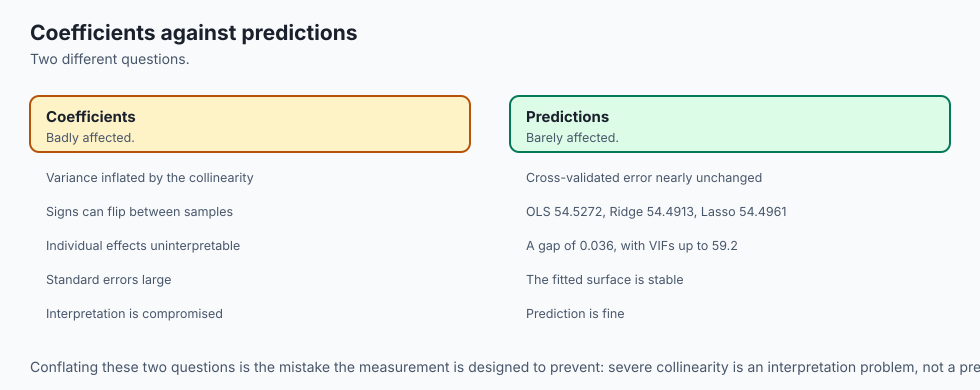

The duplicate-column experiment shows the mechanism in the most extreme case — literal duplication. A bootstrap confirms the same pattern holds across the whole dataset without any artificial duplication at all. Resample the 442 rows with replacement, refit, and record every coefficient — five hundred times — then compare each predictor's coefficient of variation (its bootstrap standard deviation divided by its bootstrap mean, a scale-free measure of relative wobble):

```text
  s1  (VIF 59.20): coefficient of variation 0.51
  bmi (VIF  1.51): coefficient of variation 0.13
```

`s1`'s coefficient is roughly four times as unstable, relative to its own size, as `bmi`'s — and `s1` is exactly the predictor the VIF table flagged as the most redundant. One honest wrinkle: `age`'s own coefficient of variation is the *largest* in the whole dataset, at `4.70`, despite `age` having one of the *lowest* VIFs, at `1.22`. That is not a contradiction — it is what happens when a coefficient's mean sits very close to zero, which inflates a mean-relative ratio without reflecting genuine collinearity-driven instability. The lab's own instability comparison excludes `age` for exactly this reason, and says so directly in the code, rather than quietly picking only the predictors that make the pattern look cleaner than it is.

![Diagram: five seed groups labelled seed 0 through seed 4, each showing a pair of bars for the near-duplicate column's two coefficients, revealed left to right. At seed 0 the pair reads plus 0.76 and minus 1.85. At seed 1, plus 4.92 and minus 5.99. At seed 2, minus 1.64 and plus 0.55. At seed 3, plus 3.68 and minus 4.77. At seed 4, minus 5.61 and plus 4.49. The bars swing above and below a zero line and repeatedly change sign between seeds. A panel beneath states that across all five seeds the sum of the two coefficients has mean minus 1.0891 and standard deviation 0.0144, the largest single prediction move across ten seeds tried is 6.59 on a target whose own spread is 77, and R2 stays within 0.5178 to 0.5186 throughout. A caption reads that wild coefficients and stable predictions are the whole lesson. A prefers-reduced-motion block leaves every seed and every value visible at once](./assets/duplicate-column-flow.svg)

### The sign flip, on real data

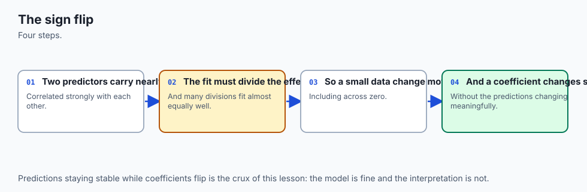

Multicollinearity's most unsettling symptom is a coefficient that changes sign depending on what else is in the model. Comparing every predictor's simple-regression coefficient (fit alone) against its multiple-regression coefficient (fit alongside the other nine) finds four sign flips in this dataset:

```text
  name    simple      multiple    sign flip
  age        1.1050     -0.0364   True
  sex        6.6454    -22.8596   True
  bmi       10.2331      5.6030   False
  s1         0.4723     -1.0900   True
  s3        -2.3531      0.3720   True
```

`s1` is the headline case, because it connects directly to the duplication story: alone, `s1` looks like a modest positive predictor of disease progression. Once `s2` — its 0.8967-correlated partner — enters the model, `s1`'s coefficient turns negative and more than doubles in magnitude. Nothing about the data changed between the two fits.

What changed is what `s1`'s coefficient is being asked to explain: alone, it absorbs credit for everything correlated with it, including effects that properly belong to `s2`; alongside `s2`, it is left with only what remains after `s2`'s overlapping information is accounted for. This is precisely the mechanism Day 119 measured as Simpson's paradox, here appearing as a continuous coefficient rather than a reversed aggregate rate — the same reversal, the same cause: conditioning on a correlated variable changes the apparent direction of another variable's relationship with the outcome.

### R-squared cannot be trusted to notice any of this

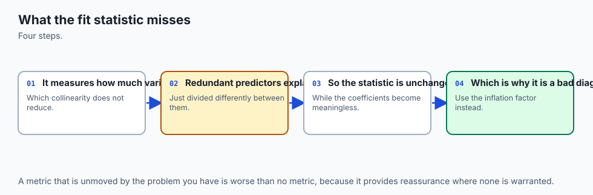

A natural instinct, faced with an unstable coefficient, is to check whether R-squared dropped — surely a genuinely worse model would show it. It will not, and this lesson's next measurement shows exactly why not. Append pure random noise columns, with zero relationship to the target by construction, to the ten real predictors:

```text
  noise columns   R2         delta vs 10 real predictors
              1   0.518064   +0.000316
              2   0.523041   +0.005293
              5   0.527615   +0.009867
             10   0.532455   +0.014707
```

R-squared rose every single time, strictly, from `0.5177` to `0.5325` — over one and a half points gained from ten columns of numbers that have nothing to do with disease progression whatsoever. The mechanism is exact rather than approximate: ordinary least squares, faced with a new column, always has the option of setting that column's coefficient to exactly zero and reproducing the previous fit precisely. Since it is free to choose any nonzero coefficient instead if doing so reduces the training-set sum of squared errors even slightly, the best it can do is never worse, and — because a random column will, by chance, correlate at least a little with the training residuals — usually a hair better.

R-squared, computed on the training set, is structurally incapable of penalizing a useless predictor. This is precisely the gap Day 152's adjusted R-squared exists to close; this lesson only measures the problem, deliberately, and leaves the fix to that day.

### Scaling: what it changes, and what it never touches

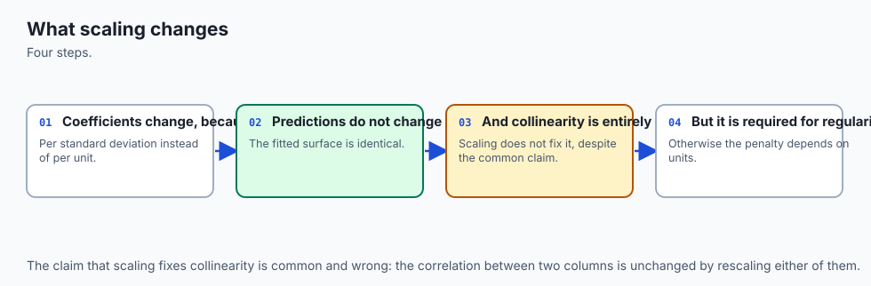

One more mechanical fact rounds out the picture, and it is a genuine surprise the first time you measure it. Standardize every predictor — subtract its mean, divide by its standard deviation — and refit:

```text
  name    raw coef     scaled coef
  s1        -1.0900     -37.6800
  R2 raw / scaled                : 0.517748 / 0.517748
  max abs prediction difference  : 1.14e-12
```

`s1`'s coefficient moved from `-1.09` to `-37.68` — more than thirty times larger in magnitude. Several other coefficients shifted by similarly dramatic factors. And yet R-squared is identical to six decimal places, and every single prediction the model makes moved by at most `1.14e-12` — again, floating-point noise, not a real difference. Standardizing changes what "one unit" of a predictor means — one unit of raw `s1` is a tiny fraction of its range; one unit of standardized `s1` is a full standard deviation — and a coefficient's size is entirely a statement about units.

What it never changes, for ordinary least squares specifically, is the fitted relationship itself: the same combination of inputs still produces the same prediction, because standardizing is just an affine rescaling of the inputs, and ordinary least squares is invariant to affine rescaling. This invariance is specific to this estimator. Day 151's regularized models, which penalize coefficient size directly, are not invariant to it at all — which is exactly why scaling before fitting becomes mandatory there in a way it never was here.

## An everyday analogy

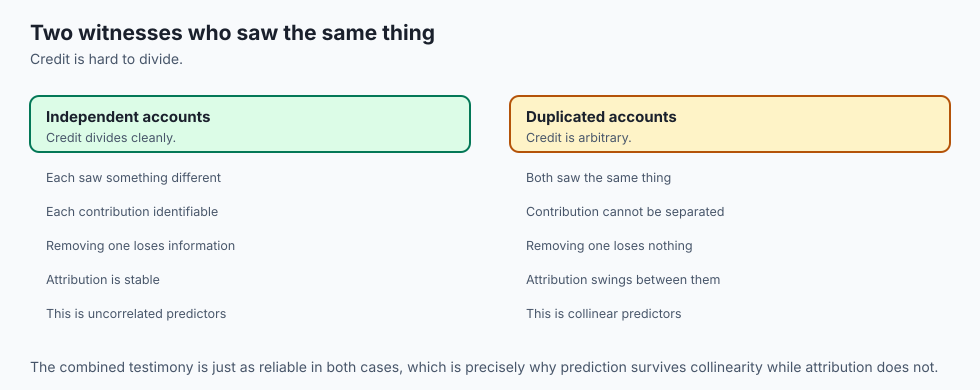

Picture a kitchen scale, and a chef weighing ingredients for a recipe by ear rather than by measuring cups: flour by the handful, sugar by the spoonful, butter by the eyeballed chunk. Ask "how much did the flour alone contribute to the cake's weight?" and you can answer cleanly, because you weighed the flour by itself before anything else went in the bowl.

Multiple regression is what happens when several ingredients get mixed and weighed *together*, and you are asked to reconstruct, after the fact, how much each one contributed. If flour and sugar were measured with two entirely separate scoops that never track each other — one chef always uses a big flour scoop regardless of how much sugar goes in, another chef's sugar scoop moves independently — you can usually work out each ingredient's individual contribution to the final weight with real confidence. That is the low-VIF case: `age`, `sex`, `bmi`, `bp` in this lesson's dataset, each contributing its own share cleanly.

Now imagine two ingredients that a particular recipe *always* uses in a fixed ratio — say, an ingredient that comes pre-mixed with a filler, so every scoop of it also brings along some of the filler, in roughly the same proportion every time. Ask "how much did the pure ingredient alone weigh, versus how much did the filler weigh" and you have asked a question the data cannot answer, because you have never once seen them apart.

The scale will happily report a total weight — the recipe still bakes into a real cake, and the total weight is a real number — but any attempt to split credit between the two component weights is guesswork dressed as precision. That is `s1` and `s2` in this lesson, correlated at `0.8967`: not literally the same ingredient, but close enough to it that the model has barely ever seen one move without the other.

**The duplicate-column experiment** is the extreme version of this analogy: two scoops from the exact same jar, weighed as if they were different ingredients. The total weight is exactly right — the scale doesn't care how many scoops you used, only the sum. But ask "how much did scoop A weigh versus scoop B" and the honest answer is that the question has no answer; any split that sums correctly is equally valid, and a puff of air landing differently on the scale (this lesson's one percent of noise) can send the "answer" swinging from one extreme to the other.

**The polynomial-mechanics result** fits the analogy from a different angle: measuring flour and flour-squared is still, mechanically, just weighing two more scoops on the same scale. The scale does not need to be replaced with something fancier because one of the scoops happens to be a mathematical transformation of another; it is still addition, still the same procedure, just with more ingredients on the list.

## Examples in practice

### Reading a coefficient table honestly

A junior analyst is handed a fitted multiple regression with ten coefficients and asked to write a one-paragraph summary of "what drives the outcome." The tempting shortcut is to rank the coefficients by size and report the top three as the biggest drivers. This lesson's measurements make that shortcut actively dangerous: a coefficient's size depends on the scale of its predictor (the scaling experiment above), on which other correlated predictors happen to be in the model (the sign-flip experiment), and on how much redundant information sits alongside it (the VIF table).

The honest first step, before writing a single sentence about "drivers," is to compute VIFs for every predictor and flag anything above 5 as a coefficient whose size and sign should not be trusted in isolation — regardless of how large or how statistically significant it looks.

### Diagnosing a coefficient that "doesn't make clinical sense"

A model of disease progression reports that a serum measurement known from prior clinical literature to be positively associated with the outcome has a *negative* coefficient in the fitted model. The instinct is to suspect a data error or a sign convention mistake. This lesson's `s1` result is the exact template for the correct diagnosis: check the predictor's correlation with the other columns in the model before assuming anything is broken.

If `s1` correlates at `0.8967` with `s2`, a sign flip between `s1`'s simple and multiple coefficients is not evidence of a bug — it is evidence that `s1`'s multiple-regression coefficient is answering a genuinely different, and genuinely more specific, question than the clinical literature's simple-correlation claim. Both can be correct simultaneously, describing different conditioning.

### Building a polynomial feature set without fooling yourself

A team wants to capture a nonlinear relationship between a single sensor reading and a target, and reaches for `PolynomialFeatures(degree=3)`. The immediate risk is treating the resulting model as something categorically different from the linear regression they already understand — over-trusting its flexibility, or under-trusting its interpretability, because "polynomial" sounds like a different kind of model. It is not. It is the identical `LinearRegression` fit on a design matrix with three extra columns, and every property measured in this lesson — the R-squared-never-decreases guarantee, the scaling invariance, the exact linear-algebra solution — applies to it without modification.

The only genuinely new consideration is that `x`, `x^2` and `x^3` are, for any real dataset, strongly correlated with each other by construction (a value and its square move together across most ranges), so a VIF check on the expanded design matrix is exactly as relevant here as it is for `s1` and `s2`.

### Deciding whether an interaction term is worth adding

A model of the diabetes dataset fits `bmi` and `bp` with a full quadratic expansion. A stakeholder asks whether the interaction term is "actually doing anything" or just adding complexity. The measured answer here is concrete rather than rhetorical: dropping `bmi*bp` while keeping `bmi^2` and `bp^2` costs `0.0043` of R-squared — real, reproducible, and small.

Whether that is "worth it" depends entirely on the application: a fraction of a percentage point of R-squared might matter enormously in a competition leaderboard and not at all in a clinical summary where the interaction term's coefficient is hard to explain to a physician. The measurement gives the honest cost; the decision about whether to pay it belongs to the person who owns the trade-off.

## Implications: security, privacy, performance, scalability, and cost

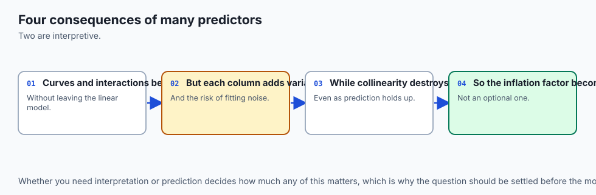

**An unstable coefficient is a governance risk, not just a statistical curiosity.** If a fitted coefficient feeds a downstream decision — which feature to remove for cost reasons, which factor to cite in an adverse-action notice, which signal a regulator is told the model relies on — a retraining run on a slightly different sample can send that coefficient's sign and magnitude somewhere entirely different, while every accuracy metric anyone is monitoring stays exactly where it was.

This lesson's noisy-duplicate result, at seed 0 versus seed 1, is the concrete shape of that risk: two refits on data differing only by imperceptible noise, one reporting a positive effect and the other reporting a negative one nearly five times larger in magnitude, both scoring identically on R-squared. Any process that trusts a coefficient's sign or size for anything beyond prediction needs a VIF check as a precondition, the same way a financial report needs an audit trail.

**Multicollinearity is a privacy-adjacent hazard when the correlated predictors are themselves sensitive.** Two blood measurements moving together, as `s1` and `s2` do here, might jointly encode something closer to a single latent clinical factor than two independent facts about a patient. A coefficient reported as belonging to `s1` alone, when in truth it is an artifact of an arbitrary split with its correlated partner, risks over- or under-stating what a specific measurement reveals — a distortion that matters when coefficients are used to justify what data is collected or retained.

**Performance and scalability are the one place this lesson's failure mode is nearly free to catch.** Computing a VIF for every column in a design matrix is just ten (or however many) extra small regressions — on 442 rows and ten predictors, computing all ten VIFs takes a fraction of a second, dwarfed by the model fit itself. Bootstrap-resampling the coefficients five hundred times to check their stability, as this lesson's exercise 4 does, likewise completes in under a second on this dataset. There is essentially no computational excuse for skipping these checks on any dataset small enough to fit a linear model on a laptop.

**Cost shows up in the decisions built on top of unreliable coefficients, not in computing the diagnostics.** The VIF check itself costs almost nothing. The cost is what happens when it is skipped: a business decision to "cut the least important feature" made from a coefficient table where the least-important-looking feature is actually just the unlucky half of a near-duplicate split, or a regulatory explanation built on a sign that would flip under a different, equally valid random seed.

## Alternatives: free, open source, and commercial

### scikit-learn's `LinearRegression`, `PolynomialFeatures` and `StandardScaler` — used here

**When to choose them:** for the entire workflow this lesson demonstrates — fitting, expanding a design matrix, and rescaling. Free, BSD-3-Clause licensed, no paid tier, and everything measured in this lesson used exactly these three tools.

**How to use them:** `LinearRegression` needs no configuration for the ordinary least-squares case used throughout this lesson; `PolynomialFeatures(degree=2, include_bias=False)` builds the expanded design matrix as a transformer that composes naturally into a `Pipeline`; `StandardScaler` centers and unit-scales in the same transformer style. All three follow scikit-learn's standard `fit`/`transform`/`predict` interface from Day 146.

**Watch for:** `PolynomialFeatures` produces one column per distinct power-and-product combination, which grows combinatorially with both the degree and the number of original predictors — two predictors at degree 2 gives five columns, but ten predictors at degree 2 gives sixty-five. Multicollinearity among the resulting columns is close to guaranteed at any nontrivial degree, which is exactly why the VIF check in this lesson matters more, not less, once polynomial terms are added.

### statsmodels — described, and the honest note

**When to choose it:** when you want p-values, confidence intervals, and a built-in `variance_inflation_factor` function alongside the fit itself, rather than computing VIF from its definition by hand as this lesson does. Free and BSD-3-Clause licensed.

**What it costs:** nothing financially. The trade-off is purely one of dependency footprint — this lab's `requirements.txt` pins only `numpy`, `scikit-learn` and `pytest`, and adding `statsmodels` would be an additional package with its own version-pin obligations for a function this lesson computes directly in about ten lines.

**Honest note:** statsmodels is not installed in this lab's environment, and no output from it is reproduced anywhere in this lesson. `regression_lib.py`'s `variance_inflation_factors` function computes the identical quantity, `1 / (1 - R2)` from an auxiliary regression, using only the pinned dependencies — the extension exercises invite you to install statsmodels separately and confirm the two agree.

### Ridge regression — the standard cure, described and handed off

**When to choose it:** the moment a VIF check flags real instability and the coefficients themselves, not just the predictions, need to be trusted. Ridge regression shrinks coefficients toward zero in proportion to their size, which specifically stabilizes the kind of arbitrary-split behavior this lesson's duplicate-column experiment measured.

**Honest note:** Day 151 owns ridge and lasso regression in full — the mathematics, the regularization path, the bias-variance trade it introduces. This lesson only measures the problem ridge exists to solve; it deliberately does not implement or demonstrate the fix.

### Manual feature selection or PCA — described from documentation

Removing one predictor from a highly correlated pair, or replacing several correlated predictors with a smaller number of principal components, are both standard, free, open-source-supported remedies for multicollinearity (`sklearn.decomposition.PCA` implements the latter). Neither is measured in this lesson, both change what the resulting coefficients mean in ways that require their own careful treatment, and both are reasonable topics for further reading beyond this course's scope.

## Comparison with related concepts

| Concept | What it does | How it relates |
| --- | --- | --- |
| Simple regression (Day 148) | One predictor, one coefficient | The building block; multiple regression is what happens when several of these are fitted jointly rather than separately |
| Multiple regression | Several predictors, jointly fitted coefficients | Today's subject: coefficients conditional on every other predictor in the model |
| Polynomial regression | Powers of a predictor added as new columns | Still linear in its parameters -- verified here to thirteen decimal places against a direct normal-equations solve |
| Interaction terms | Products of predictors added as new columns | Capture one predictor's effect depending on another's level, distinct from either curving alone |
| Multicollinearity | Predictors correlated with each other, not just the target | This lesson's centrepiece; destabilises coefficients while leaving predictions largely untouched |
| Variance inflation factor | `1 / (1 - R2)` from an auxiliary regression | The direct, computable measure of how much a predictor overlaps the rest of the design matrix |
| Ridge regression (Day 151) | Shrinks coefficients toward zero | The standard remedy for the instability measured here; not implemented in this lesson |
| Adjusted R2 (Day 152) | Penalises R2 for added predictors | The fix for this lesson's measured R2-never-decreases problem; not implemented here |

Two rows deserve a closing note.

**Polynomial regression is not a separate row in any deep sense** — it belongs on the same line as multiple regression, differing only in where its columns came from. The table lists it separately purely because the terminology is common enough to expect a direct comparison, and because the "linear in parameters, not in x" distinction is worth stating as plainly as the table allows.

**Multicollinearity and variance inflation are two names for one measurement pipeline, not two separate ideas.** Multicollinearity is the phenomenon; VIF is simply how you put a number on it. Neither exists independently of the other in this lesson's treatment.

## When to use it — and when not to

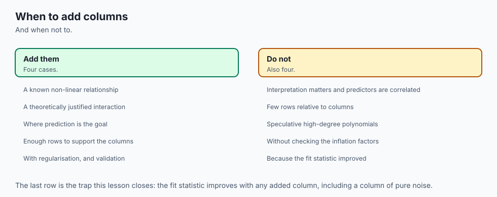

**Use multiple regression whenever you have more than one predictor and want a coefficient that accounts for the others** — which, for almost any real dataset, is almost always. The alternative — fitting each predictor separately — throws away exactly the conditioning that makes a coefficient meaningful in the first place, and Day 148's simple-regression machinery is not equipped to answer "holding the rest constant" questions at all.

**Compute variance inflation factors before trusting any individual coefficient, every time, as a matter of habit rather than as a response to a specific worry.** It costs a fraction of a second on any dataset small enough to fit a linear model to. A VIF above 5 — the widely used rule of thumb, though not a strict boundary — is the signal to stop reading that coefficient's size or sign as meaningful on its own, regardless of how good the model's overall predictions look.

**Use polynomial and interaction terms when you have reason to expect a curved relationship or a genuine dependency between two predictors' effects — not by default, and not as a way to "improve R-squared."** This lesson's R2-never-decreases result means R-squared will climb from adding *any* columns, including pure noise; a rising R-squared after adding polynomial terms is not, by itself, evidence that the curve is real. Interpret the added terms' coefficients with the same VIF discipline as any other predictor, because polynomial expansions manufacture new correlated columns almost automatically.

**Do not read an unstable coefficient as evidence the model is broken.** A high VIF and a wobbly coefficient can coexist with excellent, completely trustworthy predictions — this lesson measured both at once, repeatedly. The failure is specifically in *interpretation*, not in *prediction*. If your use case only needs predictions, multicollinearity is frequently a non-issue; if it needs to explain, attribute, or justify based on a coefficient, it is close to disqualifying until addressed.

**When you do not need any of this:** a model with a single predictor has no multicollinearity to speak of, by definition — there is nothing else to be correlated with. And a model built purely to predict, with no requirement that any individual coefficient be interpretable or reported to anyone, can often tolerate high VIFs indefinitely, provided the goal genuinely never shifts toward explanation. That condition is rarer in practice than people assume, which is why the VIF check earns its place as a habit rather than a special-occasion tool.

### The AI thread

Everything measured in this lesson becomes more consequential, not less, once "coefficient" is replaced with the broader category of things people call "explanations" in modern AI systems.

**Feature attributions inherit this exact failure mode.** SHAP values, integrated gradients, attention weights read as importance scores, linear probes trained on a frozen embedding — every one of these methods is, underneath, doing something structurally similar to reading a regression coefficient: assigning credit for an output among a set of inputs that are frequently correlated with each other.

Two input tokens, two overlapping features, two redundant channels in a representation: the same arbitrary-split behavior this lesson measured with an exact-duplicate column is not a peculiarity of linear regression. It is a property of any credit-assignment scheme applied to correlated inputs, and linear regression is simply the setting where you can prove it with a closed-form computation rather than take it on faith.

**Ablation studies inherit the R-squared-never-decreases trap in a mirrored form.** Removing a feature and watching accuracy drop is often read as proof the feature mattered. This lesson's noise-column experiment shows the complementary danger: *adding* a feature and watching a training-set metric improve is not proof the feature is meaningful, because the metric is structurally incapable of penalizing uselessness on the data it was fit to. The AI-era version of the same trap is an ablation reported only on training or validation data the model has already influenced, rather than a genuinely held-out test — Day 144's whole subject, reappearing here from a different angle.

**And the honest response, in both settings, is the same one this lesson has repeated at every turn: check the correlation structure before trusting the attribution.** Before believing that one feature, one input token, or one embedding dimension "drove" a prediction, ask whether it was standing next to something that could just as easily have taken the credit. The VIF computation in this lesson is not merely a regression diagnostic — it is a template for the question any credit-assignment method, on any model, needs answered before its output is treated as a fact about the world rather than an artifact of how the correlated inputs happened to be split.

## The AI connection

- **Adding features is how a linear model represents curvature**, which is the same idea as a
  kernel and as a hidden layer.
- **Multicollinearity destabilises coefficients without hurting predictions**, and conflating
  those two questions is a common and consequential error.
- **Interpretation and prediction are different goals** with different requirements, and a
  model can be excellent at one and useless for the other.
- **Polynomial expansion overfits quickly**, which makes it the clearest small-scale
  demonstration of the capacity trade.
- **The same distinction governs feature importance in AI systems**, where a stable
  prediction can rest on unstable attributions.

## Knowledge check

1. Duplicating a predictor exactly splits its `-1.09` coefficient into two coefficients of `-0.545` each, while R-squared and every prediction stay unchanged to more than ten decimal places. Explain why the split is even in this specific case, and why that evenness is not something you should expect from correlated-but-not-identical predictors.
2. Breaking the exact duplicate with one percent of noise sends one coefficient from `-1.09` to `+0.76` at one seed and to `-5.61` at another. Explain, in terms of what the normal equations can and cannot distinguish, why such a small perturbation produces such a large swing.
3. A predictor has a variance inflation factor of `59.2025`. Compute the R-squared of the auxiliary regression that produced it, and state in one sentence what that R-squared means about the predictor.
4. `s1`'s simple-regression coefficient is `+0.4723` and its multiple-regression coefficient, alongside nine other predictors including its 0.8967-correlated partner `s2`, is `-1.09`. Explain why both numbers are correct answers to different questions, rather than one being a mistake.
5. R-squared rises from `0.5177` to `0.5325` as ten columns of pure random noise are added to a ten-predictor model. State the mechanical reason ordinary least squares guarantees this can never go the other way.
6. `PolynomialFeatures(degree=2)` plus `LinearRegression`, and a direct `numpy.linalg.lstsq` solve on the identical expanded design matrix, agree to thirteen decimal places. Explain what this proves about the claim "a polynomial fit is linear in its parameters."
7. Standardizing every predictor changes `s1`'s coefficient from `-1.09` to `-37.68` while leaving R-squared and every prediction unchanged to eleven decimal places. Explain what standardizing changed and what it did not, and why both are true simultaneously.
8. A model's R-squared and predictions look excellent, but a coefficient of interest has a bootstrap coefficient of variation above 0.5. Explain what conclusion is and is not justified by that observation.

## Hands-on exercise

Today's lab, `Many Predictors, One Model`, measures every claim above on `sklearn.datasets.load_diabetes(scaled=False)`: ten real clinical predictors in their raw units, one target, no download required beyond the one `pip install`.

Twelve exercises. The first two compute variance inflation factors and confirm the correlation structure directly. The next four build the duplicate-column centrepiece — exact, then noisy, then the ten-seed spread, then the bootstrap link to VIF. The next builds the real sign flip on `s1`. The next two prove the polynomial-mechanics identity and measure the interaction term's cost. The last two measure R-squared's inability to penalize noise and confirm scaling's invariance.

Build the environment, then work through `starter/test_regression_claims.py`, replacing one `pytest.skip` at a time.

### Expected output

The harness ends with:

```text
---------------------------------------------------------------
14 checks, 0 failure(s)
```

and exits 0. `pytest examples -q` reports `17 passed`, and
`pytest starter -q` reports `5 passed, 12 skipped` until you begin.

The measured table includes:

```text
  s1     59.2025
  bmi     1.5094
  original s1 coefficient        : -1.0900
  duplicate model, coefficient a : -0.5450
  duplicate model, coefficient b : -0.5450
  R2 with 'bmi bp' term   : 0.404170
  R2 without it           : 0.399896
  rows needed for +/-0.02 at an accuracy ...  (not this lab; see Day 144)
```

### Validate your work

1. `bash tests/run_tests.sh; echo "exit=$?"` reports `14 checks, 0
   failure(s)` and `exit=0`. Capture the harness's own exit status.

2. `.venv/bin/pytest examples -q` reports `17 passed`.
3. `.venv/bin/python3 examples/report_measurements.py | diff - expected-output/measured-values.txt`
   produces no output.

4. When you have finished every exercise, `pytest starter -q` reports
   `17 passed`.

5. Break one assertion on purpose, confirm the harness fails, restore it.

### Troubleshooting

**Your noisy-duplicate coefficients don't match the lesson's.** Check which seed you used first — the individual coefficients are supposed to differ at every seed; that instability is the entire point. What must hold at any seed: both coefficients have a standard deviation above 4 across ten seeds, and their sum stays within 0.05 of the original.

**`ModuleNotFoundError: No module named 'pandas'`.** `load_diabetes(as_frame=True)` needs pandas, which is not one of this lab's three pinned dependencies. Every function in `regression_lib.py` calls `load_diabetes(scaled=False)` without `as_frame`, returning plain NumPy arrays.

**A variance inflation factor prints as `inf`.** Correct behaviour if you have duplicated a column — a predictor perfectly explained by the others has an undefined VIF by the formula's own arithmetic. None of the ten original diabetes predictors triggers this.

**`import file mismatch`.** You ran `pytest examples starter` together. Run them separately.

### Common mistakes

**Reporting the duplicate-column coefficients without the sum.** The sum, not either individual coefficient, is the quantity the normal equations actually determined — reporting only the unstable halves is reporting half the finding.

**Calling a polynomial fit "nonlinear regression."** It is linear in its parameters; the curve lives in the relationship between the original predictor and the prediction, not in the fitting procedure.

**Treating a rising R-squared after adding predictors as evidence those predictors matter.** R-squared cannot decrease on the training data no matter what is added, including pure noise — this lesson measured exactly that.

**Concluding "scaling doesn't matter" from the scaling exercise.** It matters enormously for regularized estimators and gradient-descent convergence; the invariance measured here is specific to ordinary least squares.

## Practice assignment

Take a multiple regression you already have, or fit one on data you understand, and audit its coefficients the way this lesson audited `s1`.

1. **Compute variance inflation factors for every predictor.** Flag anything above 5, and identify which other predictors it overlaps with.
2. **Find your highest-VIF predictor's simple-regression coefficient**, fit alone, and compare it to its multiple-regression coefficient. Report whether the sign changed and, if it did, name the correlated partner most likely responsible.
3. **Bootstrap the coefficients** for your two or three most important-looking predictors, and report each one's coefficient of variation. Flag any predictor whose bootstrap range crosses zero.
4. **If your design matrix includes any polynomial or interaction terms, compute their VIFs too** — they are exactly as susceptible to redundancy as the original predictors, and often more so.
5. **Write one paragraph distinguishing what you can and cannot claim** from this model's coefficients, separately from what you can claim about its predictions.

The deliverable is the audit, not a better model.

## Extension challenge

Pick one and measure it.

1. **Ridge, applied by hand.** Add a small `alpha * I` term to the normal equations' `X^T X` before solving, refit the noisy-duplicate case, and measure whether the coefficient swings shrink.
2. **VIF against statsmodels.** Install `statsmodels` in a throwaway environment and compare its `variance_inflation_factor` against this lab's direct computation on the same ten columns.
3. **A three-way duplicate.** Append two additional copies of `s1` instead of one, and measure how much more unstable the three-way split becomes compared with the two-way case.
4. **Adjusted R2, by hand.** Implement the adjusted-R2 formula and confirm it can decrease when a noise column is added, even though ordinary R2 cannot.
5. **A constructed sign flip.** Use `sklearn.datasets.make_regression` with a deliberately correlated confounder to build a sign flip from scratch, rather than finding one in real data as this lesson does.
6. **Interaction terms beyond two predictors.** Extend the interaction-term measurement to three predictors and report how much of the R2 gain comes from pairwise interactions versus quadratic terms alone.
