## Why this matters

Add a hundred columns of pure noise to a linear model — numbers with
exactly zero relationship to the target, drawn from a random generator
that never looks at the data — and watch its training score climb:

```text
  noise columns added   train R2
                    0     0.5554
                    1     0.5555
                    5     0.5648
                   20     0.5754
                  100     0.7403
```

Every one of those hundred columns is garbage. Not "weak" or "noisy in a
useful way" — literally independent random draws, unrelated to the target
by construction. And the model's R-squared, the number most people learn
to read as "percent of variance explained," rose by nineteen points
anyway, from 0.5554 to 0.7403.

Nobody cheated. No label leaked. The columns are exactly what they claim
to be: noise. What happened is that a training-set R-squared is not a
measure of how good a model is. It is a measure of how well the model's
parameters were chosen to fit the exact rows it was shown, and more
parameters can always fit those exact rows at least as well as fewer —
never worse. This is not a quirk of this dataset. It is a property of
ordinary least squares, and it holds for any noise columns, on any data,
at any seed.

Here is the second surprise, and it is the one most people have never
seen measured. A model can score *below zero* on R-squared:

```text
  full 10-feature model, test R2       : 0.3594
  constant-mean predictor, test R2     : -0.0001
  deliberately bad (all-zeros), test R2: -4.7009
```

Most people believe R-squared lives between 0 and 1. Both halves of that
belief are wrong. A model can score below zero — a genuinely bad
predictor here scored **-4.7009**, nearly five full units below the floor
most people assume exists — and there is no lower limit at all. R-squared
does not measure "percent of anything." It measures one specific
comparison: your model's errors against a baseline that always predicts
the mean. Beat that baseline and you are positive. Lose to it — badly —
and there is nothing stopping the number from falling as far as your model
is bad.

Day 143 already made this kind of point once, on the classification side:
a majority-class baseline scored 0.92 accuracy while learning nothing at
all, and accuracy and recall shipped two different models on the same
imbalanced problem. That was metric-first thinking for classification. Today is the regression counterpart, and it is a genuinely different set
of traps — not because regression is harder, but because the metrics
themselves behave differently.

Accuracy is bounded between 0 and 1 by
definition. R-squared is not bounded below at all. RMSE and MAE can rank
two models in opposite directions on the *same* residuals, which this
lesson measures directly, in a way that maps exactly onto Day 143's
accuracy-versus-recall inversion but arrives by an entirely different
mechanism.

Day 149 drew the line that makes sense of all of this: a **loss** is what
an algorithm optimises while fitting — squared error, in ordinary least
squares. A **metric** is what you report afterward, to someone who was not
in the room while the model was being fit, to answer the question "how
good is this, really." Nothing requires the two to be the same function,
and today's whole subject is the reporting side: RMSE, MAE, MAPE,
R-squared, and adjusted R-squared — what each one means, what unit it
carries, what it hides, and which one is the wrong thing to quote for a
given question.

## The idea in plain language

Imagine you have finished baking and you want to know how good the cake
is. You could weigh how close the finished cake came to the recipe's exact
gram measurements — that is one kind of "how good." You could ask a
panel how it tastes on a percentage scale against the best cake anyone
has ever had — that is a different kind. You could ask what percentage of
tasters preferred it to a plain, unseasoned version — a third kind again.
All three are legitimate answers to "how good is this cake," and they can
disagree, because they are measuring different things.

A regression metric is exactly that kind of choice. You have a model that
predicts a number — a price, a duration, a measurement — and a set of
actual values it did not get to see while training. There are several
honest, standard ways to summarise "how wrong was it, across all those
predictions," and this lesson covers the five that come up constantly:
**RMSE** and **MAE**, which report the size of the typical mistake in the
target's own units; **MAPE**, which reports that mistake as a percentage;
and **R-squared** and **adjusted R-squared**, which report a comparison
against a baseline rather than a raw error size.

None of the five is "the correct one." Each answers a different question,
and — this is the part that catches people out — **they can disagree about
which model is better**, on the exact same predictions, for reasons that
are not a bug in either metric. Today's lab constructs two models where
this actually happens: one makes many small, consistent mistakes; the
other is right almost everywhere and badly wrong a handful of times. RMSE
prefers the first. MAE prefers the second. Both preferences are correct,
about different things, and picking the metric before you have asked what
the business actually needs is picking a winner by accident.

![Diagram: five cards in a row, one per metric -- RMSE, MAE, MAPE, R2 and adjusted R2 -- each fed by the same strip of residuals above them. Each card shows the metric's formula, the unit it is reported in, and a highlighted trap box naming the one failure this lesson measured for it: RMSE moved 11.39 times under one outlier while MAE moved only 3.00 times; MAPE returned 5.6e15 with no error and no warning when a true value was exactly zero; R2 scored -4.7009 for a deliberately bad predictor, which is impossible if it lived between 0 and 1; and adjusted R2 corrected the training R2 climb at a modest number of noise columns but climbed back above the baseline once the number of predictors approached the number of rows. A bottom panel gives the noise-column measurements in full, the R2 bounds measurements in full, and states that all five numbers come from the same residuals yet are not interchangeable and can rank two models in opposite orders](./assets/five-metrics-architecture.svg)

## Historical background

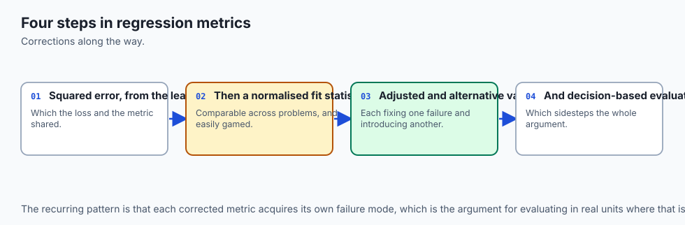

Least squares itself is old — Legendre published the method in 1805 and
Gauss claimed to have used it since 1795, both fitting astronomical orbit
data, and the argument between them over priority is one of the oldest
disputes in the history of statistics. But *least squares as a loss to
optimise* and *R-squared as a metric to report* are historically distinct
ideas that arrived separately and got tangled together in how they are
taught.

**Sir Francis Galton** introduced the correlation coefficient in the
1880s while studying how children's heights related to their parents' —
the same work that gave regression its name, from the "regression toward
mediocrity" he observed in heights across generations. **Karl Pearson**
formalised the correlation coefficient mathematically in the 1890s, and
R-squared, the square of that correlation in the simple one-predictor
case, followed from it directly. R-squared as a general measure of fit
for a *multiple*-regression model — with more than one predictor — was
developed and popularised through the early twentieth century, notably in
work by **Sewall Wright** on path analysis in the 1920s, extending
correlation-based reasoning to systems of several variables.

The specific problem this lesson opens with — R-squared rising simply
because more predictors were added, whether or not they earned their
place — was recognised early and named clearly. **Henri Theil**, writing
in the 1960s on regression and forecasting, is generally credited with
popularising the *adjusted* R-squared correction in its modern form,
building on earlier degrees-of-freedom corrections that had circulated in
statistical practice for decades.

The idea is straightforward in
principle: penalise R-squared by how many predictors it took to get there,
so that adding a useless column no longer looks like an improvement. What
this lesson measures — that the correction itself breaks down once the
predictor count approaches the row count — is a less commonly taught
consequence of the same formula, and it follows directly from how the
penalty term is constructed, which the next few sections work through in
full.

Mean absolute percentage error has a more recent and more contested
history. It became popular in forecasting practice — inventory planning,
demand forecasting, economic projections — through the 1970s and 1980s
precisely because a percentage is easy to communicate to a
non-specialist: "we were off by 8 percent" needs no context about the
underlying scale. **J. Scott Armstrong**, a prominent forecasting
researcher, was an early and vocal critic of MAPE's asymmetry problems
in exactly this period, and the debate about MAPE's flaws versus its
communicability has continued in the forecasting literature ever since,
including proposals for symmetric variants meant to fix the specific
asymmetry this lesson measures directly.

## What it is — and what it is not

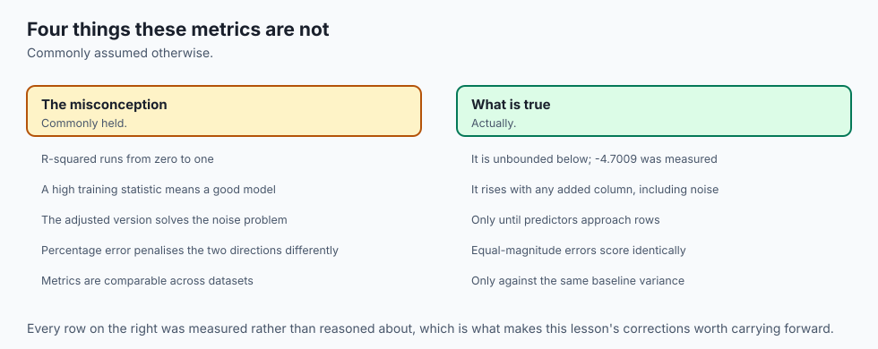

**A regression metric is a summary of the residuals** — the differences
between what the model predicted and what actually happened — computed
after fitting is complete. That is the whole category. Everything below
is one specific way of summarising that same list of numbers.

Here is what each of the five metrics in this lesson actually is.

**RMSE** (root mean squared error) squares every residual, averages the
squares, and takes the square root to bring the result back into the
target's own units. Squaring means a large error contributes far more
than a small one — an error twice as large contributes four times as
much to the sum being averaged.

**MAE** (mean absolute error) takes the absolute value of every residual
and averages it directly. No squaring, so every error contributes to the
average in exact proportion to its size — an error twice as large
contributes exactly twice as much.

**MAPE** (mean absolute percentage error) divides each absolute residual
by the corresponding true value before averaging, and reports the result
as a percentage. It answers "how far off, relative to the size of what
we were predicting" rather than "how far off, in absolute terms."

**R-squared** compares your model's total squared error against the total
squared error of one specific baseline — a model that ignores every
predictor and always guesses the training mean. It reports what fraction
of that baseline's error your model eliminated.

**Adjusted R-squared** takes R-squared and applies a correction based on
how many predictors were used relative to how many rows of data were
available, so that adding predictors is no longer free.

Now the things a regression metric is not.

**It is not the loss the model was fit with**, even when the formula
looks identical. Ordinary least squares minimises the sum of squared
residuals on the *training* set while fitting; RMSE as a metric is
usually reported on a *test* set the model never saw. Same arithmetic
shape, different data, different purpose — one is what you optimise,
the other is what you report, and Day 149 established that distinction
is not a technicality.

**A training-set metric is not a measure of model quality.** This is the
lesson's opening measurement, restated as a rule: any metric computed on
the same rows a model was fit to will look better than it deserves,
because the fitting process was specifically choosing parameters to make
those exact rows look good. `## Examples in practice` below makes the
mechanism concrete for R-squared specifically.

**R-squared is not "percent of variance explained" in any sense that
guarantees a number between 0 and 1.** It is a specific ratio compared
against a specific baseline, and that ratio has no floor. The
"percent explained" language is a correct intuition only when your model
beats the mean-predictor baseline, which is not guaranteed.

**No single metric is "the right one."** Each of the five answers a
different question about the same residuals, and the next section works
through exactly how and why they can disagree.

## Why it was created and what problems it solves

Each of these five metrics exists because a specific limitation shows up
without it, and each limitation has a measurement in today's lab.

**RMSE and MAE solve the "which errors matter more" question**, and they
solve it in opposite directions. RMSE, by squaring, treats a few large
errors as more important than many small ones. MAE, by not squaring,
treats every error as equally important regardless of size. Today's lab
constructs the case where this matters concretely — two models, same
targets:

| Model | Error pattern | RMSE | MAE |
| --- | --- | --- | --- |
| A | many small, consistent errors | 1.947 | 1.586 |
| B | right on 95 rows, badly wrong on 5 | 4.4353 | 0.8417 |

RMSE says Model A is better. MAE says Model B is better. **Both are
correct, about different things.** RMSE is dominated by Model B's five
bad rows, because each one is squared before it enters the average — a
handful of large mistakes can overwhelm a much larger number of small
ones.

MAE is dominated by the ninety-five rows Model B gets almost
exactly right, because nothing is squared and the typical case sets the
average. Reporting only one of the two metrics silently picks a winner
the other metric disagrees with, and neither number by itself tells you
which choice is right — that depends on whether an occasional large
error is more costly to whoever uses the model than being typically a
little bit off.

**RMSE and MAE also disagree about how much a single outlier should
matter**, which is the same squaring mechanism from a different angle.
Take fifty ordinary predictions, then move one true value 200 units away
from the rest without changing any prediction:

```text
  before: RMSE 2.4801  MAE 1.9833
  after : RMSE 28.2569  MAE 5.9448  (one target moved +200)
  RMSE moved by a factor of 11.39
  MAE moved by a factor of 3.00
```

RMSE moved nearly four times as much as MAE did, on the exact same
change to the exact same data. Day 149 measured a version of this on the
*loss* side — how much an outlier distorts the fitted line itself, under
squared-error loss versus Huber loss. This is the same mechanism, but the
question is different: not "which line gets fit" but "how alarmed should
the number you report make you." An RMSE that jumped 11 times over is not
telling you the model got 11 times worse everywhere — it is telling you
one row went very wrong, and RMSE is specifically built to shout about
that.

**MAPE solves the "is this error large or small, relative to what we were
predicting" question** — and it solves it well only when every true value
is safely away from zero. Divide by a true value of exactly zero and here
is what actually happens:

```text
  MAPE with one true value exactly zero      : 5.6295e+15
```

Not an exception. Not a warning. `sklearn.metrics.
mean_absolute_percentage_error` floors the zero denominator at machine
epsilon rather than raising, and the result is a number roughly fourteen
orders of magnitude too large to mean anything — and nothing in the call
signals that it is wrong. A pipeline that logs "MAPE: 5.6e15" without a
human actually reading that line will not catch this. It looks exactly
like a number.

Near-zero true values are almost as bad, without needing an actual zero:

```text
  MAPE with a true value of 0.5 in the mix   : 3.3667  (MAE on the same rows: 5.0000)
```

MAPE reports 336.67 percent on those three rows. MAE, on the exact same
rows, reports a believable 5.0 units of error. One true value is 0.5, and
a five-unit miss on a true value of 0.5 is a factor of ten — MAPE reports
that honestly, but "336.67 percent error" is not a number most
stakeholders can use, even though it is arithmetically correct.

MAPE has a further, structural problem worth being precise about, because
the folklore version of this claim is looser than what actually holds.
The commonly repeated line is "MAPE penalises over-prediction and
under-prediction differently." Tested directly on equal-magnitude errors
applied to a fixed true value — moving a prediction the same absolute
distance above and below the truth — **MAPE comes out identical in both
directions**, because its denominator is always the true value regardless
of which way the error points. That folklore version does not survive
being checked. What *does* hold, and holds by the metric's own
construction rather than by any property of a particular dataset, is
narrower and still important:

```text
  MAPE of the worst possible under-prediction: 1.0000
  MAPE of an eleven-times over-prediction    : 10.0000
```

The worst possible systematic under-prediction — always guessing zero —
cannot score worse than 100 percent MAPE, because the error can never
exceed the true value once the prediction floor of zero is reached.
Over-prediction has no such ceiling: predicting eleven times the truth
scores 1000 percent, and there is no larger multiple that would not score
correspondingly larger. **Being wrong in one direction is capped. Being
wrong in the other is not.** That is the real, verified asymmetry — not
that equal-size errors are scored unequally, but that the two directions
of "very wrong" are not measured on the same scale.

**R-squared and adjusted R-squared solve the "compared to what" question.**
A raw error number — "RMSE was 56" — tells you nothing until you know
whether 56 is good or bad for this target's scale. R-squared answers that
by comparing your model against one specific, always-available baseline:
guessing the mean. Adjusted R-squared then tries to solve a second-order
problem — that R-squared, as the opening measurement showed, climbs
mechanically as you add predictors, whether or not those predictors are
useful — by penalising the score for how many predictors were used. It
works, up to a point, and where that point is is the subject of the next
section.

## How it works

### R-squared, precisely

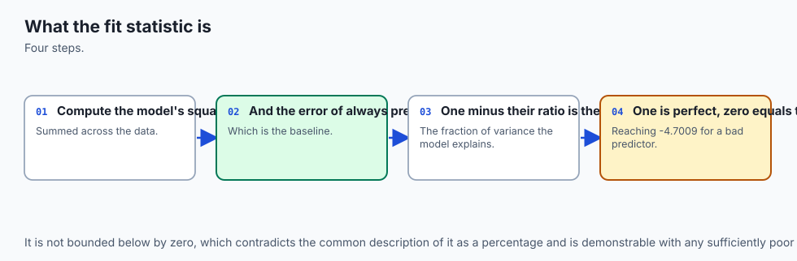

R-squared compares two quantities: your model's total squared error, and
the total squared error of a model that always predicts the training
mean.

```text
R2 = 1 - (sum of (y_true - y_pred)^2) / (sum of (y_true - mean(y_true))^2)
```

The denominator — the mean-predictor's total squared error — is fixed
once you know the data; it does not depend on your model at all. The
numerator is your model's total squared error. If your model's errors sum
to less than the mean-predictor's, the ratio is less than 1, and R2 is
positive: you beat the baseline, and R2 tells you by how large a
fraction.

If your model's errors sum to *more* than the mean-predictor's
— if you did *worse* than always guessing the average — the ratio exceeds
1, and R2 is negative. There is no floor on how bad the ratio can get,
because there is no floor on how bad your model's total squared error can
be relative to the baseline's.

This is exactly what today's lab measures directly:

```text
  full 10-feature model, test R2       : 0.3594
  constant-mean predictor, test R2     : -0.0001
  deliberately bad (all-zeros), test R2: -4.7009
```

The constant-mean predictor scores R2 of essentially exactly zero on
fresh test data — not by luck, but *by construction*, because R2 is
defined relative to exactly that predictor. It is the reference point,
not an incidental fact about this dataset. And the deliberately bad
all-zeros predictor — a genuinely useless model on a target running 25
to 346 — scores -4.7009, which is what "much worse than guessing the
mean" looks like on this scale.

### Why training R2 climbs on noise, precisely

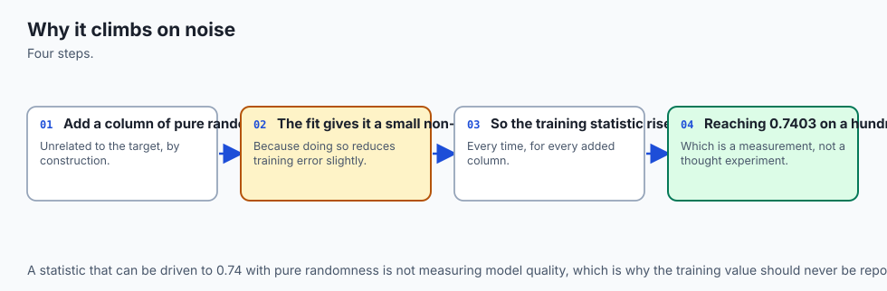

Ordinary least squares picks the coefficients that minimise the sum of
squared residuals *on the exact rows it is fit to*. Adding a predictor
column — any column, including one that is pure noise — gives the fitting
procedure one more coefficient to adjust. The old solution, which simply
set that new coefficient to zero and ignored the column, is still
reachable. So the best the fitting procedure can find with the extra
column is *at least as good* as the best it could find without it, on the
training data specifically. It can never be worse.

That is the whole mechanism, and it is a guarantee, not a tendency:

```text
  n_noise   n_rows   n_predictors   train_r2   adjusted_r2
        0      331             10   0.5554     0.5415
        1      331             11   0.5555     0.5402
        5      331             15   0.5648     0.5441
       20      331             30   0.5754     0.5329
      100      331            110   0.7403     0.6104
```

The `train_r2` column is strictly increasing, at every step, on columns
that carry no relationship to the target whatsoever. This is why a
training-set score can never, by itself, be evidence a model has
improved — it is guaranteed to look at least as good with more
predictors, whether or not any of them earned their place.

### Adjusted R2, and where its correction breaks down

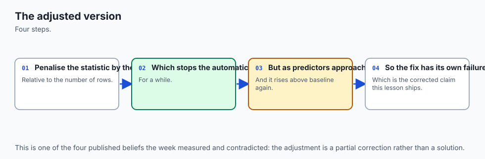

Adjusted R2 penalises R2 by a factor that grows with the number of
predictors `p` relative to the number of rows `n`:

```text
adjusted_R2 = 1 - (1 - R2) * (n - 1) / (n - p - 1)
```

Look at the `adjusted_r2` column above and it does exactly what it is
built to do, at first: going from 0 to 20 noise columns, adjusted R2
*falls*, from 0.5415 to 0.5329, correctly reporting that those twenty
columns did not earn their place even though plain R2 rose. That is the
correction working.

Then look at 100 noise columns. Adjusted R2 is 0.6104 — *higher* than the
0.5415 baseline, and higher than the 0.5329 it reported at 20 columns —
even though every one of those hundred columns is still exactly the same
kind of useless noise. The correction has broken down.

The mechanism is visible directly in the formula. At 100 noise columns,
`p` is 110 (the ten real features plus the hundred noise columns) and `n`
is 331 training rows — a third of the available data has been spent on
predictors. The term `(n - 1) / (n - p - 1)` is `330 / 220`, about 1.5,
which is a large multiplier on `(1 - R2)`.

As `p` climbs toward `n`, this
denominator shrinks toward zero and the whole penalty term explodes,
becoming numerically unstable in a way that can push adjusted R2 in
either direction — including, as measured here, back above where it
started. **The correction is not a cure for the climb it was built to
catch; it has its own failure mode, and that failure mode is exactly
where you would most want the correction to still be working: many
predictors, not much data.**

The practical rule that follows is not "never trust adjusted R2." It is
"adjusted R2 is trustworthy only while `p` stays a small fraction of
`n`," and once a model has as many predictors as it has rows-to-spare,
no automatic correction — this one included — substitutes for actually
counting how many predictors you have relative to how much data.

### RMSE and MAE, precisely

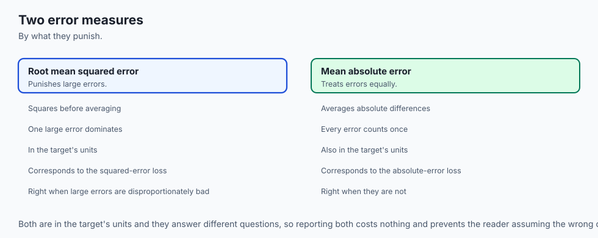

```text
RMSE = sqrt(mean((y_true - y_pred)^2))
MAE  = mean(|y_true - y_pred|)
```

Both are in the target's own units, because both undo whatever
transformation they applied — RMSE takes a square root to cancel the
squaring, and MAE never squares in the first place. This is worth
dwelling on because it is the practical reason to prefer either of these
over a percentage-based metric when you can: **a stakeholder who knows the
target's scale can immediately judge whether an RMSE of 56 is good or bad,
because 56 is a number in a unit they already understand.**

The one mathematical fact worth having memorised: **RMSE is never smaller
than MAE**, for any set of residuals, with equality only when every
residual has exactly the same magnitude. This follows from a standard
inequality between the quadratic mean and the arithmetic mean of a set of
non-negative numbers. It means an RMSE substantially larger than MAE on
the same data is itself informative — it tells you the residuals are not
uniform in size, that some rows are much worse than others, before you
have looked at a single one.

![Diagram: a flow diagram in which fifty residuals, one of them moved 200 units away from the rest, split into two paths. One path squares each error before averaging and taking a square root, which is RMSE. The other path takes the absolute value of each error before averaging, which is MAE. A token travels each path to represent the one large error; on the squaring path it grows enormous by the time it reaches the end, and on the absolute-value path it grows only in proportion to its size. Bars beside each path show RMSE moving from 2.4801 before the outlier to 28.2569 after, a factor of 11.39, while MAE moves from 1.9833 to 5.9448, a factor of 3.00, on the exact same fifty predictions with the exact same one target shifted. A caption states that RMSE squares that one row's error before averaging while MAE never squares anything, and that with motion switched off both bar heights and both printed numbers are already in their final position](./assets/outlier-metric-flow.svg)

### MAPE, precisely, and where it fails

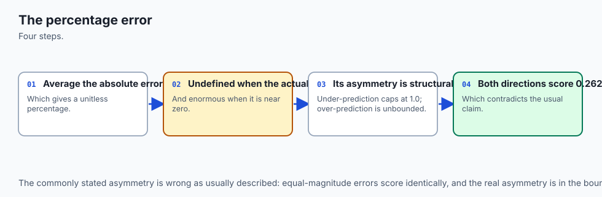

```text
MAPE = mean(|y_true - y_pred| / |y_true|) * 100
```

The failure mode is visible directly in the formula: `y_true` is in the
denominator. When `y_true` is zero, this is a division by zero. When
`y_true` is small, the ratio is large even for a modest absolute error.
scikit-learn's implementation does not raise on the zero case — it floors
the denominator at machine epsilon, which produces a large finite number
rather than an error, which is arguably the more dangerous choice, because
a caller who is not specifically checking for it will not notice.

The structural asymmetry follows from the same formula, applied to the
achievable range of predictions rather than to any specific dataset. Assume predictions cannot go below zero, which holds for most real
targets — a price, a duration, a count. The largest possible
under-prediction is predicting zero, whatever the true value, which gives
`|y_true - 0| / |y_true|` — exactly 1, or 100 percent, regardless of how
large `y_true` is.

There is no way to under-predict worse than that. But
over-prediction has no matching ceiling: predicting ten times the truth
gives 900 percent; predicting a hundred times the truth gives 9900
percent; the ratio grows without bound as the prediction grows. **The
metric's own denominator guarantees this asymmetry — it is not a property
of any particular dataset, it is a property of the formula.**

## An everyday analogy

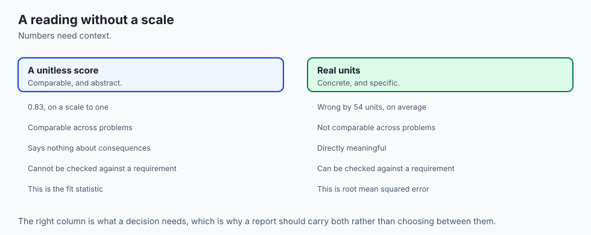

A tailor measuring how well a suit fits.

**RMSE** is the tailor who is especially bothered by one badly-fitting
seam. Ten small adjustments needed across the jacket barely register, but
one sleeve two inches too short dominates the tailor's whole assessment of
the fit — squaring the size of each gap, the way RMSE squares each
residual, means the one large gap counts disproportionately more than all
the small ones combined.

**MAE** is the tailor who tallies every adjustment equally, however large
or small. Ten small nudges and one large one contribute in exact
proportion to their size, no more, no less — nothing about a mistake's
size is amplified beyond what it actually is.

**MAPE** is the tailor who reports every gap as a percentage of the
garment part it is on — "the collar is off by 3 percent, the sleeve by 40
percent" — which is genuinely more informative when comparing a large
garment part to a small one, until a garment part shrinks toward
nothing. Report a gap as a percentage of a buttonhole and a millimetre of
error becomes "50 percent off," a number that is technically correct and
practically useless — the same collapse MAPE has near a true value of
zero.

**R-squared** is a tailor who does not report raw measurements at all,
but only how much better the fit is than an off-the-rack suit bought
without any measurements taken — a "baseline" suit that assumes an
average build. If the tailored suit fits far better than that baseline,
the score is strongly positive. If, somehow, the tailoring is *worse*
than just grabbing an average-sized suit off the rack — a real
possibility if the tailor guessed badly — the score goes negative, and
there is no floor on how negative a genuinely bad guess can score.

**Adjusted R-squared** is the same tailor, except now docked a little
credit for every extra measurement taken, on the reasoning that more
measurements should only help if they are used well. Take twenty
sensible measurements and use them well, and the deduction is small
relative to the improvement. Take a hundred pointless measurements — the
customer's shoe size, their favourite colour, their commute time — and
even though nothing about the fit could possibly have gotten worse from
knowing them, the deduction eventually stops keeping pace: once nearly as
many measurements have been taken as there are customers being measured,
the correction itself starts behaving strangely, exactly as it did in
today's numbers at 100 noise columns on 331 rows.

## Examples in practice

### Reading a training R2 versus a test R2

The single most common mistake this lesson exists to prevent: reporting
an R2 computed on the same rows a model was fit to, as if it were a
measure of how the model will perform on new data.

```python
from sklearn.linear_model import LinearRegression
from sklearn.metrics import r2_score

model = LinearRegression().fit(X_train, y_train)

train_r2 = r2_score(y_train, model.predict(X_train))  # optimistic, guaranteed
test_r2 = r2_score(y_test, model.predict(X_test))      # the honest number
```

On today's dataset, `train_r2` is 0.5554 with no extra columns and climbs
mechanically as garbage columns are added. `test_r2` is 0.3594 and does
not climb with garbage columns, because a test set was never involved in
choosing the coefficients that fit it. Any time a project reports "our
model's R2 is X" without saying whether X came from training or test
data, the number is not trustworthy on its face — Day 144 covered exactly
why a held-out set is the only honest source for a number like this, and
today's measurement is the R2-specific version of that same argument.

### Choosing between RMSE and MAE for a real decision

An engineer is comparing two models for predicting delivery times.
Model A is consistently a few minutes off on every delivery. Model B is
almost always right to the minute, but roughly once a week predicts an
arrival hours early or late because of an edge case in its logic.

RMSE will report Model B as substantially worse, because that
handful of hour-scale misses dominates the squared-error sum. MAE will
report Model B as substantially better, because the vast majority of its
predictions are excellent.

**Which metric to trust depends on what the business does with a bad
prediction.** If a customer who is told "arriving in 10 minutes" and
instead waits three hours will churn regardless of how rare that is,
RMSE's alarm about Model B is the one to listen to. If the business
already tolerates occasional bad predictions and cares most about the
typical experience, MAE's preference for Model B is the more useful
number. Neither metric is "wrong" — the mistake would be picking one
without asking this question first.

### Reporting a metric with its unit, or admitting there isn't one

```python
from sklearn.metrics import mean_squared_error, mean_absolute_error
import numpy as np

rmse = float(np.sqrt(mean_squared_error(y_test, pred)))  # 56.3929
mae = float(mean_absolute_error(y_test, pred))            # 45.1206
```

A number without a stated unit is not yet a finished report. On the
diabetes dataset used throughout this lesson, the target is described in
scikit-learn's own documentation as "a quantitative measure of disease
progression one year after baseline" — a composite index running from 25
to 346, with no physical unit such as milligrams per decilitre attached
to it.

The honest thing to say about an MAE of 45.12 on this target is
"the model's typical prediction is off by about 45 points on a scale that
runs from 25 to 346" — not a fabricated real-world unit the dataset's own
documentation does not provide. On a target that *does* have a real unit
— dollars, seconds, kilograms — state that unit explicitly. A metric you
cannot state a unit for is a metric you have not finished explaining.

### The r2_score argument-order bug

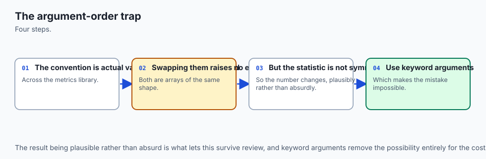

```python
from sklearn.metrics import r2_score

r2_score(y_test, pred)   # 0.359409 -- correct order
r2_score(pred, y_test)   # -0.209635 -- arguments swapped
```

This looks like a typo that could not possibly matter, and it matters a
great deal. `r2_score`'s denominator is the variance of whichever array
is treated as "true" — whichever one is passed *first* — so swapping the
two arguments computes a genuinely different quantity, not the same
quantity read backwards. On this exact data, the correct call reports a
usable model; the swapped call reports a model worse than guessing the
mean, for the identical predictions.

The defence is not "be careful" —
that fails eventually on any team. It is to prefer keyword arguments
(`r2_score(y_true=y_test, y_pred=pred)`) wherever the order is not obvious
from the call site, and to cross-check a computed R2 against a second,
independent source — `model.score(X_test, y_test)` agrees with the
correctly-ordered call to six decimal places on this data, which is
exactly the kind of independent check that would have caught the swap.

## Implications: security, privacy, performance, scalability, and cost

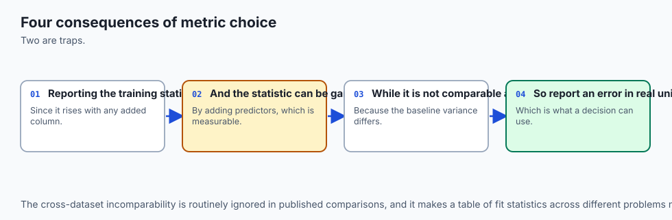

**A metric reported without its context is a number that invites
misuse.** "Our model has an R2 of 0.85" means nothing without knowing
whether it is training or test R2, and "our MAPE is 8 percent" means
nothing without knowing whether any target value was close to zero. Both
omissions are common in real reporting, and both can make a genuinely
mediocre model look production-ready to a reader who trusts the headline
number.

**The argument-order bug in `r2_score` is a specific instance of a
general class of security- and correctness-relevant mistakes**: a
function call that succeeds, returns a plausible-looking value, and is
wrong because two arguments were passed in the wrong positions. The same
shape appears in access-control checks called as `(resource, subject)`
instead of `(subject, resource)`, in comparison functions, and in
signature-verification calls. The defence — keyword arguments where order
is not obvious, and a second independent check — transfers directly.

**Choosing the wrong metric has a cost that shows up only after
deployment.** A model selected because it minimised MAE, deployed into a
context where occasional large errors are unacceptable — a dosage
calculation, a structural-load estimate — has been optimised for the
wrong failure mode, and the mismatch will not appear in offline testing
if the same metric is used for both selection and reporting. This is
purely a cost of asking the wrong question early, and it is free to avoid:
compute both RMSE and MAE, always, and decide which one governs the
decision before comparing models, not after.

**MAPE's silent failure at a zero or near-zero true value is an
operational risk in any automated pipeline that logs it unattended.** A
model-monitoring system that alerts on "MAPE exceeded threshold" will
either fire constant false alarms on a target that legitimately passes
through zero (returns, refunds, net positions) or, worse, silently report
an enormous, meaningless number that a dashboard displays without
comment. Either failure is avoidable by checking for near-zero true
values before computing MAPE, or by preferring MAE or a scaled error
metric on any target that can be zero or near it.

**Computing five metrics instead of one costs nothing meaningful.**
Every metric in this lesson is a single pass over the same array of
residuals — on a laptop-scale problem, computing all five takes
milliseconds. There is no performance argument for reporting only one;
the only reason to report only one is a deliberate decision about what
the audience needs to see, which should be a communication choice, not a
computational shortcut.

## Alternatives: free, open source, and commercial

### scikit-learn's `sklearn.metrics` — used here

**When to choose it:** for essentially all in-memory regression work.
Free, BSD-3-Clause licensed, no paid tier. Every measurement in this
lesson uses it directly.

**How to use it:** every metric function takes `(y_true, y_pred)` in that
order and returns a float:

```python
from sklearn.metrics import (
    mean_squared_error,
    mean_absolute_error,
    mean_absolute_percentage_error,
    r2_score,
)

rmse = mean_squared_error(y_true, y_pred, squared=False)  # or sqrt() the MSE
mae = mean_absolute_error(y_true, y_pred)
mape = mean_absolute_percentage_error(y_true, y_pred)
r2 = r2_score(y_true, y_pred)
```

**Watch for:** the argument order matters for `r2_score` and every other
function here, as measured directly above. There is no built-in
`adjusted_r2_score` in scikit-learn as of this writing — it must be
computed from `r2_score`, `n` and `p` by hand, exactly as this lesson's
lab does.

### statsmodels — described, not run here

**When to choose it:** for classical statistical regression output —
p-values, confidence intervals on coefficients, and adjusted R-squared
reported automatically as part of a model summary — rather than
scikit-learn's prediction-first API. Free, BSD-3-Clause licensed.

**What it costs:** nothing financially; the cost is a different mental
model from scikit-learn's `.fit()`/`.predict()` pattern, closer to R's
formula-based regression syntax.

**Honest note:** statsmodels is not installed in this lesson's lab
environment, and no output from it is reproduced anywhere in this lesson.
It is described here from its public documentation because it is the
standard free tool for a report that needs coefficient-level statistical
inference alongside the model-level metrics this lesson covers.

### Symmetric MAPE and other MAPE variants — described, not run here

**When to choose them:** when MAPE's specific failure modes measured in
this lesson — the zero-denominator explosion and the asymmetry between
over- and under-prediction — make it unsuitable, but a percentage-style
metric is still wanted for communication reasons. Symmetric MAPE
(sMAPE) divides by the average of the true and predicted values instead
of the true value alone, which softens but does not eliminate the
near-zero problem.

**What it costs:** nothing financially — it is a small amount of extra
code, not a paid tool. It is not implemented or measured in today's lab;
extension exercise 4 in the lab asks you to build it and test it against
this lesson's own near-zero construction.

### Commercial ML platforms with built-in metric dashboards — not used here

**Managed platforms** — the kind that log every experiment and compute a
standard slate of metrics automatically — remove the risk of a reporting
mistake like the ones measured in this lesson, by construction, because
the same code path computes every model's metrics the same way every
time. **Free versus paid:** most offer a free tier for individual use and
charge for team features; **no price is quoted here**, because these
change by month and an unchecked figure is worse than none. Open-source
self-hosted experiment-tracking tools exist and do the same core job.

## Comparison with related concepts

| Metric | What it reports | Unit | Bounded? |
| --- | --- | --- | --- |
| RMSE | typical error, large errors weighted heavily | target's own units | 0 and above, no ceiling |
| MAE | typical error, every error weighted equally | target's own units | 0 and above, no ceiling |
| MAPE | typical error as a percentage of the true value | percent | 0 and above, no ceiling; explodes near zero |
| R-squared | fraction of the mean-baseline's error eliminated | none (a ratio) | no floor; ceiling of 1.0 only for a perfect fit |
| Adjusted R-squared | R-squared, penalised for predictor count | none (a ratio) | no floor; loses reliability as predictors approach rows |

Two rows deserve a closing note.

**RMSE and MAE never disagree about the direction of a change** — if
every residual shrinks, both fall; if every residual grows, both rise.
They disagree only about *magnitude of preference* between two different
error distributions, which is exactly the ranking-inversion case measured
in this lesson. That distinction — same direction, different ranking — is
worth holding onto, because it means the disagreement is not a
contradiction, it is two different, valid weightings of the same facts.

**R-squared and adjusted R-squared are the odd ones out in this table**,
because they are the only two metrics here defined relative to a
baseline rather than as a raw error size. This is precisely why they have
no natural unit — a ratio does not carry the target's units the way RMSE
and MAE do — and precisely why R-squared can be negative in a way RMSE
and MAE, which are sums of non-negative quantities, cannot.

## When to use it — and when not to

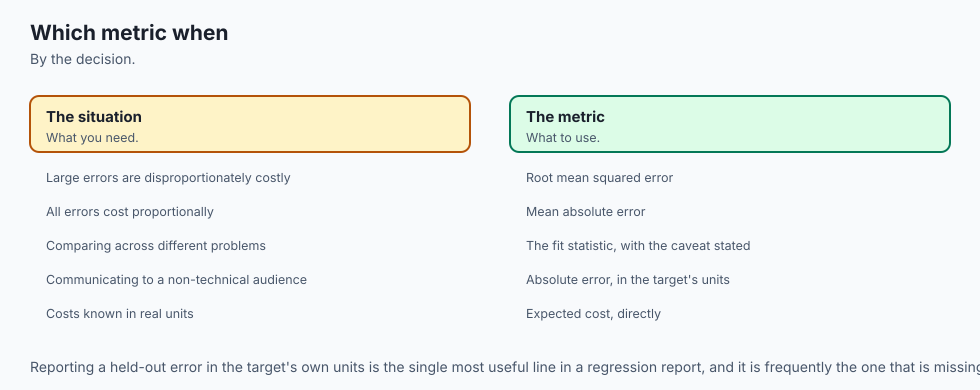

**Report RMSE when large errors are disproportionately costly**, and say
so explicitly when you do — a reader who does not know RMSE weighs large
errors more heavily may not realise a high RMSE with a modest MAE is
telling them something specific about the shape of the errors, not just
their average size.

**Report MAE when the typical case is what matters**, and especially
when you want a number a non-technical stakeholder can sanity-check
against their own intuition for "how far off is typical" — MAE's lack of
squaring makes it the more directly interpretable of the two for that
purpose.

**Consider MAPE only when every true value is safely away from zero**,
and check that condition explicitly before computing it, rather than
after seeing a suspicious number. If the target can legitimately be zero
or near it — a returns count, a net position, a temperature in Celsius
crossing zero — MAPE is the wrong metric regardless of how well the model
performs, because the metric itself is what breaks, not the model.

**Report R-squared to communicate "how much better than a naive
baseline,"** and always alongside a raw error metric — RMSE or MAE —
because R-squared alone cannot tell a reader the actual scale of the
mistakes, only the fraction of a baseline's error eliminated.

**Use adjusted R-squared to compare models with different numbers of
predictors on the same data**, and stop trusting it once the predictor
count becomes a meaningful fraction of the row count — today's
measurement puts that failure mode at p/n around one-third, and the
honest response at that point is not a better-corrected R-squared, it is
fewer predictors or more data.

**Never report a training-set metric as if it were a test-set metric.**
This is the single rule in this lesson worth memorising above all the
others, because the mechanism behind it — more predictors can only help a
training-set fit — makes a training metric mechanically optimistic in a
way no amount of care in reading it can undo. Only a metric computed on
data the model did not influence tells you anything about how it will
perform on data it has not yet seen.

### The AI thread

Every claim in this lesson gets harder to check, not easier, once the
model doing the predicting is a large language model rather than a linear
regression.

**The metric is often computed by the model itself, or by a system the
model has influence over**, which turns the argument-order bug and the
training-versus-test confusion from careless mistakes into potential
incentives. A system that is evaluated on a metric it can also affect —
through what it reports, what it selects to show a user, or what training
signal it produces for the next iteration — has a structural reason to
prefer whichever number looks best, not necessarily whichever number is
honest.

The discipline this lesson asks for on a small linear model —
state the metric, state whether it is train or test, state the unit,
cross-check against a second computation — becomes considerably more
important, not less, when the system being measured has more surface
area to get any one of those steps subtly wrong.

**"Percent improvement" claims about model quality inherit every trap
this lesson measured, at a scale where nobody re-derives them.** A vendor
or a paper reporting "R2 improved by 12 percent" is making a claim that
depends entirely on whether that R2 was measured on held-out data, how
many predictors or features were involved, and what baseline the
percentage is relative to — exactly the questions this lesson asks of a
diabetes-dataset linear model, unanswered at the scale of a
headline benchmark result.

The habit worth carrying forward is not
suspicion for its own sake — it is the concrete question this lesson
practised asking eight times over: what, precisely, is this number being
compared against, and on what data was it computed?

**And the ranking-inversion measurement generalises directly to model
selection at any scale.** Choosing between two candidate systems on a
single aggregate metric — one number, no breakdown — is exactly the
mistake this lesson's centrepiece exercise was built to make visible:
RMSE and MAE disagreed about which of two small linear models was better,
for reasons that were real and explainable rather than a bug in either
metric. The same disagreement, unexamined, is easy to hide inside a
single leaderboard score for a much larger system, where "better on
average" can mean "worse on the cases that matter most" without anyone
having chosen that trade-off on purpose.

## The AI connection

- **A metric that can be gamed by adding noise is not measuring what it appears to** — which
  is demonstrable, not theoretical.
- **Explained variance rises with any added column**, including columns of pure randomness.
- **The metric is not bounded below by zero**, and a prediction worse than the mean scores
  negative.
- **Every metric encodes an assumption about what errors cost**, whether or not anyone stated
  it.
- **AI evaluation inherits this exactly**, which is why benchmark scores need the same
  scepticism.

## Knowledge check

1. A linear model's training R-squared rises from 0.5554 to 0.7403 as
   100 columns of pure random noise are added. Explain the mechanism, and
   state whether this is evidence the model improved.

2. Adjusted R-squared falls to 0.5329 at 20 noise columns but rises to
   0.6104 at 100, on 331 rows. Explain both directions of that result.

3. A deliberately bad predictor scores R-squared of -4.7009. State
   precisely what R-squared is being compared against, and explain why
   there is no lower bound.

4. One target value is moved 200 units away from an otherwise unchanged
   set of fifty predictions. RMSE moves 11.39 times; MAE moves 3.00
   times. Explain the mechanism behind the difference in magnitude.

5. `mean_absolute_percentage_error` is called with one true value of
   exactly zero. State exactly what happens — not what "should" happen —
   and explain why that specific behaviour is more dangerous than a
   raised exception.

6. Two models are scored on the same 100 targets: Model A has RMSE 1.947
   and MAE 1.586; Model B has RMSE 4.4353 and MAE 0.8417. Which model is
   better, and what additional information would you need to answer that
   with confidence?

7. RMSE and MAE are identical whether a linear model is fit on raw-unit
   or standardised diabetes features. Explain why, and state what unit
   the resulting numbers are actually in.

8. `r2_score(y_test, pred)` and `r2_score(pred, y_test)` return different
   values on the same two arrays. Explain the mechanism, and state the
   defence that would have caught it before it shipped.

## Hands-on exercise

Today's lab, `What You Report Is Not What You Optimise`, measures every
claim above directly against the diabetes dataset and constructed
examples where a property needs to be exact rather than merely typical.

Twelve exercises. The first two build the noise-column climb and the
adjusted-R2 breakdown. The next two measure R-squared's missing floor.
Exercises 3 through 5 measure RMSE-versus-MAE under an outlier and MAPE's
three failure modes. Exercise 6 builds the ranking-inversion pair
directly. The last measure units and the `r2_score` argument-order bug.

Build the environment, then work through
`starter/test_metrics_claims.py`, replacing one `pytest.skip` at a time.

### Expected output

The harness ends with:

```text
---------------------------------------------------------------
14 checks, 0 failure(s)
```

and exits 0. `pytest examples -q` reports `16 passed`, and
`pytest starter -q` reports `4 passed, 12 skipped` until you begin.

The measured table includes:

```text
     n_noise   n_rows   n_predictors   train_r2   adjusted_r2
           0      331             10   0.5554     0.5415
         100      331            110   0.7403     0.6104
  full-model test R2: 0.3594   bad-predictor test R2: -4.7009
  RMSE moved 11.39x, MAE moved 3.00x, under one outlier
  Model A: RMSE 1.947 MAE 1.586   Model B: RMSE 4.4353 MAE 0.8417
```

### Validate your work

1. `bash tests/run_tests.sh; echo "exit=$?"` reports `14 checks, 0
   failure(s)` and `exit=0`. Capture the harness's own exit status.

2. `.venv/bin/pytest examples -q` reports `16 passed`.
3. `.venv/bin/python3 examples/report_measurements.py | diff - expected-output/measured-values.txt`
   produces no output.

4. When you have finished every exercise, `pytest starter -q` reports
   `16 passed`.

5. Break one assertion on purpose, confirm the harness fails, restore it.

### Troubleshooting

**Your MAPE number at zero is astronomically large.** Expected, and
asserted. `mean_absolute_percentage_error` does not raise on a zero true
value; it floors the denominator at machine epsilon.

**Your adjusted R2 at 100 noise columns is higher than the baseline.**
Expected, and asserted. The correction's own penalty term becomes
unstable once the predictor count approaches the row count.

**`import file mismatch`.** You ran `pytest examples starter` together.
Run them separately.

**Your metrics are identical whether you fit on raw or scaled diabetes
features.** Correct, and asserted. Ordinary least squares is invariant to
a per-column affine rescaling of its inputs.

### Common mistakes

**Reporting a training-set metric without saying so.** The single most
important rule in this lesson: a training metric is mechanically
optimistic and tells you nothing about performance on new data.

**Treating adjusted R2 as an unconditional fix.** It corrects the climb
at a modest predictor count and breaks down at a high one — both are
measured, and both are the point.

**Repeating the loose "MAPE penalises directions unequally" folklore
without the narrower, verified claim.** Equal-magnitude errors on a fixed
true value score identically in either direction; the real asymmetry is
structural — bounded under, unbounded over.

**Quoting one metric from a ranking-inversion pair without the other.**
RMSE and MAE disagreeing is not a bug to resolve by picking one and
hiding the other; it is information about the shape of the errors.

## Practice assignment

Take a regression model you already have, or one from a public dataset,
and produce a metrics report that would survive this lesson's scrutiny.

1. **Report RMSE, MAE, and R2 together, on held-out data, and state
   explicitly that it is held-out.** State the unit RMSE and MAE are in,
   or state plainly that the target has no natural unit if that is the
   case.

2. **Compute adjusted R2 and state `p` and `n` explicitly.** If `p` is
   more than roughly a tenth of `n`, say so, and treat the adjusted R2
   figure with the corresponding suspicion this lesson's measurement
   earned.

3. **Decide, before comparing any models, whether RMSE or MAE should
   govern the decision**, based on whether occasional large errors are
   more costly than typical small ones for this specific use. Write the
   decision down before computing either number.

4. **Check whether MAPE is safe to report on this target.** If any true
   value is zero or close to it, say so and report MAE or a scaled
   alternative instead, rather than a MAPE figure that would explode.

5. **Cross-check one R2 computation with a second, independent method**
   — `r2_score` against `.score()`, or a manual formula against the
   library function — to catch an argument-order or sign mistake before
   it ships.

The deliverable is the audit and the report, not a better model.

## Extension challenge

Pick one and measure it.

1. **Find the break-even predictor count.** Sweep the number of noise
   columns between 20 and 100 and find where adjusted R2 stops correctly
   penalising the climb, on this exact dataset. Report the ratio of
   predictors to rows at that point.

2. **Implement and test symmetric MAPE.** Build it, run it against this
   lesson's near-zero-target construction, and report whether it still
   explodes, and by how much less than plain MAPE.

3. **Bootstrap a confidence interval for RMSE.** Using Days 117-118's
   resampling method, put an interval around the RMSE measured before and
   after the outlier shift, and report how much the interval widens.

4. **Repeat the noise-column climb with cross-validated R2 instead of
   training R2.** Does the climb still happen? If not, explain precisely
   what is different about what is being measured.

5. **Construct a third model for the ranking-inversion pair** that is
   worse than both Model A and Model B on both RMSE and MAE, and confirm
   there is no metric under which it wins.

6. **Find a real public dataset with a target that can be exactly zero**,
   and measure MAPE's failure on real data rather than a constructed
   example. Report what a naive pipeline would have logged.
