## Why this matters

Three random columns of noise. A fourth column that is almost identical to
the first -- the same numbers, with a sliver of noise added, `1e-7` in
scale, far below anything a real sensor would ever add. The true
relationship is `y = 1*x0 + 2*x1 + 3*x2 + 4*x3`, plus a little measurement
noise. Fit it with the textbook formula for linear regression, the one
every statistics course writes on the board:

```text
  true coefficients                : [1, 2, 3, 4]
  normal-equation coefficients     : [196747.976, 1.997, 2.994, -196742.975]
  lstsq coefficients               : [207112.776, 1.997, 2.994, -207107.775]
  sklearn LinearRegression         : [2.501, 2.000, 2.997, 2.501]
```

Read the first row again. The true weight on that first column is 1. The
textbook formula returns **196,747.976**. Not a typo, not a sign error --
a coefficient two hundred thousand times too large, paired with an equally
enormous negative number on the near-duplicate column next to it, so that
the two together still add up to roughly the right prediction. `lstsq`,
NumPy's more careful least-squares solver, does no better -- it explodes to
207,112.776. Only scikit-learn's own `LinearRegression`, given the exact
same data, lands at 2.501 and 2.501: sane, close to the true value split
evenly between the two columns that are nearly saying the same thing.

Nobody made an arithmetic mistake. Every one of these three routes solves
the least-squares problem *correctly* -- each finds coefficients that
minimize the sum of squared errors on this data, and if you check their
predictions against the training data, all three predict almost
identically well. The catastrophe is invisible in the predictions and
entirely visible in the coefficients. If you were using this model to
decide which of four factors mattered most, the textbook formula would
tell you factor one matters two hundred thousand times more than anything
else in the universe -- and it would be measuring nothing but a rounding
error dressed up as a huge number.

This is the day Course04 stops calling `.fit()` and starts asking what
`.fit()` does. Days 148 through 152 taught you what a fitted coefficient
means, where the formula for it comes from, what happens with many
predictors, how to regularize, and how to measure a model's quality. Every
one of those days trusted `LinearRegression()` to return the right
numbers.

This lesson builds the fit three separate ways -- the normal
equations, an `lstsq`-based solve, and gradient descent -- and measures
precisely where each one agrees with the library, where it does not, and
why. The answer turns out to be a single number, squared, and it connects
directly to Day 150's multicollinearity and Day 111's gradient descent,
neither of which is re-taught here -- both are about to arrive exactly
where they matter.

## The idea in plain language

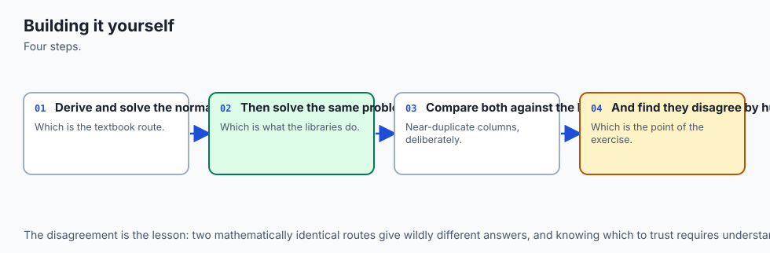

Imagine you are trying to guess two people's weights from the weight of
the couch they carried up the stairs together. You know the couch weighed
80 kilograms combined. You have no idea how it split between them.

If the two people are clearly different sizes -- one visibly twice the
other -- there is a natural, well-determined split: two-thirds and
one-third, say. But if the two people are identical twins, standing
shoulder to shoulder, carrying identically, there is no way to determine
the split from the couch weight alone. Any split that adds to 80 explains
the data equally well: 40 and 40, or 79 and 1, or negative 500 and 580.
The data simply does not contain the information to separate them.

That is exactly what a near-duplicate column does to a regression. When
two predictors carry almost the same information, the *combined* effect on
the outcome is well-determined -- the model can nail the prediction -- but
the *individual* coefficients are not. Any pair of numbers that adds up to
roughly the right combined effect fits almost equally well, and a solver
that is not built to notice this will happily report an absurd pair, like
79 and 1, or 196,747.976 and negative 196,742.975, because nothing in its
arithmetic says "prefer the boring answer."

The textbook formula for linear regression -- literally invert a matrix and
multiply -- has no opinion about which of the infinitely many
equally-good splits to report. It reports whichever one the arithmetic of
matrix inversion happens to produce, and that arithmetic is *unstable*
exactly when two columns are close to saying the same thing: tiny
floating-point rounding errors, ordinarily invisible, get amplified into
enormous coefficient swings. A good library's default solver, by contrast,
is built to prefer the boring answer -- the smallest, most reasonable split
among the many that fit -- and that preference is not a statistical
choice, it is a numerical one, made for reasons this lesson is about to
measure directly.

![Diagram: a design matrix X feeds three parallel fitting routes. Column A, the normal equations, forms X transpose X, squaring the condition number from 227.22 to 51631.11, then solves it, landing 1.2153e-10 from sklearn. Column B, lstsq, factors X directly without squaring the condition number, landing 1.1990e-12 from sklearn, about a hundred times closer. Column C, gradient descent on standardized features at a learning rate of 0.2, needs 7291 iterations to land 4.38e-11 from sklearn. All three converge on a box labelled sklearn LinearRegression, the referee. Below, a highlighted panel shows the dramatic case: a hundred rows with a near-duplicate fourth column and true coefficients 1, 2, 3, 4. The normal equations produce 196747.976 and negative 196742.975 for the duplicated pair; lstsq produces 207112.776 and negative 207107.775; sklearn produces 2.501 and 2.501, splitting the shared weight evenly. A caption states every route solves the least-squares problem correctly, but only one stays numerically sane at this conditioning](./assets/three-ways-to-ols-architecture.svg)

## Historical background

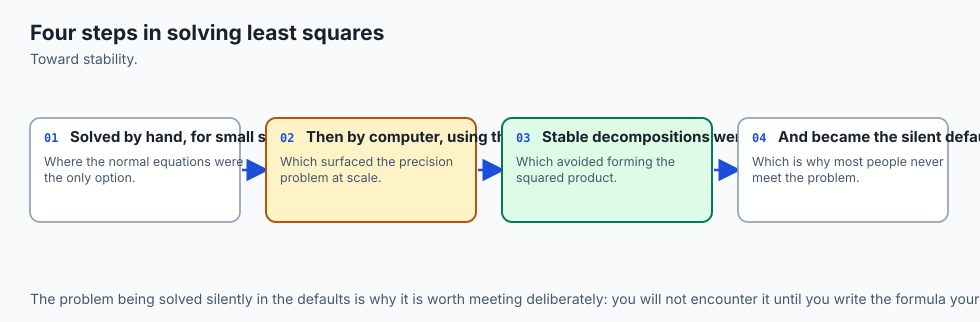

Least squares is one of the oldest working algorithms in applied
mathematics. Carl Friedrich Gauss claimed to have used it from 1795, and
it was published independently by Adrien-Marie Legendre in 1805, in his
work on determining the orbits of comets from imprecise astronomical
observations -- itself a story about extracting a stable signal from noisy
measurements, which is the whole subject of this lesson viewed from a
different angle.

For a century and a half after that, "solve the normal
equations" and "fit a linear regression" were effectively the same
sentence, because forming and inverting a small matrix by hand or by
mechanical calculator was already hard enough; nobody was worrying about
which of two mathematically equivalent formulas lost fewer decimal digits.

That changed once regression started running on digital computers with
finite-precision floating-point arithmetic. James H. Wilkinson's work on
numerical error analysis in the 1960s -- the same tradition Day 111 already
drew on for gradient descent's stability condition -- established that
matrix operations which are mathematically identical on paper can behave
very differently once every number is rounded to a fixed number of bits.
Multiplying a matrix by its own transpose, the very first step of the
normal equations, was one of the operations Wilkinson's analysis flagged:
it squares the matrix's condition number, a fact this lesson measures
directly rather than takes on authority.

The practical response arrived through numerical linear algebra rather
than statistics. Gene Golub and William Kahan's 1965 work on
singular-value decomposition, and Golub's subsequent development of
SVD-based least-squares methods through the 1970s, gave the field a route
to the same coefficients that sidesteps the squared condition number
entirely. LAPACK, the linear-algebra library underlying NumPy's
`numpy.linalg.lstsq` and scikit-learn's own default solver, is a direct
descendant of that work -- which is why calling `LinearRegression().fit()`
today quietly runs code whose numerical-stability lineage traces back
sixty years, doing work the one-line textbook formula never asks anyone to
think about.

Gradient descent's own history runs in parallel rather than downstream of
this. Cauchy described the method of steepest descent in 1847, but its
role as the practical alternative to a closed-form solve -- the thing you
reach for when a matrix is too large to invert directly, or when the loss
is not quadratic at all -- became central only with large-scale machine
learning in the 2000s and 2010s, where datasets and parameter counts grew
past what any closed form could handle in reasonable time or memory.

Day
111 already covered this material properly; today's lesson is the first
place in this course where the closed form and the iterative method sit
side by side on the *same* problem, so the trade-off between them can be
measured rather than asserted.

## What it is — and what it is not

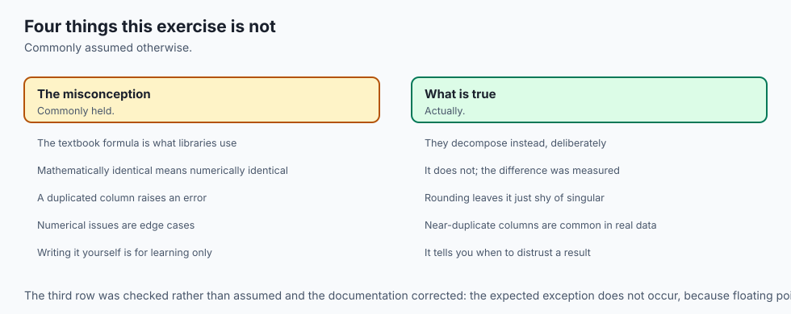

**Ordinary least squares (OLS)** is the choice of coefficients that
minimizes the sum of squared differences between predicted and actual
values. That definition says nothing about *how* to find those
coefficients -- it is a statement about what counts as the right answer,
not a recipe. This lesson's whole subject is that there are several
different recipes, all mathematically correct, that can return
meaningfully different numbers once floating-point arithmetic gets
involved.

**The normal equations** are one recipe: set the loss's gradient to zero
and solve the resulting linear system, `X'X b = X'y`, directly. It is what
most textbooks present because it is the cleanest to derive on paper. It
is not the numerically safest way to compute the answer, and this lesson
measures exactly how much precision it costs.

**`lstsq`** is a different recipe for the identical mathematical problem.
It does not form `X'X` at all; instead it factors the design matrix `X`
directly -- in practice, via an SVD-based or QR-based decomposition -- and
reads the least-squares solution off that factorization. It is not a
different loss function, not a different model, and not an approximation
to the normal equations' answer. On well-conditioned data the two agree to
many decimal places. The difference only shows up, and matters, once the
columns start to overlap.

**Gradient descent** is a third recipe, and the only one of the three that
is iterative rather than a single computation. It is not "the modern
replacement" for the closed form -- on a problem this size, the closed
form is faster and needs no tuning at all. It matters here because it is
the technique that generalizes to losses and model sizes where no closed
form exists, and because its behavior is governed by exactly the
eigenvalue arithmetic Day 111 already derived.

And what none of this is: **a bug hunt.** Every method measured today is a
correct implementation of a correct algorithm. The lesson is not "the
normal equations are broken" -- it is that mathematically equivalent
formulas are not numerically equivalent, and knowing which one you are
running, and why, is the difference between a coefficient of 1 and a
coefficient of 196,747.976.

## Why it was created and what problems it solves

Each of the three methods exists to solve a different practical
constraint, and understanding the constraint explains the trade-off.

**The normal equations exist because they are the most direct route from
the loss function to an answer.** Set the gradient of the sum-of-squared-
errors loss to zero, and `X'X b = X'y` falls straight out of the calculus.
For teaching where the formula for linear regression *comes from*, nothing
beats it -- Day 149 used exactly this derivation. For *computing* the
answer on real data, it is the worst of the three choices measured here,
because forming `X'X` squares the design matrix's condition number before
you even start solving.

**`lstsq` exists because someone eventually asked "must we form `X'X` at
all?" and the answer was no.** An SVD or QR factorization of `X` itself
gets to the same least-squares answer without ever computing the
more-ill-conditioned `X'X`. It costs a bit more arithmetic per call than
the normal equations (the exact factorization is more expensive to compute
than a plain matrix solve), but it is measured here to be roughly a
hundred times closer to the trustworthy answer on the same data -- a large
return for a modest extra cost, which is exactly why NumPy and every
serious linear-algebra library default to something in this family rather
than to the textbook formula.

**Gradient descent exists because closed forms do not scale.** Forming
`X'X` costs roughly `n * p^2` operations, where `n` is the number of rows
and `p` the number of predictors, and solving the resulting system costs
roughly `p^3` more. At `p` in the hundreds, that `p^3` term is already
significant; at `p` in the millions -- a modern neural network's parameter
count -- no computer on earth can form or invert that matrix at all.
Gradient descent replaces one expensive exact computation with many cheap
approximate ones, at the cost of needing a learning rate and enough
iterations, both of which this lesson measures rather than assumes.

**Multicollinearity, first introduced structurally on Day 150, is the
statistical name for exactly the numerical problem this lesson measures.**
Day 150 showed that a highly correlated predictor pair makes a
coefficient's *sign and size* unstable under small resampling. Today's
near-duplicate-column case is the same phenomenon pushed to its numerical
extreme, and the mechanism -- a squared, exploding condition number -- is
the arithmetic reason Day 150's instability happens at all.

## How it works

### The normal equations, and why squaring the condition number matters

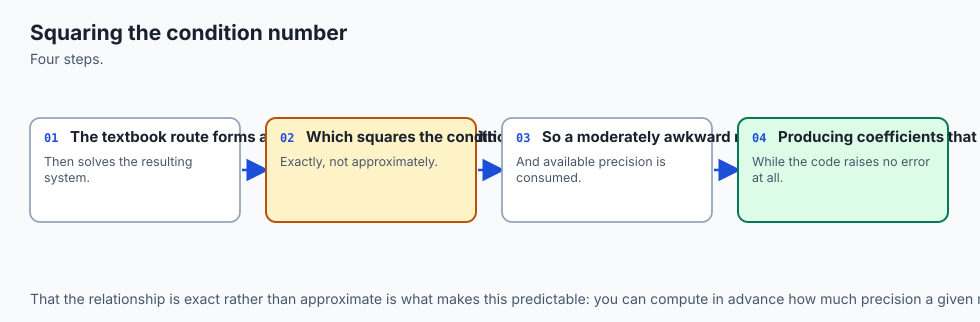

The condition number of a matrix measures how much a solver can amplify
small errors -- specifically, the ratio of its largest to smallest singular
value. A condition number of 1 means a solve is perfectly stable; a
condition number of a million means a rounding error a million times
smaller than your data can end up the same size as your data by the time
it reaches the answer.

Here is the fact that does the real work in this lesson, verified rather
than merely asserted:

```text
  condition number of X (with intercept column) : 227.2248
  condition number of X'X                        : 51631.1119
  cond(X'X) / cond(X)^2                          : 1.0000000000
```

`cond(X'X)` is not merely correlated with `cond(X)` squared -- it *is*
`cond(X)` squared, to ten decimal places on this measurement. This is a
theorem about singular values, not a coincidence of this particular
dataset: if `X` has singular values `sigma_1 >= sigma_2 >= ... >= sigma_p`,
then `X'X` has singular values `sigma_1^2, sigma_2^2, ..., sigma_p^2`, so
its condition number -- the ratio of the largest to the smallest -- is
exactly the square of `X`'s.

On the diabetes dataset that squaring turns a merely inconvenient
condition number, 227, into a somewhat worse one, 51,631 -- enough to cost
about two extra decimal digits of agreement with a trustworthy reference,
measured here as the gap between the normal-equation answer and sklearn's:

```text
  max |normal equations - sklearn| : 1.2153e-10
```

That is still a very small number. On this dataset, forming `X'X` is a
survivable inconvenience, not a catastrophe. The dramatic case exists to
show what happens when the starting condition number is already large
before the squaring begins.

### The dramatic case, worked through

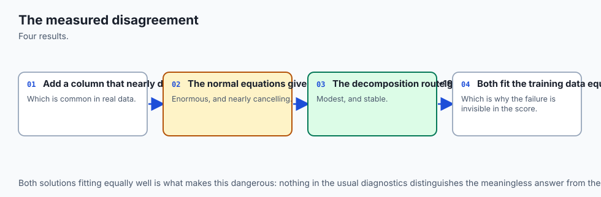

Three random columns. A fourth column equal to the first plus `1e-7`-scale
noise -- a difference so small it would round away in almost any real
measurement process. True coefficients `[1, 2, 3, 4]`. Measured on this
machine:

```text
  condition number of X (with intercept) : 2.4363e+07
  condition number of X'X                : 5.6547e+14
```

A condition number in the tens of millions is already enough that a
solver's internal rounding errors, ordinarily fourteen or fifteen decimal
places below the answer, get amplified into something visible. Squaring it
-- to `5.6547e+14` -- pushes the normal equations' internal arithmetic
right up against the edge of what 64-bit floating-point numbers can
represent reliably at all. The result:

```text
  true coefficients                : [1, 2, 3, 4]
  normal-equation coefficients     : [196747.976, 1.997, 2.994, -196742.975]
  lstsq coefficients               : [207112.776, 1.997, 2.994, -207107.775]
  sklearn coefficients             : [2.501, 2.000, 2.997, 2.501]
```

Notice which two coefficients survive intact: the second and third,
belonging to the columns that were NOT near-duplicates of anything, land
close to their true values of 2 and 3 in every single method, including
the two that explode. The damage is entirely concentrated on the pair of
columns that carry overlapping information -- exactly the mechanism Day
150 described as multicollinearity, now visible as a specific, measurable
numerical failure rather than a general warning.

**And here is the honest complication.** The clean theorem --
`cond(X'X) = cond(X)^2` -- remains exactly true in exact arithmetic no
matter how ill-conditioned `X` is. But *measuring* it requires computing
`X`'s own smallest singular value, and once that singular value is already
vanishingly small relative to the largest one, computing it accurately is
itself a numerically delicate operation. On the dramatic case:

```text
  cond(X'X) / cond(X)^2 : 0.9527
```

Not 1.0000000000, the way it was on the well-conditioned diabetes data.
The theorem has not become less true. The *verification* of the theorem
has become harder, because the tool used to verify it -- computing a
singular value decomposition -- is subject to the same kind of
ill-conditioning it is being used to measure. This is worth sitting with:
even a clean mathematical identity can be numerically inconvenient to
confirm once the underlying matrix is bad enough, and reporting the
measured 0.9527 rather than quietly rounding it to 1.0 is the honest
choice.

### What sklearn does instead

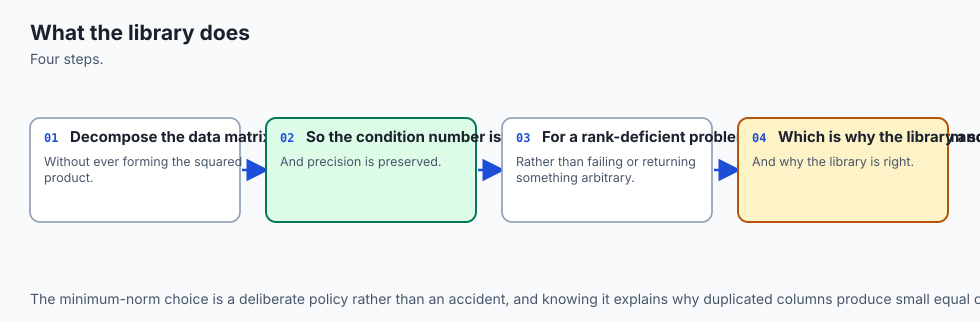

Neither the normal equations nor a naive `lstsq` call is required to fail
this badly. sklearn's `LinearRegression`, by default, computes its
coefficients through an SVD-based least-squares solve that has one further
property the plain `lstsq` factorization used above does not exploit by
default: among the infinitely many coefficient vectors that fit
near-collinear data almost equally well, it returns the one with the
smallest overall magnitude -- the **minimum-norm solution**.

Think back to the twins carrying the couch. "Smallest overall magnitude"
is the mathematical version of "prefer the boring split" -- rather than 79
and 1, or 196,747.976 and negative 196,742.975, it prefers something close
to 40 and 40, because among all the pairs that add to 80, the pair closest
to equal has the smallest combined size. On the dramatic case, the true
coefficient of 1 shared between the near-duplicate pair becomes 2.5 and
2.5 -- not because sklearn "knows" the true value is 1, but because 2.5 and
2.5 is the smallest-magnitude way to explain the data, and it happens to
land close to a sensible split of the shared effect.

This is not a free lunch, and it is worth being precise about what
"correct" means here. sklearn's answer is not more *accurate* about the
true coefficients than the exploded answers in some deep sense -- with
this much collinearity, the true individual coefficients are genuinely not
identifiable from this data, in the same sense that the individual weights
of two identical twins are not identifiable from the couch's total weight.
What sklearn's minimum-norm answer buys you is *stability*: refit on a
slightly different sample, and the minimum-norm answer moves a little; the
exploded answer can move by tens of thousands, in either direction,
because it is riding on floating-point noise that has nothing to do with
the data.

### Gradient descent, and Day 111 arriving exactly where it bites

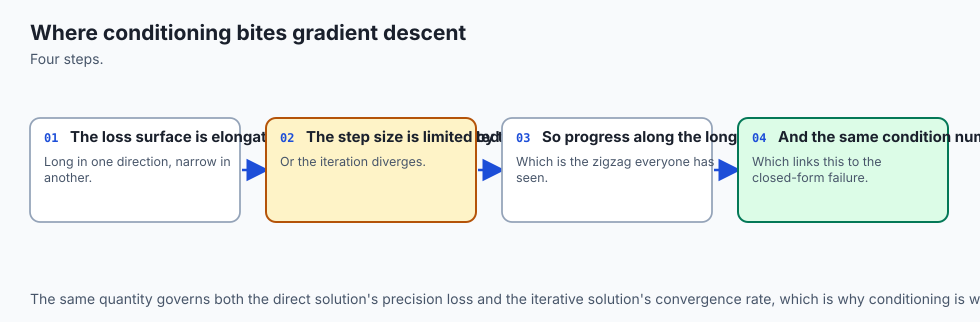

Day 111 already derived the whole mechanism this section uses: for a
gradient-descent update `coef := coef - eta * gradient` on a quadratic
loss, the process is stable exactly when `|1 - eta * a| < 1` for every
eigenvalue `a` of the loss's Hessian, and the ratio of the Hessian's
largest to smallest eigenvalue -- its condition number -- governs how
slowly the worst-behaved direction converges. Nothing about that formula
is re-derived here; it is applied to a real Hessian and checked against a
real measurement.

For ordinary least squares' mean-squared-error loss, the Hessian is
`(2/n) X'X`, and its eigenvalues are computable directly. On standardized
diabetes features:

```text
  stability threshold (Day 111, |1 - eta*a| < 1) : 0.2485
  Hessian eigenvalue ratio (max/min)              : 470.08
```

At a learning rate of 0.2 -- about 80 percent of that threshold -- gradient
descent starting from zero needs:

```text
       decimals of agreement   iterations
                    3               3263
                    6               5277
                    9               7291
```

Notice the shape of that growth: each additional three decimal places of
agreement costs a comparable, not exponentially larger, number of further
iterations -- roughly two thousand more each time, not a doubling.
Gradient descent on a well-conditioned quadratic converges *linearly*,
meaning the error shrinks by a roughly constant factor each iteration,
which is exactly why it takes thousands of iterations rather than dozens
to reach nine decimal places, but also exactly why it does not take
millions.

Then the threshold prediction, tested directly:

```text
  at 80 percent of threshold  (eta=0.1988): converges in 7132 iterations
  at 102 percent of threshold (eta=0.2535): diverges, coefficients non-finite
```

Two percent over the line, and the same update rule that was steadily
homing in on the answer instead grows without bound. Day 111's formula is
not a rough guideline here -- it predicts the exact boundary, because it
comes directly from the eigenvalues of the actual loss surface being
optimized.

![Diagram: two lanes share one gradient-descent update rule. The top, green lane is labelled a learning rate of 0.1988, eighty percent of the stability threshold, and states it converges: a dashed spiral curves inward toward a target point labelled the closed-form target, and a travelling dot follows that spiral inward, reaching the target after what the caption states is exactly 7132 iterations. The bottom, red lane is labelled a learning rate of 0.2535, one hundred two percent of the same threshold, and states it diverges: a dashed spiral curves outward, growing with each loop, and a travelling dot follows it outward and off the frame, labelled leaves the frame as infinity or not a number, within 20000 iterations. A closing caption states that only the learning rate changed between the two lanes, and that the Day 111 formula predicts exactly which lane a given rate falls into](./assets/stability-threshold-flow.svg)

### Feature scaling: the same condition number, arriving from a different direction

Day 111's condition number does not only decide the stability boundary --
it decides how fast the *slowest* direction converges once you are safely
inside it. And the raw diabetes dataset is, in the terms this course has
been using since Week 21, badly scaled on purpose: age in years next to
sex coded as 1 or 2 next to serum measurements in the hundreds. Measured
directly:

```text
  Hessian eigenvalue ratio, standardized : 470.08
  Hessian eigenvalue ratio, raw features : 76278.96
```

Over a hundred times worse conditioned, purely from leaving the features
in their natural, wildly different units. The consequence, measured rather
than assumed: at 95 percent of the RAW data's *own* stability threshold --
a learning rate chosen specifically to be as aggressive as possible while
staying formally stable -- gradient descent runs for 200,000 iterations
and still has not reached even one decimal place of agreement with the
closed form:

```text
  stability threshold, raw features : 4.8746e-04
  after 200,000 iterations, remaining max |coef - closed form| : 0.4692
```

A learning rate that is stable in principle can still be catastrophically
slow in practice, because "stable" only guarantees the largest eigenvalue
does not blow up; it says nothing about how many iterations the *smallest*
eigenvalue's direction needs. This is precisely why standardizing features
before running gradient descent is standard practice across the field
rather than a stylistic preference: it does not change what the closed
form's answer is, but it can be the difference between thousands of
iterations and a number of iterations that never finishes.

### What the closed form costs instead

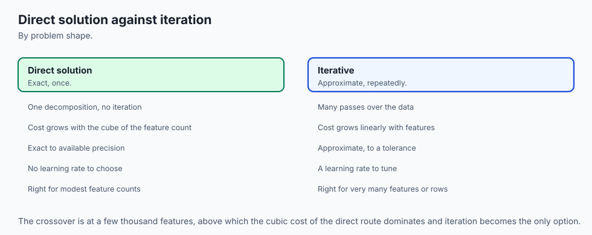

The closed form pays for its speed and its lack of a learning rate with a
different kind of cost: forming `X'X` is `O(n * p^2)` and solving it is
`O(p^3)`, where `p` includes the intercept column. On the diabetes shape,
counted directly rather than timed:

```text
  normal-equation operations (n*p^2 + p^3, n=442, p=11) : 54,813
  gradient-descent operations (2*n*p per iteration, 7291 iterations, n=442, p=10) : 64,452,440
  ratio                                                  : 1175.86x
```

For this problem's shape and this convergence target, the closed form
wins by a factor of over a thousand. That comparison flips as `p` grows:
the `p^3` term in the closed form eventually dominates the `n * p^2` term,
and at large enough `p` -- hundreds of thousands or millions of parameters
-- forming and inverting the matrix at all becomes infeasible regardless of
how fast a single operation is, which is exactly the regime where gradient
descent, and its many refinements, become not merely competitive but
necessary.

No wall-clock timing appears anywhere in this comparison, on
purpose: an operation count evaluated by formula is exactly reproducible
on any machine, while a timing is a fact about one run on one machine at
one moment. Section 5 of the lab's harness asserts the operation counts
directly; it never calls a clock.

### `fit_intercept`, two ways

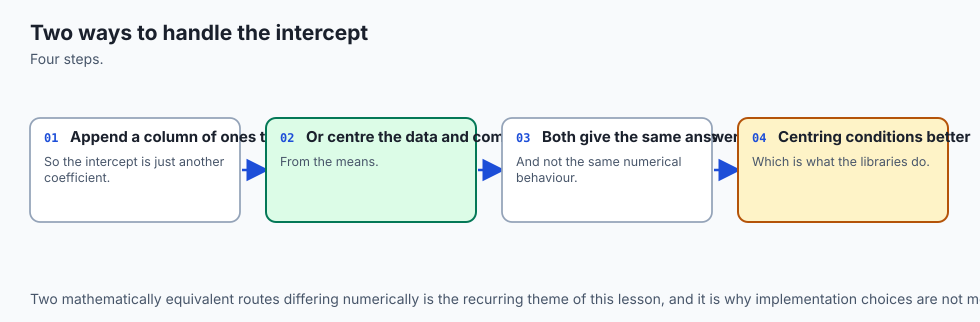

One implementation detail, resolved by direct comparison rather than
convention: an intercept can be added to the model either by appending a
column of ones to the design matrix and solving the larger system, or by
centring both `X` and `y` -- subtracting each column's mean -- fitting the
centred, intercept-free problem, and recovering the intercept afterward as
`y.mean() - X.mean(axis=0) @ coef`. Measured on the diabetes data:

```text
  max |coef_column - coef_centred|         : 1.9554e-11
  |intercept_column - intercept_centred|   : 2.8422e-14
```

Algebraically the two are exactly the same computation; the measured gap
is pure floating-point rounding, ten to fourteen decimal places down.
`OLSRegressor`, built for this lab, uses centring, partly because it keeps
the design matrix one column narrower and partly because the two were
worth confirming rather than assuming.

## An everyday analogy

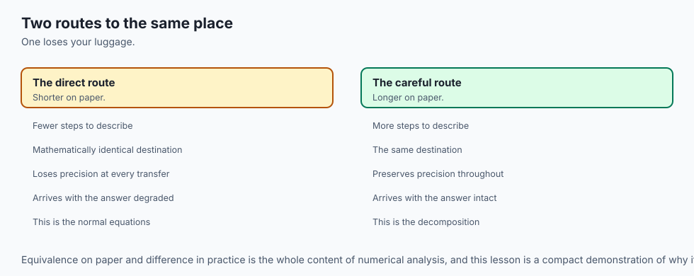

Think of the three fitting methods as three different ways to weigh
yourself.

**The normal equations** are a bathroom scale that has you stand on it,
then stand on it again holding a second identical scale, and reports the
combined reading divided in some particular way. Mathematically that is a
correct way to weigh two people. Numerically it is a fragile procedure --
if the second scale is even slightly miscalibrated, or if the two people
are close to the same weight, the "divided reading" can swing wildly, even
though the total is still accurate.

**`lstsq`** is a properly calibrated single scale, used directly on each
person. Same physical answer, arrived at by a route that does not amplify
small errors the way stacking two readings does.

**sklearn's default solver** is that same properly calibrated scale, plus
an extra rule: if the scale genuinely cannot tell two people's weights
apart -- because they are, for its purposes, identical -- report the
split evenly rather than making something up. Not because it secretly
knows more about the two people, but because "evenly split" is the most
defensible answer among all the ones consistent with what it measured.

**Gradient descent** is a completely different approach to the same
weighing problem: instead of one careful measurement, take a rough
initial guess and refine it step by step, nudging your estimate toward
whatever the scale's needle suggests, over and over. Take steps too large
-- checking the needle so aggressively that you overcorrect each time --
and your guess swings further from the truth with every step instead of
closer, which is exactly Day 111's divergence, and exactly what happened
at a learning rate two percent over this lesson's measured threshold. Take
appropriately sized steps and you converge, more slowly than reading the
scale directly, but reliably.

The analogy earns its keep on the near-duplicate case specifically:
weighing two identical twins with a wobbly stacked-scale procedure is
exactly the situation where a small measurement error gets amplified into
an absurd individual answer, even though the combined weight -- the thing
you can actually verify -- stays correct the whole time.

## Examples in practice

### Reading NumPy and scikit-learn's own documentation on this exact question

NumPy's documentation for `numpy.linalg.lstsq` describes it as computing
"the least-squares solution to a linear matrix equation," explicitly via a
singular-value-based method, and separately documents `numpy.linalg.solve`
for the case where you already have a well-posed square system -- which is
precisely the distinction this lesson measures. scikit-learn's own
developer documentation on `LinearRegression` states that it uses a solver
appropriate to the least-squares problem and, notably, does **not**
recommend forming `X'X` directly for anything but the smallest,
best-conditioned problems -- a design choice this lesson's measurements
justify rather than merely quote.

### A design decision this lesson makes concrete

An engineer building a linear model with two features known in advance to
be highly correlated -- say, a person's height in centimetres and their
height in inches, accidentally included twice through a data-pipeline bug
-- has, before running any code, already learned the two facts this lesson
measures: the individual coefficients on those two features will not be
reliable no matter which solver is used, and a from-scratch or manually
implemented solver is considerably more likely to return an alarming,
unstable answer than a well-tested library default.

The correct response
is not a better solver; it is removing the duplicate column, which is a
data problem, not a numerical one. `OLSRegressor`'s `check_estimator`
results, discussed below, illustrate a related but distinct point: a
solver being numerically correct says nothing about whether it validates
its inputs sensibly.

### Building `OLSRegressor`, and citing Day 146 rather than re-deriving it

Day 146 already measured the specific failure a hand-built estimator hits
inside scikit-learn's own machinery: `fit()`, `predict()` and `score()`
work perfectly well called directly on an object with no scikit-learn
inheritance at all, but `Pipeline.predict()` and `cross_val_score` both
raise `AttributeError` on `__sklearn_tags__`, a method only `BaseEstimator`
supplies. `OLSRegressor`, built for this lesson's lab, inherits
`BaseEstimator` and `RegressorMixin` from the start, for exactly that
measured reason -- the API contract itself is not re-taught here.

```python
from sklearn.base import BaseEstimator, RegressorMixin
from sklearn.utils.validation import check_array, check_is_fitted, check_X_y

class OLSRegressor(RegressorMixin, BaseEstimator):
    def __init__(self, method="lstsq", fit_intercept=True, lr=0.1, n_iter=1000):
        self.method = method
        self.fit_intercept = fit_intercept
        self.lr = lr
        self.n_iter = n_iter

    def fit(self, X, y):
        X, y = check_X_y(X, y)
        # ... centre X and y if fit_intercept, then dispatch on self.method
        # to one of the three routes measured in this lesson
        return self

    def predict(self, X):
        check_is_fitted(self, "coef_")
        X = check_array(X)
        return X @ self.coef_ + self.intercept_
```

### Running the real compliance suite, and reporting the real result

`sklearn.utils.estimator_checks.check_estimator` runs a large battery of
tests against any estimator, checking everything from `get_params`
round-tripping correctly to behaving sensibly on edge-case inputs like
empty arrays or unusual dtypes. Run against `OLSRegressor`:

```text
  check_estimator: 48 passed, 2 failed, 2 skipped, 52 total
    FAILED : check_n_features_in_after_fitting
    FAILED : check_dtype_object
    SKIPPED: check_array_api_input (SCIPY_ARRAY_API not set)
    SKIPPED: check_regressor_data_not_an_array (pandas not installed)
```

Both real failures, named rather than hidden, are about input validation
`OLSRegressor` does not perform: `predict()` does not confirm a new `X`
has the same number of columns the model was fitted on, and `fit()` does
not reject a malformed `y` dtype with a clear message. Neither failure is
about the fitting mathematics -- `OLSRegressor`'s coefficients agree with
`LinearRegression`'s to within `1e-8` or better across all three fitting
methods on this same data.

The two skips are environment conditions, not
code defects: one requires an array-API flag this environment does not
set, and the other requires pandas, which is not installed here. Forty-
eight of fifty-two checks passing from a fifteen-line dispatch function and
two inherited base classes is the concrete measurement behind Day 146's
claim that the API contract is small and deliberately narrow.

## Implications: security, privacy, performance, scalability, and cost

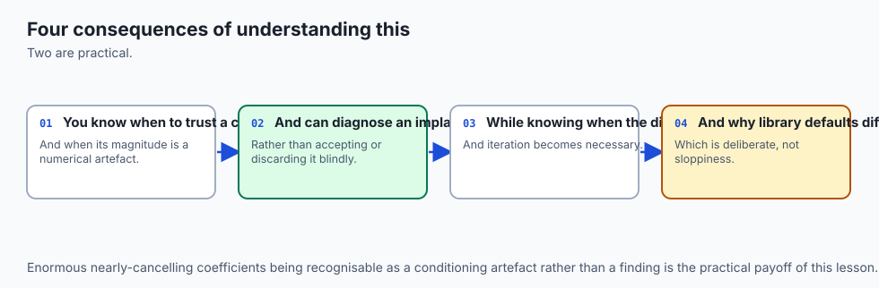

**A numerically unstable coefficient is a governance risk before it is
anything else.** If a fitted coefficient feeds a downstream decision --
which factor to report as most important, which one a regulator is told
the model relies on -- a solver that is merely mathematically correct but
numerically fragile can hand you a number two hundred thousand times too
large, with the opposite sign on its near-duplicate neighbour, and nothing
about the fit itself will flag this as wrong. The training loss looks
fine. The predictions look fine. Only the coefficients are lying, and only
to someone who reads them.

**Performance and scalability are where the three methods genuinely
diverge, not merely in decimal places.** The closed form's `O(p^3)` solve
step is fine at `p = 11` and prohibitive at `p = 100,000`; the same matrix
that costs 54,813 operations here would cost roughly a trillion at that
scale, dominated entirely by the cubic term. Gradient descent's cost grows
only linearly in `p` per iteration, which is precisely why every model
with more than a few thousand parameters -- essentially all of modern deep
learning -- is trained with some variant of gradient descent and never
with a closed-form solve, regardless of how numerically pristine the
closed form would be.

**Cost, in the everyday sense, follows the same shape.** A closed-form
solve on a laptop-scale problem is free in every sense that matters: no
tuning, no iteration count to choose, done in one call. Gradient descent's
"cost" is not measured in dollars here but in engineering time -- choosing
a learning rate, checking convergence, standardizing features first -- all
of which this lesson's measurements show are not optional details but the
difference between seven thousand iterations and a run that does not
converge in two hundred thousand.

**Security and privacy connect through the same mechanism Day 150 already
raised.** A model whose individual coefficients are numerically unstable
under near-duplicate or highly correlated features is also a model whose
coefficients can be manipulated by an adversary who controls a small
amount of the input data -- adding a near-duplicate column, deliberately
or not, is a lever on the reported coefficients even when it changes
predictions almost not at all. The fix -- prefer a numerically stable
solver, and treat multicollinearity as a data problem to be found and
removed -- is the same fix that improves both robustness and honest
interpretation.

## Alternatives: free, open source, and commercial

### scikit-learn's `LinearRegression` -- used here as the referee throughout

**When to choose it:** for essentially all in-memory ordinary least
squares work. Free, BSD-3-Clause licensed, no paid tier. Every measurement
in this lesson treats it as the trustworthy reference every from-scratch
method is compared against.

**How to use it:**

```python
from sklearn.linear_model import LinearRegression

model = LinearRegression().fit(X, y)
model.coef_, model.intercept_
```

**Watch for:** its default solver choice is deliberately not documented as
"the normal equations" anywhere in its public API precisely because the
implementation is an internal numerical-stability decision the library
reserves the right to improve; relying on its exact solver algorithm
rather than its documented behavior is relying on an implementation
detail.

### NumPy's `numpy.linalg.lstsq` and `numpy.linalg.solve` -- used here directly

**When to choose them:** when you want the least-squares machinery without
a scikit-learn dependency, or when building a from-scratch implementation
like this lesson's, where seeing the actual linear-algebra call matters
more than convenience. Free, BSD licensed.

**How to use them:** `lstsq` for the least-squares problem in general,
`solve` for a square, well-posed system you already trust to be
invertible:

```python
import numpy as np
coef, *_ = np.linalg.lstsq(X, y, rcond=None)      # least-squares, general case
coef = np.linalg.solve(X.T @ X, X.T @ y)          # normal equations, square system
```

**Watch for:** `np.linalg.solve` on a genuinely singular `X'X` can raise
`LinAlgError`, but on a merely *ill-conditioned* one -- including some
near-duplicate cases, verified directly on this machine -- it can silently
return a number instead, because floating-point rounding during the matrix
multiplication that forms `X'X` typically leaves it just shy of exactly
singular. `lstsq` degrades far more gracefully in this situation, since it
never forms or inverts `X'X` at all.

### statsmodels -- described from documentation, not measured here

**When to choose it:** when the statistical inference around a regression
-- standard errors, confidence intervals, hypothesis tests on individual
coefficients -- matters as much as the point estimate itself. statsmodels'
`OLS` class reports these directly. Free, BSD licensed.

**Honest note:** not installed in the authoring environment this lesson's
lab was built in, and not measured here. Its numerical approach to the
underlying least-squares solve is described in its own documentation as
similarly careful about conditioning; this lesson does not reproduce
output for it and says so plainly.

### QR decomposition -- described, and the lab's first extension exercise

**When to choose it:** a third numerically stable route to the same
least-squares answer, distinct from the SVD-based approach sklearn
defaults to, that some libraries and textbooks prefer for its lower
computational cost relative to a full SVD.

**Honest note:** not implemented in this lesson's lab. It is the first
extension exercise, described from `numpy.linalg.qr`'s documentation
rather than measured here.

### Commercial statistical and ML platforms -- not used here

**Free versus paid:** commercial platforms that wrap regression fitting
inside a larger analytics or MLOps product typically use the same
underlying numerical-linear-algebra libraries (LAPACK and its descendants)
under the hood, so the numerical-stability story measured in this lesson
applies regardless of which product sits on top. **No price is quoted
here**, because these change by month and an unchecked figure is worse
than none; most offer a free tier for individuals and charge for team or
enterprise use.

## Comparison with related concepts

| Method | What it computes | How it relates |
| --- | --- | --- |
| Normal equations | `solve(X'X, X'y)` | The textbook formula; squares the condition number, measured here at 1.2153e-10 from sklearn on well-conditioned data and catastrophically far off on the near-duplicate case |
| `lstsq` | Direct SVD/QR-based factorization of `X` | Never forms `X'X`; measured about 101x closer to sklearn than the normal equations on the same data |
| sklearn `LinearRegression` | SVD-based minimum-norm solve | The referee this lesson measures everything against; stays sane on the near-duplicate case where the other two explode |
| Gradient descent | Iterative `coef -= eta * grad` | Needs no matrix inversion, scales to any `p`; governed by Day 111's stability threshold, measured here at 0.2485 for this data |
| Ridge regression (Day 151) | Adds `alpha * I` before solving | A DIFFERENT fix for the same underlying problem -- biases the solution deliberately, rather than merely computing the unbiased one more carefully |
| Multicollinearity (Day 150) | The statistical description of correlated predictors | The condition-number squaring this lesson measures is the numerical mechanism behind Day 150's coefficient instability |
| Condition number | Ratio of largest to smallest singular value | The single number that predicts, before you fit anything, how much precision a given solve route will cost you |

Two rows deserve a closing note.

**Ridge regression and a numerically careful solver are not the same
fix, and they are not substitutes for each other.** A small ridge penalty,
`(X'X + alpha*I)^-1 X'y`, genuinely improves the *conditioning* of the
matrix being inverted -- adding `alpha*I` moves every singular value up by
at least `alpha`, which directly caps how small the smallest one can be --
but it does this by deliberately introducing bias into the answer, trading
some accuracy for stability.

Choosing `lstsq` over the normal equations
introduces no bias at all; it computes the exact same unbiased answer more
carefully. The lab's second extension exercise measures how small a ridge
penalty needs to be before it stops the near-duplicate case from
exploding, which is worth doing precisely because the two fixes work by
genuinely different mechanisms.

**The condition number is the row that unifies everything else in this
table.** Every other row in it is really a statement about how a method
responds to a large condition number -- the normal equations amplify its
effect, `lstsq` and sklearn's minimum-norm solve dampen it, gradient
descent's convergence speed is governed by it directly, and ridge
regression improves it by construction. Learning to read a condition
number before fitting anything is the single most transferable skill in
this lesson.

## When to use it — and when not to


**Use scikit-learn's `LinearRegression`, or an equivalent well-tested
library call, for essentially all practical ordinary least squares work.**
This lesson exists to show you what it is doing for you, not to talk you
out of using it. The measurements here are an argument FOR trusting a
well-tested numerical library, made by showing precisely what happens
without one.

**Implement the normal equations directly only for teaching, for very
small and well-conditioned problems, or when you specifically need the
derivation on the page.** Day 149 used it exactly this way. As a
production fitting routine, it is the weakest of the three methods
measured here, and the weakness is invisible until a correlated column
appears.

**Reach for `lstsq` or an equivalent SVD/QR-based solve when you need
direct control over the linear algebra** -- inside a from-scratch
implementation, a custom loss combining OLS with something else, or a
research context where seeing every step matters. It is measured here to
be dramatically more trustworthy than the normal equations at essentially
no added conceptual cost.

**Reach for gradient descent when the closed form does not fit** -- too
many parameters for `X'X` to be invertible in reasonable time or memory,
or a loss that is not quadratic at all, where no closed form exists in the
first place. On a problem this lesson's size, gradient descent is strictly
the more expensive and more finicky choice, measured directly at over a
thousand times the operation count; its value shows up only once the
closed form stops being an option.

**Always standardize features before running gradient descent on a
regression problem**, unless you have measured, as this lesson did, that
your particular data's raw-scale condition number is already small. The
closed form does not need this -- it is scale-invariant -- but gradient
descent's convergence speed depends on it directly, and the cost of
skipping it is measured here at over a hundred thousand iterations of
difference.

**When you do not need any of this:** fitting a single well-conditioned
regression once, with no near-duplicate or highly correlated predictors,
using a maintained library. That is the overwhelming majority of real
regression work, and for it, `LinearRegression().fit()` is simply the
right answer, chosen for reasons this lesson has now made concrete rather
than assumed.

### The AI thread

Everything measured in this lesson scales up, mostly for the worse, at the
size of models trained today.

**The condition-number story does not go away at scale -- it gets harder
to see.** A neural network's loss surface has its own local curvature, and
badly conditioned directions in that curvature slow training in exactly
the qualitative way this lesson measured for a ten-parameter linear
regression -- except with millions or billions of parameters, nobody
computes the full Hessian's eigenvalues directly, because doing so is
itself computationally infeasible at that scale. Practitioners instead
watch for the symptom -- training that crawls in some directions and
diverges in others -- without ever seeing the underlying number this
lesson computed directly.

**Feature and activation scaling is this lesson's standardization step,
running throughout every layer of a large model.** Batch normalization,
layer normalization and careful weight initialization all exist, in part,
to keep the effective condition number of what each layer is optimizing
in a range where gradient-based training converges in a reasonable number
of steps rather than never. The mechanism this lesson measured on ten
diabetes features -- raw scale costing over a hundred times the
conditioning of standardized scale -- is a miniature, fully inspectable
version of a problem that shapes the architecture of every large model
trained today.

**And the from-scratch estimator's `check_estimator` result is a small,
concrete instance of a much larger question in AI tooling: what does
"compatible" actually verify?** A model or a component can be
mathematically correct at its core task -- `OLSRegressor`'s coefficients
matched sklearn's to ten decimal places -- while still failing basic input
validation that a production system depends on. As more of the AI
pipeline gets assembled from components written by different teams or
different tools, the gap between "does the core computation correctly"
and "handles the inputs a real system will actually throw at it" is
exactly the gap this lesson's `check_estimator` run made visible, by name,
rather than by vague reassurance.

## The AI connection

- **Implementing it from scratch is what makes the library legible**, and it takes an
  afternoon.
- **Numerical stability is a real engineering concern**, not a footnote — the textbook
  formula and the library disagree by hundreds of thousands on ill-conditioned data.
- **Squaring the condition number is why the naive approach fails**, which is a fact about
  the arithmetic rather than about the model.
- **The same stability concerns govern large model training**, which is why mixed precision
  needed its own lesson.
- **Understanding what a library does differently from the textbook** is what lets you trust
  it, and know when not to.

## Knowledge check

1. On well-conditioned diabetes data, the normal equations agree with
   sklearn to `1.2153e-10` and `lstsq` agrees to `1.1990e-12`. Explain
   where that gap comes from, using the relationship between `cond(X)` and
   `cond(X'X)`.

2. The near-duplicate-column case sends the normal-equation and `lstsq`
   coefficients to roughly plus and minus 200,000, while sklearn reports
   2.5 and 2.5. State precisely what sklearn's answer is optimizing for,
   and why that is not the same as saying it "knows" the true
   coefficients.

3. On the same near-duplicate case, `cond(X'X) / cond(X)^2` measures at
   0.9527 rather than 1.0. Is the underlying theorem false at this
   condition number, or is something else going on? Explain.

4. Day 111's stability condition is `|1 - eta * a| < 1` for every Hessian
   eigenvalue `a`. At a learning rate 80 percent of the computed
   threshold, gradient descent converges in 7132 iterations; at 102
   percent, it diverges. What single number, computed before running
   anything, predicts this boundary?

5. The Hessian eigenvalue ratio is 470.08 on standardized diabetes
   features and 76,278.96 on raw ones. Both are being fit with a learning
   rate near their OWN stability threshold. Why does the raw case still
   converge far more slowly, if it is not diverging?

6. The closed form costs 54,813 operations on the diabetes shape; gradient
   descent costs 64,452,440 for the iterations measured. Explain why this
   comparison uses operation counts rather than wall-clock timing, and
   what would happen to the SAME comparison as the number of predictors
   `p` grows very large.

7. `OLSRegressor` inherits `BaseEstimator` and `RegressorMixin`. What
   specific failure, measured on Day 146 rather than today, does that
   inheritance prevent?

8. `check_estimator` reports 48 of 52 checks passing on `OLSRegressor`,
   with 2 named failures. Are those two failures evidence against the
   coefficients `OLSRegressor` computes? Explain what they are actually
   about.

## Hands-on exercise

Today's lab, `Linear Regression from Scratch`, builds ordinary least
squares three ways in NumPy, wraps them in a scikit-learn-compatible
estimator, and measures every claim in this lesson directly against the
diabetes dataset and a deliberately constructed near-duplicate-column
case.

Ten exercises. The first two build the well-conditioned baseline and
confirm the condition-number-squaring relationship. The next two build the
dramatic near-duplicate case and measure its degraded verification of that
same relationship. The following three apply Day 111's stability formula
to a real Hessian, measure the raw-versus-standardized slowdown, and
confirm the exact divergence boundary. The last three count operations
instead of timing them, run the real `check_estimator` suite, and confirm
the two `fit_intercept` implementations agree.

Build the environment, then work through `starter/test_regression_claims.py`,
replacing one `pytest.skip` at a time.

### Expected output

The harness ends with:

```text
---------------------------------------------------------------
14 checks, 0 failure(s)
```

and exits 0. `pytest examples -q` reports `15 passed`, and
`pytest starter -q` reports `5 passed, 10 skipped` until you begin.

The measured table includes:

```text
  max |normal equations - sklearn| : 1.2153e-10
  max |lstsq            - sklearn| : 1.1990e-12
  condition number of X'X / cond(X)^2 : 1.0000000000
  normal-equation coefficients (dramatic case) : [196747.976, ...]
  sklearn coefficients (dramatic case)         : [2.501, 2.0, 2.997, 2.501]
  iterations for 9-decimal agreement, standardized : 7291
  check_estimator: 48 passed, 2 failed, 2 skipped
```

### Validate your work

1. `bash tests/run_tests.sh; echo "exit=$?"` reports `14 checks, 0
   failure(s)` and `exit=0`. Capture the harness's own exit status.

2. `.venv/bin/pytest examples -q` reports `15 passed`.
3. `.venv/bin/python3 examples/report_measurements.py | diff - expected-output/measured-values.txt`
   produces no output.

4. When you have finished every exercise, `pytest starter -q` reports
   `15 passed`.

5. Break one assertion on purpose, confirm the harness fails, restore it.

### Troubleshooting

**The 200,000-iteration raw-feature run takes a while.** No timing is
asserted, so a slow machine changes nothing about whether it passes.

**Your exploded coefficients in exercise 2 have different exact digits.**
Expected. The magnitude of the explosion is sensitive to the `1e-7` noise
scale, the seed, and even platform floating-point rounding; only the
DIRECTION -- both closed forms exceed `1e5` in magnitude, sklearn does not
-- is asserted.

**`cond(X'X) / cond(X)^2` is not exactly 1.0 in exercise 2b.** Correct,
and asserted as an inequality rather than an equality, for the reason
worked through in "How it works" above.

**`import file mismatch`.** You ran `pytest examples starter` together.
Run them separately.

### Common mistakes

**Treating the exploded coefficients as "the normal equations are
buggy."** They are not. Both closed-form routes solve the least-squares
problem correctly; the explosion is a numerical-stability property of the
data's conditioning, not an implementation error.

**Concluding gradient descent is simply worse than the closed form.** On
this problem's size, yes -- by a factor of over a thousand in operations.
That conclusion inverts entirely once `p` grows past what a `p^3` solve
can handle, which the lesson states explicitly rather than leaving
implicit.

**Quoting `cond(X'X) / cond(X)^2 = 1.0` as universally exact in
measurement, not just in theory.** The dramatic case measured 0.9527. The
theorem is exact; the floating-point verification of it is not, once
conditioning is extreme enough.

**Reading `check_estimator`'s two failures as evidence the fitting
mathematics is wrong.** Both are about input validation, not about the
coefficients themselves, which agree with sklearn to `1e-8` or tighter.

## Practice assignment

Take a regression you have already fitted, or fit a small one now, and
audit its numerical conditioning.

1. **Compute `cond(X)` for your design matrix**, with an intercept column
   included. If it exceeds a few hundred, treat any individual
   coefficient's exact value with real skepticism.

2. **Check for near-duplicate or highly correlated columns**, the way Day
   150's variance inflation factor does, or more directly by inspecting
   the correlation matrix. If two columns correlate above roughly 0.95,
   expect coefficient instability regardless of which solver you use.

3. **Refit with `lstsq` and with the normal equations**, if you have not
   already confirmed your library uses something in the `lstsq` family by
   default, and compare the two. A large gap is itself a diagnostic.

4. **If you have ever implemented gradient descent for this problem**,
   compute the Hessian's eigenvalue ratio and check whether your chosen
   learning rate sits comfortably below the Day 111 stability threshold,
   or whether you have simply been lucky.

5. **State, in one sentence, what "correct" means for your fitted
   coefficients** -- predictions that match the data, individual
   coefficient values that are stable under resampling, or both. This
   lesson's central finding is that a solver can deliver the first without
   the second.

The deliverable is the audit, not a better model.

## Extension challenge

Pick one and measure it.

1. **Nested collinearity.** Add a fifth column near-duplicating a
   different column, so two independent near-collinear pairs exist at
   once. Measure whether the normal equations' explosion compounds or
   stays roughly the same size.

2. **Ridge as a numerical fix.** Refit the dramatic case with
   `(X'X + alpha*I)^-1 X'y` for a small `alpha`, using the normal equations
   directly. Find how small `alpha` can be before the coefficients stop
   exploding, and report it.

3. **A fourth method: QR decomposition.** Implement OLS via `numpy.linalg.qr`
   and measure where it lands relative to the normal equations and `lstsq`
   on both the well-conditioned and the dramatic case.

4. **The break-even `p`.** `normal_equation_op_count` grows as
   `n*p^2 + p^3`. At a fixed `n`, find the `p` where the `p^3` term first
   exceeds the `n*p^2` term, and explain what that implies for very wide
   datasets.

5. **Fix one `check_estimator` failure.** Add the missing input validation
   for either `check_n_features_in_after_fitting` or `check_dtype_object`
   using `sklearn.utils.validation` helpers, and report the new pass
   count.

6. **A learning-rate schedule.** Implement a decaying learning rate and
   measure whether it lets gradient descent start above the fixed-rate
   stability threshold without diverging, converging to the same
   precision in fewer total iterations.
