## Why this matters

Here is a number that should stop you before you write a single line of
code: 70.4637.

That is the RMSE of the simplest possible regression model on today's
dataset — guess the training mean for every patient, no features, no
fitting, nothing. If you build a careful pipeline, sweep two dozen
candidates, cross-validate honestly, and report a test RMSE of, say,
68 — a number that sounds like progress — you have built something worse
than guessing the mean, dressed up in enough machinery to look like it
isn't. Nobody who skips the baseline finds this out. They just report
"68 RMSE" and move on, and the number means nothing at all, because
nothing was ever compared against anything.

That is the concrete failure this lesson opens with, and it happens
constantly, in student projects and production systems alike: a
regression model gets built, a number gets reported, and the number is
never checked against the one thing that would tell you whether it is
worth anything. Today you build the whole check, once, on 442 rows of
real measurements from real patients, predicting a disease-progression
score with no name — no mg/dL, no dollars, no physical unit at all — and
you find out exactly how much six days of separate lessons buy you when
they are spent together instead of in isolation.

Here is the headline result, computed before you read another paragraph so you can watch the arithmetic earn it rather than take it on faith. A sweep of 23 candidate pipelines — 11 ridge strengths, 11 lasso strengths, one plain OLS — cross-validated honestly on training rows, selects `Lasso(alpha=1)` at a cross-validated RMSE of 53.8958. Evaluated exactly once against 111 held-back test rows, it scores 56.5566 RMSE — a margin of 13.9071 points over the 70.4637 baseline.

A bootstrap interval around that margin, built by resampling the test set two thousand times, comes out to [5.5852, 22.3324]. The interval does not cross zero. On this small, real, honestly-evaluated dataset, the model is genuinely, measurably better than guessing — not by a landslide, but by more than sampling noise on 111 rows could plausibly explain. That is a verdict, not a hunch, and every number in it came from code you can re-run.

Days 148 through 153 taught you the pieces one at a time: a
one-predictor line and its four assumptions, the loss function as a
deliberate choice rather than a default, what correlated predictors do
to a coefficient, what ridge and lasso do about it, how RMSE and R² can
be gamed or can flatly disagree, and how the normal equations actually
compute a line from scratch.

None of those lessons told you what happens
when you run all of them together, in the order a working project
actually needs them, and read the result honestly — including the parts
that come out smaller, flatter, or more boring than you might have
guessed. Today is that lesson, and its centrepiece — reading the
residuals themselves rather than stopping at one RMSE — is something no
earlier day in this course has owned.

## The idea in plain language

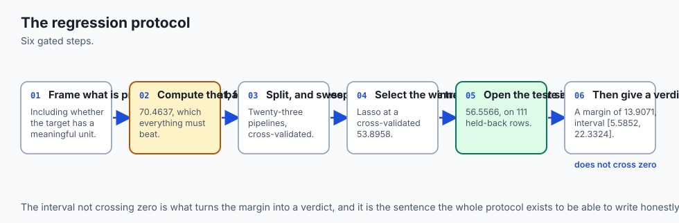

Think about a structural engineer signing off on a bridge design.

An engineer who says "the load calculation checks out" and stops has not
finished the job, even if the calculation is correct. A complete
sign-off states the baseline case — what happens if you build nothing,
or the simplest possible structure — walks through the specific loads
actually modelled, states the margin of safety with a number attached,
not just a pass/fail, and then does the part that separates a real
inspection from a rubber stamp: looks at *where the stress concentrates*.
Not "does the bridge hold," but "where would it fail first, and by how
much load would it take." An engineer who reports a single safety factor
and nothing else has produced a number, not an inspection.

That is what today's protocol is, applied to a regression model instead of a bridge. **Frame** is stating exactly what you are predicting, from what, in what population, and — critically for today's dataset — whether the number you are predicting even has a unit that means something outside the model. **Baseline** is the load case of building nothing: how wrong would you be if you just guessed the average, every time?

**Split** is deciding which measurements inform your design and which one you hold back to check yourself against, once, at the end. **Sweep and cross-validate** is trying several structural approaches and scoring each one honestly, on cases you're allowed to reconsider. **Select** is committing to the design that scored best, understanding that "scored best" is itself a number with some wobble in it.

**One test evaluation** is the single, final load test — run once, not adjusted and re-run until it passes. **Residual diagnostics** is the part a bare safety factor skips entirely: not "did it hold," but "where does it strain, does the strain grow with the load, and what do the worst five failure points actually look like." **A fairness check** is asking whether the structure is disproportionately weaker under one kind of load than another.

**Prediction intervals** replace a single point estimate — "this beam holds 40 tons" — with an honest range, and then *checks that range against reality* rather than trusting the formula that produced it. **Verdict** is all of that, together, with an interval attached to the headline number rather than a bare percentage.

Six days ago you learned pieces of this inspection in isolation. Today
you run the whole inspection, on a real structure — a real dataset — and
you find that some of what you'd expect from the textbook holds up
exactly, some of it holds up only modestly, and one of it (the fairness
check) comes back nearly flat, which is itself a finding worth having,
not a disappointment to explain away.

![Diagram: eight boxes in reading order, left to right then wrapping to a second row: frame the problem, noting the target has no physical unit; state a mean-predictor baseline of 70.4637 RMSE; split 442 rows into 331 train and 111 test; sweep 23 candidate pipelines; cross-validate on train rows only and select Lasso with alpha equal to 1 at a cross-validated RMSE of 53.8958; evaluate the test set exactly once through a gate, scoring 56.5566 RMSE; read the residual diagnostics, finding a mild heteroscedasticity signal of 0.2386, a weak curvature signal of -0.1278, and a Q-Q correlation of 0.9901; and state a verdict of a margin of 13.9071 RMSE points with a 95 percent bootstrap interval from 5.5852 to 22.3324, distinguishable from the baseline. A highlighted panel beneath states that selecting by peeking at the test set was never negative across twenty seeds, averaging a gap of 0.5279 RMSE points in the leak's favour, and that a 95 percent prediction interval achieved a realised coverage of 0.9459](./assets/protocol-architecture.svg)

## Historical background

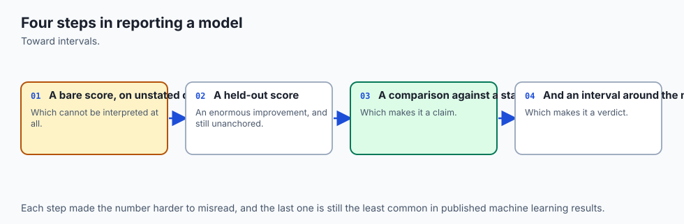

The individual pieces of today's protocol each have their own history,
which earlier days in this course already told properly — cross-
validation back to Geisser and Stone in 1974, the three-set discipline
and selection optimism from Day 144, ridge regression's origin in Hoerl
and Kennard's 1970 paper on dealing with correlated predictors, lasso's
introduction by Tibshirani in 1996. Today's history is different in
kind: it is the history of the dataset itself, because an end-to-end
exercise has to be honest about where its numbers came from.

The diabetes dataset — `load_diabetes` in scikit-learn — comes from a 2004 paper by Bradley Efron, Trevor Hastie, Iain Johnstone and Robert Tibshirani, "Least Angle Regression," published in *The Annals of Statistics*. The paper introduced LARS, a computationally efficient algorithm related to lasso, and used this dataset of 442 diabetes patients as its running example. Ten baseline variables — age, sex, body mass index, average blood pressure, and six blood serum measurements — were recorded for each patient, along with a quantitative measure of disease progression one year after baseline.

That progression measure is the target this lesson predicts, and it is worth being precise about what it is: a composite clinical score assembled from several measures of diabetes progression, with no independent physical meaning outside the study that defined it. It is not measured in units of anything a reader would recognise, and this lesson says so rather than inventing a plausible-sounding unit to make the numbers feel more concrete than they are.

Because the dataset comes from a statistics methodology paper rather than a raw clinical dataset, scikit-learn bundles it in two forms. The package's own default, `scaled=True`, returns every feature mean-centred and scaled by its standard deviation times the square root of the sample size — a transformation useful for comparing regularisation paths across features of different natural scales, but one that turns "age" into a number between roughly -0.11 and 0.11 with no year attached. This lesson asks for `scaled=False` instead, which recovers the original measurement units: age in years, blood pressure and the serum measures in their original clinical scales.

The reason matters and connects directly to Day 148: a coefficient computed on raw units means something a human can sanity-check — "one additional year of age is associated with this many points of progression" — while a coefficient on the scaled version means something only in the abstract, standardised sense the paper's authors needed for their own comparison. `load_diabetes` needs no network connection, unlike `fetch_california_housing`, scikit-learn's other bundled regression dataset, which downloads on first use — a fact this lesson checks directly rather than assuming, because this lab's safety rule forbids any network access beyond the one initial package installation.

The methodological history is the more directly relevant one. The
discipline of running a full, documented modelling pipeline — frame,
split, cross-validate, one test evaluation, residual analysis, a stated
verdict with an interval — rather than reporting whichever number a
search process happened to surface, developed in applied statistics
specifically because residual analysis has always been understood, since
at least the mid-twentieth-century development of regression diagnostics
by statisticians like John Tukey and Frank Anscombe, as inseparable from
a regression fit.

Anscombe's 1973 quartet — four datasets with nearly
identical summary statistics and wildly different underlying structure,
visible only once you plot the residuals — is the classical demonstration
that a fit statistic alone can systematically mislead. Today's lesson
inherits that discipline directly: the residual diagnostics section is
not a bonus feature bolted onto a regression project. Historically, and
in this lesson, it is the point.

## What it is — and what it is not

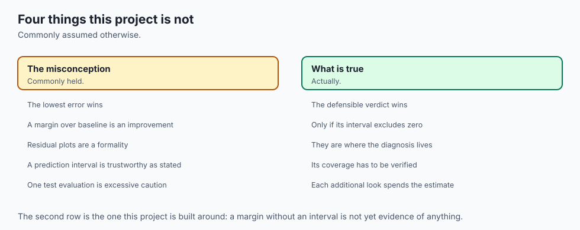

**A complete regression project is the assembly of prior disciplines
into one protocol, applied to one real dataset, producing one written
verdict with residual diagnostics at its centre.** It is not a new
algorithm — every estimator used today (`Ridge`, `Lasso`,
`LinearRegression`) was already available by Day 151, and the
`GatedTestSet` pattern is unchanged from Day 144.

Here is what today's protocol precisely is, stage by stage.

**Frame** states, in one sentence, what is being predicted, from what
features, and whether the target has a unit at all. For this lesson:
disease-progression score (unitless, composite) from 10 clinical
measurements in raw units, in the population represented by the 442 rows
of `load_diabetes`.

**Baseline** is the score of the simplest possible non-model: predict the
training mean for every row. Here, 70.4637 RMSE, -0.0001 R² — computed
before any real model is fitted, so it can act as the gate every later
result has to clear.

**Split** divides the 442 rows into 331 training rows and 111 test rows,
with the test rows held back from everything until stage six. 111 rows is
small — small enough that every interval this lesson computes is wide —
and that is reported honestly rather than smoothed over.

**Sweep and cross-validate** builds K = 23 candidate pipelines — 11
values of the regularisation strength `alpha` for ridge, 11 for lasso,
and one plain OLS — and scores every one of them with 5-fold
cross-validation on the 331 training rows, using RMSE as the metric,
chosen deliberately before any candidate is fitted. No candidate ever
sees a test row during this stage.

**Select** picks the lowest cross-validated RMSE: `Lasso(alpha=1)`, at
53.8958.

**One test evaluation** fits that winning configuration on the full 331
training rows and scores it, exactly once, against the 111 held-back
rows, wrapped in a gate that refuses a second look. The result: 56.5566
RMSE, 0.3557 R², 45.2846 MAE.

**Residual diagnostics** — this lesson's centrepiece — reads the actual
errors, not just their RMSE summary. A heteroscedasticity signal of
0.2386 (a mild tendency for errors to grow with the prediction), a
curvature signal of -0.1278 (weak, no strong missed trend), a
normal-probability correlation of 0.9901 (close to a straight Q-Q line),
and the five largest individual mistakes, inspected by name.

**A fairness check** splits the test set at the median true value and
compares RMSE on each half: 55.2464 below, 57.8601 above, a ratio of
1.0473 — nearly flat.

**Prediction intervals** build a range around each prediction from
training residuals, and measure the realised coverage on the test set:
0.9459, against a 0.95 nominal rate.

**Verdict** states a bootstrap interval around the margin over
baseline — [5.5852, 22.3324] around a margin of 13.9071 — and, separately,
reconstructs the leaky-selection mistake to show what happens when the
test set is used to select rather than to confirm: a mean gap of 0.5279
RMSE points in the leak's favour over 20 seeds, never negative.

Now the things this exercise is not.

**It is not a demonstration that regularisation dramatically fixes
multicollinearity's practical impact.** Day 150 measured VIFs as high as
59.2 on this exact dataset's raw features — real, severe
multicollinearity. Today's sweep shows that plain OLS, with no
regularisation at all, scores only 0.1968 RMSE points worse than the
regularised winner in cross-validation. Multicollinearity destabilises
individual *coefficients* dramatically, as Day 150 showed; it does not
necessarily destabilise *predictions* by anywhere near as much, because
correlated predictors can substitute for one another in the fitted
equation even as their individual weights swing wildly. Both facts are
true at once, and today's measurement is what tells you which one
applies to prediction accuracy versus coefficient interpretation.

**It is not evidence that residual diagnostics always come back
alarming.** The heteroscedasticity and curvature signals measured here
are real but modest — not the textbook-perfect flat scatter, but also
not a dramatic funnel or a visible curve. A learner who expects residual
diagnostics to always either "pass cleanly" or "reveal a crisis" has
missed the more common real case: a small, genuine signal that is worth
noting and watching, neither ignored nor treated as disqualifying.

**And it is not a clinical tool.** A 56.5566 RMSE, evaluated once on 111
rows of a dataset originally assembled for a 2004 statistics methodology
paper, is a pedagogical result about a modelling protocol applied to a
score with no independent physical meaning. Reading it as evidence about
how well machine learning predicts real diabetes progression would be
exactly the kind of unjustified leap this course has tried to train you
out of making.

## Why it was created and what problems it solves

Each of today's stages exists because a specific, nameable failure
happens when it is skipped, and every one has already been measured this
week — today's contribution is showing that they compound, in order, in
one real regression pipeline.

**Skipping frame and baseline** produces a number with no reference
point — the 68-RMSE trap this lesson opened with. A model that reports
"68 RMSE" sounds like it did something until you learn the mean-predictor
baseline gets 70.4637 for free: barely better than guessing, dressed up
in machinery.

**Skipping the split, or splitting after fitting something,** is Day
143's stage-ordering failure, still binding here: a scaler that has seen
test rows, or a hyperparameter search that peeked, leaks information into
every downstream decision.

**Skipping cross-validation in favour of a single validation split**
reintroduces the holdout-variance problem Day 144 measured directly on a
different dataset. Cross-validating the 23-candidate sweep here is what
makes the winner's cross-validated RMSE, 53.8958, a stable enough number
to select on rather than a single lucky split's noise.

**Skipping the residual diagnostics** is this lesson's own central
warning. A model can post a respectable RMSE while its errors quietly
fan out with the prediction size, or cluster in a way a single summary
number cannot show. Today's 0.2386 heteroscedasticity signal is not
dramatic enough to disqualify the model, but a reader who never checked
would not know that — they would simply not know, which is worse than
knowing the answer is "modest but real."

**Skipping the fairness check by target level** hides exactly what
today's measurement reveals: whether a model's errors concentrate on the
patients with more severe outcomes. Here the answer is reassuring — a
1.0473 ratio, nearly flat — but the check had to run for that
reassurance to mean anything. An unchecked model could just as easily
have shown a ratio of 1.5 or 2.0, and nobody would have known without
measuring.

**Skipping the interval around the margin** turns a verdict into a guess
dressed as a fact. Day 144 built the machinery for classification
accuracy; today extends it to RMSE with a bootstrap, because RMSE has no
equally simple closed-form standard error. Applied here: is 13.9071 RMSE
points of improvement meaningfully better than zero, given only 111 test
rows? The interval says yes, clearly. It could easily have said no, on a
smaller improvement or a smaller test set — which is exactly why the
bootstrap runs rather than being assumed.

**Skipping the prediction interval's coverage check** is a subtler
version of the same mistake. A model can report a "95 percent prediction
interval" that, in practice, covers 70 percent of real outcomes or 99
percent of them — nobody knows unless the realised coverage is measured
against the nominal rate, exactly as today's 0.9459-versus-0.95
comparison does.

**And skipping the discipline that keeps the test set honest** — using
it to select rather than to confirm — is the mistake exercise 10
reconstructs directly, this time for regression rather than
classification. It is, in the applied-ML literature and in real teams,
probably the single most common way a reported number ends up inflated:
not a dramatic leak, just quietly trying a few configurations against
the number you eventually report.

## How it works

### Choosing the dataset, by what is genuinely available

`sklearn.datasets` bundles exactly one regression dataset that needs no
download: `load_diabetes`. Its counterpart,
`fetch_california_housing`, downloads its data file on first use —
`inspect.signature(fetch_california_housing).parameters['download_if_missing'].default`
is `True`, confirmed directly rather than assumed. Because this lab's
safety rule forbids any network reach beyond the one initial package
install, `load_diabetes` is not a stylistic preference here; it is the
only option that satisfies the constraint.

`scaled=False` is the second deliberate choice. scikit-learn's own
default, `scaled=True`, returns every feature mean-centred and scaled to
tiny floats — age between roughly -0.11 and 0.11, with no year attached.
`scaled=False` recovers the original clinical units: age in years (19 to
79 in this dataset), body mass index and blood pressure in their
original scales. Day 148's point about coefficient interpretation only
means anything if a coefficient is computed in units a reader can
sanity-check, so this lesson asks for the raw version.

### The frame, and the baseline

The frame is one sentence: predict a composite disease-progression
score — no physical unit — from 10 real-valued clinical measurements. The
baseline is one function call — `DummyRegressor(strategy="mean")` — fitted
on the training rows and scored on the held-back test rows:

```text
mean-predictor baseline: RMSE 70.4637, R2 -0.0001
```

Every later number in this lesson is read against 70.4637.

### The split

`train_test_split(X, y, test_size=0.25, random_state=0)` gives 331
training rows and 111 test rows. A 25 percent test set on 442 total rows
is small on purpose — small enough that every interval computed below is
wide, and that width is the honest consequence of the data available,
not a flaw in the method.

### The sweep

Twenty-three candidate pipelines, built with scikit-learn's `Pipeline` so
`StandardScaler` is refit inside every cross-validation fold rather than
fitted once on everything — Day 143's ordering rule, enforced by the
estimator's own contract:

```python
from sklearn.pipeline import Pipeline
from sklearn.preprocessing import StandardScaler
from sklearn.linear_model import Ridge, Lasso, LinearRegression

alphas = [0.001, 0.003, 0.01, 0.03, 0.1, 0.3, 1, 3, 10, 30, 100]

configs = []
for a in alphas:
    configs.append(("ridge", a, lambda a=a: Pipeline([
        ("scale", StandardScaler()), ("clf", Ridge(alpha=a)),
    ])))
for a in alphas:
    configs.append(("lasso", a, lambda a=a: Pipeline([
        ("scale", StandardScaler()), ("clf", Lasso(alpha=a, max_iter=20000)),
    ])))
configs.append(("ols", 0.0, lambda: Pipeline([
    ("scale", StandardScaler()), ("clf", LinearRegression()),
])))
```

That is K = 23, counted, not estimated.

### Cross-validate, then select — with the metric decided first

RMSE is chosen as the selection metric before any candidate is fitted —
Day 152's whole argument that the metric is a choice, made concretely
here, in the target's own unitless composite-score points rather than
some borrowed unit that does not apply:

```python
from sklearn.model_selection import KFold, cross_val_score

splitter = KFold(n_splits=5, shuffle=True, random_state=0)
scored = [
    (family, param, -cross_val_score(make(), x_train, y_train,
        cv=splitter, scoring="neg_root_mean_squared_error").mean())
    for family, param, make in configs
]
scored.sort(key=lambda row: row[2])
winner_family, winner_param, winner_cv_rmse = scored[0]
```

The winner: `Lasso(alpha=1)`, cross-validated RMSE 53.8958. Plain OLS
scores 54.0926 at the same seed — only 0.1968 points behind, even though
Day 150 measured VIFs as high as 59.2 on these exact features.
Multicollinearity's dramatic effect was on individual coefficients, not
on this margin.

### One test evaluation, gated

```text
class GatedTestSet:
    def evaluate(self, model):
        if self.evaluations >= 1:
            raise TestSetTouchedTwice(...)
        self.evaluations += 1
        pred = model.predict(self._X)
        return rmse, r2, mae   # computed once, from this one prediction
```

Fitting the winner on the full 331 training rows and calling
`gate.evaluate(fitted)` once gives:

```text
test RMSE: 56.5566   R2: 0.3557   MAE: 45.2846
```

A second call raises `TestSetTouchedTwice`.

### The margin, with a bootstrap interval

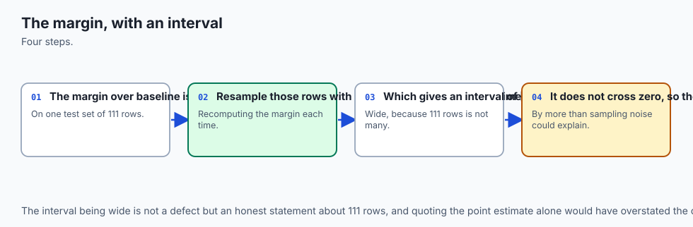

The margin over baseline is `70.4637 - 56.5566 = 13.9071` RMSE points.
Because RMSE has no equally simple closed-form standard error the way a
proportion does, the interval around that margin comes from resampling
the 111 test rows with replacement 2000 times, recomputing both RMSEs on
each resample:

```text
margin = baseline_rmse - model_rmse = 13.9071
95 percent bootstrap interval on the margin: [5.5852, 22.3324]
```

The interval's lower bound, 5.5852, is comfortably positive: this
model's improvement is distinguishable from zero at this test-set size.
It could easily have come out otherwise, on a smaller improvement or a
smaller test set — that is precisely why the bootstrap runs rather than
being assumed.

### Residual diagnostics: the centrepiece

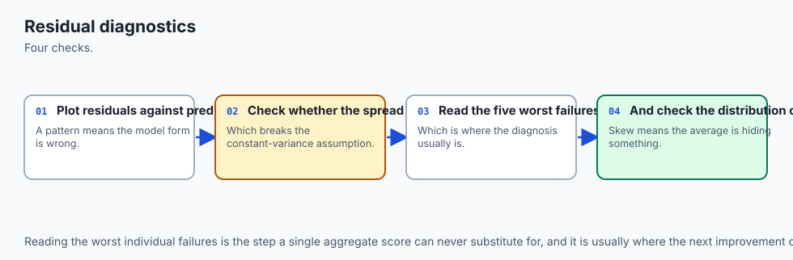

This is the part of the protocol no earlier day owns, and it is where
today's real attention goes.

**Residual mean and spread.** The 111 test residuals average -3.6262
with a standard deviation of 56.4402 — centred close to zero, as a
reasonably well-fit model's residuals should be.

**Heteroscedasticity — do errors grow with the prediction?** Measured as
the correlation between the fitted value and the *absolute* residual:

```text
heteroscedasticity signal, corr(fitted, |residual|): +0.2386
```

A value of exactly zero would mean error size is unrelated to the
prediction; ±1 would mean a dramatic, unmissable funnel. 0.2386 is
real — not zero — but modest: a mild tendency for larger predictions to
carry somewhat larger errors, worth watching rather than alarming.

**Curvature — is there a missed non-linear trend?** Measured as the
correlation between the *squared* fitted value and the signed residual:

```text
curvature signal, corr(fitted^2, residual): -0.1278
```

Weak. No strong evidence that a linear model is missing an obvious
curve in this data.

**Normal probability — are the residuals shaped like a bell curve?** A
from-scratch Q-Q correlation, built without scipy (not one of this lab's
three pinned dependencies) using a rational approximation to the inverse
normal CDF:

```text
normal-probability (Q-Q) correlation: 0.9901
```

1.0 would be a perfectly straight Q-Q line. 0.9901 is close: these
residuals are close to normally distributed, even on real data with only
111 test rows — a genuinely reassuring result for a model whose interval
arithmetic (both the margin bootstrap and the prediction interval below)
implicitly leans on residuals not being wildly non-normal.

**The five largest individual mistakes, named:**

```text
row  60: true=   52.0  pred=  209.3  residual=  -157.3
row  65: true=  302.0  pred=  153.9  residual=  +148.1
row  24: true=   68.0  pred=  202.8  residual=  -134.8
row   9: true=   99.0  pred=  230.1  residual=  -131.1
row  64: true=  132.0  pred=  261.3  residual=  -129.3
```

An RMSE of 56.5566 does not tell you that this model's worst single
mistake is a patient predicted at 209.3 whose true progression score was
52.0 — a residual nearly three times the RMSE itself. Reading the
largest individual residuals, not just the summary statistic, is how you
find out a model has specific, severe failure modes rather than
uniformly moderate error.

### Is the model worse for high-value targets? Measured, not assumed.

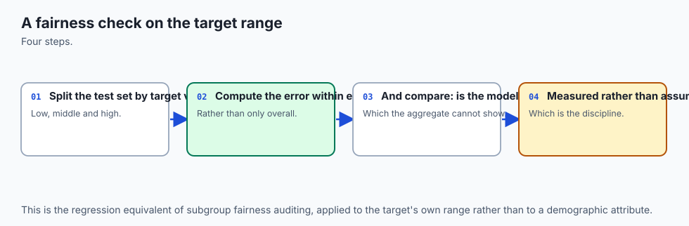

```text
RMSE on below-median targets: 55.2464
RMSE on above-median targets: 57.8601
ratio (high / low): 1.0473
```

Only 4.73 percent worse on the more severe half of test cases at this
seed. On a disease-progression score, this is a fairness-relevant
question, not only a statistical one — is the model systematically less
accurate for patients whose condition has progressed further, which is
exactly the group where an accurate prediction might matter most? The
honest answer here is nearly flat. That is a real finding: the check had
to run for the reassurance to mean anything, and a different dataset, or
a different seed, could easily have surfaced a larger asymmetry.

### The leaky version, run alongside the honest one

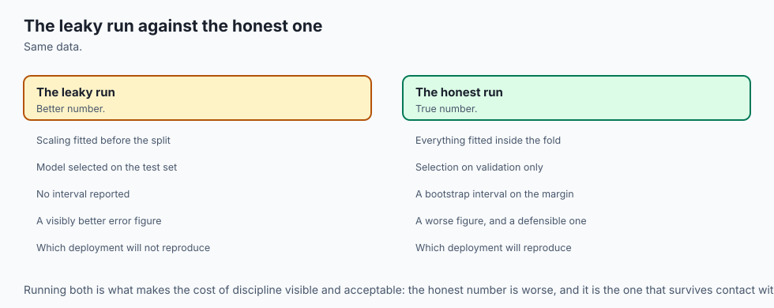

Reconstructing Day 147's central mistake, for regression: selecting a
model by fitting every candidate and scoring it *directly on the test
set*, keeping whichever produces the lowest RMSE, instead of selecting
on cross-validated training rows and looking at test once.

```python
def leaky_selection_test_rmse(x_train, y_train, x_test, y_test):
    best_rmse = None
    for _family, _param, make in configs:
        pipe = make().fit(x_train, y_train)
        rmse = compute_rmse(y_test, pipe.predict(x_test))
        if best_rmse is None or rmse < best_rmse:
            best_rmse = rmse
    return best_rmse
```

At the headline seed, the leaky search reports 55.5212 RMSE against the
honest 56.5566 — a gap of 1.0354 points in the leak's favour. Over 20
seeds, the mean gap is +0.5279 (standard deviation 0.3686, minimum
0.011, maximum 1.1451), and — the structural fact worth remembering —
**it is never negative, at any seed tried.** The leaky search considers
the honestly selected winner among its 23 candidates and can only
replace it with something that scored at least as well (as low or lower
RMSE) on the very rows it was allowed to peek at. It cannot report a
worse number. It can only match or improve on the honest score, which is
not luck — it is the mechanism.

### Prediction intervals, and their realised coverage

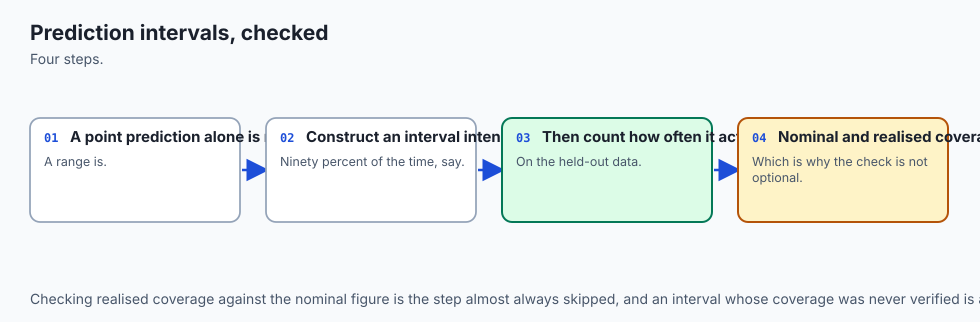

A point prediction alone is not a complete answer — "56.5566 RMSE" tells
you about average error, not about the range any individual prediction
might plausibly be wrong by. A prediction interval addresses that, and
this lesson builds one the honest way: from **training** out-of-fold
residuals only, via `cross_val_predict`, never from the test residuals
themselves — sizing an interval from the same data it is checked against
would be circular, the same discipline error `GatedTestSet` exists to
prevent.

```text
95 percent prediction interval half-width (from TRAIN out-of-fold residuals): +/-105.8797
realised coverage on the 111 test rows: 0.9459  (nominal: 0.9500)
```

0.9459 against a stated 0.95 is close — a prediction interval whose
nominal rate roughly matches what actually happens, checked rather than
assumed. A separate ten-seed measurement (not part of the harness's
asserted claims, reported here for context) gives a mean coverage of
0.9558, ranging from 0.9369 to 0.9910 — consistently near the nominal
rate, with the ordinary scatter you would expect on a test set this
small.


## An everyday analogy

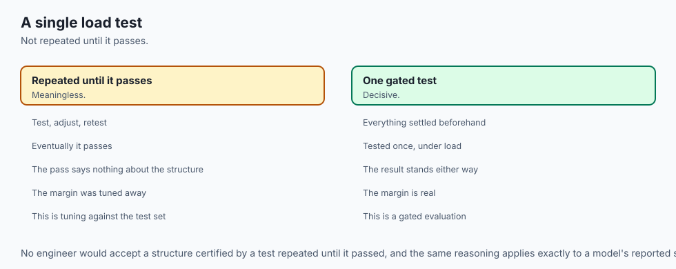

A home inspector examining a house before sale.

**Baseline** is what you'd predict about any house's condition knowing
nothing but the neighbourhood average sale price adjusted for square
footage — the number your specific inspection has to beat to be worth
paying for.

**The frame** is deciding, precisely, what you are assessing: not "is
this a good house" but "what is this specific house's likely repair
cost, based on this specific inspection."

**The split** is deciding, before entering the house, which rooms and
systems inform the written report (every room, every visible system,
looked at as many times as needed) and which single test is held back
for a final, one-time check — say, a water-pressure test run once, at
the very end, purely to confirm nothing was missed.

**The sweep** is trying several different weighting schemes for
combining observations into a repair-cost estimate — weight the roof
heavily, weight the foundation heavily, weight the electrical system
heavily — and scoring each scheme against past inspected houses whose
actual repair costs are already known.

**Cross-validation** is checking each weighting scheme against several
different subsets of those past houses, not just one, so a scheme that
happened to work on one arbitrary batch of history does not get crowned
the winner by luck.

**Selection** is the inspector settling on one scheme — the one that
predicted past repair costs most accurately, on average, across those
checks.

**The one look** is applying that agreed-upon scheme to the actual house
being inspected today, once, and writing the number down. Not
re-weighting after peeking at what the final number "would have been"
under five different schemes and quietly picking whichever gives the
number the seller wants to see.

**Residual diagnostics** is the inspector who, instead of reporting only
"estimated repair cost: $8,400," goes back through every past house
where the estimate was wrong and checks: were the misses bigger on
expensive houses than cheap ones? Did the errors cluster around a
specific type of house? Were the five worst misses all the same kind of
mistake, or five different kinds? An inspector who reports the average
error and stops has told you less than one who tells you where the
estimate tends to fail.

**The fairness check** is asking, specifically: are inspection estimates
systematically less accurate for the most expensive, most severely
damaged houses — the ones where an accurate number matters most to
someone deciding whether to buy?

**Prediction intervals** are the inspector who says "$8,400, plus or
minus $2,100" instead of a bare number — and then, crucially, checks
their own track record: across the last hundred houses where they gave a
range, did the true repair cost actually fall inside that range roughly
95 percent of the time, as claimed? An inspector whose "95 percent"
ranges are only right 70 percent of the time has a miscalibrated
instrument, and the only way to find that out is to check.

**The verdict** is not "the house checks out." It is "here is the
estimate, here is the honest range around it, here is where the estimate
tends to be wrong, and here is whether this specific house's estimate
clears the noise level given how many past houses this scheme was
checked against."

The analogy earns its keep on the leaky-selection failure. Imagine an
inspector who, instead of trusting the pre-agreed weighting scheme,
quietly tries all twenty-three schemes on *this specific house*,
compares each one's estimate against a quick informal peek at what the
seller's own contractor quoted, and reports whichever scheme's estimate
was closest — then writes it up as though it were the pre-agreed
process's output. That report can never look worse than the honest
process would have; at absolute worst it ties. The dishonesty is
invisible in the number itself; it lives entirely in which of
twenty-three schemes got reported after the fact.

## Examples in practice

### A learner who reports RMSE and stops

The most common mistake this lesson is built to correct: a project that
reports "56.5566 RMSE" and nothing else. Three follow-up questions
immediately matter, none of them answered by the headline number alone.
56.5566 *compared to what* — a baseline of 70.4637, where the same
number would mean real progress, or a baseline of 58, where it would
mean almost nothing? What do the *residuals* look like — flat and normal,
or fanning out and skewed? And is the model's error worse for the cases
that matter most — here, patients with more severe progression? All
three questions have concrete, measured answers in this lesson, and none
is visible in 56.5566 by itself.

### A team that tunes against its own held-out set without noticing

The most common real instance of the leaky-selection mistake rarely
looks like a single dramatic error. It looks like a team with one
official test set that tries a model, checks the test RMSE "just to
confirm," tries a hyperparameter tweak, checks again, tries a different
feature transform, checks again — and after the fifth check, reports the
best-scoring version as "our result." No single check felt like
cheating.

The cumulative effect is exactly `leaky_selection_test_rmse`: K
looks at the test set disguised as one, and the reported number can only
ever look as good or better than an honest single look, never worse. The
fix is not vigilance — it is a `GatedTestSet` that makes the sixth look
impossible rather than merely inadvisable.

### A model comparison that never checks its own margin against an interval

An analyst is asked whether a new pricing model beats the old one by 3
RMSE points. Before touching any code: on a test set of 111 rows,
resolving that comparison with confidence requires knowing the noise
floor a bootstrap of that size would produce — this lesson's own margin
interval, [5.5852, 22.3324] around a 13.9071-point margin, has a
half-width around 8.4 points. A claimed 3-point improvement on a
similarly small test set would very likely be swallowed by that same
noise, and the honest answer would be "this comparison cannot be made
with the data available," delivered before a single model is retrained.

### Reading a published model's headline RMSE without the residuals

A vendor reports "our model achieves 12 percent lower RMSE than the
baseline." The number alone answers almost nothing about whether the
model is trustworthy in practice. Are the errors evenly spread, or does
the model have a handful of catastrophic misses concentrated in one
subgroup — exactly the pattern today's largest-residuals check and
fairness-by-target-level check are built to surface? A model that is
excellent on average while being reliably, severely wrong on a specific
category of case can post an impressive headline RMSE while being far
less trustworthy than the number alone suggests.

## Implications: security, privacy, performance, scalability, and cost

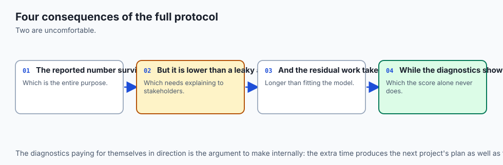

**The cost of skipping a baseline is a project that never gets
challenged.** A model reporting 68 RMSE on data where the mean-predictor
baseline is 70.4637 will pass every casual review, because 68 *sounds*
like an improvement. The baseline is a one-line, zero-cost check that
catches this before anyone spends a week building on top of it.

**The cost of a leaky selection is a number that fails in production and
nowhere else.** Every metric a team reports internally can look
consistent right up until deployment, because the leak lives entirely in
how the number was produced, not in any property of the data a dashboard
could flag. `GatedTestSet` is a cheap, mechanical defence against exactly
this — one object, refusing a second call, costs nothing to add and
closes the most common real-world version of this mistake.

**Residual diagnostics are a reliability control, not a nicety.** A
model whose errors fan out with the prediction size (a positive
heteroscedasticity signal, as measured here) will be systematically
overconfident on its largest predictions if that signal is ignored — and
a downstream system that treats every prediction as equally reliable
inherits that overconfidence silently.

**A fairness check on error by target level is a safety control in any
domain where the target correlates with stakes.** On a disease-
progression score, a model systematically worse for more severe cases
would be worse exactly where accuracy matters most. This lesson's
measured result — nearly flat, 1.0473 — is reassuring, but only because
the check ran; an unchecked model provides no such reassurance by
default.

**Computing a bootstrap interval costs 2000 extra RMSE calculations on a
test set that is already small — cheap here, and cheap on almost any
dataset this size.** The trade-off Day 144 named for accuracy intervals
applies identically here: on a real project of this scale, skipping the
interval to save compute is never the right call.

**And the largest, least visible cost is a project that never runs the
residual diagnostics because "the RMSE already looked fine."** This
lesson's own result — a modest but real heteroscedasticity signal, a
near-flat but genuinely measured fairness check, a prediction interval
whose coverage had to be checked rather than assumed — is the argument
for running the full protocol, not evidence that any of it was
unnecessary because nothing came back alarming.

## Alternatives: free, open source, and commercial

### scikit-learn's own regression and selection tools — used throughout this lesson

**When to choose them:** for essentially all in-memory regression work.
Every stage of today's protocol — `Pipeline`, `KFold`, `cross_val_score`,
`cross_val_predict`, `DummyRegressor` — is free, BSD-3-Clause licensed,
with no paid tier, and every number in this lesson comes from them.

**How to use them:** chained together exactly as shown in "How it
works" — a `Pipeline` per candidate, `cross_val_score` for the sweep,
`cross_val_predict` for out-of-fold residuals, and hand-rolled bootstrap
and residual-diagnostic functions, since scikit-learn does not ship an
interval helper for RMSE or a Q-Q correlation directly.

**Watch for:** `Pipeline` protects you from leaking a fitted transform
across the train/test boundary, but it does not protect you from leaking
the *test set itself* into selection — this lesson's leaky-selection
exercise happens entirely outside any estimator's contract, in how you
choose to call `.score()` or `.predict()`.

### statsmodels — described, not used here

**When to choose it:** when you need classical inferential statistics
alongside prediction — p-values, confidence intervals on individual
coefficients, formal heteroscedasticity tests like Breusch-Pagan, or
residual diagnostic plots built in. `statsmodels`'s `OLS` class returns a
results object with `.summary()`, giving a full classical regression
table scikit-learn intentionally omits.

**What it adds:** built-in statistical tests this lesson's
correlation-based signals approximate by hand — a formal Breusch-Pagan
test for heteroscedasticity, a Jarque-Bera test for normality, rather
than the correlation-based approximations this lesson builds to avoid a
scipy dependency.

**Honest note:** this lab is not installed with `statsmodels` and no
output from it is reproduced anywhere in this lesson. The residual
diagnostics here are hand-built specifically to work with only the three
pinned packages (`numpy`, `scikit-learn`, `pytest`); a project already
using `statsmodels` would reasonably prefer its formal tests over this
lesson's correlation-based signals.

### scipy.stats — described, not used here

**When to choose it:** for a proper Q-Q plot (`scipy.stats.probplot`), a
formal Shapiro-Wilk normality test, or a closed-form confidence interval
on RMSE derived from the chi-squared distribution of squared residuals
under a normality assumption.

**What it costs:** nothing — free, BSD-licensed, and already installed
as a scikit-learn dependency on most systems, though not one this lab
imports directly.

**Honest note:** this lesson builds its own normal-probability
correlation from scratch — a rational approximation to the inverse
normal CDF — specifically so the lab's three pinned dependencies
(`numpy`, `scikit-learn`, `pytest`) stay sufficient. Day 153's habit,
applied again: build the minimal piece you need rather than reach past
the pins.

### Managed experiment-tracking and model-monitoring platforms — not used here

**The relevant capability for this lesson:** automatic residual
dashboards and drift monitoring that would compute today's
heteroscedasticity and fairness-by-target-level checks continuously in
production, rather than once at project time.

**Free versus paid:** most offer a free tier for individual use and
charge for team or production features; no specific price is quoted
here, because pricing changes faster than this lesson does, and an
unverified figure is worse than none. Free, self-hosted, open-source
options exist and can compute the same diagnostics this lesson builds by
hand.

## Comparison with related concepts

| Concept | What it does | How it relates to today |
| --- | --- | --- |
| A single train/test split | one division, one score | What this lesson's split stage builds on, and what cross-validation replaces for selection |
| Cross-validation | every training row tests exactly once | Used here to select among 23 candidates without ever touching test rows |
| Bootstrap interval on a margin | resamples the test set to size uncertainty around a difference | This lesson's verdict machinery, extending Day 144's accuracy interval to RMSE, which has no equally simple closed form |
| Residual-vs-fitted diagnostics | reads the pattern in errors, not just their summary | This lesson's centrepiece; owned by no earlier day in this course |
| Q-Q / normal-probability check | tests whether residuals are shaped like a bell curve | Built from scratch here without scipy; scores 0.9901, close to normal |
| Error by target level | RMSE split by a covariate of interest | This lesson's fairness check; came back nearly flat, a real and valuable finding |
| Leaky selection | choosing a model by scoring it on the test set | Deliberately reconstructed in exercise 10, for regression, mirroring Day 147's classification version |
| GatedTestSet | mechanically enforces one test evaluation | Reused unchanged from Day 144 and Day 147, protecting the real test rows of a real regression project |
| Prediction interval, with measured coverage | a range around a prediction, checked against reality | This lesson's own interval, sized from training residuals only, checked at 0.9459 against a 0.95 nominal rate |

Two rows deserve a closing note.

**The residual-diagnostics row is this whole lesson's reason for
existing.** No earlier day in this course stops to read what the errors
themselves look like rather than summarising them into one number. Every
other row in this table has an earlier-day counterpart; this one does
not, and it is deliberately the section this lesson spends the most
attention on.

**And the leaky-selection row is the mistake most likely to happen to
you specifically**, more than group leakage or temporal leakage, because
it requires no unusual data structure — just checking the test score one
extra time. `GatedTestSet` exists because good intentions are not a
reliable enough defence against a mistake this easy to make by accident,
in regression exactly as much as in classification.

## When to use it — and when not to

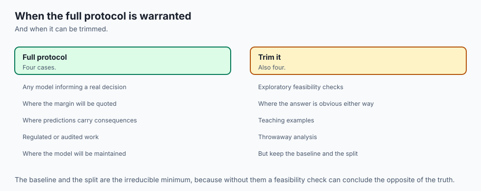

**Run the full protocol whenever a regression result will inform a real
decision** — a deployment, a publication, a pricing model someone will
act on. The cost is an afternoon and a handful of extra function calls;
the alternative cost, when this protocol is skipped, is a number that
fails exactly when it matters most.

**Compute the residual diagnostics on every real regression project, not
only when you suspect a problem.** This lesson's own result — real but
modest signals, neither dismissed nor treated as a crisis — was only
knowable because the check ran.

**Open the fairness-by-target-level check whenever the target correlates
with real-world stakes**, which is most regression problems worth
building. A flat overall RMSE can hide a model that is systematically
worse exactly where accuracy matters most.

**Compute the bootstrap interval around any claimed margin before
treating a model comparison as settled.** An improvement smaller than
the interval's half-width is not evidence of anything, however good the
point estimate looks.

**Check the realised coverage of any prediction interval you report.**
A "95 percent interval" that has never been checked against reality is a
claim, not a measurement.

**And use `GatedTestSet`, or an equivalent, whenever more than one
person or more than one script can reach the test set** — the
leaky-selection mistake this lesson reconstructs almost never happens on
purpose.

**When the full protocol is more than the situation needs:** a genuinely
exploratory first look at brand-new data, where nothing will be reported
or deployed and the goal is purely to build intuition, can reasonably
skip the formal split-and-gate machinery — provided nobody later reuses
that exploratory number as though it were a validated result. The moment
a number leaves the exploratory phase and starts informing a decision,
the full protocol applies.

### The AI thread

Every stage of today's protocol gets harder, not easier, at the scale
modern AI systems operate at, and the residual-diagnostics finding is
the sharpest version of why.

**A large model's "residuals" are almost never inspected at the level of
individual failures the way today's five worst mistakes were.** A
language model evaluated on an aggregate score — perplexity, an average
human-preference rating, a benchmark accuracy — can carry the exact
regression-diagnostics failure this lesson measured: a model that looks
excellent on average while being reliably, severely wrong on a specific,
identifiable category of input.

Today's discipline — read the worst
individual mistakes by name, not just the summary statistic — is exactly
what a responsible evaluation of a much larger system still requires,
and it is far more often skipped at that scale than at this one, because
there is no equivalent of "print the five worst rows" for a system
processing millions of interactions without deliberate sampling.

**The fairness-by-target-level check has a direct, higher-stakes
analogue in AI evaluation.** This lesson asked whether errors were worse
for patients with more severe disease progression — the group where
accuracy plausibly matters most. The same question, asked of a language
model, becomes: is the system systematically less reliable for the
users, languages, or use cases where a mistake would be most costly?

A
model with an excellent aggregate score and a specific, unmeasured
subgroup where it fails badly is not a hypothetical — it is the most
common way an aggregate evaluation misleads, and this lesson's flat 1.0473
result is a reminder that the check sometimes comes back reassuring too;
the point is that you cannot know which case you are in without running
it.

**And prediction intervals with checked coverage are the honest
alternative to a model that reports only a point estimate with false
confidence.** A large language model producing a single "best" answer,
with no calibrated sense of its own uncertainty, is the aggregate-scale
version of a regression model reporting 56.5566 RMSE with no interval
attached. The discipline this lesson teaches at the scale of 111 test
rows and one prediction interval — build the range from held-out data,
then measure whether reality actually falls inside it as often as
claimed — is the same discipline a trustworthy AI system needs at any
scale, and it is measured far less often than the raw accuracy number
that gets the headline.

## The AI connection

- **A complete project is a sequence of gates**, and the discipline transfers to AI systems
  unchanged.
- **A verdict needs an interval**, not a point estimate — an improvement that could be
  sampling noise is not an improvement.
- **The test set is opened exactly once**, which is what makes its number worth quoting.
- **Residual diagnostics ask where the model strains**, which a single aggregate score can
  never show.
- **The same protocol governs shipping an AI feature**, with an evaluation set in place of a
  test set and the same rule about spending it once.

## Knowledge check

1. `candidate_summaries` (via exercise 1's assertions) confirms
   `load_diabetes` needs no download while `fetch_california_housing`
   does. Name the specific attribute checked, and explain why this
   lesson treats it as disqualifying rather than merely inconvenient.

2. Plain OLS scores 54.0926 cross-validated RMSE, only 0.1968 points
   behind the winning `Lasso(alpha=1)` at 53.8958 — yet Day 150 measured
   severe multicollinearity (VIFs up to 59.2) on these exact features.
   Explain how both facts can be true at once.

3. The margin over baseline is 13.9071 RMSE points, and its 95 percent
   bootstrap interval is [5.5852, 22.3324]. State the rule connecting
   these two numbers to the verdict, and describe a hypothetical margin
   size that would have forced a "cannot distinguish" verdict instead.

4. The heteroscedasticity signal is 0.2386 and the curvature signal is
   -0.1278. Explain what each one measures, and why neither value alone
   justifies calling this model's residuals either "perfectly
   well-behaved" or "seriously flawed."

5. The fairness-by-target-level check gives a ratio of 1.0473. Explain
   why this near-flat result is still a valuable finding, rather than a
   sign the check was unnecessary.

6. In the leaky-selection exercise, the RMSE gap is sometimes small
   (0.011) but never negative, across twenty seeds. Explain the
   mechanism that makes a negative gap impossible.

7. The prediction interval's half-width comes from training out-of-fold
   residuals, never from the test residuals. Explain what would go wrong
   if the test residuals were used instead, and connect it to a pattern
   from an earlier day in this course.

8. State, in order, the stages of this lesson's protocol, and name one
   specific measured failure from Days 148-153 or Day 144/147 that each
   stage defends against.

## Hands-on exercise

Today's lab, `A Complete Regression Project`, runs the entire protocol
on the diabetes-progression dataset and asks you to verify every
measured number along the way.

Fourteen exercises. The first four establish the dataset choice, the
baseline, the split and the sweep. The next three build the
cross-validated selection, the gated one-time test evaluation, and the
bootstrap interval around the margin. The next three cover residual
diagnostics — the centrepiece — and the fairness check by target level.
The last four cover the leaky-selection reconstruction and the
prediction interval's realised coverage.

Build the environment, then work through
`starter/test_regression_claims.py`, replacing one `pytest.skip` at a
time.

### Expected output

The harness ends with:

```text
---------------------------------------------------------------
15 checks, 0 failure(s)
```

and exits 0. `pytest examples -q` reports `19 passed`, and
`pytest starter -q` reports `5 passed, 14 skipped` until you begin.

The measured table includes:

```text
  K = 23 candidate pipelines: 11 ridge, 11 lasso, 1 plain OLS
  winner: lasso (alpha=1)  5-fold CV RMSE = 53.8958
  test RMSE: 56.5566  R2: 0.3557  MAE: 45.2846
  margin (baseline RMSE - model RMSE): +13.9071
  95 percent bootstrap interval on the margin: [5.5852, 22.3324]
  heteroscedasticity signal, corr(fitted, |residual|): +0.2386
  curvature signal, corr(fitted^2, residual): -0.1278
  normal-probability (Q-Q) correlation: 0.9901
  RMSE on below-median targets: 55.2464   above-median: 57.8601   ratio: 1.0473
  mean leaky gap: +0.5279  sd 0.3686  min +0.0110  max +1.1451
  95 percent prediction interval half-width: +/-105.8797  realised coverage: 0.9459
```

### Validate your work

1. `bash tests/run_tests.sh; echo "exit=$?"` reports `15 checks, 0
   failure(s)` and `exit=0`. Capture the harness's own exit status.

2. `.venv/bin/pytest examples -q` reports `19 passed`.
3. `.venv/bin/python3 examples/report_measurements.py | diff - expected-output/measured-values.txt`
   produces no output.

4. When you have finished every exercise, `pytest starter -q` reports
   `19 passed`.

5. Break one assertion on purpose, confirm the harness fails, restore it.

### Troubleshooting

**My winning configuration differs from the lesson's.** Check
`expected-output/FIELDS.md`. Several configurations score within two
tenths of a point of `Lasso(alpha=1)`, and different NumPy or scikit-learn
versions can legitimately shuffle a near-tie differently — Day 145
already established that near-tied configurations trade places under
resampling.

**The bootstrap interval doesn't match my by-hand calculation.**
`margin_bootstrap_interval` seeds its own random generator internally
(default `seed=0`); calling it with different arguments, or a different
`n_boot`, will legitimately produce different bounds.

**My leaky-gap numbers differ from the lesson's.** Almost certainly fine
at the level of the decimals. What must hold across the full 20-seed
sweep is that the gap is never negative.

**`import file mismatch`.** You ran `pytest examples starter` together.
Run them separately.

### Common mistakes

**Reporting the test RMSE without the margin interval.** A point
estimate with no half-width is not a verdict, and this lesson's own
comparison — 13.9071 improvement against an interval half-width around
8.4 points — would have looked very different at a smaller improvement
or a smaller test set.

**Treating the modest residual-diagnostic signals as either "nothing" or
"a crisis."** Neither reading matches what was actually measured: real,
non-zero, and not dramatic.

**Sizing a prediction interval from the test residuals themselves.**
This is circular — using the answer to size the check against that same
answer — and it is the same discipline error `GatedTestSet` exists to
prevent for point predictions.

**Concluding the leaky-selection gap is "basically zero and therefore
harmless" because some seeds are small.** The gap's size varies, but it
is never negative across twenty seeds — the mechanism, not the size, is
the point.

## Practice assignment

Take a regression result you already have — from a project, a tutorial,
or your own experiments — and run this lesson's protocol against it,
honestly.

1. **State your baseline.** What does predicting the mean get you for
   free? If you cannot answer this in one line, your project has not
   been framed yet.

2. **Count your K.** How many models or hyperparameter settings were
   tried against whatever number you are about to report? Estimate it
   honestly, in writing, even if the true count is embarrassing.

3. **Compute a margin interval**, using a bootstrap over your own test
   set, and compare it to whatever improvement you are claiming.

4. **Read your residuals.** Plot or compute the heteroscedasticity and
   curvature signals this lesson built, and name the five largest
   individual mistakes your model makes.

5. **Check whether your errors are worse for a specific group** that
   matters in your domain — not just which group is more frequent, but
   which group's accuracy carries the highest real-world stakes.

6. **If you report a prediction interval, check its realised coverage**
   against its nominal rate. If you have never checked this, say so
   plainly — that is a finding too.

The deliverable is the audit, in writing, not a better model.

## Extension challenge

Pick one and measure it.

1. **Nested cross-validation.** Implement an inner selection loop and an
   outer scoring loop, and measure whether the gap between cv_rmse and
   the outer-scored RMSE shrinks further than this lesson's single test
   evaluation showed. Report the cost in fits.

2. **A fourth candidate family.** Add `ElasticNet` to the sweep, re-run
   the full protocol, and report whether the winner or its
   cross-validated RMSE changes at the headline seed.

3. **Quartile-level fairness.** Split the test set into quartiles rather
   than halves and determine whether the fairness-by-target-level signal
   strengthens toward the extremes rather than staying flat.

4. **Scale the test set and re-measure the leaky gap.** Repeat the
   leaky-vs-honest comparison with a 60/40 train/test split instead of
   75/25, so the test set holds roughly 177 rows instead of 111, and
   report whether the mean gap and its granularity both change.

5. **A per-row prediction interval.** Build a version whose half-width
   varies with the fitted value, rather than staying constant, and
   compare its coverage and average width to this lesson's constant-width
   version.

6. **Break independence on purpose.** Duplicate a fraction of the rows
   into both the train and test splits before running the sweep, and
   measure how much the reported test RMSE improves (misleadingly) —
   Day 144's group-leakage lesson, reconstructed on real regression data.
