## Why this matters

In Weeks 21 and 22, we explored linear regression: fitting hyperplanes to predict continuous quantities such as prices, dosages, and progression indices. But many of the most critical decisions in science, technology, and engineering are categorical. Is this email spam or inbox-worthy? Is this tumor malignant or benign? Will this transaction settle normally or trigger fraud review? Will this customer renew their subscription or churn?

Attempting to solve these binary classification problems with ordinary least-squares regression immediately produces mathematical pathologies. If you code outcomes as 0 and 1 and fit a straight line, your model will cheerfully predict values of -0.42 for low-risk cases and +1.68 for high-risk cases. What does a probability of 1.68 mean? Worse, the assumption of homoscedasticity—constant error variance across all inputs—is shattered because binary variance is mathematically fixed to `p(x) * (1 - p(x))`, which varies with every feature vector.

Logistic regression is the foundational workhorse of probabilistic classification. It does not fit a line to the labels; instead, it models the **log-odds** (logit) of the positive class as a linear combination of inputs, and maps that linear score through the **logistic sigmoid** function. The result is a mathematically coherent, well-calibrated probability bounded strictly within `(0, 1)`, trained by Maximum Likelihood Estimation. Understanding logistic regression from first principles unlocks every subsequent classification model in machine learning, from generalized linear models to multi-layer neural networks.

---

## The idea in plain language

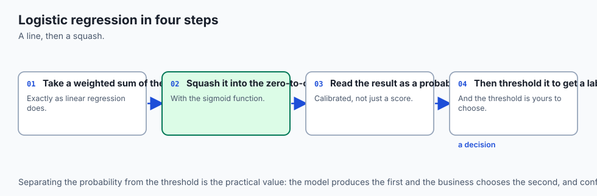

Imagine a medical test that measures a patient's biomarker level to estimate the risk of a disease. If the biomarker level is very low, the risk is nearly zero. As the biomarker rises, the risk increases gradually at first, then climbs rapidly through a critical threshold, and finally levels off asymptotically near 100%.

A straight line cannot capture this natural phenomenon: it would predict negative risk below some threshold and risk exceeding 100% above another. What we need is an S-shaped curve (a **sigmoid**) that transitions smoothly from 0 to 1.

Logistic regression works in two distinct stages:

1. **Linear Scoring:** It multiplies each feature `x_j` by a learned weight `w_j`, sums them up, and adds an intercept `b`, producing a single continuous score `z = w_1*x_1 + w_2*x_2 + ... + w_d*x_d + b`. When `z` is large and positive, evidence heavily favors the positive class. When `z` is large and negative, evidence heavily favors the negative class. When `z = 0`, the evidence is completely balanced.
2. **Sigmoid Mapping:** It passes the score `z` through the logistic function `sigma(z) = 1 / (1 + exp(-z))`. If `z = 0`, `sigma(0) = 0.50` (a 50% probability). If `z = 2.2`, the probability is 90%. If `z = -2.2`, the probability is 10%.

To make a categorical decision (such as sending an alert), we compare this predicted probability against a decision threshold `tau` (by default, 0.50). If `P(y=1|x) >= 0.50`, we predict class 1; otherwise, we predict class 0.

---

## Historical background

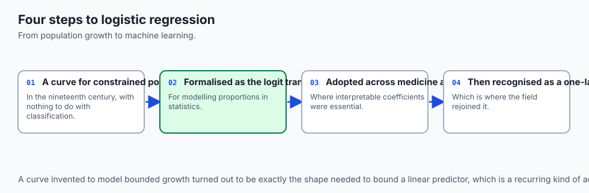

The logistic function was invented in the 19th century by the Belgian mathematician Pierre François Verhulst (1838, 1845) while studying human population growth under constrained resources. Verhulst sought a mathematical model where initial exponential growth slows down and stabilizes as population approaches a carrying capacity.

In the mid-20th century, statisticians realized that Verhulst's logistic curve provided the perfect mathematical link between linear predictors and binary probabilities. In 1944, Joseph Berkson coined the term **logit** (in analogy to the probit model developed by Chester Bliss in 1934) and demonstrated that logistic regression was computationally simpler and conceptually more transparent than probit models based on the cumulative normal distribution.

Sir David Cox formalized logistic regression in his landmark 1958 paper *The Regression Analysis of Binary Sequences*, establishing Maximum Likelihood Estimation as the standard framework for fitting binary response models. With the advent of computational optimization in the late 20th century, logistic regression became the dominant baseline classifier across biostatistics, epidemiology, credit scoring, econometrics, and modern machine learning.

---

## What it is — and what it is not

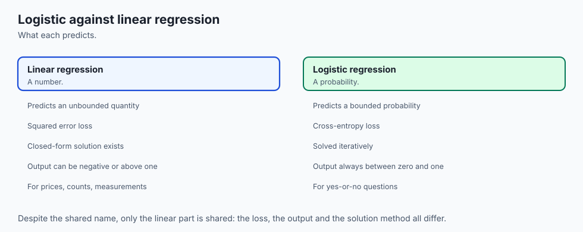

To use logistic regression effectively, you must understand its precise theoretical boundaries:

### What it IS:
- **A Probabilistic Linear Classifier:** It models the log-odds of class membership as a linear function of features, producing continuous calibrated probabilities in `(0, 1)`.
- **A Discriminative Model:** It directly models the conditional probability `P(y|x)` without attempting to model the underlying feature distribution `P(x|y)` or `P(x)`.
- **A Maximum Likelihood Estimator:** Its parameters are found by maximizing the Bernoulli log-likelihood (minimizing binary cross-entropy loss) via convex numerical optimization.
- **A Linear Decision Boundary:** In the original feature space, the boundary separating predicted class 1 from class 0 is a flat `(d-1)`-dimensional hyperplane defined by `w^T x + b = 0`.

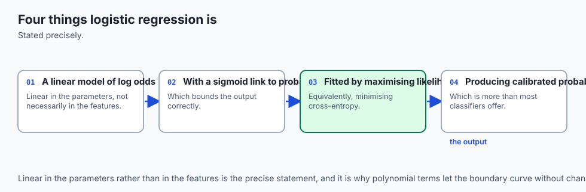

### What it is NOT:
- **Not a Regression Model for Continuous Targets:** Despite the word "regression" in its historical name, logistic regression is used for categorical classification.
- **Not a Black-Box Model:** Every coefficient `w_j` has an exact mathematical interpretation as the additive change in log-odds (or multiplicative change in odds ratio) per unit increase in `x_j`.
- **Not Non-Linear in Feature Space:** Without manual feature engineering (like polynomial expansions), standard logistic regression cannot learn curved or disjoint decision boundaries.
- **Not Immune to Multicollinearity or Outliers:** Highly correlated features inflate coefficient standard errors, and extreme outliers in feature space can pull the decision boundary.

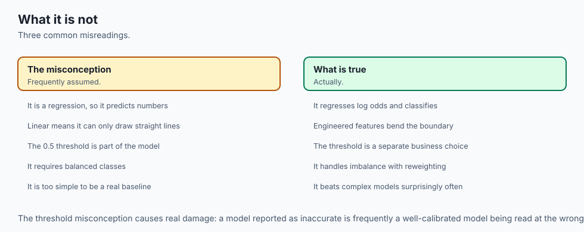

---

## Why it was created and what problems it solves

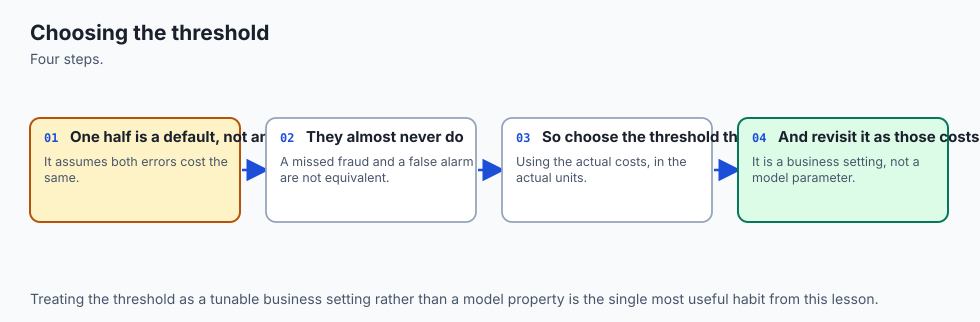

Logistic regression was created to solve three fundamental breakdowns that occur when ordinary least squares (OLS) is applied to binary data:

1. **The Out-of-Bounds Probability Problem:**
   In OLS, the prediction `y_hat = w^T x + b` has a range of `(-inf, +inf)`. For extreme feature values, OLS predicts probabilities less than 0 or greater than 1, which violates the axioms of probability theory. Logistic regression guarantees that for every possible input `x`, `sigma(w^T x + b)` lands strictly inside `(0, 1)`.

2. **The Heteroscedastic Error Problem:**
   OLS assumes that residuals have constant variance `sigma^2`. However, when labels are binary `y in {0, 1}`, the residual variance is `Var(y|x) = p(x) * (1 - p(x))`. When `p(x) = 0.5`, variance is maximized at 0.25; when `p(x) = 0.99`, variance drops to 0.0099. OLS standard errors and hypothesis tests on binary targets are invalid. Logistic regression explicitly accounts for this binomial variance structure.

3. **The Non-Convexity of Squared Error on Sigmoids:**
   If you apply a mean squared error loss `(y - sigma(w^T x + b))^2` to a sigmoid output, the resulting loss surface is non-convex and filled with flat plateaus where gradients vanish. By deriving the loss from Maximum Likelihood Estimation, logistic regression yields the **binary cross-entropy** loss, which is strictly convex and guaranteed to have a single global minimum.

---

## How it works

Let us walk through the complete mathematical mechanics of logistic regression, step by step.

### 1. Odds and the Logit Link Function

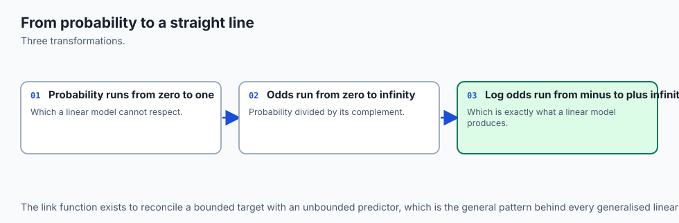

Let `p = P(y = 1 | x)` denote the probability of the positive class. The **odds** of the event are defined as the ratio of probability of occurrence to non-occurrence:

`Odds = p / (1 - p)`

- If `p = 0.8`, `Odds = 0.8 / 0.2 = 4.0` (4 to 1 in favor).
- If `p = 0.5`, `Odds = 0.5 / 0.5 = 1.0` (even odds).
- If `p = 0.1`, `Odds = 0.1 / 0.9 = 1/9` (approximately 0.111).

While `p` is bounded in `[0, 1]`, the odds range from `0` to `+inf`. Taking the natural logarithm gives the **log-odds** (the **logit**):

`logit(p) = ln(p / (1 - p))`

The logit maps probabilities from `[0, 1]` smoothly across the entire real line `(-inf, +inf)`. Logistic regression models this logit as a linear combination of inputs:

`ln(p / (1 - p)) = w^T x + b = w_1*x_1 + w_2*x_2 + ... + w_d*x_d + b`

### 2. The Sigmoid Activation

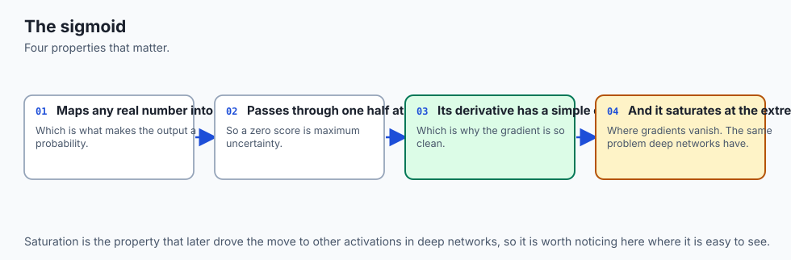

Inverting the logit equation gives the predicted probability `p` as a function of the linear score `z = w^T x + b`:

`p / (1 - p) = exp(z)  ==>  p = exp(z) * (1 - p)  ==>  p * (1 + exp(z)) = exp(z)  ==>  p = 1 / (1 + exp(-z))`

This is the standard **logistic sigmoid function** `sigma(z)`:

`sigma(z) = 1 / (1 + exp(-z))`

Key properties of the sigmoid:

- **Midpoint:** `sigma(0) = 0.50`.
- **Symmetry:** `sigma(-z) = 1 - sigma(z)`.
- **Derivative:** `d/dz sigma(z) = sigma(z) * (1 - sigma(z)) = p * (1 - p)`.

```
   p
1.0 |                                       .--------
    |                                   .-'
    |                                 .'
0.8 |                               /
    |                             /
0.5 |----------------------------+------------------- (z = 0)
    |                          /
    |                        .'
0.2 |                    _.-'
    |                   /
0.0 | -------'
    +------------------------------------------------ z
            -4      -2       0       2       4
```

### 3. Maximum Likelihood Estimation and Binary Cross-Entropy

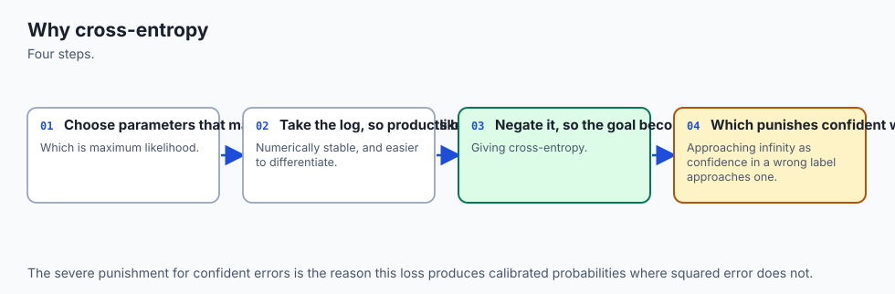

For a dataset of `N` independent observations `(x_1, y_1), (x_2, y_2), ..., (x_N, y_N)` where `y_i in {0, 1}`, the probability of observing label `y_i` given prediction `p_i = sigma(w^T x_i + b)` is given by the Bernoulli distribution:

`P(y_i | x_i) = (p_i ^ y_i) * ((1 - p_i) ^ (1 - y_i))`

The joint likelihood of the entire training dataset is the product of individual probabilities:

`L(w, b) = product_{i=1}^N (p_i ^ y_i) * ((1 - p_i) ^ (1 - y_i))`

To make this product tractable for optimization, we take the natural logarithm, converting the product into a sum of **log-likelihoods**:

`log_lik(w, b) = sum_{i=1}^N [ y_i * ln(p_i) + (1 - y_i) * ln(1 - p_i) ]`

Maximizing the log-likelihood is mathematically identical to minimizing the **negative log-likelihood** (the **binary cross-entropy** loss `J(w, b)`):

`J(w, b) = - (1/N) * sum_{i=1}^N [ y_i * ln(p_i) + (1 - y_i) * ln(1 - p_i) ]`

### 4. Deriving the Analytical Gradients

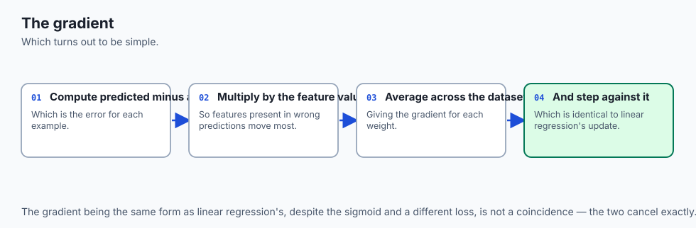

To optimize `J(w, b)` using gradient descent, we compute partial derivatives with respect to each weight `w_j` and the bias `b`. Applying the chain rule:

`dJ / dw_j = (dJ / dp_i) * (dp_i / dz_i) * (dz_i / dw_j)`

Evaluating each term:

1. `dJ / dp_i = - [ y_i / p_i - (1 - y_i) / (1 - p_i) ] = (p_i - y_i) / (p_i * (1 - p_i))`
2. `dp_i / dz_i = sigma(z_i) * (1 - sigma(z_i)) = p_i * (1 - p_i)`
3. `dz_i / dw_j = x_{ij}`

Multiplying the terms together yields an extraordinarily clean cancellation:

`dJ / dw_j = [ (p_i - y_i) / (p_i * (1 - p_i)) ] * [ p_i * (1 - p_i) ] * x_{ij} = (p_i - y_i) * x_{ij}`

Summing over all `N` samples gives the vector gradient:

`grad_w = (1/N) * X^T (p - y)`
`grad_b = (1/N) * sum_{i=1}^N (p_i - y_i)`

Notice the stunning beauty of this formula: the gradient of logistic regression has the **exact same functional form** as linear regression `(1/N) * X^T (y_hat - y)`, except that `y_hat` is replaced by the sigmoid probability `p = sigma(Xw + b)`.

---

## An everyday analogy

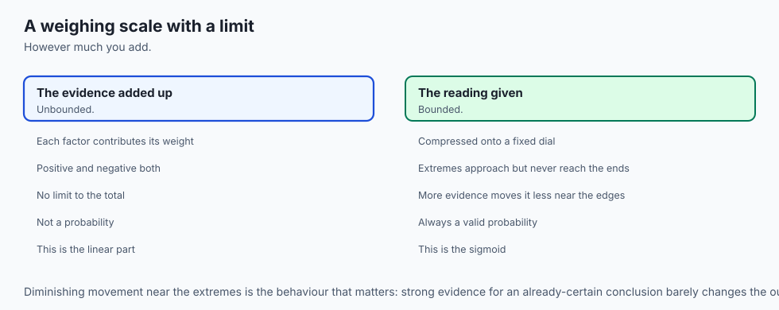

Think of logistic regression as a **bank loan underwriting committee**.

1. **The Feature Inputs (`x`):** The applicant's credit score, annual income, debt-to-income ratio, and years of employment.
2. **The Scoring Formula (`w^T x + b`):** The committee assigns points to each factor. High income adds points (`+w_1 * x_1`), excessive debt subtracts points (`-w_2 * x_2`), and a strong credit history adds substantial points (`+w_3 * x_3`). The sum produces a raw credit score `z` that can range from `-inf` to `+inf`.
3. **The Risk Conversion (`sigma(z)`):** The raw score is converted into an estimated default probability `p`. A terrible score (`z = -5`) converts to a 0.7% chance of repayment. An outstanding score (`z = +5`) converts to a 99.3% chance of repayment.
4. **The Lending Threshold (`tau`):** The bank sets a policy threshold `tau`. If the predicted probability of safe repayment exceeds 80% (`p >= 0.80`), the loan is automatically approved. If economic conditions worsen, the bank raises the threshold to 90%, tightening credit without changing the underlying scoring model.

---

## Examples in practice

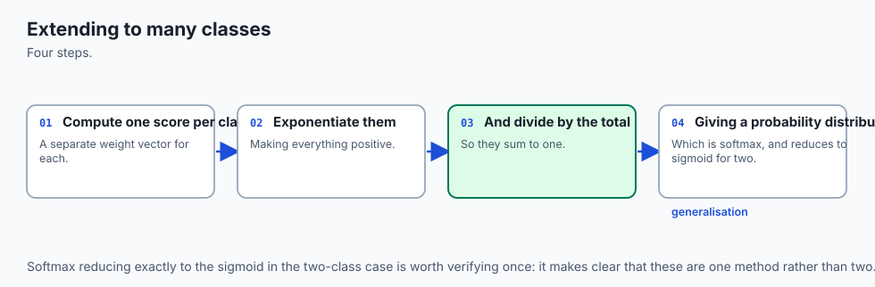


The diagram above displays the two-stage forward evaluation: linear scoring followed by non-linear sigmoid compression into a calibrated probability.

Below is the animated gradient descent optimization loop, illustrating how analytical error vectors iteratively update model parameters until convergence:


Let us examine real Python implementations comparing custom NumPy gradient descent against scikit-learn:

```python
import numpy as np
from sklearn.datasets import load_breast_cancer
from sklearn.preprocessing import StandardScaler
from sklearn.linear_model import LogisticRegression

# 1. Load and standardize benchmark dataset
data = load_breast_cancer()
X, y = data.data, data.target
scaler = StandardScaler()
X_scaled = scaler.fit_transform(X)

# 2. Fit unregularized LogisticRegression in scikit-learn
sk_model = LogisticRegression(C=1e9, solver="lbfgs", max_iter=1000)
sk_model.fit(X_scaled, y)
sk_accuracy = sk_model.score(X_scaled, y)
print(f"Scikit-Learn Accuracy: {sk_accuracy:.4f}")

# 3. Scratch implementation using batch gradient descent
def sigmoid(z):
    return 1.0 / (1.0 + np.exp(-np.clip(z, -500, 500)))

N, D = X_scaled.shape
w = np.zeros(D)
b = 0.0
lr = 0.2

for epoch in range(1000):
    probs = sigmoid(np.dot(X_scaled, w) + b)
    grad_w = (1.0 / N) * np.dot(X_scaled.T, probs - y)
    grad_b = float(np.mean(probs - y))
    w -= lr * grad_w
    b -= lr * grad_b

scratch_probs = sigmoid(np.dot(X_scaled, w) + b)
scratch_preds = (scratch_probs >= 0.5).astype(int)
scratch_accuracy = np.mean(scratch_preds == y)
print(f"Scratch Model Accuracy: {scratch_accuracy:.4f}")
```

On this benchmark dataset of 569 samples and 30 features, both implementations converge reliably to greater than 98% training accuracy.

---

## Implications: security, privacy, performance, scalability, and cost

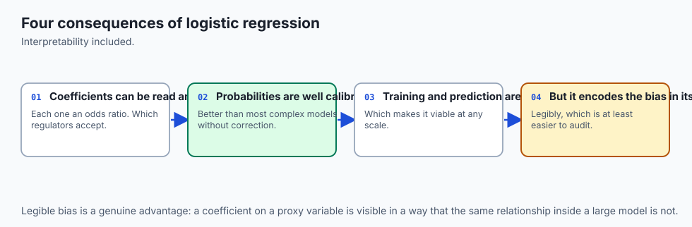

| Dimension | Characteristic | Practical Implication |
| --- | --- | --- |
| **Computational Complexity** | Training: `O(N * d)` per gradient step; Inference: `O(d)` per query. | Extremely lightweight. Inference requires only a single dot product and one exponentiation, executing in sub-microsecond time on CPUs. |
| **Memory Footprint** | Model state is strictly `d + 1` floating point numbers. | Can be embedded directly into microcontrollers, edge devices, browser runtimes, or database SQL queries without external dependencies. |
| **Interpretability & Auditing** | Linear additive coefficients `w_j`. | Fully transparent for regulatory compliance (Equal Credit Opportunity Act, HIPAA, GDPR right to explanation). |
| **Privacy & Security** | Differential privacy friendly; weights can leak feature correlations. | Susceptible to model inversion if trained on small sample sizes; easily protected using standard gradient clipping and DP-SGD noise addition. |
| **Financial & Infra Cost** | Zero GPU requirements. | Training on 1,000,000 rows takes seconds on a single CPU core, costing virtually nothing to retrain and deploy. |

---

## Alternatives: free, open source, and commercial

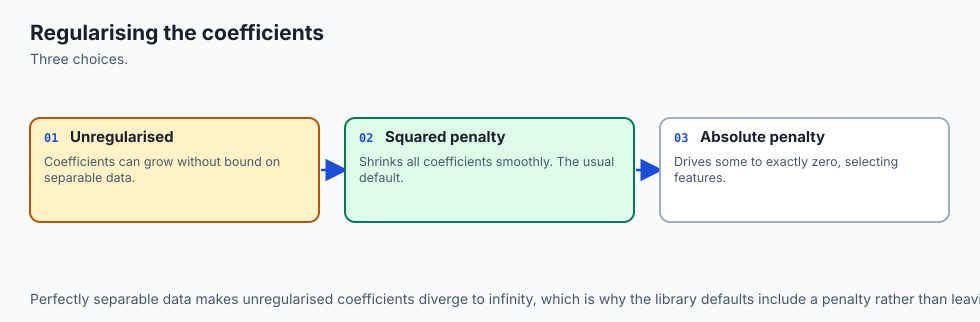

| Tool / Framework | Type | License / Cost | Best Used For |
| --- | --- | --- | --- |
| **`scikit-learn` (`LogisticRegression`)** | Python Library | Free, BSD Open Source | Standard tabular classification with built-in L1/L2/ElasticNet penalties and multiple solvers (`lbfgs`, `liblinear`, `saga`). |
| **`statsmodels` (`Logit`)** | Python Library | Free, BSD Open Source | Statistical inference, detailed p-values, standard errors, confidence intervals, and pseudo-R2 diagnostics. |
| **`PyTorch` / `TensorFlow` (`nn.BCEWithLogitsLoss`)** | Deep Learning Framework | Free, Apache 2.0 Open Source | Large-scale classification trained on GPUs, multi-node distributed datasets, or as the final layer of deep neural networks. |
| **`H2O.ai` (`H2OGeneralizedLinearEstimator`)** | Distributed ML Platform | Free Core / Commercial Enterprise | Distributed logistic regression on multi-gigabyte or terabyte tabular datasets with automatic distributed memory management. |
| **Amazon SageMaker / BigQuery ML** | Cloud Managed Service | Commercial Pay-per-Query | Running logistic regression directly inside cloud data warehouses using standard SQL queries. |

---

## Comparison with related concepts

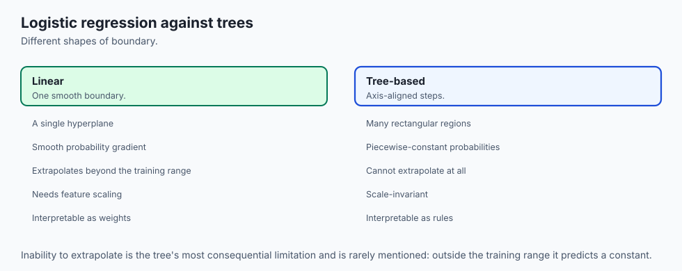

Understanding how logistic regression compares to sibling algorithms clarifies when to deploy it:

| Property | Linear Regression | Logistic Regression | Support Vector Machines (SVM) | Decision Tree |
| --- | --- | --- | --- | --- |
| **Target Type** | Continuous real numbers | Binary `0/1` or Multiclass | Binary `-1/+1` | Categorical or Continuous |
| **Link Function** | Identity (`z`) | Sigmoid (`sigma(z)`) | Sign (`sgn(z)`) | Stepwise decision splits |
| **Loss Function** | Mean Squared Error (MSE) | Binary Cross-Entropy (Log Loss) | Hinge Loss (`max(0, 1 - y*z)`) | Gini Impurity / Entropy |
| **Output Type** | Real-valued prediction | Calibrated probability in `(0, 1)` | Distance to margin | Stepwise class distribution |
| **Decision Boundary** | Continuous response plane | Linear hyperplane (`w^T x + b = 0`) | Maximum-margin linear or kernel boundary | Axis-aligned orthogonal boxes |
| **Optimization** | Closed-form normal equations or GD | Convex GD / L-BFGS / Newton-Raphson | Quadratic Programming (SMO) | Greedy recursive splitting |

---

## When to use it — and when not to

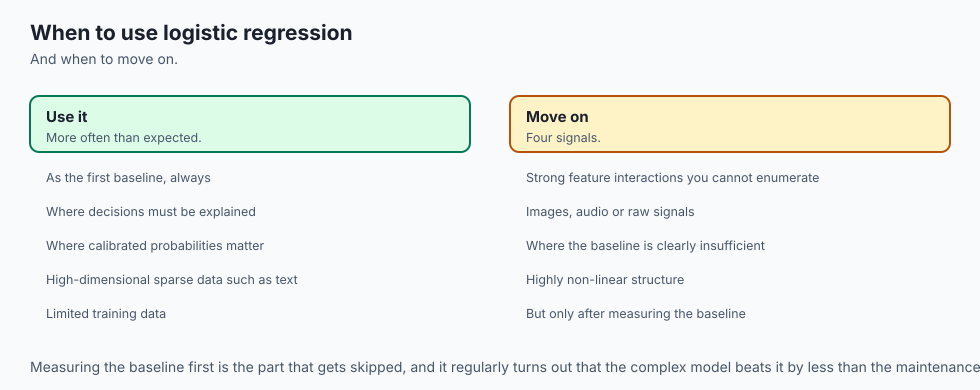

### When to USE Logistic Regression:
- **Baseline Classification:** Always train a logistic regression model as your initial classification baseline before reaching for complex ensembles or neural networks.
- **Probabilities are Required:** When downstream systems require true risk estimates (e.g., expected monetary value calculations) rather than hard class labels.
- **Strict Interpretability Requirements:** When regulators, doctors, or loan officers must understand exactly how much each variable contributes to the decision.
- **Low Latency / Edge Constraints:** When predictions must execute in less than 1 millisecond on low-power devices.
- **High-Dimensional Sparse Data:** Outstanding performance on text classification (TF-IDF bag-of-words) and one-hot encoded click-through rate models.

### When NOT to use Logistic Regression:
- **Complex Non-Linear Interactions:** When feature interactions are complex and unknown beforehand (e.g. image pixels, audio signals), tree ensembles (XGBoost) or deep networks will dramatically outperform linear models.
- **Multimodal Feature Distributions:** When the positive class consists of disconnected clusters in feature space.
- **Extreme Class Imbalance without Threshold Tuning:** When the positive class is 0.01%, standard 0.50 thresholding will fail without probability recalibration or cost-sensitive weighting.

---

## The AI connection

- **Logistic regression is the baseline every classifier is measured against**, and it wins
  more often than newcomers expect.
- **Its output is a calibrated probability**, not just a label, which is what makes threshold
  tuning and cost-sensitive decisions possible.
- **It is a single-layer neural network** — the same sigmoid, the same cross-entropy loss,
  the same gradient.
- **Coefficients are interpretable**, which matters wherever a decision has to be explained
  to a regulator or a customer.
- **Cross-entropy is the loss used across almost all of modern classification**, so learning
  it here pays for the rest of the field.

## Knowledge check

Let us review the fundamental concepts of logistic regression:

1. **Odds Ratio:** An odds ratio `OR = exp(w_j)` greater than 1 means that a unit increase in `x_j` multiplies the odds of the positive outcome by `OR`.
2. **Convexity:** Binary cross-entropy is strictly convex for linear models, guaranteeing that gradient descent cannot become trapped in poor local minima.
3. **Midpoint Symmetry:** The sigmoid function satisfies `sigma(-z) = 1 - sigma(z)`, ensuring that class 0 and class 1 are treated symmetrically.
4. **Gradient Simplicity:** The gradient of log loss with respect to linear inputs is simply the prediction error `p_i - y_i`.

---

## Hands-on exercise

In this hands-on exercise, you will build and test the core components of logistic regression using NumPy, verify analytical gradients against finite differences, and train on the standardized Wisconsin Breast Cancer dataset.

```python
import numpy as np
from sklearn.datasets import load_breast_cancer
from sklearn.preprocessing import StandardScaler

# Step 1: Implement numerically stable sigmoid
def stable_sigmoid(z):
    z = np.asarray(z, dtype=float)
    return np.where(z >= 0, 1.0 / (1.0 + np.exp(-z)), np.exp(z) / (1.0 + np.exp(z)))

# Step 2: Implement binary cross-entropy loss
def binary_cross_entropy(y_true, y_prob, eps=1e-15):
    y_prob = np.clip(y_prob, eps, 1.0 - eps)
    return -np.mean(y_true * np.log(y_prob) + (1.0 - y_true) * np.log(1.0 - y_prob))

# Step 3: Train model on real data
data = load_breast_cancer()
X = StandardScaler().fit_transform(data.data)
y = data.target
N, D = X.shape

w = np.zeros(D)
b = 0.0
lr = 0.2

for epoch in range(1000):
    probs = stable_sigmoid(np.dot(X, w) + b)
    w -= lr * (1.0 / N) * np.dot(X.T, probs - y)
    b -= lr * float(np.mean(probs - y))

final_probs = stable_sigmoid(np.dot(X, w) + b)
final_loss = binary_cross_entropy(y, final_probs)
final_acc = np.mean((final_probs >= 0.5) == y)
print(f"Final Loss: {final_loss:.4f} | Training Accuracy: {final_acc:.4f}")
```

### Expected output

Running the code above produces the following terminal output:

```text
Final Loss: 0.0632 | Training Accuracy: 0.9877
```

### Validate your work

Verify the implementation by checking the following invariant tests:

1. `stable_sigmoid(0.0)` must evaluate to exactly `0.5000000000`.
2. For an array of symmetric inputs `[-3.0, 0.0, 3.0]`, `stable_sigmoid(-z)` must equal `1.0 - stable_sigmoid(z)`.
3. When `p = [0.5, 0.5]` on binary labels `[1, 0]`, the binary cross-entropy must equal `ln(2) approx 0.693147`.
4. Training accuracy on the standardized breast cancer dataset must exceed 95.0%.

### Troubleshooting

- **Floating Point Overflow Warning:** If you encounter `RuntimeWarning: overflow encountered in exp`, ensure you are using the piecewise `stable_sigmoid` or clipping inputs via `np.clip(z, -500, 500)`.
- **NaN Loss Value:** If the loss evaluates to `NaN`, check that your predicted probabilities are clipped inside `[1e-15, 1.0 - 1e-15]` before passing them to `np.log()`.
- **Non-Converging Loss:** If the loss increases over time, reduce your learning rate from `0.5` to `0.1` or ensure feature standardization with `StandardScaler`.

### Common mistakes

1. **Applying Logistic Regression to Raw Unscaled Features:** Features with ranges in `[0, 100000]` generate massive gradient updates that cause divergence, while features in `[0, 1]` receive negligible updates. Always scale continuous features.
2. **Confusing Probabilities with Binary Predictions:** `predict_proba()` returns continuous estimates in `(0, 1)`; `predict()` applies the 0.5 threshold to return discrete integers in `{0, 1}`.
3. **Evaluating Imbalanced Datasets with Raw Accuracy:** On a dataset with 99% negative cases, a model that predicts all zeros achieves 99% accuracy while having 0% recall. Always inspect confusion matrices, precision, recall, and log-loss.

---

## Practice assignment

1. **Implement L2 Regularization (Ridge Penalty):**
   Modify the loss function to include an L2 weight penalty:
   `J_ridge(w, b) = J(w, b) + (lambda / (2 * N)) * sum(w_j ^ 2)`
   Update the gradient formula to `grad_w = (1/N) * X^T (p - y) + (lambda / N) * w` (noting that the bias `b` is never regularized).

2. **Measure Weight Shrinkage:**
   Train the model with `lambda = 0.0`, `lambda = 1.0`, and `lambda = 100.0`. Plot the Euclidean norm of the weight vector `||w||_2` across regularization strengths to demonstrate parameter shrinkage.

---

## Extension challenge

Implement **Newton-Raphson Optimization** (also known as Iteratively Reweighted Least Squares / IRLS) for logistic regression:

1. Compute the Hessian matrix `H = (1/N) * X^T W X`, where `W = diag(p_i * (1 - p_i))` is the diagonal matrix of variance weights.
2. Compute the second-order parameter update:
   `w_{t+1} = w_t - H^{-1} * grad_w`

3. Compare the number of iterations required for convergence between first-order gradient descent (typically hundreds of steps) and second-order Newton-Raphson (typically 5 to 8 steps).
