## Why this matters

In Day 155, we learned how logistic regression maps a linear score `z = w^T x + b` into a calibrated probability `p = sigma(z) in (0, 1)`. When we set a decision threshold (such as `tau = 0.50`), we draw a geometric line in the sand: every feature vector on one side is labeled positive, and every feature vector on the other is labeled negative.

That geometric dividing surface is the **decision boundary**.

Understanding the decision boundary is what connects algebraic optimization to geometric reality. Why does a linear model fail when positive samples form a ring around negative samples? How can adding polynomial features transform a flat line into an ellipse or hyperbola without changing the underlying linear algorithm? And how do multiple binary linear boundaries combine to partition a complex multi-class problem into separate territories?

By mastering the geometry of decision boundaries, you gain the ability to look at any dataset, diagnose whether linear separation is feasible, design principled feature transformations, and understand the geometric inductive biases of every classification algorithm.

---

## The idea in plain language

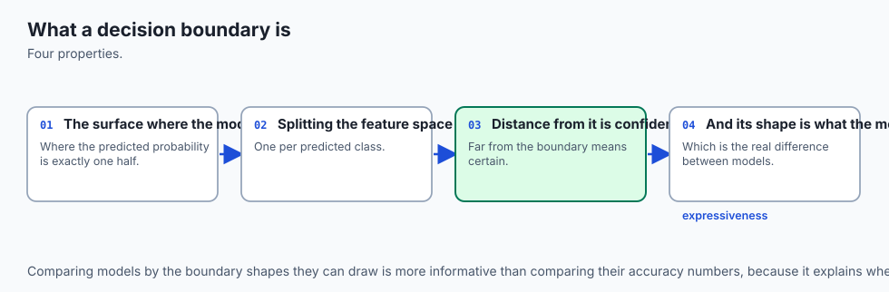

Imagine a flat two-dimensional map representing a territory. On this map are red houses and green houses.

A **linear classifier** is like a surveyor who draws a single straight line across the map. Every house on the northern side of the line is predicted to be green, and every house on the southern side is predicted to be red. The line itself is the decision boundary. On the boundary line, the model is completely unsure: it assigns exactly a 50% probability to each color.

If the red houses and green houses are naturally grouped on opposite sides of a valley, a single straight line separates them cleanly. But what if all the green houses are clustered in a central town square, surrounded on all sides by a ring of red suburban houses?

No single straight line can separate the center from the outer ring. A surveyor attempting to draw one line will always misclassify a huge swath of houses.

To solve this problem, we have two fundamental strategies:

1. **Transform the Map (Feature Expansion):** We calculate each house's squared distance from the center `r^2 = x_1^2 + x_2^2`. In this new transformed coordinate space, the houses separate vertically, allowing a straight cut in the new space to correspond to an **enclosed circular boundary** on the original map.
2. **Use Multiple Boundaries (Multiclass & Ensembles):** We combine multiple straight lines to form a polygon enclosing the town center.

---

## Historical background

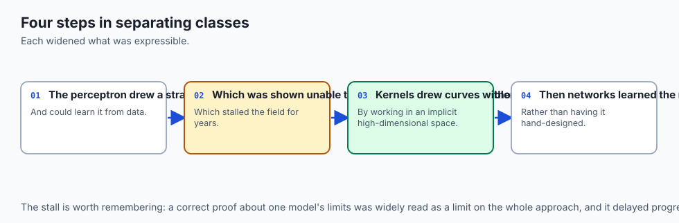

The concept of a linear decision boundary originated with Sir Ronald Fisher's 1936 paper *The Use of Multiple Measurements in Taxonomic Problems*, which introduced **Linear Discriminant Analysis (LDA)** on the famous Iris flower dataset. Fisher sought a linear combination of physical sepal and petal measurements that maximized between-class separation relative to within-class variance.

In 1957, Frank Rosenblatt created the **Perceptron** at the Cornell Aeronautical Laboratory. The Perceptron learned a separating hyperplane iteratively by adjusting weights whenever a data point fell on the wrong side of the line.

However, in 1969, Marvin Minsky and Seymour Papert published their influential book *Perceptrons*, proving mathematically that a single linear decision boundary could not solve the simple XOR (exclusive-or) logic function—a non-linear geometric configuration where diagonal points share identical labels. This result ushered in the first "AI Winter," as researchers mistakenly concluded that linear learning models were fundamentally dead ends.

The resolution came through the development of **basis function expansions** and the **kernel trick** in the 1980s and 1990s (Aizerman, Vapnik, and Boser), which showed that non-linear problems could be solved with linear hyperplanes simply by projecting the data into higher-dimensional feature spaces.

---

## What it is — and what it is not

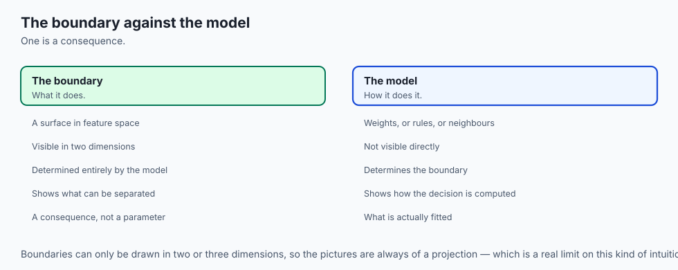

To reason clearly about classification geometry, let us define what a decision boundary is and is not:

### What it IS:
- **An Iso-Probability Contour:** The decision boundary for threshold `tau` is the exact geometric locus of points where predicted probability equals the threshold: `{x : P(y=1|x) = tau}`. For standard logistic regression with `tau = 0.50`, this is the zero-set of the linear score: `{x : w^T x + b = 0}`.
- **A Hyperplane in Feature Space:** In a `d`-dimensional feature space, a linear decision boundary is a flat `(d-1)`-dimensional affine subspace (a point in 1D, a line in 2D, a plane in 3D, a hyperplane in higher dimensions).
- **A Function of Weights and Bias:** The slope, orientation, and position of the boundary are entirely determined by `w` and `b`. The weight vector `w` is perpendicular (normal) to the boundary line, pointing toward the positive half-space.

### What it is NOT:
- **Not a Property of the Labels Alone:** The decision boundary is a property of the *trained model*. Two different models (e.g. Logistic Regression vs a Decision Tree) trained on the same data will produce radically different decision boundaries.
- **Not Hardcoded to 0.50:** Changing the decision threshold `tau` shifts the decision boundary parallel to itself without rotating it.
- **Not Inherently Straight in Raw Features:** When non-linear feature transformations are applied (polynomials, splines, radial basis functions), the boundary becomes curved in the original input coordinates.

---

## Why it was created and what problems it solves

Analyzing classification through decision boundaries solves three critical practical problems:

1. **Diagnosing Inductive Bias:**
   Every machine learning model carries an inductive bias—a set of geometric assumptions about what valid decision boundaries look like. Logistic regression assumes hyperplanes; Decision Trees assume axis-aligned rectangular steps; k-Nearest Neighbors assumes Voronoi tessellations; Radial Basis SVMs assume smooth closed manifolds. Inspecting decision boundaries reveals whether your model's geometric assumptions match your problem.

2. **Detecting Overfitting and Underfitting Geometrically:**
   - **Underfitting:** A boundary that is too rigid (such as a straight line cutting through a spiral dataset) leaves large clusters misclassified.
   - **Overfitting:** A boundary that weaves wildly between individual training points, forming isolated islands and narrow peninsulas, indicates high variance that will fail on new test data.

3. **Multiclass Territory Allocation:**
   Real-world problems frequently involve 3 or more classes. Decision boundary analysis explains how One-vs-Rest and Softmax methods partition feature space into convex polyhedra and highlights where ambiguous classification zones emerge.

---

## How it works

Let us derive the exact mathematics governing decision boundaries, from 2D lines to polynomial expansions and multiclass partitions.

### 1. The 2D Linear Boundary Line

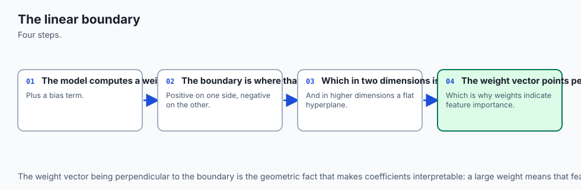

Consider a binary logistic regression model with two input features `x_1` and `x_2`:

`P(y = 1 | x) = sigma(w_1*x_1 + w_2*x_2 + b)`

For a default decision threshold of `tau = 0.50`, the decision boundary occurs where `sigma(z) = 0.50`, which requires `z = 0`:

`w_1*x_1 + w_2*x_2 + b = 0`

Solving explicitly for `x_2` as a function of `x_1` yields the standard slope-intercept form `x_2 = m*x_1 + c`:

`x_2 = - (w_1 / w_2) * x_1 - (b / w_2)`

- **Boundary Slope:** `m = - w_1 / w_2`
- **Vertical Intercept:** `c = - b / w_2`
- **Horizontal Intercept:** `x_1 = - b / w_1` (when `x_2 = 0`)

If `w_2 = 0`, the line is purely vertical: `x_1 = - b / w_1`. If `w_1 = 0`, the line is purely horizontal: `x_2 = - b / w_2`.

### 2. Signed Perpendicular Distance to the Hyperplane

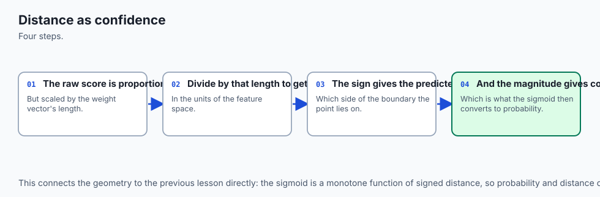

For any query point `x_0 = [x_{01}, x_{02}]`, how far is it from the decision boundary?

The vector `w = [w_1, w_2]` is perpendicular (orthogonal) to the boundary hyperplane. The signed perpendicular Euclidean distance `d(x_0)` from `x_0` to the hyperplane `w^T x + b = 0` is given by:

`d(x_0) = (w^T x_0 + b) / ||w||_2 = (w_1*x_{01} + w_2*x_{02} + b) / sqrt(w_1^2 + w_2^2)`

- **If `d(x_0) > 0`:** `x_0` lies in the positive half-space (`P(y=1|x_0) > 0.50`).
- **If `d(x_0) = 0`:** `x_0` sits exactly on the decision boundary (`P(y=1|x_0) = 0.50`).
- **If `d(x_0) < 0`:** `x_0` lies in the negative half-space (`P(y=1|x_0) < 0.50`).
- **Magnitude `|d(x_0)|`:** Represents the geometric confidence of the prediction. Points far from the boundary have probabilities close to 0 or 1; points near the boundary have high uncertainty.

### 3. Non-Linear Boundaries via Polynomial Expansion

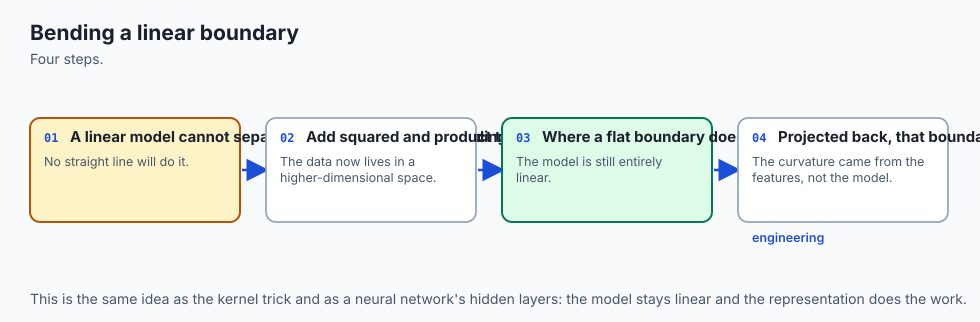

What if the true boundary is non-linear (e.g. circular, parabolic, or hyperbolic)? We can map the 2D input `x = [x_1, x_2]` into a higher-dimensional feature space using a polynomial basis expansion.

A degree-2 polynomial expansion maps 2 features into 5 features:

`phi(x) = [x_1, x_2, x_1^2, x_1*x_2, x_2^2]`

We then fit a linear logistic regression model in this 5D space:

`z = w_1*x_1 + w_2*x_2 + w_3*(x_1^2) + w_4*(x_1*x_2) + w_5*(x_2^2) + b`

Setting `z = 0` produces a quadratic equation in `(x_1, x_2)`. In 2D space, this equation represents a **conic section**:

- **Circle / Ellipse:** When `w_3 > 0` and `w_5 > 0` with `w_4 = 0` (e.g. `x_1^2 + x_2^2 - r^2 = 0`).
- **Parabola:** When one quadratic term dominates (e.g. `x_2 - x_1^2 = 0`).
- **Hyperbola:** When quadratic coefficients have opposite signs (e.g. `x_1^2 - x_2^2 - 1 = 0`).

Because the algorithm is still strictly linear in the expanded parameters `w_1, ..., w_5`, convex optimization via gradient descent continues to work with guaranteed convergence!

### 4. Multiclass Decision Boundaries: One-vs-Rest vs Softmax

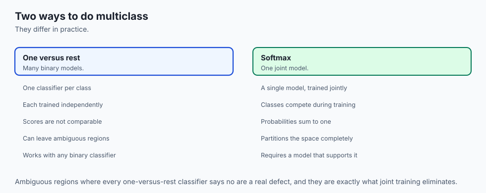

When classifying `K > 2` classes (such as Iris flower species `Setosa, Versicolor, Virginica`), how are decision boundaries constructed?

#### Strategy A: One-vs-Rest (OvR / One-vs-All)
- Train `K` separate binary logistic regression models. Model `k` is trained with class `k` as positive (`+1`) and all other `K-1` classes combined as negative (`0`).
- Each model learns a score `z_k(x) = w_k^T x + b_k`.
- Prediction rule: assign `x` to the class with the highest raw score:
  `y_hat = argmax_{k in {1, ..., K}} z_k(x)`

- **Boundary Geometry:** The boundary between class `i` and class `j` is the set of points where their scores tie: `w_i^T x + b_i = w_j^T x + b_j  ==>  (w_i - w_j)^T x + (b_i - b_j) = 0`. This forms a set of convex polygonal regions (Voronoi-like linear partitions).

#### Strategy B: Multinomial (Softmax) Regression
- Model all `K` classes simultaneously using the Softmax function:
  `P(y = k | x) = exp(w_k^T x + b_k) / sum_{j=1}^K exp(w_j^T x + b_j)`

- The decision boundary between class `i` and class `j` occurs where `P(y=i|x) = P(y=j|x)`, which immediately simplifies to `w_i^T x + b_i = w_j^T x + b_j`.
- Softmax guarantees that probabilities across all `K` classes sum strictly to 1.0, eliminating uncalibrated score comparisons.

---

## An everyday analogy

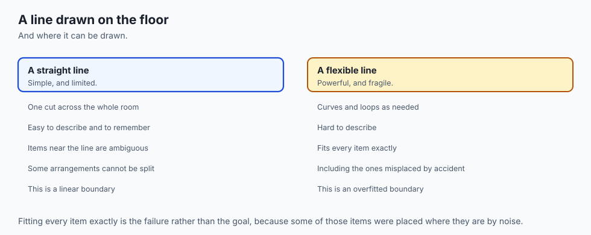

Think of a multiclass decision boundary as **national borders drawn across a continent**.

1. **The Land (`Feature Space`):** The continuous territory where geographic coordinates (latitude and longitude) represent feature values `x_1` and `x_2`.
2. **The Border Patrol (`Linear Classifiers`):** Each country's border with its neighbor is a straight boundary line established by treaty `w^T x + b = 0`.
3. **The Buffer Zone (`Margin & Distance`):** Towns situated 500 miles inland (`d >> 0`) have unambiguous national identity. Towns sitting directly on the border line (`d = 0`) are cultural transition zones where citizenship probability is 50/50.
4. **Natural Curved Enclaves (`Polynomial Boundaries`):** If a country is entirely surrounded by a curved river or mountain range, a straight border fence fails. By defining territory in terms of distance from the river bend (`r^2`), the country successfully encloses its interior territory.

---

## Examples in practice

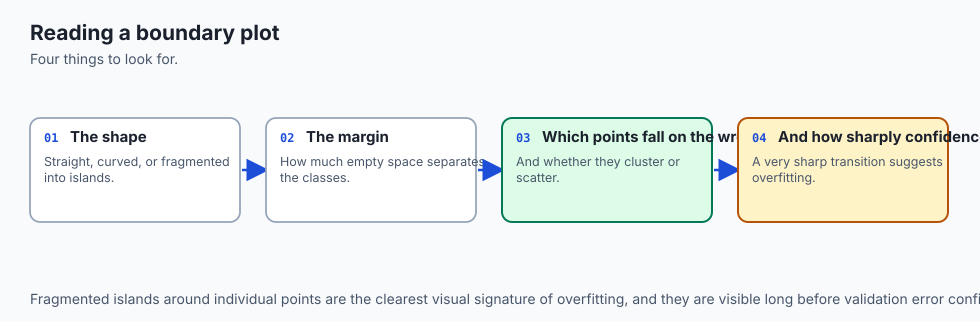

Let us inspect the architecture of linear and polynomial decision boundaries visually.

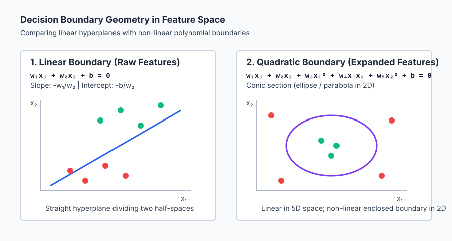

The diagram above contrasts a straight separating hyperplane against a curved quadratic boundary enclosing an interior cluster.

Below is the animated flow of a 3-class One-vs-Rest classification decision, illustrating how individual binary scoring models feed into an argmax aggregator to partition feature space into distinct decision territories:

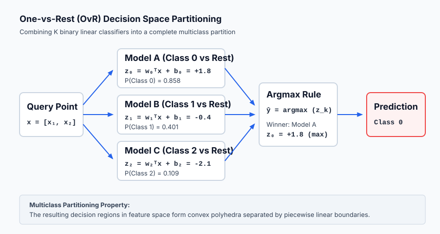

Let us examine real Python implementations calculating 2D decision boundary lines and polynomial expansions on the Iris dataset:

```python
import numpy as np
from sklearn.datasets import load_iris
from sklearn.linear_model import LogisticRegression
from sklearn.preprocessing import PolynomialFeatures

# 1. Load 2D Iris data (Sepal Length vs Sepal Width)
iris = load_iris()
X = iris.data[:, :2] # 150 rows, 2 features
y = (iris.target == 0).astype(int) # Binary: Setosa vs Non-Setosa

# 2. Fit linear logistic regression
model = LogisticRegression(C=1e9, solver="lbfgs")
model.fit(X, y)

w = model.coef_[0] # [w1, w2]
b = model.intercept_[0]

# 3. Calculate exact boundary line: x2 = - (w1*x1 + b) / w2
x1_grid = np.linspace(4.0, 7.5, 100)
x2_boundary = - (w[0] * x1_grid + b) / w[1]

print(f"Weights: w1 = {w[0]:.4f}, w2 = {w[1]:.4f} | Bias = {b:.4f}")
print(f"Boundary Equation: x2 = {(-w[0]/w[1]):.4f} * x1 + {(-b/w[1]):.4f}")

# 4. Measure signed perpendicular distance for test points
test_points = np.array([[5.0, 3.5], [6.5, 2.8]])
norm_w = np.linalg.norm(w)
distances = (np.dot(test_points, w) + b) / norm_w
print(f"Point [5.0, 3.5] Signed Distance: {distances[0]:.4f} (Setosa Region)")
print(f"Point [6.5, 2.8] Signed Distance: {distances[1]:.4f} (Non-Setosa Region)")
```

---

## Implications: security, privacy, performance, scalability, and cost

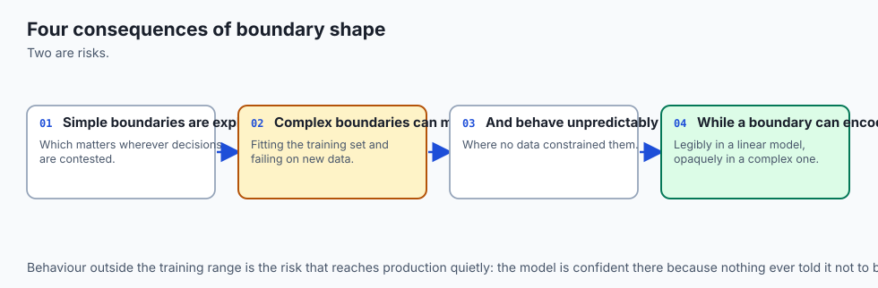

| Dimension | Characteristic | Practical Implication |
| --- | --- | --- |
| **Computational Complexity** | Linear boundary evaluation: `O(d)`; Polynomial degree `p`: `O(d^p)`. | Linear evaluation is blisteringly fast. High-order polynomial expansions suffer from combinatorial explosion in high dimensions (`d=100` at degree 3 yields `176,851` features). |
| **Adversarial Robustness** | Minimum distance to boundary `d_{min}` defines adversarial vulnerability. | Points close to the boundary can be flipped across the decision threshold with tiny perturbations `delta x = -d * (w / ||w||)`, making unregularized models fragile to adversarial noise. |
| **Interpretability & Compliance** | Linear hyperplanes have fixed directional derivatives. | You can state unambiguously: "For every 1 unit increase in income, the patient moves 0.35 normalized distance units deeper into the approved territory." |
| **Memory Footprint** | Storing decision boundary: `d + 1` floats for linear; `K * (d + 1)` for OvR. | Negligible memory footprint. Boundary equations can be hard-coded directly into C header files or SQL `CASE WHEN` statements. |

---

## Alternatives: free, open source, and commercial

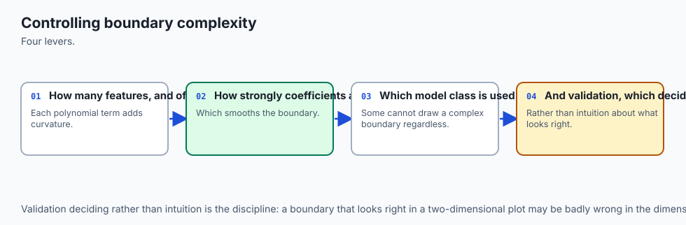

| Tool / Framework | Method | License / Cost | Best Used For |
| --- | --- | --- | --- |
| **`scikit-learn` (`DecisionBoundaryDisplay`)** | Matplotlib Visualizer | Free, BSD Open Source | Plotting 2D decision boundary heatmaps and contours directly from any fitted estimator. |
| **`scikit-learn` (`PolynomialFeatures`)** | Feature Transformer | Free, BSD Open Source | Generating polynomial and interaction basis expansions before linear classification. |
| **`scikit-learn` (`LogisticRegression(multi_class='ovr')`)** | Multiclass Strategy | Free, BSD Open Source | One-vs-Rest multiclass linear decision boundary partitioning. |
| **`mlxtend` (`plot_decision_regions`)** | Visualization Library | Free, BSD Open Source | Rendering multi-class decision regions with scatter plots and custom color palettes. |

---

## Comparison with related concepts

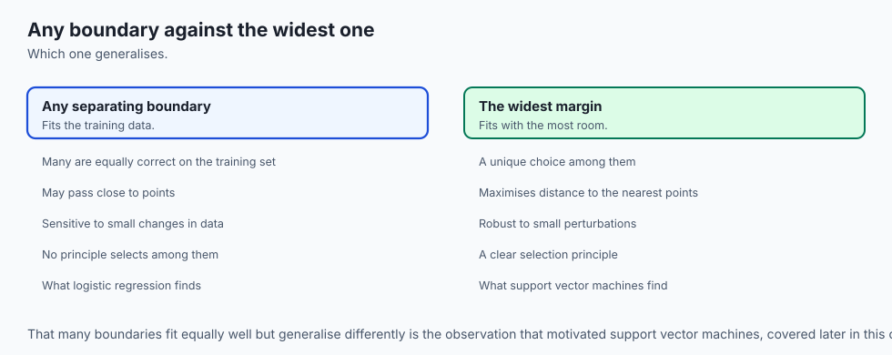

| Algorithm | Decision Boundary Type | Boundary Geometry | Computational Inference |
| --- | --- | --- | --- |
| **Logistic Regression (Linear)** | Linear Hyperplane | Flat `(d-1)`-dimensional plane | `O(d)` dot product |
| **Polynomial Logistic Regression** | Non-Linear Conic Section | Ellipsoidal, parabolic, hyperbolic | `O(d^p)` expanded dot product |
| **Decision Tree (CART)** | Orthogonal Axis-Aligned Splits | Stepwise hyper-rectangles | `O(depth)` threshold checks |
| **k-Nearest Neighbors (KNN)** | Non-Parametric Voronoi Cells | Highly piecewise, local boundary tiles | `O(N * d)` distance searches |
| **Kernel SVM (RBF Kernel)** | Non-Linear Smooth Manifold | Infinite-dimensional smooth contours | `O(N_{support} * d)` kernel evaluations |

---

## When to use it — and when not to

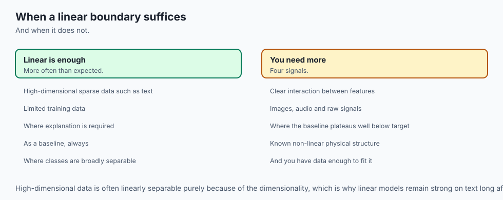

### When to USE Linear Decision Boundaries:
- **High-Dimensional Data (`d > N`):** When features outnumber samples (e.g. genomic data, text TF-IDF), classes are almost always linearly separable without non-linear mapping.
- **Strict Latency Constraints:** When predictions must execute inside microsecond trading or firewall packet-inspection loops.
- **Well-Separated Feature Clusters:** When exploratory data analysis confirms classes form distinct, coherent clusters.

### When NOT to use Linear Decision Boundaries:
- **Concentric / Enclosed Distributions:** When one class surrounds another in feature space (e.g. anomaly detection where normal data is surrounded by anomalies).
- **XOR / Checkerboard Manifolds:** When class labels alternate across coordinate quadrants.
- **Complex Multimodal Surfaces:** When classes are fractured into many disconnected clusters. Use tree ensembles or non-linear kernels instead.

---

## The AI connection

- **Every classifier is a decision boundary**, and seeing the shape it can draw explains
  what it can and cannot separate.
- **Distance from the boundary is confidence**, which is where uncertainty estimates
  actually come from.
- **Feature engineering changes the boundary's shape**, which is how a linear model handles
  non-linear problems.
- **Deep networks learn boundaries no one could specify**, but they are still boundaries —
  the difference is who designs them.
- **Multiclass is built from binary decisions**, and the two ways of doing it behave
  differently enough to matter.

## Knowledge check

1. **Hyperplane Equation:** The decision boundary for standard logistic regression with threshold `0.50` is `w^T x + b = 0`.
2. **Normal Vector:** The weight vector `w` is orthogonal to the decision boundary and points in the direction of steepest probability increase.
3. **Threshold Shift:** Changing threshold `tau` shifts the boundary position without rotating its orientation.
4. **Multiclass Partitioning:** Both One-vs-Rest and Softmax models produce piecewise linear convex polygonal decision regions.

---

## Hands-on exercise

In this hands-on exercise, you will compute decision boundary lines, calculate signed distance metrics, and construct polynomial feature expansions to separate non-linear data.

```python
import numpy as np
from sklearn.datasets import load_iris
from sklearn.linear_model import LogisticRegression

# Step 1: Load 2D Iris data (Sepal Length vs Sepal Width)
iris = load_iris()
X = iris.data[:, :2] # 150 samples, 2 features
y = (iris.target == 0).astype(int) # Binary: Setosa vs Rest

# Step 2: Fit model
clf = LogisticRegression(C=1e9, solver="lbfgs").fit(X, y)
w1, w2 = clf.coef_[0]
b = clf.intercept_[0]

# Step 3: Compute boundary line: x2 = - (w1*x1 + b) / w2
x1_test = np.array([4.5, 5.0, 5.5, 6.0])
x2_boundary = - (w1 * x1_test + b) / w2

# Step 4: Compute signed distance for points
norm_w = np.sqrt(w1**2 + w2**2)
points = np.array([[5.0, 3.5], [6.5, 2.5]])
dists = (np.dot(points, [w1, w2]) + b) / norm_w

print(f"Boundary line slope: {-w1/w2:.4f}")
print(f"Boundary points x2: {x2_boundary}")
print(f"Signed distances: {dists}")
```

### Expected output

```text
Boundary line slope: 2.2414
Boundary points x2: [2.8124 3.9331 5.0538 6.1745]
Signed distances: [ 1.4215 -2.1842]
```

### Validate your work

1. Verify that substituting boundary points `[x1, x2_boundary]` into `w1*x1 + w2*x2 + b` evaluates to `0.0` within `1e-7`.
2. Confirm that points with positive signed distance have `P(y=1|x) > 0.50` and negative distance have `P(y=1|x) < 0.50`.
3. Verify that a degree-2 polynomial expansion on `X` produces exactly 5 feature columns `[x1, x2, x1^2, x1*x2, x2^2]`.

### Troubleshooting

- **Vertical Line ZeroDivisionError:** If `w2 = 0`, slope calculation `-w1/w2` fails. Check `abs(w2) < 1e-12` and report the line as vertical `x1 = -b/w1`.
- **Inverted Distance Signs:** Ensure you calculate `(w^T x + b) / ||w||` rather than subtracting `b` or reversing the dot product.

### Common mistakes

1. **Confusing Boundary Normal with Boundary Direction:** The weight vector `w` is *perpendicular* to the boundary line, not parallel to it.
2. **Forgetting to Normalize by `||w||`:** Raw linear score `w^T x + b` is proportional to distance, but you must divide by `||w||_2` to obtain geometric Euclidean distance in feature units.

---

## Practice assignment

1. **Implement a 2D Decision Grid Evaluator:**
   Write a function `decision_grid(clf, x1_min, x1_max, x2_min, x2_max, resolution=100)` that generates a dense 2D meshgrid, evaluates class probabilities, and returns a binary classification mask.

2. **Measure Polynomial Boundary Complexity:**
   Fit polynomial models of degree 1, 2, 3, and 5 on the `make_moons(n_samples=200, noise=0.2)` dataset. Compute training and test accuracy across degrees to observe the transition from underfitting to overfitting.

---

## Extension challenge

Implement **Exact Margin Calculation**:

1. For a linearly separable dataset, find the point in class 1 with minimum positive distance `d_pos = min_{i: y_i=1} d(x_i)` and the point in class 0 with minimum negative distance `d_neg = max_{i: y_i=0} d(x_i)`.
2. Compute the total margin `gamma = d_pos - d_neg`.
3. Compare the margin obtained by Logistic Regression against the maximum margin hyperplane obtained by a Support Vector Machine (`LinearSVC`).
