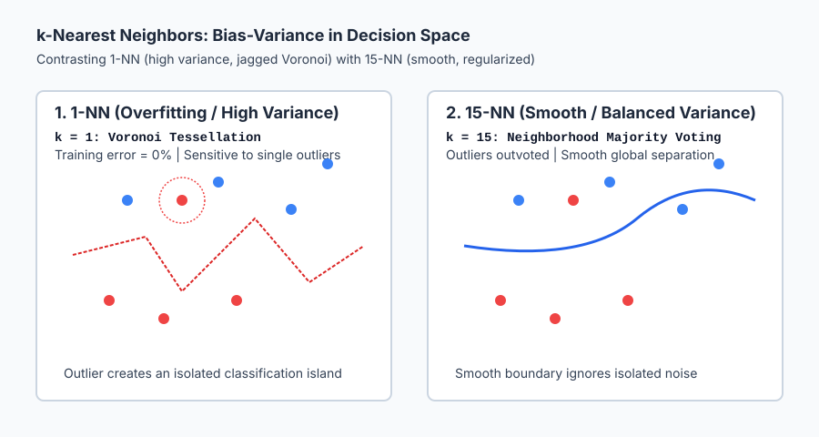
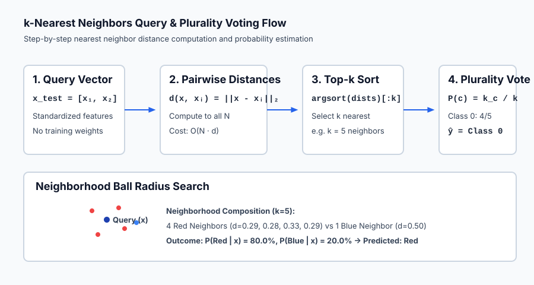

## Why this matters

Parametric models like linear and logistic regression assume a strict functional form: they postulate that the relationship between inputs and outputs can be summarized entirely by a vector of weights `w` and a bias `b`. Once trained, the dataset is discarded, and all future predictions depend solely on `w^T x + b`.

What if the true underlying pattern is too intricate, non-linear, or multimodal for any single mathematical function to describe?

**k-Nearest Neighbors (KNN)** takes a radically different path. It makes zero assumptions about the distribution of data. It performs no explicit training phase. Instead, it memorizes the entire dataset and defers all computation until a query arrives. When asked to classify a new point, KNN searches its memory for the `k` closest examples and takes a vote.

KNN is the purest expression of **instance-based learning** and **non-parametric classification**. It provides an intuitive, mathematically grounded baseline against which all modern classifiers are judged, illustrates the fundamental mechanics of metric spaces and similarity measures, and serves as the gateway to vector databases and similarity search systems powering modern AI.

---

## The idea in plain language

Imagine you move into an unfamiliar city and want to know which political party or neighborhood association you are likely to join based on your street address.

A **parametric approach** (like logistic regression) would attempt to draw a single straight boundary line across the city map.

A **k-Nearest Neighbors approach** simply asks: *“Who are my 5 closest neighbors?”*
- If 4 of your closest neighbors belong to Association A, and 1 belongs to Association B, the model predicts with 80% confidence that you belong to Association A.

There are no equations fitted in advance. Your prediction is determined purely by the local consensus of your geographic neighborhood.

If you choose `k = 1`, you adopt the identity of your immediate next-door neighbor. If that neighbor happens to be an eccentric outlier with unusual views, your prediction will be completely wrong.

If you choose `k = 50`, you average the opinions of entire city blocks, smoothing out individual quirks but risking the loss of distinct neighborhood character.

Choosing the right `k` is the art of balancing hyper-local detail against broad community consensus.

---

## Historical background

The nearest neighbor rule was introduced in 1951 by Evelyn Fix and Joseph Hodges in an unpublished technical report for the US Air Force School of Aviation Medicine titled *Discriminatory Analysis, Nonparametric Discrimination: Consistency Properties*. Fix and Hodges demonstrated that as sample size approaches infinity, the nearest neighbor error rate converges toward optimal non-parametric bounds.

In 1967, Thomas Cover and Peter Hart published their landmark paper *Nearest Neighbor Pattern Classification* in the *IEEE Transactions on Information Theory*. Cover and Hart proved one of the most astonishing theoretical results in statistical pattern recognition:

> **The Cover-Hart Theorem:** In the infinite-sample limit, the probability of error of the 1-Nearest Neighbor classifier `R_{1-NN}` is upper-bounded by at most **twice the Bayes optimal error rate** `R^*`:
> `R^* <= R_{1-NN} <= 2 * R^* * (1 - R^*) <= 2 * R^*`

In plain terms: a simple algorithm with zero training parameters that only looks at the single closest data point captures at least half of the classification information available in any infinite dataset!

In 1975, Jerome Bentley developed the **k-d tree** (k-dimensional tree), enabling logarithmic-time nearest neighbor searches in low dimensions and transforming nearest neighbor analysis from a theoretical curiosity into a scalable computing technique.

---

## What it is — and what it is not

To understand k-Nearest Neighbors with technical precision, let us establish its properties:

### What it IS:
- **Non-Parametric:** The number of parameters is not fixed; the model grows with the size of the training dataset. It makes no assumptions about Gaussian distributions, linear separability, or underlying data manifolds.
- **Instance-Based / Lazy Learning:** Training is `O(1)` (or `O(N * d)` to store the dataset in memory). All computational work occurs during inference when calculating distances to test queries.
- **Local Estimator:** The decision rule is determined entirely by the local subset `N_k(x) subset {x_1, ..., x_N}` surrounding query point `x`.
- **Metric-Dependent:** The model is completely defined by its choice of distance function `d(x, z)`, neighborhood size `k`, and weighting scheme.

### What it is NOT:
- **Not a Linear Classifier:** The decision boundary of a KNN model is not a flat hyperplane; it is a complex piecewise-linear Voronoi tessellation that adapts organically to data contours.
- **Not Scale-Invariant:** KNN has no concept of feature importance weights unless explicitly provided. Features with larger numerical scales will dominate distance calculations.
- **Not Fast at Inference:** Evaluating a test query against `N` samples with `d` features requires `O(N * d)` operations under a brute-force search.

---

## Why it was created and what problems it solves

KNN solves four critical challenges in machine learning and data science:

1. **Non-Linear and Multimodal Pattern Recognition:**
   When classes form disconnected islands, interleaved spirals, or concentric circles, linear models fail completely. KNN naturally clusters around irregular data manifolds without requiring manual basis expansions.

2. **Zero-Training Fast Prototyping:**
   When data arrives continuously and retraining expensive parametric models is impractical, KNN incorporates new samples instantly by appending them to memory.

3. **Interpretable Local Explanations:**
   When a stakeholder asks: *"Why was this medical diagnosis predicted?"*, KNN provides the most transparent explanation possible: *"Because the patient's symptoms are virtually identical to these 5 historical patients who had the same condition."*

4. **Vector Retrieval & Recommendation Engines:**
   Modern embedding-based AI systems (retrieval-augmented generation / RAG, image search, recommender systems) rely on finding top-k nearest neighbors in high-dimensional embedding spaces.

---

## How it works

Let us dissect the mathematics and algorithms behind k-Nearest Neighbors step by step.

### 1. Distance Metrics in Feature Space

Let `x = [x_1, ..., x_d]` and `z = [z_1, ..., z_d]` be two `d`-dimensional feature vectors. The geometric relationship between `x` and `z` is quantified by a distance metric `d(x, z)` satisfying non-negativity, identity of indiscernibles, symmetry, and the triangle inequality.

#### A. Euclidean Distance (`L_2` Norm)
The standard straight-line Euclidean distance:

`d_2(x, z) = ||x - z||_2 = sqrt( sum_{j=1}^d (x_j - z_j)^2 )`

Euclidean distance assumes isotropic space where all directions are equally weighted.

#### B. Manhattan Distance (`L_1` Norm / Cityblock)
The grid-based taxi distance:

`d_1(x, z) = ||x - z||_1 = sum_{j=1}^d |x_j - z_j|`

Manhattan distance is less sensitive to extreme coordinate outliers than Euclidean distance because differences are not squared.

#### C. Minkowski Distance (`L_p` Norm)
The generalized metric family:

`d_p(x, z) = ||x - z||_p = ( sum_{j=1}^d |x_j - z_j|^p )^{1/p}`

- `p = 1` yields Manhattan distance.
- `p = 2` yields Euclidean distance.
- `p -> infinity` yields Chebyshev distance (maximum coordinate difference `max_j |x_j - z_j|`).

#### D. Cosine Distance
Measures the angular difference between vectors, independent of magnitude:

`d_{cosine}(x, z) = 1 - (x . z) / (||x||_2 * ||z||_2)`

Cosine distance is standard for sparse text vectors (TF-IDF, word counts) and normalized deep learning embeddings.

---

### 2. Vectorized Pairwise Distance Computation

To classify `M` test points against `N` training points efficiently in NumPy without slow Python loops, we expand the squared Euclidean distance:

`||x_{test} - x_{train}||^2 = ||x_{test}||^2 + ||x_{train}||^2 - 2 * x_{test} . x_{train}^T`

In matrix form:
- Let `A` be the `(M, d)` test matrix and `B` be the `(N, d)` train matrix.
- `sum(A^2, axis=1)` is an `(M, 1)` column vector of test point squared norms.
- `sum(B^2, axis=1)^T` is a `(1, N)` row vector of train point squared norms.
- `np.dot(A, B.T)` is the `(M, N)` cross-term matrix.

`D^2 = A_{norm} + B_{norm} - 2 * A B^T`

Taking `np.sqrt(np.maximum(D^2, 0.0))` produces the complete `(M, N)` distance matrix in a single highly optimized BLAS operation!

---

### 3. Top-k Neighbor Selection and Voting Mechanisms

Once distance matrix `D` of shape `(M, N)` is computed:

1. For each test row `i`, sort the distances:
   `neighbor_indices = np.argsort(D[i])[:k]`
2. Extract the corresponding training labels:
   `neighbor_labels = y_train[neighbor_indices]`

#### A. Uniform Plurality Voting
Every neighbor gets exactly one vote:

`P(y = c | x) = (1 / k) * sum_{i in N_k(x)} I(y_i = c)`

`y_hat = argmax_c P(y = c | x)`

If a tie occurs (e.g. 2 votes for Class A and 2 votes for Class B when `k=4`), ties can be broken by selecting the class with the closest single neighbor or reducing `k` by 1.

#### B. Distance-Inverse Weighted Voting
Neighbors closer to the query point exert greater influence than neighbors on the outer perimeter:

`w_i = 1 / (d(x, x_i) + epsilon)`

`P(y = c | x) = ( sum_{i in N_k(x), y_i = c} w_i ) / ( sum_{i in N_k(x)} w_i )`

Distance weighting makes predictions smoother and eliminates the abrupt probability jumps seen in uniform voting.

---

### 4. The Bias-Variance Trade-off in KNN

The hyperparameter `k` directly governs model complexity:

| Value of `k` | Model Complexity | Bias | Variance | Decision Boundary Characteristics |
| --- | --- | --- | --- | --- |
| `k = 1` | Maximum Complexity | Lowest Bias | Highest Variance | Complex Voronoi cells; 100% training accuracy; severe overfitting to noise. |
| `k = 5 - 15` | Balanced | Moderate | Moderate | Smooth local boundaries; robust against isolated outliers; optimal test generalization. |
| `k = N` | Minimum Complexity | Highest Bias | Zero Variance | Predicts global dataset majority class everywhere; completely ignores query features. |

---

### 5. Why Feature Scaling is Mandatory

Consider a dataset with two features:
- `x_1` = Annual Income in dollars (range: `$20,000` to `$200,000`, variance ~`10^8`).
- `x_2` = Age in years (range: `18` to `80`, variance ~`200`).

Computing Euclidean distance between Customer A `[50000, 30]` and Customer B `[50010, 70]`:

`d^2 = (50000 - 50010)^2 + (30 - 70)^2 = (-10)^2 + (-40)^2 = 100 + 1600 = 1700`

Now compare Customer A with Customer C `[50100, 30]`:

`d^2 = (50000 - 50100)^2 + (30 - 30)^2 = (-100)^2 + 0 = 10,000`

A tiny $100 shift in salary completely obliterates a 40-year difference in age! Without standardization (`StandardScaler`), distance metrics degenerate into single-feature comparisons.

---

### 6. The Curse of Dimensionality

In high-dimensional spaces (`d >> 20`), geometry behaves counter-intuitively:

1. **Volume of the Hypersphere Vanishes:**
   The volume of a `d`-dimensional unit hypersphere inscribed inside a unit hypercube is:
   `V_d = (pi^{d/2} / Gamma(d/2 + 1)) * r^d`
   As `d -> infinity`, `V_d -> 0`. Almost 100% of the volume of a high-dimensional box is concentrated in its razor-thin outer corners!

2. **Distance Concentration:**
   As `d -> infinity`, the ratio between the distance to the farthest point `d_{max}` and the nearest point `d_{min}` approaches zero:
   `lim_{d -> infinity} (d_{max} - d_{min}) / d_{min} -> 0`
   In high dimensions, **all points are approximately equidistant from one another**, rendering nearest neighbor queries mathematically meaningless unless the data lies on a lower-dimensional manifold.

---

## An everyday analogy

Think of k-Nearest Neighbors as **polling local residents for restaurant recommendations while traveling**:

1. **`k = 1` (Asking the Single Closest Person):**
   You step out of your hotel and ask the very first person walking by. If they are a tourist with bizarre taste who loves gas station sushi, you get a terrible meal (high variance).
2. **`k = 5` (Asking the 5 Closest People):**
   You ask the 5 nearest people on the block. Three recommend the local trattoria, one recommends a burger joint, and one recommends a taco stand. The trattoria wins with 60% of the vote (balanced, robust).
3. **`k = All Residents of the Country` (`k = N`):**
   You conduct a national census of 300 million citizens. The national majority food is fast-food hamburgers. You are told to eat hamburgers regardless of whether you are standing in Rome, Tokyo, or Paris (maximum bias).

---

## Examples in practice

Let us visualize how neighborhood size `k` impacts decision boundaries.



Notice in the left panel (`k=1`) how an isolated red outlier creates its own private circular enclave deep inside blue territory. In the right panel (`k=15`), that outlier is comfortably outvoted 14 to 1 by the surrounding blue points, producing a clean global separation contour.

Below is the animated inference pipeline showing query vector intake, distance matrix calculation, neighbor radius expansion, and plurality voting:



Let us examine real Python code implementing vectorized KNN on standardized data:

```python
import numpy as np
from sklearn.datasets import load_iris
from sklearn.preprocessing import StandardScaler
from sklearn.neighbors import KNeighborsClassifier

# 1. Load and standardize Iris dataset
iris = load_iris()
X, y = iris.data, iris.target
scaler = StandardScaler()
X_scaled = scaler.fit_transform(X)

# 2. Vectorized pairwise distance calculation
def compute_distances(X_train, X_test):
    test_sq = np.sum(X_test**2, axis=1, keepdims=True)
    train_sq = np.sum(X_train**2, axis=1, keepdims=True).T
    cross = np.dot(X_test, X_train.T)
    return np.sqrt(np.maximum(test_sq + train_sq - 2.0 * cross, 0.0))

# 3. Predict on query point
query = X_scaled[:1] # First sample
dists = compute_distances(X_scaled, query) # (1, 150)

k = 5
top_k_indices = np.argsort(dists[0])[:k]
top_k_labels = y[top_k_indices]
print(f"Top-{k} neighbor indices: {top_k_indices}")
print(f"Top-{k} neighbor labels: {top_k_labels}")

# 4. Scikit-Learn Verification
knn = KNeighborsClassifier(n_neighbors=5, algorithm="brute")
knn.fit(X_scaled, y)
print(f"Scikit-learn predicted class: {knn.predict(query)[0]}")
print(f"Scikit-learn class probabilities: {knn.predict_proba(query)[0]}")
```

---

## Implications: security, privacy, performance, scalability, and cost

| Dimension | Characteristic | Practical Implication |
| --- | --- | --- |
| **Inference Latency** | Brute force: `O(N * d)`; KD-Tree: `O(d * log N)`. | Unsuitable for sub-millisecond production inference on millions of records without approximate indexing (FAISS / ScaNN). |
| **Memory Footprint** | Must store full training set `N * d` floats in RAM. | A dataset of 10M samples with 256 dimensions requires ~10.2 GB of continuous RAM during inference. |
| **Privacy & Leakage** | Complete training instances are retained in memory. | Vulnerable to model inversion and membership inference attacks. Querying nearest neighbors can reconstruct raw training examples. |
| **Interpretability** | 100% transparent instance-based provenance. | Easy to audit and explain to regulatory bodies (GDPR / HIPAA) by presenting the specific historical training records that justified the decision. |

---

## Alternatives: free, open source, and commercial

| Tool / Framework | Indexing Algorithm | License / Cost | Best Used For |
| --- | --- | --- | --- |
| **`scikit-learn` (`KNeighborsClassifier`)** | Brute Force, KD-Tree, BallTree | Free, BSD Open Source | Small to medium tabular datasets (`N < 100,000`, `d < 20`). |
| **`FAISS` (Meta AI)** | HNSW, IVF-PQ (Approximate NN) | Free, MIT Open Source | Billion-scale vector similarity search on CPU/GPU for deep learning embeddings. |
| **`Annoy` (Spotify)** | Random Projection Trees | Free, Apache 2.0 | Lightweight approximate nearest neighbor search for music and item recommendations. |
| **`Pinecone` / `Milvus` / `Qdrant`** | Managed Vector Databases | Free Tier / Commercial Cloud | Production cloud-native vector search and retrieval-augmented generation (RAG). |

---

## Comparison with related concepts

| Algorithm | Model Type | Training Cost | Inference Cost | Boundary Geometry |
| --- | --- | --- | --- | --- |
| **k-Nearest Neighbors (KNN)** | Non-Parametric / Lazy | `O(1)` | `O(N * d)` | Piecewise Voronoi tessellations |
| **Logistic Regression** | Parametric / Eager | `O(N * d * epochs)` | `O(d)` | Flat separating hyperplane |
| **Decision Tree (CART)** | Non-Parametric / Eager | `O(d * N log N)` | `O(depth)` | Orthogonal axis-aligned steps |
| **Support Vector Machine (RBF)** | Semi-Parametric / Eager | `O(N^2 * d)` | `O(N_{support} * d)` | Smooth non-linear margin contours |

---

## When to use it — and when not to

### When to USE k-Nearest Neighbors:
- **Low-to-Moderate Dimensions (`d <= 20`):** When features are continuous, well-scaled, and feature space is dense.
- **Irregular Non-Linear Manifolds:** When classes form complex, multi-modal clusters that defy simple linear equations.
- **Dynamic Streaming Datasets:** When new training examples arrive continuously and frequent model retraining is cost-prohibitive.
- **Requirement for Explicit Evidence:** When predictions must cite exact historical precedent cases.

### When NOT to use k-Nearest Neighbors:
- **High-Dimensional Raw Features (`d > 100`):** Unless dimensionality reduction (PCA) or metric learning is applied first.
- **Massive Datasets with Low Latency SLA:** When millions of training points make `O(N)` real-time distance calculations too slow.
- **Extreme Class Imbalance:** Sparse minority classes are easily overwhelmed by dense majority neighbors unless radius-based or distance-weighted schemes are used.

---

## Knowledge check

1. **Lazy Learning:** KNN performs zero parameter estimation during training; all computation occurs during test-time inference.
2. **Cover-Hart Theorem:** The asymptotic error of 1-NN is bounded by at most `2 * R^*` (twice the Bayes optimal rate).
3. **Hyperparameter `k`:** Small `k` causes high variance (overfitting); large `k` causes high bias (underfitting).
4. **Mandatory Scaling:** Features must be standardized before computing Euclidean or Manhattan distances.

---

## Hands-on exercise

In this hands-on exercise, you will implement a vectorized distance matrix function, evaluate KNN predictions on the Iris dataset, and compare uniform against distance-weighted voting.

```python
import numpy as np
from sklearn.datasets import load_iris
from sklearn.preprocessing import StandardScaler

# Step 1: Load and scale data
iris = load_iris()
X_scaled = StandardScaler().fit_transform(iris.data)
y = iris.target

# Step 2: Vectorized Euclidean distance matrix
def distance_matrix(X_train, X_test):
    test_sq = np.sum(X_test**2, axis=1, keepdims=True)
    train_sq = np.sum(X_train**2, axis=1, keepdims=True).T
    cross = np.dot(X_test, X_train.T)
    return np.sqrt(np.maximum(test_sq + train_sq - 2.0 * cross, 0.0))

# Step 3: Plurality prediction
def predict(X_train, y_train, X_test, k=5):
    dists = distance_matrix(X_train, X_test)
    preds = []
    for i in range(X_test.shape[0]):
        top_k = y_train[np.argsort(dists[i])[:k]]
        vals, counts = np.unique(top_k, return_counts=True)
        preds.append(vals[np.argmax(counts)])
    return np.array(preds)

# Step 4: Evaluate training accuracy
y_pred = predict(X_scaled, y, X_scaled, k=5)
acc = np.mean(y_pred == y)
print(f"5-NN Accuracy on Scaled Iris: {acc * 100:.2f}%")
```

### Expected output

```text
5-NN Accuracy on Scaled Iris: 96.67%
```

### Validate your work

1. Verify that `distance_matrix(X, X)` has zeros along its main diagonal within `1e-7`.
2. Confirm that when `k=1`, the training accuracy on distinct points evaluates to `100.0%`.
3. Check that unscaled features degrade classification accuracy on datasets with mismatched units.

### Troubleshooting

- **Negative Values in `D^2`:** Floating-point rounding in `A^2 + B^2 - 2AB` can produce tiny negative numbers (e.g. `-1e-16`). Always wrap with `np.maximum(D_sq, 0.0)` before calling `np.sqrt`.
- **Tie-Breaking Anomalies:** When `k` is an even number, ties can occur. Use odd values for `k` in binary classification or implement distance-inverse weighting.

### Common mistakes

1. **Forgetting to Standardize Features:** Running KNN on unscaled features is the #1 cause of silent model failure in practice.
2. **Including the Test Point in the Training Set:** Evaluating leave-one-out performance without excluding the query point itself yields artificially inflated accuracy at `k=1`.

---

## Practice assignment

1. **Implement Distance-Inverse Weighting:**
   Extend `predict` to support `weights='distance'` where each neighbor contributes `w_i = 1 / (d_i + 1e-12)`.
2. **Optimal `k` Grid Search:**
   Write a 5-fold cross-validation loop sweeping `k in {1, 3, 5, 7, 9, 11, 15, 21, 31}` on the Breast Cancer dataset. Plot validation accuracy versus `k` to locate the optimal bias-variance peak.

---

## Extension challenge

Implement a **KD-Tree Search Structure in Python**:
1. Build a binary tree where each node splits data along the feature coordinate with maximum variance.
2. Implement recursive nearest-neighbor branch pruning using the hypersphere-hyperplane intersection test.
3. Benchmark query execution speed against brute-force linear search for `N = 10,000` samples in `d = 2, 5, 10, 50` dimensions.
