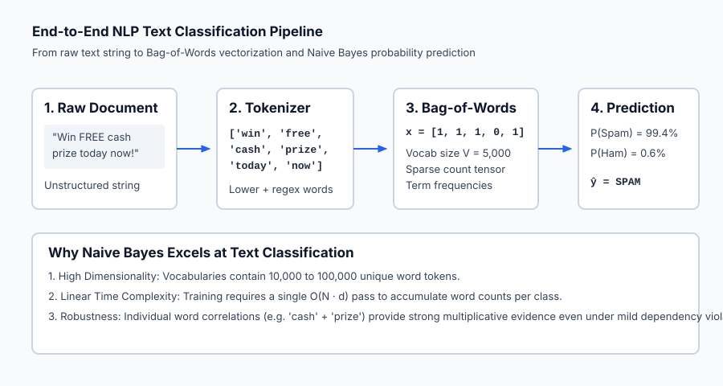

## Why this matters

Language is one of the most unstructured, high-dimensional modalities in data science. A typical vocabulary contains tens of thousands of unique words, and documents range from single-sentence SMS text messages to multi-page legal contracts.

How can a machine learning algorithm classify incoming emails into spam or legitimate correspondence, analyze customer sentiment, or categorize news articles in fractions of a millisecond?

**Naive Bayes** is one of the most effective, elegant, and computationally efficient classification algorithms in history. By combining **Bayes' Theorem** with a daring assumption—that all words in a document appear independently of one another given the topic—Naive Bayes reduces what would otherwise be an intractable multi-thousand-dimensional joint probability distribution into a fast, closed-form counting problem.

Despite its "naive" assumption, Naive Bayes regularly matches or outperforms much more complex models on high-dimensional text data, requires no iterative gradient descent, trains in a single pass through the data, and remains the industry gold standard for spam filtering, topic classification, and baseline natural language processing.

---

## The idea in plain language

Imagine you are a detective trying to decide whether an anonymous letter was written by Alice or Bob.

You have archives of past letters written by both authors. You notice:
- Alice frequently uses words like *"algorithm"*, *"dataset"*, *"optimizer"*, and *"matrix"*.
- Bob frequently uses words like *"budget"*, *"revenue"*, *"forecast"*, and *"quarterly"*.

When a new letter arrives containing the sentence: *"The quarterly forecast shows optimizer improvements"*:
1. You look at your prior knowledge: Alice writes 60% of all letters, and Bob writes 40%.
2. You examine the words:
   - *"quarterly"* is 10 times more likely from Bob.
   - *"forecast"* is 8 times more likely from Bob.
   - *"optimizer"* is 20 times more likely from Alice.
3. You multiply the prior probability by the likelihood of each word given each author.

Even though words in real human speech are deeply connected by grammar and context (the word *"quarterly"* often co-occurs with *"forecast"*), Naive Bayes **naively pretends that every word is drawn independently from a bag of words**.

By simply multiplying the individual word odds together, the collective weight of evidence overwhelmingly reveals the correct author.

---

## Historical background

The theoretical foundation of Naive Bayes dates back to the Reverend Thomas Bayes' posthumous 1763 essay *An Essay towards solving a Problem in the Doctrine of Chances*, presented to the Royal Society by Richard Price. Bayes formulated how prior beliefs should be updated in the light of newly observed evidence.

In the 1950s and 1960s, researchers in information retrieval and medical diagnostics (such as Homer Warner in 1961) began applying Bayesian formulas with independent symptom assumptions to automate medical diagnoses.

In 1998, Andrew McCallum and Kamal Nigam published their landmark paper *A Comparison of Event Models for Naive Bayes Text Classification* at the AAAI Workshop on Learning for Text Categorization. McCallum and Nigam formalized the distinction between the **multi-variate Bernoulli model** (which models binary word presence) and the **multinomial model** (which models word frequency counts).

Throughout the late 1990s and early 2000s, Naive Bayes became famous worldwide as the core engine powering **SpamAssassin**, Paul Graham's essay *A Plan for Spam* (2002), and modern email spam filtering filters that blocked billions of junk emails daily.

---

## What it is — and what it is not

To reason about Naive Bayes with statistical clarity, let us define its properties:

### What it IS:
- **A Generative Classifier:** It models the joint distribution `P(x, y) = P(y) * P(x | y)` by learning how the data was generated in each class, rather than just learning a boundary `P(y | x)`.
- **A Closed-Form Estimator:** It requires zero optimization loops or gradient descent. Training consists solely of counting word occurrences and calculating relative frequencies in `O(N * d)` time.
- **Naturally Multiclass:** It natively handles any number of classes `K` by evaluating `P(y=c | x)` for all `c in {1, ..., K}` without requiring One-vs-Rest wrappers.
- **Log-Linear at Decision Time:** In log-space, the decision boundary between any two classes is a linear hyperplane: `log(P(y=1|x) / P(y=0|x)) = w^T x + b`.

### What it is NOT:
- **Not Cognizant of Word Order:** In a standard Bag-of-Words representation, the sentences *"Dog bites man"* and *"Man bites dog"* produce identical feature vectors.
- **Not Well-Calibrated in Raw Probabilities:** Because the independence assumption multiplies probabilities that are actually correlated, the resulting posterior probabilities tend to be pushed toward extreme values (0.00001 or 0.99999). While the predicted class rankings are exceptionally accurate, the raw probability magnitudes are uncalibrated.
- **Not Limited to Text:** Gaussian Naive Bayes applies directly to continuous real-valued tabular features.

---

## Why it was created and what problems it solves

Naive Bayes solves four fundamental obstacles in statistical machine learning:

1. **The Curse of High-Dimensional Joint Estimation:**
   Estimating a full joint probability table `P(x_1, x_2, ..., x_d | y)` for binary features requires estimating `2^d - 1` parameters. For a small vocabulary of `d = 1,000` words, `2^{1000} approx 10^{301}` parameters—vastly more than the number of atoms in the observable universe! By assuming conditional independence, the number of parameters shrinks to just `2 * d = 2,000` parameters.

2. **The Zero-Frequency Multiplication Problem:**
   If a test email contains an unusual word that never appeared in spam emails during training (e.g. *"persimmon"*), the empirical likelihood `P("persimmon" | spam) = 0`. Multiplying this zero against all other word probabilities would force the entire spam probability to zero. Additive **Laplace smoothing** elegantly prevents this failure.

3. **Sub-Millisecond Training and Inference:**
   When an application must retrain on millions of streaming text documents every hour, neural networks and large language models are cost-prohibitive. Naive Bayes trains instantaneously by incrementing hash map counters.

---

## How it works

Let us derive the exact mathematics of Naive Bayes, from Bayes' Theorem to Laplace smoothing and log-space computation.

### 1. Bayes' Theorem for Classification

Let `x = [x_1, x_2, ..., x_d]` be a feature vector (e.g. word counts), and let `y in {1, ..., K}` represent the target class.

By Bayes' Theorem:

`P(y = c | x) = ( P(y = c) * P(x | y = c) ) / P(x)`

Where:
- `P(y = c)` is the **class prior probability** (the historical proportion of class `c` in the training data).
- `P(x | y = c)` is the **class-conditional likelihood** of observing feature vector `x` given class `c`.
- `P(x) = sum_{k=1}^K P(y = k) * P(x | y = k)` is the **evidence** (marginal probability), acting as a normalizing constant.
- `P(y = c | x)` is the **posterior probability**.

Since `P(x)` is identical for all classes `c`, the classification decision rule chooses the class that maximizes the numerator:

`y_hat = argmax_{c in {1, ..., K}} P(y = c) * P(x_1, x_2, ..., x_d | y = c)`

---

### 2. The Conditional Independence Assumption

The joint likelihood `P(x_1, ..., x_d | y = c)` is difficult to estimate directly. Naive Bayes makes the assumption that all features `x_j` are conditionally independent given class `c`:

`P(x_1, x_2, ..., x_d | y = c) = prod_{j=1}^d P(x_j | y = c)`

Thus, the Naive Bayes classification rule becomes:

`y_hat = argmax_{c in {1, ..., K}} [ P(y = c) * prod_{j=1}^d P(x_j | y = c) ]`

---

### 3. Log-Space Computation (Preventing Underflow)

In practice, multiplying dozens or hundreds of fractional probabilities (e.g. `0.001 * 0.002 * 0.0005 * ...`) causes floating-point numerical underflow to `0.0`.

To eliminate underflow and accelerate computation, we apply the natural logarithm. Because the logarithm is a strictly monotonically increasing function, maximizing the log-likelihood yields the exact same class prediction:

`log [ P(y = c) * prod_{j=1}^d P(x_j | y = c) ] = log P(y = c) + sum_{j=1}^d log P(x_j | y = c)`

In log-space, fragile multiplications are transformed into stable additions!

---

### 4. Multinomial Naive Bayes (Bag-of-Words Model)

For text classification, a document is represented as a count vector `x = [x_1, ..., x_V]`, where `V` is the total vocabulary size and `x_j` is the number of times word `j` appears in the document.

The conditional likelihood follows a Multinomial distribution:

`P(x | y = c) = ( (sum x_j)! / prod (x_j!) ) * prod_{j=1}^V theta_{c, j}^{x_j}`

Ignoring the document length factorial constant, the log-likelihood is:

`log P(x | y = c) = sum_{j=1}^V x_j * log theta_{c, j}`

Where `theta_{c, j}` is the probability of word `j` appearing in class `c`.

#### Additive Laplace Smoothing (`alpha = 1.0`)
Empirically estimating `theta_{c, j}` by raw relative frequency:

`theta_{c, j}^{raw} = N_{c, j} / N_c`

Where `N_{c, j}` is the total count of word `j` across all documents of class `c`, and `N_c = sum_{j=1}^V N_{c, j}` is the total number of words in class `c`.

If word `j` never occurred in class `c`, `N_{c, j} = 0 ==> theta_{c, j} = 0`.

To fix this, we apply **Laplace smoothing** with smoothing parameter `alpha > 0` (typically `alpha = 1.0`):

`theta_{c, j} = ( N_{c, j} + alpha ) / ( N_c + alpha * V )`

- When `alpha = 1`, every word in the vocabulary receives an initial "pseudocount" of 1.
- The denominator increases by `alpha * V` so that the smoothed probabilities across all `V` vocabulary words sum strictly to 1.0: `sum_{j=1}^V theta_{c, j} = 1.0`.

---

### 5. Other Naive Bayes Variants

| Variant | Feature Modality | Likelihood Formula `P(x_j \| y=c)` | Best Used For |
| --- | --- | --- | --- |
| **MultinomialNB** | Discrete word counts / TF-IDF | `theta_{c, j}^{x_j}` with Laplace smoothing | Text classification, spam filtering, topic tagging |
| **BernoulliNB** | Binary indicators `x_j in {0, 1}` | `p_{c, j}^{x_j} * (1 - p_{c, j})^{1 - x_j}` | Short texts, presence/absence keyword triggers |
| **GaussianNB** | Continuous real values `x_j in R` | `(1 / sqrt(2*pi*sigma_{cj}^2)) * exp( -(x_j - mu_{cj})^2 / (2*sigma_{cj}^2) )` | Continuous sensor readings, medical biometric tabular data |

---

## An everyday analogy

Think of Naive Bayes as **a doctor diagnosing a patient using a medical checklist**:

1. **Prior Knowledge (`Class Prior`):** In winter, 20% of clinic patients have the flu (`P(Flu) = 0.20`) and 80% have a common cold (`P(Cold) = 0.80`).
2. **Symptom Independence (`Naive Assumption`):** The doctor considers symptoms (Fever, Cough, Muscle Ache, Fatigue). Even though fever and muscle ache often occur together, the doctor treats each symptom as a separate piece of evidence:
   - High Fever: 80% chance if Flu, 10% chance if Cold.
   - Muscle Aches: 70% chance if Flu, 15% chance if Cold.
3. **Combining Evidence:**
   - Score for Flu: `0.20 * 0.80 * 0.70 = 0.112`
   - Score for Cold: `0.80 * 0.10 * 0.15 = 0.012`
4. **Conclusion:** Flu score is nearly 10 times higher than Cold score, so the doctor diagnoses Flu.

---

## Examples in practice

Let us visualize the probabilistic structure and factorization of Naive Bayes.



The diagram above displays the directed graphical model where class node `y` generates independent feature nodes `x_1, ..., x_d`, alongside the Laplace smoothing formula and log-space scoring formulation.

Below is the animated end-to-end NLP text classification pipeline, tracing a raw email message through tokenization, vocabulary mapping, Bag-of-Words vectorization, and spam probability scoring:



Let us examine real Python code implementing text classification with scikit-learn's `CountVectorizer` and `MultinomialNB`:

```python
import numpy as np
from sklearn.feature_extraction.text import CountVectorizer
from sklearn.naive_bayes import MultinomialNB

# 1. Training corpus
documents = [
    "Win a million dollar cash prize right now free",
    "Urgent winner free cash reward claim your money",
    "Special discount on luxury watches buy today",
    "Engineering sprint planning meeting notes and agenda",
    "Quarterly financial budget and revenue report",
    "Team schedule review and project milestone deadlines"
]
labels = np.array([1, 1, 1, 0, 0, 0]) # 1 = Spam, 0 = Ham

# 2. Extract Bag-of-Words features
vectorizer = CountVectorizer(lowercase=True, stop_words="english")
X_train = vectorizer.fit_transform(documents)

print(f"Vocabulary size: {len(vectorizer.vocabulary_)} unique words")

# 3. Train Multinomial Naive Bayes
clf = MultinomialNB(alpha=1.0)
clf.fit(X_train, labels)

# 4. Test on incoming query emails
test_emails = [
    "Claim your free cash bonus today",
    "Quarterly engineering sprint meeting agenda"
]
X_test = vectorizer.transform(test_emails)
predictions = clf.predict(X_test)
probabilities = clf.predict_proba(X_test)

for email, pred, prob in zip(test_emails, predictions, probabilities):
    label_str = "SPAM" if pred == 1 else "HAM"
    print(f"Email: '{email}' -> {label_str} (P(Spam) = {prob[1]*100:.2f}%)")
```

---

## Implications: security, privacy, performance, scalability, and cost

| Dimension | Characteristic | Practical Implication |
| --- | --- | --- |
| **Training Speed** | Single-pass `O(N * d)` token counting. | Trains in seconds on millions of documents; thousands of times faster than training transformers or gradient-boosted trees. |
| **Memory Footprint** | Stores vocabulary index + `K * V` float probabilities. | Extremely lightweight (~5 MB for a 50,000-word vocabulary with 10 classes). Runs easily on microcontrollers and edge devices. |
| **Adversarial Vulnerability** | Keyword stuffing and token obfuscation attacks. | Spammers can evade Naive Bayes filters by inserting hidden benign words (*"Bayesian poisoning"*) or misspelling spam trigger words (*"c@sh"*, *"fr33"*). |
| **Privacy Preservation** | Only word frequency aggregations are stored. | Retaining only aggregated conditional probabilities `theta_{cj}` prevents exact reconstruction of individual user messages, supporting federated learning. |

---

## Alternatives: free, open source, and commercial

| Tool / Framework | Variant / Feature | License / Cost | Best Used For |
| --- | --- | --- | --- |
| **`scikit-learn` (`MultinomialNB`, `ComplementNB`)** | Text & Count Classifiers | Free, BSD Open Source | Standard CPU text classification, spam filtering, sentiment baselines. |
| **`fastText` (Meta AI)** | Bag-of-Tricks & Subword N-grams | Free, MIT Open Source | Ultra-fast multilingual text classification and subword embeddings. |
| **`NLTK` / `spaCy`** | NLP Preprocessing Toolkits | Free, Apache / MIT | Tokenization, lemmatization, stopword filtering, and linguistic feature extraction. |
| **`Hugging Face Transformers`** | BERT / RoBERTa / DistilBERT | Free, Apache 2.0 | Context-aware deep neural text classification when maximum accuracy is required. |

---

## Comparison with related concepts

| Algorithm | Model Paradigm | Training Complexity | Inference Speed | Handling of Correlated Features |
| --- | --- | --- | --- | --- |
| **Naive Bayes** | Generative (`P(x, y)`) | `O(N * d)` (Single pass) | `O(d)` dot product | Assumes full independence; double-counts redundant features |
| **Logistic Regression** | Discriminative (`P(y \| x)`) | `O(N * d * epochs)` (Iterative) | `O(d)` dot product | Adjusts weights to compensate for correlated features |
| **k-Nearest Neighbors** | Instance-Based (Non-parametric) | `O(1)` (Lazy) | `O(N * d)` (Slow) | Degrades severely in high-dimensional text space |
| **Random Forest** | Tree Ensemble | `O(M * d * N log N)` | `O(M * depth)` | Captures complex non-linear word interactions |

---

## When to use it — and when not to

### When to USE Naive Bayes:
- **High-Dimensional Text Data (`d >> N`):** Bag-of-words text classification, spam filtering, language identification, and sentiment analysis.
- **Strict Real-Time Latency Limits:** When incoming queries must be classified within sub-millisecond network packet inspection loops.
- **Small Training Datasets:** When training samples are scarce; Naive Bayes converges to its asymptotic error rate faster than discriminative models like Logistic Regression.
- **Multiclass Categorization:** When data has dozens or hundreds of categories (e.g. document routing into 50 departments).

### When NOT to use Naive Bayes:
- **Strong Feature Correlations:** When pairs of features carry critical interactive meaning that cannot be separated (e.g. financial tabular metrics where ratios `Debt / Income` matter).
- **Exact Calibrated Probabilities Required:** When downstream decision systems rely on accurate risk odds (use calibrated Logistic Regression instead).
- **Complex Sequential Semantics:** When word order, negation (*"not good"* vs *"good"*), and deep syntactic structure dictate meaning.

---

## Knowledge check

1. **Conditional Independence:** Naive Bayes assumes all features `x_j` are conditionally independent given class label `y`.
2. **Laplace Smoothing:** Adding pseudocount `alpha` prevents unseen tokens from zeroing out the entire joint probability.
3. **Log-Space Computation:** `log P(y) + sum x_j log P(x_j|y)` eliminates floating-point underflow.
4. **Multinomial vs Bernoulli:** MultinomialNB models word counts; BernoulliNB models binary word presence/absence.

---

## Hands-on exercise

In this hands-on exercise, you will implement a Bag-of-Words text vectorizer and build a Laplace-smoothed Multinomial Naive Bayes classifier from scratch.

```python
import numpy as np
import re

# Step 1: Text Tokenization and Vocabulary
def tokenize(text):
    return re.findall(r"\b\w+\b", text.lower())

corpus = [
    "win cash prize today",
    "free lottery cash bonus",
    "project review meeting notes",
    "quarterly budget schedule meeting"
]
labels = np.array([1, 1, 0, 0]) # 1=Spam, 0=Ham

vocab = sorted(list({w for doc in corpus for w in tokenize(doc)}))
word_to_idx = {w: i for i, w in enumerate(vocab)}

# Step 2: Bag-of-Words Matrix
X = np.zeros((len(corpus), len(vocab)))
for i, doc in enumerate(corpus):
    for w in tokenize(doc):
        X[i, word_to_idx[w]] += 1

# Step 3: Laplace-Smoothed Multinomial NB Parameters
alpha = 1.0
classes = np.unique(labels)
log_priors = np.array([np.log(np.sum(labels == c) / len(labels)) for c in classes])

log_likelihoods = []
for c in classes:
    counts_c = np.sum(X[labels == c], axis=0)
    total_words_c = np.sum(counts_c)
    smoothed_probs = (counts_c + alpha) / (total_words_c + alpha * len(vocab))
    log_likelihoods.append(np.log(smoothed_probs))
log_likelihoods = np.array(log_likelihoods) # (2, V)

# Step 4: Classify Test Document
query = "free meeting cash"
query_vec = np.zeros(len(vocab))
for w in tokenize(query):
    if w in word_to_idx:
        query_vec[word_to_idx[w]] += 1

scores = log_priors + np.dot(log_likelihoods, query_vec)
pred = classes[np.argmax(scores)]
print(f"Log Scores: Ham={scores[0]:.4f}, Spam={scores[1]:.4f}")
print(f"Predicted Class: {'SPAM' if pred == 1 else 'HAM'}")
```

### Expected output

```text
Log Scores: Ham=-6.2086, Spam=-4.8690
Predicted Class: SPAM
```

### Validate your work

1. Confirm that exponentiating and summing `exp(log_likelihoods[c])` across all vocabulary features equals `1.0` within `1e-7`.
2. Verify that unseen words in query documents do not produce `NaN` or `-inf` scores.
3. Benchmark your scratch log scores against `sklearn.naive_bayes.MultinomialNB(alpha=1.0)` to confirm exact numerical parity.

### Troubleshooting

- **Regex Splitting Issues:** Use `re.findall(r"\b\w+\b", text.lower())` rather than `text.split(" ")` to strip trailing punctuation like commas and exclamation marks.
- **Log of Zero Warnings:** Always apply Laplace smoothing `(N_cj + alpha) / (N_c + alpha * V)` before calling `np.log`.

### Common mistakes

1. **Forgetting Vocabulary Size in Smoothing Denominator:** Using `N_c + alpha` instead of `N_c + alpha * V` breaks probability normalization.
2. **Not Lowercasing Tokens:** Failing to lowercase text creates separate vocabulary entries for `"Free"` and `"free"`, diluting word counts.

---

## Practice assignment

1. **Implement Bernoulli Naive Bayes:**
   Write a `ScratchBernoulliNB` class that transforms input vectors into binary `(0, 1)` presence masks and computes log likelihoods using `x_j * log(p) + (1 - x_j) * log(1 - p)`.
2. **Stopword Filtering and N-grams:**
   Extend the tokenizer to remove common English stopwords (`"the"`, `"is"`, `"at"`, `"which"`) and extract bigrams (`"cash prize"`, `"free bonus"`). Evaluate whether bigrams improve spam detection accuracy.

---

## Extension challenge

Implement **Complement Naive Bayes (CNB)**:
1. Standard MultinomialNB estimates parameters from class `c`. Complement Naive Bayes estimates word statistics from all documents *excluding* class `c` (`y != c`).
2. Implement the CNB parameter formula:
   `theta_{c, j} = ( sum_{i: y_i != c} x_{ij} + alpha ) / ( sum_{i: y_i != c} sum_j x_{ij} + alpha * V )`
3. Benchmark CNB against MultinomialNB on an imbalanced text dataset to observe how CNB corrects for class size disparities.
