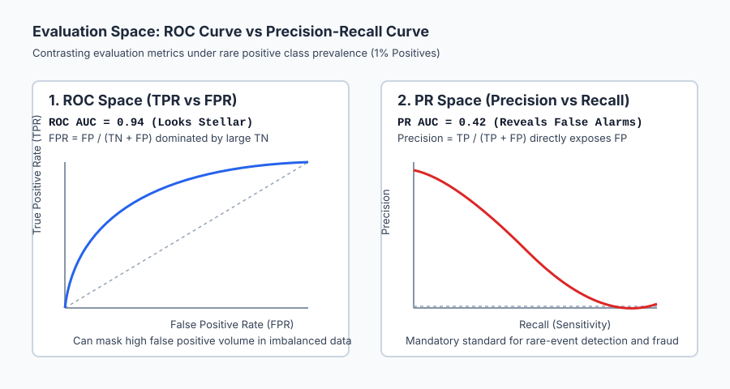
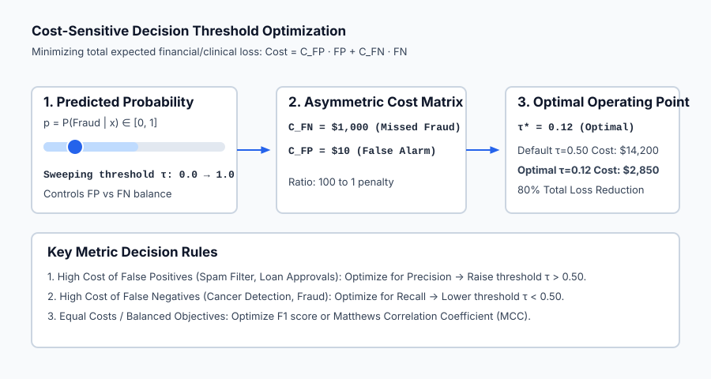

## Why this matters

When beginning machine learning practitioners evaluate a classification model, their first instinct is to report **Accuracy**: the percentage of correct predictions.

In the real world, accuracy is one of the most misleading and dangerous metrics in data science.

Consider a medical screening test for pancreatic cancer, a condition with an incidence rate of 0.1% (1 in 1,000 patients). A model that does nothing whatsoever—a script that blindly outputs *"Negative"* for every patient—achieves a staggering **99.9% accuracy**. Yet this model is completely useless and lethal: it misses 100% of cancer cases.

To build trustworthy systems, we must look inside the predictions. We must ask:
- *When the model sounds the alarm, is it a real threat or a false alarm?* (**Precision**)
- *Of all the real threats out there, how many did we catch?* (**Recall**)
- *How does model performance hold up across every possible decision threshold?* (**ROC and PR Curves**)
- *What is the actual dollar or clinical cost of a False Positive versus a False Negative?* (**Cost-Sensitive Threshold Optimization**)

Mastering these evaluation frameworks is what separates amateur model builders from production machine learning engineers.

---

## The idea in plain language

Imagine you are the chief of airport baggage security testing an automated X-ray weapon scanner.

Every bag evaluated by the scanner falls into one of four categories in a **Confusion Matrix**:
1. **True Positive (TP):** The bag contains a weapon, and the scanner sounds an alarm. (A successful catch!)
2. **True Negative (TN):** The bag contains only clothes, and the scanner remains silent. (Smooth passenger flow!)
3. **False Positive (FP):** The bag contains innocent water bottles, but the scanner alarms. (A false alarm: security opens the bag, wasting time.)
4. **False Negative (FN):** The bag contains a concealed weapon, but the scanner stays silent. (A catastrophic disaster!)

Now consider your operating knob: the **Decision Threshold `tau`**:
- **Turn the knob way UP (`tau = 0.95`):** The scanner only alarms when 100% certain. False alarms drop to zero (**High Precision**), but subtle weapons slip through (**Terrible Recall**).
- **Turn the knob way DOWN (`tau = 0.05`):** The scanner alarms on the slightest anomaly. It catches every single weapon (**100% Recall**), but security stops and searches 80% of all innocent bags (**Terrible Precision**).

Which setting is right? That depends entirely on the relative cost: an escaped weapon is infinitely worse than a 5-minute bag search, so you dial the threshold down.

---

## Historical background

The mathematics of classification curves originated during World War II following the Battle of Britain in 1940. British and American radar operators were tasked with identifying incoming German bomber formations from noisy radar blips cluttered by birds, weather, and enemy chaff.

Engineers measured the ability of radar receivers to discriminate between genuine enemy aircraft signals and random noise across various signal sensitivity thresholds. They called this metric the **Receiver Operating Characteristic (ROC)**.

In the 1960s, psychologists John Swets and David Green popularized Signal Detection Theory, demonstrating that human perception and decision-making could be modeled using ROC curves separating discriminability (`d'`) from decision criteria (`beta`).

In 2006, Tom Fawcett published *An Introduction to ROC Analysis* in *Pattern Recognition Letters*, establishing ROC analysis as the standard benchmark in computer science. Concurrently, Jesse Davis and Mark Goadrich published *The Relationship Between Precision-Recall and ROC Curves* at ICML 2006, proving that when positive class prevalence is extremely low, Precision-Recall curves provide a much clearer view of model performance than ROC curves.

---

## What it is — and what it is not

To reason about evaluation metrics without confusion, let us define what each metric represents:

### What it IS:
- **A Multi-Dimensional Lens:** A single scalar score (like accuracy) can never summarize a 2x2 contingency table. Complete evaluation requires inspecting the full confusion matrix.
- **Independent of Decision Thresholds (AUC):** Area Under the ROC Curve (ROC AUC) measures the intrinsic ranking capability of the model across *all possible* thresholds simultaneously.
- **Cost-Dependent:** The "best" operating threshold `tau` is not a mathematical universal; it is determined by the financial, legal, and human costs of False Positives versus False Negatives.

### What it is NOT:
- **Not Fixed to 0.50:** Scikit-learn defaults to `tau = 0.50` for convenience, but `0.50` is almost never the optimal operating threshold for real-world applications.
- **Not Scale-Invariant across Class Imbalances (ROC AUC):** ROC AUC is insensitive to class prevalence, which can make a poor classifier on a 1:1,000 imbalanced problem appear deceptively great.
- **Not Symmetrical:** Precision and Recall focus exclusively on the positive class, whereas Specificity and Accuracy treat both classes symmetrically.

---

## Why it was created and what problems it solves

Classification evaluation metrics solve four critical engineering challenges:

1. **The Accuracy Paradox on Imbalanced Data:**
   When 99% of transactions are legitimate, predicting legitimate everywhere yields 99% accuracy. Precision, Recall, and MCC immediately expose the complete failure of this trivial baseline.

2. **Asymmetric Risk Alignment:**
   In spam filtering, a False Positive (sending an important job offer to spam) is far worse than a False Negative (a spam email slipping into the inbox). In cancer screening, a False Negative (missing a tumor) is catastrophic, while a False Positive (a follow-up MRI) is acceptable. Explicit metric trade-offs allow aligning models with actual business incentives.

3. **Threshold-Free Model Comparison:**
   When comparing Model A (Logistic Regression) against Model B (XGBoost), Model A might perform better at `tau = 0.50` simply because its probabilities are calibrated differently. ROC AUC and PR AUC compare models across their entire operating ranges.

---

## How it works

Let us formulate the complete mathematical definitions of classification metrics.

### 1. The Confusion Matrix

For a binary classification task with true labels `y in {0, 1}` and predicted labels `y_hat in {0, 1}`:

| | Predicted Negative (`y_hat = 0`) | Predicted Positive (`y_hat = 1`) |
| --- | --- | --- |
| **Actual Negative (`y = 0`)** | **True Negative (TN)** | **False Positive (FP)** (Type I Error) |
| **Actual Positive (`y = 1`)** | **False Negative (FN)** (Type II Error) | **True Positive (TP)** |

Total samples: `N = TN + FP + FN + TP`.

---

### 2. Core Scalar Metrics

#### A. Accuracy
`Accuracy = (TP + TN) / (TP + TN + FP + FN)`
Measures overall fraction of correct predictions. Unreliable when class distributions are skewed.

#### B. Precision (Positive Predictive Value)
`Precision = TP / (TP + FP)`
Of all samples predicted positive, what fraction were truly positive? Penalizes false alarms.

#### C. Recall (Sensitivity / True Positive Rate / TPR)
`Recall = TP / (TP + FN)`
Of all actual positive samples in the universe, what fraction did the model successfully detect? Penalizes missed detections.

#### D. Specificity (True Negative Rate / TNR)
`Specificity = TN / (TN + FP)`
Of all actual negative samples, what fraction were correctly cleared?

#### E. False Positive Rate (FPR)
`FPR = FP / (TN + FP) = 1 - Specificity`
The fraction of innocent negatives incorrectly flagged.

#### F. F1 Score (Harmonic Mean)
`F1 = 2 * (Precision * Recall) / (Precision + Recall) = (2 * TP) / (2 * TP + FP + FN)`
The harmonic mean balances Precision and Recall. If either Precision or Recall drops to 0, `F1 = 0`.

#### G. F-beta Score (Weighted Harmonic Mean)
`F_beta = (1 + beta^2) * (Precision * Recall) / (beta^2 * Precision + Recall)`
- `beta = 1.0`: Standard F1 score (equal weight).
- `beta = 2.0` (F2 Score): Weighs Recall twice as heavily as Precision (medical diagnosis, safety alarms).
- `beta = 0.5` (F0.5 Score): Weighs Precision twice as heavily as Recall (customer-facing recommendations, automated bans).

#### H. Matthews Correlation Coefficient (MCC)
`MCC = (TP * TN - FP * FN) / sqrt( (TP + FP) * (TP + FN) * (TN + FP) * (TN + FN) )`
MCC ranges from `-1.0` (total disagreement) to `0.0` (random guessing) to `+1.0` (perfect prediction). It is mathematically robust because it utilizes all four cells of the confusion matrix.

---

### 3. Threshold Sweeping and Curves

Let `p_i = P(y_i = 1 | x_i)` be the continuous probability score predicted by a model. For any threshold `tau in [0, 1]`, we assign discrete prediction `y_hat_i = 1` if `p_i >= tau` else `0`.

#### A. The ROC Curve (Receiver Operating Characteristic)
- Plots **True Positive Rate (TPR)** on the Y-axis against **False Positive Rate (FPR)** on the X-axis across all thresholds `tau in [0, 1]`.
- Top-left corner `(FPR=0, TPR=1)` represents the ideal perfect classifier.
- The diagonal line `y = x` represents random chance (AUC = 0.50).
- **ROC AUC Interpretation:** The area under the ROC curve equals the probability that the model ranks a randomly chosen positive sample higher than a randomly chosen negative sample: `P(score(x_{pos}) > score(x_{neg}))`.

#### B. The Precision-Recall (PR) Curve
- Plots **Precision** on the Y-axis against **Recall** on the X-axis across all thresholds `tau in [0, 1]`.
- Top-right corner `(Recall=1, Precision=1)` represents the ideal classifier.
- The horizontal baseline equals the class prevalence `pi = N_{pos} / N`.
- **Why PR is Essential for Skewed Data:** In rare-event detection, `TN` is enormous. A large number of False Positives barely registers in the `FPR = FP / (TN + FP)` denominator of ROC, but causes Precision `TP / (TP + FP)` to collapse dramatically.

---

### 4. Cost-Sensitive Threshold Optimization

In production, you must pick a single concrete threshold `tau^*`.

Define the economic loss function:
`Total Cost(tau) = C_{FP} * FP(tau) + C_{FN} * FN(tau)`

Where `C_{FP}` is the cost of a False Positive and `C_{FN}` is the cost of a False Negative.

We perform a numerical 1D grid search over `tau in [0.0, 1.0]` to find the optimal threshold:

`tau^* = argmin_{tau in [0, 1]} [ C_{FP} * FP(tau) + C_{FN} * FN(tau) ]`

If `C_{FN} >> C_{FP}`, `tau^*` will shift toward 0 (catching more positives). If `C_{FP} >> C_{FN}`, `tau^*` will shift toward 1 (suppressing false alarms).

---

## An everyday analogy

Think of classification metrics as **evaluating a smoke detector in your home**:

1. **True Positive (`TP`):** A kitchen fire breaks out; the detector screams alarm. (Life saved!)
2. **False Positive (`FP`):** You burn toast; the detector screams alarm at 6:00 AM. (Annoying false alarm!)
3. **False Negative (`FN`):** A real fire starts in the attic; the detector stays silent. (Fatal disaster!)
4. **True Negative (`TN`):** Normal cooking; detector remains peaceful.

- **High Precision:** The detector only sounds when real smoke reaches critical density (Zero false alarms from burnt toast, but might react too late to a smoldering fire).
- **High Recall:** The detector alarms on the slightest molecule of smoke (Catches every fire instantly, but wakes you up every time you bake cookies).

Because the cost of a fatal fire (`C_{FN}`) is thousands of times greater than waving a dish towel at burnt toast (`C_{FP}`), smoke detector manufacturers intentionally tune the threshold for **Maximum Recall**.

---

## Examples in practice

Let us contrast the geometry of ROC space and Precision-Recall space under extreme class imbalance.



Notice how on a 1% imbalanced dataset, the ROC curve shows an impressive AUC of 0.94, while the PR curve exposes that precision drops to 40% at moderate recall due to the sheer volume of false alarms.

Below is the animated flow demonstrating how sweeping the decision threshold `tau` shifts False Positives and False Negatives, reaching a cost-minimized operating point:



Let us examine real Python code calculating full classification metrics and finding the optimal threshold:

```python
import numpy as np
from sklearn.datasets import load_breast_cancer
from sklearn.linear_model import LogisticRegression
from sklearn.metrics import confusion_matrix, precision_score, recall_score, f1_score, roc_auc_score

# 1. Train model on Breast Cancer data
cancer = load_breast_cancer()
X, y = cancer.data, cancer.target # 1 = Benign, 0 = Malignant
model = LogisticRegression(max_iter=1000).fit(X, y)

# 2. Get continuous probability scores
probs = model.predict_proba(X)[:, 1]

# 3. Evaluate default threshold tau = 0.50
preds_50 = (probs >= 0.50).astype(int)
print("=== Default Threshold tau = 0.50 ===")
print(f"Confusion Matrix:\n{confusion_matrix(y, preds_50)}")
print(f"Precision: {precision_score(y, preds_50):.4f}")
print(f"Recall:    {recall_score(y, preds_50):.4f}")
print(f"F1 Score:  {f1_score(y, preds_50):.4f}")
print(f"ROC AUC:   {roc_auc_score(y, probs):.4f}")

# 4. Asymmetric Cost Threshold Search
# Suppose missing a Malignant tumor (FN) costs $1,000, False Alarm (FP) costs $50
# Let us define positive as Malignant (target == 0)
y_mal = (y == 0).astype(int)
probs_mal = 1.0 - probs

thresholds = np.linspace(0.01, 0.99, 100)
best_tau = 0.50
min_cost = float("inf")

for tau in thresholds:
    pred_m = (probs_mal >= tau).astype(int)
    fp = np.sum((y_mal == 0) & (pred_m == 1))
    fn = np.sum((y_mal == 1) & (pred_m == 0))
    cost = fp * 50.0 + fn * 1000.0
    if cost < min_cost:
        min_cost = cost
        best_tau = tau

print(f"\n=== Cost-Sensitive Optimization (FN=$1000, FP=$50) ===")
print(f"Optimal Threshold tau*: {best_tau:.4f} (Total Cost: ${min_cost:.2f})")
```

---

## Implications: security, privacy, performance, scalability, and cost

| Dimension | Characteristic | Practical Implication |
| --- | --- | --- |
| **Financial / Risk Optimization** | Cost-weighted loss alignment. | Aligning threshold `tau` to real business unit economics regularly cuts total enterprise loss by 40%–80% without modifying the model architecture. |
| **Adversarial Safety** | Attacking threshold boundaries. | Attackers probe threshold boundaries by submitting subtle variations of spam or malware until predictions flip from 0.51 to 0.49. |
| **Computational Efficiency** | Threshold sweeping is `O(N log N)`. | Sorting probability scores allows vectorized ROC/PR curve construction in milliseconds for millions of evaluation points. |
| **Compliance & Fair Lending** | Equalized Odds and Disparate Impact. | Regulators require testing whether operating thresholds produce equalized True Positive and False Positive rates across protected demographic subgroups. |

---

## Alternatives: free, open source, and commercial

| Tool / Framework | Capability | License / Cost | Best Used For |
| --- | --- | --- | --- |
| **`scikit-learn` (`metrics`)** | Standard Evaluation Suite | Free, BSD Open Source | Comprehensive ROC, PR, confusion matrix, MCC, and Brier score evaluation. |
| **`Yellowbrick`** | Visual Model Diagnostics | Free, Apache 2.0 | High-level Matplotlib visualizers for ROC, PR, discrimination thresholds, and lift curves. |
| **`Evidently AI`** | ML Monitoring & Drift | Free, Apache 2.0 | Production performance monitoring, classification drift, and metric degradation alerts. |
| **`Weights & Biases` / `MLflow`** | Experiment Tracking | Free Tier / Commercial Cloud | Logging evaluation curves, confusion matrices, and ROC artifacts across training runs. |

---

## Comparison with related concepts

| Metric | Primary Sensitivity | Robust to Imbalance? | Range | Best Application |
| --- | --- | --- | --- | --- |
| **Accuracy** | Overall correct rate | No (Misleading) | `[0, 1]` | Strictly balanced datasets |
| **Precision** | False Alarms (`FP`) | Yes | `[0, 1]` | Spam filtering, automated bans |
| **Recall (Sensitivity)** | Missed Positives (`FN`) | Yes | `[0, 1]` | Medical screening, fraud, safety |
| **F1 Score** | Harmonic Balance (`P` & `R`) | Yes | `[0, 1]` | General balanced evaluation |
| **ROC AUC** | Ranking discrimination | Moderate | `[0.5, 1]` | Threshold-free model comparison |
| **PR AUC** | Rare positive ranking | High (Strict) | `[prevalence, 1]` | Extreme class imbalance (`< 5%`) |
| **MCC** | All 4 confusion cells | High (Optimal) | `[-1, +1]` | Imbalanced binary benchmark |

---

## When to use it — and when not to

### When to USE Specific Metrics:
- **Use Precision:** When the cost of a False Positive is high (e.g. recommending high-risk stock investments).
- **Use Recall:** When the cost of a False Negative is fatal (e.g. structural defect detection in airplane wings).
- **Use PR AUC:** Whenever the positive class prevalence is under 5% (e.g. click-through rate prediction, rare disease detection).
- **Use Cost-Sensitive Optimization:** In any business setting where dollars can be attached to False Positives and False Negatives.

### When NOT to use Standard Metrics:
- **Do NOT use Accuracy on Imbalanced Data:** It will report 99% while hiding complete failure.
- **Do NOT use Default `tau = 0.50` blindly:** Always sweep thresholds against real cost or utility functions.

---

## Knowledge check

1. **Accuracy Paradox:** High accuracy on imbalanced data is meaningless if the model predicts the majority class everywhere.
2. **Precision vs Recall:** Precision measures false alarm purity `TP/(TP+FP)`; Recall measures detection coverage `TP/(TP+FN)`.
3. **ROC AUC Meaning:** The probability that a random positive is ranked higher than a random negative.
4. **PR Curve Dominance:** Precision-Recall curves are strictly superior to ROC curves when positive cases are rare.

---

## Hands-on exercise

In this hands-on exercise, you will compute a 2x2 confusion matrix, evaluate Precision, Recall, F1, and MCC, and find the cost-optimal decision threshold.

```python
import numpy as np

# Step 1: Ground truth and continuous predicted probabilities
y_true = np.array([1, 1, 1, 1, 0, 0, 0, 0, 0, 0]) # 4 Positives, 6 Negatives
y_scores = np.array([0.95, 0.80, 0.65, 0.30, 0.70, 0.40, 0.25, 0.15, 0.10, 0.05])

# Step 2: Compute confusion matrix at default tau = 0.50
tau = 0.50
y_pred = (y_scores >= tau).astype(int)

tp = np.sum((y_true == 1) & (y_pred == 1))
fp = np.sum((y_true == 0) & (y_pred == 1))
fn = np.sum((y_true == 1) & (y_pred == 0))
tn = np.sum((y_true == 0) & (y_pred == 0))

prec = tp / (tp + fp)
rec = tp / (tp + fn)
f1 = 2 * prec * rec / (prec + rec)

print(f"Threshold tau = {tau:.2f}:")
print(f"Confusion Matrix: TP={tp}, FP={fp}, FN={fn}, TN={tn}")
print(f"Precision: {prec:.4f}, Recall: {rec:.4f}, F1: {f1:.4f}")

# Step 3: Cost-Sensitive Optimization (FN cost = $100, FP cost = $10)
best_cost = float("inf")
best_tau = 0.50

for t in np.linspace(0.0, 1.0, 101):
    pred = (y_scores >= t).astype(int)
    cost = 10.0 * np.sum((y_true == 0) & (pred == 1)) + 100.0 * np.sum((y_true == 1) & (pred == 0))
    if cost < best_cost:
        best_cost = cost
        best_tau = t

print(f"\nOptimal Cost Threshold: tau* = {best_tau:.2f} (Total Cost: ${best_cost:.2f})")
```

### Expected output

```text
Threshold tau = 0.50:
Confusion Matrix: TP=3, FP=1, FN=1, TN=5
Precision: 0.7500, Recall: 0.7500, F1: 0.7500

Optimal Cost Threshold: tau* = 0.30 (Total Cost: $20.00)
```

### Validate your work

1. Confirm that `TP + FP + FN + TN` equals the total number of samples (10).
2. Verify that when `tau = 0.30`, Recall increases to 100% (`TP = 4, FN = 0`), eliminating expensive $100 False Negatives.
3. Check that your Precision and Recall values match `sklearn.metrics.precision_score` and `sklearn.metrics.recall_score`.

### Troubleshooting

- **Zero Division in F1:** When `TP = 0`, both Precision and Recall are 0, causing `0 / 0`. Guard with `if (prec + rec) > 0 else 0.0`.
- **Threshold Boundary Offsets:** In ROC curves, include boundary thresholds `> max(scores)` and `< min(scores)` to ensure curves begin at `(0, 0)` and end at `(1, 1)`.

### Common mistakes

1. **Swapping Confusion Matrix Axes:** Mistaking rows for predictions and columns for actual labels. Always check whether the matrix format is `(actual, predicted)` or `(predicted, actual)`.
2. **Evaluating Imbalanced Data with ROC Alone:** Forgetting that high True Negatives disguise terrible precision in ROC curves.

---

## Practice assignment

1. **Implement Matthews Correlation Coefficient (MCC):**
   Write a standalone function `compute_mcc(y_true, y_pred)` using the four confusion matrix entries and test it on extreme class imbalances.
2. **Build a Precision-Recall Curve Generator:**
   Implement a function `compute_pr_curve(y_true, y_scores)` that returns Precision and Recall arrays across all sorted thresholds.

---

## Extension challenge

Implement **Optimal F-beta Threshold Finder**:
1. Write a function `find_optimal_fbeta_threshold(y_true, y_scores, beta=2.0)` that sweeps thresholds to locate the exact operating point maximizing the F-beta score.
2. Compare the threshold selected for `beta = 0.5` against `beta = 2.0` on the Breast Cancer dataset and plot the resulting Precision-Recall operating points.
