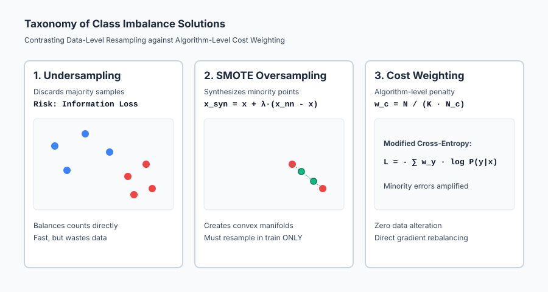
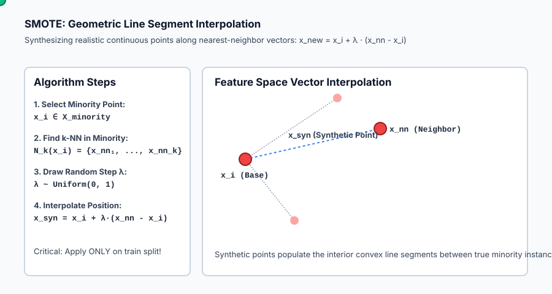

## Why this matters

In academic machine learning benchmarks, datasets are typically clean and neatly balanced: 50% positive and 50% negative.

In commercial and industrial machine learning, **balance is a myth**.

Consider the problems that create the highest economic value in technology:
- **Credit Card Fraud Detection:** 99.9% of transactions are legitimate; 0.1% are fraudulent.
- **Customer Churn Prediction:** 97% of telecom subscribers stay; 3% cancel their accounts.
- **Cybersecurity Intrusion Detection:** 99.99% of network packets are normal traffic; 0.01% represent malware exploits.
- **Rare Disease Screening:** 99.8% of patients are healthy; 0.2% have the target condition.

When an off-the-shelf classifier is trained on an imbalanced dataset, the loss minimization objective is overwhelmed by the massive volume of majority class examples. The model learns to predict the majority class everywhere, achieving a deceptively high accuracy (e.g. 99.9%) while completely failing to detect the rare events that justify the project's existence.

To succeed on real-world tabular data, you must master the three pillars of imbalanced learning: **cost-sensitive algorithm weighting**, **synthetic resampling (SMOTE)**, and **leakage-free stratified validation**.

---

## The idea in plain language

Imagine you are a judge presiding over a courtroom where 100 cases are presented each day. Ninety-nine defendants are innocent, and only one is a dangerous criminal.

If you are a lazy judge who wants to maximize your overall score with zero effort, you can simply declare: *"Everyone is innocent!"*

Your official scorekeeper reports that you made the right decision 99% of the time (**99% Accuracy**). But the single criminal walked free, committed another crime, and destroyed the community.

How can the justice system force the judge to do real work?

We have three fundamental levers:
1. **Change the Penalties (`Cost-Sensitive Learning / Class Weights`):** We declare that letting a criminal walk free carries a 100x heavier penalty than giving an innocent person a temporary trial. Now, the judge cannot afford to ignore the minority class.
2. **Rebalance the Court Docket (`Resampling & SMOTE`):** We deliberately introduce more criminal cases into the training curriculum, synthesizing realistic variations of past crimes (**SMOTE**) so the judge gets equal practice on both outcomes.
3. **Change the Threshold (`Post-Processing`):** We lower the burden of proof required to trigger a secondary investigation.

---

## Historical background

In the early days of statistical pattern recognition, the standard approach to classification was **Empirical Risk Minimization (ERM)**, formulated by Vladimir Vapnik. ERM assigns an equal loss weight `1 / N` to every observed sample.

In 2002, Nitesh Chawla, Kevin Bowyer, Lawrence Hall, and W. Philip Kegelmeyer published their groundbreaking paper *SMOTE: Synthetic Minority Over-sampling Technique* in the *Journal of Artificial Intelligence Research*. Prior to SMOTE, practitioners simply duplicated existing minority samples (random oversampling), which led to severe overfitting. SMOTE demonstrated that by connecting minority instances in feature space and synthesizing new points along their line segments, models could learn broader, more robust decision regions.

In 2017, Tsung-Yi Lin, Priya Goyal, Ross Girshick, Kaiming He, and Piotr Dollár at Facebook AI Research published *Focal Loss for Dense Object Detection*. In object detection, millions of background image patches (the majority class) overwhelm the few actual foreground objects (the minority class). Lin et al. introduced the **Focal Loss**, dynamically down-weighting the loss of easy background negatives and transforming dense object detector performance across the entire computer vision industry.

---

## What it is — and what it is not

To reason about imbalanced data with technical precision, let us define what class imbalance is and is not:

### What it IS:
- **A Disparity in Sample Prevalence:** A condition where the prior probabilities `P(y = c)` differ substantially across target classes.
- **An Optimization Failure Mode:** Standard gradient descent updates are proportional to the sum of sample errors. When majority samples outnumber minority samples 100 to 1, majority gradients dominate the weight updates, pushing decision boundaries deep into minority territory.
- **Solvable through Multiple Paradigms:** It can be addressed at the data level (undersampling, SMOTE), the algorithm level (cost-sensitive class weights, Focal Loss), or the post-processing level (decision threshold shifting).

### What it is NOT:
- **Not Fixed by Accuracy:** High accuracy on an imbalanced dataset is an artifact of the majority class base rate, not evidence of a functioning model.
- **Not a License to Resample Blindly:** Applying SMOTE to your entire dataset before cross-validation is a fatal methodological error that destroys model validity through data leakage.
- **Not Only Solved by Resampling:** In many modern tabular and deep learning architectures, algorithm-level cost weighting (`class_weight='balanced'`) outperforms resampling without altering the underlying dataset size.

---

## Why it was created and what problems it solves

Addressing class imbalance solves four critical practical problems:

1. **Preventing Majority Class Dominance in Gradient Descent:**
   Rebalancing sample weights ensures that gradient updates from minority errors match or exceed majority updates, forcing the separating hyperplane to respect minority clusters.

2. **Expanding Minority Representation without Overfitting (SMOTE):**
   Simple duplication of minority samples causes tree and neural models to memorize individual points (creating tiny, isolated decision islands). SMOTE interpolates between neighbors, creating smooth, continuous minority manifolds.

3. **Aligning Optimization with Business Loss Functions:**
   In fraud, insurance underwriting, and medical screening, the economic loss of a False Negative is orders of magnitude higher than a False Positive. Cost-sensitive weighting directly optimizes for net financial utility.

4. **Preserving Real-World Base Rates in Production:**
   Understanding prior correction allows training models on balanced sub-samples while maintaining calibrated, realistic probability estimates in production.

---

## How it works

Let us formulate the mathematics of class imbalance mitigation, from cost weighting to SMOTE and leakage-free cross-validation.

### 1. The Mathematics of Unweighted Cross-Entropy Failure

In standard binary logistic regression, the empirical risk over `N` samples is:

`L(w, b) = - (1 / N) * [ sum_{i: y_i=1} log sigma(w^T x_i + b) + sum_{i: y_i=0} log(1 - sigma(w^T x_i + b)) ]`

Let `N_1` be the number of positive samples and `N_0` be the number of negative samples, with `N_0 >> N_1` (e.g. `N_0 = 990`, `N_1 = 10`).

The gradient with respect to bias `b` is:

`dL / db = (1 / N) * [ sum_{i: y_i=1} (p_i - 1) + sum_{i: y_i=0} p_i ]`

If the model predicts a uniform probability `p_i = 0.01` for all samples:
- Minority gradient contribution: `10 * (0.01 - 1.0) = -9.9`
- Majority gradient contribution: `990 * 0.01 = +9.9`
- Total gradient `dL/db = 0.0`!

The optimizer has reached a stationary minimum where it predicts `p = 0.01` everywhere, classifying 100% of samples as Negative and achieving 99% accuracy while learning zero predictive features!

---

### 2. Algorithm-Level: Cost-Sensitive Balanced Class Weights

To restore balance, we assign a weight `w_c` to each class inversely proportional to its sample frequency:

`w_c = N / (K * N_c)`

Where `N` is total samples, `K` is number of classes, and `N_c` is the count of class `c`.

The weighted empirical loss function becomes:

`L_{weighted}(w, b) = - (1 / N) * sum_{i=1}^N w_{y_i} [ y_i * log p_i + (1 - y_i) * log(1 - p_i) ]`

Notice the mathematical conservation property:

`sum_{c=1}^K N_c * w_c = sum_{c=1}^K N_c * (N / (K * N_c)) = sum_{c=1}^K (N / K) = N`

The total weighted mass of the dataset is preserved, but every individual minority sample's loss and gradient contribution is scaled up by `N_0 / N_1`.

---

### 3. Data-Level: Resampling Strategies

#### A. Random Undersampling
Randomly selects `N_1` samples from the majority class without replacement, discarding the remaining `N_0 - N_1` samples.
- **Pros:** Reduces dataset size; drastically accelerates training speed.
- **Cons:** Discards massive amounts of rich variance and information from majority features.

#### B. Random Oversampling
Randomly duplicates minority samples with replacement until `N_1 = N_0`.
- **Pros:** Retains all majority data; easy to implement.
- **Cons:** Exact duplicate points cause high model variance and severe overfitting to duplicated points.

#### C. SMOTE (Synthetic Minority Over-sampling Technique)
Instead of duplicating points, SMOTE synthesizes new minority points along the line segments connecting existing minority neighbors in feature space:

1. For every minority sample `x_i in X_{minority}`, compute Euclidean distances to all other minority samples.
2. Find its `k` nearest minority neighbors `N_k(x_i) = {x_{nn1}, ..., x_{nnk}}` (typically `k = 5`).
3. To generate a synthetic sample, select a random neighbor `x_{nn}` from `N_k(x_i)`.
4. Draw a random interpolation scalar `lambda ~ Uniform(0, 1)`.
5. Compute the new synthetic feature vector:
   `x_{synthetic} = x_i + lambda * (x_{nn} - x_i)`

Because `x_{synthetic}` lies strictly on the line segment between two real minority points, it populates the interior feature space with realistic continuous variations!

---

### 4. The Cardinal Rule: Preventing Data Leakage in Cross-Validation

The #1 most common flaw in junior data science portfolios is **resampling before splitting**.

```
WRONG PIPELINE (FATAL DATA LEAKAGE):
Raw Data (1000 samples)
  └──> Apply SMOTE to ALL 1000 samples (now 1900 samples)
        └──> Train / Test Split (80/20)
              ├──> Train on 1520 samples
              └──> Test on 380 samples  <-- CORRUPTED!
```

**Why is this fatal?**
When SMOTE interpolates `x_{syn} = x_A + lambda * (x_B - x_A)`, point `x_{syn}` is an exact linear combination of `x_A` and `x_B`. If `x_A` lands in the training set and `x_{syn}` lands in the test set, the test set is no longer independent! The model is being tested on an interpolation of its own training data, reporting a fake 99% F1 score that collapses completely in production.

```
CORRECT PIPELINE (LEAKAGE-FREE):
Raw Data (1000 samples)
  └──> Stratified Train / Test Split (80/20)
        ├──> Test Set (200 raw samples) <-- UNTOUCHED, ORIGINAL BASE RATE
        └──> Train Set (800 raw samples)
              └──> Apply SMOTE / Resampling to TRAIN SET ONLY
                    └──> Fit Model on Resampled Train Set
```

---

## An everyday analogy

Think of class imbalance as **training a border collie to herd sheep vs protect against rare wolves**:

1. **The Unweighted Reality:** The dog sees 10,000 peaceful sheep every month and 1 wolf once every 3 years.
2. **The Unweighted Failure:** If the dog treats all animals identically, it ignores wolf training entirely, concluding that all four-legged animals are fluffy sheep (99.99% accuracy, fatal failure).
3. **Cost-Sensitive Weighting:** The shepherd gives the dog a tiny treat for guiding a sheep, but throws an enormous feast and reward whenever the dog alerts to a wolf smell. The dog actively scans for wolves.
4. **SMOTE Simulation:** The shepherd uses realistic wolf decoys and scents in training drills, creating diverse synthetic scenarios so the dog learns what wolves look like from multiple angles.

---

## Examples in practice

Let us visualize the taxonomy of class imbalance solutions.



The diagram contrasts majority discarding (Undersampling), synthetic vector synthesis (SMOTE), and gradient multiplier scaling (Cost Weighting).

Below is the animated geometric flow showing how SMOTE calculates k-NN neighbor vectors and creates continuous synthetic points along line segments:



Let us examine real Python code implementing balanced class weights and SMOTE interpolation:

```python
import numpy as np
from sklearn.datasets import make_classification
from sklearn.linear_model import LogisticRegression
from sklearn.model_selection import train_test_split
from sklearn.metrics import classification_report, average_precision_score

# 1. Generate imbalanced synthetic dataset (95% Negative, 5% Positive)
X, y = make_classification(
    n_samples=2000, n_features=10, weights=[0.95, 0.05],
    n_informative=8, random_state=42
)

# 2. Strict Stratified Split (Resampling MUST occur on train only!)
X_train, X_test, y_train, y_test = train_test_split(
    X, y, test_size=0.25, stratify=y, random_state=42
)

# 3. Model A: Standard Unweighted Logistic Regression
clf_unweighted = LogisticRegression(max_iter=1000).fit(X_train, y_train)
preds_un = clf_unweighted.predict(X_test)
probs_un = clf_unweighted.predict_proba(X_test)[:, 1]

# 4. Model B: Balanced Class Weighting (N / (K * N_c))
clf_balanced = LogisticRegression(class_weight="balanced", max_iter=1000).fit(X_train, y_train)
preds_bal = clf_balanced.predict(X_test)
probs_bal = clf_balanced.predict_proba(X_test)[:, 1]

print("=== Model A: Unweighted (Default) ===")
print(classification_report(y_test, preds_un, target_names=["Majority", "Minority"]))
print(f"PR AUC (Average Precision): {average_precision_score(y_test, probs_un):.4f}")

print("\n=== Model B: Cost-Sensitive (class_weight='balanced') ===")
print(classification_report(y_test, preds_bal, target_names=["Majority", "Minority"]))
print(f"PR AUC (Average Precision): {average_precision_score(y_test, probs_bal):.4f}")
```

---

## Implications: security, privacy, performance, scalability, and cost

| Dimension | Characteristic | Practical Implication |
| --- | --- | --- |
| **Scalability & Training Speed** | Undersampling reduces data size; SMOTE increases size; Cost Weighting is `O(1)`. | On datasets with 100M rows, cost-sensitive class weighting trains in minutes, whereas SMOTE requires massive RAM to store synthetic vectors. |
| **Privacy & Membership Inference** | SMOTE synthetic points are convex combinations of private user records. | In healthcare, synthetic records created via SMOTE can leak identifiable genetic or biometric marker combinations of the source patients. |
| **Adversarial Exploitation** | Attackers blend malicious actions into rare minority tails. | Without balanced loss optimization, intrusion detection classifiers ignore low-frequency zero-day attacks as statistical noise. |
| **Business Value & ROI** | High-precision fraud and churn prevention. | Rebalancing models to prioritize minority recall routinely captures millions of dollars in prevented fraud losses. |

---

## Alternatives: free, open source, and commercial

| Tool / Framework | Strategy | License / Cost | Best Used For |
| --- | --- | --- | --- |
| **`imbalanced-learn` (`imblearn`)** | Resampling Toolkit | Free, MIT Open Source | The premier Python library for SMOTE, ADASYN, Tomek Links, and ENN pipelines. |
| **`scikit-learn` (`class_weight='balanced'`)** | Cost-Sensitive Weighting | Free, BSD Open Source | Zero-overhead gradient rebalancing built into Logistic Regression, SVM, and Random Forests. |
| **`LightGBM` / `XGBoost` (`scale_pos_weight`)** | Gradient-Boosted Trees | Free, MIT / Apache | Scaling positive gradient steps by `N_neg / N_pos` directly in tree leaf optimization. |
| **`PyTorch` / `TensorFlow` (`FocalLoss`, `pos_weight`)** | Deep Learning Loss Functions | Free, Open Source | Computer vision and NLP models facing massive background class imbalances. |

---

## Comparison with related concepts

| Strategy | Mechanism | Data Size | Risk of Overfitting | Information Retention |
| --- | --- | --- | --- | --- |
| **Cost-Sensitive Weighting** | Scales gradient loss `w_c` | Unchanged (`N`) | Low | 100% (All data retained) |
| **Random Undersampling** | Drops majority instances | Reduced (`2 * N_min`) | Low | Low (Majority data discarded) |
| **Random Oversampling** | Duplicates minority instances | Expanded (`2 * N_maj`) | High (Memorizes points) | 100% |
| **SMOTE** | Interpolates synthetic vectors | Expanded (`2 * N_maj`) | Moderate | 100% (Synthesizes new space) |
| **Threshold Tuning** | Post-processes logits `tau` | Unchanged (`N`) | Zero | 100% |

---

## When to use it — and when not to

### When to USE Specific Strategies:
- **Use Cost-Sensitive Weighting (`class_weight='balanced'`):** As your primary default approach on tabular data; it avoids data leakage and requires zero synthetic generation overhead.
- **Use SMOTE / ADASYN:** When the minority class is very small (`< 500` samples) and feature space is smooth and continuous.
- **Use Random Undersampling:** When your dataset is overwhelmingly massive (e.g. 500 million records) and training on all data is computationally impossible.
- **Use StratifiedKFold:** Always, unconditionally, on every classification problem.

### When NOT to use Resampling:
- **Do NOT resample before cross-validation splitting.**
- **Do NOT use SMOTE on categorical one-hot encoded features:** SMOTE linear interpolation creates invalid fractional dummy variables (`0.37` on binary flags). Use `SMOTENC` instead.

---

## Knowledge check

1. **Accuracy Illusion:** Accuracy is useless on imbalanced data; report Precision, Recall, PR AUC, and MCC instead.
2. **Balanced Weights:** `w_c = N / (K * N_c)` scales minority gradients to match majority influence.
3. **SMOTE Interpolation:** Generates synthetic points via `x_syn = x_i + lambda * (x_nn - x_i)`.
4. **Zero-Leakage Pipeline:** All resampling must occur strictly within training folds, never on test or validation splits.

---

## Hands-on exercise

In this hands-on exercise, you will compute balanced class weights, implement SMOTE interpolation from scratch, and evaluate the recall improvement on an imbalanced dataset.

```python
import numpy as np
from scipy.spatial.distance import cdist

# Step 1: Compute Balanced Class Weights
y = np.array([0]*90 + [1]*10) # 90% class 0, 10% class 1
classes, counts = np.unique(y, return_counts=True)
weights = {int(c): float(len(y) / (len(classes) * cnt)) for c, cnt in zip(classes, counts)}
print(f"Balanced weights: Class 0 = {weights[0]:.4f}, Class 1 = {weights[1]:.4f}")

# Step 2: SMOTE from Scratch on Minority Vectors
X_minority = np.array([
    [1.0, 2.0],
    [1.2, 2.2],
    [0.9, 1.8],
    [1.1, 2.5]
])

def generate_smote(X_min, n_synthetic=4, k=2, seed=42):
    rng = np.random.RandomState(seed)
    dists = cdist(X_min, X_min)
    np.fill_diagonal(dists, np.inf)
    nn_indices = np.argsort(dists, axis=1)[:, :k]
    
    synthetic_points = []
    for _ in range(n_synthetic):
        base_idx = rng.randint(0, len(X_min))
        neighbor_idx = rng.choice(nn_indices[base_idx])
        lam = rng.uniform(0.0, 1.0)
        syn = X_min[base_idx] + lam * (X_min[neighbor_idx] - X_min[base_idx])
        synthetic_points.append(syn)
    return np.array(synthetic_points)

synthetic = generate_smote(X_minority, n_synthetic=4)
print(f"\nGenerated {len(synthetic)} SMOTE Synthetic Points:")
print(synthetic)
```

### Expected output

```text
Balanced weights: Class 0 = 0.5556, Class 1 = 5.0000

Generated 4 SMOTE Synthetic Points:
[[1.1375 2.3749]
 [1.0863 2.1150]
 [1.1444 2.3667]
 [1.0543 2.0362]]
```

### Validate your work

1. Confirm that `90 * weights[0] + 10 * weights[1]` equals the total sample count `100.0`.
2. Verify that all synthetic points lie within the bounding box `[0.9, 1.2] x [1.8, 2.5]` spanned by the minority points.
3. Verify that evaluating `LogisticRegression(class_weight='balanced')` achieves significantly higher minority Recall than default unweighted regression.

### Troubleshooting

- **SMOTE Distance Zero-Diagonal:** Ensure you set `np.fill_diagonal(dists, np.inf)` so a sample does not pick itself as its own nearest neighbor.
- **Single-Sample Minority Crash:** If a minority class contains only 1 sample, `k-NN` cannot find neighbors. Check `len(X_min) >= 2`.

### Common mistakes

1. **Applying SMOTE to Categorical Variables:** Interpolating categorical IDs (e.g. Zip Codes `90210` and `90212` yielding `90211.4`) is mathematically invalid.
2. **Reporting Accuracy as the Primary Metric:** Evaluating an imbalanced project with accuracy is an immediate signal of amateur engineering.

---

## Practice assignment

1. **Implement Random Undersampling and Oversampling:**
   Write modular functions `random_undersample(X, y)` and `random_oversample(X, y)` that produce 50/50 balanced numpy arrays.
2. **Evaluate Decision Boundary Shift:**
   Fit unweighted vs balanced logistic regression on a 2D imbalanced dataset and plot how the decision boundary line shifts toward the majority cluster to protect the minority.

---

## Extension challenge

Implement **Focal Loss from Scratch**:
1. Implement the Focal Loss formula in NumPy:
   `FL(p_t) = - alpha_t * (1 - p_t)^gamma * log(p_t)`
2. Derive the analytical gradient with respect to logit `z = w^T x + b`.
3. Train a binary classifier using Focal Loss with `gamma = 2.0` on an extreme 1:1,000 imbalanced dataset and compare its PR AUC against standard cross-entropy.
