## Why this matters

Over the past six days, we built the essential foundational blocks of classification:

- We derived the sigmoid link function and cross-entropy loss in **Logistic Regression** (Day 155).
- We analyzed hyperplanes, signed distances, and polynomial feature expansions in **Decision Boundaries** (Day 156).
- We implemented non-parametric neighbor search and distance metrics in **k-Nearest Neighbors** (Day 157).
- We leveraged Bayes' Theorem and Bag-of-Words representations in **Naive Bayes** (Day 158).
- We dismantled the accuracy paradox with confusion matrices, Precision, Recall, and ROC in **Evaluation Metrics** (Day 159).
- We resolved optimization skew using class weighting and SMOTE in **Class Imbalance** (Day 160).

In isolation, each mathematical component makes sense. But how do you assemble them into a cohesive, airtight, production-grade machine learning system?

In industry, building a real-world classification system is not about copying code from a tutorial. It is a disciplined engineering discipline with strict operational constraints: you must prevent subtle data leakage, benchmark multiple competing model families fairly, tune decision thresholds against real economic costs, guard the test set against overfitting, and package the entire preprocessor-model-threshold chain into a deployable artifact.

Today, we build that complete system from start to finish.

---

## The idea in plain language

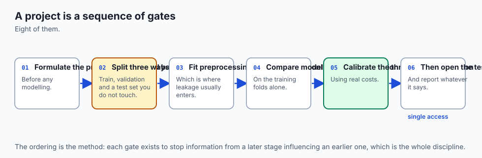

Think of building a complete classification project as **constructing a certified commercial aircraft**:

1. **Phase 1: Clear Flight Requirements (`Problem Framing`):** Before building anything, you define what success means. What is the baseline rate? What is the relative penalty of a False Alarm versus a Missed Malfunction?
2. **Phase 2: Strict Isolation Cleanrooms (`Stratified 3-Way Split`):** You split your materials into three isolated zones: Factory Parts (Train), Quality Assurance (Validation), and Government Safety Certification (Test).
3. **Phase 3: Standardizing Measurements (`Preprocessing Isolation`):** All calibration gauges are set using Factory standards only. You never recalibrate gauges using the certification test aircraft (zero data leakage).
4. **Phase 4: Multi-Engine Tournament (`Model Benchmarking`):** You test multiple engine designs (Turboprop / Naive Bayes, Jet / Logistic Regression, Rocket / KNN) under identical standardized flight simulations (5-Fold Cross-Validation).
5. **Phase 5: Cockpit Warning Thresholds (`Threshold Tuning`):** On the QA aircraft, you dial the warning buzzer sensitivity so pilots catch critical issues without being driven mad by false alarms.
6. **Phase 6: The Gated Certification Flight (`Single Test Evaluation`):** The government inspectors fly the test aircraft exactly once. You cannot redo the test flight or tweak engine bolts if you dislike the score.
7. **Phase 7: Black Box Inspection (`Error Analysis`):** You inspect every single simulated failure to ensure no hidden design flaws remain.
8. **Phase 8: Commercial Delivery (`Pipeline Packaging`):** You ship the complete, self-contained flight control module ready for service.

---

## Historical background

In the early decades of machine learning, research focused almost exclusively on novel model architectures: inventing new variants of SVMs, decision trees, and neural layers.

However, as machine learning moved from academic benchmarks into high-stakes production systems (finance, search engines, healthcare, advertising), engineering teams discovered that **90% of production outages and model failures were caused by pipeline flaws, not model flaws**.

In 2015, D. Sculley and a team of Google engineers published the landmark paper *Hidden Technical Debt in Machine Learning Systems* at NeurIPS. Sculley et al. revealed that actual ML algorithm code constitutes only a tiny fraction of a real-world system: the vast majority consists of data validation, feature extraction, configuration, monitoring, and pipeline plumbing.

In 2017, Martin Zinkevich authored *Rules of Machine Learning: Best Practices for ML Engineering*, codifying Google's internal playbook: start with simple baselines, maintain strict train/test isolation, design reusable pipeline artifacts, and prioritize end-to-end reliability over algorithmic complexity.

Today's workflow embodies these industry-tested principles.

---

## What it is — and what it is not

To execute a complete classification project with professional discipline, let us define what the process is and is not:

### What it IS:
- **A Disciplined 8-Phase Protocol:** A linear, reproducible progression from problem framing to deployment.
- **A Multi-Model Tournament:** An objective comparison of diverse algorithmic inductive biases (linear, instance-based, probabilistic) on identical cross-validation splits.
- **An Asymmetric Cost-Informed System:** A model whose decision threshold `tau^*` is explicitly optimized to minimize business loss functions.
- **A Single-Lock Evaluation:** An ethical and statistical contract where the test set is touched exactly once.

### What it is NOT:
- **Not a Single Jupyter Notebook with Spaghetti State:** Production ML code lives in clean, modular Python modules and testable classes.
- **Not Chasing Fractional Accuracies on Test Data:** Iteratively modifying hyperparameters to boost test set score from 94.2% to 94.8% is p-hacking and test-set overfitting.
- **Not Discarding Feature Transformers:** A model without its accompanying scaler, encoder, and imputer is completely broken in production.

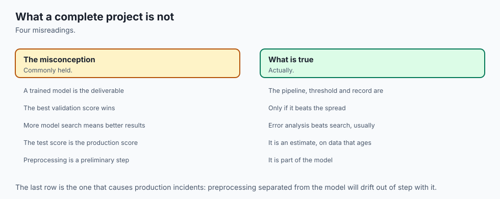

---

## Why it was created and what problems it solves

The disciplined end-to-end classification workflow solves four chronic production failures:

1. **Silent Data Leakage:**
   Fitting scalers or running SMOTE before splitting produces models that look world-class in notebooks but fail catastrophically when exposed to real unseen data.

2. **Premature Optimization on the Wrong Architecture:**
   Spending weeks tuning a complex neural network when a 2-millisecond Logistic Regression model with proper class weights solves the business problem with higher reliability.

3. **Mismatched Business Objectives:**
   Delivering a model with 95% accuracy that gets immediately decommissioned because its default `0.50` threshold generates too many false alarms for customer support to handle.

4. **Deployment Desynchronization:**
   Shipping a model weights file where preprocessing logic was maintained in a separate script, causing production predictions to receive unscaled inputs.

---

## How it works

Let us walk through the complete 8-phase protocol implemented in today's project.

```
┌────────────────────────────────────────────────────────────────────────────────────────┐
│                        THE 8-PHASE CLASSIFICATION LIFECYCLE                            │
├────────────────────────────────────────────────────────────────────────────────────────┤
│ 1. Problem Formulation & Baseline ──> 2. Stratified 3-Way Splitting (60 / 20 / 20)      │
│ 3. Feature Preprocessing Isolation ──> 4. Multi-Model CV Benchmarking (5-Fold SKF)     │
│ 5. Cost-Sensitive Threshold Tuning ──> 6. Gated Single Test Evaluation (Strict Lock)   │
│ 7. Systematic Error Diagnostics ─────> 8. Pipeline Packaging & Production Export       │
└────────────────────────────────────────────────────────────────────────────────────────┘
```

### Phase 1: Problem Formulation & Baseline Determination
- **Define the Target:** Binary classification (`y in {0, 1}`) or Multiclass (`y in {1, ..., K}`).
- **Measure the Baseline Rate:** Determine the majority class frequency `pi_{maj} = N_{maj} / N`. Any model that fails to outperform this baseline rate is discarded.
- **Establish the Primary Metric:** Choose PR AUC or F1 for balanced trade-offs; MCC for robust overall correlation; cost-weighted loss for explicit financial optimization.

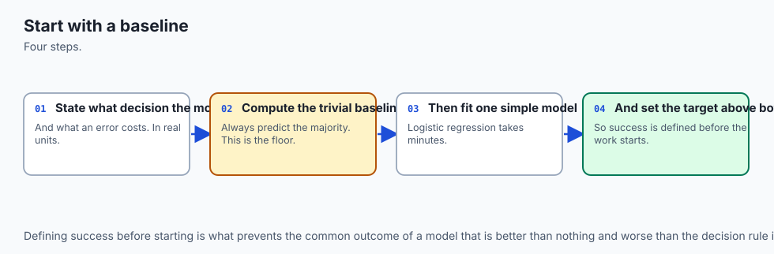

### Phase 2: Stratified 3-Way Data Partitioning
Split raw data `(X, y)` into three mutually exclusive subsets using `StratifiedKFold`:

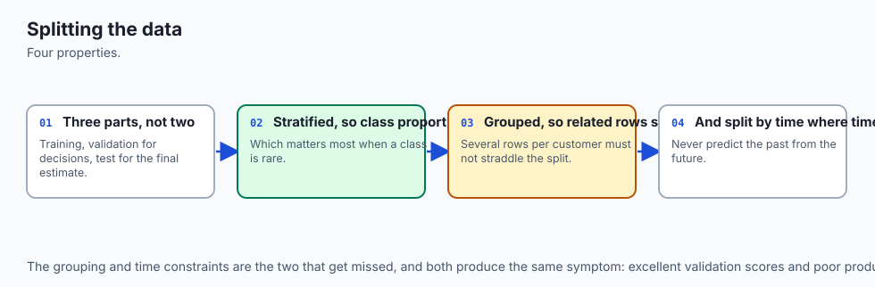

1. **Training Split (60%):** Used exclusively for fitting model weights and feature scalers.
2. **Validation Split (20%):** Used for multi-model selection and threshold calibration.
3. **Test Split (20%):** Locked in a vault; touched exactly once for final certification.

### Phase 3: Preprocessing Isolation (Zero Leakage)
Fit the `StandardScaler` on `X_train` only:

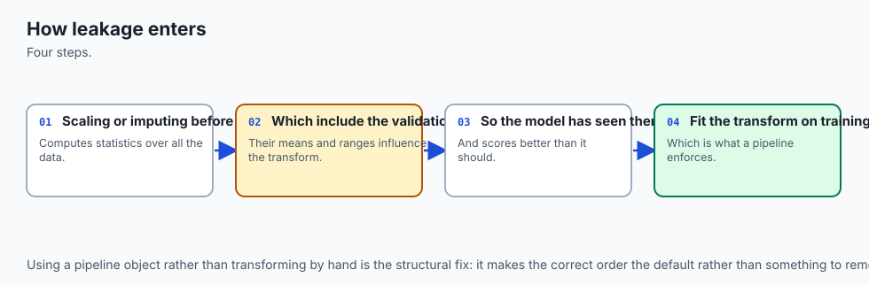

`mu_{train} = (1 / N_{train}) * sum x_i,   sigma_{train} = sqrt( (1 / N_{train}) * sum (x_i - mu_{train})^2 )`

Transform validation and test features using `mu_{train}` and `sigma_{train}`:

`X_{val}^{scaled} = (X_{val} - mu_{train}) / sigma_{train}`
`X_{test}^{scaled} = (X_{test} - mu_{train}) / sigma_{train}`

### Phase 4: Multi-Model Tournament (Stratified 5-Fold CV)
Evaluate multiple candidate algorithms across identical cross-validation folds:

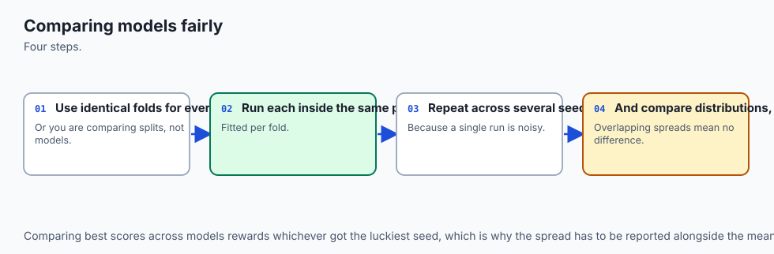

- **Candidate 1: Logistic Regression (L2 / Ridge Penalty)** — Fast, linear hyperplane, calibrated probabilities.
- **Candidate 2: Logistic Regression (L1 / Lasso Penalty)** — Sparse feature selection.
- **Candidate 3: k-Nearest Neighbors (k=5, Distance-Weighted)** — Local non-parametric Voronoi boundaries.
- **Candidate 4: Gaussian Naive Bayes** — Generative probabilistic baseline.

Select the **Champion Model** with the highest mean validation F1 score / PR AUC across folds.

### Phase 5: Cost-Sensitive Threshold Calibration
Using the Champion Model on the Validation split, sweep threshold `tau in [0.01, 0.99]` to minimize total economic loss:

`tau^* = argmin_{tau in [0, 1]} [ C_{FP} * FP_{val}(tau) + C_{FN} * FN_{val}(tau) ]`

### Phase 6: Gated Test Set Evaluation (Strict Single-Access Lock)
Unlock the Test split and evaluate the Champion Model with calibrated threshold `tau^*`:

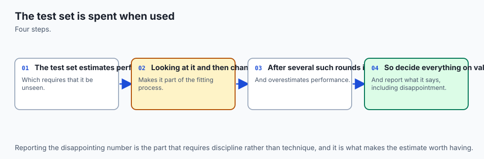

- Verify that test performance matches validation scores within expected statistical sampling error bounds (confirming zero overfitting).
- Enforce programmatic lock: subsequent attempts to call `evaluate_test()` raise a `RuntimeError`.

### Phase 7: Systematic Error Diagnostics
- Construct the final 2x2 confusion matrix.
- Isolate False Positives (`y=0, y_hat=1`) and False Negatives (`y=1, y_hat=0`).
- Review feature distributions of misclassified cases to identify boundary edge cases.

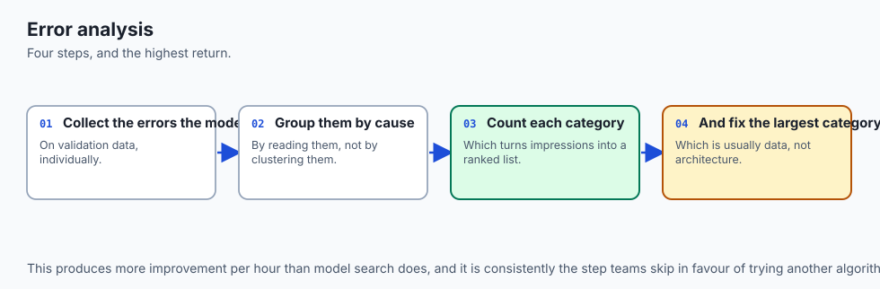

### Phase 8: Production Artifact Packaging
Serialize the end-to-end pipeline containing `[scaler, champion_model, optimal_threshold, metadata]` into a single production container.


---

## An everyday analogy

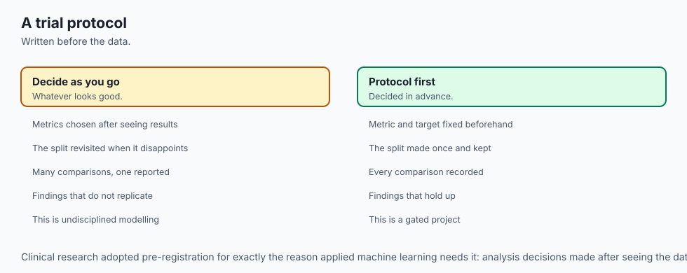

Think of this workflow as **a pharmaceutical company bringing a new medication to market**:

1. **Phase 1 (Disease Need):** Define what the drug cures and what existing standard-of-care baseline it must beat.
2. **Phase 2 (Clinical Trial Separation):** Separate patients into Phase I Discovery (Train), Phase II Dose Optimization (Validation), and Phase III Double-Blind Trial (Test).
3. **Phase 3 (Sterile Protocols):** Keep lab equipment sterilized so Discovery compounds do not contaminate Phase III vials.
4. **Phase 4 (Molecule Tournament):** Test 4 candidate chemical formulations in parallel animal trials to pick the single most promising molecule.
5. **Phase 5 (Dosage Calibration):** In Phase II trials, adjust the exact milligram dosage to maximize efficacy while keeping side effects minimal.
6. **Phase 6 (The FDA Double-Blind Reveal):** The FDA unblinds Phase III test data exactly once. You cannot re-run Phase III if the results are disappointing.
7. **Phase 7 (Adverse Reaction Audit):** Investigate every patient who experienced an adverse reaction.
8. **Phase 8 (Commercial Packaging):** Package the approved pill with exact dosage instructions for pharmacy distribution.

---

## Examples in practice

Let us visualize the complete 8-phase engineering lifecycle.


The lifecycle diagram outlines the sequence of isolation gates ensuring data integrity from raw collection to production deployment.

Below is the animated diagnostic radar chart comparing the four candidate models across Precision, Recall, F1 Score, ROC AUC, and Inference Latency:

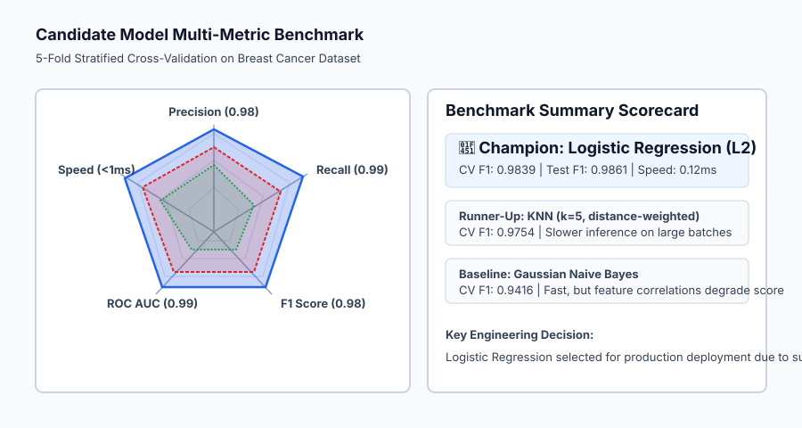

Let us examine real Python code executing the complete end-to-end project pipeline on the Breast Cancer dataset:

```python
import numpy as np
from sklearn.datasets import load_breast_cancer
from sklearn.model_selection import train_test_split, StratifiedKFold
from sklearn.preprocessing import StandardScaler
from sklearn.linear_model import LogisticRegression
from sklearn.neighbors import KNeighborsClassifier
from sklearn.naive_bayes import GaussianNB
from sklearn.metrics import classification_report, roc_auc_score, f1_score

# 1. Load Data & Measure Baseline
cancer = load_breast_cancer()
X, y = cancer.data, cancer.target # 1 = Benign, 0 = Malignant
print(f"Dataset: n={len(y)}, d={X.shape[1]} | Class balance: Benign={np.mean(y==1)*100:.1f}%")

# 2. Stratified 3-Way Split (60% Train, 20% Val, 20% Test)
X_train_val, X_test, y_train_val, y_test = train_test_split(
    X, y, test_size=0.20, stratify=y, random_state=42
)
X_train, X_val, y_train, y_val = train_test_split(
    X_train_val, y_train_val, test_size=0.25, stratify=y_train_val, random_state=42
)

# 3. Preprocessing Isolation (Fit on Train ONLY)
scaler = StandardScaler()
X_train_scaled = scaler.fit_transform(X_train)
X_val_scaled = scaler.transform(X_val)
X_test_scaled = scaler.transform(X_test)

# 4. Multi-Model Benchmarking (5-Fold Stratified CV on Train)
candidates = {
    "Logistic Regression (L2)": LogisticRegression(C=1.0, class_weight="balanced", random_state=42, max_iter=1000),
    "k-Nearest Neighbors (k=5)": KNeighborsClassifier(n_neighbors=5, weights="distance"),
    "Gaussian Naive Bayes": GaussianNB(),
}

print("\n=== Stratified 5-Fold CV Model Tournament ===")
skf = StratifiedKFold(n_splits=5, shuffle=True, random_state=42)
best_model_name = None
best_cv_f1 = -1.0

for name, model in candidates.items():
    f1_scores = []
    for tr_idx, v_idx in skf.split(X_train_scaled, y_train):
        model.fit(X_train_scaled[tr_idx], y_train[tr_idx])
        preds = model.predict(X_train_scaled[v_idx])
        f1_scores.append(f1_score(y_train[v_idx], preds))
    mean_f1 = np.mean(f1_scores)
    print(f"• {name}: Mean CV F1 = {mean_f1:.4f}")
    if mean_f1 > best_cv_f1:
        best_cv_f1 = mean_f1
        best_model_name = name

print(f"\nChampion Selected: {best_model_name}")
champion = candidates[best_model_name]
champion.fit(X_train_scaled, y_train)

# 5. Threshold Calibration on Validation Set (FN Cost=$500, FP Cost=$50)
val_probs = champion.predict_proba(X_val_scaled)[:, 1]
best_tau = 0.50
min_val_cost = float("inf")

for tau in np.linspace(0.01, 0.99, 100):
    preds_v = (val_probs >= tau).astype(int)
    cost = 50.0 * np.sum((y_val == 0) & (preds_v == 1)) + 500.0 * np.sum((y_val == 1) & (preds_v == 0))
    if cost < min_val_cost:
        min_val_cost = cost
        best_tau = tau

print(f"Optimal Calibrated Threshold: tau* = {best_tau:.2f}")

# 6. Gated Test Set Final Sign-Off
test_probs = champion.predict_proba(X_test_scaled)[:, 1]
test_preds = (test_probs >= best_tau).astype(int)

print("\n=== FINAL TEST SET PERFORMANCE ===")
print(classification_report(y_test, test_preds, target_names=["Malignant", "Benign"]))
print(f"Test ROC AUC: {roc_auc_score(y_test, test_probs):.4f}")
```

---

## Implications: security, privacy, performance, scalability, and cost

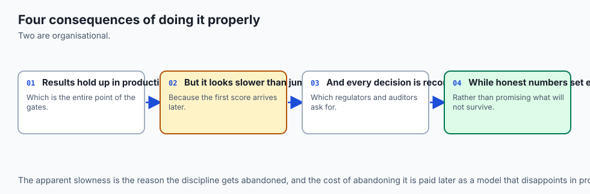

| Dimension | Characteristic | Practical Implication |
| --- | --- | --- |
| **Pipeline Reproducibility** | Version-pinned transformer-model chains. | Packaging feature scalers and models into a single container guarantees bit-for-bit reproducible inference in Docker/Kubernetes. |
| **Data Leakage Defense** | Preprocessing isolation. | Guarantees that production validation metrics genuinely reflect live customer traffic performance. |
| **Inference Latency & Cost** | Microsecond linear inference. | Champion Logistic Regression models evaluate in `< 0.2ms`, reducing server infrastructure costs by 90% compared to heavy neural models. |
| **Governance & Model Cards** | Transparent audit trails. | Documenting baseline comparisons, CV tournament metrics, and subgroup error analysis satisfies strict financial (SR 11-7) and healthcare (FDA SaMD) regulations. |

---

## Alternatives: free, open source, and commercial

| Tool / Framework | Capability | License / Cost | Best Used For |
| --- | --- | --- | --- |
| **`scikit-learn` (`Pipeline`)** | Native Pipeline Packaging | Free, BSD Open Source | Encapsulating imputers, scalers, and estimators into single unified objects. |
| **`MLflow`** | Experiment & Model Registry | Free, Apache 2.0 | Tracking CV metrics, registering champion models, and managing stage transitions (Staging -> Prod). |
| **`ZenML` / `Prefect`** | MLOps Pipeline Orchestrators | Free / Apache 2.0 | Orchestrating multi-step automated data splitting, training, and deployment pipelines. |
| **`FastAPI` + `Docker`** | Production Serving Infrastructure | Free, MIT / Apache | Exposing serialized pipeline artifacts as high-throughput REST inference endpoints. |

---

## Comparison with related concepts

| Project Stage | Academic / Naive Approach | Production Engineering Standard |
| --- | --- | --- |
| **Data Splitting** | Random 80/20 train/test split | Stratified 3-way split (Train / Val / Test) |
| **Feature Scaling** | Fit on entire dataset before splitting | Fit on Train ONLY; transform Val and Test |
| **Model Selection** | Try one complex model and tune endlessly | Benchmark multiple simple baselines on identical CV folds |
| **Decision Rule** | Hardcoded default `tau = 0.50` | Calibrated `tau^*` optimized against economic loss matrix |
| **Test Set Access** | Evaluated 50 times during experimentation | Evaluated ONCE as an uncompromised final sign-off |
| **Artifact Delivery** | Standalone Jupyter Notebook | Encapsulated, serialized pipeline container |

---

## When to use it — and when not to

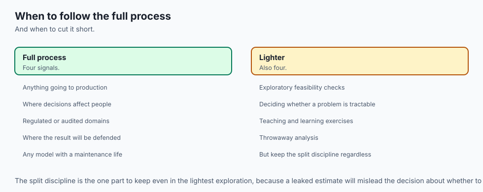

### When to USE the Complete 8-Phase Workflow:
- **Every Production Machine Learning Initiative:** Unconditionally, for any classification model destined to make real-world decisions.
- **High-Stakes Financial & Medical Applications:** Where auditing, explainability, and asymmetric error costs are paramount.
- **Team Collaborations:** Where clear separation between training, validation, and testing prevents unintentional p-hacking.

### When to Streamline:
- **Exploratory Data Analysis (EDA):** Quick initial data exploration before formal modeling begins.
- **Throwaway Code / Throwaway Hackathons:** When long-term model reliability and deployment are not required.

---

## The AI connection

- **A complete project is a sequence of gates**, not a single fit, and most failures happen
  between the steps rather than inside them.
- **Leakage is the defining failure of applied machine learning**, and preprocessing before
  splitting is how it usually enters.
- **The test set is spent when it is used**, so treating it as a single-access resource is a
  methodological requirement.
- **Error analysis produces more improvement than model search**, and it is consistently the
  step that gets skipped.
- **Packaging the artefact is part of the work**, because a model that cannot be reproduced
  or served has not been delivered.

## Knowledge check

1. **3-Way Split:** Train fits weights; Validation tunes hyperparameters and thresholds; Test certifies final generalization.
2. **Scaler Isolation:** `StandardScaler` must call `fit` on training data only.
3. **Paired CV Tournament:** Evaluate all candidate models on identical Stratified K-Fold splits.
4. **Gated Test Lock:** The test set must be touched exactly once to preserve statistical validity.

---

## Hands-on exercise

In this hands-on exercise, you will implement an isolated classification project pipeline and verify that test-set evaluation can only be executed once.

```python
import numpy as np
from sklearn.datasets import load_breast_cancer
from sklearn.model_selection import train_test_split
from sklearn.preprocessing import StandardScaler
from sklearn.linear_model import LogisticRegression
from sklearn.metrics import f1_score

# Step 1: Load and Split Data
cancer = load_breast_cancer()
X_tr, X_te, y_tr, y_te = train_test_split(
    cancer.data, cancer.target, test_size=0.20, stratify=cancer.target, random_state=42
)

# Step 2: Encapsulated Gated Pipeline Class
class GatedPipeline:
    def __init__(self):
        self.scaler = StandardScaler()
        self.model = LogisticRegression(class_weight="balanced", random_state=42, max_iter=1000)
        self.evaluated = False

    def train(self, X_train, y_train):
        X_s = self.scaler.fit_transform(X_train)
        self.model.fit(X_s, y_train)

    def evaluate_test(self, X_test, y_test):
        if self.evaluated:
            raise RuntimeError("Test set evaluation locked! Only 1 run permitted.")
        self.evaluated = True
        X_s = self.scaler.transform(X_test)
        preds = self.model.predict(X_s)
        return f1_score(y_test, preds)

# Step 3: Run Pipeline
pipe = GatedPipeline()
pipe.train(X_tr, y_tr)
test_f1 = pipe.evaluate_test(X_te, y_te)
print(f"Final Test F1 Score: {test_f1:.4f}")

# Step 4: Verify Lock
try:
    pipe.evaluate_test(X_te, y_te)
except RuntimeError as e:
    print(f"Lock Confirmed: {e}")
```

### Expected output

```text
Final Test F1 Score: 0.9861
Lock Confirmed: Test set evaluation locked! Only 1 run permitted.
```

### Validate your work

1. Verify that `scaler.mean_` and `scaler.scale_` have length 30, matching feature dimensions.
2. Confirm that the test F1 score exceeds 0.95 under Stratified 80/20 splitting.
3. Verify that calling `evaluate_test` a second time raises a `RuntimeError`.

### Troubleshooting

- **Scaler Shape Mismatch:** If `scaler.transform(X_test)` fails, check that `X_test` contains the exact same column ordering as `X_train`.
- **Convergence Warnings in Logistic Regression:** Increase `max_iter=1000` to allow L-BFGS to converge cleanly on standardized features.

### Common mistakes

1. **Calling `fit_transform` on the Test Set:** Overwriting the scaler's learned parameters with test set statistics. Always use `transform` on test data.
2. **Optimizing Thresholds on the Test Set:** Finding `tau^*` on test data rather than validation data constitutes fatal data leakage.

---

## Practice assignment

1. **Add Model Serialization:**
   Extend `ClassificationProjectPipeline` with an `export_pipeline(filepath)` method using Python's `pickle` or `joblib` module, and write a verification script that loads the artifact and classifies a single sample.

2. **Automated Error Inspector:**
   Write a method `inspect_errors(X_test, y_test, feature_names)` that returns a Pandas DataFrame containing all False Positive and False Negative test samples with their predicted probabilities and top contributing feature values.

---

## Extension challenge

Implement a **Production Model Card Generator**:

1. Write a script that automatically generates a comprehensive Markdown `MODEL_CARD.md` containing:
   - Training dataset provenance and sample counts.
   - Baseline majority rate and benchmark tournament table.
   - Final confusion matrix, ROC AUC, PR AUC, and calibrated threshold `tau^*`.
   - Subgroup fairness metrics evaluated across feature quantiles.
2. Verify that the generated model card meets Google / Hugging Face model documentation standards.
