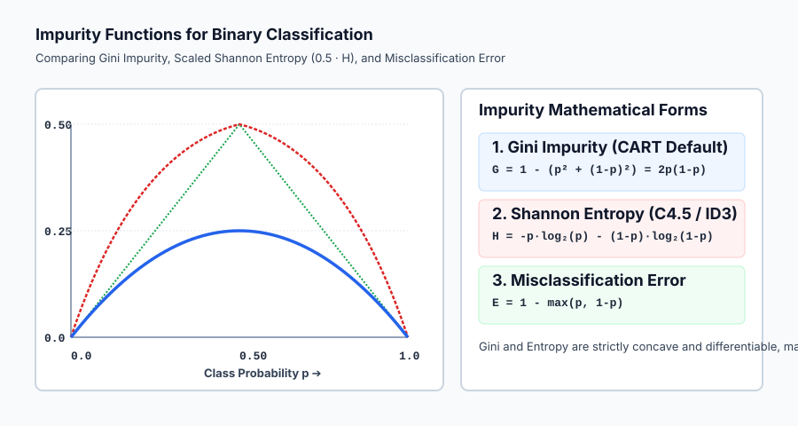

## Why this matters

In Weeks 21 through 23, we studied linear models: linear regression, logistic regression, and their regularized variants. Linear models possess an undeniable elegance: they compute a weighted sum of inputs `w^T x + b`, evaluate a scalar threshold, and produce decisions with microsecond latency.

Yet linear models carry a severe structural limitation: **they can only separate classes with flat, linear hyperplanes**.

If your data contains non-linear interactions (for example, high blood pressure is only dangerous if cholesterol is also elevated), linear models require manual polynomial feature engineering. If your data contains categorical variables with complex hierarchies, linear models require high-dimensional one-hot encodings. If your features have vastly different scales (e.g. income in dollars vs age in years), linear models require standardizing scalers.

**Decision Trees** break free from these geometric restrictions entirely.

A decision tree is a non-parametric model that recursively partitions feature space into axis-aligned rectangular boxes. Trees automatically discover non-linear relationships and high-order feature interactions, accept numerical and categorical features without scaling, handle missing values seamlessly, and present their learned logic as human-readable if-then-else decision rules.

Furthermore, decision trees serve as the foundational atomic building blocks for the most powerful tabular learning algorithms in history: **Random Forests** (Day 163) and **Gradient Boosted Trees** (Days 164–165). Understanding how a single tree splits, grows, and overfits is the prerequisite for mastering all modern tabular machine learning.

---

## The idea in plain language

Imagine playing a game of *20 Questions* with a doctor who is diagnosing a patient:

- **Question 1:** *"Is the patient's resting heart rate above 100 beats per minute?"*
  - If **No**: The doctor moves down the left branch and asks: *"Is body temperature above 38.5°C?"*
  - If **Yes**: The doctor moves down the right branch and asks: *"Is blood oxygen saturation below 92%?"*

Each question is a simple binary split on a single feature: `x_j <= threshold`.

As you follow the questions from the root of the tree down to the leaves, each step narrows down the diagnosis. When you reach a terminal **leaf node**, the tree makes a final prediction: *"Class = Influenza"* or *"Class = Healthy"*.

In geometric terms, each question draws an orthogonal, axis-aligned line across your feature space. Two questions carve the 2D plane into four rectangles; three questions carve 3D space into eight rectangular boxes. Inside each box, the tree predicts the majority class of the training samples that landed there.

---

## Historical background

The conceptual origins of decision trees trace back to the Morgan and Sonquist 1963 Automatic Interaction Detection (AID) program.

In 1984, Leo Breiman, Jerome Friedman, Richard Olshen, and Charles Stone published their monumental book *Classification and Regression Trees* (CART). The CART framework introduced the modern algorithm used across machine learning: binary recursive splitting using **Gini Impurity** for classification, variance reduction for regression, and **Cost-Complexity Pruning** to regularize tree growth.

Concurrently in computer science, J. Ross Quinlan developed **ID3** (Iterative Dichotomiser 3, 1986) and its successor **C4.5** (1993), which used information theory and **Shannon Entropy** to evaluate multi-way splits.

In 2000, Breiman and Friedman's insights culminated in ensemble tree algorithms that continue to dominate tabular Kaggle competitions and commercial predictive modeling pipelines worldwide.

---

## What it is — and what it is not

To reason about decision trees with rigorous engineering clarity, let us define what a decision tree is and is not:

### What it IS:
- **A Non-Parametric Hierarchical Model:** It makes no assumptions about the underlying distribution of data (unlike Gaussian Naive Bayes or linear models).
- **An Axis-Aligned Space Partitioner:** Every internal split evaluates a single feature inequality `x_j <= t`, carving feature space into hyper-rectangles.
- **Scale Invariant:** It depends strictly on the rank-order sorting of feature values. Standardizing, normalizing, or taking logarithms of features has zero impact on split locations.
- **A Greedy Recursive Optimizer:** At each node, CART finds the locally optimal single split that maximizes immediate impurity reduction, without looking ahead to future splits.

### What it is NOT:
- **Not Smooth or Differentiable:** Decision tree predictions are piecewise-constant step functions. They cannot extrapolate smooth linear trends beyond the bounding box of the training data.
- **Not a Global Optimizer:** The greedy split selection cannot guarantee a globally optimal tree. Finding the optimal decision tree is mathematically NP-complete.
- **Not Low-Variance:** A single decision tree is notorious for high variance. Changing a single training sample can drastically alter the root split, creating an entirely different downstream tree structure.

---

## Why it was created and what problems it solves

Decision trees solve five pervasive challenges in tabular machine learning:

1. **Automatic Discovery of Feature Interactions:**
   If feature A only matters when feature B is true, a tree captures this interaction naturally by placing feature A's split inside feature B's subtree.
2. **Zero Feature Preprocessing Overhead:**
   Trees require no scaling, no centering, no outlier clipping, and no monotonic transformations.
3. **Intrinsic Multi-Class Support:**
   Impurity metrics (Gini and Entropy) generalize naturally to `K` classes without requiring One-vs-Rest or One-vs-One wrappers.
4. **Complete Interpretability and Auditability:**
   Every prediction can be explained by tracing a single deterministic path of if-then rules from root to leaf.
5. **Robust Non-Linear Modeling:**
   Trees model complex non-linear decision boundaries with zero manual kernel expansions.

---

## How it works

Let us formulate the mathematics of decision tree induction, impurity functions, greedy split selection, and regularization.

### 1. Impurity Metrics: Quantifying Node Homogeneity

Let node `m` contain `N_m` training samples belonging to `K` distinct classes. The empirical class probability distribution at node `m` is:

`p_{mk} = (1 / N_m) * sum_{i in Q_m} I(y_i == k)`

Where `Q_m` is the set of samples in node `m`, and `sum_{k=1}^K p_{mk} = 1.0`.

How do we measure whether node `m` is pure (all samples belong to one class) or mixed (samples are evenly scattered)?

#### A. Gini Impurity (CART Default)
Gini impurity measures the probability that a randomly chosen element from the set would be incorrectly labeled if it were randomly labeled according to the class distribution in the node:

`G(Q_m) = 1 - sum_{k=1}^K p_{mk}^2 = sum_{k=1}^K p_{mk} (1 - p_{mk})`

- **Pure Node (All Class 1):** `p_1 = 1.0  ==>  G = 1 - (1.0)^2 = 0.0` (Minimum Impurity).
- **Evenly Split Binary Node (50% / 50%):** `p_1 = 0.5, p_2 = 0.5  ==>  G = 1 - (0.25 + 0.25) = 0.50` (Maximum Binary Impurity).
- **Evenly Split K-Class Node:** `p_k = 1/K  ==>  G = 1 - K * (1/K)^2 = 1 - 1/K`.

#### B. Shannon Entropy (Information Theory)
Shannon entropy measures the expected information (in bits) required to describe the class label of a sample in node `m`:

`H(Q_m) = - sum_{k=1}^K p_{mk} * log_2(p_{mk})`

- **Pure Node:** `H = - 1.0 * log_2(1.0) = 0.0 bits`.
- **Evenly Split Binary Node:** `H = - 2 * (0.5 * log_2(0.5)) = - 2 * (0.5 * (-1.0)) = 1.0 bit`.
- **Evenly Split K-Class Node:** `H = log_2(K) bits`.

Gini and Entropy produce nearly identical split rankings in practice. Gini is computationally faster because it requires simple squarings rather than expensive logarithmic evaluations.

---

### 2. Greedy Split Selection in CART

At node `m`, we wish to find a split `theta = (j, t)` where `j` is a feature index (`1 <= j <= D`) and `t` is a real-valued scalar threshold (`t in R`).

The candidate split partitions the `N_m` samples into left and right child subsets:

`Q_{left}(j, t) = { x in Q_m | x_j <= t }`
`Q_{right}(j, t) = { x in Q_m | x_j > t }`

Let `N_L = |Q_{left}|` and `N_R = |Q_{right}|`, with `N_L + N_R = N_m`.

The **weighted child impurity** of split `(j, t)` is:

`G(Q_m, j, t) = (N_L / N_m) * H(Q_{left}) + (N_R / N_m) * H(Q_{right})`

The **Impurity Reduction (Information Gain)** is:

`Delta H(m, j, t) = H(Q_m) - G(Q_m, j, t)`

The CART algorithm evaluates all features `j in {1, ..., D}` and all candidate midpoint thresholds `t`, selecting the optimal split:

`(j^*, t^*) = argmin_{j, t} G(Q_m, j, t) = argmax_{j, t} Delta H(m, j, t)`

---

### 3. Recursive Tree Induction Algorithm

```
Algorithm: BuildTree(Data X, Labels y, current_depth)
1. Check Termination Base Cases:
   - If current_depth >= max_depth
   - Or len(y) < min_samples_split
   - Or all y belong to the same class (Impurity == 0.0)
   - Then Return LeafNode(class = MajorityClass(y))

2. Find Optimal Split:
   - (j*, t*, min_cost) = FindBestSplit(X, y)
   - If no valid split found (e.g. all features identical):
       Return LeafNode(class = MajorityClass(y))

3. Partition Data:
   - Left_Mask = (X[:, j*] <= t*)
   - Right_Mask = ~Left_Mask

4. Recursive Children:
   - LeftChild = BuildTree(X[Left_Mask], y[Left_Mask], current_depth + 1)
   - RightChild = BuildTree(X[Right_Mask], y[Right_Mask], current_depth + 1)

5. Return InternalNode(feature = j*, threshold = t*, Left = LeftChild, Right = RightChild)
```

---

### 4. Overfitting Mechanisms and Regularization

If left unconstrained, a decision tree will continue splitting until every single training sample occupies its own private leaf node (`Gini = 0.0`, `100% Training Accuracy`).

An unpruned tree memorizes noisy training points, outliers, and spurious correlations, creating tiny, jagged decision regions that fail completely on unseen test data.

```
┌────────────────────────────────────────────────────────────────────────┐
│               DECISION TREE REGULARIZATION TECHNIQUES                  │
├────────────────────────────────────────────────────────────────────────┤
│ 1. max_depth: Limits tree height (e.g. depth 3 to 6).                  │
│ 2. min_samples_split: Minimum samples required to attempt a split.    │
│ 3. min_samples_leaf: Minimum samples required in any leaf node.        │
│ 4. max_leaf_nodes: Maximum total number of terminal leaves allowed.   │
│ 5. ccp_alpha: Minimal Cost-Complexity Pruning penalty.                 │
└────────────────────────────────────────────────────────────────────────┘
```

**Cost-Complexity Pruning (`ccp_alpha`):**
Finds the subtree `T` that minimizes the penalized cost function:

`R_alpha(T) = R(T) + alpha * |T|`

Where `R(T)` is the total misclassification rate of tree `T`, `|T|` is the number of terminal leaf nodes, and `alpha >= 0` is the complexity parameter governing the trade-off between tree size and fit quality.

---

## An everyday analogy

Think of a decision tree as an **expert game of 20 Questions**:

1. **The Root Question:** The player asks the single question that splits the universe of possibilities in half with maximum certainty (*"Is it alive?"*).
2. **The Branching Logic:** Depending on the answer, the next question adapts entirely (*"Is it an animal?"* vs *"Is it made of metal?"*).
3. **The Leaf Conclusion:** After 5 or 6 well-chosen questions, the player arrives at a high-confidence answer (*"It is a Golden Retriever"*).
4. **The Overfitting Danger:** If the player is allowed 1,000 questions, they will ask: *"Was it sitting on the corner of 5th and Main at 3:14 PM yesterday wearing a blue collar?"* This question perfectly identifies the specific dog in the training sample, but fails to recognize any other dog in the world.

---

## Examples in practice

Let us visualize the equivalence between binary tree hierarchies and orthogonal 2D feature space partitioning.



The diagram contrasts hierarchical branching rules with the geometric bounding boxes carved out in feature space.

Below is the comparison between Gini Impurity, Scaled Shannon Entropy, and Misclassification Error:



Let us examine real Python code fitting a decision tree from scratch and comparing it against scikit-learn:

```python
import numpy as np
from sklearn.datasets import load_iris
from sklearn.tree import DecisionTreeClassifier
from sklearn.model_selection import train_test_split
from sklearn.metrics import accuracy_score

# 1. Load Iris Data
iris = load_iris()
X, y = iris.data, iris.target

X_train, X_test, y_train, y_test = train_test_split(
    X, y, test_size=0.30, stratify=y, random_state=42
)

# 2. Fit Decision Tree with Depth Constraint
tree_clf = DecisionTreeClassifier(
    criterion="gini",
    max_depth=3,
    min_samples_split=4,
    min_samples_leaf=2,
    random_state=42
)
tree_clf.fit(X_train, y_train)

# 3. Evaluate Predictions
train_acc = accuracy_score(y_train, tree_clf.predict(X_train))
test_acc = accuracy_score(y_test, tree_clf.predict(X_test))

print("=== Decision Tree Performance ===")
print(f"Training Accuracy: {train_acc * 100:.2f}%")
print(f"Test Accuracy:     {test_acc * 100:.2f}%")
print(f"Tree Depth:        {tree_clf.get_depth()}")
print(f"Number of Leaves:  {tree_clf.get_n_leaves()}")
print("\nFeature Importances (MDI):")
for name, imp in zip(iris.feature_names, tree_clf.feature_importances_):
    print(f"• {name:20s}: {imp:.4f}")
```

---

## Implications: security, privacy, performance, scalability, and cost

| Dimension | Characteristic | Practical Implication |
| --- | --- | --- |
| **Inference Latency & Cost** | `O(depth)` integer comparisons. | Evaluating a decision tree involves 3 to 10 numerical comparisons, executing in `< 10` microseconds with zero matrix multiplications. |
| **Training Complexity** | `O(D * N * log N * depth)`. | Finding splits requires sorting feature columns. On massive datasets (`N > 10M`), training a single tree can become memory-intensive. |
| **Data Privacy & Leakage** | Single-sample leaf memorization. | In unpruned trees, individual leaf nodes can isolate single private records, allowing attackers to infer sensitive user attributes. |
| **Explainability & Compliance** | Full rule extraction. | Tree logic can be exported directly into SQL `CASE WHEN` statements, satisfying strict regulatory transparency requirements. |

---

## Alternatives: free, open source, and commercial

| Tool / Framework | Architecture | License / Cost | Best Used For |
| --- | --- | --- | --- |
| **`scikit-learn` (`DecisionTreeClassifier`)** | Optimized C-accelerated CART | Free, BSD Open Source | Baseline tree modeling, fast prototyping, and visualization with `plot_tree`. |
| **`XGBoost` / `LightGBM` / `CatBoost`** | Boosted Tree Ensembles | Free, Apache / MIT | Production tabular modeling; combines hundreds of shallow trees for state-of-the-art accuracy. |
| **`treelite`** | Tree Model Compiler | Free, Apache 2.0 | Compiling tree models into standalone C code for microsecond edge deployment. |
| **`RuleFit`** | Rule-Extraction Sparse Linear Models | Free, Open Source | Extracting linear sparse combinations of tree decision rules for high interpretability. |

---

## Comparison with related concepts

| Characteristic | Linear / Logistic Regression | k-Nearest Neighbors (KNN) | Single Decision Tree |
| --- | --- | --- | --- |
| **Decision Boundary** | Flat linear hyperplane | Complex curved Voronoi cells | Axis-aligned rectangular boxes |
| **Feature Scaling** | Strictly required | Strictly required | Not required (Scale invariant) |
| **Interpretability** | High (Weights `w_j`) | Low (Black box distances) | High (If-then rule paths) |
| **Non-Linear Relationships**| Requires manual interactions | Natural non-linear fitting | Natural non-linear fitting |
| **Variance / Overfitting** | Low variance | Sensitive to `k` | Very high variance (Needs pruning) |

---

## When to use it — and when not to

### When to USE a Single Decision Tree:
- **Maximum Interpretability is Required:** When business stakeholders or regulators require human-auditable if-then rules.
- **Fast Exploratory Baseline:** To quickly discover key feature interactions without data scaling.
- **Edge Devices with Constrained Compute:** Where model size must be `< 50 KB` and evaluate without linear algebra libraries.

### When NOT to use a Single Decision Tree:
- **When Maximum Predictive Accuracy is Needed:** A single tree is almost always beaten by ensembles (Random Forests, XGBoost).
- **Linear or Diagonal Trends:** Trees approximate diagonal hyperplanes with jagged step functions, requiring excessive depth.
- **Continuous Extrapolation:** Trees output constant step values outside the training bounding box and cannot extrapolate trends.

---

## Knowledge check

1. **Axis-Aligned Splits:** Trees evaluate `x_j <= t`, creating orthogonal rectangular boundaries.
2. **Gini vs Entropy:** `G = 1 - sum(p_k^2)` is fast and polynomial; `H = - sum(p_k log2 p_k)` is information-theoretic.
3. **Scale Invariance:** Trees depend solely on rank ordering; feature scaling has zero effect.
4. **Regularization:** `max_depth`, `min_samples_split`, and `ccp_alpha` prevent leaf-level memorization.

---

## Hands-on exercise

In this hands-on exercise, you will compute Gini impurity, find the optimal split on a 2D dataset, and construct a recursive binary tree node.

```python
import numpy as np

# Step 1: Implement Gini Impurity
def gini(y):
    if len(y) == 0:
        return 0.0
    _, counts = np.unique(y, return_counts=True)
    return float(1.0 - np.sum((counts / len(y)) ** 2))

print("Gini of pure node [0, 0, 0]:", gini(np.array([0, 0, 0])))
print("Gini of balanced node [0, 1]:", gini(np.array([0, 1])))
print("Gini of 70/30 split:", gini(np.array([0]*7 + [1]*3)))

# Step 2: Optimal Split Search
X = np.array([[1.0, 5.0], [2.0, 6.0], [5.0, 2.0], [6.0, 1.0]])
y = np.array([0, 0, 1, 1])

def find_best_split(X, y):
    N, D = X.shape
    best_feat, best_t, best_cost = -1, 0.0, float("inf")
    for j in range(D):
        vals = np.unique(X[:, j])
        threshs = (vals[:-1] + vals[1:]) / 2.0
        for t in threshs:
            l_mask = X[:, j] <= t
            r_mask = ~l_mask
            cost = (np.sum(l_mask)/N) * gini(y[l_mask]) + (np.sum(r_mask)/N) * gini(y[r_mask])
            if cost < best_cost:
                best_cost, best_feat, best_t = cost, j, t
    return best_feat, best_t, best_cost

feat, thresh, cost = find_best_split(X, y)
print(f"\nOptimal Split: Feature x_{feat} <= {thresh:.2f} (Weighted Gini = {cost:.4f})")
```

### Expected output

```text
Gini of pure node [0, 0, 0]: 0.0
Gini of balanced node [0, 1]: 0.5
Gini of 70/30 split: 0.42

Optimal Split: Feature x_0 <= 3.50 (Weighted Gini = 0.0000)
```

### Validate your work

1. Verify that `gini([0, 1]) == 0.50` and `gini([0, 1, 2]) == 2/3`.
2. Confirm that `find_best_split` returns `feat = 0` and `threshold = 3.50` with `Gini = 0.0`.
3. Verify that fitting `DecisionTreeClassifier(max_depth=3)` achieves `>= 95%` accuracy on Iris.

### Troubleshooting

- **Empty Split Mask:** Ensure you skip thresholds where `sum(l_mask) == 0` or `sum(r_mask) == 0`.
- **Single Unique Value in Column:** Check `len(np.unique(X[:, j])) >= 2` before computing midpoint thresholds.

### Common mistakes

1. **Normalizing Features Before Trees:** Unnecessary computation that provides zero accuracy benefit.
2. **Growing Unconstrained Trees:** Forgetting `max_depth` or `min_samples_leaf` leads to severe test-set overfitting.

---

## Practice assignment

1. **Implement Regression Trees (Variance Reduction):**
   Replace Gini impurity with Mean Squared Error `MSE = (1/N) * sum (y_i - y_bar)^2` and build a decision tree regressor from scratch.
2. **Implement Feature Importance Calculation:**
   Traverse a fitted tree and compute Mean Decrease in Impurity (MDI) for each feature by summing the impurity drops `N_m * Delta H(m)` across all internal nodes.

---

## Extension challenge

Implement **Minimal Cost-Complexity Pruning from Scratch**:
1. Implement the weakest-link pruning algorithm that iteratively collapses internal nodes with the smallest effective alpha `g(t) = (R(t) - R(T_t)) / (|T_t| - 1)`.
2. Generate the cost-complexity pruning path `(alpha_1, ..., alpha_k)` and use 5-fold cross-validation to select the optimal pruning parameter `alpha^*`.
