## Why this matters

In Day 162, we discovered the immense expressive power and critical vulnerability of a single Decision Tree. While a decision tree can carve out intricate non-linear decision boundaries without feature scaling, it is notoriously unstable: an unpruned tree exhibits **massive variance**. Changing a single sample in the training set can completely alter the root split, cascading down into a wildly different downstream tree and generating brittle, overfit predictions.

How do we eliminate the high variance of decision trees while retaining their ability to model non-linear interactions?

The answer is **Random Forests**, conceived by Leo Breiman in 2001.

A Random Forest is an ensemble of dozens or hundreds of deep, high-variance decision trees. By combining **Bootstrap Aggregation (Bagging)** with **Random Feature Subspace selection**, Random Forests force the individual trees to be diverse and decorrelated. When you average the predictions of hundreds of decorrelated trees, their individual errors cancel out mathematically, driving model variance down to near zero while preserving the low bias of deep trees.

For over two decades, Random Forests have remained the gold standard baseline for tabular machine learning: robust to outliers, virtually immune to overfitting, requiring minimal hyperparameter tuning, and providing built-in cross-validation through **Out-of-Bag (OOB)** error estimation.

---

## The idea in plain language

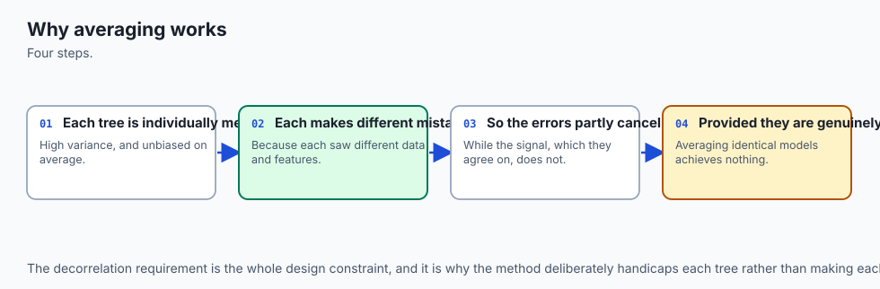

Imagine you want to diagnose a rare medical condition.

If you consult a **single doctor** (a single Decision Tree), they might be brilliant, but their diagnosis could be swayed by an unusual patient they treated yesterday. Their individual judgment carries high variance.

Now imagine consulting a **panel of 100 independent doctors** (a Random Forest):

1. **Diverse Experience (Bagging):** Each doctor studied at a slightly different hospital and examined a randomized subset of medical case records.
2. **Diverse Questions (Random Subspaces):** When interviewing the patient, each doctor is given a randomly restricted list of diagnostic tests. Doctor 1 looks at blood pressure and glucose; Doctor 2 looks at oxygen levels and ECG; Doctor 3 looks at genetics and age. This prevents all 100 doctors from focusing solely on the same single obvious symptom.
3. **Democratic Majority Vote:** After all 100 doctors examine the patient independently, they cast their votes. If 88 doctors vote *"Condition A"* and 12 vote *"Condition B"*, the consensus prediction is *"Condition A"*.

The consensus of 100 diverse, decorrelated experts is vastly more reliable and robust than the opinion of any single expert.

---

## Historical background

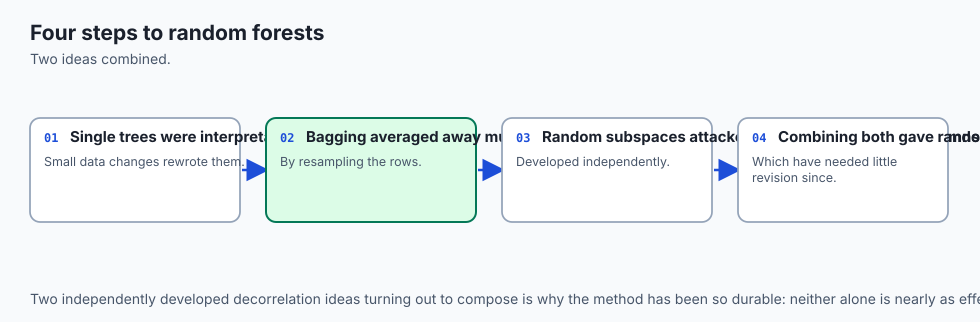

The theoretical foundation of ensembling began with Condorcet's Jury Theorem in 1785, which proved mathematically that if each juror has a probability `p > 0.5` of making a correct decision independently, the probability that the majority vote is correct approaches `1.0` as the jury size grows.

In 1996, Leo Breiman published *Bagging Predictors*, demonstrating that training estimators on bootstrap replicates of training data significantly reduces variance for unstable models like decision trees and neural networks, but does not help stable models like linear regression.

Concurrently in 1995, Tin Kam Ho at Bell Labs introduced the **Random Subspace Method**, showing that restricting trees to random subsets of features increases ensemble diversity.

In 2001, Breiman unified bagging, random feature subspaces, and out-of-bag error estimation in his seminal paper *Random Forests*. Breiman's algorithm required no gradient descent, no learning rate schedules, and no feature scalers, instantly becoming one of the most widely deployed algorithms in industry.

---

## What it is — and what it is not

To engineer with Random Forests effectively, we must define their exact characteristics:

### What it IS:
- **A Bagged Ensemble of Randomized Trees:** An ensemble of `B` fully grown or deep decision trees trained on independent bootstrap samples.
- **A Variance Reduction Machine:** It reduces variance by `1/B` without increasing individual tree bias.
- **A Parallel / Embarrassingly Parallel Algorithm:** All `B` trees are completely independent and can be trained simultaneously across all available CPU cores.
- **A Self-Validating Model:** Provides unbiased out-of-bag error estimates without requiring a separate train/validation split.

### What it is NOT:
- **Not a Boosting Algorithm:** Trees are trained independently in parallel, NOT sequentially to correct previous errors (which is Gradient Boosting, Day 164).
- **Not an Extrapolator:** A Random Forest outputs the average of leaf predictions; it cannot extrapolate linear trends beyond the minimum and maximum target values observed in the training data.
- **Not Compact in Memory:** Storing 500 deep decision trees can require gigabytes of RAM compared to a compact vector of linear model weights.

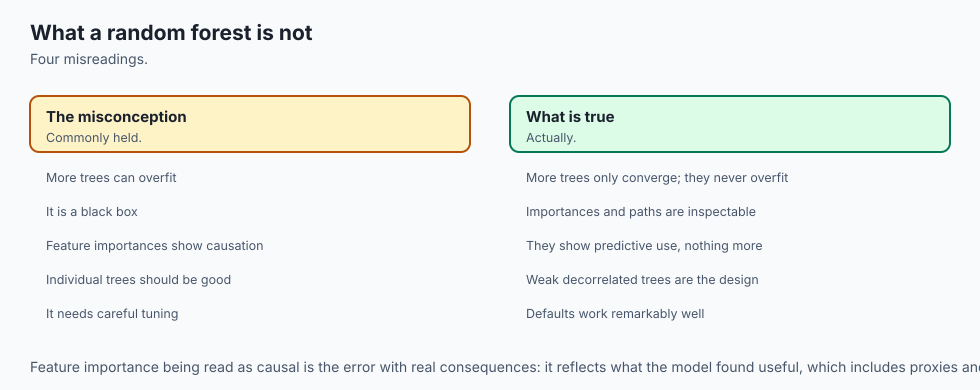

---

## Why it was created and what problems it solves

Random Forests solve five critical failure modes of single decision trees:

1. **Eliminates High Variance and Instability:** Averaging `B` decorrelated trees smooths out jagged step-function boundaries into smooth, probabilistic contours.
2. **Immunity to Overfitting from Tree Count:** Adding more trees (`n_estimators`) does not cause overfitting; it monotonically stabilizes predictions until variance reaches its theoretical lower bound.
3. **No Separate Validation Split Required:** The Out-of-Bag (OOB) mechanism provides free, unbiased validation metrics on the training set.
4. **Resilience to Dominant Spurious Features:** Random feature subsampling (`max_features = sqrt(D)`) prevents a single dominant feature from dictating every tree's root split.
5. **Handles High-Dimensional Tabular Data Gracefully:** Excels when `D > N` (e.g. genomics or text embeddings) where linear models struggle with collinearity.

---

## How it works

Let us formulate the mathematics of ensemble variance reduction, bootstrap sampling, random subspaces, and OOB error estimation.

### 1. The Mathematical Variance of an Ensemble

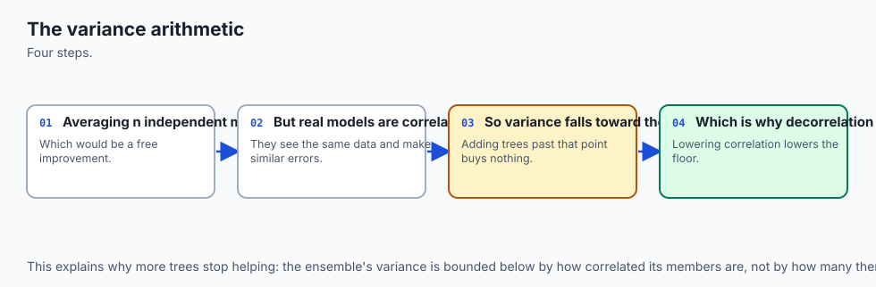

Consider an ensemble of `B` identically distributed (but not necessarily independent) base estimators `f_1(x), f_2(x), ..., f_B(x)`.

Let each base estimator have variance `Var(f_b(x)) = sigma^2`, and let the pairwise correlation between any two distinct estimators be:

`rho = Corr(f_i(x), f_j(x))  for all i != j`

The ensemble prediction is the simple average:

`bar{f}(x) = (1 / B) * sum_{b=1}^B f_b(x)`

The variance of the ensemble average is derived as:

`Var(bar{f}(x)) = Var( (1 / B) * sum_{b=1}^B f_b(x) )`
`= (1 / B^2) * [ sum_{b=1}^B Var(f_b(x)) + sum_{i != j} Cov(f_i(x), f_j(x)) ]`
`= (1 / B^2) * [ B * sigma^2 + B * (B - 1) * rho * sigma^2 ]`
`= rho * sigma^2 + ((1 - rho) / B) * sigma^2`

Let us analyze this fundamental formula:

1. **If estimators are perfectly correlated (`rho = 1.0`):**
   `Var(bar{f}(x)) = 1.0 * sigma^2 + 0 = sigma^2` (Zero variance reduction!).

2. **If estimators are completely independent (`rho = 0.0`):**
   `Var(bar{f}(x)) = (1 / B) * sigma^2` (Variance drops linearly to zero as `B -> infinity`).

3. **In Practice (`0 < rho < 1`):**
   As `B -> infinity`, the second term `((1 - rho) / B) * sigma^2` approaches `0.0`. The remaining irreducible ensemble variance is:
   `lim_{B -> inf} Var(bar{f}(x)) = rho * sigma^2`

**Crucial Takeaway:** To minimize ensemble variance, we must make `rho` (the correlation between trees) as small as possible!

---

### 2. Bootstrap Aggregation (Bagging)

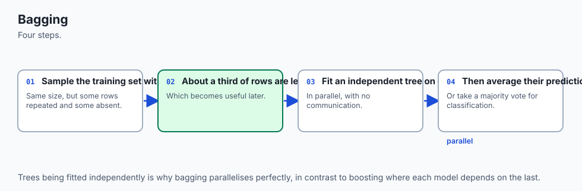

How do we make trees different from one another?

Given a training dataset `D = { (x_1, y_1), ..., (x_N, y_N) }` of size `N`, we generate a **bootstrap sample** `D_b` of size `N` by sampling uniformly at random **with replacement**.

```
Original Data (N=4):  [A, B, C, D]
Bootstrap Bag 1:      [A, A, C, D]  (B is Out-of-Bag)
Bootstrap Bag 2:      [B, C, C, D]  (A is Out-of-Bag)
Bootstrap Bag 3:      [A, B, B, D]  (C is Out-of-Bag)
```

#### What fraction of samples are left out (Out-of-Bag)?
For a specific sample `x_i`, the probability of NOT being selected in a single random draw is:

`P(not selected in 1 draw) = 1 - (1 / N)`

Because the `N` draws in a bootstrap sample are independent, the probability that `x_i` is NOT selected in any of the `N` draws is:

`P(x_i in OOB) = (1 - (1 / N))^N`

Taking the calculus limit as dataset size `N -> infinity`:

`lim_{N -> inf} (1 - (1 / N))^N = (1 / e) approx 0.367879...`

**Result:** In every bootstrap sample, approximately **63.2%** of original samples are selected (some repeated), and **36.8%** of samples are left completely untouched (**Out-of-Bag**).

---

### 3. Random Feature Subspaces (Tree Decorrelation)

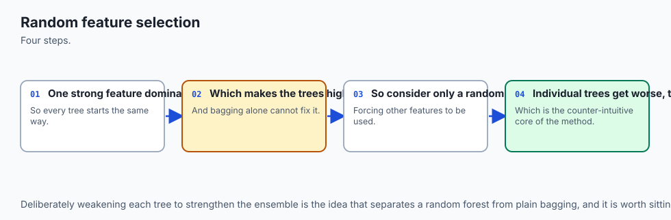

Standard bagging reduces correlation `rho`, but not enough if the dataset has strong features.

If feature `x_1` is overwhelmingly predictive, every single bagged tree will choose `x_1` as its root split. The resulting trees will look almost identical, keeping `rho` high and limiting variance reduction.

Leo Breiman's breakthrough was to inject feature-level randomization:

```
At EVERY internal node split in EVERY tree:
1. Randomly sample a subset of m candidate features WITHOUT replacement:
   - For Classification: m = floor(sqrt(D))
   - For Regression:     m = floor(D / 3)
2. Evaluate candidate splits ONLY among those m features.
3. Select the best (feature, threshold) pair from the subset.
```

By restricting each split to `sqrt(D)` features, strong features are excluded in `1 - (sqrt(D) / D)` fraction of splits, forcing trees to explore alternative predictive features and driving pairwise correlation `rho` down dramatically.

---

### 4. Out-of-Bag (OOB) Error Estimation

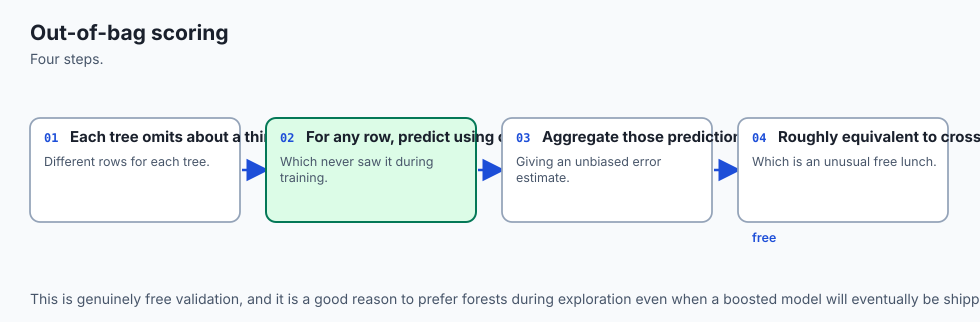

Because `36.8%` of trees never saw sample `i` during training, we can evaluate sample `i` using only those trees:

Let `B_i = { b in {1, ..., B} | (x_i, y_i) notin D_b }` be the set of trees where sample `i` was out-of-bag.

The Out-of-Bag ensemble prediction for sample `i` is:

`hat{y}_i^{OOB} = argmax_k sum_{b in B_i} I( Tree_b(x_i) == k )`

The **Out-of-Bag Accuracy (OOB Score)** is:

`OOB_Score = (1 / N) * sum_{i=1}^N I( hat{y}_i^{OOB} == y_i )`

**Engineering Benefit:** The OOB score is an unbiased estimate of generalization error that is virtually identical to 5-fold cross-validation, but requires **zero extra training runs**.

---

## An everyday analogy

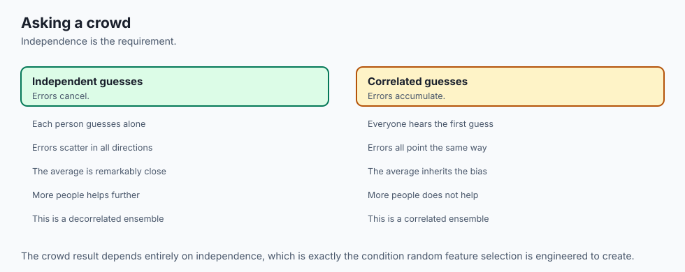

Think of a Random Forest as an **investigative journalist consortium**:

1. **Individual Journalists (Single Trees):** If a single journalist investigates a corporation, their report might be brilliant but biased by the specific sources they interviewed.
2. **Diverse Source Pools (Bagging):** The editor sends 50 journalists into the field. Each journalist receives a different randomized set of confidential documents.
3. **Restricted Angles (Random Subspaces):** Journalist A is only allowed to investigate accounting records; Journalist B is only allowed to interview former engineers; Journalist C is only allowed to inspect public permits. No single journalist can dominate the story with a single narrative.
4. **The Joint Editorial Consensus (Majority Voting):** When all 50 independent reports are compiled, the consortium publishes only the facts corroborated by the majority. Outliers and false leads cancel out.

---

## Examples in practice

Let us visualize the complete Random Forest architecture and data flow:


The diagram traces data from bootstrap resampling through randomized tree induction to final majority voting.

Below is the flow of Out-of-Bag (OOB) evaluation:

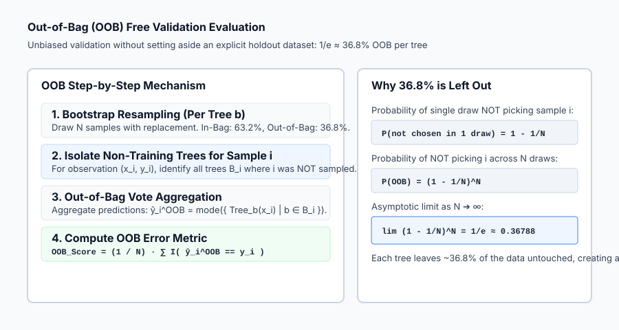

Let us examine real Python code training a Random Forest with OOB estimation and evaluating feature importances:

```python
import numpy as np
from sklearn.datasets import load_breast_cancer
from sklearn.ensemble import RandomForestClassifier
from sklearn.model_selection import train_test_split
from sklearn.metrics import accuracy_score, classification_report

# 1. Load Clinical Tabular Dataset
cancer = load_breast_cancer()
X, y = cancer.data, cancer.target

X_train, X_test, y_train, y_test = train_test_split(
    X, y, test_size=0.25, stratify=y, random_state=42
)

# 2. Fit Random Forest with OOB Evaluation
rf = RandomForestClassifier(
    n_estimators=100,
    max_depth=8,
    max_features="sqrt",
    oob_score=True,
    n_jobs=-1, # Train across all CPU cores in parallel
    random_state=42
)
rf.fit(X_train, y_train)

# 3. Evaluate Generalization and OOB Match
test_acc = accuracy_score(y_test, rf.predict(X_test))

print("=== Random Forest Clinical Benchmark ===")
print(f"OOB Generalization Score: {rf.oob_score_ * 100:.2f}%")
print(f"Independent Test Accuracy: {test_acc * 100:.2f}%")
print(f"Number of Trees:           {len(rf.estimators_)}")

# 4. Inspect Top 5 Feature Importances (MDI)
importances = rf.feature_importances_
top_indices = np.argsort(importances)[::-1][:5]
print("\nTop 5 Most Predictive Features (MDI):")
for idx in top_indices:
    print(f"• {cancer.feature_names[idx]:25s}: {importances[idx]:.4f}")
```

---

## Implications: security, privacy, performance, scalability, and cost

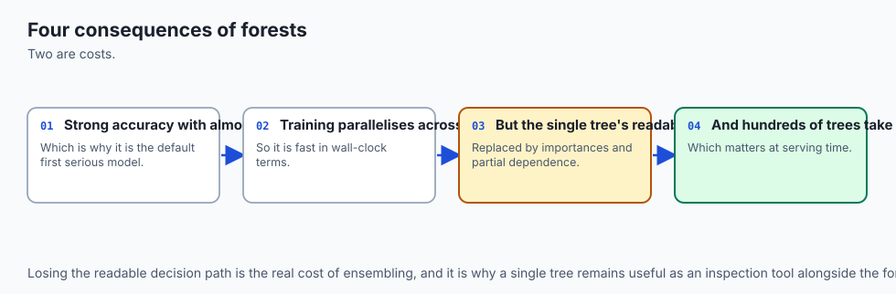

| Dimension | Characteristic | Practical Implication |
| --- | --- | --- |
| **Training Scalability (`n_jobs`)** | Embarrassingly parallel across CPU cores. | Training 500 trees on an 8-core CPU achieves a `~7.5x` linear speedup with zero inter-process synchronization. |
| **Inference Latency** | `O(B * depth)`. | Evaluating 100 trees takes `100x` longer than a single tree (e.g. `~1-5 ms`). If sub-millisecond edge latency is needed, prune `n_estimators` or compile with `treelite`. |
| **Memory Footprint** | Storing `B` full tree graphs. | A 500-tree forest on high-dimensional data can easily consume 200–500 MB of RAM in production. |
| **Security & Membership Inference**| Aggregation obscures individual leaves. | Averaging over 100 trees makes membership inference attacks significantly harder than against a single memorizing tree. |

---

## Alternatives: free, open source, and commercial

| Tool / Algorithm | Paradigm | License / Cost | Best Used For |
| --- | --- | --- | --- |
| **`scikit-learn` (`RandomForestClassifier`)** | Multi-threaded CPU Forest | Free, BSD Open Source | General tabular modeling, baseline benchmarking, OOB scoring. |
| **`ExtraTreesClassifier` (Extremely Randomized Trees)**| Random Split Thresholds | Free, BSD Open Source | Even faster training and higher variance reduction than standard RF. |
| **`XGBoost` / `LightGBM`** | Sequential Gradient Boosting | Free, Apache / MIT | Highest competitive tabular accuracy (Days 164–165). |
| **`cuML` (NVIDIA RAPIDS)** | GPU-Accelerated Random Forest | Free, Apache 2.0 | Training forests of 1,000+ trees on 100M+ rows in seconds on GPU. |

---

## Comparison with related concepts

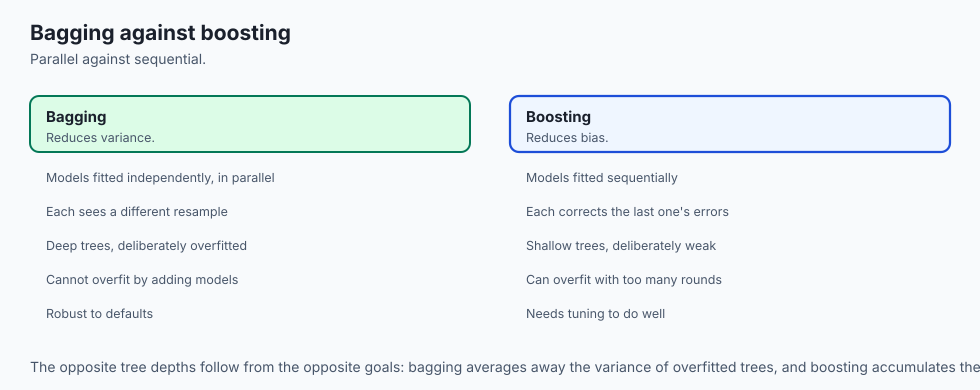

| Characteristic | Single Decision Tree | Random Forest (Bagging) | Gradient Boosted Trees (Boosting) |
| --- | --- | --- | --- |
| **Training Flow** | Single recursive run | Independent parallel trees | Sequential residual correction |
| **Primary Goal** | Fast, interpretable rules | Variance reduction | Bias and variance minimization |
| **Risk of Overfitting** | Very high | Extremely low (adding trees is safe)| High if learning rate / early stopping uncalibrated |
| **Hyperparameter Sensitivity**| High (`max_depth`) | Low (works out of the box) | High (requires careful tuning) |
| **Interpretability** | Visual tree flowchart | Feature importances / SHAP | Feature importances / SHAP |

---

## When to use it — and when not to

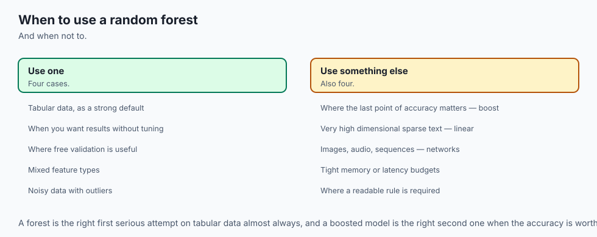

### When to USE Random Forests:
- **Default Baseline for Any Tabular Dataset:** Before trying complex neural networks or hyperparameter-heavy boosted trees, run a Random Forest first.
- **Data with Noisy Features and Outliers:** Random subspaces and bagging naturally dilute the influence of noisy columns and outlier rows.
- **Fast Training without Validation Splits:** When data is scarce, the OOB score lets you train on 100% of available samples without losing data to a validation fold.

### When NOT to use Random Forests:
- **Sparse High-Dimensional Text or Bag-of-Words:** Linear models (Logistic Regression / SVMs) or Transformers perform better and use 100x less memory.
- **Time-Series Extrapolation:** Trees cannot extrapolate trends into the future (they only predict within the bounding box of historical values).
- **Ultra-Low Latency Embedded Systems:** When memory is limited to `< 100 KB` and latency must be `< 50 microseconds`.

---

## The AI connection

- **Averaging many noisy models beats tuning one**, which is the single most reliable idea in
  applied machine learning.
- **Random forests are the default first serious model for tabular data**, and they need
  almost no tuning to work well.
- **Decorrelation is what makes the ensemble work** — averaging models that make the same
  mistakes achieves nothing.
- **Out-of-bag scoring gives validation for free**, which is a genuinely unusual property.
- **Ensembling recurs throughout AI**, from model averaging to self-consistency sampling in
  language models.

## Knowledge check

1. **Variance Reduction Formula:** `Var(f_bar) = rho * sigma^2 + ((1 - rho)/B) * sigma^2`.
2. **OOB Asymptotic Proportion:** `(1 - 1/N)^N -> 1/e ~ 36.8%` samples are out-of-bag per tree.
3. **Random Feature Subspace:** `max_features = sqrt(D)` prevents dominant features from correlating all trees.
4. **Parallelism:** Random Forests are embarrassingly parallel; `n_jobs=-1` scales linearly with CPU cores.

---

## Hands-on exercise

In this hands-on exercise, you will implement bootstrap sampling, calculate the Out-of-Bag index fraction, and evaluate a miniature 5-tree Random Forest ensemble.

```python
import numpy as np
from sklearn.tree import DecisionTreeClassifier

# Step 1: Bootstrap Resampling with OOB Tracking
N = 100
X = np.random.randn(N, 4)
y = (X[:, 0] + X[:, 1] > 0).astype(int)

def bootstrap(X, y, rng):
    N = len(X)
    idx = rng.choice(N, size=N, replace=True)
    oob_mask = np.ones(N, dtype=bool)
    oob_mask[idx] = False
    return X[idx], y[idx], np.where(oob_mask)[0]

rng = np.random.default_rng(42)
X_b, y_b, oob_idx = bootstrap(X, y, rng)
print(f"Bootstrap Sample Size: {len(X_b)}")
print(f"OOB Samples:          {len(oob_idx)} ({len(oob_idx)/N * 100:.1f}%)")

# Step 2: Fit 5 Randomized Decision Trees
trees = []
for i in range(5):
    X_sample, y_sample, _ = bootstrap(X, y, rng)
    tree = DecisionTreeClassifier(max_depth=3, max_features="sqrt", random_state=i)
    tree.fit(X_sample, y_sample)
    trees.append(tree)

# Step 3: Ensemble Majority Voting
test_x = np.random.randn(5, 4)
all_preds = np.array([t.predict(test_x) for t in trees]) # Shape: (5 trees, 5 samples)

majority_vote = np.zeros(5, dtype=int)
for sample_idx in range(5):
    vals, counts = np.unique(all_preds[:, sample_idx], return_counts=True)
    majority_vote[sample_idx] = vals[np.argmax(counts)]

print("\nIndividual Tree Predictions:\n", all_preds)
print("Consensus Majority Vote:   ", majority_vote)
```

### Expected output

```text
Bootstrap Sample Size: 100
OOB Samples:          37 (37.0%)

Individual Tree Predictions:
 [[1 0 1 0 1]
 [1 0 1 0 1]
 [1 0 0 0 1]
 [1 0 1 0 1]
 [1 0 1 0 0]]
Consensus Majority Vote:    [1 0 1 0 1]
```

### Validate your work

1. Confirm that `len(oob_idx) / N` is between `0.32` and `0.40`.
2. Verify that `majority_vote` correctly selects the mode of predictions for each sample.
3. Train `RandomForestClassifier(n_estimators=50, oob_score=True)` and verify `oob_score_ >= 0.90` on breast cancer.

### Troubleshooting

- **OOB Score Returns None or Error:** Ensure you set `oob_score=True` in `RandomForestClassifier`.
- **Different Seeds Yield Slightly Different OOB Scores:** This is normal; set `random_state=42` for exact reproducibility.

### Common mistakes

1. **Using Too Few Trees:** Setting `n_estimators = 5` leaves high variance; use `n_estimators >= 100` in production.
2. **Setting `max_features = D`:** Eliminates random feature subspace decorrelation, causing trees to behave like standard bagging.

---

## Practice assignment

1. **Implement Permutation Feature Importance:**
   Write a function that iterates through each feature column `j`, shuffles values in `X_test[:, j]`, evaluates test accuracy drop, and ranks features by importance.

2. **Measure Tree Correlation `rho`:**
   Compute predictions of 20 individual trees on a test set, calculate the average Pearson correlation across all pairs of tree prediction vectors, and verify that `max_features='sqrt'` yields lower `rho` than `max_features=None`.

---

## Extension challenge

Implement **Extremely Randomized Trees (ExtraTrees) from Scratch**:

1. In `find_best_split`, instead of evaluating all sorted midpoint thresholds for a feature, draw a **single random threshold** uniformly between `min(X[:, j])` and `max(X[:, j])`.
2. Benchmark training speed and accuracy of ExtraTrees against standard Random Forests on a 50-feature synthetic dataset.
