## Why this matters

In Day 163, we mastered Random Forests: an ensemble that trains dozens of deep, high-variance decision trees independently in parallel, using bootstrap sampling and random feature subsets to decorrelate the trees and reduce variance.

While Random Forests are robust and require minimal tuning, they treat each tree as a standalone estimator that knows nothing about the mistakes made by other trees.

What if, instead of training independent trees in parallel, we trained trees **sequentially**, with each new tree specifically designed to correct the residual errors made by the collective ensemble so far?

This is the paradigm of **Boosting**, and its mathematical pinnacle is **Gradient Boosting**, formulated by Jerome H. Friedman in 2001.

Gradient Boosting frames machine learning as **gradient descent in function space**. Rather than optimizing a fixed parameter vector `w`, gradient boosting iteratively adds shallow decision trees that point along the negative gradient of any differentiable loss function.

Today, gradient boosted trees power modern search engines, high-frequency trading systems, fraud detection engines, and tabular Kaggle championship solutions. Understanding gradient boosting from first principles is the bridge from classic machine learning to industrial state-of-the-art predictive modeling.

---

## The idea in plain language

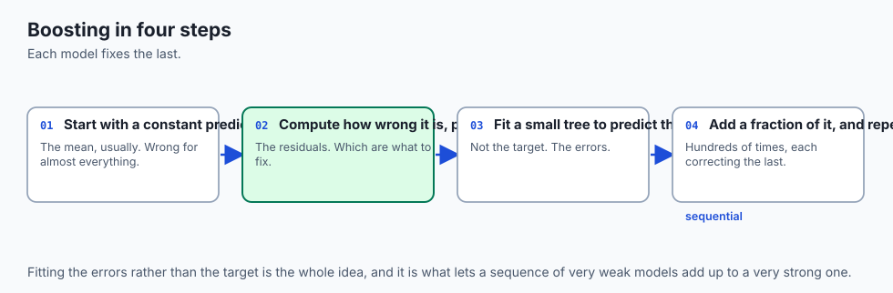

Imagine a master artist painting a hyper-realistic portrait:

1. **The Base Sketch (`F_0`):** The artist begins by painting a broad, rough outline of the face. This initial base layer captures the overall shape, but misses fine details and makes errors.
2. **The First Correction (`h_1`):** The artist examines the canvas, identifies the areas with the largest errors (the residuals), and takes a fine brush to paint a correction layer over the shadows.
3. **The Second Correction (`h_2`):** Stepping back again, the artist inspects the remaining mistakes. The next layer corrects the highlights and skin texture.
4. **Shrinkage (Learning Rate `eta`):** Crucially, the artist does not apply thick, heavy brushstrokes all at once. Instead, they apply delicate, translucent glazes (scaling each correction by `eta = 0.1`). This prevents a single over-correction from ruining the painting.

After 100 sequential correction layers, the final portrait `F_M(x) = F_0(x) + sum eta * h_m(x)` achieves breathtaking accuracy that no single rough sketch could ever match.

---

## Historical background

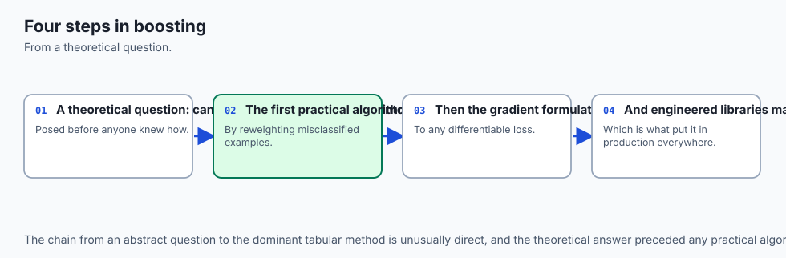

The theoretical foundation of boosting originated in computational learning theory with Michael Kearns and Leslie Valiant (1988), who posed a fundamental question: *"Can a set of weak learners (models that perform slightly better than random guessing) be combined into a single strong learner?"*

In 1990, Robert Schapire proved mathematically that this is always possible.

In 1996, Yoav Freund and Robert Schapire introduced **AdaBoost** (Adaptive Boosting), which reweighted misclassified training samples after each iteration. AdaBoost won the prestigious Gödel Prize for its mathematical elegance.

However, AdaBoost was strictly tied to exponential loss and classification.

In 2001, Jerome H. Friedman published *Greedy Function Approximation: A Gradient Boosting Machine*. Friedman realized that boosting is actually **gradient descent in function space**, where the pseudo-residuals are negative gradients of arbitrary loss functions (Squared Error, Log-Loss, Huber Loss, Poisson Deviance). Friedman's generalization unlocked gradient boosting for all machine learning tasks.

---

## What it is — and what it is not

To reason about Gradient Boosting with mathematical precision, let us establish what it is and is not:

### What it IS:
- **A Sequential Additive Model:** `F_M(x) = F_0(x) + sum_{m=1}^M eta * h_m(x)`, where each base learner `h_m` is trained sequentially.
- **Functional Gradient Descent:** It minimizes empirical loss `sum L(y_i, F(x_i))` by fitting base trees to the negative gradient of the loss.
- **A Bias and Variance Reducer:** Unlike Random Forests (which primarily reduce variance), boosting drives down both bias and variance simultaneously.
- **A General Framework for Any Loss:** It can optimize any differentiable loss function (classification, regression, ranking, survival analysis).

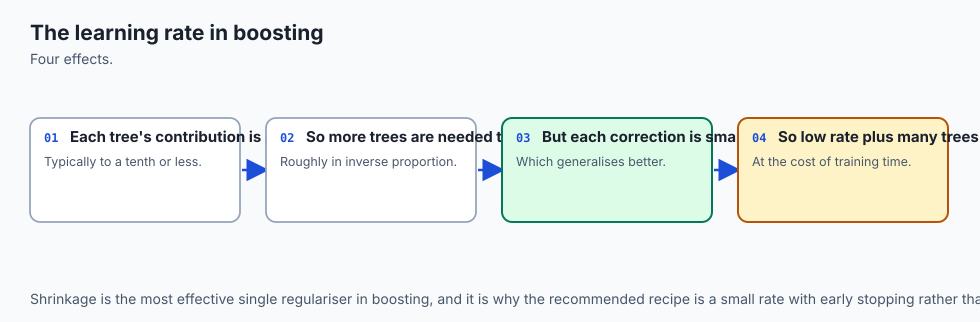

### What it is NOT:
- **Not Parallel Across Trees:** Because tree `m` requires the residuals from tree `m-1`, trees cannot be trained simultaneously in parallel (though individual split searches within a tree can be parallelized).
- **Not Immune to Overfitting:** Unlike Random Forests (where adding trees is always safe), adding too many boosted trees or using an excessive learning rate WILL overfit the training set.
- **Not Scale-Dependent:** Like all tree models, boosted trees are scale-invariant and require no numerical feature normalization.

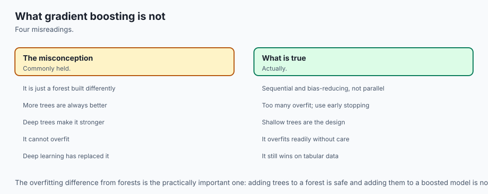

---

## Why it was created and what problems it solves

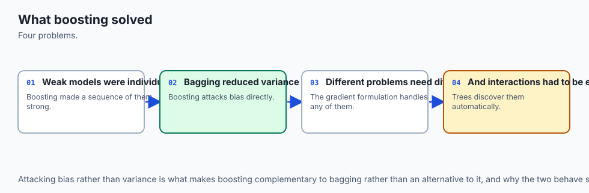

Gradient Boosting solves four fundamental challenges in competitive machine learning:

1. **Reaches the Theoretical Limit of Tabular Accuracy:** Consistently outperforms linear models, k-NN, SVMs, and standard Random Forests on structured tabular data.
2. **Optimizes Custom Business Loss Functions:** Allows data scientists to plug in specialized losses (e.g. asymmetric quantile loss for supply chain inventory, Huber loss for outlier-heavy finance).
3. **Efficient Model Capacity Control:** Shallow base learners (depth 3 to 6) keep individual tree complexity low, preventing local memorization.
4. **Adaptive Error Correction:** Automatically concentrates learning capacity on hard-to-classify samples and subtle edge cases.

---

## How it works

Let us formulate the complete mathematics of functional gradient descent, loss functions, pseudo-residuals, Newton-Raphson leaf updates, and shrinkage.

### 1. Functional Gradient Descent Formulation

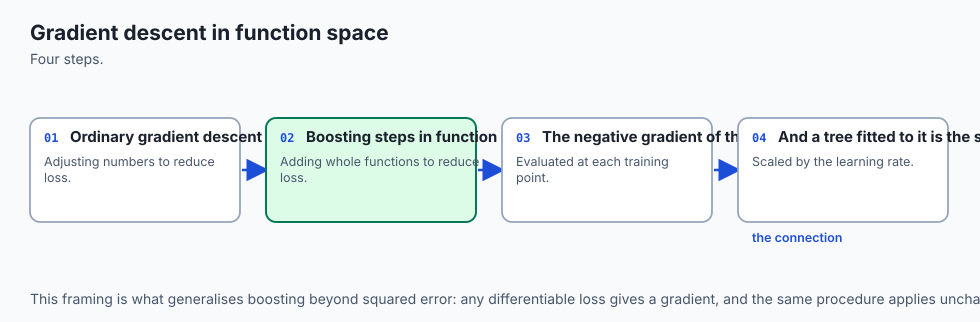

Given a training dataset `D = { (x_1, y_1), ..., (x_N, y_N) }` and a differentiable loss function `L(y, F(x))`, our objective is to find a function `F^*(x)` minimizing the empirical risk:

`J(F) = sum_{i=1}^N L(y_i, F(x_i))`

In standard gradient descent over model parameters `w in R^D`, we update parameters along the negative gradient:

`w_{m} = w_{m-1} - eta * nabla_w J(w_{m-1})`

In **Functional Gradient Descent**, we view the model's predictions `F = (F(x_1), ..., F(x_N))^T in R^N` as a vector in `N`-dimensional function space.

The negative gradient of the loss with respect to the prediction at sample `i` is the **pseudo-residual**:

`r_{im} = - [ (partial L(y_i, F(x_i))) / (partial F(x_i)) ]_{F(x) = F_{m-1}(x)}`

Because we want our model to generalize to unseen points `x`, we cannot simply adjust the vector `F` directly. Instead, we train a base regression tree `h_m(x)` to predict the pseudo-residuals `r_{im}` for all `i in {1, ..., N}`.

The model is updated additively:

`F_m(x) = F_{m-1}(x) + eta * h_m(x)`

Where `eta in (0, 1]` is the **shrinkage parameter (learning rate)**.

---

### 2. Common Loss Functions and Their Pseudo-Residuals

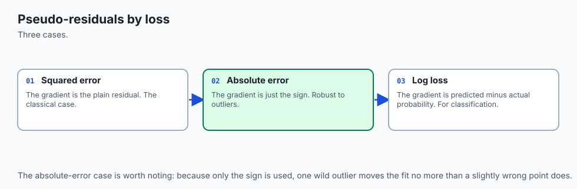

#### A. Squared Error Loss (Regression)
`L(y, F) = (1/2) * (y - F)^2`

`r_i = - (partial L / partial F) = - [ -(y_i - F(x_i)) ] = y_i - F(x_i)`

**Result:** For squared error, the pseudo-residual is simply the standard arithmetic residual `y_i - F_{m-1}(x_i)`.

---

#### B. Log-Loss / Binary Cross-Entropy (Classification)
Let `y in {0, 1}` and let `F(x)` be the raw log-odds prediction:

`p(x) = sigmoid(F(x)) = 1 / (1 + exp(-F(x)))`

The binary cross-entropy loss is:

`L(y, F) = - [ y * log(p) + (1 - y) * log(1 - p) ]`
`= - y * F + log(1 + exp(F))`

Taking the derivative with respect to raw score `F`:

`(partial L / partial F) = - y + (exp(F) / (1 + exp(F))) = - y + p`

Therefore, the negative gradient (pseudo-residual) is:

`r_{im} = - (partial L / partial F) = y_i - p_{m-1}(x_i)`

- If `y_i = 1` and `p_i = 0.8`: `r_i = 1.0 - 0.8 = +0.2` (Small positive push).
- If `y_i = 1` and `p_i = 0.1`: `r_i = 1.0 - 0.1 = +0.9` (Huge positive push).
- If `y_i = 0` and `p_i = 0.9`: `r_i = 0.0 - 0.9 = -0.9` (Huge negative push).

---

### 3. Newton-Raphson Leaf Value Adjustment

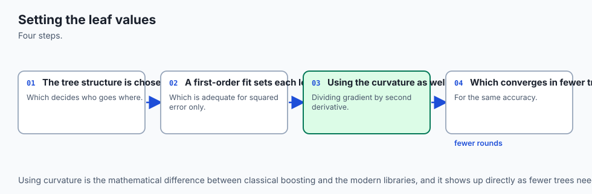

When we fit a regression tree `h_m` to the pseudo-residuals `r_{im}`, the tree partitions feature space into `J` disjoint regions (leaf nodes) `R_{1m}, ..., R_{Jm}`.

In a standard regression tree, the leaf value is the simple average of the targets in that leaf. However, for non-linear losses like Log-Loss, a simple average of gradients does not minimize the loss.

We solve for the optimal leaf step `gamma_{jm}` that minimizes loss in region `R_{jm}`:

`gamma_{jm} = argmin_gamma sum_{x_i in R_{jm}} L(y_i, F_{m-1}(x_i) + gamma)`

Taking a second-order Taylor expansion (Newton-Raphson step):

`gamma_{jm} approx - ( g_j / H_j ) = ( sum_{x_i in R_{jm}} r_{im} ) / ( sum_{x_i in R_{jm}} p_{im} * (1 - p_{im}) + eps )`

Where:

- **Numerator:** Sum of first derivatives (pseudo-residuals).
- **Denominator:** Sum of second derivatives (Hessian / curvature: `p * (1 - p)`).

This Newton-Raphson leaf adjustment gives Gradient Boosting its astonishing convergence speed and mathematical rigor.

---

### 4. Step-by-Step Gradient Boosting Algorithm

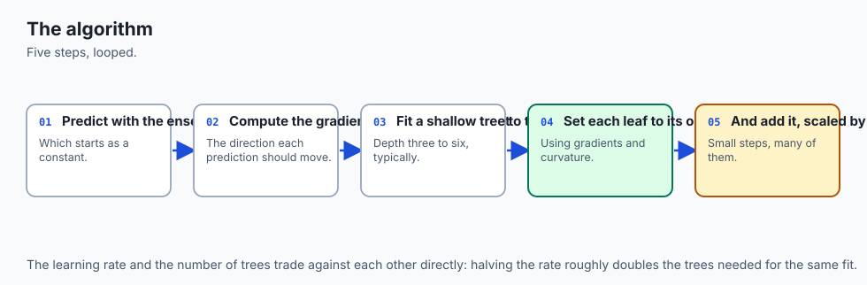

```
Algorithm: Gradient Boosting Classifier
1. Initialize F_0(x) with optimal constant log-odds:
   F_0(x) = log(p_bar / (1 - p_bar))  where p_bar = (1/N) * sum y_i

2. For m = 1 to M:
   a. Compute probabilities: p_i = sigmoid(F_{m-1}(x_i)) for all i
   b. Compute pseudo-residuals: r_i = y_i - p_i for all i
   c. Fit a shallow regression tree h_m(x) of depth 3 to targets r_i
   d. For each leaf j in tree h_m:
         Compute optimal leaf value:
         gamma_j = sum_{i in Leaf_j} r_i / ( sum_{i in Leaf_j} p_i * (1 - p_i) + 1e-15 )
   e. Update model:
         F_m(x) = F_{m-1}(x) + eta * sum_j gamma_j * I(x in Leaf_j)

3. Final Probability Output:
   p(x) = sigmoid(F_M(x)) = 1 / (1 + exp(-F_M(x)))
```

---

## An everyday analogy

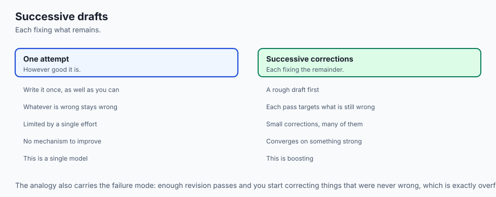

Think of Gradient Boosting as an **Olympic archery coach**:

1. **Round 0 (`F_0`):** The archer aims directly at the center of the target. The arrow lands 4 inches high and 2 inches to the right (Residual = `[-4, -2]`).
2. **Round 1 (`h_1`):** The coach instructs: *"Compensate by aiming 0.4 inches lower and 0.2 inches left"* (Shrinkage `eta = 0.1`). The archer shoots again. Now the arrow is only 1 inch high.
3. **Round 2 (`h_2`):** The coach calculates the new residual and advises a micro-adjustment of 0.1 inches lower.
4. **The Over-Coaching Danger (Overfitting):** If the coach provides 5,000 micro-adjustments, the archer will begin compensating for a momentary gust of wind that happened 20 minutes ago. The archer memorizes random gusts rather than learning true shooting technique.

---

## Examples in practice

Let us visualize the complete Gradient Boosting additive pipeline and pseudo-residual flow:


The diagram illustrates how each sequential tree fits the negative gradient before applying shrinkage `eta`.

Below is the functional gradient descent optimization trajectory:

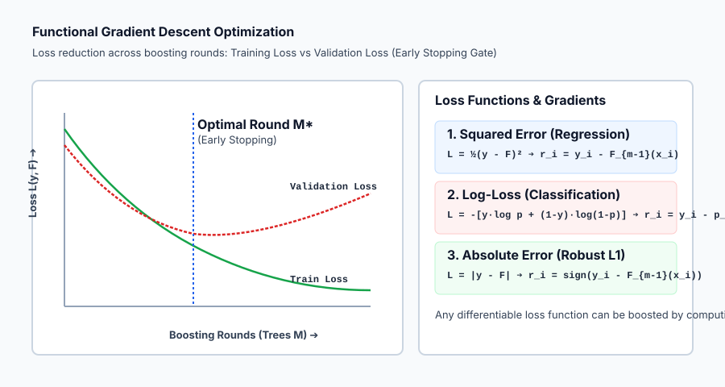

Let us examine real Python code training a Gradient Boosting Classifier and evaluating early stopping:

```python
import numpy as np
from sklearn.datasets import load_breast_cancer
from sklearn.ensemble import GradientBoostingClassifier
from sklearn.model_selection import train_test_split
from sklearn.metrics import accuracy_score, log_loss

# 1. Load Data
cancer = load_breast_cancer()
X, y = cancer.data, cancer.target

X_train, X_test, y_train, y_test = train_test_split(
    X, y, test_size=0.25, stratify=y, random_state=42
)

# 2. Fit Gradient Boosting with Validation Monitoring
gb = GradientBoostingClassifier(
    n_estimators=100,
    learning_rate=0.08,
    max_depth=3,
    subsample=0.85, # Stochastic Gradient Boosting (85% rows)
    validation_fraction=0.20,
    n_iter_no_change=10, # Early stopping patience: 10 rounds
    random_state=42
)
gb.fit(X_train, y_train)

# 3. Evaluate Predictions
test_preds = gb.predict(X_test)
test_probs = gb.predict_proba(X_test)[:, 1]

print("=== Gradient Boosting Clinical Benchmark ===")
print(f"Optimal Trees Trained:    {gb.n_estimators_} (Stopped early from 100)")
print(f"Independent Test Accuracy: {accuracy_score(y_test, test_preds) * 100:.2f}%")
print(f"Test Log-Loss (Deviance): {log_loss(y_test, test_probs):.4f}")

# 4. Inspect Feature Importances
importances = gb.feature_importances_
top_idx = np.argsort(importances)[::-1][:5]
print("\nTop 5 Most Influential Features:")
for idx in top_idx:
    print(f"• {cancer.feature_names[idx]:25s}: {importances[idx]:.4f}")
```

---

## Implications: security, privacy, performance, scalability, and cost

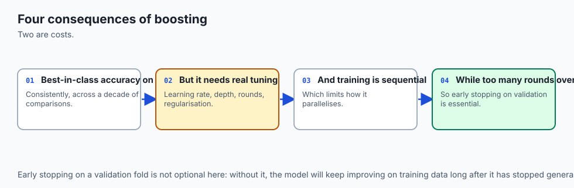

| Dimension | Characteristic | Practical Implication |
| --- | --- | --- |
| **Sequential Compute Bottleneck** | Cannot parallelize outer loop across trees. | Training 1,000 trees requires 1,000 sequential passes. Highly optimized histogram algorithms (XGBoost/LightGBM) parallelize the inner split evaluation instead. |
| **Inference Latency** | `O(M * depth)`. | Evaluating 100 shallow trees takes `< 1 ms`, making Gradient Boosting suitable for real-time production inference. |
| **Differential Privacy Risks** | Residuals expose ground truth labels. | In distributed or federated learning, sharing raw gradient residuals `r_i = y_i - p_i` allows attackers to reconstruct training labels. Gradient clipping and DP noise are required. |
| **Hyperparameter Sensitivity** | High interaction between `eta`, `M`, and `max_depth`. | Requires systematic tuning (Grid/Random Search or Optuna) compared to Random Forests. |

---

## Alternatives: free, open source, and commercial

| Tool / Framework | Innovation | License / Cost | Best Used For |
| --- | --- | --- | --- |
| **`scikit-learn` (`GradientBoostingClassifier`)** | Reference Python/C implementation | Free, BSD Open Source | Baseline education, prototyping, small-to-medium tabular datasets. |
| **`HistGradientBoostingClassifier`** | Histogram binning (inspired by LightGBM) | Free, BSD Open Source | 10x faster training on large datasets directly within scikit-learn. |
| **`XGBoost`** | Exact second-order Taylor approximation + sparsity | Free, Apache 2.0 | High-performance competitive tabular modeling (Day 165). |
| **`LightGBM`** | GOSS + Exclusive Feature Bundling | Free, MIT | Ultra-fast training on million-row tabular datasets (Day 165). |
| **`CatBoost`** | Symmetric oblivious trees + categorical handling | Free, Apache 2.0 | State-of-the-art accuracy on heavy categorical datasets (Day 165). |

---

## Comparison with related concepts

| Characteristic | Random Forests | Gradient Boosting | Deep Neural Networks |
| --- | --- | --- | --- |
| **Ensemble Logic** | Independent parallel trees | Sequential residual correction | Layered differentiable tensor operations |
| **Base Learner** | Deep, unpruned trees | Shallow, weak trees (depth 3–6) | Neurons with activation functions |
| **Overfitting Behavior**| Safe: adding trees lowers variance | Vulnerable: adding too many trees overfits | Vulnerable: requires dropout / weight decay |
| **Tabular Data Performance** | High | State-of-the-Art | Often requires extensive tuning on tabular data |
| **Feature Scaling** | Not required | Not required | Strictly required |

---

## When to use it — and when not to

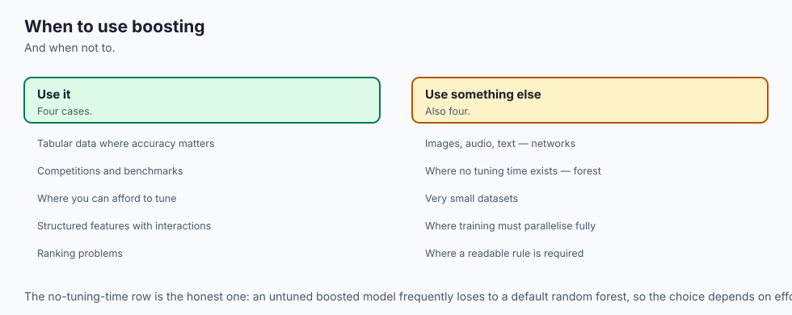

### When to USE Gradient Boosting:
- **When Maximum Predictive Accuracy on Tabular Data is Required:** The unmatched champion on structured business datasets.
- **Custom Loss Functions and Objectives:** When your business problem penalizes false positives 10x more than false negatives.
- **Non-Linear Data with Complex Interactions:** Easily captures multi-feature conditionals without manual feature crosses.

### When NOT to use Gradient Boosting:
- **Unstructured Data (Images, Audio, Natural Language):** Convolutional Networks and Transformers vastly outperform trees on spatial and sequential data.
- **Need for Embarrassingly Parallel Fast Training:** When you have a 128-core server and want to train 1,000 independent trees in 2 seconds (use Random Forest).
- **Zero Hyperparameter Tuning Budget:** If you cannot tune `learning_rate` or set up early stopping, a Random Forest is safer out of the box.

---

## The AI connection

- **Boosting is gradient descent in function space**, which is the idea that connects it to
  everything else that is trained by gradients.
- **Each model corrects its predecessors' errors**, so the ensemble is built sequentially
  rather than in parallel.
- **Gradient boosting still wins on tabular data**, which is the clearest counterexample to
  the assumption that deep learning wins everywhere.
- **The learning rate trades accuracy against training time**, exactly as it does in neural
  networks.
- **Boosting can overfit where bagging cannot**, which is the price of fitting the residuals.

## Knowledge check

1. **Additive Model Form:** `F_M(x) = F_0(x) + sum eta * h_m(x)`.
2. **Pseudo-Residual:** Negative loss gradient `r_im = - [ dL / dF ]`.
3. **Log-Loss Negative Gradient:** `r_i = y_i - sigmoid(F(x_i))`.
4. **Newton-Raphson Leaf Update:** `gamma_j = sum(r) / sum(p * (1 - p))`.

---

## Hands-on exercise

In this hands-on exercise, you will implement pseudo-residual calculation for classification, fit a 3-iteration boosting loop on a 1D dataset, and observe residual convergence.

```python
import numpy as np
from sklearn.tree import DecisionTreeRegressor

# Step 1: Binary Classification Dataset
X = np.array([[1.0], [2.0], [3.0], [4.0], [5.0], [6.0]])
y = np.array([0, 0, 0, 1, 1, 1])

def sigmoid(z):
    return 1.0 / (1.0 + np.exp(-np.clip(z, -30.0, 30.0)))

# Step 2: Initialize F0 (Log-Odds)
p_mean = np.mean(y) # 0.50
F0 = np.log(p_mean / (1.0 - p_mean)) # 0.0
F = np.full(len(y), F0)

print(f"Step 0: Initial F0 = {F0:.2f}, Initial Probabilities = {sigmoid(F)}")

# Step 3: Run 3 Boosting Iterations
learning_rate = 0.5
trees = []

for m in range(1, 4):
    p = sigmoid(F)
    residuals = y - p
    
    # Fit shallow regression stump to residuals
    stump = DecisionTreeRegressor(max_depth=1, random_state=42)
    stump.fit(X, residuals)
    
    # Update additive model
    update = stump.predict(X)
    F += learning_rate * update
    trees.append(stump)
    
    print(f"\nIteration {m}:")
    print(f"  Pseudo-Residuals: {np.round(residuals, 3)}")
    print(f"  Updated Probabilities: {np.round(sigmoid(F), 3)}")

print("\nFinal Predicted Classes:", (sigmoid(F) >= 0.5).astype(int))
```

### Expected output

```text
Step 0: Initial F0 = 0.00, Initial Probabilities = [0.5 0.5 0.5 0.5 0.5 0.5]

Iteration 1:
  Pseudo-Residuals: [-0.5 -0.5 -0.5  0.5  0.5  0.5]
  Updated Probabilities: [0.378 0.378 0.378 0.622 0.622 0.622]

Iteration 2:
  Pseudo-Residuals: [-0.378 -0.378 -0.378  0.378  0.378  0.378]
  Updated Probabilities: [0.291 0.291 0.291 0.709 0.709 0.709]

Iteration 3:
  Pseudo-Residuals: [-0.291 -0.291 -0.291  0.291  0.291  0.291]
  Updated Probabilities: [0.231 0.231 0.231 0.769 0.769 0.769]

Final Predicted Classes: [0 0 0 1 1 1]
```

### Validate your work

1. Verify that `residuals` decrease in absolute magnitude with each iteration.
2. Confirm that predicted probabilities move towards `0.0` for class 0 and `1.0` for class 1.
3. Train `GradientBoostingClassifier(n_estimators=30, learning_rate=0.1)` on breast cancer and verify accuracy `>= 95%`.

### Troubleshooting

- **Predictions Exploding to Inf:** Clip the raw score `F` to `[-30, 30]` before computing `sigmoid(F)`.
- **Zero Loss Reduction:** Ensure `learning_rate > 0.0` and that base trees have `max_depth >= 1`.

### Common mistakes

1. **Using Deep Trees (`max_depth > 8`):** In boosting, deep trees overfit the residuals immediately; stick to `max_depth = 3` to `6`.
2. **Forgetting Early Stopping:** Always monitor a validation set and stop adding trees when validation loss stalls.

---

## Practice assignment

1. **Implement Huber Loss for Robust Regression:**
   Derive the pseudo-residual for Huber loss with threshold delta:
   `r_i = y_i - F(x_i)` if `|y_i - F| <= delta`, else `delta * sign(y_i - F(x_i))`.
   Build a custom Gradient Boosting Regressor using Huber loss and test on a dataset with synthetic outliers.

2. **Implement Subsample (Stochastic Gradient Boosting):**
   Add a `subsample = 0.8` parameter to `GradientBoostingClassifierScratch` that randomly samples 80% of rows at each iteration before computing residuals.

---

## Extension challenge

Implement **Exact Second-Order (Newton) Tree Boosting (XGBoost Engine from Scratch)**:

1. Instead of fitting a standard CART tree to first derivatives, implement a split criterion that directly uses both first derivatives `g_i` and second derivatives `h_i`:
   `Gain = 0.5 * [ (G_L^2 / (H_L + lambda)) + (G_R^2 / (H_R + lambda)) - (G^2 / (H + lambda)) ] - gamma`

2. Benchmark your custom second-order boosting engine against scikit-learn's `GradientBoostingClassifier`.
