## Why this matters

In Day 164, we built Gradient Boosting from scratch, deriving functional gradient descent, pseudo-residuals, and Newton-Raphson leaf updates.

While classic gradient boosting is mathematically beautiful, training traditional decision trees on continuous features requires sorting every column at every node: `O(D * N * log N)`. On datasets with 500,000 rows and 100 features, training 500 trees in scikit-learn's standard `GradientBoostingClassifier` can take 45 minutes and consume gigabytes of RAM.

In the mid-2010s, a revolution occurred in competitive tabular machine learning with the release of three hyper-optimized libraries:

1. **XGBoost** (Tianqi Chen & Carlos Guestrin, 2016)
2. **LightGBM** (Guolin Ke et al., Microsoft Research, 2017)
3. **CatBoost** (Yandex, 2017)

These libraries did not merely optimize C++ code; they introduced foundational algorithmic breakthroughs: **exact second-order Taylor objective expansion**, **uint8 histogram-based feature binning**, **leaf-wise (best-first) tree growth**, **Gradient-based One-Side Sampling (GOSS)**, **Exclusive Feature Bundling (EFB)**, and **native missing value and categorical support**.

Today, over 80% of winning tabular Kaggle solutions and mission-critical production pipelines at Uber, Airbnb, Meta, and financial institutions rely on these gradient boosting engines.

---

## The idea in plain language

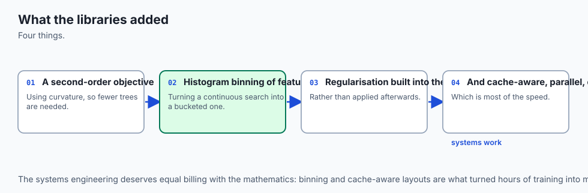

Imagine you are sorting 10,000 physical packages by their exact weight measured to 6 decimal places (e.g. `12.483921 kg`):

- **The Traditional Approach (Classic CART):** You sort all 10,000 packages in exact numerical order every time you want to find a split threshold. This sorting is agonizingly slow.
- **The Histogram Binning Approach (LightGBM / XGBoost Hist):** Instead of exact 6-decimal weights, you place 256 pre-labeled buckets on the warehouse floor (Bucket 0 = `0-1 kg`, Bucket 1 = `1-2 kg`, ..., Bucket 255 = `254+ kg`). You toss each package into one of the 256 buckets once. From that moment on, evaluating any split requires checking only **256 bucket boundaries** instead of 10,000 individual packages.

By compressing continuous data into 256 discrete bins, feature values fit into a single byte (`uint8`), memory consumption drops by 8x, and split evaluations execute at hardware-accelerated speeds.

---

## Historical background

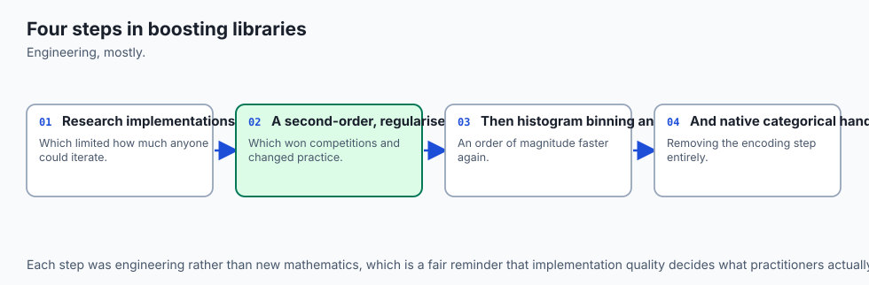

In 2014, Tianqi Chen developed **XGBoost** (Extreme Gradient Boosting) as a research project at the University of Washington. Chen integrated exact second-order Taylor approximations, cache-aware out-of-core block data structures, and sparsity-aware split routing. XGBoost quickly went viral in competitive data science, sweeping the 2015 Kaggle Higgs Boson and KDDCup challenges.

In 2017, Microsoft Research published **LightGBM**. Microsoft identified the primary computational bottlenecks of XGBoost and introduced histogram-based binning, leaf-wise tree growth, GOSS, and EFB. LightGBM trained 10 to 15 times faster than early XGBoost while using a fraction of the RAM.

In response, XGBoost added its own ultra-fast `tree_method='hist'`, and scikit-learn developed `HistGradientBoostingClassifier`.

Concurrently in 2017, Yandex introduced **CatBoost**, revolutionizing categorical feature processing with Ordered Target Statistics and Oblivious (symmetric) decision trees.

---

## What it is — and what it is not

To architect production ML pipelines with these libraries, let us contrast their core properties:

### What it IS:
- **Second-Order Taylor Boosting:** Optimizes objectives using both analytical gradients `g_i` (first derivative) and Hessians `h_i` (second derivative).
- **Histogram-Accelerated Tree Induction:** Compresses continuous features into 256 integer bins (`uint8`), evaluating splits in `O(n_bins)` time.
- **Natively Sparsity-Aware:** Automatically routes missing values (`NaN`) to the optimal branch without imputation.
- **Native Categorical Support:** Partitions categorical integer IDs directly without one-hot encoding dimensional inflation.

### What it is NOT:
- **Not a Black-Box Neural Network:** Boosted trees remain interpretable through SHAP values, feature importances, and decision paths.
- **Not Invariant to Categorical Leakage:** Poorly encoded high-cardinality categoricals can cause target leakage if out-of-fold statistics are not used.
- **Not Completely Immune to Overfitting:** Leaf-wise growth can create deep, asymmetric branches; setting `max_depth` and `min_child_samples` is mandatory.

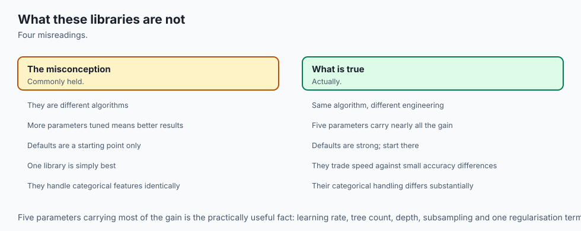

---

## Why it was created and what problems it solves

Modern gradient boosting engines solve five massive engineering bottlenecks:

1. **Computational Speed on Million-Row Datasets:** Histogram binning reduces training time from hours to seconds.
2. **Eliminates Manual Missing Value Imputation:** Learns default split directions for `NaN` values directly during training.
3. **Eliminates One-Hot Dimensionality Blowup:** Natively evaluates categorical splits without expanding columns.
4. **Hardware-Optimized Parallelism:** Uses SIMD/AVX2 vector instructions and multi-threaded CPU/GPU acceleration.
5. **Exact Loss Regularization:** Penalizes leaf weights (`lambda`) and leaf count (`gamma`), smoothing out noisy predictions.

---

## How it works

Let us formulate the mathematical innovations that distinguish XGBoost and LightGBM.

### 1. XGBoost Second-Order Taylor Objective

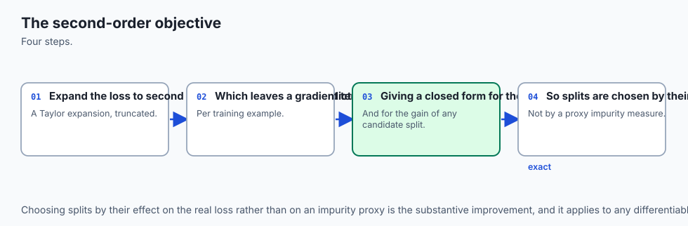

Given dataset `D = { (x_i, y_i) }` and loss `l(y_i, hat{y}_i)`, at step `t`, the objective function with explicit regularization is:

`L^{(t)} = sum_{i=1}^N l(y_i, hat{y}_i^{(t-1)} + f_t(x_i)) + Omega(f_t)`

Where tree regularization `Omega(f_t)` is:

`Omega(f_t) = gamma * T + (1/2) * lambda * sum_{j=1}^T w_j^2 + alpha * sum_{j=1}^T |w_j|`

Where `T` is the number of terminal leaf nodes, `w_j` is the weight of leaf `j`, `lambda` is L2 ridge penalty, `alpha` is L1 lasso penalty, and `gamma` is the complexity penalty for creating a new leaf.

Taking a second-order Taylor expansion around `hat{y}^{(t-1)}`:

`l(y_i, hat{y}_i^{(t-1)} + f_t(x_i)) approx l(y_i, hat{y}_i^{(t-1)}) + g_i * f_t(x_i) + (1/2) * h_i * f_t^2(x_i)`

Where:

- First derivative (Gradient): `g_i = partial_{hat{y}^{(t-1)}} l(y_i, hat{y}_i^{(t-1)})`
- Second derivative (Hessian): `h_i = partial^2_{hat{y}^{(t-1)}} l(y_i, hat{y}_i^{(t-1)})`

Removing constant terms, the simplified objective at step `t` is:

`tilde{L}^{(t)} = sum_{j=1}^T [ ( sum_{i in I_j} g_i ) * w_j + (1/2) * ( sum_{i in I_j} h_i + lambda ) * w_j^2 ] + gamma * T`

Let `G_j = sum_{i in I_j} g_i` and `H_j = sum_{i in I_j} h_i`.

Setting the derivative with respect to `w_j` to zero yields the **optimal leaf weight**:

`w_j^* = - ( G_j / (H_j + lambda) )`

Substituting `w_j^*` back gives the **optimal objective value (structure score)**:

`tilde{L}^*(q) = - (1/2) * sum_{j=1}^T ( G_j^2 / (H_j + lambda) ) + gamma * T`

---

### 2. The XGBoost Split Gain Formula

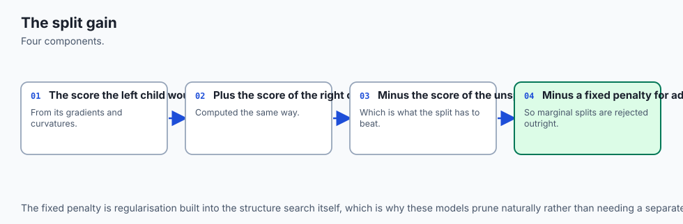

When deciding whether to split leaf node `I` into left child `I_L` and right child `I_R`, XGBoost calculates the exact reduction in loss:

`Gain = (1/2) * [ ( G_L^2 / (H_L + lambda) ) + ( G_R^2 / (H_R + lambda) ) - ( (G_L + G_R)^2 / (H_L + H_R + lambda) ) ] - gamma`

- **If `Gain > 0`:** The split reduces loss by more than the leaf penalty `gamma`; the tree makes the split.
- **If `Gain <= 0`:** The split is pruned immediately.

---

### 3. LightGBM Histogram Binning and Leaf-Wise Growth

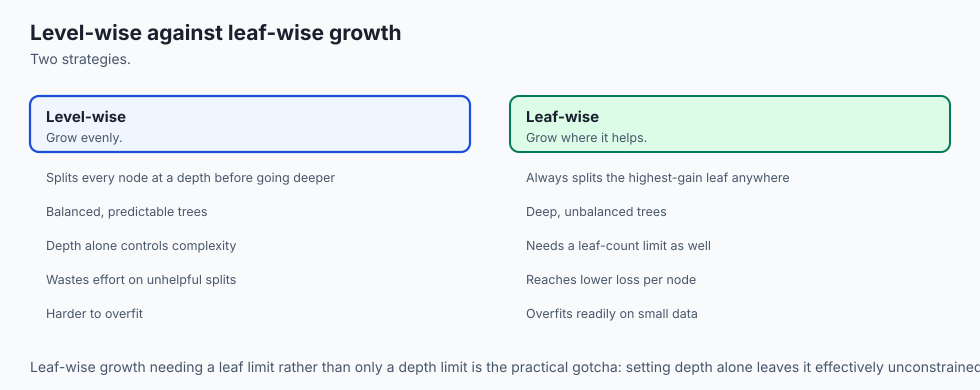

#### A. Histogram Binning
Continuous `float64` values (8 bytes) are binned into 256 discrete bins (`uint8`, 1 byte):

`bin_i = digitize(x_i, quantiles)`

Building a histogram of gradients `G` and Hessians `H` across 256 bins requires a single linear scan `O(N)`. Finding the best split threshold then takes `O(256)` constant operations.

#### B. Leaf-Wise (Best-First) vs Level-Wise (Depth-First) Growth
- **Level-Wise (XGBoost Traditional):** Splits all leaves at depth `d` simultaneously to maintain a balanced tree.
- **Leaf-Wise (LightGBM):** Evaluates all available leaf candidates and splits the **single leaf with the highest gain**, regardless of depth. This achieves significantly lower loss for the same total number of leaves.

---

### 4. LightGBM GOSS and EFB

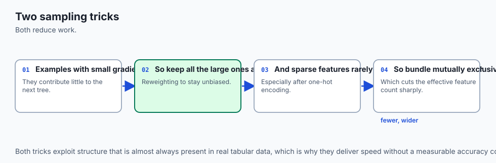

1. **GOSS (Gradient-based One-Side Sampling):**
   - Keeps all top `a * 100%` instances with large gradients (under-fitted data).
   - Randomly samples `b * 100%` instances from the remaining small-gradient data.
   - Multiplies small-gradient instances by `(1 - a) / b` to preserve the true gradient expectation.
2. **EFB (Exclusive Feature Bundling):**
   - Groups mutually exclusive sparse features (e.g. one-hot encoded columns that are rarely non-zero at the same time) into a single dense feature bundle.

---

## An everyday analogy

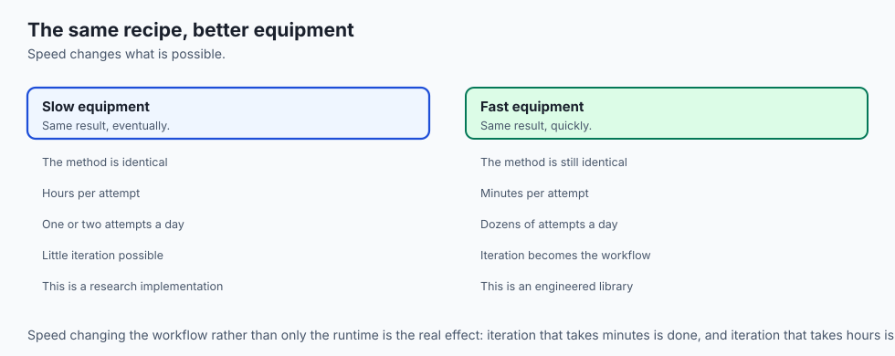

Think of the evolution of gradient boosting as **mail sorting at a postal hub**:

1. **Classic Gradient Boosting (Hand Sorting):** The postal worker reads the exact 9-digit ZIP code on every envelope, constantly re-sorting all 1,000,000 envelopes alphabetically and numerically. It works, but takes 12 hours.
2. **XGBoost (2nd-Order Taylor + Smart Routing):** The postal worker uses a laser scanner that calculates both the destination distance and package weight simultaneously, automatically routing damaged/missing labels to a default conveyor belt.
3. **LightGBM (Histogram Bins + GOSS):** The hub installs 256 color-coded collection bins. Envelopes are tossed into bins once upon arrival (`uint8`). Furthermore, routine junk mail (small gradients) is sampled at a 10% rate, while express certified mail (large gradients) is 100% inspected. Sorting finishes in 10 minutes.

---

## Examples in practice

Let us visualize the architectural comparison between XGBoost and LightGBM:

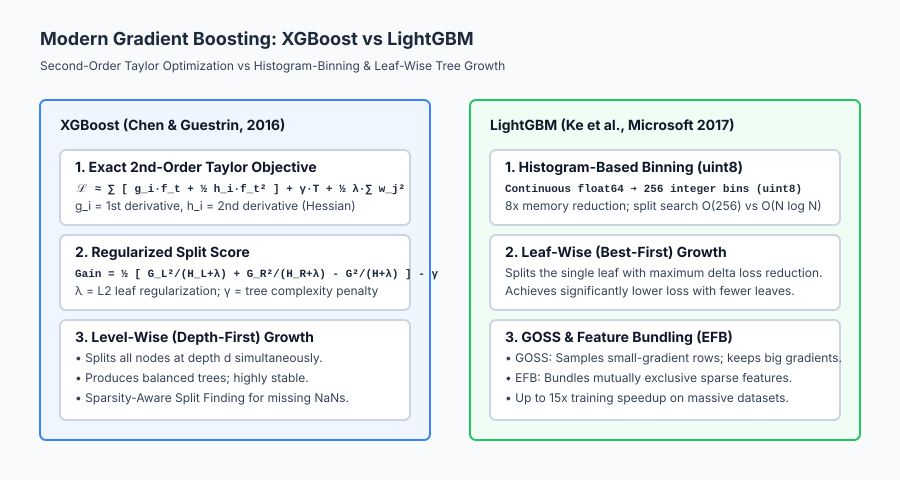

The diagram illustrates how second-order optimization and histogram binning revolutionize tree construction.

Below is the flow of LightGBM's GOSS and EFB acceleration mechanisms:

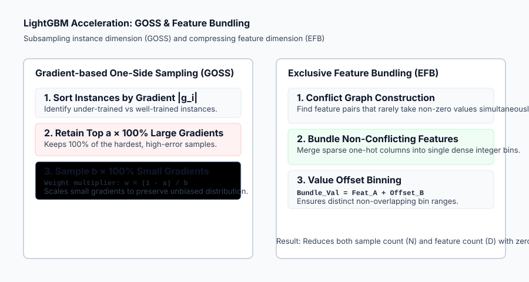

Let us examine real Python code using `HistGradientBoostingClassifier` with missing values and early stopping:

```python
import numpy as np
from sklearn.datasets import make_classification
from sklearn.ensemble import HistGradientBoostingClassifier
from sklearn.model_selection import train_test_split
from sklearn.metrics import accuracy_score, roc_auc_score

# 1. Generate Tabular Dataset with Missing Values
X, y = make_classification(
    n_samples=2000, n_features=25, n_informative=15, random_state=42
)

# Inject 15% random NaNs (Missing data)
rng = np.random.default_rng(42)
mask = rng.random(X.shape) < 0.15
X_missing = X.copy()
X_missing[mask] = np.nan

X_train, X_test, y_train, y_test = train_test_split(
    X_missing, y, test_size=0.25, stratify=y, random_state=42
)

# 2. Train Histogram Gradient Booster (Native NaN Support!)
hgb = HistGradientBoostingClassifier(
    max_iter=150,
    learning_rate=0.08,
    max_leaf_nodes=31,
    l2_regularization=1.5,
    early_stopping=True,
    n_iter_no_change=10,
    random_state=42
)
hgb.fit(X_train, y_train)

# 3. Evaluate Predictions
test_preds = hgb.predict(X_test)
test_probs = hgb.predict_proba(X_test)[:, 1]

print("=== Histogram Gradient Boosting Benchmark ===")
print(f"Iterations Trained:     {hgb.n_iter_} (Stopped early)")
print(f"Test Accuracy:          {accuracy_score(y_test, test_preds) * 100:.2f}%")
print(f"Test ROC-AUC:           {roc_auc_score(y_test, test_probs):.4f}")
```

---

## Implications: security, privacy, performance, scalability, and cost

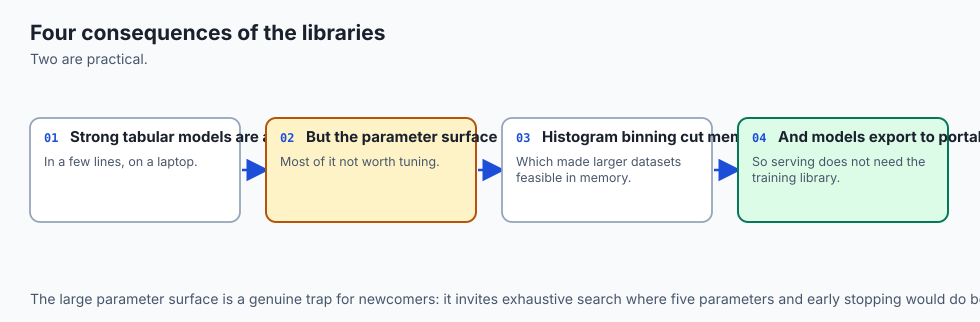

| Dimension | Characteristic | Practical Implication |
| --- | --- | --- |
| **Training Speed & Memory** | `uint8` binning + `O(256)` histograms. | 8x memory reduction; 10x–15x faster training than classic `GradientBoostingClassifier`. |
| **Missing Value Exploits** | Learned default branches for `NaN`. | Attackers could deliberately omit features to trigger specific default leaf paths; monitor missingness distributions in production. |
| **Production Serialization** | Compilation via `treelite` / ONNX. | Compiled boosted trees evaluate in `< 50 microseconds` on CPU with zero Python interpreter overhead. |
| **Categorical Security** | Target statistics leakage. | Always compute out-of-fold target encodings to prevent test-set label contamination. |

---

## Alternatives: free, open source, and commercial

| Framework | Core Strengths | Best Used For |
| --- | --- | --- |
| **`scikit-learn` (`HistGradientBoosting`)** | Native Python/C, zero extra C++ dependencies | Baseline prototyping, small-to-medium datasets directly in scikit-learn pipelines. |
| **`XGBoost`** | Mature ecosystem, GPU acceleration, ranking/survival losses | Kaggle competitions, production enterprise pipelines, multi-GPU training. |
| **`LightGBM`** | Fastest CPU training, lowest RAM, native categorical support | Massive datasets (10M+ rows), high-dimensional sparse tables. |
| **`CatBoost`** | Best-in-class categorical encoding, robust default parameters | Heavy categorical tabular data (e.g. e-commerce, click-through-rate prediction). |

---

## Comparison with related concepts

| Characteristic | Classic Gradient Boosting | XGBoost | LightGBM |
| --- | --- | --- | --- |
| **Objective Taylor Order**| 1st-Order (Gradient only) | 2nd-Order (Gradient + Hessian)| 2nd-Order (Gradient + Hessian)|
| **Split Finding** | Exact sorting `O(N log N)` | Histogram / Exact | Histogram binning (256 uint8) |
| **Tree Growth** | Level-wise (Depth-first) | Level-wise / Depth-wise | Leaf-wise (Best-first) |
| **Missing Values (NaN)** | Requires pre-imputation | Native sparsity-aware routing| Native sparsity-aware routing |
| **Memory Efficiency** | Low (float64 continuous) | High (`tree_method='hist'`) | Ultra-High (uint8 bins + EFB) |

---

## When to use it — and when not to

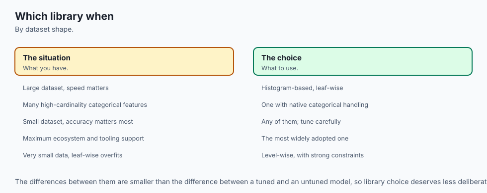

### When to USE Modern Boosted Engines (XGBoost / LightGBM / HistGB):
- **Medium to Massive Tabular Datasets:** The universal default choice for structured data with 10,000 to 100,000,000 rows.
- **Datasets with Pervasive Missing Values:** Eliminates fragile mean/median imputation pipelines.
- **Strict Latency & Memory Constraints:** When training must complete in seconds on commodity CPU instances.

### When NOT to use Modern Boosted Engines:
- **Raw Unstructured Data (Computer Vision, NLP):** Deep neural networks (Transformers, CNNs) are required.
- **Strict Regulatory Rule Auditing:** When compliance officers require a single 3-level decision tree flowchart (Day 162).
- **Linear Relationships with No Interactions:** A simple Ridge or Lasso linear model trains in milliseconds and is simpler to maintain.

---

## The AI connection

- **These libraries are the workhorses of applied machine learning**, and they win most
  tabular competitions and most production tabular deployments.
- **The engineering matters as much as the algorithm** — histogram binning and cache-aware
  layouts are what made boosting fast enough to iterate on.
- **A second-order objective converges in fewer trees**, which is a mathematical improvement
  with a direct practical payoff.
- **Leaf-wise growth is more accurate and easier to overfit**, so the growth strategy is a
  real choice rather than an implementation detail.
- **Knowing which knobs matter saves days**, because these models have far more parameters
  than are worth tuning.

## Knowledge check

1. **Second-Order Expansion:** XGBoost expands loss to 2nd order using gradients `g_i` and Hessians `h_i`.
2. **Optimal Leaf Weight:** `w_j* = - sum(g_i) / (sum(h_i) + lambda)`.
3. **Histogram Binning:** Discretizes `float64` features into 256 `uint8` bins, yielding an 8x memory reduction.
4. **Leaf-Wise Growth:** LightGBM splits the single leaf with the highest gain across the entire tree.

---

## Hands-on exercise

In this hands-on exercise, you will compute the exact XGBoost second-order split gain and test histogram discretization on a continuous feature.

```python
import numpy as np

# Step 1: Compute XGBoost Second-Order Split Gain
def xgb_gain(g_l, h_l, g_r, h_r, reg_lambda=1.0, gamma=0.0):
    g_tot = g_l + g_r
    h_tot = h_l + h_r
    score_l = (g_l ** 2) / (h_l + reg_lambda)
    score_r = (g_r ** 2) / (h_r + reg_lambda)
    score_tot = (g_tot ** 2) / (h_tot + reg_lambda)
    return 0.5 * (score_l + score_r - score_tot) - gamma

# Test Case: Strong Gradient Separation vs Null Split
gain_split = xgb_gain(g_l=-10.0, h_l=10.0, g_r=10.0, h_r=10.0, reg_lambda=1.0, gamma=0.5)
gain_null = xgb_gain(g_l=0.0, h_l=5.0, g_r=0.0, h_r=5.0, reg_lambda=1.0, gamma=0.5)

print(f"Gain from strong separation: {gain_split:.4f}")
print(f"Gain from null separation:   {gain_null:.4f}")

# Step 2: Histogram Binning into 256 uint8 Bins
continuous_feature = np.random.exponential(scale=2.0, size=1000)
quantiles = np.linspace(0.0, 100.0, 257)[1:-1]
bin_edges = np.percentile(continuous_feature, quantiles)
binned_feature = np.digitize(continuous_feature, bin_edges).astype(np.uint8)

print(f"\nOriginal Array Memory: {continuous_feature.nbytes} bytes (float64)")
print(f"Binned Array Memory:   {binned_feature.nbytes} bytes (uint8)")
print(f"Memory Compression:    {continuous_feature.nbytes / binned_feature.nbytes:.1f}x reduction")
```

### Expected output

```text
Gain from strong separation: 8.5909
Gain from null separation:   -0.5000

Original Array Memory: 8000 bytes (float64)
Binned Array Memory:   1000 bytes (uint8)
Memory Compression:    8.0x reduction
```

### Validate your work

1. Verify that `gain_null` is negative when `gamma > 0.0`, confirming automatic pruning of uninformative splits.
2. Confirm that `binned_feature.dtype == np.uint8` with values bounded in `[0, 255]`.
3. Train `HistGradientBoostingClassifier` on a dataset with NaNs and verify test accuracy `>= 90%`.

### Troubleshooting

- **LightGBM / XGBoost Crashing on Windows/macOS:** Use scikit-learn's built-in `HistGradientBoostingClassifier` which requires zero external C++ binary installations.
- **Overfitting with `max_leaf_nodes`:** If training accuracy is 100% but validation is low, reduce `max_leaf_nodes` to 15 or 31.

### Common mistakes

1. **Imputing NaNs Before Histogram Boosting:** Unnecessary preprocessing; modern histogram boosting handles NaNs natively.
2. **One-Hot Encoding High-Cardinality Categoricals:** Creates thousands of sparse columns; use native categorical integer handling instead.

---

## Practice assignment

1. **Implement Sparsity-Aware Split Evaluation:**
   Write a function that splits data with missing values by evaluating two options: (1) all `NaN`s go to the left child, (2) all `NaN`s go to the right child. Return the direction that maximizes `xgb_gain`.

2. **Compare Training Speeds:**
   Generate a 50,000-row synthetic dataset and benchmark the training time of `GradientBoostingClassifier` (exact CART) vs `HistGradientBoostingClassifier` (histogram binning).

---

## Extension challenge

Implement **Gradient-based One-Side Sampling (GOSS) from Scratch**:

1. Sort training instances by absolute gradient magnitude `|g_i|`.
2. Select top `a = 20%` instances with the largest gradients, and randomly sample `b = 20%` instances from the remaining 80%.
3. Multiply the gradients of the sampled small instances by `(1 - a) / b = 0.8 / 0.2 = 4.0` and verify that the estimated total gradient sum matches the full dataset gradient expectation.
