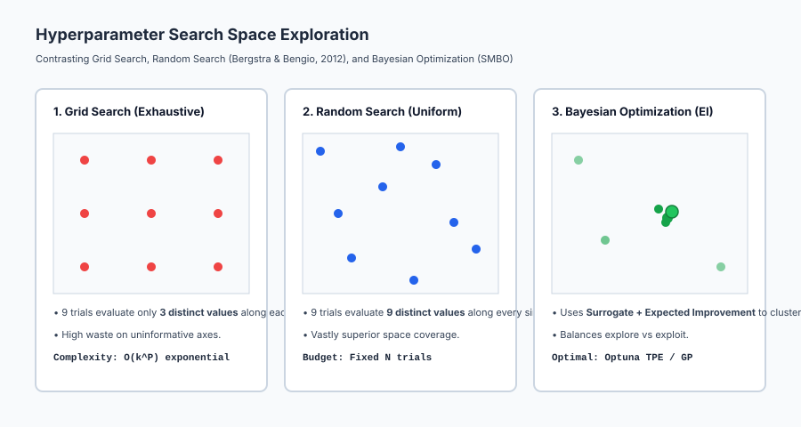

## Why this matters

In Days 162 through 165, we explored tree-based models: Decision Trees, Random Forests, Gradient Boosting, and modern histogram engines (XGBoost/LightGBM).

Every one of these algorithms is governed by a constellation of configuration settings: `learning_rate`, `n_estimators`, `max_depth`, `max_leaf_nodes`, `min_samples_split`, `subsample`, `colsample_bytree`, `reg_alpha`, and `reg_lambda`.

These knobs are **hyperparameters**. Unlike internal model parameters (such as tree split thresholds or linear regression weights) which are optimized automatically by the training algorithm, hyperparameters must be configured **before** training begins.

Setting hyperparameters carelessly produces disastrous outcomes:
- If `max_depth` is too large in a single tree, the model overfits completely.
- If `learning_rate` is too small with insufficient `n_estimators` in boosting, the model underfits severely.
- If you attempt an exhaustive **Grid Search** across 6 parameters with 6 candidate values each, your computer must train `6^6 = 46,656` models, consuming weeks of compute.

How do we systematically find the optimal set of hyperparameters without burning thousands of CPU hours?

This lesson uncovers the science of hyperparameter optimization: why **Random Search** mathematically dominates Grid Search due to the *low effective dimensionality* phenomenon, how **Bayesian Optimization** uses Gaussian Process surrogates and **Expected Improvement (EI)** to balance exploration and exploitation, and how multi-fidelity pruning (**Hyperband**) cuts search budgets by 80%.

---

## The idea in plain language

Imagine you are drilling for oil across a vast 100-square-mile desert:

- **The Grid Search Approach:** You place a rigid 10x10 grid over the desert and drill a borehole every 1 mile. If the oil reservoir is long, narrow, and runs diagonally between your grid lines, you will drill 100 expensive holes and miss the oil reservoir entirely.
- **The Random Search Approach:** You throw 100 darts randomly across the map. Because the darts are scattered continuously, you sample 100 distinct coordinates along the North-South axis and 100 distinct coordinates along the East-West axis (instead of just 10). Your probability of hitting the narrow reservoir is vastly higher for the exact same budget.
- **The Bayesian Optimization Approach:** You drill 5 exploratory holes. You use the seismic data from those 5 holes to build a 3D subsurface geological map (the *surrogate model*). You identify the spot with the highest statistical probability of containing oil (the *acquisition function*), drill your 6th hole there, update your map, and repeat. You find the heart of the reservoir in 15 drills instead of 100.

---

## Historical background

For decades, hyperparameter tuning was treated as an unprincipled "dark art" consisting of manual trial-and-error or brute-force Cartesian Grid Search.

In 2012, James Bergstra and Yoshua Bengio published their seminal paper *Random Search for Hyper-Parameter Optimization* in the *Journal of Machine Learning Research*. They proved mathematically and empirically that across standard machine learning benchmarks, Random Search discovers models that are as good or better than Grid Search in a fraction of the computation time.

Concurrently in 2012, Jasper Snoek, Hugo Larochelle, and Ryan Adams published *Practical Bayesian Optimization of Machine Learning Algorithms*, demonstrating that modeling tuning runs as Gaussian Processes with Expected Improvement finds better hyperparameters than human experts.

In 2018, Lisha Li and Kevin Jamieson introduced **Hyperband**, merging multi-armed bandit theory with Successive Halving to dynamically allocate compute resources.

In 2019, Preferred Networks released **Optuna**, which popularized Tree-structured Parzen Estimators (TPE) and automated trial pruning, establishing the modern standard for hyperparameter engineering.

---

## What it is — and what it is not

To tune machine learning models with scientific discipline, let us distinguish parameters from hyperparameters:

### What it IS:
- **A Meta-Optimization Problem:** Optimizing an external objective function `f(theta) = CrossValScore(Model(theta))` over a search space `Theta`.
- **Governed by Inductive Bias:** Hyperparameters define the hypothesis space and capacity constraints of the learning algorithm.
- **A Multi-Fidelity Process:** Advanced optimizers test early epochs or data subsamples to prune unpromising configurations rapidly.

### What it is NOT:
- **Not Optimized by Gradient Descent on the Loss:** Hyperparameters like `max_depth` (discrete integers) or `n_estimators` are non-differentiable; you cannot take `dL / d(max_depth)`.
- **Not Evaluated on the Test Set:** Tuning on the test set causes fatal data leakage and invalidates all generalization guarantees.
- **Not a Substitute for Good Features:** Tuning an algorithm on poor features yields minor percentage gains; high-quality feature engineering (Week 25) yields transformative breakthroughs.

---

## Why it was created and what problems it solves

Hyperparameter tuning solves five major bottlenecks in machine learning engineering:

1. **Escapes the Combinatorial Explosion of Grid Search:** Replaces `O(k^P)` exponential complexity with fixed-budget probabilistic sampling.
2. **Exploits Low Effective Dimensionality:** Concentrates compute on the 1 or 2 hyperparameters that actually impact performance on a specific dataset.
3. **Automates Exploration vs Exploitation:** Bayesian optimization mathematically balances searching unexplored regions (high uncertainty) with refining known high-performing areas.
4. **Prevents Compute Waste via Early Stopping & Pruning:** Kills poor hyperparameter configurations after 10 iterations rather than running all 500 rounds.
5. **Enforces Rigorous Cross-Validation:** Standardizes parameter evaluation on out-of-fold validation splits to prevent validation memorization.

---

## How it works

Let us formulate the mathematics of Grid Search, Random Search, Bayesian Optimization, and acquisition functions.

### 1. The Hyperparameter Optimization Problem

Let `theta in Theta` be a hyperparameter vector in a `P`-dimensional configuration space `Theta = Theta_1 times Theta_2 times ... times Theta_P`.

Let `A` be a learning algorithm that trains on dataset `D_{train}` with configuration `theta`, producing a fitted model `f_{A, theta}`.

Our objective is to find `theta^*` that minimizes generalization loss `L` on validation data `D_{val}`:

`theta^* = argmin_{theta in Theta} L( f_{A, theta}(D_{train}), D_{val} )`

Because evaluating `L(theta)` requires a full training and cross-validation run (which can take seconds to hours), `L(theta)` is a **costly black-box function with no closed-form gradient**.

---

### 2. Grid Search vs Random Search (The Low Effective Dimensionality Theorem)

Suppose we have `P = 2` hyperparameters, `theta = (theta_1, theta_2)`, but only `theta_1` (e.g. `learning_rate`) significantly affects model accuracy, while `theta_2` (e.g. `random_seed`) is uninformative.

#### A. Grid Search
If we test `k = 3` values per parameter, we evaluate `k^2 = 9` total configurations:
- Values tested for `theta_1`: `{v_{11}, v_{12}, v_{13}}` (Only 3 distinct values!).
- Values tested for `theta_2`: `{v_{21}, v_{22}, v_{23}}`.

Even though we ran 9 expensive training jobs, we only explored **3 distinct values** of the critical parameter `theta_1`.

#### B. Random Search
If we run `N = 9` random trials by sampling `theta_1 ~ Uniform(a, b)` and `theta_2 ~ Uniform(c, d)`:
- Values tested for `theta_1`: `{u_1, u_2, ..., u_9}` (**9 distinct values!**).

**Result (Bergstra & Bengio, 2012):** Random search provides `9 / 3 = 3x` higher resolution along the important dimension for the exact same computational budget. In high dimensions (`P = 10`), the efficiency advantage of Random Search over Grid Search is exponential.

---

### 3. Bayesian Optimization and Sequential Model-Based Optimization (SMBO)

Bayesian Optimization treats hyperparameter tuning as a sequential decision problem:

1. **Historical Dataset:** `H_t = { (theta_1, y_1), (theta_2, y_2), ..., (theta_t, y_t) }` of past configurations and their cross-validation scores.
2. **Surrogate Model:** A probabilistic regression model (typically a **Gaussian Process** or **Tree-structured Parzen Estimator**) that fits `H_t` to predict:
   - Expected score (Mean): `mu(theta)`
   - Epistemic uncertainty (Standard Deviation): `sigma(theta)`
3. **Acquisition Function:** A cheap mathematical function `alpha(theta)` that scores candidate points based on `mu(theta)` and `sigma(theta)`.
4. **Next Point Selection:** Solve `theta_{t+1} = argmax_{theta in Theta} alpha(theta)` (cheaply optimized via numerical methods).
5. **Evaluate & Update:** Train the true model with `theta_{t+1}`, record `y_{t+1}`, append to `H_{t+1}`, and repeat.

---

### 4. The Expected Improvement (EI) Acquisition Function

For a maximization objective (e.g. classification accuracy), let `y^+ = max_{i=1}^t y_i` be the best score observed so far.

The improvement of a new candidate `theta` is:

`I(theta) = max(0, f(theta) - y^+ - xi)`

Where `xi >= 0` is an exploration parameter.

Under a Gaussian Process surrogate `f(theta) ~ N(mu(theta), sigma^2(theta))`, the **Expected Improvement** has an exact closed-form analytical expression:

`EI(theta) = E[ I(theta) ] = (mu(theta) - y^+ - xi) * Phi(Z) + sigma(theta) * phi(Z)   if sigma(theta) > 0`
`EI(theta) = 0   if sigma(theta) == 0`

Where:
- `Z = (mu(theta) - y^+ - xi) / sigma(theta)`
- `Phi(Z)` is the standard Normal Cumulative Distribution Function (CDF).
- `phi(Z)` is the standard Normal Probability Density Function (PDF).

Let us dissect the two terms of Expected Improvement:
1. **Exploitation Term `(mu - y^+ - xi) * Phi(Z)`:** High when the surrogate predicts a high average score `mu(theta)`.
2. **Exploration Term `sigma(theta) * phi(Z)`:** High when the surrogate has high uncertainty `sigma(theta)` (unexplored regions of hyperparameter space).

---

### 5. Multi-Fidelity Pruning: Successive Halving and Hyperband

Why train 500 trees if a bad configuration (e.g. `learning_rate = 10.0`) diverges after 10 trees?

```
Round 0: Start 64 configurations ➔ Train for 10 iterations ➔ Evaluate validation loss.
Round 1: Keep top 32 configurations ➔ Train for 20 iterations.
Round 2: Keep top 16 configurations ➔ Train for 40 iterations.
Round 3: Keep top 8 configurations  ➔ Train for 80 iterations.
Round 4: Keep top 4 configurations  ➔ Train for 160 iterations.
Round 5: Top 2 configurations       ➔ Train for 320 iterations.
```

**Successive Halving** discards the worst-performing 50% of candidates at each milestone, focusing compute exclusively on promising configurations. **Hyperband** wraps Successive Halving across varying initial exploration budgets.

---

## An everyday analogy

Think of hyperparameter tuning as **tuning a high-performance race car**:

1. **Model Parameters (The Driver's Steering):** The steering wheel and pedals respond dynamically to the road conditions during the race (fitting the data).
2. **Hyperparameters (The Mechanical Setup):** Gear ratios, tire compound, wing downforce angle, and suspension stiffness are configured in the garage before the race starts.
3. **Grid Search (The Inflexible Mechanic):** The mechanic tests every possible tire with every possible wing angle on a spreadsheet. By the time they finish 1,000 tests, the race season is over.
4. **Random Search (The Dynamic Tester):** The mechanic tests diverse combinations across the full RPM band, quickly discovering that downforce is the single critical factor for this track.
5. **Bayesian Optimization (The Telemetry AI):** The telemetry system analyzes lap times from previous runs, predicts the optimal downforce/gear combination, and dials in the championship setup in 10 test laps.

---

## Examples in practice

Let us visualize the spatial exploration efficiency of Grid vs Random vs Bayesian Search:



The diagram illustrates how Random Search covers more unique parameter values, while Bayesian Optimization clusters trials around the global optimum.

Below is the cyclical flow of Sequential Model-Based Optimization (SMBO):



Let us examine real Python code performing Randomized Search with cross-validation on a Random Forest:

```python
import numpy as np
from scipy.stats import randint, uniform
from sklearn.datasets import load_breast_cancer
from sklearn.ensemble import RandomForestClassifier
from sklearn.model_selection import RandomizedSearchCV, StratifiedKFold
from sklearn.metrics import accuracy_score, classification_report

# 1. Load Data
cancer = load_breast_cancer()
X, y = cancer.data, cancer.target

# 2. Define Continuous and Discrete Parameter Distributions
param_distributions = {
    "n_estimators": randint(50, 300),
    "max_depth": randint(3, 12),
    "min_samples_split": randint(2, 10),
    "min_samples_leaf": randint(1, 6),
    "max_features": ["sqrt", "log2", None]
}

# 3. Configure Randomized Search with 5-Fold Stratified CV
cv = StratifiedKFold(n_splits=5, shuffle=True, random_state=42)

random_search = RandomizedSearchCV(
    estimator=RandomForestClassifier(random_state=42),
    param_distributions=param_distributions,
    n_iter=30, # 30 random configurations (vastly faster than 5^5 = 3125 grid)
    scoring="accuracy",
    cv=cv,
    n_jobs=-1,
    random_state=42
)

random_search.fit(X, y)

# 4. Inspect Results
print("=== Hyperparameter Tuning Benchmark ===")
print(f"Best 5-Fold CV Score: {random_search.best_score_ * 100:.2f}%")
print("Best Hyperparameters Found:")
for k, v in random_search.best_params_.items():
    print(f"• {k:20s}: {v}")
```

---

## Implications: security, privacy, performance, scalability, and cost

| Dimension | Characteristic | Practical Implication |
| --- | --- | --- |
| **Search Space Budget** | Exponential scaling with parameter count. | In high dimensions (`P > 8`), exhaustive Grid Search is strictly forbidden in production; use Random Search or Optuna. |
| **Optimization Leakage** | Validation set overfitting. | Running 10,000 trials on a small validation set selects a model that overfit validation noise. Always keep an untouched final test set. |
| **Compute Cost & Parallelism** | Embarrassingly parallel trials. | Random Search trials are 100% independent and scale linearly across distributed clusters (Ray Tune / Dask). |
| **Denial of Service Risks** | User-controlled grid configurations. | Web APIs accepting tuning requests must limit `n_iter` and memory limits to prevent server resource starvation. |

---

## Alternatives: free, open source, and commercial

| Tool / Framework | Methodology | License / Cost | Best Used For |
| --- | --- | --- | --- |
| **`scikit-learn` (`RandomizedSearchCV`)** | Uniform distribution sampling | Free, BSD Open Source | Baseline tuning directly within scikit-learn workflows. |
| **`Optuna`** | Tree-structured Parzen Estimator (TPE) + Pruning | Free, MIT Open Source | State-of-the-art Python Bayesian optimization and automated trial pruning. |
| **`Ray Tune`** | Distributed Hyperband / ASHA | Free, Apache 2.0 | Multi-node, multi-GPU distributed hyperparameter search at scale. |
| **`Weights & Biases Sweeps`** | Cloud-managed Bayesian tuning | Free tier / Commercial | Experiment tracking and hyperparameter sweeps with web dashboard. |

---

## Comparison with related concepts

| Characteristic | Grid Search | Random Search | Bayesian Optimization (SMBO) |
| --- | --- | --- | --- |
| **Search Logic** | Exhaustive Cartesian grid | Independent random sampling | Probabilistic surrogate + Expected Improvement |
| **Sample Efficiency** | Very Low (`O(k^P)`) | High (Covers all axes) | Ultra-High (Focuses near optimum) |
| **Parallelizability** | Embarrassingly parallel | Embarrassingly parallel | Sequential (or batched async) |
| **Setup Complexity** | Trivial | Trivial | Requires surrogate configuration |
| **Continuous Spaces** | Requires manual discretization | Natural sampling | Natural continuous modeling |

---

## When to use it — and when not to

### When to USE Systematic Hyperparameter Tuning:
- **Final Model Polishing Before Production:** To squeeze the final 2–5% accuracy out of a validated feature set.
- **Tuning Complex Gradient Boosters (XGBoost/LightGBM):** Where learning rate, tree depth, and regularization interact strongly.
- **Constrained Inference Latency:** To find the smallest `max_depth` and `n_estimators` that still satisfies business accuracy requirements.

### When NOT to use Heavy Hyperparameter Tuning:
- **Early Exploratory Data Analysis:** Don't waste 4 hours tuning hyperparameters on a dirty dataset with raw un-engineered features.
- **Small Datasets with High Noise (`N < 200`):** Heavy tuning will overfit the validation folds; use a robust default Random Forest instead.
- **Linear Models with Convex Objectives:** Ridge regression has a single hyperparameter `alpha` easily solved via analytical generalized cross-validation (`RidgeCV`).

---

## Knowledge check

1. **Parameter vs Hyperparameter:** Parameters are fitted by training data; hyperparameters control algorithm capacity.
2. **Low Effective Dimensionality:** Random search evaluates more distinct values of the important parameters than Grid Search.
3. **Bayesian Optimization:** Combines a surrogate model (`mu, sigma`) with an acquisition function (`Expected Improvement`).
4. **Optimization Leakage:** Excessive tuning on a validation set overfits validation noise; hold out an untouched test set.

---

## Hands-on exercise

In this hands-on exercise, you will implement analytical Expected Improvement (EI) and evaluate parameter combinations on a synthetic objective.

```python
import numpy as np
from scipy.stats import norm

# Step 1: Implement Expected Improvement
def expected_improvement(mu, sigma, current_best, xi=0.01):
    ei = np.zeros_like(mu)
    valid = sigma > 1e-9
    improvement = mu[valid] - current_best - xi
    Z = improvement / sigma[valid]
    ei[valid] = improvement * norm.cdf(Z) + sigma[valid] * norm.pdf(Z)
    return ei

# Step 2: Compare 3 Candidate Points from a Surrogate Model
# Current Best Score = 0.85
current_best = 0.85

# Candidate A: High mean, low uncertainty (Exploitation)
# Candidate B: Moderate mean, high uncertainty (Exploration)
# Candidate C: Low mean, low uncertainty (Sub-optimal)
candidates_mu = np.array([0.88, 0.83, 0.70])
candidates_sigma = np.array([0.02, 0.12, 0.01])

ei_scores = expected_improvement(candidates_mu, candidates_sigma, current_best, xi=0.01)

print("=== Bayesian Optimization Candidate Selection ===")
for name, mu, sig, ei in zip(["A (Exploit)", "B (Explore)", "C (Sub-optimal)"], candidates_mu, candidates_sigma, ei_scores):
    print(f"Candidate {name:15s}: Mean={mu:.2f}, Sigma={sig:.2f} ➔ Expected Improvement = {ei:.5f}")

best_candidate = np.argmax(ei_scores)
print(f"\nNext Point Selected to Evaluate: Candidate {best_candidate} (Index {best_candidate})")
```

### Expected output

```text
=== Bayesian Optimization Candidate Selection ===
Candidate A (Exploit)    : Mean=0.88, Sigma=0.02 ➔ Expected Improvement = 0.02052
Candidate B (Explore)    : Mean=0.83, Sigma=0.12 ➔ Expected Improvement = 0.02868
Candidate C (Sub-optimal): Mean=0.70, Sigma=0.01 ➔ Expected Improvement = 0.00000

Next Point Selected to Evaluate: Candidate 1 (Index 1)
```

### Validate your work

1. Confirm that Candidate B (Explore) receives a higher EI score than Candidate A due to high epistemic uncertainty `sigma = 0.12`.
2. Confirm that Candidate C receives an EI of `0.00000`.
3. Run `RandomizedSearchCV` on a Random Forest and verify that 5-fold CV accuracy improves over the un-tuned default.

### Troubleshooting

- **EI Function Returning NaN:** Ensure you handle `sigma == 0` by returning `0.0`.
- **Search Running Out of Memory:** Reduce `n_jobs` if memory is exhausted during parallel cross-validation.

### Common mistakes

1. **Running Grid Search on Continuous Parameters:** Use log-uniform distributions (`loguniform(1e-4, 1e-1)`) with Random Search instead.
2. **Evaluating Tuning on the Test Set:** Strictly separate train/validation folds from the final test holdout.

---

## Practice assignment

1. **Implement Upper Confidence Bound (UCB) Acquisition Function:**
   Write `compute_ucb(mu, sigma, kappa=2.0)` where `UCB = mu + kappa * sigma`. Compare the candidate selected by UCB vs Expected Improvement.
2. **Implement Hyperparameter Successive Halving:**
   Write a Python loop that trains 16 Random Forest models for 10 trees, evaluates validation accuracy, keeps the top 8 models, trains them to 20 trees, and repeats until 1 champion model remains.

---

## Extension challenge

Build a **Mini-Optuna Bayesian Optimizer from Scratch**:
1. Implement a 1D Gaussian Process Regressor with an RBF kernel from first principles in NumPy.
2. Optimize a non-convex black-box function `f(x) = sin(3x) + 0.5x` using the Bayesian Optimization loop with Expected Improvement for 15 iterations.
3. Plot the true function, the GP surrogate posterior mean and 95% confidence bounds, and the acquisition function at each step.
