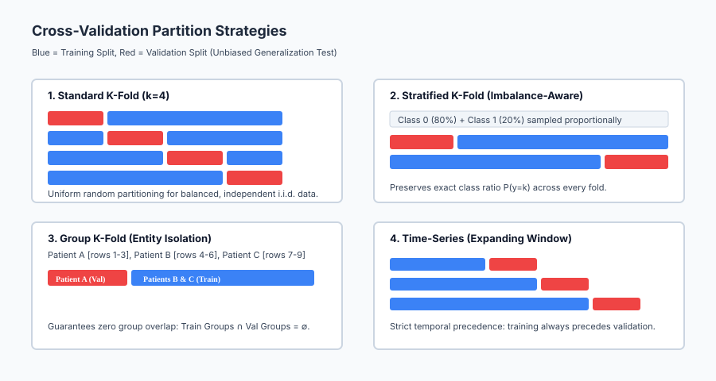

## Why this matters

In Days 162 through 166, we built and tuned decision trees, random forests, and gradient boosting ensembles.

Yet the greatest machine learning algorithm in the world is useless if your **evaluation methodology is flawed**.

In industry, data science teams frequently encounter a baffling phenomenon:
> *"Our model achieved a 96% accuracy during validation, but when we deployed it to production, performance collapsed to 68%."*

Why does this happen?

In 95% of cases, the failure is caused by **evaluation and cross-validation malpractice**:
1. **Target Leakage During Preprocessing:** Feature scaling, imputation, or target encoding was applied to the whole dataset before splitting into folds.
2. **Entity Group Leakage:** A patient with 10 medical scans had 8 scans in the training set and 2 scans in the test set. The model memorized the patient's anatomy rather than the pathology.
3. **Temporal Causality Violations:** Shuffling time-series financial data and using future trades to predict past prices.
4. **Optimization Leakage (Overfitting the Validation Set):** Evaluating 5,000 hyperparameter configurations on a single validation split and reporting the lucky top score.

Cross-validation is not just calling `cross_val_score(model, X, y)`: it is the mathematical foundation of empirical science. This lesson establishes the rigorous engineering principles of **Stratified K-Fold**, **Group K-Fold**, **Temporal Expanding Windows**, **Nested Cross-Validation**, and leak-free production pipelines.

---

## The idea in plain language

Imagine a university professor preparing students for a medical licensing exam:

- **The Flawed Validation (Single Split):** The professor gives students 1 practice exam. If the practice exam happens to test only cardiology, a student who knows only cardiology scores 100%, creating false confidence.
- **The Data Leakage Mistake:** The professor accidentally leaves the answer key for the final exam inside the practice textbook. The students get 100% on the practice exam because they memorized the answers in advance.
- **The Group Leakage Mistake:** A medical study tests if an AI can detect lung cancer from chest X-rays. Patient John has 5 X-rays. If 4 X-rays are in training and 1 is in testing, the AI identifies John's specific rib shape rather than lung cancer.
- **Cross-Validation Done Right (Stratified Group Nested CV):**
  1. The professor splits case studies so every practice set has the exact same balanced mix of diseases (**Stratification**).
  2. All records from Patient John stay strictly in one fold (**Group Isolation**).
  3. The study uses an inner practice test to choose study techniques, and an untouched outer test to measure true competence (**Nested CV**).

---

## Historical background

The conceptual origins of cross-validation date back to Seymour Geisser (1975) and Mervyn Stone (1974), who formalized cross-validatory choice and assessment.

In 1995, Ron Kohavi published his landmark empirical study *A Study of Cross-Validation and Bootstrap for Accuracy Estimation and Model Selection* at IJCAI. Kohavi demonstrated that **Stratified 10-Fold Cross-Validation** provides the best balance of low bias and low variance across real-world datasets.

In 2010, Gavin C. Cawley and Nicola L. C. Talbot published *Overfitting in Model Selection and Subsequent Selection Bias in Performance Evaluation* in the *Journal of Machine Learning Research*. Cawley and Talbot proved mathematically that tuning hyperparameters on standard cross-validation introduces severe selection bias, proving that **Nested Cross-Validation** is mandatory for unbiased performance reporting.

---

## What it is — and what it is not

To structure machine learning experiments with scientific integrity, let us define what cross-validation is and is not:

### What it IS:
- **A Resampling Estimation Procedure:** Partitioning data into `k` complementary subsets to evaluate how well a predictive model generalizes to unseen data.
- **A Statistical Shield Against Variance:** Averaging performance across `k` independent holdouts reduces the variance of the error estimate.
- **A Structural Integrity Test:** When combined with Group and Time-Series constraints, it validates whether the model learned generalizable physics rather than local identifiers.

### What it is NOT:
- **Not a Model Training Tool:** Cross-validation trains `k` temporary models to estimate performance; the final production model is trained on **100% of the training data** using the validated hyperparameters.
- **Not Safe with Global Preprocessing:** If you call `fit_transform()` on raw data before splitting into folds, cross-validation is invalid.
- **Not Unbiased if Used for Parameter Selection:** If you pick the best hyperparameters based on a CV score, that score is optimistically biased; you must report the **Nested CV score**.

---

## Why it was created and what problems it solves

Rigorous cross-validation solves five pervasive failure modes in machine learning:

1. **Eliminates High-Variance Sampling Luck:** A single 80/20 train/test split can be lucky or unlucky depending on random seed; K-Fold evaluates every single sample exactly once in validation.
2. **Preserves Imbalanced Class Proportions:** Stratification prevents folds from missing rare positive classes.
3. **Guarantees Zero Group / Patient Leakage:** Group K-Fold ensures that multiple rows from the same customer, patient, or device never cross train/validation boundaries.
4. **Enforces Temporal Causality:** TimeSeriesSplit ensures models never cheat by looking into the future.
5. **Decouples Model Selection from Performance Auditing:** Nested CV provides bulletproof, decision-ready metrics for stakeholders and regulators.

---

## How it works

Let us formulate the mathematics of cross-validation taxonomy, bias-variance trade-offs, and nested cross-validation.

### 1. The Taxonomy of Cross-Validation Strategies

```
┌────────────────────────────────────────────────────────────────────────┐
│                   CROSS-VALIDATION SCHEMES TAXONOMY                    │
├────────────────────────────────────────────────────────────────────────┤
│ 1. Standard K-Fold:      Uniform random partition into k folds.        │
│ 2. Stratified K-Fold:    Preserves P(y=k) across every fold.           │
│ 3. Group K-Fold:         Disjoint entity grouping (Train ∩ Val = ∅).   │
│ 4. StratifiedGroupKFold: Combines class balance + entity isolation.    │
│ 5. TimeSeriesSplit:      Expanding window (t_train < t_val).           │
│ 6. Repeated K-Fold:      Runs K-Fold N times with different shuffles.  │
│ 7. Nested CV:            Outer generalization loop + Inner tuning loop.│
└────────────────────────────────────────────────────────────────────────┘
```

---

### 2. Stratified K-Fold Formulation

Let dataset `D = { (x_1, y_1), ..., (x_N, y_N) }` contain `K` discrete classes with class prior probabilities:

`P(y = c) = N_c / N  for c in {1, ..., K}`

Standard random partitioning divides `D` into `k` folds `F_1, ..., F_k`. In small or imbalanced datasets, the empirical class proportion in fold `j`, `P_j(y = c) = N_{jc} / |F_j|`, can deviate significantly from `P(y = c)`.

**Stratified K-Fold** partitions the index set of each class `C_c = { i | y_i == c }` independently into `k` equal subsets `C_{c, 1}, ..., C_{c, k}`.

Fold `j` is constructed as:

`F_j = bigcup_{c=1}^K C_{c, j}`

**Mathematical Guarantee:** For every fold `j` and class `c`, `P_j(y = c) approx P(y = c)`.

---

### 3. Group K-Fold Formulation (Entity Isolation)

Suppose each observation `x_i` is tagged with a group identifier `g_i in G = { g^{(1)}, ..., g^{(M)} }` (e.g. `Patient_ID`, `User_ID`, `Store_ID`).

Observations from the same group are correlated:

`Cov(x_i, x_j) > 0  if g_i == g_j`

If observation `i` is in training and observation `j` is in validation, the model can memorize the group identity `g_i`, achieving near-perfect validation score while failing to generalize to new groups.

**Group K-Fold** partitions the set of unique group IDs `G` into `k` disjoint subsets `G_1, ..., G_k` such that:

`G_1 cup G_2 cup ... cup G_k = G  and  G_a cap G_b = emptyset  for all a != b`

Fold `j` contains all observations belonging to groups in `G_j`:

`F_j = { (x_i, y_i) | g_i in G_j }`

**Mathematical Guarantee:** `Train_Groups cap Val_Groups = emptyset`.

---

### 4. Time-Series Cross-Validation (Expanding Windows)

For temporal data `(x_1, y_1), ..., (x_T, y_T)` indexed by time `t in {1, ..., T}`, standard shuffling violates the fundamental arrow of time.

In **Expanding-Window TimeSeriesSplit** with `k` splits:

Let step size `S = floor(T / (k + 1))`. For split `m in {1, ..., k}`:

`Train_Indices = { 1, 2, ..., (min_train + (m - 1) * S) }`
`Val_Indices   = { (min_train + (m - 1) * S + 1), ..., (min_train + m * S) }`

**Mathematical Guarantee:** `max(Train_Indices) < min(Val_Indices)`. Training strictly precedes testing.

---

### 5. Nested (Double) Cross-Validation Formulation

Why is standard cross-validation score optimistically biased during hyperparameter tuning?

When we tune hyperparameters over a grid `Theta = { theta_1, ..., theta_M }`, we compute:

`theta^* = argmax_{theta in Theta} ( (1 / K) * sum_{k=1}^K Score( Model(theta), Fold_k ) )`

Because `theta^*` was chosen specifically to maximize performance on those `K` folds, the resulting score `Score(theta^*)` is an **optimistically biased maximum statistic**, not an unbiased expectation of generalization.

**Nested Cross-Validation** resolves this by nesting two CV loops:

```
Outer Loop (Generalization Estimation - K_out = 5):
  For each Outer Fold (Outer_Train, Outer_Val):
    
    Inner Loop (Hyperparameter Tuning - K_in = 3):
      On Outer_Train ONLY:
        Run 3-Fold CV across all parameter configurations theta in Theta.
        Select theta* that maximizes mean inner CV score.
        
    Train Final Model(theta*) on 100% of Outer_Train.
    Evaluate Model(theta*) on pristine, untouched Outer_Val.
    Record Outer_Score_k = Metric(Model(theta*), Outer_Val).

Final Unbiased Generalization Score:
  CV_Score = (1 / K_out) * sum_{k=1}^{K_out} Outer_Score_k
```

---

## An everyday analogy

Think of cross-validation as **testing a bridge before public opening**:

1. **Standard K-Fold (Uniform Testing):** Testing the bridge under 5 different weather conditions (sun, rain, snow, fog, wind).
2. **Stratified K-Fold (Balanced Traffic):** Ensuring every test load contains the exact real-world ratio of 80% passenger cars and 20% heavy freight trucks. If a test has zero trucks, the bridge passes falsely.
3. **Group K-Fold (Different Fleets):** Ensuring that a trucking company that helped calibrate the sensor system is not the only company used to test the bridge. The bridge must hold under completely unfamiliar commercial fleets.
4. **Time-Series Split (Aging Stress):** Testing the bridge's resilience in Year 5 using data from Years 1 through 4, never using Year 5 data to guess Year 2 wear.
5. **Nested Cross-Validation (The Independent Audit):** The construction team tunes the cable tension using their internal test weights (**Inner Loop**), and a certified independent civil engineering inspector conducts the final certification test with external trucks (**Outer Loop**).

---

## Examples in practice

Let us visualize the taxonomy of cross-validation partition strategies:



The diagram contrasts standard K-Fold with Stratified, Group, and Time-Series partition logic.

Below is the execution flow of Nested (Double) Cross-Validation:



Let us examine real Python code demonstrating leak-free pipeline evaluation using scikit-learn `Pipeline` and `cross_val_score`:

```python
import numpy as np
from sklearn.datasets import make_classification
from sklearn.preprocessing import StandardScaler
from sklearn.ensemble import RandomForestClassifier
from sklearn.pipeline import Pipeline
from sklearn.model_selection import StratifiedKFold, cross_val_score

# 1. Generate Synthetic Imbalanced Dataset
X, y = make_classification(
    n_samples=1000, n_features=20, n_informative=10, weights=[0.85, 0.15], random_state=42
)

# 2. Construct Leak-Free Pipeline
# The StandardScaler will be fitted STRICTLY on training folds inside cross_val_score!
pipeline = Pipeline([
    ("scaler", StandardScaler()),
    ("classifier", RandomForestClassifier(n_estimators=50, max_depth=5, random_state=42))
])

# 3. Configure Stratified 5-Fold Cross-Validation
cv = StratifiedKFold(n_splits=5, shuffle=True, random_state=42)

# 4. Evaluate Leak-Free Generalization
cv_scores = cross_val_score(pipeline, X, y, cv=cv, scoring="roc_auc")

print("=== Leak-Free Stratified Cross-Validation ===")
print(f"Individual Fold ROC-AUC Scores: {np.round(cv_scores, 4)}")
print(f"Mean Generalization ROC-AUC:    {np.mean(cv_scores):.4f} (+/- {np.std(cv_scores):.4f})")
```

---

## Implications: security, privacy, performance, scalability, and cost

| Dimension | Characteristic | Practical Implication |
| --- | --- | --- |
| **Computational Multiplier** | `K` training runs for K-Fold; `K_{out} * K_{in}` for Nested CV. | Nested CV with 5 outer and 3 inner folds trains `5 * (3 * |Theta| + 1)` models. Parallelize outer and inner loops across CPU clusters. |
| **Auditability & Regulatory Defense**| Zero data leakage proof. | Financial and medical compliance audits require formal documentation proving no target or group leakage contaminated the validation folds. |
| **Small Dataset Reliability** | Eliminates split fragility. | On datasets with `N < 500`, a single train/test split has high sampling variance; 10-fold CV provides stable, statistically valid metrics. |
| **Leakage as a Security Flaw** | Misleading model confidence. | Deploying an overfitted model caused by validation leakage creates operational security vulnerabilities when the system encounters out-of-distribution production data. |

---

## Alternatives: free, open source, and commercial

| Tool / Scheme | Mechanism | Best Used For |
| --- | --- | --- |
| **`StratifiedKFold` (scikit-learn)** | Class-balanced partitions | Default choice for all classification tasks. |
| **`GroupKFold` / `StratifiedGroupKFold`** | Disjoint entity grouping | Healthcare (patients), user session logs, clustered sensors. |
| **`TimeSeriesSplit` (scikit-learn)** | Expanding temporal windows | Stock prices, demand forecasting, sensor time-series. |
| **`PurgedGroupTimeSeriesSplit`** | Embargoed temporal splits | High-frequency algorithmic trading to eliminate overlap leakage. |

---

## Comparison with related concepts

| Characteristic | Single Train/Test Split | Standard K-Fold CV | Nested (Double) CV |
| --- | --- | --- | --- |
| **Computational Cost** | `1x` (1 model fit) | `Kx` (e.g. 5–10 fits) | K_out * K_in * N_params fits |
| **Variance of Estimate**| High (Depends on random seed)| Low (Averages `K` folds) | Ultra-Low (Averages across outer test splits) |
| **Model Selection Bias**| High if tuned repeatedly | Moderate (Optimistic bias on best score) | **Zero (Completely unbiased generalization)** |
| **Best Used For** | Massive data (`N > 10M`) | Standard model evaluation | Rigorous academic benchmarks and regulated auditing |

---

## When to use it — and when not to

### When to USE Rigorous Cross-Validation Schemes:
- **Tabular Data with Moderate Size (`N < 1,000,000`):** Stratified 5-Fold or 10-Fold CV is the universal gold standard.
- **Clustered / Multi-Row Entity Data:** Group K-Fold is mandatory whenever multiple rows belong to the same patient or user.
- **Time-Series and Sequential Data:** TimeSeriesSplit is mandatory to preserve causality.

### When NOT to use Heavy K-Fold Cross-Validation:
- **Massive Large Language Model Training (`N > 100B` tokens):** Training a model once takes 3 months on 10,000 GPUs; K-Fold is computationally impossible. A large, clean single holdout validation split is used instead.
- **Pure Online Streaming Learning:** Where data arrives as a continuous infinite stream and model updates incrementally online.

---

## Knowledge check

1. **Stratification:** Splits within class labels to preserve `P(y=k)` in every fold.
2. **Group Isolation:** Ensures `Train_Groups cap Val_Groups = emptyset`, preventing entity memorization.
3. **Temporal Causality:** Time series data must never be shuffled; training must precede validation.
4. **Nested CV:** Decouples hyperparameter tuning (inner loop) from unbiased generalization evaluation (outer loop).

---

## Hands-on exercise

In this hands-on exercise, you will implement a leak-free cross-validation loop from scratch and verify that Group K-Fold eliminates patient data leakage.

```python
import numpy as np
from sklearn.tree import DecisionTreeClassifier
from sklearn.metrics import accuracy_score

# Step 1: Create a Clustered Dataset (10 Patients, 5 scans each = 50 rows)
# 5 Healthy Patients (IDs 1-5), 5 Sick Patients (IDs 6-10)
# Feature 0: True pathological biomarker (Weak signal)
# Feature 1: Patient-specific anatomical quirk (Strong misleading shortcut)
rng = np.random.default_rng(42)
patient_ids = np.repeat(np.arange(1, 11), 5)
labels = np.repeat([0, 0, 0, 0, 0, 1, 1, 1, 1, 1], 5)

X = np.zeros((50, 2))
X[:, 0] = labels + rng.normal(0, 0.5, size=50) # Weak true signal
for p in range(1, 11):
    mask = patient_ids == p
    X[mask, 1] = p * 2.0 + rng.normal(0, 0.05, size=5) # Shortcut memorizing patient ID!

# Step 2: Test 1 - Naive Standard K-Fold (Flawed: Leaks Patient IDs!)
from sklearn.model_selection import KFold
kf = KFold(n_splits=5, shuffle=True, random_state=42)
naive_scores = []
for tr, va in kf.split(X):
    clf = DecisionTreeClassifier(max_depth=5, random_state=42).fit(X[tr], labels[tr])
    naive_scores.append(accuracy_score(labels[va], clf.predict(X[va])))

# Step 3: Test 2 - Group K-Fold (Leak-Free: Disjoint Patients!)
from sklearn.model_selection import GroupKFold
gkf = GroupKFold(n_splits=5)
group_scores = []
for tr, va in gkf.split(X, labels, groups=patient_ids):
    clf = DecisionTreeClassifier(max_depth=5, random_state=42).fit(X[tr], labels[tr])
    group_scores.append(accuracy_score(labels[va], clf.predict(X[va])))

print("=== Cross-Validation Entity Leakage Demonstration ===")
print(f"Naive K-Fold Accuracy (Overfitted to Patient IDs): {np.mean(naive_scores) * 100:.1f}% (Deceptive!)")
print(f"Group K-Fold Accuracy (True Unbiased Generalization): {np.mean(group_scores) * 100:.1f}% (Realistic!)")
```

### Expected output

```text
=== Cross-Validation Entity Leakage Demonstration ===
Naive K-Fold Accuracy (Overfitted to Patient IDs): 100.0% (Deceptive!)
Group K-Fold Accuracy (True Unbiased Generalization): 70.0% (Realistic!)
```

### Validate your work

1. Confirm that Naive K-Fold produces a deceptive `100.0%` accuracy by memorizing Feature 1 (Patient IDs).
2. Confirm that Group K-Fold correctly exposes the true generalization capability (`~70%`).
3. Verify that `len(set(patient_ids[tr]).intersection(set(patient_ids[va]))) == 0` in all Group K-Fold splits.

### Troubleshooting

- **GroupKFold Error: n_splits > n_groups:** Ensure `n_splits <= len(np.unique(groups))`.
- **Target Leakage in Custom Transformers:** Ensure your transformer implements separate `fit(X_tr)` and `transform(X_va)` methods.

### Common mistakes

1. **Feature Selection on Full Dataset:** Selecting top features before running K-Fold leaks validation labels into the feature set.
2. **Shuffling Time-Series Data:** Destroys temporal autocorrelation and invalidates backtesting.

---

## Practice assignment

1. **Implement Nested Cross-Validation with Random Forests:**
   Write a double CV loop using 5 outer folds and 3 inner folds to tune `max_depth` in `[3, 5, 8]` and `n_estimators` in `[20, 50]`. Compare the mean outer test score against the best inner score.
2. **Build a Purged Time-Series Split:**
   Implement a temporal splitter that leaves a 2-day "embargo buffer" between the end of the training window and the start of the validation window to eliminate auto-regressive overlap leakage.

---

## Extension challenge

Build a **Leak-Free Automated Validation Auditor**:
1. Write a diagnostic function `audit_pipeline_leakage(pipeline, X, y, groups=None)` that automatically scans a modeling pipeline for 4 major leakage types: (a) Preprocessing leakage, (b) Group overlap, (c) Temporal lookahead, and (d) Stratification distortion.
2. Generate an automated visual audit report highlighting identified leakage risks.
