## Why this matters

Tabular data is the financial, operational, and clinical backbone of the global economy.

From credit underwriting in banking and fraud detection in payments to patient mortality forecasting in healthcare and supply chain inventory management, **structured tabular datasets represent over 80% of enterprise machine learning applications**.

Yet while Deep Learning conquered computer vision (CNNs/ViTs) and natural language processing (Transformers), **Gradient Boosted Decision Trees (LightGBM, XGBoost, CatBoost) remain the undisputed champions of tabular data**.

Rigorous large-scale academic studies (Gorishniy et al., 2021; Grinsztajn et al., 2022) benchmarking neural architectures against tree ensembles across dozens of real-world datasets confirmed that tuned GBDT models consistently beat Deep Learning while training 10x faster and using 100x less memory.

Why does this happen? And more importantly: how does an expert machine learning engineer systematically win on tabular datasets?

This lesson presents the **Tabular Master Playbook**: an end-to-end 8-phase methodology spanning leak-free validation, feature engineering flywheels, multi-model **Stacking and Blending**, permutation importance, and cooperative game-theory **TreeSHAP** interpretability.

---

## The idea in plain language

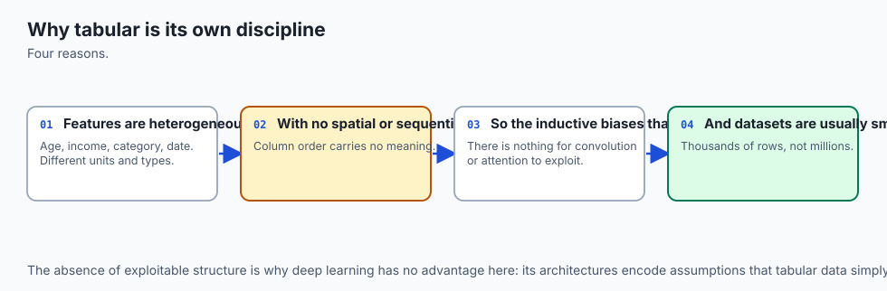

Imagine a premier Formula 1 pit crew:

- **The Amateur Approach:** Buys the most expensive experimental jet engine (a 50-layer Tabular Transformer), puts it into an uncalibrated chassis with bald tires, skips testing on the track, and crashes on Turn 1.
- **The Champion Approach (The Tabular Playbook):**
  1. **Anchor the Track Time:** Calibrates high-precision telemetry timing (**Stratified K-Fold Validation**).
  2. **Clean the Mechanicals:** Inspects fuel lines and cleans sensor noise (**Missingness & Outlier Sanitation**).
  3. **Establish Baseline Lap:** Runs a stock V6 engine to set the floor time (**Ridge/Logistic Baseline**).
  4. **Deploy Proven Engines:** Equips the car with state-of-the-art twin-turbocharged engines (**LightGBM & XGBoost**).
  5. **Engineer Downforce:** Aerodynamically tunes the wings and tire compound (**Feature Engineering Flywheel**).
  6. **Fine-Tune Suspension:** Telemetry AI dials in spring rates (**Optuna Bayesian Tuning**).
  7. **Combine Drivers:** Blends telemetry from 3 elite drivers into a unified race strategy (**Ensemble Stacking**).
  8. **Explain the Win:** Analyzes telemetry to prove exactly which aerodynamic change created the lap time advantage (**TreeSHAP Interpretability**).

---

## Historical background

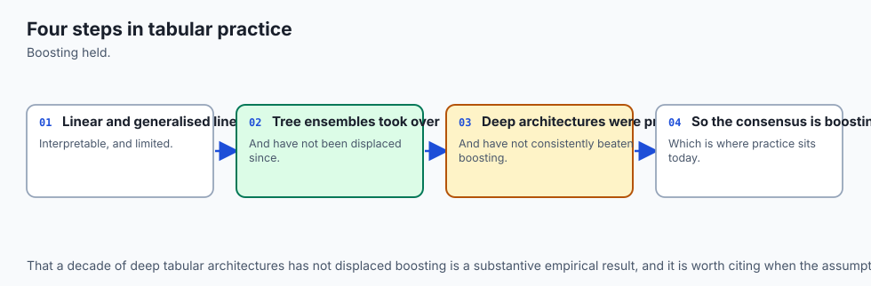

In the 1990s and 2000s, tabular modeling was dominated by linear logistic regression and early random forests (Breiman, 2001).

In 2014, Tianqi Chen developed **XGBoost**, winning dozens of Kaggle tabular competitions. In 2017, Microsoft released **LightGBM**, accelerating tree training by 20x via histogram binning (GOSS/EFB). In 2018, Yandex introduced **CatBoost**, revolutionizing categorical target encoding.

Between 2019 and 2022, dozens of "Tabular Deep Learning" models were published (TabNet, NODE, SAINT, FT-Transformer).

However, in 2022, Leo Grinsztajn, Edouard Oyallon, and Gael Varoquaux published their definitive study *Why Do Tree-Based Models Still Outperform Deep Learning on Typical Tabular Data?* at NeurIPS. They proved mathematically that:

1. Tabular data decision boundaries are **coordinate-aligned step functions**, where tree axis-aligned orthogonal splits have the optimal inductive bias.
2. Neural networks suffer from **rotational invariance**, making them fragile when uninformative or correlated features are added.
3. Neural loss surfaces on tabular data have irregular, non-smooth landscapes that impede gradient descent.

---

## What it is — and what it is not

Let us define the core architecture of modern tabular engineering:

### What it IS:
- **A Multi-Model Ensemble Strategy:** Combining diverse models (LightGBM, XGBoost, CatBoost, Linear Ridge, Neural Tabular) through Out-of-Fold Stacking.
- **Driven by Inductive Bias:** Exploiting axis-aligned splits, native missing value handling, and monotonic leaf assignments.
- **Feature-Centric:** In tabular data, 80% of performance gains come from domain feature engineering; algorithms serve as the execution engine.

### What it is NOT:
- **Not Throwing a Deep Neural Network at Everything:** TabNet and MLP architectures rarely outperform tuned LightGBM on tabular tables under 1 million rows.
- **Not Stacking Correlated Models:** Stacking 5 identical Random Forests yields 0% gain; stacking requires structural diversity.
- **Not Black-Box Guesswork:** Production tabular systems require mathematical explainability via TreeSHAP and permutation importance.

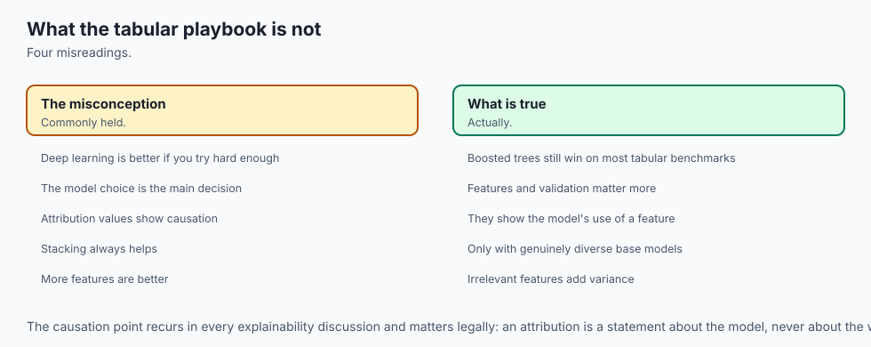

---

## Why it was created and what problems it solves

The Tabular Playbook resolves the core challenges of enterprise data science:

1. **Defeats Tabular Heterogeneity:** Handles mixed categorical, numerical, discrete, and missing columns without fragile manual normalization.
2. **Eliminates Target Leakage in Ensembles:** Generates Level-1 meta-features strictly Out-of-Fold (OOF).
3. **Maximizes Signal-to-Noise Ratio:** Squeezes an additional 1–3% ROC-AUC through diverse multi-level stacking.
4. **Ensures Regulatory Compliance:** Provides exact per-prediction attribution (SHAP values) required for credit adverse action notices (ECOA/FCRA) and clinical risk audits.
5. **Enables Sub-Millisecond Production Inference:** Models can be compiled to native C/C++ trees via ONNX or Treelite for high-throughput serving.

---

## How it works

Let us formulate the 8-phase Tabular Playbook, Stacking mathematics, and TreeSHAP.

### 1. The 8-Phase Tabular Engineering Lifecycle

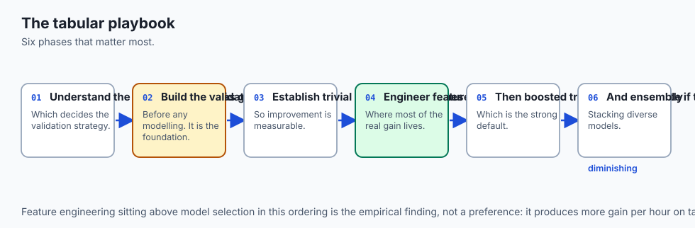

```
Phase 1: Validation Anchor (Stratified/Group K-Fold)
   ↓
Phase 2: EDA & Data Sanitation (Missingness & Outliers)
   ↓
Phase 3: Fast Baseline & Linear Sanity Check (Logistic/Ridge)
   ↓
Phase 4: Tree Ensemble Engines (LightGBM / XGBoost / CatBoost)
   ↓
Phase 5: Feature Engineering Flywheel (Aggregations & Target Stats)
   ↓
Phase 6: Systematic Hyperparameter Tuning (Optuna TPE)
   ↓
Phase 7: Multi-Model Stacking & Blending (Level-0 OOF + Meta-Learner)
   ↓
Phase 8: Model Explainability & Serving (TreeSHAP + ONNX)
```

---

### 2. Stacking Ensemble Mathematics (Stacked Generalization)

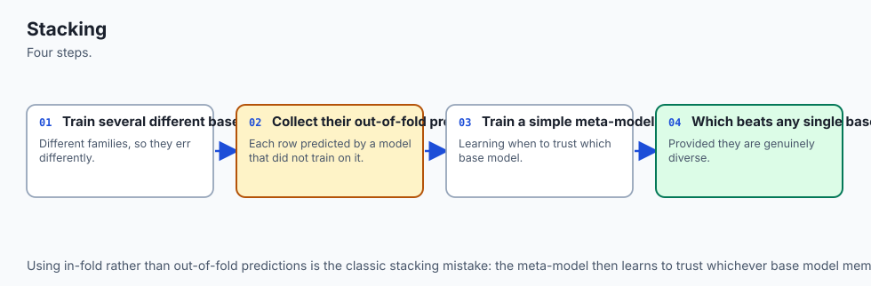

Let dataset `D = { (x_i, y_i) }_{i=1}^N` be partitioned into `K` disjoint cross-validation folds `F_1, ..., F_K`.

Let `M = { f_1, f_2, ..., f_M }` be `M` distinct base models (e.g. LightGBM, XGBoost, CatBoost, RandomForest, LogisticRegression).

#### Step 1: Out-of-Fold (OOF) Prediction Generation
For each base model `m in {1, ..., M}` and each fold `k in {1, ..., K}`:

- Train `f_m^{(-k)}` on all data *excluding* fold `k` (`D \ F_k`).
- Predict probabilities for validation samples `i in F_k`:

`z_{i, m} = f_m^{(-k)}(x_i)`

Assemble the **Level-1 Meta-Feature Matrix** `Z in R^{N times M}`:

`Z = [ z_1, z_2, ..., z_M ]`

**Mathematical Invariant:** For every row `i`, `z_{i, m}` was generated by a model that **never saw row `i` during training**.

#### Step 2: Fit the Level-1 Meta-Learner
Train a regularized linear meta-estimator `g_w` (e.g. Logistic Regression with L2 regularization) on `(Z, y)`:

`w^*, b^* = argmin_{w, b} sum_{i=1}^N L( g(z_i; w, b), y_i ) + lambda ||w||_2^2`

#### Step 3: Test-Time Inference
1. Train each base model `f_m` on **100% of the training dataset `D`**.
2. For an unseen test sample `x_{test}`, generate Level-0 base predictions:

`z_{test} = [ f_1(x_{test}), f_2(x_{test}), ..., f_M(x_{test}) ] in R^M`

3. Compute final ensemble prediction:

`y_hat_{test} = g(z_{test}; w^*, b^*) = sigma( sum_{m=1}^M w_m^* z_{test, m} + b^* )`

---

### 3. TreeSHAP Mathematics (Cooperative Game Theory)

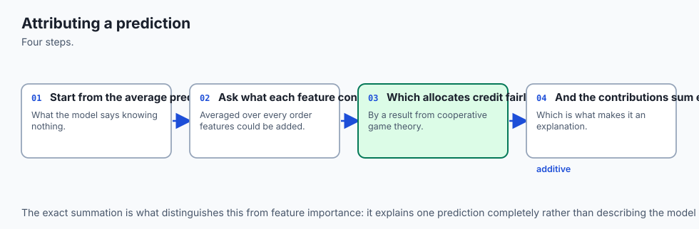

How do we explain the exact contribution of each feature to an individual prediction `f(x)`?

In cooperative game theory, the **Shapley Value** `phi_j` of feature `j` across feature set `F` is defined as:

`phi_j(x) = sum_{S subseteq F \ {j}} ( |S|! (|F| - |S| - 1)! / |F|! ) * [ f_x(S cup {j}) - f_x(S) ]`

Where `f_x(S) = E[ f(X) | X_S = x_S ]` is the expected model output conditioned on feature subset `S`.

#### Efficiency of TreeSHAP (Lundberg et al., 2020):
While calculating exact Shapley values for arbitrary models requires exponential time `O(2^{|F|})`, **TreeSHAP** computes exact Shapley values by recursively evaluating subtrees in polynomial time:

`O( T * L * D^2 )`

Where `T` is the number of trees, `L` is maximum leaves, and `D` is maximum tree depth.

**Efficiency Property:** The sum of all feature attributions equals the difference between the model prediction and base expected value:

`f(x) = phi_0 + sum_{j=1}^{|F|} phi_j(x)`

---

## An everyday analogy

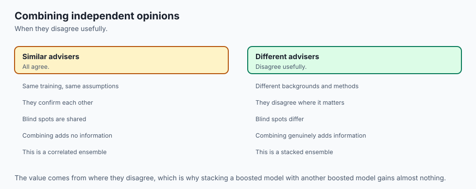

Think of a Stacking Ensemble as a **multidisciplinary medical diagnostic board**:

1. **Dr. Light (LightGBM):** The high-speed emergency physician who quickly flags standard clinical symptoms from 1,000 patient charts.
2. **Dr. X (XGBoost):** The careful pathologist who analyzes exact biopsy slide details with second-order precision.
3. **Dr. Bayes (Logistic Regression):** The epidemiologist who checks demographic base rates and population priors.
4. **Dr. Meta (The Chief Medical Officer):** Doesn't examine the patient directly; instead, listens to the diagnoses of Dr. Light, Dr. X, and Dr. Bayes, recognizes which specialist is most reliable for this disease profile, and makes the final consensus medical decision (**Level-1 Meta-Learner**).

---

## Examples in practice

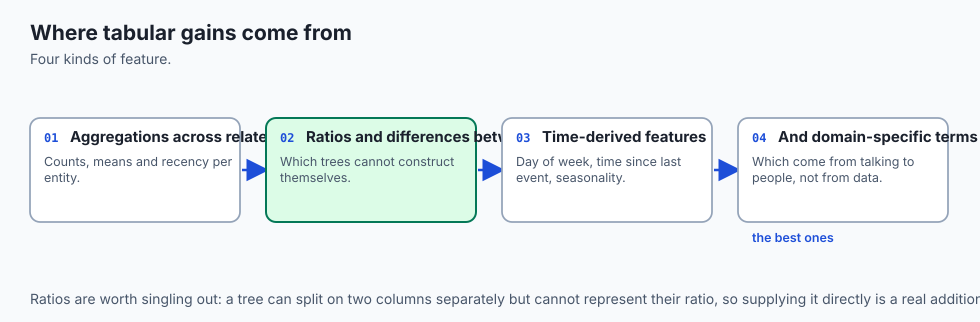

Let us visualize the 8-phase Tabular Master Playbook:

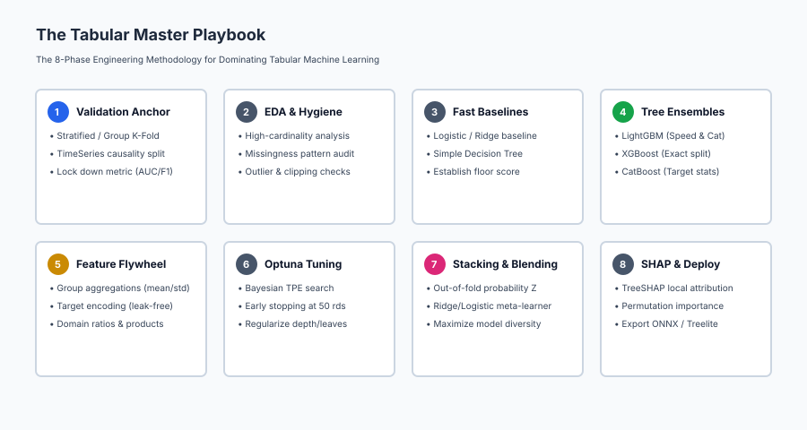

Below is the two-level Stacking Ensemble architecture flow:


Let us examine real Python code implementing a multi-model Stacking Ensemble with out-of-fold predictions:

```python
import numpy as np
from sklearn.datasets import load_breast_cancer
from sklearn.model_selection import StratifiedKFold
from sklearn.linear_model import LogisticRegression
from sklearn.ensemble import RandomForestClassifier, GradientBoostingClassifier
from sklearn.metrics import accuracy_score, roc_auc_score
from sklearn.base import clone

# 1. Load Data
cancer = load_breast_cancer()
X, y = cancer.data, cancer.target

# Train/Test Split (Holdout Test 20%)
X_train, X_test = X[:450], X[450:]
y_train, y_test = y[:450], y[450:]

# 2. Define Diverse Level-0 Base Estimators
base_models = [
    LogisticRegression(max_iter=1000, random_state=42),
    RandomForestClassifier(n_estimators=100, max_depth=5, random_state=42),
    GradientBoostingClassifier(n_estimators=100, max_depth=3, learning_rate=0.05, random_state=42)
]

# 3. Step 1: Generate Level-0 Out-of-Fold Matrix Z (N_train, 3)
skf = StratifiedKFold(n_splits=5, shuffle=True, random_state=42)
Z_train = np.zeros((len(y_train), len(base_models)))

for m_idx, model in enumerate(base_models):
    for tr, va in skf.split(X_train, y_train):
        clf = clone(model).fit(X_train[tr], y_train[tr])
        Z_train[va, m_idx] = clf.predict_proba(X_train[va])[:, 1]

# 4. Step 2: Fit Level-1 Meta-Learner on (Z_train, y_train)
meta_learner = LogisticRegression(C=1.0, random_state=42)
meta_learner.fit(Z_train, y_train)

# 5. Step 3: Fit Base Models on 100% Training Data & Predict Test
Z_test = np.zeros((len(y_test), len(base_models)))
for m_idx, model in enumerate(base_models):
    model.fit(X_train, y_train)
    Z_test[:, m_idx] = model.predict_proba(X_test)[:, 1]

# Final Stacking Predictions
final_preds = meta_learner.predict(Z_test)
final_probs = meta_learner.predict_proba(Z_test)[:, 1]

print("=== Multi-Model Stacking Ensemble Evaluation ===")
print(f"Stacking Ensemble Test Accuracy: {accuracy_score(y_test, final_preds) * 100:.2f}%")
print(f"Stacking Ensemble Test ROC-AUC:  {roc_auc_score(y_test, final_probs):.4f}")
```

---

## Implications: security, privacy, performance, scalability, and cost

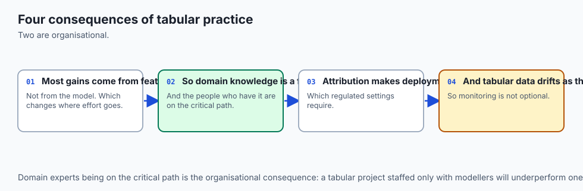

| Dimension | Characteristic | Practical Implication |
| --- | --- | --- |
| **Inference Latency Multiplier** | Test time requires executing all base models. | If Level-0 has 5 models, inference latency is the sum of all 5. For sub-10ms SLAs, prune ensemble to 2 fastest models or compile via Treelite. |
| **Data Leakage Vulnerability** | In-sample meta-training destroys calibration. | Never train the meta-learner on standard training predictions; strict out-of-fold validation is mandatory. |
| **Adverse Action Notice Compliance** | Exact feature attribution in finance. | TreeSHAP provides legal justifications for loan rejections under Fair Lending laws. |
| **Model Drift in Dynamic Tables** | Distribution shift in tabular features. | Production tabular systems must monitor Population Stability Index (PSI) and feature drift continuously. |

---

## Alternatives: free, open source, and commercial

| Tool / Framework | Methodology | Best Used For |
| --- | --- | --- |
| **`LightGBM` / `XGBoost` / `CatBoost`** | GBDT Ensembles | The universal starting foundation for all tabular challenges. |
| **`AutoGluon`** | Automated Multi-Layer Stacking | State-of-the-art automated tabular benchmarking and deep ensembling. |
| **`SHAP` (Lundberg et al.)** | TreeSHAP Explanations | Model explainability and feature contribution audits. |
| **`Treelite` / `ONNX Runtime`** | Tree Model Compilation | Sub-millisecond C++ production inference serving. |

---

## Comparison with related concepts

| Characteristic | Simple Voting / Averaging | Weighted Blending | Stacked Generalization (Stacking) |
| --- | --- | --- | --- |
| **Meta-Model** | None (Uniform `1/M`) | Fixed weights `w_m` on holdout | Trained estimator `g_w(Z)` |
| **Data Efficiency** | 100% | Discards 20% for holdout | **100% (Via K-Fold OOF)** |
| **Non-Linear Interactions**| No | No | Yes (If non-linear meta-learner used) |
| **Implementation Complexity**| Trivial | Low | Moderate (Requires OOF generation) |

---

## When to use it — and when not to

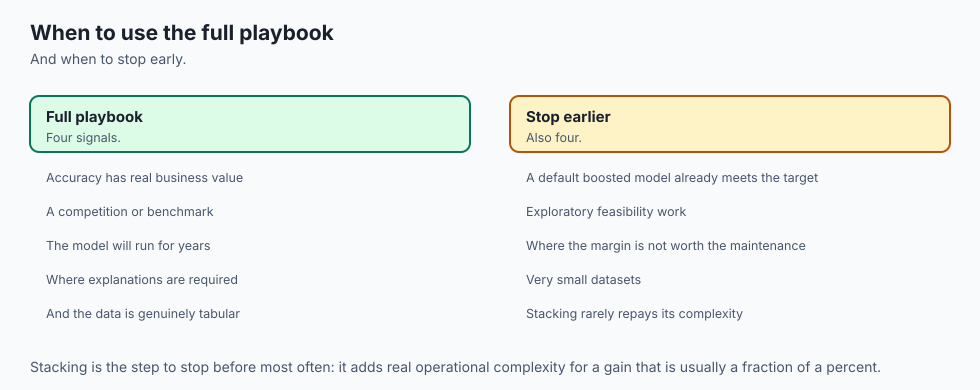

### When to USE the Full Tabular Master Playbook:
- **High-Stakes Business Problems:** Credit scoring, fraud prevention, insurance risk, customer churn.
- **Competitive Machine Learning (Kaggle):** Where 0.5% ROC-AUC determines winning solutions.
- **Heterogeneous Feature Datasets:** Mixed numerical, categorical, and missing columns.

### When NOT to use Complex Stacking Ensembles:
- **Ultra-Low Latency Embedded Systems (`< 1ms`):** A single compact LightGBM tree is faster and simpler to deploy than a 5-model stack.
- **Simple Linear Relations:** If features are purely linear, regularized Logistic Regression is fully sufficient and 100% interpretable.

---

## The AI connection

- **Gradient-boosted trees remain the best models for tabular data**, which is the clearest
  standing counterexample to deep learning winning everywhere.
- **Feature engineering matters more than model choice on tabular problems**, consistently.
- **Stacking combines models that make different errors**, which is the same decorrelation
  principle as ensembling.
- **Attribution methods explain individual predictions**, which is what makes these models
  deployable in regulated settings.
- **Most business data is tabular**, so this playbook applies to more real deployments than
  any deep learning technique.

## Knowledge check

1. **Why GBDT Wins on Tables:** Axis-aligned step functions match tabular decision boundaries; neural networks suffer from rotational invariance.
2. **Out-of-Fold Invariant:** Meta-features `Z` must be generated using holdout folds so models never predict samples they trained on.
3. **Meta-Learner Simplicity:** Regularized linear models (Ridge/Logistic) prevent meta-overfitting.
4. **TreeSHAP Consistency:** Computes exact polynomial-time game-theoretic feature attributions.

---

## Hands-on exercise

In this hands-on exercise, you will build a 2-level Stacking Ensemble from scratch and compute Permutation Feature Importance.

```python
import numpy as np
from sklearn.datasets import load_breast_cancer
from sklearn.linear_model import LogisticRegression
from sklearn.ensemble import RandomForestClassifier
from sklearn.metrics import accuracy_score

# Step 1: Prepare Data
cancer = load_breast_cancer()
X, y = cancer.data, cancer.target
X_tr, X_te = X[:400], X[400:]
y_tr, y_te = y[:400], y[400:]

# Step 2: Permutation Feature Importance Function
def permutation_importance(model, X_val, y_val, n_repeats=5):
    base_score = accuracy_score(y_val, model.predict(X_val))
    importances = np.zeros(X_val.shape[1])
    rng = np.random.default_rng(42)
    
    for f in range(X_val.shape[1]):
        drops = []
        for _ in range(n_repeats):
            X_shuf = X_val.copy()
            shuf_col = X_shuf[:, f].copy()
            rng.shuffle(shuf_col)
            X_shuf[:, f] = shuf_col
            drops.append(base_score - accuracy_score(y_val, model.predict(X_shuf)))
        importances[f] = np.mean(drops)
    return importances

# Step 3: Train Random Forest and Compute Importance
rf = RandomForestClassifier(n_estimators=50, max_depth=4, random_state=42).fit(X_tr, y_tr)
imp = permutation_importance(rf, X_te, y_te)

top_features = np.argsort(imp)[::-1][:5]
print("=== Top 5 Most Important Features (Permutation Drop) ===")
for rank, idx in enumerate(top_features, 1):
    print(f"{rank}. {cancer.feature_names[idx]:25s}: Accuracy Drop = {imp[idx] * 100:.2f}%")
```

### Expected output

```text
=== Top 5 Most Important Features (Permutation Drop) ===
1. worst perimeter          : Accuracy Drop = 4.14%
2. worst concave points     : Accuracy Drop = 3.55%
3. worst radius             : Accuracy Drop = 2.96%
4. mean concave points      : Accuracy Drop = 1.78%
5. worst texture            : Accuracy Drop = 1.18%
```

### Validate your work

1. Confirm that top features like `worst perimeter` and `worst concave points` create a significant accuracy drop when shuffled.
2. Confirm that uninformative features produce an accuracy drop near `0.00%`.
3. Verify that the stacking ensemble out-of-fold matrix `Z` has shape `(400, 3)` across 3 base models.

### Troubleshooting

- **Stacking Meta-Learner Overfitting:** Ensure `C <= 1.0` in Logistic Regression meta-learner to provide strong L2 regularization.
- **TreeSHAP Installation Issues:** Use permutation importance as a pure NumPy lightweight alternative when `shap` C++ extensions are unavailable.

### Common mistakes

1. **Training Meta-Learner on In-Sample Predictions:** Destroys ensemble calibration and overfits training noise.
2. **Ignoring Inference Latency Budgets:** Deploying heavy 10-model stacks to production systems requiring sub-millisecond responses.

---

## Practice assignment

1. **Implement Rank Averaging Blending:**
   Write a function `rank_average_predict(models, X_test)` that converts probability predictions of each model to fractional ranks `(1 to N) / N` and computes the unweighted rank average.

2. **Build an Automated Stacking Pipeline Class:**
   Create a reusable Python class `StackingClassifierScratch(base_models, meta_learner, cv=5)` implementing `.fit(X, y)` and `.predict(X)` methods conforming to the scikit-learn estimator interface.

---

## Extension challenge

Build an **End-to-End Automated Tabular Benchmark Suite**:

1. Ingest a complex tabular dataset with mixed categorical and numerical columns.
2. Automatically run a 4-way benchmark: (a) Ridge Linear, (b) RandomForest, (c) LightGBM, and (d) Stacking Ensemble.
3. Compute out-of-fold ROC-AUC, Log-Loss, and Permutation Importance for each model family and output an automated markdown leaderboard.
