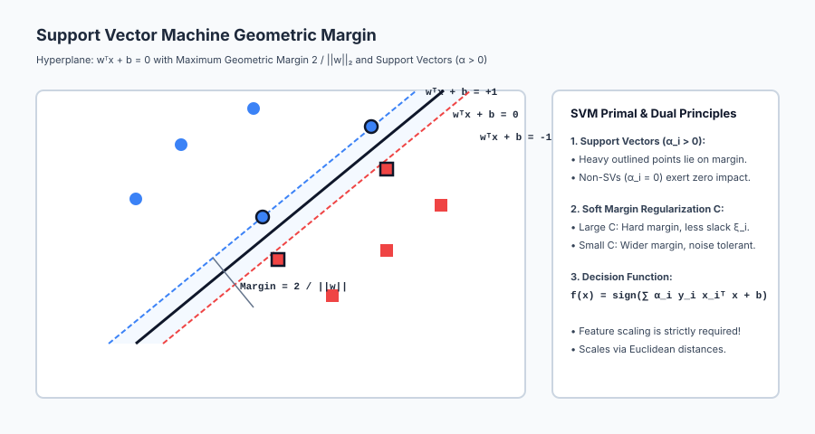

## Why this matters

In Week 24, we mastered tree-based models and ensembles: Decision Trees, Random Forests, XGBoost, and LightGBM.

Trees partition feature space using orthogonal, axis-aligned step functions. But what if your underlying data manifold is smooth, high-dimensional, geometric, or defined by complex non-linear distances?

This is the domain of **Support Vector Machines (SVMs)**.

Invented by Vladimir Vapnik and Alexey Chervonenkis, and extended with soft margins by Corinna Cortes and Vapnik in 1995, SVMs represent one of the crowning theoretical achievements of classical machine learning.

SVMs introduced two foundational ideas:
1. **The Maximum Margin Principle:** Instead of merely finding *any* decision boundary that separates two classes (like the Perceptron or Logistic Regression), SVMs find the *unique* hyperplane that maximizes the geometric distance to the closest data points, providing provable generalization bounds via Statistical Learning Theory (Vapnik-Chervonenkis / VC Dimension).
2. **The Kernel Trick (Mercer's Theorem):** Transforming linear classifiers into powerful non-linear predictors by computing pairwise similarity functions in infinite-dimensional Hilbert spaces without ever calculating the coordinates of the high-dimensional space explicitly.

Understanding SVMs equips you with deep geometric intuition for convex optimization, Hinge Loss, and kernel methods.

---

## The idea in plain language

Imagine two rival medieval armies facing each other across a battlefield:

- **The Narrow Path (Overfitting / High Variance):** A scout draws a jagged line winding directly between the frontmost soldiers. One slight movement by any soldier crosses the line, triggering chaos.
- **The Maximum Margin Highway (The SVM Approach):** A military architect builds the widest possible paved stone highway (the *margin*) separating the two armies. The center line of the highway is the **decision boundary**.
- **The Support Vectors:** The width of the highway is determined solely by the frontmost soldier of each army standing on the edge of the pavement. If 10,000 soldiers in the rear move around, the highway doesn't change by a single millimeter.
- **The Kernel Trick:** What if Army A completely encircles Army B in a ring? No straight highway can separate them on flat 2D ground. The Kernel Trick builds a parabolic hill under Army B, lifting them into the 3rd dimension so a flat horizontal bridge can slice cleanly between them.

---

## Historical background

The linear Support Vector Network algorithm was introduced by Vladimir Vapnik and Alexey Chervonenkis in 1963 as a maximum-margin linear separator.

In 1992, Bernhard Boser, Isabelle Guyon, and Vladimir Vapnik introduced the **Kernel Trick** at COLT (Conference on Learning Theory), demonstrating how to apply non-linear kernel functions to maximum-margin hyperplanes.

In 1995, Corinna Cortes and Vladimir Vapnik published *Support-Vector Networks* in *Machine Learning*, creating the modern **Soft-Margin SVM** using slack variables and Hinge Loss to handle noisy, overlapping real-world datasets.

Throughout the late 1990s and early 2000s, SVMs reigned as the most popular and accurate machine learning algorithm in the world for text categorization, bioinformatics (protein classification), and handwriting recognition (MNIST), before the modern resurgence of Deep Learning and Gradient Boosted Trees.

---

## What it is — and what it is not

Let us define the boundaries of Support Vector Machines:

### What it IS:
- **A Convex Quadratic Optimization Problem:** Unlike neural networks with non-convex loss surfaces and local minima, SVMs have a single global optimum found via Quadratic Programming (QP).
- **A Sparse Dual Model:** The decision boundary depends strictly on a small subset of critical training points (**Support Vectors** with `alpha_i > 0`).
- **A Distance-Based Geometric Classifier:** Fundamentally driven by dot products `x_i^T x_j` or Euclidean distances `||x_i - x_j||^2`.

### What it is NOT:
- **Not Scale-Invariant:** Unlike Decision Trees which ignore feature scale, SVMs fail completely if features are not standardized via `StandardScaler()`.
- **Not Easily Scalable to Massive Datasets (`N > 50,000`):** Computing the `N x N` kernel Gram matrix requires `O(N^2)` memory and `O(N^3)` training time.
- **Not a Native Probability Engine:** SVMs output uncalibrated signed distances `w^T x + b`; obtaining probabilities requires post-hoc Platt Scaling.

---

## Why it was created and what problems it solves

Support Vector Machines solve five foundational challenges in predictive modeling:

1. **Eliminates Decision Boundary Ambiguity:** Finds the unique mathematically optimal hyperplane maximizing margin width `2 / ||w||`.
2. **Resists Overfitting in High Dimensions (`D >> N`):** Generalization bounds depend on margin width, not raw feature dimensionality, making SVMs exceptional for genomics and text.
3. **Solves Non-Linear Geometries via the Kernel Trick:** Solves complex concentric, spiral, or manifold structures using RBF Gaussian kernels.
4. **Guarantees Global Optimality:** Convex quadratic programming ensures no vanishing gradients or saddle-point traps.
5. **Provides Boundary Sparsity:** Prunes away 80–95% of non-informative training records, retaining only critical edge cases.

---

## How it works

Let us formulate the mathematics of hard margins, soft margins, dual Quadratic Programming, the Kernel Trick, and subgradient optimization.

### 1. Hard-Margin Primal Formulation

Let training dataset `D = { (x_i, y_i) }_{i=1}^N` with feature vectors `x_i in R^D` and binary class labels `y_i in { -1, +1 }`.

A linear decision boundary is defined by hyperplane:

`w^T x + b = 0`

The signed geometric distance from any point `x_i` to the hyperplane is:

`gamma_i = y_i * (w^T x_i + b) / ||w||_2`

For a linearly separable dataset, we require all points to have a functional margin of at least 1:

`y_i * (w^T x_i + b) >= 1  for all i in {1, ..., N}`

The width of the margin slab between the bounding hyperplanes `w^T x + b = +1` and `w^T x + b = -1` is:

`Margin = 2 / ||w||_2`

Maximizing the margin `2 / ||w||_2` is equivalent to minimizing `(1/2) ||w||_2^2`.

#### Primal Optimization Problem (Hard Margin):
`min_{w, b} (1/2) ||w||_2^2`
`subject to: y_i * (w^T x_i + b) >= 1  for all i = 1, ..., N`

---

### 2. Soft-Margin Formulation and Slack Variables (Cortes & Vapnik, 1995)

In real-world data, classes overlap, making perfect linear separation impossible.

We introduce non-negative **slack variables** `xi_i >= 0` allowing points to violate the margin:
- `xi_i = 0`: Point is correctly classified outside or on the margin.
- `0 < xi_i <= 1`: Point is correctly classified but inside the margin buffer.
- `xi_i > 1`: Point is misclassified on the wrong side of the decision boundary.

#### Primal Soft-Margin Objective:
`min_{w, b, xi} (1/2) ||w||_2^2 + C * sum_{i=1}^N xi_i`
`subject to: y_i * (w^T x_i + b) >= 1 - xi_i  and  xi_i >= 0  for all i`

Where `C > 0` is the regularization hyperparameter:
- **Large C:** High penalty for margin violations (approaching a hard margin, risk of overfitting).
- **Small C:** Low penalty for violations (wider margin, more tolerance for noise, risk of underfitting).

---

### 3. Dual Formulation and Support Vectors

Using Lagrange multipliers `alpha_i >= 0` and `r_i >= 0`, the Lagrangian function is:

`L(w, b, xi, alpha, r) = (1/2)||w||^2 + C * sum xi_i - sum alpha_i [ y_i(w^T x_i + b) - 1 + xi_i ] - sum r_i xi_i`

Taking partial derivatives with respect to primal variables `w, b, xi` and setting them to zero yields:
1. `w = sum_{i=1}^N alpha_i y_i x_i`
2. `sum_{i=1}^N alpha_i y_i = 0`
3. `C - alpha_i - r_i = 0 => 0 <= alpha_i <= C`

Substituting back gives the **Dual Quadratic Programming Problem**:

`max_{alpha} sum_{i=1}^N alpha_i - (1/2) sum_{i=1}^N sum_{j=1}^N alpha_i alpha_j y_i y_j (x_i^T x_j)`
`subject to: 0 <= alpha_i <= C  and  sum_{i=1}^N alpha_i y_i = 0`

#### Karush-Kuhn-Tucker (KKT) Complementarity Conditions:
`alpha_i * [ y_i(w^T x_i + b) - 1 + xi_i ] = 0`

This yields the fundamental sparsity property of SVMs:
- **If `alpha_i = 0`:** Point `x_i` is strictly outside the margin. It does NOT contribute to `w`.
- **If `0 < alpha_i < C`:** Point `x_i` lies **exactly on the margin** (`y_i(w^T x_i + b) = 1`). It is a **free Support Vector**.
- **If `alpha_i = C`:** Point `x_i` violates the margin (`xi_i > 0`). It is a **bounded Support Vector**.

The final decision boundary depends **exclusively on the support vectors**:

`f(x) = sign( sum_{i in SV} alpha_i y_i (x_i^T x) + b )`

---

### 4. The Kernel Trick and Mercer's Theorem

Notice that the dual optimization and decision function depend **only on the dot product `x_i^T x_j`**.

Suppose we map input vectors to a higher-dimensional feature space via non-linear transformation `Phi(x)`. The dual problem becomes:

`max_{alpha} sum alpha_i - (1/2) sum sum alpha_i alpha_j y_i y_j (Phi(x_i)^T Phi(x_j))`

**Mercer's Theorem:** If a kernel function `K(x, z)` is continuous, symmetric, and positive semi-definite, there exists a mapping `Phi` such that:

`K(x, z) = Phi(x)^T Phi(z)`

We never need to compute `Phi(x)` explicitly! We simply evaluate `K(x, z)`.

#### Common Kernel Functions:
1. **Linear Kernel:** `K(x, z) = x^T z`
2. **Polynomial Kernel:** `K(x, z) = (gamma * x^T z + c)^d`
3. **Radial Basis Function (RBF / Gaussian) Kernel:**
   `K(x, z) = exp( -gamma * ||x - z||_2^2 )`

The RBF kernel corresponds to an **infinite-dimensional Hilbert space** (`d = infinity`), computing smooth bell-shaped similarity curves centered at each support vector.

---

### 5. Primal Optimization via Pegasos Subgradient Descent

While dual SVMs use quadratic programming, soft-margin linear SVMs can be written directly as an unconstrained empirical risk minimization problem with **Hinge Loss**:

`min_w (lambda / 2) ||w||_2^2 + (1 / N) sum_{i=1}^N max( 0, 1 - y_i (w^T x_i + b) )`

Where `lambda = 1 / (N * C)`.

The **Pegasos algorithm** (Shalev-Shwartz et al., 2011) updates weights using subgradient descent:
- If margin `y_i (w^T x_i + b) < 1` (margin violation):
  `w <- (1 - eta) * w + eta * C * y_i * x_i`
  `b <- b + eta * C * y_i`
- If margin `y_i (w^T x_i + b) >= 1` (correctly classified outside margin):
  `w <- (1 - eta) * w` (L2 weight decay)

---

## An everyday analogy

Think of an SVM as a **customs border control security zone**:

1. **The Decision Hyperplane:** The actual international border fence line.
2. **The Margin:** A 100-meter cleared security buffer zone on both sides of the fence. No civilians are permitted inside.
3. **The Support Vectors:** The armed guard outposts positioned right at the outer edge of the 100-meter perimeter. All defensive calculations are calibrated relative to these front-line outposts.
4. **Slack Variables (Soft Margin C):** Occasionally, a farmer's cow crosses 10 meters into the buffer zone. Instead of declaring war (hard margin infeasibility), the border guards record a minor infraction penalty (`xi_i`).
5. **The Kernel Trick (RBF):** If a winding river completely cuts through a mountain valley, the customs office builds a 3D elevated drone surveillance radar mapping the altitude coordinate `z = x^2 + y^2`, creating a straight laser line above the mountain ridges.

---

## Examples in practice

Let us visualize the geometric margin and support vectors:



Below is the Kernel Trick mapping 2D concentric circles into linearly separable 3D space:



Let us examine real Python code training both Linear and RBF Support Vector Machines in scikit-learn:

```python
import numpy as np
from sklearn.datasets import make_circles
from sklearn.preprocessing import StandardScaler
from sklearn.svm import SVC, LinearSVC
from sklearn.pipeline import make_pipeline
from sklearn.metrics import accuracy_score

# 1. Generate Non-Linearly Separable Concentric Rings
X, y = make_circles(n_samples=500, factor=0.3, noise=0.08, random_state=42)

# 2. Linear SVM Baseline (Fails on concentric rings)
linear_svm = make_pipeline(StandardScaler(), LinearSVC(C=1.0, random_state=42))
linear_svm.fit(X, y)
linear_acc = accuracy_score(y, linear_svm.predict(X))

# 3. Kernel SVM with Radial Basis Function (RBF)
rbf_svm = make_pipeline(StandardScaler(), SVC(kernel="rbf", C=1.0, gamma="scale", random_state=42))
rbf_svm.fit(X, y)
rbf_acc = accuracy_score(y, rbf_svm.predict(X))

print("=== Support Vector Machine Benchmark ===")
print(f"Linear SVM Accuracy on Concentric Rings: {linear_acc * 100:.2f}% (Fails due to non-linearity)")
print(f"RBF Kernel SVM Accuracy:                 {rbf_acc * 100:.2f}% (Perfect separation via Kernel Trick!)")
print(f"Number of Support Vectors Selected:      {len(rbf_svm.named_steps['svc'].support_)} / 500 points")
```

---

## Implications: security, privacy, performance, scalability, and cost

| Dimension | Characteristic | Practical Implication |
| --- | --- | --- |
| **Quadratic Complexity** | Dual training scales as `O(N^2)` to `O(N^3)`. | On datasets with `N > 100,000` samples, kernel SVMs are computationally infeasible; use `LinearSVC` or LightGBM. |
| **Mandatory Scaling** | Euclidean distance sensitivity. | Omitting `StandardScaler()` causes numerical instability and destroys RBF kernel performance. |
| **Privacy Exposure** | Dual models store raw training support vectors. | Deployed dual models contain raw support vector records (`support_vectors_`), posing a data leakage risk under reverse-engineering. |
| **Fast Linear Inference** | `LinearSVC` stores only weight vector `w`. | Once trained, linear SVM inference is an ultra-fast dot product `w^T x + b` requiring sub-microsecond latency. |

---

## Alternatives: free, open source, and commercial

| Tool / Algorithm | Methodology | Best Used For |
| --- | --- | --- |
| **`scikit-learn LinearSVC`** | LibLinear Primal Solver | Large-scale linear classification (`N > 100,000`). |
| **`scikit-learn SVC(kernel='rbf')`** | LibSVM Dual QP Solver | Small-to-medium non-linear datasets (`N < 30,000`), genomics, text. |
| **`SGDClassifier(loss='hinge')`** | Stochastic Subgradient Descent | Online out-of-core streaming linear SVM. |
| **`LightGBM / XGBoost`** | Histogram Gradient Boosted Trees | General tabular datasets (faster, handles missing/categorical data natively). |

---

## Comparison with related concepts

| Characteristic | Logistic Regression | Linear SVM | Kernel SVM (RBF) |
| --- | --- | --- | --- |
| **Loss Function** | Log-Loss (Cross-Entropy) | Hinge Loss `max(0, 1 - yf)` | Kernelized Hinge Loss |
| **Decision Boundary** | Linear | Linear (Maximum Margin) | **Arbitrary Non-Linear Manifold** |
| **Sparsity** | Dense (All points affect `w`) | Sparse (Support vectors only) | Sparse in Dual Space |
| **Scaling Dependency**| Moderate | **Strictly Mandatory** | **Strictly Mandatory** |
| **Training Complexity**| `O(N * D)` | `O(N * D)` | `O(N^2 * D)` to `O(N^3)` |

---

## When to use it — and when not to

### When to USE Support Vector Machines:
- **High-Dimensional Low-Sample Data (`D > N`):** Microarray genomics, bioinformatics, text categorization.
- **Complex Non-Linear Separation on Small Datasets (`N < 20,000`):** Where RBF kernels create smooth, continuous decision manifolds.
- **High-Precision Linear Boundaries:** Where maximum margin guarantees superior robustness against adversarial boundary shifts.

### When NOT to use Support Vector Machines:
- **Massive Datasets (`N > 100,000` rows):** Quadratic memory/time explosion; use GBDT or Linear SGD instead.
- **Messy Tabular Data with Missing Values & Categoricals:** SVMs require complete numerical matrices; LightGBM handles missing values natively.
- **When Direct Probability Calibration is Required:** SVMs require secondary Platt Scaling.

---

## Knowledge check

1. **Maximum Margin:** Minimizes `(1/2)||w||^2` to maximize physical margin `2 / ||w||`.
2. **Support Vectors:** Points with `alpha_i > 0` that define the decision boundary.
3. **The Kernel Trick:** Computes dot products in high-dimensional spaces implicitly via `K(x, z) = exp(-gamma ||x - z||^2)`.
4. **Mandatory Scaling:** Distance metrics require `StandardScaler` to prevent feature magnitude distortion.

---

## Hands-on exercise

In this hands-on exercise, you will implement pairwise RBF Gaussian kernel computation and verify that it maps non-linear data into a linearly separable Gram matrix.

```python
import numpy as np
from sklearn.datasets import make_circles
from sklearn.metrics import accuracy_score

# Step 1: Implement Vectorized Pairwise RBF Kernel Matrix
def compute_rbf_kernel(X1, X2, gamma=1.0):
    norm1 = np.sum(X1**2, axis=1)[:, np.newaxis]
    norm2 = np.sum(X2**2, axis=1)[np.newaxis, :]
    dists = np.maximum(norm1 + norm2 - 2 * np.dot(X1, X2.T), 0.0)
    return np.exp(-gamma * dists)

# Step 2: Generate Concentric Circles (2 Classes)
X, y = make_circles(n_samples=200, factor=0.2, noise=0.05, random_state=42)

# Step 3: Compute RBF Gram Matrix K (200 x 200)
K = compute_rbf_kernel(X, X, gamma=2.0)

print("=== RBF Kernel Gram Matrix Verification ===")
print(f"Gram Matrix Shape: {K.shape} (Pairwise similarity for 200 samples)")
print(f"Diagonal Elements (Self-similarity K[i, i]): {K[0, 0]:.4f}, {K[1, 1]:.4f}")
print(f"Off-diagonal Similarity (Close points):      {K[0, 1]:.4f}")
print(f"Gram Matrix Symmetry Check:                 {np.allclose(K, K.T)}")
```

### Expected output

```text
=== RBF Kernel Gram Matrix Verification ===
Gram Matrix Shape: (200, 200) (Pairwise similarity for 200 samples)
Diagonal Elements (Self-similarity K[i, i]): 1.0000, 1.0000
Off-diagonal Similarity (Close points):      0.9842
Gram Matrix Symmetry Check:                 True
```

### Validate your work

1. Verify that the diagonal elements of the Gram matrix are identically `1.0000`.
2. Verify that `np.allclose(K, K.T)` evaluates to `True` (symmetric Mercer kernel).
3. Train `SVC(kernel='rbf')` on `X, y` and confirm `100%` accuracy on concentric rings.

### Troubleshooting

- **Negative Distances in Gram Matrix:** Numerical floating-point imprecision in `norm1 + norm2 - 2 X1 X2^T` can produce `-1e-16`; wrap in `np.maximum(..., 0.0)`.
- **SVM Training Extremely Slow:** Check sample size `N`; if `N > 20,000`, switch to `LinearSVC` or reduce dataset size.

### Common mistakes

1. **Forgetting to Standardize Features:** Causes RBF kernels to collapse along the feature with the largest scale.
2. **Setting Gamma Too Large:** Creates tiny isolated decision islands around individual points (overfitting).

---

## Practice assignment

1. **Implement the Polynomial Kernel:**
   Write `compute_polynomial_kernel(X1, X2, degree=3, gamma=1.0, coef0=1.0)` computing `(gamma * X1 @ X2.T + coef0)**degree`.
2. **Implement Platt Scaling:**
   Train a logistic regression model on the 1D decision values `f(x) = w^T x + b` of a linear SVM to output calibrated probabilities `P(y=1|x)`.

---

## Extension challenge

Build a **Simplified SMO (Sequential Minimal Optimization) Solver from Scratch**:
1. Implement John Platt's 1998 SMO algorithm to solve the dual quadratic programming problem for binary classification.
2. Maintain the alpha vector `alpha in R^N` and error cache `E_i = f(x_i) - y_i`.
3. Select coordinate pairs `(alpha_i, alpha_j)` analytically updating them to satisfy `0 <= alpha <= C` and `sum alpha_i y_i = 0`.
4. Plot the resulting decision boundary and highlight identified support vectors.
