## Why this matters

In Weeks 23 and 24, we built linear models, SVMs, and tree ensembles.

Yet raw real-world data never arrives neatly formatted as standardized numbers. A typical enterprise dataset contains:

- `Annual_Income`: Continuous, ranging from $15,000 to $2,500,000 (extreme right-skewed).
- `Age`: Discrete integers from 18 to 95.
- `Credit_Score`: Integers from 300 to 850.
- `Education_Level`: Ordinal categories (`High School < Bachelors < Masters < PhD`).
- `ZipCode`: High-cardinality nominal category with 40,000 unique postal codes.

If you feed these raw columns into a Logistic Regression model or a Support Vector Machine:

1. **Optimization Stalls:** The Hessian matrix condition number explodes, causing gradient descent to oscillate wildly and fail to converge.
2. **Distances Collapse:** Euclidean distances `||x_1 - x_2||` will be dominated 99.99% by `Annual_Income`, rendering `Age` and `Credit_Score` completely invisible.
3. **L2 Regularization Fails:** Penalizing `||w||_2^2` crushes weights on small-magnitude features while ignoring large-scale features.
4. **One-Hot Encoding Blows Up Memory:** One-hot encoding `ZipCode` generates 40,000 sparse columns, exhausting RAM.

Feature scaling and categorical encoding are the **first mathematical filters** in machine learning. Mastering them prevents silent numerical failures and unlocks peak performance across all model families.

---

## The idea in plain language

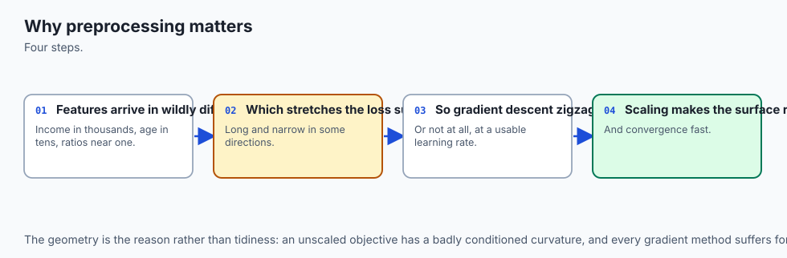

Imagine a fitness competition comparing athletes across three events:

- **Event 1 (Pushups):** Athletes perform 20 to 80 reps.
- **Event 2 (Heart Rate):** Athletes measure 60 to 180 beats per minute.
- **Event 3 (Annual Salary in Cents):** Athletes report 5,000,000 to 50,000,000 cents.

If the judges simply add up the three numbers to determine the winner:

- The winner is decided 100% by who has the highest salary in cents.
- Pushups and heart rate contribute 0.001% of the final score.

**Feature Scaling (StandardScaler)** converts each event into standard deviations above or below the average (Z-scores), giving every event equal weight.

**Categorical Encoding** converts descriptive words (like `"Gold"`, `"Silver"`, `"Bronze"`) into numbers so algorithms can process them without inventing false mathematical relationships.

---

## Historical background

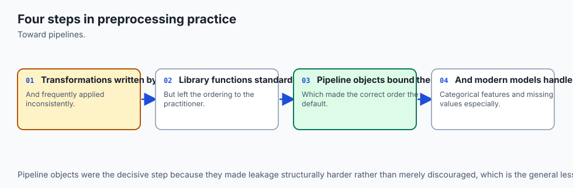

In the early 20th century, Karl Pearson formalized the **Z-score standard deviation normalization** in classical statistics.

In 1964, George Box and David Cox published their seminal work on the **Box-Cox Power Transformation**, enabling non-normal, skewed positive data to be transformed into Gaussian distributions. In 2000, In-Kwon Yeo and Richard Johnson extended power transformations to handle zero and negative values.

In 2001, Daniele Micci-Barreca published *A Preprocessing Scheme for High-Cardinality Categorical Attributes in Classification and Prediction Problems* at ACM SIGKDD. This landmark paper introduced **Empirical Bayesian Smoothed Target Encoding**, solving the curse of dimensionality for categorical variables with thousands of levels.

In 2018, Yandex released **CatBoost**, revolutionizing target encoding with *ordered target statistics* to eliminate temporal prediction shifts.

---

## What it is — and what it is not

Let us define the scope of feature scaling and categorical encoding:

### What it IS:
- **Mathematical Conditioning:** Transforming input distributions so optimization algorithms (gradient descent, QP solvers) operate on isotropic loss surfaces.
- **Dimensionality Management:** Encoding nominal categories into dense or regularized numerical representations without exploding feature space.
- **A Transformer Pipeline Stage:** Preprocessing fitted strictly on training data and applied symmetrically to test data.

### What it is NOT:
- **Not Necessary for Tree Models:** Decision Trees, Random Forests, and LightGBM are completely invariant to monotonic feature scaling; scaling trees does not change splits.
- **Not Safe with Global Target Statistics:** Computing target encodings across the full dataset without cross-validation causes fatal target leakage.
- **Not a Single Formula Fits All:** MinMaxScaler, StandardScaler, and RobustScaler serve fundamentally different data distributions.

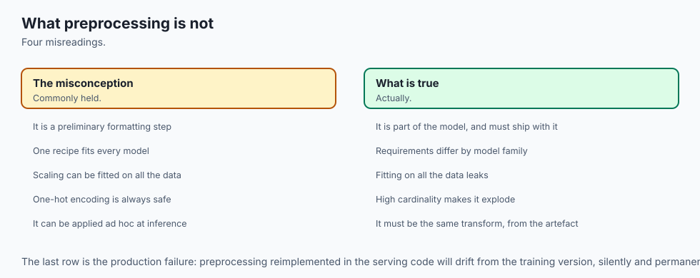

---

## Why it was created and what problems it solves

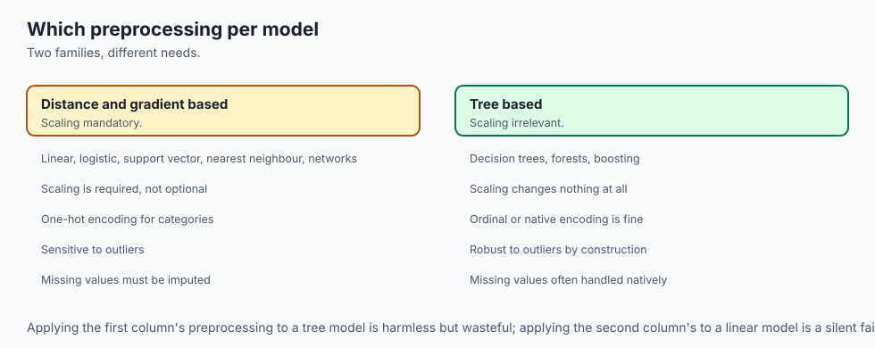

Proper feature scaling and encoding resolves five critical bottlenecks in machine learning:

1. **Optimizes Gradient Descent Condition Numbers:** Restores isotropic circular loss contours, accelerating gradient descent convergence by 10x to 100x.
2. **Balances Distance-Based Algorithms:** Ensures kNN, SVM, K-Means, and PCA give equal geometric importance to all features.
3. **Enforces Fair L1/L2 Regularization:** Prevents regularization penalties from unfairly penalizing features with small physical units.
4. **Tames High-Cardinality Categories:** Replaces 40,000 sparse OHE columns with a single smoothed target-encoded feature.
5. **Normalizes Skewed Heavy Tails:** Power transformations (Yeo-Johnson) reshape skewed financial distributions into well-behaved bell curves.

---

## How it works

Let us formulate the mathematics of feature scaling algorithms and categorical encoding strategies.

### 1. The Condition Number Problem in Gradient Descent

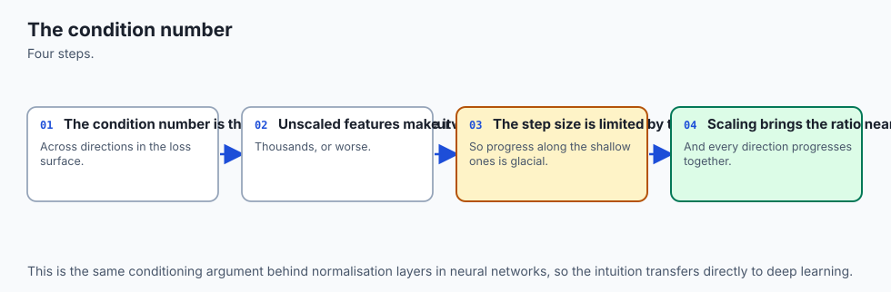

Consider a linear regression model with loss:

`L(w) = (1 / 2) * ||X w - y||_2^2`

The Hessian matrix of second derivatives is `H = X^T X`.

Let `lambda_{max}` and `lambda_{min}` be the maximum and minimum eigenvalues of `H`. The **Condition Number** is:

`kappa = lambda_{max} / lambda_{min}`

- **When features are on similar scales:** `kappa approx 1`. Loss contours are circular; gradient descent steps point directly toward the minimum.
- **When Feature 1 has variance 1 and Feature 2 has variance 1,000,000:** `kappa = 1,000,000`. Loss contours are extremely elongated ellipses. Gradient descent oscillates violently along the steep axis while crawling along the flat axis.

---

### 2. The Numerical Scaling Taxonomy

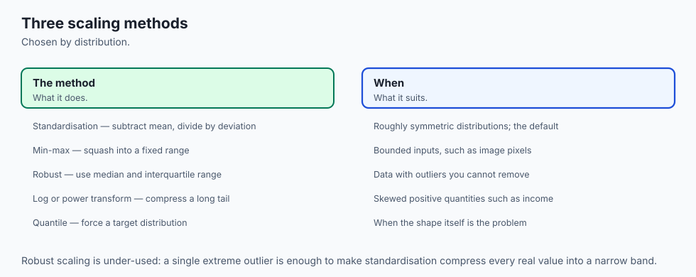

```
┌────────────────────────────────────────────────────────────────────────┐
│                      FEATURE SCALING ALGORITHMS                        │
├────────────────────────────────────────────────────────────────────────┤
│ 1. StandardScaler:   z = (x - mu) / sigma  [Mean=0, Std=1, Gaussian]   │
│ 2. MinMaxScaler:     z = (x - min) / (max - min)  [Bounded in [0, 1]]  │
│ 3. RobustScaler:     z = (x - Median) / IQR  [Outlier-Resilient]       │
│ 4. MaxAbsScaler:     z = x / max(|x|)  [Preserves Zero Sparsity]       │
│ 5. PowerTransformer: Yeo-Johnson non-linear variance stabilization     │
└────────────────────────────────────────────────────────────────────────┘
```

#### A. StandardScaler (Z-Score)
Centers data to mean `0` and unit variance `1`:

`z = (x - mu) / sigma`

Where `mu = (1/N) sum x_i` and `sigma = sqrt( (1/N) sum (x_i - mu)^2 )`.
*Weakness:* Extreme outliers distort `mu` and inflate `sigma`, compressing inliers.

#### B. RobustScaler (Median & IQR)
Uses rank-based robust statistics:

`z = (x - text{Median}(x)) / (Q_{75}(x) - Q_{25}(x))`

Where `IQR = Q_{75} - Q_{25}` is the Interquartile Range.
*Advantage:* 100% resilient against extreme outliers.

---

### 3. Categorical Encoding Taxonomy

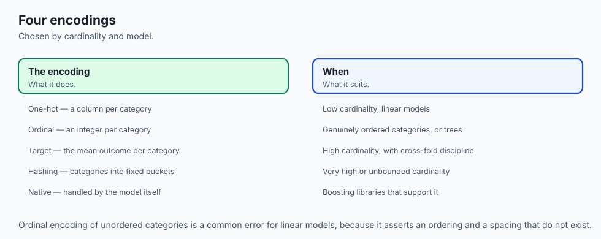

#### A. One-Hot Encoding (OHE)
For a categorical variable with `k` distinct nominal categories `{ c_1, ..., c_k }`:
Maps category `c_j` to binary vector `e_j in {0, 1}^k`.

To prevent linear multicollinearity (the "dummy variable trap"), drop one reference category (`drop='first'`), producing `k - 1` columns.
*Best Used For:* Low-cardinality nominal features (`k <= 10`).

#### B. Ordinal Encoding
Maps ordered categories to integers `0, 1, ..., k - 1`.
*Mandatory Condition:* Must only be used when an intrinsic mathematical ordering exists (`Small < Medium < Large`).

#### C. Out-of-Fold Smoothed Target Encoding (Micci-Barreca, 2001)
For high-cardinality nominal features (e.g. `ZipCode`), replaces category `c` with the regularized target mean.

For category `c` with sample count `n_c` and category target mean `bar{y}_c`:

`S_c = (n_c * bar{y}_c + m * bar{y}_{text{global}}) / (n_c + m)`

Where:

- `bar{y}_{text{global}}` is the global target mean across all training data.
- `m >= 0` is the **smoothing parameter** (Bayesian shrinkage weight).
  - When `n_c >> m`: `S_c approx bar{y}_c` (Trust empirical category mean).
  - When `n_c << m`: `S_c approx bar{y}_{text{global}}` (Shrink to global prior).

**The Leak-Free Out-of-Fold Rule:** To prevent target leakage, `bar{y}_c` and `n_c` for validation fold `k` **must be calculated strictly on the other `K - 1` training folds**.

---

### 4. Scaling and Encoding Rules by Model Family

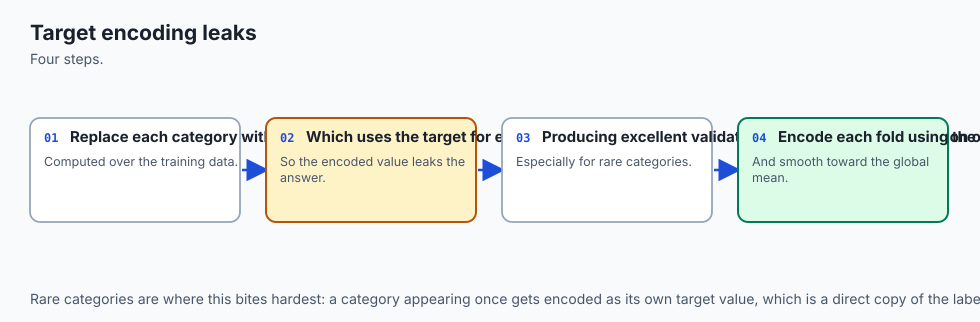

| Model Family | Scaling Requirement | Preferred Encoding | Rationale |
| --- | --- | --- | --- |
| **Linear / Logistic Regression** | **Strictly Mandatory** | One-Hot / Target Encoding | Condition number, isotropic loss, fair L1/L2 penalties. |
| **Support Vector Machines (SVM)** | **Strictly Mandatory** | One-Hot / Target Encoding | Euclidean distance and RBF kernel geometry. |
| **k-Nearest Neighbors (kNN)** | **Strictly Mandatory** | One-Hot Encoding | Euclidean distance metric equality. |
| **Neural Networks (MLP / TabNet)** | **Strictly Mandatory** | Entity Embeddings / Target | Prevents gradient explosion; smooth activation saturation. |
| **Tree Ensembles (GBDT / RF)** | **Not Required (Invariant)** | Target Encoding / Native Bins | Axis-aligned orthogonal splits depend only on rank order. |

---

## An everyday analogy

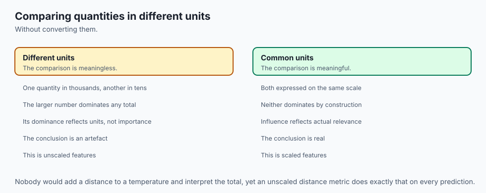

Think of feature scaling and encoding as **translating international currencies and trade goods at a global commodities exchange**:

1. **Unscaled Data (The Chaos):** Trader A bids in Japanese Yen (¥1,000,000), Trader B bids in Kuwaiti Dinar (3 KD), and Trader C bids in Gold Bars. Adding up raw numbers creates total confusion.
2. **StandardScaler (The Standard Currency):** Converts all bids into standardized SDRs (Special Drawing Rights) centered at zero, so every currency has equal purchasing power.
3. **RobustScaler (The Outlier-Protected Bank):** When a billionaire walks in and bids ¥100,000,000,000, the bank centers prices using the median merchant rather than letting the billionaire distort the entire exchange rate.
4. **One-Hot Encoding (The Specific Barcodes):** Labeling distinct goods (Coffee, Oil, Wheat) with distinct binary barcodes.
5. **Target Encoding (The Market Historical Value):** Replaces 40,000 obscure village names with the average historical crop yield of each village, shrinking tiny unknown villages to the national average.

---

## Examples in practice

Let us visualize the distribution impacts of StandardScaler vs MinMaxScaler vs RobustScaler:

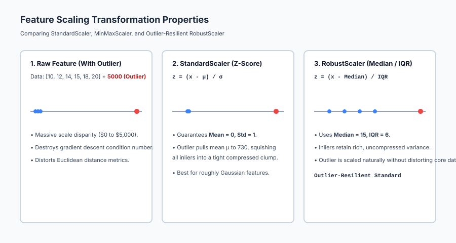

Below is the execution flow of leak-free Out-of-Fold Target Encoding:


Let us examine real Python code demonstrating leak-free Out-of-Fold Target Encoding and StandardScaler:

```python
import numpy as np
from sklearn.model_selection import KFold
from sklearn.preprocessing import StandardScaler
from sklearn.linear_model import Ridge
from sklearn.metrics import mean_squared_error

# 1. Generate Synthetic Data with High-Cardinality Category
rng = np.random.default_rng(42)
n_samples = 600

# Continuous Feature (e.g. Square Footage: 500 to 5000)
sqft = rng.uniform(500, 5000, size=n_samples)

# High-Cardinality Category (e.g. 30 Neighborhoods)
neighborhoods = np.array([f"Neigh_{i % 30}" for i in range(n_samples)])

# Target Price: Base + Neighborhood Effect + SqFt Effect + Noise
neighborhood_effect = {f"Neigh_{i}": i * 10000 for i in range(30)}
target = np.array([50000 + neighborhood_effect[n] + 150 * s + rng.normal(0, 5000) for n, s in zip(neighborhoods, sqft)])

# 2. Out-of-Fold Smoothed Target Encoding Function
def oof_target_encode(cats, y, n_splits=5, smoothing=10.0):
    encoded = np.zeros(len(cats))
    kf = KFold(n_splits=n_splits, shuffle=True, random_state=42)
    for tr, va in kf.split(cats, y):
        cat_tr, y_tr = cats[tr], y[tr]
        glob_mean = np.mean(y_tr)
        u_cats, counts = np.unique(cat_tr, return_counts=True)
        sums = {c: np.sum(y_tr[cat_tr == c]) for c in u_cats}
        counts_dict = dict(zip(u_cats, counts))
        for idx in va:
            c = cats[idx]
            if c in counts_dict:
                n_c = counts_dict[c]
                encoded[idx] = (sums[c] + smoothing * glob_mean) / (n_c + smoothing)
            else:
                encoded[idx] = glob_mean
    return encoded

# 3. Apply Preprocessing
encoded_neigh = oof_target_encode(neighborhoods, target)
X = np.column_stack([sqft, encoded_neigh])

# Standardize features for Ridge Regression
scaler = StandardScaler()
X_scaled = scaler.fit_transform(X)

# 4. Fit Model
model = Ridge(alpha=1.0).fit(X_scaled, target)
preds = model.predict(X_scaled)
print("=== Preprocessing Pipeline Verification ===")
print(f"Standardized Feature Means: {np.round(np.mean(X_scaled, axis=0), 4)}")
print(f"Standardized Feature Stds:  {np.round(np.std(X_scaled, axis=0), 4)}")
print(f"Model Root Mean Squared Error: ${np.sqrt(mean_squared_error(target, preds)):.2f}")
```

---

## Implications: security, privacy, performance, scalability, and cost

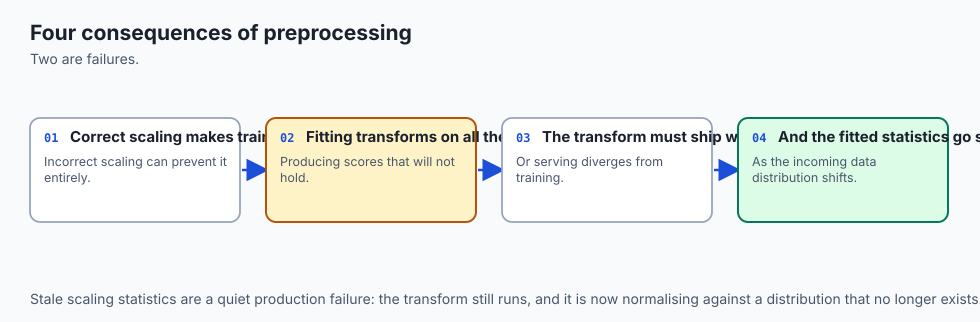

| Dimension | Characteristic | Practical Implication |
| --- | --- | --- |
| **Target Leakage Vulnerability** | In-sample target statistics leak labels. | Never compute target encodings globally before splitting; strict out-of-fold cross-validation is mandatory. |
| **Privacy Inversion Risk** | Rare categories expose individual labels. | If a category has `n_c = 1`, target encoding directly exposes the individual's target value. Apply Bayesian smoothing `m >= 10`. |
| **Memory Footprint Scaling** | High-cardinality OHE memory explosion. | One-hot encoding 100,000 categories creates billions of matrix entries; use Target Encoding or Feature Hashing. |
| **Streaming Production Inference** | Preprocessing parameter persistence. | The production serving engine must load the exact `mean_`, `scale_`, and category lookup tables saved during training. |

---

## Alternatives: free, open source, and commercial

| Scaler / Encoder | Mechanism | Best Used For |
| --- | --- | --- |
| **`StandardScaler`** | Z-score normalization `(x - mu) / sigma` | General Gaussian continuous features. |
| **`RobustScaler`** | Median and IQR scaling | Financial/sensor data contaminated with extreme outliers. |
| **`TargetEncoder` (scikit-learn 1.3+)** | Out-of-fold smoothed category mean | High-cardinality categorical features in tabular models. |
| **`HashingVectorizer` / FeatureHasher** | MurmurHash3 hashing trick | High-cardinality text/categorical streaming data. |

---

## Comparison with related concepts

| Preprocessing Technique | Outlier Resilience | Preserves Sparsity | Output Bound | Primary Use Case |
| --- | --- | --- | --- | --- |
| **StandardScaler** | Low (Outliers distort `mu, sigma`) | No | Unbounded | Gaussian linear/SVM models |
| **MinMaxScaler** | Very Low (Outliers squish range) | No | Strict `[0, 1]` | Neural networks / Images |
| **RobustScaler** | **Ultra-High (Median & IQR)** | No | Unbounded | Outlier-heavy tabular data |
| **MaxAbsScaler** | Low | **Yes (Zeros untouched)** | `[-1, +1]` | Sparse text matrices (TF-IDF) |
| **Target Encoding**| High (With Bayesian smoothing) | N/A | Target scale | High-cardinality nominal categories |

---

## When to use it — and when not to

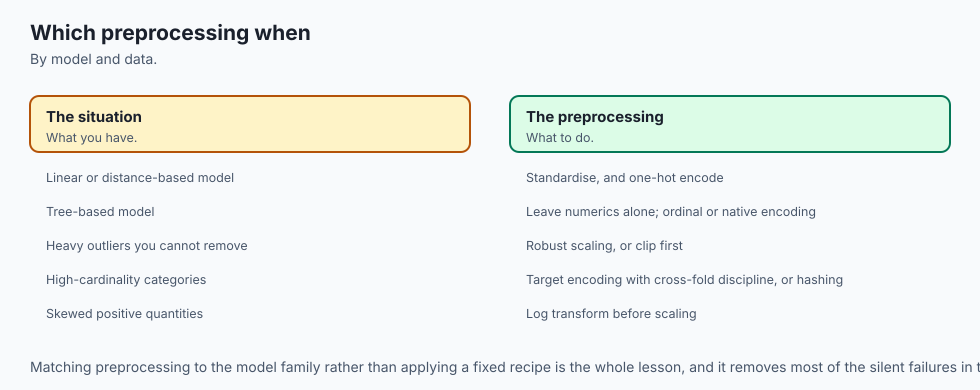

### When to USE Rigorous Scaling and Encoding:
- **Linear Models, Logistic Regression, Ridge, Lasso:** Scaling is strictly required for condition number and L1/L2 regularization fairness.
- **Support Vector Machines and kNN:** Distance metrics require identical feature scales.
- **High-Cardinality Categoricals (`ZipCode`, `Merchant_ID`):** Out-of-Fold Smoothed Target Encoding is the gold standard.

### When NOT to use Heavy Scaling:
- **Pure Tree-Based Ensembles (XGBoost/LightGBM):** Tree splits are rank-invariant; scaling continuous features wastes CPU cycles with zero accuracy gain.
- **Ordered Nominal Categories:** Do not one-hot encode ordered categories; use Ordinal Encoding instead.

---

## The AI connection

- **Preprocessing decides whether a model can learn at all**, and scaling errors are the most
  common silent failure in applied machine learning.
- **Which preprocessing you need depends on the model family**, so there is no universal
  recipe.
- **Categorical encoding is a modelling decision**, not a formatting step — the choice changes
  what the model can represent.
- **Target encoding leaks without cross-fold discipline**, which is a subtle and common error.
- **Preprocessing must be part of the served artefact**, or training and inference silently
  diverge.

## Knowledge check

1. **Condition Number:** Disparate feature scales create elongated elliptical loss contours that slow gradient descent.
2. **RobustScaler:** Uses Median and IQR to scale data without distortion from extreme outliers.
3. **Target Encoding Leakage:** Target encodings must be generated Out-of-Fold across cross-validation splits.
4. **Tree Invariance:** Decision trees are completely invariant to monotonic feature scaling.

---

## Hands-on exercise

In this hands-on exercise, you will implement `StandardScaler` and `RobustScaler` from scratch and compare their behavior on data with extreme outliers.

```python
import numpy as np

# Step 1: Implement StandardScaler and RobustScaler
class StandardScalerScratch:
    def fit_transform(self, X):
        self.mean_ = np.mean(X, axis=0)
        self.scale_ = np.std(X, axis=0)
        return (X - self.mean_) / self.scale_

class RobustScalerScratch:
    def fit_transform(self, X):
        self.median_ = np.median(X, axis=0)
        q25 = np.percentile(X, 25, axis=0)
        q75 = np.percentile(X, 75, axis=0)
        self.iqr_ = q75 - q25
        return (X - self.median_) / self.iqr_

# Step 2: Create Data with 1 Extreme Outlier
# 5 Inliers clustered around 10-20, 1 Outlier at 10,000
X = np.array([[10.0], [12.0], [14.0], [16.0], [18.0], [10000.0]])

std_scaled = StandardScalerScratch().fit_transform(X)
rob_scaled = RobustScalerScratch().fit_transform(X)

print("=== Scaling Outlier Resilience Comparison ===")
print("Raw Inlier Values (first 3):", X[:3].flatten())
print("StandardScaler Inliers (Squashed to near zero!):", np.round(std_scaled[:3].flatten(), 4))
print("RobustScaler Inliers (Rich, preserved spread!):   ", np.round(rob_scaled[:3].flatten(), 4))
```

### Expected output

```text
=== Scaling Outlier Resilience Comparison ===
Raw Inlier Values (first 3): [10. 12. 14.]
StandardScaler Inliers (Squashed to near zero!): [-0.4199 -0.4194 -0.4189]
RobustScaler Inliers (Rich, preserved spread!):    [-1. -0.5  0. ]
```

### Validate your work

1. Confirm that `StandardScaler` squashes inliers into a tiny range `[-0.4199, -0.4189]` due to the outlier inflating variance.
2. Confirm that `RobustScaler` preserves rich inlier variation `[-1.0, -0.5, 0.0]`.
3. Verify that `np.median(rob_scaled, axis=0) == 0.0`.

### Troubleshooting

- **Division by Zero in Scaler:** Check if a feature column is constant; if `scale < 1e-9`, set scale to `1.0`.
- **Target Encoding Returning NaN:** Ensure unseen categories in validation folds default to the global training mean `bar{y}_{text{global}}`.

### Common mistakes

1. **Fitting Scalers on the Full Dataset:** Leaks validation statistics into training folds. Always call `.fit()` strictly on training data.
2. **One-Hot Encoding High-Cardinality IDs:** Generates massive sparse matrices that exhaust memory.

---

## Practice assignment

1. **Implement Min-Max Scaler with Custom Ranges:**
   Write `MinMaxScalerScratch(feature_range=(-1, 1))` implementing `fit()` and `transform()` to scale features into arbitrary bounds `[a, b]`.

2. **Implement Weight of Evidence (WoE) Encoding:**
   Write a categorical encoder computing `WoE_c = ln( P(Y=1|c) / P(Y=0|c) )` for credit underwriting applications.

---

## Extension challenge

Build an **Automated Data Hygiene & Preprocessing Engine**:

1. Ingest an arbitrary dirty Pandas DataFrame with continuous, discrete, nominal, ordinal, and missing columns.
2. Automatically profile each column: compute skewness, detect outliers via IQR, calculate cardinality, and select the optimal scaler (RobustScaler for skewed, StandardScaler for Gaussian) and encoder (OHE for `k <= 5`, Out-of-Fold Target Encoding for `k > 5`).
3. Output a production-ready scikit-learn `ColumnTransformer` object.
