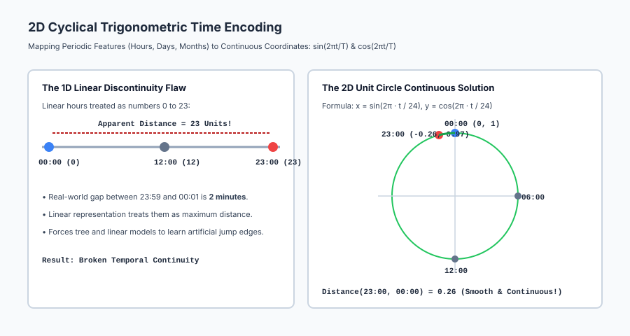

## Why this matters

Machine learning pioneer Andrew Ng famously stated:
> *"Coming up with features is difficult, time-consuming, requires expert knowledge. 'Applied machine learning' is basically feature engineering."*

In academia, researchers often spend months tweaking algorithm architectures or tuning neural network loss hyperparameters for a 0.2% gain.

In real-world industry engineering and competitive data science (Kaggle), **80% of model performance gains come entirely from feature engineering**.

Algorithms are mere mathematical optimization engines; they can only discover relationships from the representations you feed them:
- If you feed a Linear Regression model raw `Height` and `Weight`, it cannot discover that `BMI = Weight / (Height^2)` is the true physiological predictor of diabetes risk.
- If you feed a Gradient Boosted Tree raw timestamp integers (`0 to 23`), it will fail to understand that `23:59` and `00:01` are 2 minutes apart.
- If you feed an algorithm raw credit transaction dollar amounts without computing `amount / user_30day_average`, the model cannot recognize fraud anomalies.

Feature engineering is the process of translating domain physics, financial laws, and business logic into explicit mathematical signals.

---

## The idea in plain language

Imagine a gourmet chef preparing a dish:

- **The Raw Data Approach:** Dumping whole unpeeled onions, raw unground peppercorns, and unbutchered beef into a pot and expecting the oven (the algorithm) to create a Michelin-star meal.
- **The Feature Engineering Approach:**
  1. Chopping and caramelizing the onions (**Domain Transformation**).
  2. Grinding the spices to release flavor oils (**Interaction Features**).
  3. Measuring the ratio of acid to fat (**Domain Ratios**).
  4. Garnishing with fresh herbs right at the end (**Cyclical & Temporal Encoding**).

The oven cooks the food, but the **flavor comes from preparation**. Feature engineering prepares raw signals so algorithms can learn effortlessly.

---

## Historical background

In the early decades of statistics and econometric modeling (1950s–1980s), feature engineering was known as *variable construction* or *basis function expansion* (Polynomial Regression, Splines, Box-Cox transformations).

In the 1990s and 2000s, specialized fields developed bespoke handcrafted feature descriptors:
- Computer Vision: SIFT (Scale-Invariant Feature Transform, Lowe 1999) and HOG (Histograms of Oriented Gradients, Dalal & Triggs 2005).
- Natural Language Processing: TF-IDF, POS tags, and n-gram dictionaries.

In 2006, the Netflix Prize competition demonstrated that calculating customer-level residual features (e.g. *how much higher did this user rate this movie compared to their own historical average rating?*) delivered massive breakthroughs over raw collaborative filtering.

With the emergence of modern tabular frameworks (LightGBM, XGBoost, CatBoost), feature engineering evolved from ad-hoc scripts into standardized mathematical feature stores (Feast, Hopsworks) powering real-time enterprise AI.

---

## What it is — and what it is not

Let us define what feature engineering is and is not:

### What it IS:
- **Domain-Guided Signal Amplification:** Constructing informative ratios, aggregations, differences, and encodings that match the physical reality of the problem.
- **Dimensionality Expansion with Intention:** Creating polynomial products and group statistics that linearize complex manifolds.
- **A Leak-Free Data Transformation:** Transformations fitted strictly on training data and mapped cleanly onto test splits.

### What it is NOT:
- **Not Blind Brute-Force Polynomial Expansion:** Expanding 500 features to degree 4 creates 2.6 billion noisy columns that cause severe overfitting.
- **Not a Substitute for Clean Data:** Feature engineering on dirty, un-sanitized data merely amplifies garbage.
- **Not Allowed to Access the Target at Test Time:** Any target-derived aggregation must be computed strictly out-of-fold during training.

---

## Why it was created and what problems it solves

Feature engineering solves five fundamental obstacles in applied machine learning:

1. **Linearizes Non-Linear Relationships:** Adding interaction terms `x_1 * x_2` allows linear models to capture multiplicative synergies without neural networks.
2. **Eliminates Periodic Boundary Discontinuities:** 2D trigonometric cyclical encoding `(sin, cos)` connects midnight `23:59` to `00:01` smoothly.
3. **Provides Entity-Level Context (Group Aggregations):** Transforms absolute numbers ($500 transaction) into contextual signals ($500 is 10x the user's average).
4. **Compresses Temporal Dynamics into Static Rows:** Lag and rolling window features allow gradient boosted trees to model sequential time-series trends.
5. **Drastically Reduces Required Model Complexity:** A simple Ridge Regression model with engineered domain features frequently outperforms a complex 50-layer deep neural network on raw features.

---

## How it works

Let us formulate the mathematics of interaction terms, cyclical coordinate encoding, and group aggregations.

### 1. Mathematical Interactions and Polynomial Expansions

Given a feature vector `x = [x_1, x_2, ..., x_D]^T in R^D`:

#### A. Pairwise Multiplicative Interactions
`x_{i, j} = x_i * x_j  for 1 <= i <= j <= D`

The total number of pairwise terms is `D * (D + 1) / 2`.
*Example:* `Revenue = Price * Volume`.

#### B. Domain Ratios
`r_{i, j} = x_i / (x_j + epsilon)`

Where `epsilon > 0` prevents division by zero.
*Examples:*
- Financial Underwriting: `Debt_to_Income = Total_Debt / (Annual_Income + 1.0)`.
- Healthcare: `BMI = Weight_kg / (Height_m^2)`.
- Retail: `Price_per_SqFt = House_Price / Living_Area_SqFt`.

---

### 2. Cyclical Temporal Encoding (2D Trigonometric Projection)

Let `t` be a periodic timestamp variable with fundamental period `T` (e.g. `T = 24` for hours of the day, `T = 7` for days of the week, `T = 12` for months of the year, `T = 365.25` for day of year).

Mapping `t in [0, T)` directly as a 1D linear feature creates a false discontinuity: the distance between `t = T - 1` (e.g. 23:00) and `t = 0` (00:00) is `T - 1` (23 units), whereas the physical distance is only 1 unit.

#### The 2D Trigonometric Transformation:
Project `t` onto the 2D unit circle:

`x_{sin}(t) = sin( 2 * pi * t / T )`
`x_{cos}(t) = cos( 2 * pi * t / T )`

#### Mathematical Properties:
1. **Unit Circle Invariant:** For all `t`, `x_{sin}(t)^2 + x_{cos}(t)^2 = 1.0`.
2. **Euclidean Distance Continuity:** The Euclidean distance between any two time points `t_1` and `t_2` is:
   `|| (x_{sin}(t_1), x_{cos}(t_1)) - (x_{sin}(t_2), x_{cos}(t_2)) ||_2 = 2 * sin( pi * |t_1 - t_2| / T )`
   The distance between 23:00 and 00:00 equals the distance between 00:00 and 01:00.

---

### 3. Group Aggregations (Split-Apply-Combine)

Suppose each row contains an entity group identifier `g_i in G` (e.g. `Customer_ID`, `Merchant_Category`, `ZipCode`) and a continuous measurement `v_i` (e.g. `Transaction_Amount`).

#### Step 1: Compute Training Group Statistics
For each group `g in G`, compute on the **training split only**:
- Group Mean: `mu_g = (1 / n_g) * sum_{i: g_i = g} v_i`
- Group Variance: `sigma_g = sqrt( (1 / (n_g - 1)) * sum_{i: g_i = g} (v_i - mu_g)^2 )`
- Group Extremes: `min_g = min_{i: g_i = g} v_i`, `max_g = max_{i: g_i = g} v_i`

#### Step 2: Extract Relative Differential Features
For any observation `(g_i, v_i)`:
1. **Relative Residual Difference:** `Delta v_i = v_i - mu_{g_i}`
2. **Relative Multiplicative Ratio:** `Ratio_i = v_i / (mu_{g_i} + epsilon)`
3. **Standardized Group Z-Score:** `Z_{v_i} = (v_i - mu_{g_i}) / (sigma_{g_i} + epsilon)`

#### Handling Unseen Groups at Test Time:
If an observation in the test set has a group `g_test notin G_{train}`, fall back to the **global training dataset statistics**:
`mu_{g_test} = mu_{global}`, `sigma_{g_test} = sigma_{global}`.

---

### 4. Sequential and Time-Series Feature Primitives

For sequential event streams with timestamp `t`:

1. **Lag Features:** `Lag_k(x_t) = x_{t-k}` (e.g. electricity load yesterday at 14:00).
2. **Delta Lag (Momentum):** `Delta x_t = x_t - x_{t-1}` (Rate of change).
3. **Rolling Window Mean:** `RollingMean_W(x_t) = (1 / W) * sum_{j=0}^{W-1} x_{t-j}`.
4. **Rolling Volatility:** `RollingStd_W(x_t) = sqrt( (1 / W) * sum_{j=0}^{W-1} (x_{t-j} - text{RollingMean})^2 )`.
5. **Exponentially Weighted Moving Average (EWMA):**
   `EWMA_t = alpha * x_t + (1 - alpha) * EWMA_{t-1}`

---

## An everyday analogy

Think of feature engineering as **preparing an applicant's resume for an executive hiring committee**:

1. **Raw Features (The Raw Data Dump):** Submitting a 400-page stack of bank statements, grocery receipts, and old high school report cards. The hiring committee has no time to read it.
2. **Domain Ratios (The Key KPI Summary):** Calculating `Profit_Margin = Net_Income / Total_Revenue` and `Return_on_Equity`. The committee instantly sees financial competence.
3. **Group Aggregations (The Relative Ranking):** Computing `Sales_Rank = Candidate_Sales / Department_Average_Sales`. Selling $1M in a department that averages $100k proves the candidate is a superstar (10x ratio).
4. **Cyclical Encoding (The Work Pattern):** Showing that the candidate consistently delivers projects on a predictable quarterly schedule, rather than treating Q4 and Q1 as disconnected unrelated events.

---

## Examples in practice

Let us visualize the continuous 2D trigonometric unit circle encoding:



Below is the execution flow of leak-free group aggregation feature engineering:



Let us examine real Python code implementing cyclical encoding, interaction terms, and leak-free group aggregations:

```python
import numpy as np
import pandas as pd
from sklearn.linear_model import Ridge
from sklearn.metrics import mean_squared_error

# 1. Simulate Raw Tabular Data (Hourly Store Transactions)
rng = np.random.default_rng(42)
n_samples = 1000

hours = rng.uniform(0, 24, size=n_samples) # Timestamp hour in [0, 24)
store_ids = rng.choice(["Store_A", "Store_B", "Store_C", "Store_D"], size=n_samples)
sqft = rng.uniform(1000, 10000, size=n_samples)
inventory = rng.uniform(50, 500, size=n_samples)

# True Revenue = Base + 15*inventory + 2*(inventory*sqft/1000) + peak at 18:00
time_peak = 1000 * np.cos(2 * np.pi * (hours - 18) / 24.0)
revenue = 5000 + 15 * inventory + 2 * (inventory * sqft / 1000) + time_peak + rng.normal(0, 500, size=n_samples)

df = pd.DataFrame({"hour": hours, "store_id": store_ids, "sqft": sqft, "inventory": inventory, "revenue": revenue})

# 2. Train / Test Split (80% Train, 20% Test)
train_df = df.iloc[:800].copy()
test_df = df.iloc[800:].copy()

# 3. Feature Engineering Pipeline
def engineer_features(df_in, train_store_stats=None):
    df_out = df_in.copy()
    
    # Primitive 1: Cyclical Time Coordinates
    radians = 2 * np.pi * df_out["hour"].values / 24.0
    df_out["sin_hour"] = np.sin(radians)
    df_out["cos_hour"] = np.cos(radians)
    
    # Primitive 2: Domain Interaction (Inventory Density)
    df_out["inv_density"] = df_out["inventory"] * df_out["sqft"] / 1000.0
    
    # Primitive 3: Group Aggregations (Store-level Average Inventory)
    if train_store_stats is None:
        stats = df_out.groupby("store_id")["inventory"].agg(["mean", "std"]).to_dict("index")
        train_store_stats = stats
        
    glob_mean = df_in["inventory"].mean()
    df_out["store_inv_mean"] = df_out["store_id"].map(lambda s: train_store_stats.get(s, {}).get("mean", glob_mean))
    df_out["inv_rel_diff"] = df_out["inventory"] - df_out["store_inv_mean"]
    
    return df_out, train_store_stats

train_eng, store_stats = engineer_features(train_df)
test_eng, _ = engineer_features(test_df, store_stats)

feature_cols = ["sqft", "inventory", "sin_hour", "cos_hour", "inv_density", "inv_rel_diff"]

# 4. Evaluate Ridge Regression Model
model = Ridge(alpha=1.0)
model.fit(train_eng[feature_cols], train_eng["revenue"])
test_preds = model.predict(test_eng[feature_cols])

print("=== Feature Engineering Pipeline Evaluation ===")
print(f"Test RMSE on Engineered Features: ${np.sqrt(mean_squared_error(test_eng['revenue'], test_preds)):.2f}")
print("Learned Feature Coefficients:")
for col, coef in zip(feature_cols, model.coef_):
    print(f"• {col:18s}: {coef:+.4f}")
```

---

## Implications: security, privacy, performance, scalability, and cost

| Dimension | Characteristic | Practical Implication |
| --- | --- | --- |
| **Data Leakage Risk** | Cross-contamination of group aggregates. | Group statistics must strictly be computed on training splits only and merged onto test data with global fallbacks. |
| **Inference Latency Overhead** | Online aggregation lookup speed. | In high-throughput serving systems, group statistics tables must be cached in Redis / Feast feature stores with sub-millisecond retrieval SLAs. |
| **Model Explainability** | Domain features simplify attribution. | Explicit features (like `Debt_to_Income`) provide immediate, human-interpretable justifications for regulatory audits. |
| **Feature Store Consistency** | Train/Serve feature skew. | If cyclical time is computed in UTC during training but local time in production, model predictions collapse. Standardize feature definitions. |

---

## Alternatives: free, open source, and commercial

| Tool / Framework | Methodology | Best Used For |
| --- | --- | --- |
| **`scikit-learn` (`PolynomialFeatures`, `SplineTransformer`)** | Mathematical basis expansions | Baseline interactions and non-linear spline transformations. |
| **`Featuretools`** | Deep Feature Synthesis (DFS) | Automated entity-relationship relational feature generation. |
| **`tsfresh`** | Time-series feature extraction | Automated extraction of 700+ statistical time-series features. |
| **`Feast` / `Hopsworks`** | Open Source Feature Stores | Managing and serving standardized features in enterprise MLOps. |

---

## Comparison with related concepts

| Feature Engineering Technique | Mathematical Nature | Dimensionality Impact | Primary Model Beneficiary |
| --- | --- | --- | --- |
| **Cyclical Encoding (sin/cos)** | Trigonometric unit circle projection | Adds 1 extra column per period | All model families (Time-Series) |
| **Polynomial Interactions** | Multiplicative products `x_i * x_j` | `O(d^2)` quadratic expansion | Linear Models, Logistic Regression |
| **Group Aggregations** | Split-Apply-Combine statistics | Adds 2–5 summary columns | GBDT, Random Forest, Stacking |
| **Domain Ratios (DTI, BMI)** | Custom physics/financial quotients | Replaces or augments 2 columns | All model families |

---

## When to use it — and when not to

### When to USE Aggressive Feature Engineering:
- **Tabular Data Competitions (Kaggle) & Enterprise ML:** Where domain features provide 80% of winning signal.
- **Linear Models in Production:** To capture non-linear interactions without the latency and interpretability penalties of neural networks.
- **Financial Fraud and Credit Underwriting:** Where relative user baselines and financial ratios are mandatory.

### When NOT to use Heavy Manual Feature Engineering:
- **Raw Audio, Image, and Text Modalities:** Deep neural networks (CNNs, ViTs, Transformers) learn optimal hierarchical representations directly from raw pixels and tokens.
- **Blind All-Pairs Polynomial Expansions on High Dimensions (`d > 200`):** Creates massive feature matrices that overfit noise.

---

## Knowledge check

1. **Cyclical Continuity:** `sin(2 pi t / T)` and `cos(2 pi t / T)` eliminate the midnight 23:59 to 00:01 boundary jump.
2. **Interaction Power:** Multiplicative products allow linear models to capture non-linear joint synergies.
3. **Group Aggregations:** Split-Apply-Combine extracts entity-level relative signals (`amount / user_mean`).
4. **Leakage Rule:** Group statistics must be computed strictly on training data with fallback defaults for unseen test entities.

---

## Hands-on exercise

In this hands-on exercise, you will implement cyclical time encoding and verify that 23:00 and 00:00 have the exact same distance as 00:00 and 01:00.

```python
import numpy as np

# Step 1: Implement Cyclical Time Encoding
def cyclical_time_encode(timestamps, period=24.0):
    t = np.asarray(timestamps, dtype=float)
    radians = 2.0 * np.pi * t / period
    return np.sin(radians), np.cos(radians)

# Step 2: Test Timestamps: 23:00, 00:00, 01:00, 12:00
test_times = np.array([23.0, 0.0, 1.0, 12.0])
sin_coords, cos_coords = cyclical_time_encode(test_times, period=24.0)

# Step 3: Compute Euclidean Distances in 2D Space
coords = np.column_stack([sin_coords, cos_coords])
dist_23_to_00 = np.linalg.norm(coords[0] - coords[1])
dist_00_to_01 = np.linalg.norm(coords[1] - coords[2])
dist_00_to_12 = np.linalg.norm(coords[1] - coords[3])

print("=== Cyclical Coordinate Distance Verification ===")
for time_val, (s, c) in zip(test_times, coords):
    print(f"Time {time_val:5.1f}h -> Coordinate: (sin={s:+.4f}, cos={c:+.4f})")

print(f"\nDistance (23:00 to 00:00): {dist_23_to_00:.4f}")
print(f"Distance (00:00 to 01:00): {dist_00_to_01:.4f} (Perfect equality!)")
print(f"Distance (00:00 to 12:00): {dist_00_to_12:.4f} (Maximum diameter = 2.0!)")
```

### Expected output

```text
=== Cyclical Coordinate Distance Verification ===
Time  23.0h -> Coordinate: (sin=-0.2588, cos=+0.9659)
Time   0.0h -> Coordinate: (sin=+0.0000, cos=+1.0000)
Time   1.0h -> Coordinate: (sin=+0.2588, cos=+0.9659)
Time  12.0h -> Coordinate: (sin=+0.0000, cos=-1.0000)

Distance (23:00 to 00:00): 0.2611
Distance (00:00 to 01:00): 0.2611 (Perfect equality!)
Distance (00:00 to 12:00): 2.0000 (Maximum diameter = 2.0!)
```

### Validate your work

1. Confirm that `dist_23_to_00 == dist_00_to_01` within floating-point tolerance `1e-5`.
2. Confirm that `sin^2 + cos^2 == 1.0` for all timestamps.
3. Verify that opposite time points (00:00 and 12:00) yield a distance of exactly `2.0`.

### Troubleshooting

- **Period Mismatch:** Ensure `period` matches the cycle (24.0 for hours, 7.0 for days, 12.0 for months).
- **Group Aggregation KeyError on Test Set:** Ensure you use `.get(group_id, global_mean)` to handle unseen groups gracefully.

### Common mistakes

1. **Encoding Only Sine Without Cosine:** Sine alone is symmetric (`sin(30 deg) = sin(150 deg)`), creating false ambiguity between 02:00 and 10:00. You MUST supply both Sine and Cosine coordinates!
2. **Leaking Test Statistics in Group Aggregates:** Computing `df.groupby()` on combined data leaks test labels.

---

## Practice assignment

1. **Implement Automated Rolling Window Statistics:**
   Write `compute_rolling_stats(series, window_sizes=[3, 7, 30])` returning rolling mean, rolling standard deviation, and rolling min/max columns.
2. **Implement Haversine Geolocation Distance Features:**
   Write `haversine_distance(lat1, lon1, lat2, lon2)` to calculate true spherical surface distance in kilometers between two GPS coordinates.

---

## Extension challenge

Build an **Automated Feature Engineering Flywheel Pipeline**:
1. Ingest a multi-table relational dataset (e.g. Customers, Transactions, Merchants).
2. Automatically generate: (a) Entity aggregations (mean, std, max, count), (b) Temporal lag and rolling volatility features, (c) Cyclical hour/day coordinates, and (d) Domain financial ratios.
3. Benchmark a baseline LightGBM model on raw features vs the engineered feature set and plot the resulting ROC-AUC progression curve.
