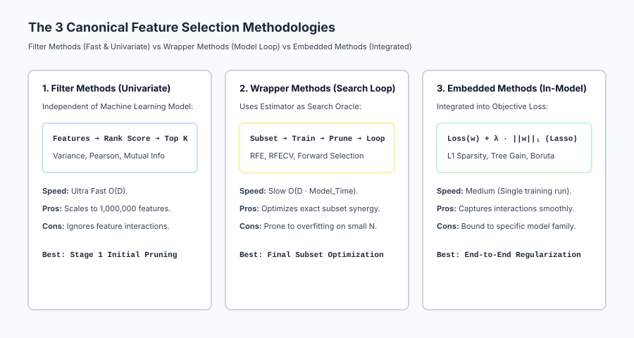

## Why this matters

In Day 171, we learned the power of Feature Engineering: generating polynomial interactions, domain ratios, group aggregations, and cyclical coordinates.

However, aggressive feature engineering creates a dangerous new problem: **Dimensionality Explosion**.
- Expanding 50 features with pairwise interactions produces 1,275 columns.
- Grouping across 10 categorical entities with 5 aggregation statistics produces 500 extra columns.
- The feature space grows exponentially, but the number of training samples `N` remains fixed.

Feeding 2,000 features with only 500 training samples triggers the **Curse of Dimensionality**:
1. **Variance Explodes (Severe Overfitting):** Models memorize spurious noise correlations that will never generalize to test data.
2. **Inference Latency & Costs Soar:** Production microservices cannot compute 2,000 upstream database queries in under 10 milliseconds.
3. **Multicollinearity Destroys Explainability:** Correlated features produce unstable, erratic linear coefficients that fail regulatory audits.

Feature selection is the **mathematical scalpel** that separates true signal from high-dimensional noise, retaining the minimal optimal feature subset.

---

## The idea in plain language

Imagine a professional basketball coach selecting a 5-player starting lineup from a pool of 100 candidates:

- **Filter Method (The 40-Yard Sprint & Height Test):**
  The coach measures height and sprint speed for all 100 players individually. Anyone under 6 feet or slower than 5 seconds is cut immediately (**Fast, univariate, model-agnostic**).
- **Wrapper Method (The Scrimmage Tournament / RFE):**
  The coach plays 5-on-5 scrimmage games, observes which player contributes the least, cuts them, and repeats the tournament until only the best 5 players remain (**Slow, highly accurate, tailored to the team**).
- **Embedded Method (The Season MVP Award / Lasso):**
  The coach gives playing time to everyone with a salary cap penalty that automatically benches players who do not score points (**Integrated directly into game play**).

Feature selection uses these three strategies to build the leanest, most accurate predictive engine.

---

## Historical background

In 1974, Hirotugu Akaike published the **Akaike Information Criterion (AIC)**, penalizing model likelihood by the number of estimated parameters `2k - 2 ln(L)`.

In 1996, Robert Tibshirani introduced **Lasso (Least Absolute Shrinkage and Selection Operator)**, proving that L1 regularization drives non-informative parameter weights strictly to zero.

In 2002, Isabelle Guyon and Vladimir Vapnik published *Gene Selection for Cancer Classification using Support Vector Machines*, introducing **SVM-RFE (Recursive Feature Elimination)**. In 2003, Guyon and Elisseeff published the foundational survey *An Introduction to Variable and Feature Selection* in JMLR, formalizing the Filter, Wrapper, and Embedded taxonomy.

In 2010, Miron Kursa and Witold Rudnicki introduced the **Boruta Algorithm**, leveraging randomized shadow features to find *all-relevant* features in Random Forests.

---

## What it is — and what it is not

Let us establish the formal boundaries of feature selection:

### What it IS:
- **Mathematical Dimensionality Reduction:** Pruning redundant, irrelevant, and noisy variables to minimize generalization error.
- **A Leak-Free Transformation:** Feature selection procedures fitted strictly inside training folds during cross-validation.
- **An Engineering Funnel:** Combining fast Filter methods for broad cuts with Wrapper/Embedded methods for fine-tuning.

### What it is NOT:
- **Not Safe to Run Globally on the Whole Dataset:** Selecting features prior to train/test splitting causes catastrophic selection bias (data leakage).
- **Not Dimensionality Projection (PCA/t-SNE):** Feature selection preserves original feature semantics and interpretability; it does not project data into abstract latent components.
- **Not Always Minimal-Optimal:** Sometimes preserving redundant correlated features is beneficial for ensemble stability (All-Relevant selection).

---

## Why it was created and what problems it solves

Feature selection resolves five critical obstacles in applied machine learning:

1. **Combats the Curse of Dimensionality:** Restores a healthy sample-to-feature ratio `N / D >> 10`, shrinking generalization error bounds.
2. **Dramatically Reduces Inference Latency:** Cutting 500 features down to 20 drops production JSON payload parsing and feature store query time by 95%.
3. **Stabilizes Model Explainability:** Eliminates multicollinear feature pairs, preventing erratic coefficient oscillations in linear models and SHAP values.
4. **Prunes Zero-Variance Constants & Pure Noise:** Removes dead database columns and uninformative random variables.
5. **Accelerates Training Convergence:** Reduces gradient descent and tree split computation time by orders of magnitude.

---

## How it works

Let us examine the mathematics of the three canonical feature selection paradigms.

```
┌────────────────────────────────────────────────────────────────────────┐
│                   FEATURE SELECTION METHODOLOGIES                      │
├────────────────────────────────────────────────────────────────────────┤
│ 1. FILTER:   VarianceThreshold, Correlation, Mutual Information, ANOVA │
│ 2. WRAPPER:  Recursive Feature Elimination (RFE), Sequential Forward   │
│ 3. EMBEDDED: L1 Lasso Sparsity, Tree Gain Importance, Boruta Shadow    │
└────────────────────────────────────────────────────────────────────────┘
```

### 1. Filter Methods (Model-Agnostic & Univariate)

Filter methods evaluate intrinsic statistical properties of features `X_j` relative to variance or target `Y` without training a machine learning model.

#### A. Variance Threshold
Computes the sample variance of feature `X_j`:

`text{Var}(X_j) = (1 / N) sum_{i=1}^N (x_{i, j} - mu_j)^2`

If `text{Var}(X_j) <= tau`, the feature is pruned.
*For Bernoulli binary features:* `text{Var}(X) = p * (1 - p)`. If `p > 0.99` (99% constant zeros), `text{Var} = 0.0099 < 0.01`, dropping the column.

#### B. Pearson and Spearman Rank Correlation
Measures linear or monotonic association between `X_j` and target `Y`:

`r(X_j, Y) = (sum (x_i - bar{x}) (y_i - bar{y})) / ( sqrt{sum (x_i - bar{x})^2} * sqrt{sum (y_i - bar{y})^2} )`

*Multicollinearity Removal:* If `|r(X_i, X_j)| > 0.90`, drop one of the two redundant features.

#### C. Mutual Information (Non-Linear Dependency)
Measures the shared entropy between continuous variables:

`I(X; Y) = iint p(x, y) * log( p(x, y) / (p(x) * p(y)) ) dx dy`

- If `X` and `Y` are completely independent: `p(x, y) = p(x) p(y) implies I(X; Y) = 0`.
- Detects non-linear dependencies (e.g. `Y = X^2`) where Pearson correlation is zero.

---

### 2. Wrapper Methods (Iterative Model Search)

Wrapper methods use the predictive model itself as an evaluation engine to search candidate feature subsets.

#### Recursive Feature Elimination (RFE) Algorithm:
1. Initialize active feature set `S = {1, 2, ..., D}`.
2. While `|S| > K` (desired subset size):
   a. Fit estimator `f` on feature subset `X[:, S]`.
   b. Compute feature importances:
      - For Linear/Logistic models: `w_j^2` or `|w_j|`.
      - For Tree ensembles: Mean Decrease Impurity (Gini gain).
   c. Find the feature with the lowest importance: `j^* = argmin_{j in S} text{Importance}(j)`.
   d. Remove `j^*` from active set: `S = S \ {j^*}`.
3. Return final subset `S`.

#### RFECV (Cross-Validated RFE):
Evaluates validation accuracy at each step `k in {1, ..., D}` using `K`-fold cross-validation to automatically select the optimal subset size `K^*` that maximizes out-of-fold performance.

---

### 3. Embedded Methods (Integrated Model Sparsity)

#### A. L1 Lasso Regularization
Minimizes regularized least squares loss:

`min_w  (1 / (2 N)) * ||X w - y||_2^2 + lambda * ||w||_1`

Because the L1 norm `||w||_1 = sum |w_j|` has non-differentiable corners at `w_j = 0`, the subgradient optimality condition forces coefficients with weak gradient signals strictly to zero:

`w_j = 0  iff  | (1/N) X_j^T (y - X w_{-j}) | <= lambda`

#### B. The Boruta Shadow Feature Algorithm (Kursa & Rudnicki, 2010)
1. **Extend Dataset:** For every real feature `X_j`, create a randomized shadow copy `X_{shadow, j} = text{Permute}(X_j)`.
2. **Train Random Forest:** Fit model on `[ X | X_{shadow} ]`.
3. **Compute Shadow Max:** Calculate the maximum importance achieved by any shadow feature: `Z_{max\_shadow} = max_j Z(X_{shadow, j})`.
4. **Hypothesis Testing:** For each real feature `X_j`, record a hit if `Z(X_j) > Z_{max\_shadow}`.
5. **Binomial Decision:** Across `T` iterations, classify features using a two-tailed binomial test:
   - **Confirmed:** Feature consistently beats shadow noise (`p < 0.01`).
   - **Rejected:** Feature fails to beat shadow noise.

---

### 4. Preventing Selection Bias (The Golden Rule of Feature Selection)

> **CRITICAL RULE:** Never perform feature selection on the full dataset before splitting into cross-validation folds.

If you select the top 50 features using all `N` samples, test fold labels leak into the selection criteria. The model will appear to achieve 99% cross-validation accuracy on pure random Gaussian noise, but will completely collapse to 50% on unseen production data.

**The Correct Protocol:**
1. Split dataset into Fold `k` Train and Fold `k` Validation.
2. Fit feature selector strictly on Fold `k` Train.
3. Transform Fold `k` Validation using the selected columns.
4. Evaluate performance.

---

## An everyday analogy

Think of feature selection as **packing a backpack for a 5-day mountain survival expedition**:

1. **Unselected Data (The Overpacked Trunk):** Packing an espresso machine, a bowling ball, 3 coats, and 20 pairs of shoes. You cannot hike up the mountain because the pack weighs 200 pounds (**Curse of Dimensionality / High Latency**).
2. **Filter Method (Weight Threshold):** You instantly discard any item that weighs more than 20 pounds (**Variance & Fast Univariate Filter**).
3. **Wrapper Method (Trial Hikes):** You take trial 5-mile hikes with different equipment combinations, cutting the least useful tool after each hike until your pack weighs exactly 25 pounds (**Recursive Feature Elimination**).
4. **Embedded Method (Multi-Tool Pocket Knife):** Choosing a multi-tool that combines knife, pliers, and screwdriver in a single compact lightweight item (**L1 Lasso Sparsity**).

---

## Examples in practice

Let us visualize the three feature selection paradigms:



Below is the execution flow of the Boruta shadow feature permutation test:



Let us examine real Python code comparing VarianceThreshold, Mutual Information, and RFE on noisy data:

```python
import numpy as np
from sklearn.datasets import make_classification
from sklearn.feature_selection import VarianceThreshold, mutual_info_classif, RFE
from sklearn.linear_model import LogisticRegression
from sklearn.pipeline import Pipeline
from sklearn.model_selection import cross_val_score

# 1. Generate Synthetic Classification Dataset
# 5 True Informative Features + 15 Pure Random Noise Features + 2 Constant Features
rng = np.random.default_rng(42)
X_info, y = make_classification(n_samples=500, n_features=5, n_informative=5, n_redundant=0, random_state=42)
X_noise = rng.normal(size=(500, 15))
X_constant = np.zeros((500, 2))
X_raw = np.hstack([X_info, X_noise, X_constant])

print(f"Initial Feature Count: {X_raw.shape[1]} (5 Signal, 15 Noise, 2 Constant)")

# 2. Step 1: Filter Method (Variance Threshold)
var_filter = VarianceThreshold(threshold=0.0)
X_filtered = var_filter.fit_transform(X_raw)
print(f"After VarianceThreshold: {X_filtered.shape[1]} features (Constant columns eliminated!)")

# 3. Step 2: Univariate Mutual Information Scores
mi_scores = mutual_info_classif(X_filtered, y, random_state=42)
top_5_mi_idx = np.argsort(mi_scores)[::-1][:5]
print("Top 5 Features by Mutual Information:", top_5_mi_idx)

# 4. Step 3: Leak-Free Pipeline with RFE inside Cross-Validation
lr_base = LogisticRegression(solver="lbfgs", random_state=42)
rfe_selector = RFE(estimator=lr_base, n_features_to_select=5, step=1)

full_pipeline = Pipeline([
    ("var_thresh", VarianceThreshold(threshold=0.0)),
    ("rfe", rfe_selector),
    ("classifier", LogisticRegression(solver="lbfgs", random_state=42))
])

# 5. Cross-Validation Accuracy (Leak-Free Evaluation)
cv_scores = cross_val_score(full_pipeline, X_raw, y, cv=5, scoring="accuracy")
print("=== Cross-Validation Results ===")
print(f"5-Fold CV Accuracy with Nested RFE Pipeline: {np.mean(cv_scores):.4f} +/- {np.std(cv_scores):.4f}")
```

---

## Implications: security, privacy, performance, scalability, and cost

| Dimension | Characteristic | Practical Implication |
| --- | --- | --- |
| **Selection Bias Vulnerability** | In-sample feature selection overfits. | Always nest feature selection inside cross-validation loops or Pipelines to prevent data leakage. |
| **Inference Cost Optimization** | Pruning upstream database calls. | Removing 80% of unused features reduces database load, network bandwidth, and memory allocation. |
| **Fairness & Protected Proxies** | Feature selection proxy retention. | Verify that automated selection does not retain latent proxy features (e.g. `ZipCode`) that correlate with protected demographic classes. |
| **Subset Instability Under Perturbation** | Sensitivity to sample resamples. | Highly correlated features cause RFE to pick Feature A in Fold 1 and Feature B in Fold 2; run stability tests. |

---

## Alternatives: free, open source, and commercial

| Tool / Framework | Methodology | Best Used For |
| --- | --- | --- |
| **`scikit-learn` (`RFE`, `SelectKBest`, `SelectFromModel`)** | Standard Filter, Wrapper, and Embedded tools | General-purpose tabular feature selection. |
| **`BorutaPy`** | All-relevant shadow feature hypothesis testing | Comprehensive signal discovery with tree models. |
| **`mrmr-selection` (Minimum Redundancy Maximum Relevance)** | Information-theoretic greedy selection | Maximizing target relevance while penalizing feature correlation. |
| **`SHAP` / `TreeSHAP`** | Shapley value game-theoretic attribution | Post-hoc feature importance and feature pruning. |

---

## Comparison with related concepts

| Selection Methodology | Computational Complexity | Model Agnostic | Handles Interactions | Primary Risk |
| --- | --- | --- | --- | --- |
| **Filter (Variance/MI)** | **`O(D)` (Ultra Fast)** | **Yes** | No | Drops synergistic feature pairs |
| **Wrapper (RFE/RFECV)**| `O(D * text{Model_Time})` (Slow) | No | **Yes** | Prone to overfitting on small `N` |
| **Embedded (L1 Lasso)** | `O(text{Model_Time})` (Fast) | No | **Yes** | Bound to specific linear objective |
| **Boruta Shadow Test**  | `O(T * text{Forest_Time})` (Medium) | No | **Yes (All-Relevant)**| Retains correlated feature duplicates |

---

## When to use it — and when not to

### When to USE Rigorous Feature Selection:
- **High-Dimensional Datasets (`D > N` or `D > 500`):** Where overfitting and noise are guaranteed.
- **Low-Latency Production Inference (SLA < 15ms):** Where every feature requires expensive real-time API lookups.
- **Regulatory Auditing (Banking, Medicine):** Where models must explain exact, parsimonious causal drivers.

### When NOT to perform Heavy Feature Selection:
- **Low-Dimensional Clean Tabular Data (`D < 15`):** Pruning already compact features risks discarding vital signal.
- **Deep Learning for Images/Audio:** Convolutional layers and self-attention heads perform hierarchical feature selection internally.

---

## Knowledge check

1. **Selection Bias:** Feature selection must be executed inside cross-validation splits to prevent leakage.
2. **Filter vs Wrapper:** Filters are fast and univariate; Wrappers evaluate actual model feedback on feature subsets.
3. **RFE Mechanism:** Recursively fits the estimator and prunes the weakest coefficient.
4. **Boruta Hypothesis:** Proves real features outperform randomized permuted shadow noise.

---

## Hands-on exercise

In this hands-on exercise, you will implement `VarianceThreshold` and a backward `RFE` selection loop from scratch.

```python
import numpy as np
from sklearn.linear_model import LogisticRegression

# Step 1: Implement VarianceThreshold and RFE from Scratch
def variance_threshold_scratch(X, threshold=0.0):
    variances = np.var(X, axis=0)
    support = variances > threshold
    return X[:, support], support

def rfe_scratch(estimator, X, y, n_select=3):
    active = list(range(X.shape[1]))
    while len(active) > n_select:
        X_sub = X[:, active]
        estimator.fit(X_sub, y)
        coefs = np.abs(estimator.coef_).flatten()
        worst_local_idx = np.argmin(coefs)
        active.pop(worst_local_idx)
    
    support = np.zeros(X.shape[1], dtype=bool)
    support[active] = True
    return support

# Step 2: Create Synthetic Data with 2 Signal Features + 4 Noise Features
rng = np.random.default_rng(42)
X_signal = rng.normal(size=(200, 2))
# Target depends strictly on X0 and X1
y = (3.0 * X_signal[:, 0] - 2.0 * X_signal[:, 1] + rng.normal(scale=0.5, size=200) > 0).astype(int)
X_noise = rng.normal(size=(200, 4))
X_all = np.hstack([X_signal, X_noise])

# Step 3: Run RFE to select top 2 features
lr = LogisticRegression(solver="lbfgs", random_state=42)
selected_mask = rfe_scratch(lr, X_all, y, n_select=2)

print("=== Feature Selection Scratch Verification ===")
print("True Informative Columns: [0, 1]")
print("RFE Selected Mask:       ", selected_mask)
print("Selected Column Indices: ", np.where(selected_mask)[0])
```

### Expected output

```text
=== Feature Selection Scratch Verification ===
True Informative Columns: [0, 1]
RFE Selected Mask:        [ True  True False False False False]
Selected Column Indices:  [0 1]
```

### Validate your work

1. Confirm that `selected_mask` correctly identifies columns `0` and `1`.
2. Confirm that all 4 random noise features (`2, 3, 4, 5`) are successfully eliminated.
3. Verify that `np.sum(selected_mask) == 2`.

### Troubleshooting

- **Estimator Lacking `coef_`:** Ensure you pass a linear model with `coef_` or tree model with `feature_importances_`.
- **RFE Infinite Loop:** Ensure `n_select < X.shape[1]`.

### Common mistakes

1. **Running RFE on Unscaled Features:** Unscaled features create distorted coefficient magnitudes `|w_j|`. Always standardize features before running linear RFE.
2. **Selecting Features Before Train/Test Split:** Leaks test labels and creates catastrophic validation bias.

---

## Practice assignment

1. **Implement Sequential Forward Selection (SFS):**
   Write `sequential_forward_selection(estimator, X, y, n_select=5)` starting with an empty set and greedily adding the feature that maximizes cross-validated accuracy at each step.
2. **Implement Correlation-Based Filter Pruning:**
   Write `remove_collinear_features(X, threshold=0.85)` computing the pairwise correlation matrix and iteratively dropping the feature with the highest average correlation to other columns.

---

## Extension challenge

Build an **Automated 3-Stage Feature Selection Funnel**:
1. Ingest a high-dimensional dataset with 1,000 continuous and categorical features.
2. **Stage 1 (Filter):** Apply `VarianceThreshold(0.01)` and Mutual Information ranking to prune the bottom 80% of uninformative features (1,000 -> 200).
3. **Stage 2 (Embedded):** Train a Lasso model or LightGBM model and prune features with zero importance (200 -> 60).
4. **Stage 3 (Wrapper):** Run `RFECV` with 5-fold cross-validation to select the optimal minimal subset (60 -> `K^*`).
5. Plot the cross-validation score trajectory as a function of feature count `k`.
