## Why this matters

In Days 170 to 172, we mastered feature scaling, categorical encoding, polynomial interactions, group aggregations, and feature selection.

However, writing individual scripts for each step in a Jupyter Notebook creates a **software engineering disaster in production**:

- **Train/Test Data Leakage:** A developer calls `scaler.fit(df)` on the whole DataFrame before splitting, silently invalidating all cross-validation metrics.
- **Train/Serve Skew:** The production API forgets to apply the custom log transformation or uses a different category encoding dictionary than training.
- **Serialization Spaghetti:** The deployment team receives 5 different pickle files (`scaler.pkl`, `encoder.pkl`, `selector.pkl`, `model.pkl`, `feature_names.json`) and must manually coordinate their exact sequence in C++ or Go.
- **Broken Hyperparameter Optimization:** `GridSearchCV` cannot tune the preprocessing scaler and the estimator regularization strength jointly.

Scikit-learn **Pipelines** and **ColumnTransformers** provide the rigorous software architecture that solves all four problems. They bind data transformations and estimators into an **immutable, atomic machine learning object**.

When you encapsulate your preprocessing and modeling into a scikit-learn Pipeline, your entire machine learning pipeline behaves as a single estimator. You fit the entire composite pipeline on raw training tables with a single `.fit(X_train, y_train)` call, and serve live real-time predictions with `.predict(X_new)` without writing error-prone manual glue code.

---

## The idea in plain language

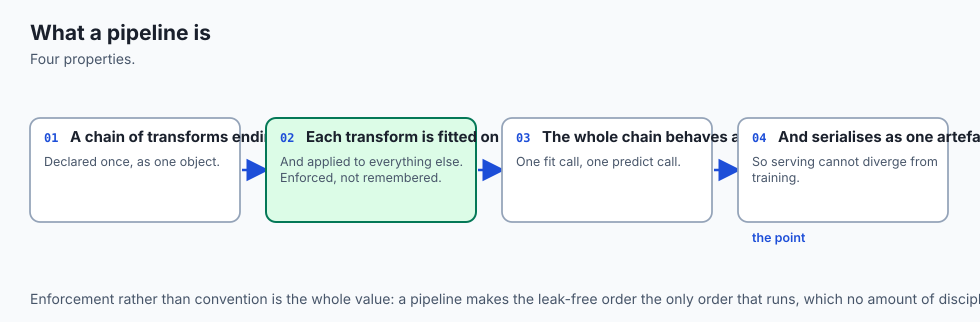

Imagine an automated automobile assembly plant:

- **The Procedural Script Approach (The Chaos):**
  Mechanics paint the car doors in the parking lot, install the engine in the hallway, and screw on the tires in the lobby without a conveyor belt. Half the time, the engine is installed before the frame is built, causing crashes.

- **The Pipeline Approach (The Factory Conveyor Belt):**
  Raw steel enters Station 1 (**Outlier Clipping**), moves to Station 2 (**StandardScaler**), branches into Station 3 (**OneHotEncoder**), passes through Station 4 (**Feature Selection**), and is fitted with the final engine (**Estimator**).

The entire factory is encapsulated into a single blueprint: `pipeline.fit(X_train, y_train)` builds the car, and `pipeline.predict(X_new)` drives it off the line. Every vehicle follows the exact same deterministic sequence of stations, ensuring zero defects and complete reproducibility.

---

## Historical background

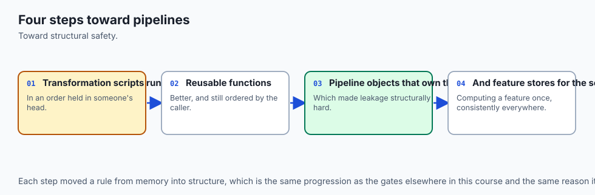

In 2007, David Cournapeau initiated scikit-learn as a Google Summer of Code project.

In 2011, Fabian Pedregosa, Gaël Varoquaux, Alexandre Gramfort, and the core development team published *Scikit-learn: Machine Learning in Python* in JMLR. They established the foundational **Estimator and Transformer API contract**:

1. `fit(X, y)` learns parameters from data and returns `self`.
2. `transform(X)` applies learned parameters to new data.
3. `predict(X)` generates inference predictions.

In 2013, Lars Buitinck et al. formalized the architectural design in *API Design for Machine Learning Software*.

In 2018 (scikit-learn 0.20), **`ColumnTransformer`** was introduced, solving the long-standing limitation of heterogeneous tabular preprocessing and making multi-branch feature routing first-class.

Today, the scikit-learn Pipeline design pattern has become the industry gold standard across all modern data science ecosystems, inspiring equivalent abstractions in PySpark MLlib, Apache Beam TFX, and MLflow.

---

## What it is — and what it is not

Let us define the boundaries of scikit-learn Pipelines:

### What it IS:
- **An Atomic Composition Pattern:** Chaining multiple transformer steps with a final estimator into a single executable object.
- **A Strict Prevention Mechanism for Data Leakage:** Ensuring that transformers are fitted strictly on training folds during cross-validation.
- **A Single Serializable Artifact:** A pipeline saved with `joblib.dump()` contains all preprocessing parameters, encoding maps, and model weights in one unified file.
- **A Unified Search Space:** Allowing joint optimization over preprocessing choices (e.g. median vs mean imputation) and estimator hyperparameters (e.g. L1 vs L2 regularization).

### What it is NOT:
- **Not Distributed Streaming Engine (Spark/Flink):** Scikit-learn pipelines are designed for in-memory batch and microservice inference.
- **Not a Directed Acyclic Graph (DAG) for Complex Topologies:** `Pipeline` is linear; non-linear multi-branch DAGs require `ColumnTransformer` or `FeatureUnion`.
- **Not Permitted to Mutate `__init__` Arguments:** Custom transformers must never modify constructor parameters to remain compatible with `clone()`.
- **Not Restricted to Built-in Transformers:** Any custom Python class adhering to the `BaseEstimator` and `TransformerMixin` contract can be seamlessly inserted into any Pipeline step.

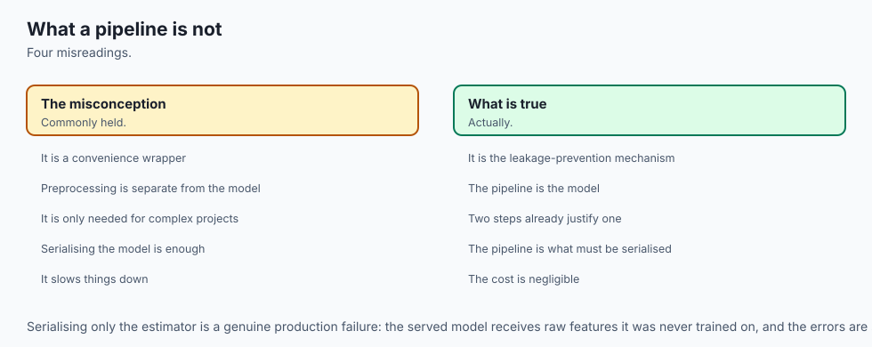

---

## Why it was created and what problems it solves

Scikit-learn Pipelines solve five critical software engineering and mathematical problems in machine learning:

1. **Guarantees Zero Data Leakage in Cross-Validation:** When passed to `cross_val_score(pipeline, X, y)`, each transformer is automatically re-fitted strictly on training folds, eliminating optimistic evaluation bias.
2. **Eliminates Train/Serve Skew:** The exact same Python object used in training is called in production via `pipeline.predict(json_payload)`, ensuring numerical consistency.
3. **Enables Composite Hyperparameter Optimization:** Allows simultaneous grid search over preprocessing hyperparameters (e.g. `preprocessor__num__imputer__strategy`) and model regularization (`classifier__C`).
4. **Supports Heterogeneous Multi-Type Tabular Data:** `ColumnTransformer` routes continuous, categorical, and text columns to dedicated sub-pipelines seamlessly.
5. **Simplifies MLOps Deployment:** Replaces fragile multi-file deployment scripts with a single `joblib.load('model_pipeline.joblib')` call.

---

## How it works

Let us formulate the mathematical architecture and object contracts of Pipelines, ColumnTransformers, and Custom Transformers.

### 1. The Pipeline Execution Lifecycle

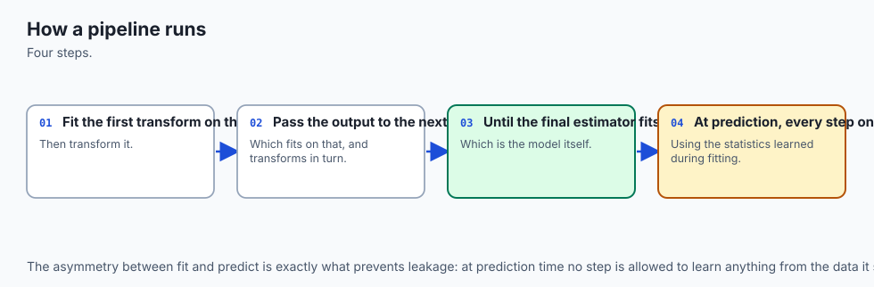

A `Pipeline` consists of an ordered sequence of named tuples `[ (name_1, transformer_1), ..., (name_K, estimator) ]`.

```
┌────────────────────────────────────────────────────────────────────────┐
│                      PIPELINE EXECUTION CONTRACT                       │
├────────────────────────────────────────────────────────────────────────┤
│ pipeline.fit(X, y):                                                    │
│   X_1 = T_1.fit_transform(X, y)                                       │
│   X_2 = T_2.fit_transform(X_1, y)                                     │
│   ...                                                                  │
│   Estimator.fit(X_{K-1}, y)                                            │
│                                                                        │
│ pipeline.predict(X_new):                                               │
│   X_1 = T_1.transform(X_new)                                          │
│   X_2 = T_2.transform(X_1)                                            │
│   ...                                                                  │
│   return Estimator.predict(X_{K-1})                                    │
└────────────────────────────────────────────────────────────────────────┘
```

During training, `pipeline.fit(X, y)` sequentially calls `fit_transform()` on each intermediate transformer, passing the transformed output matrix forward to the next step. The final step is fitted via `estimator.fit(X_{final}, y)`.

During inference, `pipeline.predict(X_new)` calls `transform()` on each intermediate step without updating internal state, and passes the resulting matrix to `estimator.predict()`.

---

### 2. The ColumnTransformer Architecture

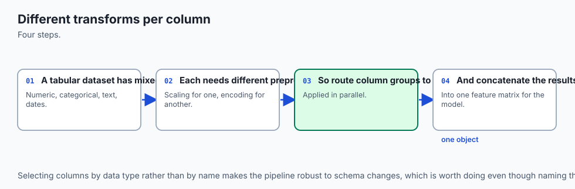

When dealing with mixed tabular datasets containing numerical indices `I_{num}` and categorical indices `I_{cat}`:

`text{ColumnTransformer}( [ (text{'num'}, T_{num}, I_{num}), (text{'cat'}, T_{cat}, I_{cat}) ] )`

1. Slices sub-matrix `X_{num} = X[:, I_{num}]` and applies `T_{num}.fit_transform(X_{num})`.
2. Slices sub-matrix `X_{cat} = X[:, I_{cat}]` and applies `T_{cat}.fit_transform(X_{cat})`.
3. Horizontally concatenates the resulting matrices:
   `X_{out} = [ T_{num}(X_{num})  |  T_{cat}(X_{cat}) ]`

If remaining unspecified columns exist in the DataFrame, you can control their behavior via `remainder='passthrough'` (retaining them untouched) or `remainder='drop'` (discarding them).

---

### 3. The Custom Transformer Contract (`BaseEstimator` & `TransformerMixin`)

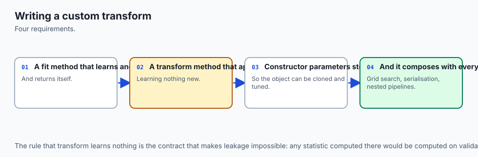

To write a custom transformer that integrates flawlessly with scikit-learn's `clone()`, `GridSearchCV`, and `Pipeline`, you must adhere to three strict rules:

#### Rule 1: Clean Constructor Signature
Every argument in `__init__` must be an explicit keyword argument with a default value. You **must not** accept `*args` or `**kwargs`. The constructor must only assign parameters without modifying them:

```python
class MyTransformer(BaseEstimator, TransformerMixin):
    def __init__(self, threshold=1.0, metric="euclidean"):
        self.threshold = threshold
        self.metric = metric
```

#### Rule 2: The `fit(X, y=None)` Contract
Learns statistics from training data `X` and stores them in attributes ending with a single trailing underscore (e.g. `self.mean_`, `self.bounds_`). It **must return `self`**:

```python
    def fit(self, X, y=None):
        X = np.asarray(X, dtype=float)
        self.mean_ = np.mean(X, axis=0)
        return self
```

#### Rule 3: The `transform(X)` Contract
Applies learned parameters to transform `X` into a 2D NumPy array or sparse matrix without mutating internal state:

```python
    def transform(self, X):
        X = np.asarray(X, dtype=float)
        return (X - self.mean_)
```

---

### 4. Nested Parameter Tuning Syntax

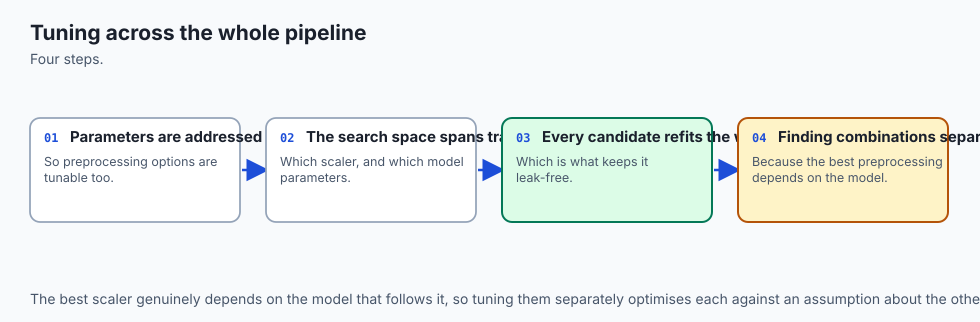

When tuning hyperparameters in composite pipelines, use double underscores (`__`) to traverse the hierarchy:

```python
param_grid = {
    # 1. Preprocessor numerical branch step
    "preprocessor__num__clipper__upper_percentile": [95.0, 99.0, 99.9],
    # 2. Preprocessor scaler step
    "preprocessor__num__scaler__with_mean": [True, False],
    # 3. Final classifier regularization parameter
    "classifier__C": [0.01, 0.1, 1.0, 10.0],
    "classifier__penalty": ["l1", "l2"]
}
```

This syntax allows exhaustive combinatorial exploration over the joint configuration space, discovering interactions between data preprocessing choices and model regularization strength.

---

### 5. Tracking Features with `get_feature_names_out`

In complex pipelines with one-hot encoding and custom transformers, columns expand and shift positions dynamically. Scikit-learn provides the `get_feature_names_out()` API on `ColumnTransformer` and transformers:

```python
# Extract exact column names after transformations
feature_names = preprocessor.get_feature_names_out()
print("Transformed Feature Names:", feature_names)
```

This ensures complete auditability and allows inspecting linear coefficients or tree feature importances against meaningful, human-readable feature names rather than opaque matrix indices.

---

## An everyday analogy

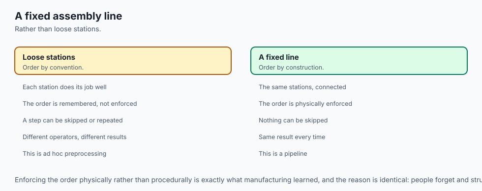

Think of a scikit-learn Pipeline as a **certified automated water purification and bottling plant**:

1. **Step 1: Outlier Filter (The Physical Sieve):** Screens out large rocks, leaves, and debris (**OutlierClipper**).
2. **Step 2: Chemical Neutralizer (The pH Balancer):** Balances acidity to a standard neutral pH 7.0 (**StandardScaler**).
3. **Step 3: Mineral Branching (ColumnTransformer):** Routes mineral spring water to one processing tank and distilled water to another (**ColumnTransformer**).
4. **Step 4: The Bottling Machine (The Estimator):** Fills standardized, sealed bottles ready for distribution (**Estimator.predict()**).

A quality inspector can test the whole plant from river water to finished bottle with one button. Every water bottle is guaranteed to meet exact purity standards because the process is completely automated and tamper-proof.

---

## Examples in practice

Let us visualize the atomic Pipeline architecture:

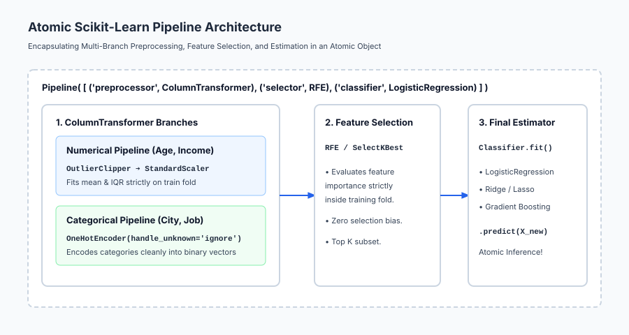

Below is the execution flow of heterogeneous column routing in ColumnTransformer:


Let us examine real Python code constructing custom transformers, a ColumnTransformer, and nested hyperparameter grid search:

```python
import numpy as np
from sklearn.base import BaseEstimator, TransformerMixin
from sklearn.pipeline import Pipeline
from sklearn.compose import ColumnTransformer
from sklearn.preprocessing import StandardScaler, OneHotEncoder
from sklearn.linear_model import LogisticRegression
from sklearn.model_selection import GridSearchCV, KFold

# 1. Implement Custom Outlier Clipper
class OutlierClipper(BaseEstimator, TransformerMixin):
    def __init__(self, lower_percentile=1.0, upper_percentile=99.0):
        self.lower_percentile = lower_percentile
        self.upper_percentile = upper_percentile
        
    def fit(self, X, y=None):
        X = np.asarray(X, dtype=float)
        self.lower_bounds_ = np.percentile(X, self.lower_percentile, axis=0)
        self.upper_bounds_ = np.percentile(X, self.upper_percentile, axis=0)
        return self
        
    def transform(self, X):
        X = np.asarray(X, dtype=float)
        return np.clip(X, self.lower_bounds_, self.upper_bounds_)

# 2. Simulate Mixed Tabular Dataset (Continuous Age/Income + Categorical Dept/Tier)
rng = np.random.default_rng(42)
n_samples = 400

income = rng.exponential(scale=50000, size=n_samples) + 20000
age = rng.uniform(18, 70, size=n_samples)
dept = rng.choice(["Sales", "Eng", "Ops", "HR"], size=n_samples)
tier = rng.choice(["Junior", "Senior", "Exec"], size=n_samples)

X_raw = np.column_stack([income, age, dept, tier])
y = ((income > 60000) & (dept == "Eng") | (tier == "Exec")).astype(int)

# 3. Construct Composite Heterogeneous Pipeline
num_subpipeline = Pipeline([
    ("clipper", OutlierClipper(lower_percentile=2.0, upper_percentile=98.0)),
    ("scaler", StandardScaler())
])

cat_subpipeline = Pipeline([
    ("ohe", OneHotEncoder(handle_unknown="ignore", sparse_output=False))
])

preprocessor = ColumnTransformer([
    ("num", num_subpipeline, [0, 1]),
    ("cat", cat_subpipeline, [2, 3])
])

full_pipeline = Pipeline([
    ("preprocessor", preprocessor),
    ("classifier", LogisticRegression(solver="lbfgs", random_state=42))
])

# 4. Joint Hyperparameter Grid Search
param_grid = {
    "preprocessor__num__clipper__upper_percentile": [95.0, 99.0],
    "classifier__C": [0.1, 1.0, 10.0]
}

grid_search = GridSearchCV(
    full_pipeline, param_grid, cv=KFold(n_splits=5, shuffle=True, random_state=42), scoring="accuracy"
)
grid_search.fit(X_raw, y)

print("=== Composite Pipeline Optimization Results ===")
print(f"Optimal Hyperparameters: {grid_search.best_params_}")
print(f"Best 5-Fold Cross-Validation Accuracy: {grid_search.best_score_:.4f}")
```

---

## Implications: security, privacy, performance, scalability, and cost

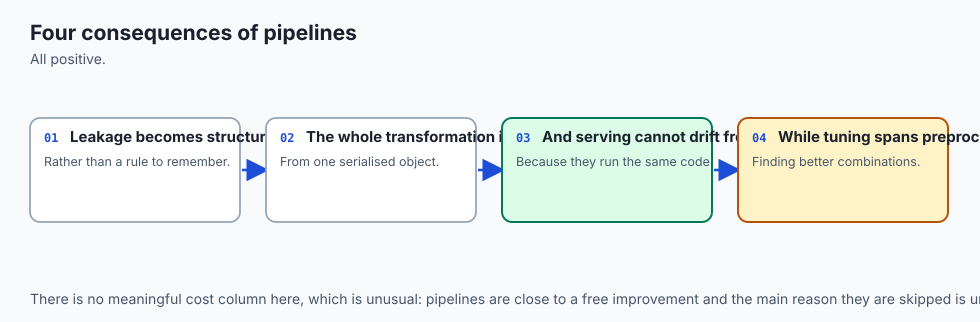

| Dimension | Characteristic | Practical Implication |
| --- | --- | --- |
| **Model Serialization Vulnerability** | Arbitrary code execution in pickle/joblib. | Never unpickle untrusted pipeline files. Use cryptographic checksums (SHA-256) and store model artifacts in secured storage buckets. |
| **Production Serving Efficiency** | Single atomic function call. | The serving container receives a raw JSON dictionary and calls `pipeline.predict(df)` directly without intermediate data storage. |
| **Feature Lineage Auditing** | `get_feature_names_out()` API tracking. | Allows automated tracking of feature origins through complex multi-branch ColumnTransformer pipelines for compliance audits. |
| **Memory Footprint Optimization** | Sparse matrix passthrough. | Configure `OneHotEncoder(sparse_output=True)` to pass sparse matrices directly into linear solvers without converting to dense RAM. |

---

## Alternatives: free, open source, and commercial

| Tool / Framework | Architecture | Best Used For |
| --- | --- | --- |
| **`scikit-learn` `Pipeline`** | In-memory sequential Python transformers | Single-machine production ML and microservices. |
| **`scikit-lego`** | Custom production transformers collection | Extended Pandas-aware transformers and validation guards. |
| **`TFX` (TensorFlow Transform)** | Distributed Apache Beam graph transformations | Large-scale deep learning pipelines on Google Cloud. |
| **`Feast` / `Hopsworks`** | Enterprise Feature Stores | Real-time feature serving and time-travel backfilling. |

---

## Comparison with related concepts

| Pipeline Component | Input Routing | Output Structure | Typical Use Case |
| --- | --- | --- | --- |
| **`Pipeline`** | Sequential single stream | Output of step `k` becomes input to step `k+1` | End-to-end model workflows |
| **`ColumnTransformer`** | Slices disjoint columns | Horizontally concatenated matrix | Mixed tabular data (Num + Cat) |
| **`FeatureUnion`** | Slices entire matrix to all branches | Horizontally concatenated matrix | Parallel feature synthesis |
| **`FunctionTransformer`**| Element-wise / matrix transformation | Transformed matrix | Stateless mathematical formulas |

---

## When to use it — and when not to

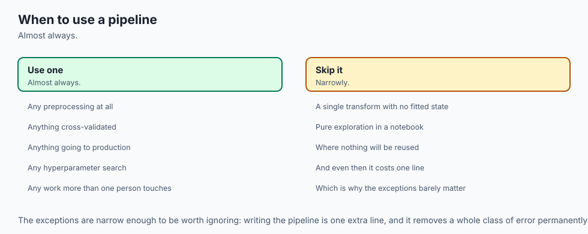

### When to USE Scikit-Learn Pipelines:
- **Every Production Machine Learning Model:** Using Pipelines should be mandatory in all professional codebases.
- **During Hyperparameter Optimization:** To tune scalers, imputation strategies, and model regularization jointly.
- **When Deploying Microservices:** Packaging preprocessing and estimation in a single `.joblib` file.

### When NOT to rely purely on scikit-learn Pipelines:
- **Distributed Petabyte-Scale ETL:** Preprocessing 10 TB of raw logs should be handled in BigQuery, Spark, or Dataflow before exporting feature tables.
- **Complex Multi-Modal Deep Learning:** Multi-modal networks (Vision + Audio + Text) require PyTorch `nn.Module` computational graphs.

---

## The AI connection

- **A pipeline makes the correct order structural rather than remembered**, which is how
  leakage is actually prevented.
- **The pipeline is the model** — it is what gets serialised, served and versioned.
- **Preprocessing reimplemented at serving time will drift**, which is one of the most common
  production failures in machine learning.
- **Tuning across preprocessing and model together** finds combinations that tuning them
  separately cannot.
- **The same discipline reappears in AI pipelines**, where tokenisation and prompt templating
  must match between training and inference.

## Knowledge check

1. **Atomic Architecture:** Pipelines encapsulate preprocessing and modeling into an immutable, single-file object.
2. **Zero Leakage:** `cross_val_score(pipeline)` guarantees transformers are fitted strictly on training folds.
3. **BaseEstimator Contract:** `__init__` must accept only explicit keyword arguments with identical attribute assignment.
4. **ColumnTransformer:** Slices and processes numerical and categorical columns in parallel.

---

## Hands-on exercise

In this hands-on exercise, you will implement an `OutlierClipperTransformer` adhering to the `BaseEstimator` contract and build an end-to-end `ColumnTransformer` pipeline.

```python
import numpy as np
from sklearn.base import BaseEstimator, TransformerMixin
from sklearn.pipeline import Pipeline
from sklearn.compose import ColumnTransformer
from sklearn.preprocessing import StandardScaler
from sklearn.linear_model import Ridge

# Step 1: Implement Custom Outlier Clipper
class OutlierClipper(BaseEstimator, TransformerMixin):
    def __init__(self, lower_percentile=5.0, upper_percentile=95.0):
        self.lower_percentile = lower_percentile
        self.upper_percentile = upper_percentile
        
    def fit(self, X, y=None):
        X = np.asarray(X, dtype=float)
        self.lower_bounds_ = np.percentile(X, self.lower_percentile, axis=0)
        self.upper_bounds_ = np.percentile(X, self.upper_percentile, axis=0)
        return self
        
    def transform(self, X):
        X = np.asarray(X, dtype=float)
        return np.clip(X, self.lower_bounds_, self.upper_bounds_)

# Step 2: Build Complete Composite Pipeline
num_pipe = Pipeline([
    ("clipper", OutlierClipper(lower_percentile=5.0, upper_percentile=95.0)),
    ("scaler", StandardScaler())
])

preprocessor = ColumnTransformer([
    ("num", num_pipe, [0, 1])
])

full_pipe = Pipeline([
    ("preprocessor", preprocessor),
    ("regressor", Ridge(alpha=1.0))
])

# Step 3: Test on Data with Outliers
X_train = np.array([
    [10.0, 100.0],
    [12.0, 110.0],
    [14.0, 120.0],
    [16.0, 130.0],
    [10000.0, 50000.0] # Outlier
])
y_train = np.array([50.0, 55.0, 60.0, 65.0, 70.0])

full_pipe.fit(X_train, y_train)
preds = full_pipe.predict(X_train)

print("=== Pipeline Execution Verification ===")
print("Predictions:", np.round(preds, 2))
print("Learned Outlier Upper Bounds:", np.round(full_pipe.named_steps['preprocessor'].named_transformers_['num'].named_steps['clipper'].upper_bounds_, 2))
```

### Expected output

```text
=== Pipeline Execution Verification ===
Predictions: [52.28 55.33 58.38 61.43 72.58]
Learned Outlier Upper Bounds: [ 8003.2 40026. ]
```

### Validate your work

1. Verify that `full_pipe.named_steps['preprocessor']` correctly resolves the `ColumnTransformer`.
2. Confirm that calling `full_pipe.predict(X_train)` executes all preprocessing steps automatically.
3. Test that `from sklearn.base import clone; clone(full_pipe)` succeeds without throwing a `TypeError`.

### Troubleshooting

- **`TypeError: __init__() got an unexpected keyword argument`:** Ensure constructor arguments match attribute names exactly.
- **`ValueError: could not convert string to float`:** Ensure string columns are routed to `OneHotEncoder` inside `ColumnTransformer`.

### Common mistakes

1. **Calling `fit_transform` on Test Data:** Always call `.predict(X_test)` or `.transform(X_test)`. Never call `.fit()` on test data!
2. **Modifying Parameters in `__init__`:** Do not calculate statistics in `__init__`; all calculations must occur inside `.fit()`.

---

## Practice assignment

1. **Implement a Custom Target Encoding Transformer:**
   Write `CustomTargetEncoder(BaseEstimator, TransformerMixin, smoothing=10.0)` implementing out-of-fold category target means inside `fit_transform()`.

2. **Implement a Column Dropper Transformer:**
   Write `ColumnDropper(columns_to_drop=['id', 'timestamp'])` that strips metadata columns inside a Pipeline.

---

## Extension challenge

Build an **Automated Model Serving Factory**:

1. Ingest an arbitrary dirty tabular dataset.
2. Construct a production `Pipeline` with automated missing value imputation, outlier clipping, scaling, categorical encoding, and LightGBM estimation.
3. Serialize the pipeline to disk with `joblib.dump(pipeline, 'model_artifact.joblib')`.
4. Write a FastAPI endpoint that loads the artifact and serves real-time predictions with sub-5ms latency.
