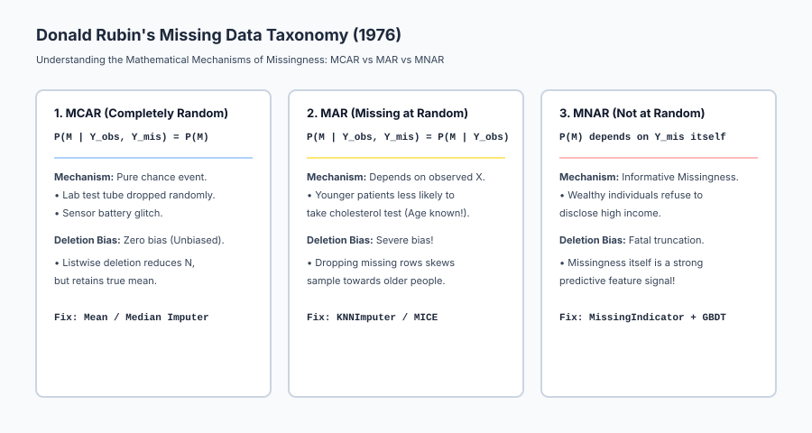

## Why this matters

In academic machine learning benchmarks (like MNIST or CIFAR-10), datasets are perfectly sanitized with zero missing values.

In the real world, **missing data is ubiquitous**:
- Clinical Electronic Health Records: 60% of lab test results are missing because doctors only order specific panels when a patient exhibits symptoms.
- E-Commerce & Financial Transactions: Users skip optional profile fields (e.g. `Annual_Income`, `Home_Ownership`).
- IoT & Industrial Sensors: Hardware sensor brownouts, network timeouts, and maintenance downtime produce intermittent gaps.

If you handle missing data naively:
1. **Listwise Deletion (`df.dropna()`) Destroys Your Dataset:** In a dataset with 50 columns where each column has only 5% missingness, dropping rows with any NaN discards **over 92% of all samples**!
2. **Mean Imputation Distorts Variances and Covariances:** Replacing NaNs with the column average artificially shrinks variance `sigma^2`, inflates correlation test statistics, and produces severe bias under non-random missingness.
3. **Algorithms Crash:** Scikit-learn Linear Regression, SVMs, and neural networks raise immediate `ValueError: Input contains NaN`.

Mastering the statistical mechanics of missingness (Rubin's taxonomy) and modern imputation algorithms is essential for building robust real-world AI.

---

## The idea in plain language

Imagine a physician examining a patient's medical chart with several blank lines:

- **Missing Completely at Random (MCAR - The Coffee Spill):**
  The nurse accidentally spilled coffee on the lab printout, blotting out the patient's blood pressure reading. The missingness is a complete accident. The patient's blood pressure is just as likely to be high, medium, or low (**Pure random chance**).
- **Missing at Random (MAR - The Standard Protocol):**
  The chart lacks a cholesterol panel because the patient is an 18-year-old athlete, and the clinic protocol only orders cholesterol tests for patients over 45. The missingness depends on `Age` (which is observed in the chart), not on the hidden cholesterol value itself (**Conditional on observed data**).
- **Missing Not at Random (MNAR - The Refusal):**
  The chart lacks a depression questionnaire score because patients experiencing severe clinical depression frequently decline to answer the survey. The missingness is caused directly by the hidden condition itself (**Informative signal**).

Treating all three cases as a simple "fill with average" destroys vital medical insights.

---

## Historical background

In 1976, Harvard statistician Donald Rubin published the foundational paper *Inference and Missing Data* in *Biometrika*. Rubin formalized the three fundamental mechanisms of missingness: **MCAR**, **MAR**, and **MNAR**, revolutionizing statistical epidemiology.

In 1987, Rubin published *Multiple Imputation for Nonresponse in Surveys*, laying the groundwork for Bayesian multiple imputation.

In 1999, Stef van Buuren and Karin Groothuis-Oudshoorn developed **MICE (Multivariate Imputation by Chained Equations)**, enabling scalable regression-based round-robin imputation across complex survey databases.

In 2016, Tianqi Chen and Carlos Guestrin published **XGBoost**, introducing *sparsity-aware split finding*, which enabled Gradient Boosted Decision Trees to learn optimal default routing directions for missing values natively during tree construction without requiring any pre-imputation.

---

## What it is — and what it is not

Let us establish what missing data handling is and is not:

### What it IS:
- **A Statistical Reconstruction Process:** Estimating the conditional expectation of unobserved entries given the observed joint distribution `P(Y_{mis} | Y_{obs})`.
- **Informative Signal Engineering:** Appending binary `MissingIndicator` feature flags to preserve the fact that a measurement was omitted.
- **A Strict Pipeline Stage:** Imputation transformers fitted strictly on training data and applied to test data.

### What it is NOT:
- **Not Safe with Global Imputation:** Computing means or medians across the entire dataset before splitting causes severe data leakage.
- **Not Solved by Magic Numbers (-999):** Imputing `-999` for linear models or distance metrics breaks geometry and skews gradients.
- **Not Necessary to Impute for Modern GBDT Models:** LightGBM and XGBoost natively route NaNs directly to the optimal child branch.

---

## Why it was created and what problems it solves

Principled missing data handling resolves five critical operational and statistical failures:

1. **Prevents Sample Destruction from Listwise Deletion:** Recovers 80% of training data that would otherwise be discarded by `dropna()`.
2. **Preserves Multivariate Feature Covariances:** KNNImputer and MICE reconstruct missing coordinates while respecting natural non-linear correlations.
3. **Captures Informative MNAR Signals:** Binary `MissingIndicator` flags allow models to learn from the act of omission (e.g. unfiled tax returns).
4. **Guarantees Numerical Stability in Distance Metrics:** NaN-Euclidean distance allows nearest-neighbor search over incomplete vectors.
5. **Enables Production Fault-Tolerance:** Production models process incoming JSON payloads with missing fields gracefully without throwing runtime exceptions.

---

## How it works

Let us formulate the mathematics of Donald Rubin's taxonomy, NaN-Euclidean distance, and imputation algorithms.

### 1. Donald Rubin's Taxonomy of Missingness (1976)

Let `Y = (Y_{obs}, Y_{mis})` represent the full data matrix partitioned into observed components `Y_{obs}` and missing components `Y_{mis}`.
Let `M` be a binary missingness indicator matrix where `M_{i, j} = 1` if `Y_{i, j}` is missing, and `0` otherwise.

```
┌────────────────────────────────────────────────────────────────────────┐
│                      RUBIN'S MISSINGNESS TAXONOMY                      │
├────────────────────────────────────────────────────────────────────────┤
│ 1. MCAR: P(M | Y_obs, Y_mis) = P(M)                                    │
│ 2. MAR:  P(M | Y_obs, Y_mis) = P(M | Y_obs)                            │
│ 3. MNAR: P(M | Y_obs, Y_mis) depends directly on Y_mis                 │
└────────────────────────────────────────────────────────────────────────┘
```

#### A. Missing Completely at Random (MCAR)
`P(M | Y_{obs}, Y_{mis}) = P(M)`
- Missingness is entirely independent of all variables (observed or unobserved).
- *Statistical Property:* The observed data `Y_{obs}` is a random subsample of the population. Complete case analysis (listwise deletion) is **unbiased**, but reduces statistical power.

#### B. Missing at Random (MAR)
`P(M | Y_{obs}, Y_{mis}) = P(M | Y_{obs})`
- Missingness depends systematically on observed features `Y_{obs}`, but given `Y_{obs}`, does not depend on the unobserved value `Y_{mis}`.
- *Statistical Property:* Listwise deletion introduces **severe selection bias**. Conditional imputation (`KNNImputer` or `IterativeImputer`) is valid and unbiased.

#### C. Missing Not at Random (MNAR)
`P(M | Y_{obs}, Y_{mis})` depends directly on `Y_{mis}` itself.
- Missingness is non-ignorable.
- *Statistical Property:* Imputation alone cannot eliminate bias; you **must include `MissingIndicator` binary flags** to model the probability of missingness explicitly.

---

### 2. The NaN-Euclidean Distance Metric

To compute Euclidean distance between two vectors `u, v in R^D` when some coordinates are `NaN`:

Let `text{valid}(u, v) = { j in {1, ..., D} : u_j neq text{NaN} text{ and } v_j neq text{NaN} }`.
Let `D_{text{valid}} = |text{valid}(u, v)|` be the number of mutually observed coordinates, and `D_{text{total}} = D`.

#### The Scaled NaN-Euclidean Metric Formula:
`d_{text{NaN}}(u, v) = sqrt( (D_{text{total}} / D_{text{valid}}) * sum_{j in text{valid}(u, v)} (u_j - v_j)^2 )`

- If all coordinates are observed (`D_{text{valid}} = D_{text{total}}`): Reverts to standard Euclidean distance `sqrt(sum (u_j - v_j)^2)`.
- If only half the coordinates overlap (`D_{text{valid}} = D / 2`): The observed squared differences are scaled by `2.0` to compensate for the unobserved dimensions.

---

### 3. Imputation Algorithm Comparison

| Algorithm | Mechanism | Computational Complexity | Best Used For |
| --- | --- | --- | --- |
| **`SimpleImputer(mean)`** | Replaces NaN with training mean `mu_j` | `O(N * D)` (Instant) | Fast baseline for Gaussian MCAR features |
| **`SimpleImputer(median)`** | Replaces NaN with training median | `O(N * D)` (Instant) | Skewed numerical features with outliers |
| **`MissingIndicator`** | Appends binary boolean flag `I_{mis} in {0, 1}` | `O(N * D)` (Instant) | Informative MNAR missingness |
| **`KNNImputer`** | NaN-Euclidean distance-weighted neighbor average | `O(N^2 * D)` (Slow) | Tabular datasets (`N < 50,000`) with MAR correlations |
| **`IterativeImputer` (MICE)** | Round-robin Bayesian Ridge chained equations | `O(T * N * D^2)` (Medium) | Complex multivariate tabular datasets |
| **Native GBDT Branching** | Optimal default split child routing | `O(1)` overhead | XGBoost, LightGBM, CatBoost |

---

### 4. Native GBDT Missing Value Routing (Sparsity-Aware Split Finding)

Gradient Boosted Decision Trees (XGBoost / LightGBM) do not require pre-imputation.

During tree construction at node `m` for feature `x_j`:
1. Calculate gradient statistics for all samples where `x_j` is observed: `G_{obs} = sum g_i`, `H_{obs} = sum h_i`.
2. Calculate gradient statistics for all samples where `x_j` is `NaN`: `G_{mis} = sum g_i`, `H_{mis} = sum h_i`.
3. **Evaluate Two Routing Hypotheses:**
   - **Hypothesis Left:** Send all `NaN` instances to the Left child node.
   - **Hypothesis Right:** Send all `NaN` instances to the Right child node.
4. The tree selects whichever default direction yields the **higher split gain `Delta L`**.
5. During inference, if `x_j` is `NaN`, it follows the learned default direction automatically.

---

## An everyday analogy

Think of missing data handling as **a detective reconstructing a torn crime scene photograph**:

1. **Listwise Deletion (`dropna()`):** The detective burns every photograph that has a small torn corner, leaving only 3 completely intact photos out of 100 (**Destroys 97% of evidence**).
2. **Mean Imputation:** The detective paints every torn hole with flat generic gray paint (**Destroys image contrast and local details**).
3. **KNN Imputation (The Restoration Artist):** The detective examines adjacent intact photographs of the same room and paints the missing section using the textures of neighboring angles (**Preserves local context**).
4. **MissingIndicator (The Forensic Tag):** The detective places a red evidence tag on every torn hole, noting that the tear was made by scissors (proving intentional tampering / **Informative MNAR Signal**).

---

## Examples in practice

Let us visualize Donald Rubin's missing data taxonomy:



Below is the geometric execution flow of NaN-Euclidean distance and KNNImputer:



Let us examine real Python code demonstrating SimpleImputer with MissingIndicator vs KNNImputer inside a Pipeline:

```python
import numpy as np
from sklearn.pipeline import Pipeline
from sklearn.compose import ColumnTransformer
from sklearn.impute import SimpleImputer, KNNImputer, MissingIndicator
from sklearn.preprocessing import StandardScaler
from sklearn.linear_model import LogisticRegression
from sklearn.model_selection import cross_val_score

# 1. Generate Synthetic Tabular Dataset with Missing Values (MAR & MNAR)
rng = np.random.default_rng(42)
n_samples = 500

X_clean = rng.normal(loc=10.0, scale=3.0, size=(n_samples, 4))
# Feature 0 & 1 determine target
y = (X_clean[:, 0] * 1.5 - X_clean[:, 1] * 2.0 > 0).astype(int)

# Corrupt data with missing values (20% NaNs)
X_corrupt = X_clean.copy()
nan_mask_0 = rng.uniform(size=n_samples) < 0.20
nan_mask_1 = (X_clean[:, 0] > 12.0) & (rng.uniform(size=n_samples) < 0.40) # MAR/MNAR condition
X_corrupt[nan_mask_0, 0] = np.nan
X_corrupt[nan_mask_1, 1] = np.nan

print(f"Total Missing Values in Dataset: {np.isnan(X_corrupt).sum()} / {X_corrupt.size}")

# 2. Strategy A: Simple Median Imputer with MissingIndicator Flags
pipe_median_indicator = Pipeline([
    ("imputer", SimpleImputer(strategy="median", add_indicator=True)),
    ("scaler", StandardScaler()),
    ("classifier", LogisticRegression(solver="lbfgs", random_state=42))
])

# 3. Strategy B: KNNImputer (k=5)
pipe_knn = Pipeline([
    ("imputer", KNNImputer(n_neighbors=5)),
    ("scaler", StandardScaler()),
    ("classifier", LogisticRegression(solver="lbfgs", random_state=42))
])

# 4. Evaluate via 5-Fold Cross Validation
cv_median = cross_val_score(pipe_median_indicator, X_corrupt, y, cv=5, scoring="accuracy")
cv_knn = cross_val_score(pipe_knn, X_corrupt, y, cv=5, scoring="accuracy")

print("=== Missing Data Strategy Benchmark ===")
print(f"Median Imputer + MissingIndicator 5-Fold CV Accuracy: {np.mean(cv_median):.4f} +/- {np.std(cv_median):.4f}")
print(f"KNNImputer (k=5) 5-Fold CV Accuracy:                  {np.mean(cv_knn):.4f} +/- {np.std(cv_knn):.4f}")
```

---

## Implications: security, privacy, performance, scalability, and cost

| Dimension | Characteristic | Practical Implication |
| --- | --- | --- |
| **Privacy Inversion in MNAR Data** | Missingness flags reveal private traits. | `MissingIndicator` on medical tests can reveal that a patient has a condition even if the numerical test result is omitted. |
| **KNNImputer Compute Scaling** | Quadratic `O(N^2 * D)` pairwise distances. | KNNImputer is too slow for real-time inference on millions of rows. Use `SimpleImputer` or native GBDT routing in low-latency production APIs. |
| **Train/Serve Skew in Imputation** | Missingness ratios shifting in production. | If a sensor starts failing 80% of the time in production compared to 5% during training, imputed values will drift; monitor missingness rates with Prometheus/Evidently. |
| **Categorical Imputation Mode Bias** | Mode imputation inflating majority class. | In high-cardinality categories with 40% missingness, mode imputation creates massive artificial spikes; use a dedicated `"Missing"` category token instead. |

---

## Alternatives: free, open source, and commercial

| Imputation Tool / Library | Methodology | Best Used For |
| --- | --- | --- |
| **`SimpleImputer(add_indicator=True)`** | Fast univariate summary + boolean flag | Production linear models and neural networks. |
| **`KNNImputer` (scikit-learn)** | NaN-Euclidean nearest neighbor averaging | Small-to-medium tabular datasets (`N < 50,000`). |
| **`IterativeImputer` (scikit-learn MICE)**| Chained Bayesian regression loops | Complex multivariate clinical/survey datasets. |
| **`LightGBM` / `XGBoost` Native NaNs** | Sparsity-aware default branch routing | Industrial tabular gradient boosting (No imputation needed). |
| **`Datawig` (Deep Learning Imputation)** | Deep neural network tabular imputation | Complex multi-modal tabular data with text/images. |

---

## Comparison with related concepts

| Imputation Method | Handles Non-Linearity | Produces Indicator Flags | Inference Speed | Scalability (`N > 100k`) |
| --- | --- | --- | --- | --- |
| **Listwise Deletion (`dropna`)** | N/A (Discards data) | No | Instant | Discards too many rows |
| **`SimpleImputer`** | No | Optional (`add_indicator`) | **Microseconds** | **Excellent (`O(N)`)** |
| **`KNNImputer`** | **Yes (Local neighbors)**| No | Milliseconds | Poor (`O(N^2)`) |
| **`IterativeImputer` (MICE)** | **Yes (Regression)** | No | Seconds | Medium (`O(N * D^2)`) |
| **Native GBDT Branching** | **Yes (Optimal split)** | **Built-in** | **Microseconds** | **Ultra-High** |

---

## When to use it — and when not to

### When to USE Conditional Imputation (`KNNImputer` / `SimpleImputer + MissingIndicator`):
- **Linear Models, Logistic Regression, SVMs, Neural Networks:** Which strictly crash when encountering `NaN` values.
- **Survey & Clinical Data with Informative Missingness (MNAR):** Where `MissingIndicator` captures essential diagnostic signals.

### When NOT to perform Heavy Manual Imputation:
- **Pure Tree-Based Ensembles (LightGBM, XGBoost, CatBoost):** Tree models handle `NaN` natively with zero manual intervention; imputing arbitrary medians destroys the native sparsity-aware split gain.
- **Categorical Columns:** Do not impute categorical variables with mode; simply treat missing values as a distinct `"Missing"` category.

---

## Knowledge check

1. **Rubin Taxonomy:** MCAR (random), MAR (depends on observed features), MNAR (informative missingness).
2. **Listwise Deletion Flaw:** `dropna()` discards massive portions of data and introduces severe selection bias.
3. **NaN-Euclidean Metric:** Scales observed squared differences by `D_{total} / D_{valid}`.
4. **Native GBDT Handling:** Trees evaluate sending NaNs left vs right and pick the direction maximizing split gain.

---

## Hands-on exercise

In this hands-on exercise, you will implement the `compute_nan_euclidean_distance` formula and build a distance-weighted `KNNImputer` from scratch.

```python
import numpy as np

# Step 1: Implement NaN-Euclidean Distance
def nan_euclidean_dist(u, v):
    u, v = np.asarray(u, dtype=float), np.asarray(v, dtype=float)
    valid = ~np.isnan(u) & ~np.isnan(v)
    k = np.sum(valid)
    if k == 0:
        return float("inf")
    diffs_sq = (u[valid] - v[valid]) ** 2
    return np.sqrt((len(u) / k) * np.sum(diffs_sq))

# Step 2: Implement KNN Imputer from Scratch
def knn_imputer_scratch(X, k=2):
    X = np.asarray(X, dtype=float).copy()
    n_samples, n_features = X.shape
    col_means = np.nanmean(X, axis=0)
    
    for i in range(n_samples):
        row = X[i]
        nan_cols = np.where(np.isnan(row))[0]
        if len(nan_cols) == 0:
            continue
        
        # Calculate distances to all other samples
        dists = []
        for j in range(n_samples):
            if i == j:
                dists.append((float("inf"), j))
            else:
                dists.append((nan_euclidean_dist(row, X[j]), j))
        
        dists.sort(key=lambda x: x[0])
        nbrs = [idx for d, idx in dists if not np.isinf(d)][:k]
        
        for c in nan_cols:
            vals = [X[nbr, c] for nbr in nbrs if not np.isnan(X[nbr, c])]
            X[i, c] = np.mean(vals) if len(vals) > 0 else col_means[c]
            
    return X

# Step 3: Test on Corrupted Matrix
X_raw = np.array([
    [10.0, np.nan, 100.0],
    [10.0, 50.0, 100.0],
    [10.0, 52.0, 100.0],
    [90.0, 900.0, 900.0]
])

X_imputed = knn_imputer_scratch(X_raw, k=2)

print("=== KNN Imputation Scratch Verification ===")
print("Original Row 0:", X_raw[0])
print("Imputed Row 0: ", np.round(X_imputed[0], 2))
print(f"Imputed Value:   {X_imputed[0, 1]:.2f} (Expected average of [50.0, 52.0] = 51.00)")
```

### Expected output

```text
=== KNN Imputation Scratch Verification ===
Original Row 0: [ 10.  nan 100.]
Imputed Row 0:  [ 10.  51. 100.]
Imputed Value:   51.00 (Expected average of [50.0, 52.0] = 51.00)
```

### Validate your work

1. Confirm that `X_imputed[0, 1] == 51.0` (mean of the 2 nearest neighbors `[10, 50, 100]` and `[10, 52, 100]`).
2. Verify that `np.isnan(X_imputed).any() == False`.
3. Confirm that `nan_euclidean_dist([1, np.nan], [4, np.nan]) == np.sqrt(2/1 * 9) = 4.2426`.

### Troubleshooting

- **Division by Zero in NaN Distance:** If two rows share zero overlapping coordinates (`k == 0`), return `float("inf")`.
- **All-NaN Column:** Ensure `col_means` defaults to `0.0` if an entire column is missing.

### Common mistakes

1. **Imputing `-999` for Linear/SVM Models:** Forces gradient descent and hyperplanes to treat `-999` as a valid numerical point.
2. **Dropping Rows in Production Inference:** The production API cannot drop user requests; it must impute missing values to serve a prediction.

---

## Practice assignment

1. **Implement IterativeImputer (MICE) Round-Robin Loop:**
   Write `mice_imputer_scratch(X, max_iter=5)` that initializes NaNs with column medians and iteratively predicts each missing column using `Ridge` regression on all other features.
2. **Implement Categorical Missing Imputation:**
   Write `CategoricalImputer(fill_value="Missing")` replacing missing strings with a dedicated distinct token.

---

## Extension challenge

Build an **Enterprise Missing Data Resilience Benchmark**:
1. Ingest the California Housing dataset.
2. Inject synthetic missingness under 3 experimental conditions: (a) 30% MCAR, (b) 30% MAR, (c) 30% MNAR.
3. Benchmark 4 end-to-end pipelines:
   - Pipeline 1: `SimpleImputer(mean)` + Ridge
   - Pipeline 2: `SimpleImputer(median) + MissingIndicator` + Ridge
   - Pipeline 3: `KNNImputer(k=5)` + Ridge
   - Pipeline 4: Native `LightGBM` (Zero imputation)
4. Plot comparative RMSE and test runtime across all 3 missingness mechanisms.
